# SecLog Go-基于论文的安全应用分析-先知社区

> **来源**: https://xz.aliyun.com/news/16818  
> **文章ID**: 16818

---

## 论文引入-Improving Logging to Reduce Permission Over-Granting Mistakes

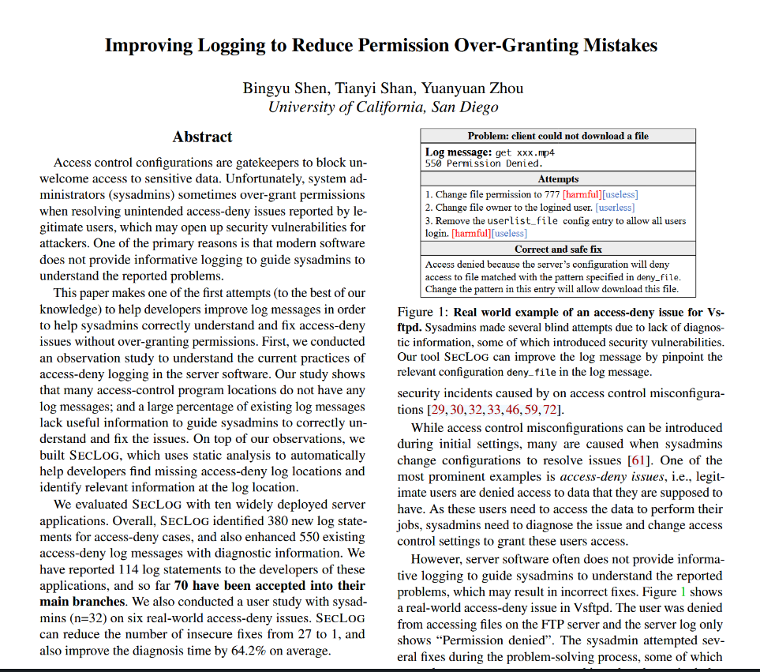

### 访问控制引入

访问控制（Access Control）是保护系统、数据和资源安全的关键技术。它通过限制未经授权的访问，保护敏感信息、资源和系统免受恶意攻击或误操作。在如今的数据时代中，访问控制无处不在，以下是几个典型案例：

* 文件系统的访问控制：可用于防止企业或组织的敏感数据泄露。
* 数据库的访问控制：可防止机密或隐私数据被攻击者非法访问或破坏。
* 云存储共享权限中的访问控制：用户使用 Google Drive、Dropbox 等云存储服务来存储和共享个人文件时，系统通过访问控制保护用户数据隐私。

因此，访问控制策略的实现对于系统而言有着防止数据泄露、防止权限滥用、抵御外部攻击的重要作用。也正因如此，访问控制过程往往是攻击者挖掘漏洞与系统缺陷，从而谋取利益的重要切入点。

### 核心内容概述

系统管理员在处理访问拒绝（access-deny）问题时往往由于日志信息不足而过度授予权限，从而引发安全隐患。现代计算机系统依赖访问控制策略来保护数据和资源，但即便是细微的配置错误，也可能导致严重的安全后果。

研究表明，SECLOG能有效提升访问拒绝日志的质量，显著减少系统管理员在问题处理中的误判概率，为系统安全管理提供了强有力的技术支持。

### **问题背景**

系统管理员需要定制访问控制配置以实现安全目标，但在实际操作中，当合法用户报告访问被拒时，管理员可能缺乏详细的日志信息来准确定位和解决问题。这种情况下，他们可能会采取“过度授权”的方式进行临时修复，反而导致更大的安全漏洞。

论文提到了一些典型问题：

1. **文件访问**：某Web服务器返回“权限拒绝”日志，但未说明拒绝访问的文件路径或涉及的用户角色。系统管理员可能通过放宽文件夹权限解决问题，意外地授予了不必要的访问权限。
2. **数据库查询**：一条简单的错误日志“查询被拒”未明确用户角色或相关的访问规则，导致管理员全局性放宽数据库访问规则以快速解决问题。
3. **API服务**：某API接口返回403错误，但未记录API调用参数和安全策略。管理员可能直接删除限制规则，从而导致敏感数据泄露。

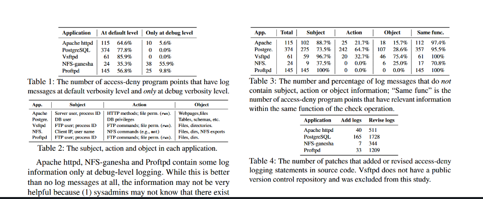

以下是现实中的几个真实案例，展示了访问拒绝问题的日志不足如何影响诊断和安全性，突出了SECLOG的改进作用

#### Vsftpd 拒绝访问问题

* **问题描述**：  
  在Vsftpd FTP服务器中，用户尝试访问服务器上的文件，但访问被拒。服务器日志仅显示模糊的“Permission denied”（权限拒绝）消息，未包含任何上下文信息，导致问题难以诊断。
* **尝试解决**：  
  系统管理员尝试修改用户权限、文件权限以及服务器配置，希望解决问题。然而，由于日志信息不足，他们无法准确定位问题根源，这些尝试甚至导致更广泛的权限开放，暴露了安全风险。
* **SECLOG的作用**：  
  SECLOG通过改进日志消息，记录具体的拒绝原因及相关配置项（如 deny\_file）。它可以明确指出是哪些配置导致了拒绝，从而避免盲目放宽权限的错误操作。

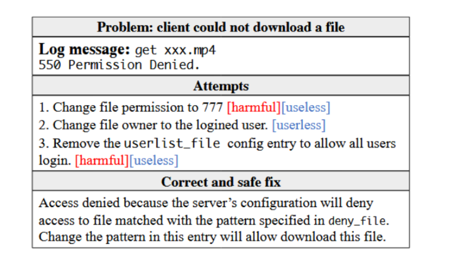

#### **Cherokee Web服务器目录访问问题**

* **问题描述**：  
  在Cherokee Web服务器中，用户尝试访问某个目录时，被静默拒绝，服务器没有记录任何日志消息。
* **影响**：  
  由于缺乏日志记录，系统管理员完全无法得知拒绝的原因。这种情况下，问题的诊断和解决变得极为困难，增加了系统停机时间和管理员的工作量。
* **SECLOG的贡献**：  
  SECLOG可以识别这类静默拒绝行为，并建议生成相关日志记录，详细说明拒绝的资源、原因及相关设置。这为系统管理员提供了必要的信息，帮助其高效解决问题。

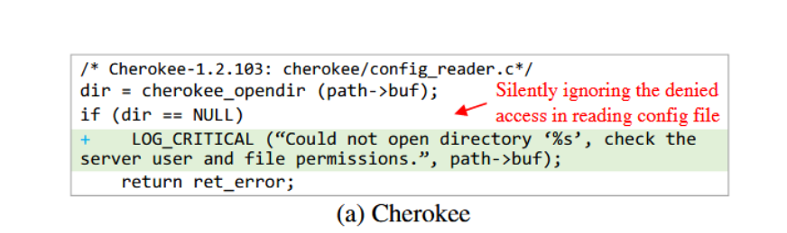

#### Apache httpd 访问控制问题

* **问题描述**：  
  Apache httpd服务器在访问被拒时通常返回HTTP状态码（如403 Forbidden）。然而，日志中缺乏更具体的说明。尽管导致访问拒绝的可能原因包括IP地址限制、请求方法限制或环境变量问题，但日志仅提供通用的“AUTHZ\_DENIED”（授权拒绝）消息。
* **日志不足**：  
  这种笼统的日志信息无法帮助系统管理员快速诊断问题。他们必须手动检查多个配置文件和设置，既耗时又容易出错。
* **SECLOG的改进**：  
  SECLOG可以自动检测访问控制检查的位置，并在日志中建议记录更多详细信息。例如：

* 被拒绝的具体原因。
* 涉及的配置项（如 Require 指令）。
* 涉及的用户或IP地址。  
  这些改进为管理员提供了清晰的诊断依据，显著减少了解决问题的时间。

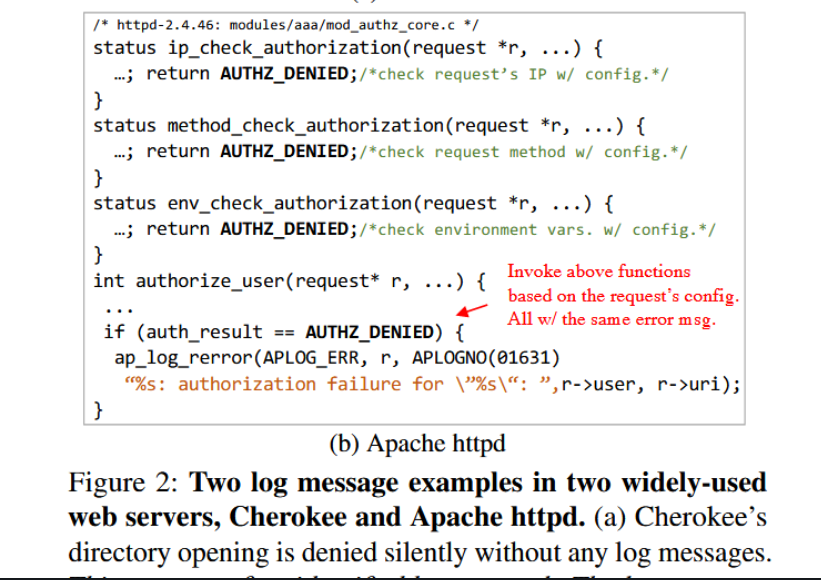

这些案例表明，缺乏详细日志信息会显著增加问题诊断的复杂性，并可能导致不安全的修复。SECLOG通过改进日志消息，帮助系统管理员快速定位问题根源，同时避免过度授权，从而提升系统的安全性和管理效率。

### **日志不足的危害**

这种日志信息的缺失对系统管理员的影响主要表现在：

1. **缺乏上下文**：无法从日志中了解导致问题的根本原因。
2. **误判风险高**：解决问题时往往采取更宽松的权限策略，埋下安全隐患。
3. **诊断成本增加**：管理员需要通过大量试错才能找到问题核心，大幅增加时间开销和系统停机时间。

论文正是针对这些现实问题，提出了改进日志记录的方案，帮助系统管理员安全、高效地处理访问拒绝问题，避免因过度授权而造成的安全事件。

### **SECLOG工具**

基于上述研究，作者开发了名为 **SECLOG** 的工具，通过静态分析技术：

* 自动定位缺失的访问拒绝日志点。
* 提取并记录相关信息，帮助开发者改进日志设计。

工作流程图 -Workflow of SecLog

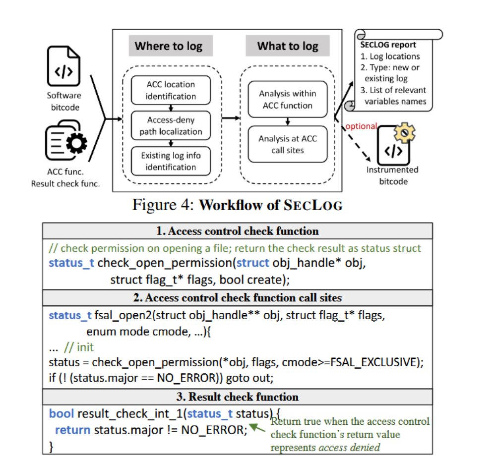

## SecLog-Go用法

创建 Logger

```
seclog.Init(seclog.Config{
        LoggerLevel:   loggerLevel,
        LoggerFile:    loggerFile,
        LogFormatText:  false,
})

logger := seclog.NewLogger(component)
```

* LoggerLevel： 日志级别由低到高分别为 DEBUG、INFO、WARN、ERROR、FATAL 共5个级别，这里设置的级别是日志输出的最低级别，只有不低于该级别的日志才会输出
* LoggerFile： 输出日志的文件名，为空则输出到 os.标准输出
* LogFormatText： 设定日志的输出格式是 json 还是 plaintext

创建具有多个 sinker 的记录器

```
seclog.Init(seclog.Config{
        LoggerLevel:   "DEBUG",
        LoggerFile:    "test.log",
        LogFormatText: false,
        Writers:       []string{"file", "stdout"},
    })

    logger := seclog.NewLogger("example")
```

定义自己的sinker

```
type w struct {
}

func (w *w) Write(p []byte) (n int, err error) {
    fmt.Print("fake")
    return 0, nil
}
func main() {
    seclog.RegisterWriter("test", &w{})
}
```

即时更改日志级别

```
l.SetLogLevel(lager.ERROR)
```

## SecLog-Go的实验分析

获取 Service Center 的最简单方法是使用适用于 Linux、Windows 和 Docker 的预构建版本二进制文件之一。

### 使用发行版运行 Service Center

可以从[ServiceComb网站](http://servicecomb.apache.org/release/)下载最新版本执行启动脚本来运行 Service Center。

Windows（apache-servicecomb-service-center-XXX-windows-amd64.zip）：

```
start-service-center.bat
```

Linux（apache-servicecomb-service-center-XXXX-linux-amd64.tar.gz）：

```
./start-service-center.sh
```

docker环境更方便，运行命令如下

```
docker pull servicecomb/service-center
docker run -d -p 30100:30100 servicecomb/service-center
```

注意：Service-Center 的 Releases 使用了 emebeded etcd，如果想使用单独的 etcd 实例，可以单独部署 etcd 并在此处配置 etcd ip。

```
vi conf/app.conf

## Edit this file
# registry address
# 1. if registry_plugin equals to 'embedded_etcd'
# manager_name = "sc-0"
# manager_addr = "http://127.0.0.1:2380"
# manager_cluster = "sc-0=http://127.0.0.1:2380"
# 2. if registry_plugin equals to 'etcd'
# manager_cluster = "127.0.0.1:2379"
manager_cluster = "127.0.0.1:2379"
```

默认情况下，SC 的端口地址为 127.0.0.1：30100 ，但可以在app.conf更改这些地址的配置。

```
vi conf/app.conf

httpaddr = 127.0.0.1
httpport = 30100
```

## Grafana Web应用SecLog-Go实验

首先是docker的start.sh脚本如下，service-center为编译好的SecLog程序

```
set -e

umask 027

cd /opt/service-center

export SERVER_HOST="$(hostname)"
export LOG_FILE=${LOG_FILE:-''}
export LOG_LEVEL=${LOG_LEVEL:-'DEBUG'}
export gov_kie_type=kie
export gov_kie_endpoint=http://kie:30110
if [ -z "${BACKEND_ADDRESS}" ]; then
  export REGISTRY_KIND=${REGISTRY_KIND:-'embedded_etcd'}
else
  export REGISTRY_KIND=${REGISTRY_KIND:-'etcd'}
  export REGISTRY_ETCD_CLUSTER_ENDPOINTS=${BACKEND_ADDRESS}
fi

./service-center
```

以grafana为例来配合Sec-Log输出，**Grafana** 是一个开源的分析和可视化平台，广泛用于监控、观察和分析数据。它主要通过图表、仪表盘和警报来呈现来自多种数据源的信息，帮助用户更好地理解系统性能、业务流程和其他关键指标。Grafana 常用于与各种监控工具（如 Prometheus、InfluxDB、Elasticsearch、Graphite 等）配合使用，来实现实时数据监控和可视化。

docker环境docker-compose文件如下

```
version: "3"
services:
  sc:
    image: servicecomb/service-center:latest
    ports:
      - "30100:30100"
  # zipkin:
  #   image: openzipkin/zipkin
  #   ports:
  #     - 9411:9411
  #  prom:
  #    command: "--config.file=/etc/prometheus/prometheus.yml"
  #    image: quay.io/prometheus/prometheus:v2.0.0
  #    volumes:
  #      - ./prometheus.yml:/etc/prometheus/prometheus.yml
  #    ports:
  #      - 9090:9090

  grafana:
    image: grafana/grafana
    ports:
      - 3000:3000
```

启动命令

```
docker-compose up -d
```

Web页面如下

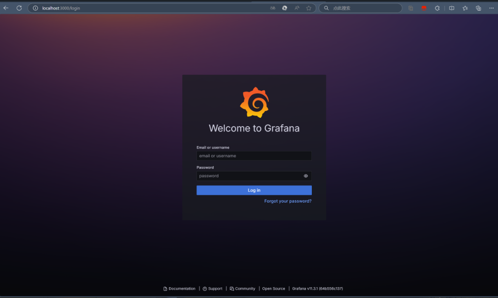  
然后我们观察Sec-log程序的输出，可以发现有非常详细的三个日志级别：DEBUG、INFO、WARN

```
2024-12-04 09:43:34 2024-12-04T01:43:34.215Z    INFO    etcd/ms.go:908  heartbeat successful, renew instance[7062417bf9ebd4c646bb23059003cea42180894a/028dea92f5454ffa8b613c52af2f5ff9] ttl to 120. operator 
2024-12-04 09:43:34 2024-12-04T01:43:34.215Z    DEBUG   etcd/indexer_etcd.go:51 search '/cse-sr/ms/files/default/default/7062417bf9ebd4c646bb23059003cea42180894a' match special options, request etcd server, opts: action=GET&mode=MODE_NO_CACHE&key=/cse-sr/ms/files/default/default/7062417bf9ebd4c646bb23059003cea42180894a&len=0
2024-12-04 09:40:04 2024-12-04T01:40:04.073Z    WARN    state/state_manager.go:153      caches are marked dirty!
```

我们以这段日志为例详细说明其作用

### Grafana应用启动过程Sec-Log日志

#### **INFO 级别日志：heartbeat successful**

```
2024-12-04 09:43:34 2024-12-04T01:43:34.215Z    INFO    etcd/ms.go:908  heartbeat successful, renew instance[7062417bf9ebd4c646bb23059003cea42180894a/028dea92f5454ffa8b613c52af2f5ff9] ttl to 120. operator
```

* **时间戳**：2024-12-04T01:43:34.215Z，该日志记录了一个成功的心跳操作，时间戳显示为 UTC。
* **日志级别**：INFO，说明这是一个普通的操作信息，表示系统正常工作。
* **日志内容**：

* heartbeat successful：表示系统中的某个服务或实例成功发送了心跳信号，这通常用于分布式系统中确认实例的活动状态。
* renew instance[7062417bf9ebd4c646bb23059003cea42180894a/028dea92f5454ffa8b613c52af2f5ff9] ttl to 120：表示某个实例的生命周期被成功续期，ttl（Time To Live）被更新为 120 秒，意味着该实例的状态将在 120 秒后过期，除非再次续期。
* **作用**：该信息对于开发者来说是一个指示系统正常运行的日志，表明心跳机制和实例续期操作执行成功。

#### **DEBUG 级别日志：search request**

```
2024-12-04 09:43:34 2024-12-04T01:43:34.215Z    DEBUG   etcd/indexer_etcd.go:51 search '/cse-sr/ms/files/default/default/7062417bf9ebd4c646bb23059003cea42180894a' match special options, request etcd server, opts: action=GET&mode=MODE_NO_CACHE&key=/cse-sr/ms/files/default/default/7062417bf9ebd4c646bb23059003cea42180894a&len=0
```

* **时间戳**：2024-12-04T01:43:34.215Z，与上一条日志相近，表明它是在同一时刻生成的。
* **日志级别**：DEBUG，表示这是一个调试日志，通常用于开发或调试过程中，记录系统的内部操作。
* **日志内容**：

* search '/cse-sr/ms/files/default/default/7062417bf9ebd4c646bb23059003cea42180894a' match special options：该日志记录了一个 GET 请求，用于查询指定路径的数据。这里的路径是 /cse-sr/ms/files/default/default/7062417bf9ebd4c646bb23059003cea42180894a，这是一个键值对查询。
* request etcd server：请求已发送到 etcd 服务，表明它是在分布式系统中获取键值存储的操作。
* opts: action=GET&mode=MODE\_NO\_CACHE&key=/cse-sr/ms/files/default/default/7062417bf9ebd4c646bb23059003cea42180894a&len=0：具体的请求参数，action=GET 表示获取数据，mode=MODE\_NO\_CACHE 表示不使用缓存，key 是要查询的键，len=0 表示不返回数据的长度。

#### **WARN 级别日志：caches marked dirty**

```
2024-12-04 09:40:04 2024-12-04T01:40:04.073Z    WARN    state/state_manager.go:153      caches are marked dirty!
```

* **日志级别**：WARN，表示这是一个警告信息，通常用于提示可能的问题，可能不会立即影响系统，但需要引起关注。
* **日志内容**：

* caches are marked dirty!：缓存标记为“脏”，通常意味着缓存中的数据被修改或者需要重新加载。这通常发生在缓存失效、数据更新或者状态同步时。

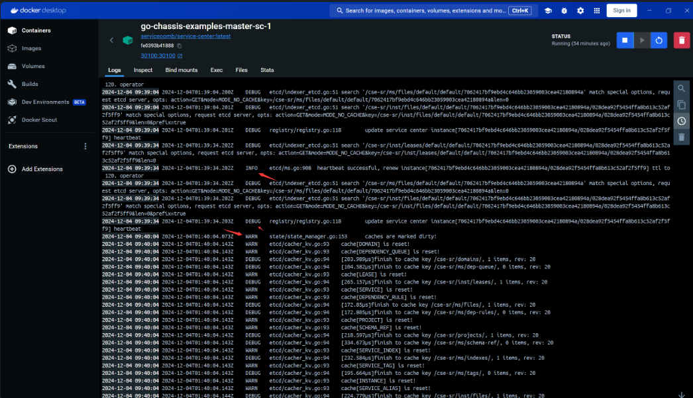

#### 作用分析

Sec-Log 在日志记录方面的改进为开发者提供了更加详细、精准的信息，有助于快速诊断问题、增强安全性、优化系统性能，并且符合合规性需求。这些优势使开发者能够更加高效、安全地管理系统，减少错误修复的潜在风险。

### Login失败Sec-Log日志

接着我们进行第一次登录时由于没有admin账号，导致登陆失败

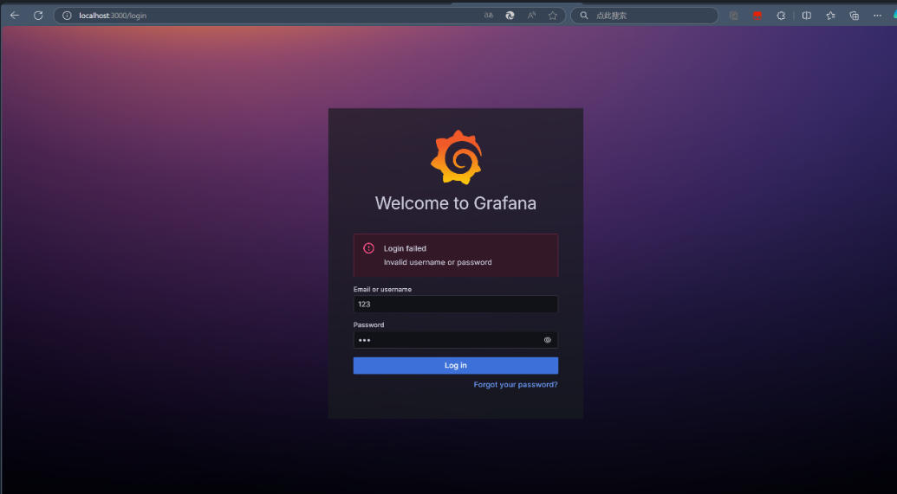  
SecLog日志会有以下输出

```
2024-12-04 09:34:18 logger=authn.service t=2024-12-04T01:34:18.289634928Z level=info msg="Failed to authenticate request" client=auth.client.form error="[password-auth.failed] failed to authenticate identity: [identity.not-found] no user found: user not found"
2024-12-04 09:34:18 logger=context userId=0 orgId=0 uname= t=2024-12-04T01:34:18.289948577Z level=info msg=Unauthorized error="[password-auth.failed] failed to authenticate identity: [identity.not-found] no user found: user not found" remote_addr=172.22.0.1 traceID=
2024-12-04 09:34:18 logger=context userId=0 orgId=0 uname= t=2024-12-04T01:34:18.290040322Z level=info msg="Request Completed" method=POST path=/login status=401 remote_addr=172.22.0.1 time_ms=1 duration=1.872617ms size=107 referer=http://localhost:3000/login handler=/login status_source=server
```

这段 **Sec-Log** 日志记录了一个用户登录请求失败的过程，具体信息如下：

1. **时间戳和日志级别**

```
2024-12-04 09:34:18 logger=authn.service t=2024-12-04T01:34:18.289634928Z level=info
```

详细解释

* 2024-12-04 09:34:18：日志生成的本地时间戳。
* t=2024-12-04T01:34:18.289634928Z：日志的UTC时间戳，精确到纳秒。
* level=info：日志级别为 info，表示这是一条正常的记录，用于记录信息性事件。

1. **认证失败日志**

```
msg="Failed to authenticate request" client=auth.client.form error="[password-auth.failed] failed to authenticate identity: [identity.not-found] no user found: user not found"
```

详细解释

* msg="Failed to authenticate request"：这条日志消息说明用户的认证请求失败。
* client=auth.client.form：表示认证请求来自一个表单（auth.client.form）。
* error="[password-auth.failed] failed to authenticate identity: [identity.not-found] no user found: user not found"：认证失败的具体错误信息，表明认证系统没有找到与输入的身份信息匹配的用户。  
  3. **未授权错误日志**

```
msg=Unauthorized error="[password-auth.failed] failed to authenticate identity: [identity.not-found] no user found: user not found" remote_addr=172.22.0.1 traceID=
```

详细解释

* msg=Unauthorized：表明请求未授权。
* error="[password-auth.failed] failed to authenticate identity: [identity.not-found] no user found: user not found"：再次确认用户认证失败的原因。
* remote\_addr=172.22.0.1：表示尝试登录的客户端 IP 地址。
* traceID=：该字段为空，可能是因为这次请求没有关联到一个完整的追踪记录。  
  4. **请求完成日志**

```
msg="Request Completed" method=POST path=/login status=401 remote_addr=172.22.0.1 time_ms=1 duration=1.872617ms size=107 referer=http://localhost:3000/login handler=/login status_source=server
```

详细解释如下

* msg="Request Completed"：表明请求已经完成。
* method=POST：请求使用了 POST 方法，通常用于表单提交。
* path=/login：请求的路径是 /login，表明这是一个登录请求。
* status=401：HTTP 状态码为 401，表示认证失败（未授权）。
* remote\_addr=172.22.0.1：再次显示客户端的 IP 地址。
* time\_ms=1：请求处理时间为 1 毫秒。
* duration=1.872617ms：完整请求处理的耗时为 1.87 毫秒。
* size=107：响应体的大小为 107 字节。
* referer=http://localhost:3000/login：请求的来源 URL，即该请求是从 localhost:3000/login 页面发起的。
* handler=/login：日志中记录了处理请求的处理器路径。
* status\_source=server：状态来源为服务器本身。

并且通过详细的日志记录每个登录请求和认证失败的信息，Sec-Log 有助于管理员和开发者发现潜在的安全漏洞或攻击模式。比如，如果出现频繁的认证失败（例如同一IP地址的暴力破解尝试），可以及时采取防御措施（如限制登录次数）。

注册登录admin账户之后Web平台页面如下

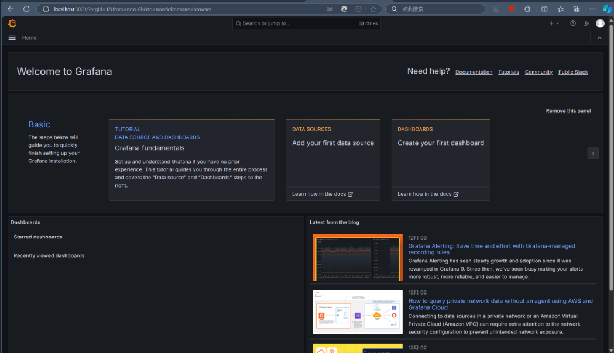  
Sec-Log日志输出如下

```
2024-12-04 09:56:37 logger=context userId=1 orgId=1 uname=admin t=2024-12-04T01:56:37.032422532Z level=info msg="Request Completed" method=GET path=/api/live/ws status=-1 remote_addr=172.17.0.1 time_ms=4 duration=4.783785ms size=0 referer= handler=/api/live/ws status_source=server
```

这条日志来自 Sec-Log，具体记录了一个 HTTP 请求的详细信息，属于 **INFO** 级别。我们逐一解析日志内容。

#### **1. 时间戳与日志级别：**

```
2024-12-04 09:56:37 2024-12-04T01:56:37.032422532Z    level=info
```

* **时间戳**：2024-12-04T01:56:37.032422532Z，显示的是 UTC 时间，精确到毫秒级。
* **日志级别**：INFO，表示这条日志记录的是常规信息，不是错误或警告，仅供了解系统正常操作。

#### **2. 用户信息与请求详情：**

```
logger=context userId=1 orgId=1 uname=admin
```

* userId=1：表示此次请求的用户 ID 是 1，通常指向一个数据库中的用户记录。
* orgId=1：表示该用户属于组织 ID 为 1 的组织。
* uname=admin：表明这次请求是由用户名为 admin 的用户发起的。此信息有助于管理员或开发者追踪是哪个用户发起了请求。

#### **3. 请求路径与状态：**

```
t=2024-12-04T01:56:37.032422532Z msg="Request Completed" method=GET path=/api/live/ws status=-1 remote_addr=172.17.0.1 time_ms=4 duration=4.783785ms size=0 referer= handler=/api/live/ws status_source=server
```

* **msg="Request Completed"**：表示请求已经完成。这条日志记录的是请求生命周期的结束部分。
* **path=/api/live/ws**：请求的具体路径是 /api/live/ws，通常这类路径用于 WebSocket 连接或实时数据流。
* **remote\_addr=172.17.0.1**：表示请求来源的 IP 地址是 172.17.0.1，这通常是客户端的 IP 地址，可以帮助开发者或管理员追踪请求的来源。
* **duration=4.783785ms**：表示请求的处理时间为 4.783 毫秒，通常用于分析系统性能，帮助开发者了解请求处理的延迟。
* **handler=/api/live/ws**：表示处理该请求的处理器是 /api/live/ws，即处理实时 WebSocket 连接的部分。

日志中包含了请求的源 IP 地址、请求方法、路径、响应时间和大小等信息，便于开发者追踪和分析请求的过程，特别是当问题涉及多层架构时（例如涉及数据库、API、应用服务器等）、

## 源码案例分析

​这一部分给出三个软件源码的分析，对比有无Seclog的日志系统的差异。

**PostgreSQL master的源码分析**

首先，我们分析了数据库PostgreSQL的日志系统。在数据库中，用户时常会进行删除访问等操作。为了数据的安全管理，数据库会给用户设定不同的权限等级，当发生越级访问等情况的时候，系统往往需要通过日志做出记录。因此，我们在copy功能中分析PostgreSQL日志系统的性能。

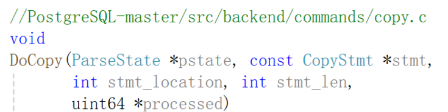

这个函数DoCopy通过一系列步骤处理COPY命令，确保用户有足够的权限，并根据操作类型执行相应的数据复制操作。权限检查、WHERE子句处理和行级安全性检查是其关键步骤。函数处理完成后，返回处理的数据行数。下面是对权限检查部分更详细的分析。

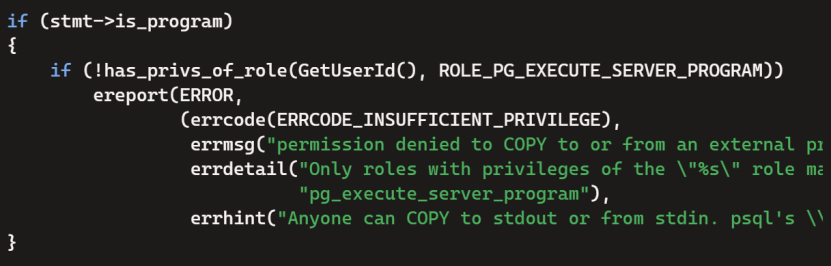


到外部程序或从外部程序复制的权限检查：“permission denied to COPY to or from an external program”，解释只有具有“pg\_execute\_server\_program” 角色权限的用户才能执行操作，提示可以使用stdout或stdin，或者使用psql的\\copy命令。

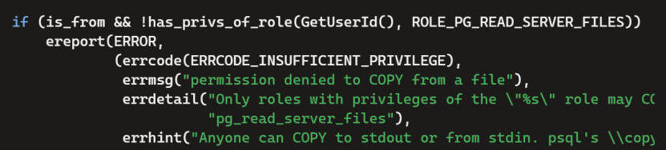

从文件复制的权限检查：“permission denied to COPY from a file”，解释只有具有“pg\_read\_server\_files”角色权限的用户才能从文件中复制数据，提示可以使用stdout或stdin，或者使用psql的\\copy命令。

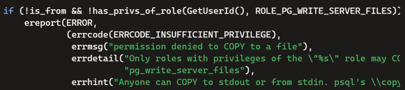

复制到文件的权限检查：“permission denied to COPY to a file”，解释只有具有“pg\_write\_server\_files”角色权限的用户才能复制数据到文件中，提示可以使用stdout或stdin，或者使用psql的\\copy命令。

在数据库中，要想维护好数据安全，一定要做好权限管理和日志记录。在PostgreSQL中，系统记录了错误代码、错误消息、详细信息和提示信息，良好地记录了操作（复制到/从）、对象类型（文件），但是没有记录操作主体（用户）和对象具体名称（文件名或路径）。这其中缺乏的东西正是Seclog力求改变和解决的问题。

​

根据Seclog，我们可以做出如下修改，在日志里添加更详细的内容，包含用户ID和操作对象（文件名或路径），从而有助于系统管理员更好地追踪和调试权限问题。

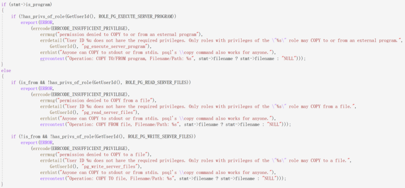


**Apache http server trunk的源码分析**

我们再来看看在Apache中日志系统的表现如何。我们接下来所分析的源码，是最新版的，也就是日志系统已经由Seclog更新过的。

下面这个函数authorize\_user\_core是一个典型的Apache HTTP服务器模块函数，用于执行用户授权检查。


由apply\_authz\_sections函数应用授权部分并获取授权结果后，系统会做出多种包含分支的判断，例如无用户授权失败、授权失败或中立。这些不同的情况都会通过ap\_log\_rerror函数记录下来。观察这些日志记录，它们都是足够详细的，具体分析如下。

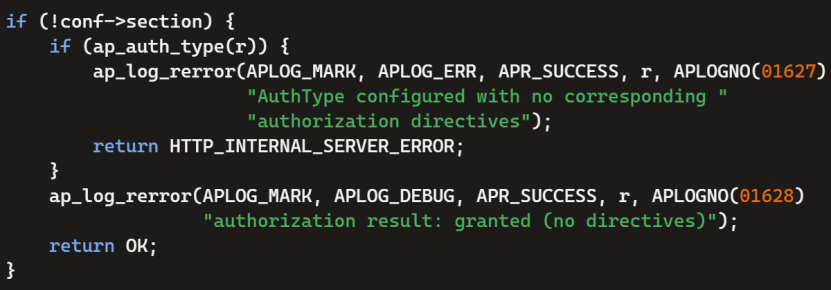

配置了 AuthType 但没有相应的授权指令：“AuthType configured with no corresponding authorization directives”。

当没有配置授权部分时，表示授权通过：“authorization result: granted (no directives)”。

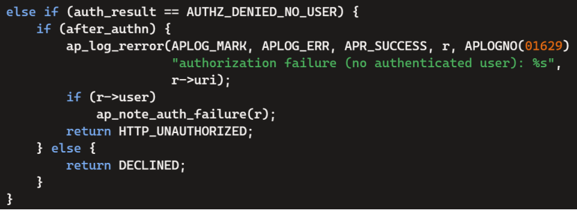

当授权失败且没有经过身份验证的用户时：“authorization failure (no authenticated user): %s”，其中 %s 表示请求的 URI。

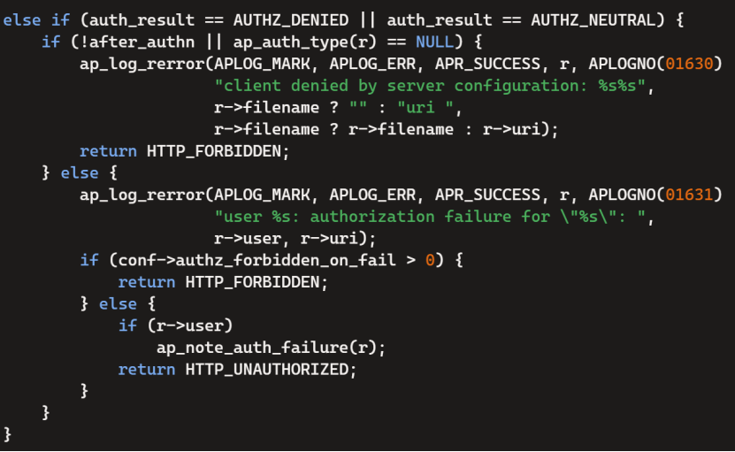

当在身份验证之前或没有配置身份验证类型时：“client denied by server configuration: %s%s”，其中 %s 为文件名或 URI。

当授权失败且经过身份验证的用户存在时：“user %s: authorization failure for \"%s\": ”，其中 %s 分别表示用户和请求的 URI。

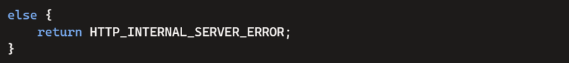

其他情况：假设在模块中已经记录了具体错误，因此无需在此处进行新的日志记录。

显然，经过Seclog的辅助改进，在目前的Apache http服务器中，系统日志能很好地记录主体（用户）、操作类型、操作对象（文件名），这是十分完善优秀的。通过这些日志记录，系统管理员可以清楚地了解授权失败的原因、用户信息、请求的URI以及配置问题，从而便于排查和解决问题。

## Sec-Log应用结语

SecLog通过静态分析和日志增强技术，自动识别缺失的日志位置，并提供有助于系统管理员更好理解和解决访问拒绝问题的信息。能够追踪数据在程序中的流动，识别影响访问控制决策的变量。更容易找出现有日志消息中的关键信息，如用户身份、请求的资源和拒绝的原因。

这些实验结果表明，SECLOG是一个有效的工具，能够帮助开发者改进访问拒绝日志消息，减少系统管理员在解决问题时引入的安全风险，并提高问题解决的效率。同时，SECLOG对服务器性能的影响较小，且易于被开发者采用和集成到开发流程中。

参考文献及文档：  
[sec23summer\_2-shen-prepub.pdf](https://drive.google.com/file/d/1BAEEfhvxoUvpcdN3TznSQN6ouwCVie0m/view?pli=1)  
[SECLOG - IBM 文档](https://www.ibm.com/docs/en/z-system-automation/4.2.0?topic=commands-seclog)
