# Codeql 目录穿越实战-先知社区

> **来源**: https://xz.aliyun.com/news/16836  
> **文章ID**: 16836

---

Codeql 目录穿越实战

## 前言

最近对 codeql 的兴趣很大，主要可以省去很多很多的人力，于是又开始研究起了 codeql 是如何寻找出目录穿越的呢？然后寻找了一下我以前入门代码审计的时候的一个代码，ofcms，里面正好有一个目录穿越的漏洞，一切都刚刚好

## ofcms 环境搭建

首先去下载 cms 的源码，这里我下载的是 1.13 版本的源码

```
https://gitee.com/oufu/ofcms/tree/V1.1.3/
```


选择刚刚的文件，然后配置tomcat容器 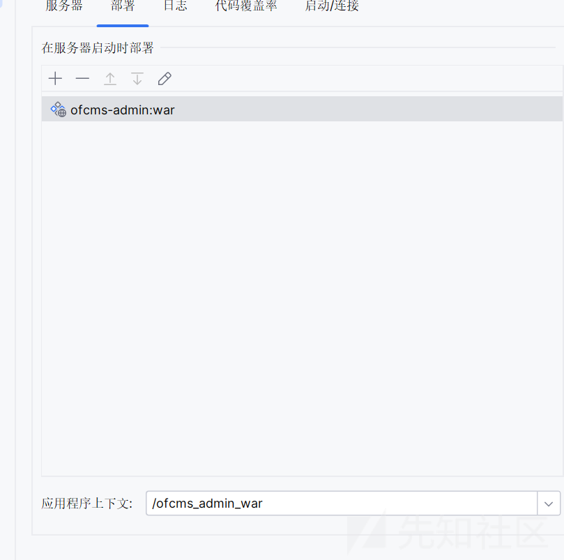

这里可能会出现工件不能部署的情况，是因为你没有对文件的操作权，需要去设置

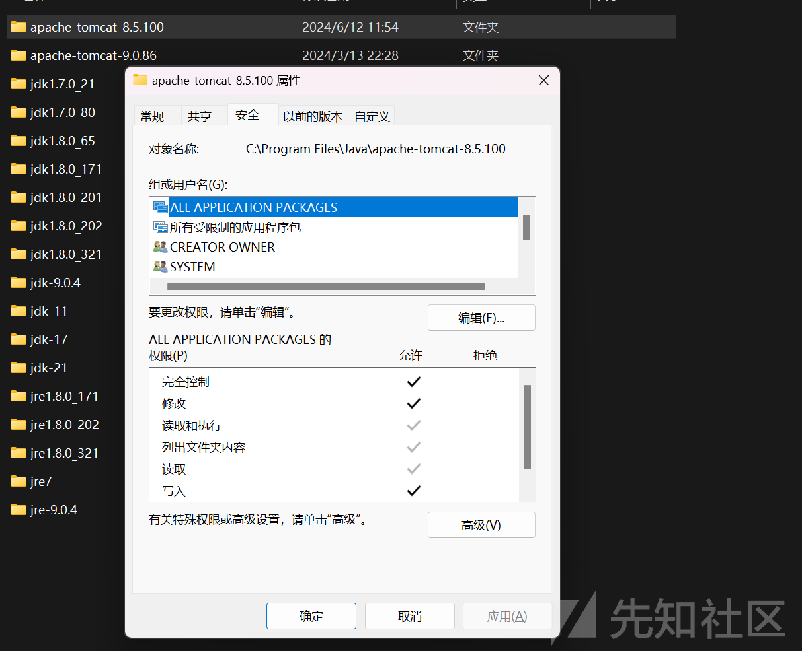

点击文件，然后属性，安全，设置权限，因为我不懂，就把全部的设置为所有权限了，然后确实也部署成功了

然后配置数据库，这里配置数据库就需要你手动配置了

需要你首先创建一个数据库，名字为 ofcms

然后导入 sql 文件

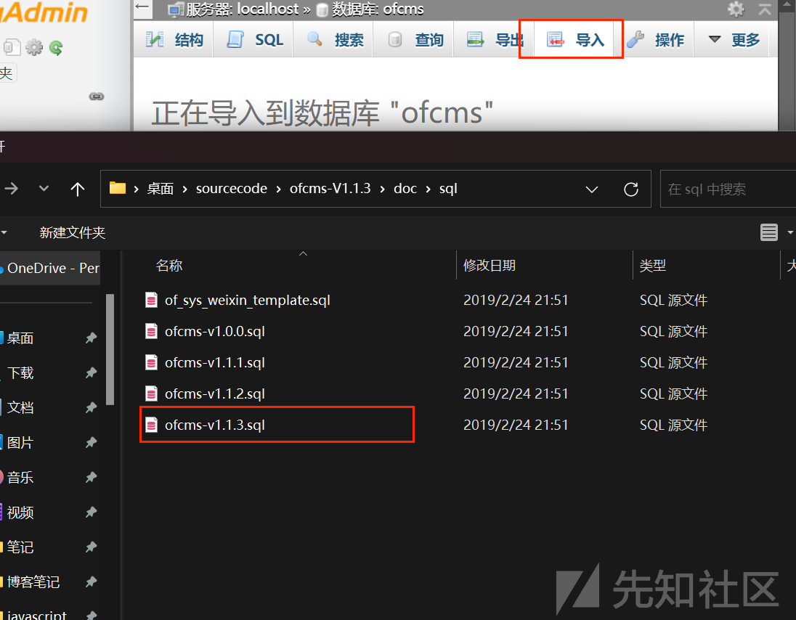

修改数据库配置文件并改名

数据库配置改为你自己的密码和账户

```
jdbc.url=jdbc:mysql://127.0.0.1:3306/ofcms?characterEncoding=UTF-8&zeroDateTimeBehavior=convertToNull
jdbc.username=root
jdbc.password=123456
```

然后把将数据库配置文件 ofcms-V1.1.3/ofcms-admin/src/main/resources/dev/conf/db-config.properties 文件名修改为 db.properties

然后重新启动 web 容器，访问

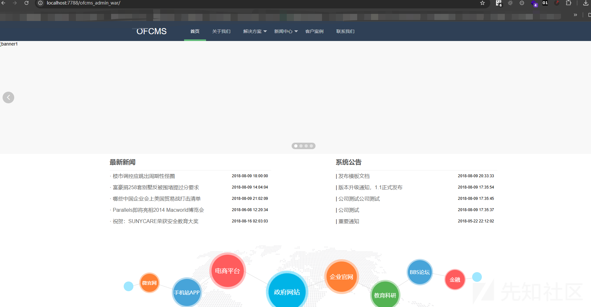

如图即为搭建成功

后台在

```
http://localhost:端口/ofcms_admin_war/admin/index.html
```

如图

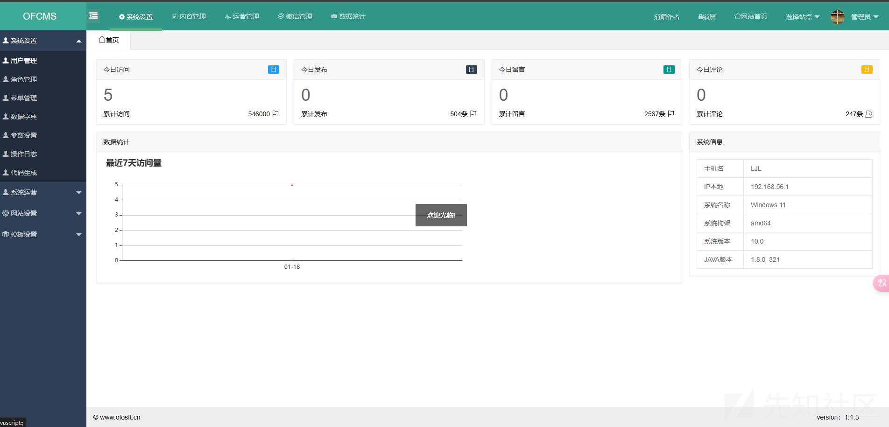

## 目录穿越漏洞复现

这里先复现，再分析

是在模板文件的地方

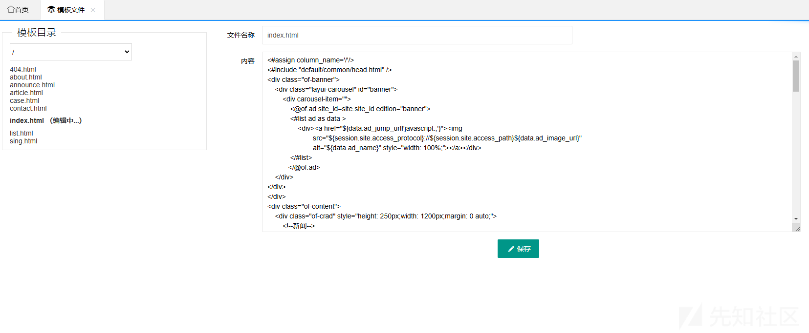

首先我们点击保存然后抓一个包

```
POST /ofcms_admin_war/admin/cms/template/save.json HTTP/1.1
Host: localhost:7788
Content-Length: 5161
sec-ch-ua: "Chromium";v="125", "Not.A/Brand";v="24"
Accept: application/json, text/javascript, */*; q=0.01
Content-Type: application/x-www-form-urlencoded; charset=UTF-8
X-Requested-With: XMLHttpRequest
sec-ch-ua-mobile: ?0
User-Agent: Mozilla/5.0 (Windows NT 10.0; Win64; x64) AppleWebKit/537.36 (KHTML, like Gecko) Chrome/125.0.6422.112 Safari/537.36
sec-ch-ua-platform: "Windows"
Origin: http://localhost:7788
Sec-Fetch-Site: same-origin
Sec-Fetch-Mode: cors
Sec-Fetch-Dest: empty
Referer: http://localhost:7788/ofcms_admin_war/admin/cms/template/getTemplates.html?file_name=index.html&dir=/&dir_name=/
Accept-Encoding: gzip, deflate, br
Accept-Language: zh-CN,zh;q=0.9
Cookie: JSESSIONID=8EA94B09B23A11C608C7E8DCF07F235C
Connection: keep-alive

file_path=C%3A%5CProgram+Files%5CJava%5Capache-tomcat-8.5.100%5Cwebapps%5Cofcms_admin_war%5CWEB-INF%5Cpage&dirs=%2F&res_path=&file_name=../../../../a.txt&file_content=%3C%23assign+column_name%3D'%2F'%2F%3E%0A%3C%23include+%22default%2Fcommon%2Fhead.html%22+%2F%3E%0A%3Cdiv+class%3D%22of-banner%22%3E%0A++++%3Cdiv+class%3D%22layui-carousel%22+id%3D%22banner%22%3E%0A++++++++%3Cdiv+carousel-item%3D%22%22%3E%0A++++++++++++%3C%40of.ad+site_id%3Dsite.site_id+edition%3D%22banner%22%3E%0A++++++++++++%3C%23list+ad+as+data+%3E%0A++++++++++++++++%3Cdiv%3E%3Ca+href%3D%22%24%7Bdata.ad_jump_url!'javascript%3A%3B'%7D%22%3E%3Cimg%0A++++++++++++++++++++++++src%3D%22%24%7Bsession.site.access_protocol%7D%3A%2F%2F%24%7Bsession.site.access_path%7D%24%7Bdata.ad_image_url%7D%22%0A++++++++++++++++++++++++alt%3D%22%24%7Bdata.ad_name%7D%22+style%3D%22width%3A+100%25%3B%22%3E%3C%2Fa%3E%3C%2Fdiv%3E%0A++++++++++++%3C%2F%23list%3E%0A+++++++++++%3C%2F%40of.ad%3E%0A++++%3C%2Fdiv%3E%0A%3C%2Fdiv%3E%0A%3C%2Fdiv%3E%0A%3Cdiv+class%3D%22of-content%22%3E%0A++++%3Cdiv+class%3D%22of-crad%22+style%3D%22height%3A+250px%3Bwidth%3A+1200px%3Bmargin%3A+0+auto%3B%22%3E%0A++++++++%3C!--%E6%96%B0%E9%97%BB--%3E%0A++++++++%3Cdiv+class%3D%22announce%22+style%3D%22float%3A+left%3B%22%3E%0A++++++++++++%3Cp+class%3D%22title%22%3E%E6%9C%80%E6%96%B0%E6%96%B0%E9%97%BB%3C%2Fp%3E%0A++++++++++++%3Cul%3E%0A++++++++++++++++%3C%40of.content_list+site_id+%3D+site.site_id+column_name%3D%22industry%22+limit%3D5%3E%0A++++++++++++++++%3C%23list+content_list+as+data+%3E%0A++++++++++++++++++++%3Cli%3E%3Cspan%3E%24%7Bdata.create_time%7D%3C%2Fspan%3E%C2%B7++%3Ca+href%3D%22%24%7Bdata.url%7D%22+title%3D%22%24%7Bdata.title_name%7D%22%3E%24%7Bdata.title_name%7D%3C%2Fa%3E+%3C%2Fli%3E%0A++++++++++++++++%3C%2F%23list%3E%0A+++++++++++++++%3C%2F%40of.content_list%3E%0A++++++++++++%3C%2Ful%3E%0A++++++++%3C%2Fdiv%3E%0A++++++++%3C!--%E5%85%AC%E5%91%8A--%3E%0A++++++++%3Cdiv+class%3D%22announce%22%3E%0A++++++++++++%3Cp+class%3D%22title%22%3E%E7%B3%BB%E7%BB%9F%E5%85%AC%E5%91%8A%3C%2Fp%3E%0A++++++++++++%3Cul%3E%0A++++++++++++++++%3C%40of.announce_list+site_id%3Dsite.site_id+limit%3D5%3E%0A++++++++++++++++++++%3C%23list+announce+as+data+%3E%0A++++++++++++++++++++++++%3Cli%3E%0A++++++++++++++++++++++++%3Ca+href%3D%22%24%7Bdata.id%7D%22%3E%3C%2Fa%3E%7C%0A++++++++++++++++++++++++++++%3Cspan%3E%24%7Bdata.create_time%7D%3C%2Fspan%3E+%3Ca+href%3D%22page.html%3Fs%3D%2Fannounce%26content_id%3D%24%7Bdata.id%7D%22+title%3D%22%24%7Bdata.title%7D%22%3E%24%7Bdata.title%7D%3C%2Fa%3E%0A++++++++++++++++++++++++%3C%2Fli%3E%0A++++++++++++++++++++%3C%2F%23list%3E%0A++++++++++++++++%3C%2F%40of.announce_list%3E%0A++++++++++++%3C%2Ful%3E%0A++++++++%3C%2Fdiv%3E%0A++++%3C%2Fdiv%3E%0A++++%3Cdiv+class%3D%22of-crad%22+style%3D%22height%3A+370px%3Bwidth%3A+1200px%3Bmargin%3A+0+auto%3Btext-align%3A+center%3B%22%3E%0A++++++++%3Cimg+src%3D%22%24%7Breroot%7D%2Fstatic%2Fassets%2Fimage%2Fapp.png%22%3E%0A++++%3C%2Fdiv%3E%0A++++%3Cdiv+class%3D%22of-crad%22+style%3D%22height%3A+300px%3Bwidth%3A+1200px%3Bmargin%3A+0+auto%3B%22%3E%0A++++++++%3C!--%E6%A1%88%E4%BE%8B--%3E%0A++++++++%3Cdiv+class%3D%22case%22%3E%0A++++++++++++%3Cp+class%3D%22title%22%3E%E5%AE%A2%E6%88%B7%E6%A1%88%E4%BE%8B+Case%3C%2Fp%3E%0A++++++++++++%3Cul%3E%0A++++++++++++++++%3C%40of.content_list+site_id+%3D+site.site_id+column_name%3D%22case%22+limit%3D8%3E%0A++++++++++++++++++++%3C%23list+content_list+as+data+%3E%0A++++++++++++++++++++++++%3Cli%3E%0A++++++++++++++++++++++++++++%3Ca+href%3D%22%24%7Bdata.url%7D%22+%3E%3Cimg+src%3D%22%24%7Bwebroot%7D%24%7Bdata.thumbnail%7D%22%3E%3Cspan+style%3D%22margin-top%3A+15px%3B++++display%3A+inline-block%3B%22%3E%24%7Bdata.title_name%7D%3C%2Fspan%3E%3C%2Fa%3E%0A++++++++++++++++++++++++%3C%2Fli%3E%0A++++++++++++++++++++%3C%2F%23list%3E%0A++++++++++++++++%3C%2F%40of.content_list%3E%0A++++++++++++%3C%2Ful%3E%0A++++++++%3C%2Fdiv%3E%0A%0A++++%3C%2Fdiv%3E%0A++++%3Cdiv+class%3D%22of-crad%22%3E%0A++++++++%3Cdiv+class%3D%22of-crad-content%22%3E%0A++++++++++++%3Cdiv+class%3D%22of-crad-title%22%3E%E5%85%B3%E4%BA%8E%E6%88%91%E4%BB%AC+About%3C%2Fdiv%3E%0A++++++++++++%3Cdiv+class%3D%22of-crad-body%22%3E%0A++++++++++++++++%3C%40of.content+content_id+%3D+'45'+site_id%3Dsite.site_id%3E%0A++++++++++++++++%3Cdiv+class%3D%22of-crad-body%22%3E+%24%7Bcontent.content%7D%3C%2Fdiv%3E%0A++++++++++++%3C%2F%40of.content%3E%0A++++++++++++%3C%2Fdiv%3E%0A++++++++%3C%2Fdiv%3E%0A++++%3C%2Fdiv%3E%0A%3C%2Fdiv%3E%0A%3Cscript%3E%0A++++layui.use(%5B'carousel'%2C+'element'%5D%2C+function+()+%7B%0A++++++++var+carousel+%3D+layui.carousel%3B%0A++++++++var+element+%3D+layui.element%3B%0A++++++++%2F%2F%E5%9B%BE%E7%89%87%E8%BD%AE%E6%92%AD%0A++++++++carousel.render(%7B%0A++++++++++++elem%3A+'%23banner'%0A++++++++++++%2C+width%3A+'100%25'+%2F%2F%E8%AE%BE%E7%BD%AE%E5%AE%B9%E5%99%A8%E5%AE%BD%E5%BA%A6%0A++++++++++++%2C+arrow%3A+'always'+%2F%2F%E5%A7%8B%E7%BB%88%E6%98%BE%E7%A4%BA%E7%AE%AD%E5%A4%B4%0A++++++++++++%2C+height%3A+'350px'%0A++++++++++++%2C+autoplay%3A+true%0A++++++++++++%2C+full%3A+false%0A++++++++++++%2C+interval%3A+3000%0A++++++++%7D)%3B%0A++++%7D)%3B%0A%3C%2Fscript%3E%0A%3C%23include+%22default%2Fcommon%2Ffooter.html%22+%2F%3E
```

修改 filename 参数加入我们的../../

然后我们看结果

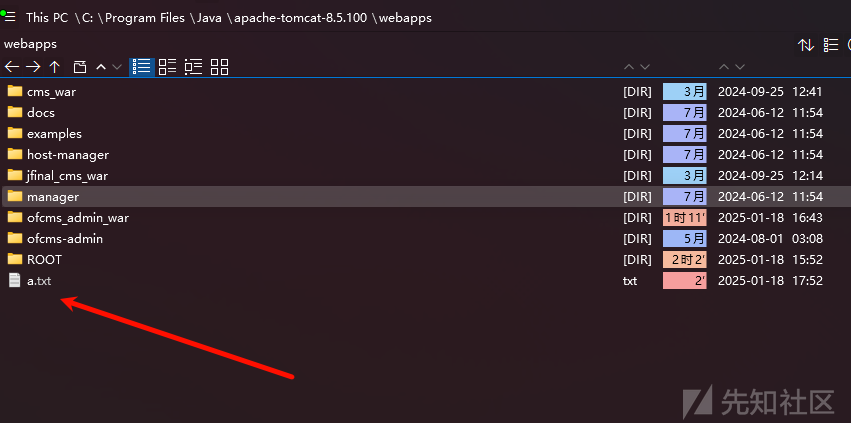

成功

## 目录穿越漏洞分析

直接看到我们的 save 方法

```
public void save() {
    String resPath = getPara("res_path");
    File pathFile = null;
    if("res".equals(resPath)){
        pathFile = new File(SystemUtile.getSiteTemplateResourcePath());
    }else {
        pathFile = new File(SystemUtile.getSiteTemplatePath());
    }
    String dirName = getPara("dirs");
    if (dirName != null) {
        pathFile = new File(pathFile, dirName);
    }
    String fileName = getPara("file_name");
    // 没有用getPara原因是，getPara因为安全问题会过滤某些html元素。
    String fileContent = getRequest().getParameter("file_content");
    fileContent = fileContent.replace("&lt;", "<").replace("&gt;", ">");
    File file = new File(pathFile, fileName);
    FileUtils.writeString(file, fileContent);
    rendSuccessJson();
}
```

首先我们可控的几个参数都在这

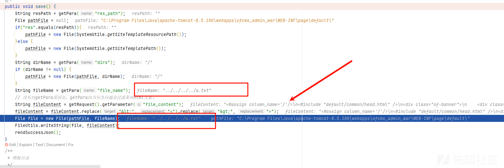

可以看见内容和文件名都是我们可以控制的

## Codeql 实践

首先我是直接使用官方的代码寻找了一遍

```
/** Provides dataflow configurations for tainted path queries. */

import java
import semmle.code.java.frameworks.Networking
import semmle.code.java.dataflow.DataFlow
import semmle.code.java.dataflow.FlowSources
private import semmle.code.java.dataflow.ExternalFlow
import semmle.code.java.security.PathSanitizer
private import semmle.code.java.security.Sanitizers

/** A sink for tainted path flow configurations. */
abstract class TaintedPathSink extends DataFlow::Node { }

private class DefaultTaintedPathSink extends TaintedPathSink {
  DefaultTaintedPathSink() { sinkNode(this, "path-injection") }
}

/**
 * A unit class for adding additional taint steps.
 *
 * Extend this class to add additional taint steps that should apply to tainted path flow configurations.
 */
class TaintedPathAdditionalTaintStep extends Unit {
  abstract predicate step(DataFlow::Node n1, DataFlow::Node n2);
}

private class DefaultTaintedPathAdditionalTaintStep extends TaintedPathAdditionalTaintStep {
  override predicate step(DataFlow::Node n1, DataFlow::Node n2) {
    exists(Argument a |
      a = n1.asExpr() and
      a.getCall() = n2.asExpr() and
      a = any(TaintPreservingUriCtorParam tpp).getAnArgument()
    )
  }
}

private class TaintPreservingUriCtorParam extends Parameter {
  TaintPreservingUriCtorParam() {
    exists(Constructor ctor, int idx, int nParams |
      ctor.getDeclaringType() instanceof TypeUri and
      this = ctor.getParameter(idx) and
      nParams = ctor.getNumberOfParameters()
    |
      // URI(String scheme, String ssp, String fragment)
      idx = 1 and nParams = 3
      or
      // URI(String scheme, String host, String path, String fragment)
      idx = [1, 2] and nParams = 4
      or
      // URI(String scheme, String authority, String path, String query, String fragment)
      idx = 2 and nParams = 5
      or
      // URI(String scheme, String userInfo, String host, int port, String path, String query, String fragment)
      idx = 4 and nParams = 7
    )
  }
}

/**
 * A taint-tracking configuration for tracking flow from remote sources to the creation of a path.
 */
module TaintedPathConfig implements DataFlow::ConfigSig {
  predicate isSource(DataFlow::Node source) { source instanceof ThreatModelFlowSource }

  predicate isSink(DataFlow::Node sink) { sink instanceof TaintedPathSink }

  predicate isBarrier(DataFlow::Node sanitizer) {
    sanitizer instanceof SimpleTypeSanitizer or
    sanitizer instanceof PathInjectionSanitizer
  }

  predicate isAdditionalFlowStep(DataFlow::Node n1, DataFlow::Node n2) {
    any(TaintedPathAdditionalTaintStep s).step(n1, n2)
  }
}

/** Tracks flow from remote sources to the creation of a path. */
module TaintedPathFlow = TaintTracking::Global<TaintedPathConfig>;

/**
 * A taint-tracking configuration for tracking flow from local user input to the creation of a path.
 */
deprecated module TaintedPathLocalConfig implements DataFlow::ConfigSig {
  predicate isSource(DataFlow::Node source) { source instanceof LocalUserInput }

  predicate isSink(DataFlow::Node sink) { sink instanceof TaintedPathSink }

  predicate isBarrier(DataFlow::Node sanitizer) {
    sanitizer instanceof SimpleTypeSanitizer or
    sanitizer instanceof PathInjectionSanitizer
  }

  predicate isAdditionalFlowStep(DataFlow::Node n1, DataFlow::Node n2) {
    any(TaintedPathAdditionalTaintStep s).step(n1, n2)
  }
}

/**
 * DEPRECATED: Use `TaintedPathFlow` instead and configure threat model sources to include `local`.
 *
 * Tracks flow from local user input to the creation of a path.
 */
deprecated module TaintedPathLocalFlow = TaintTracking::Global<TaintedPathLocalConfig>;

```

可惜没有结果??

但是漏洞是一定存在的，于是开始分析哪里出现了问题

### sink 点

首先我是从 sink 点看看有没有问题

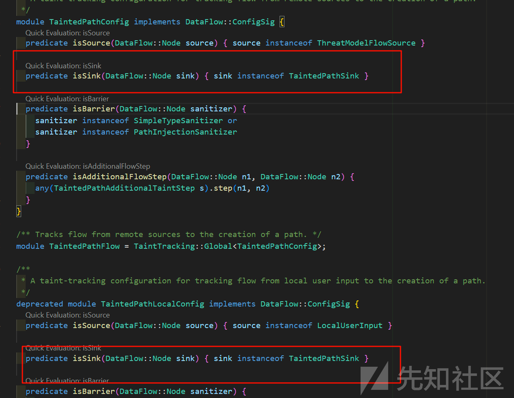

都是一个 sink 点，我们看一个就 ok 了

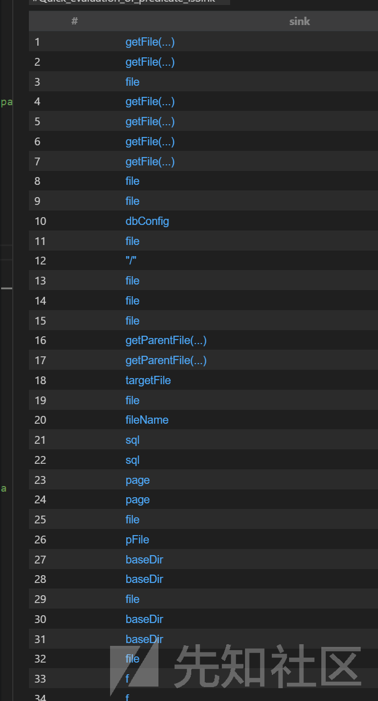

看到代码部分

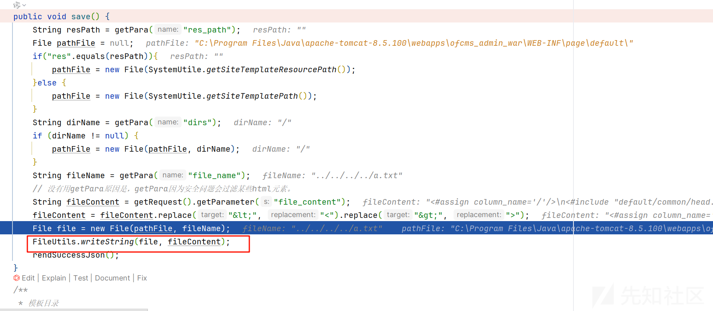  
这个 writeString 应该是我们 sink 点，跟进

```
public static void writeString(File file, String string) {
    FileOutputStream fos = null;
    try {
        fos = new FileOutputStream(file, false);
        fos.write(string.getBytes(JFinal.me().getConstants().getEncoding()));
    } catch (Exception e) {
    } finally {
        close(null, fos);
    }
}
```

然后我们检测结果

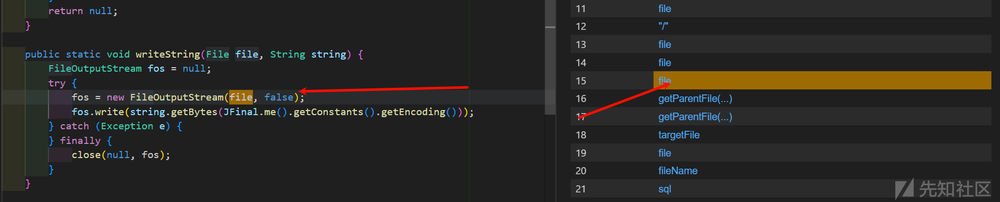

确实是没有问题的，那估计问题是出现在 source 点了

### Source 点

我们两个 source 都运行一下看看

一个是远程的，一个是本地的

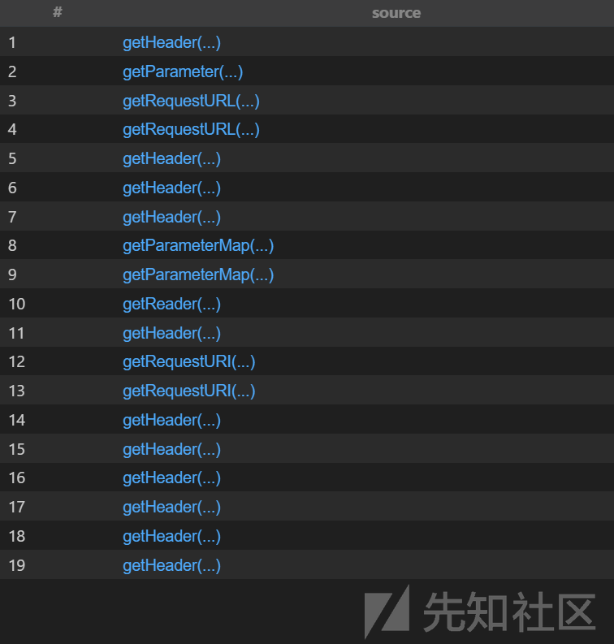

远程的结果

发现全是 api 的类型

我们看看我们的 source 是什么

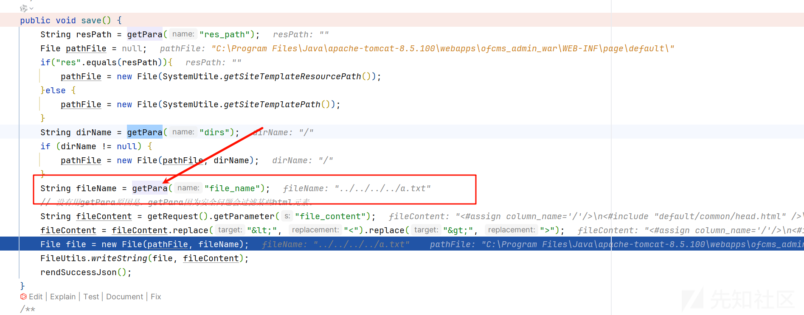

```
public String getPara(String name) {
    return request.getParameter(name);
}
```

它是 jfinal 的路由里面的，问题就出现在 Source 里面没有我们的 jfinal

参考<https://www.anquanke.com/post/id/203674#h3-8>

我们可以看到 jfinal 传入参数的点

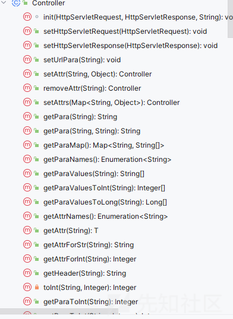

都是getter 方法

```
public String getPara(String name) {
    return request.getParameter(name);
}
```

```
public Enumeration<String> getParaNames() {
    return request.getParameterNames();
}
```

```
public Integer[] getParaValuesToInt(String name) {
    String[] values = request.getParameterValues(name);
    if (values == null)
        return null;
    Integer[] result = new Integer[values.length];
    for (int i=0; i<result.length; i++)
        result[i] = Integer.parseInt(values[i]);
    return result;
}
```

所以一个共性就是 getter 方法

最后我写出这样一个代码

```
private class JfinalSource extends RemoteFlowSource {
  JfinalSource() {
    exists(MethodCall method |
      method.getMethod().getDeclaringType*().hasQualifiedName("com.jfinal.core", "Controller") and
      (method.getMethod().getName().substring(0, 3) = "get") and
      (
        this.asExpr() =method
      )
    )
  }

  override string getSourceType() { result = "JfinalSource" }
}
```

效果  
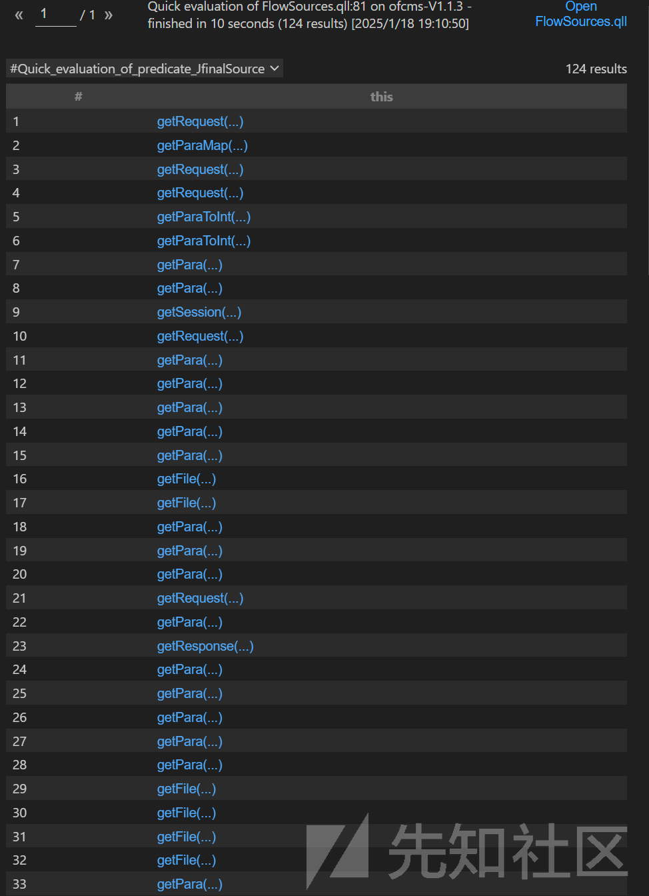

可以看到已经是可以匹配到我们的 source 了

然后我们再次查询

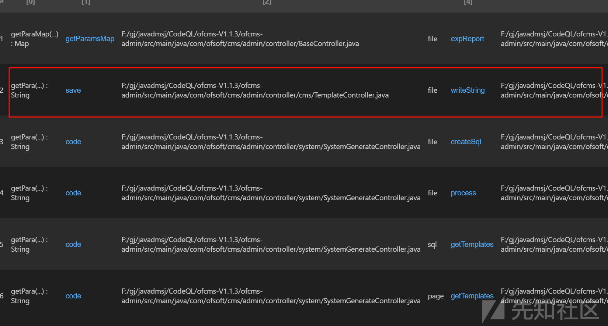

已经完美的查询出来了

当然还有其他的，我暂时不做研究

## Codeql 查询思路分析

上面已经实践过了，然后我们分析一下柚屿 i 师傅写的查询代码，反正都顺便了，主要是学习一个思路

整体代码如下

```
import java
import semmle.code.java.dataflow.TaintTracking


class OfCmsSource extends MethodAccess{
    OfCmsSource(){
        (this.getMethod().getDeclaringType*().hasQualifiedName("com.ofsoft.cms.admin.controller", "BaseController") and
        (this.getMethod().getName().substring(0, 3) = "get"))
        or 
        (this.getMethod().getDeclaringType*().hasQualifiedName("com.jfinal.core", "Controller") and
        (this.getMethod().getName().substring(0, 3) = "get"))
        or 
        (this.getMethod().getDeclaringType*().hasQualifiedName("javax.servlet.http", "HttpServletRequest") and (this.getMethod().getName().substring(0, 3) = "get"))
        or
        (this.getMethod().getDeclaringType*().hasQualifiedName("com.ofsoft.cms.api", "ApiBase") and
        (this.getMethod().getName().substring(0, 3) = "get"))
    }
}

class RenderMethod extends MethodAccess{
    RenderMethod(){
        (this.getMethod().getDeclaringType*().hasQualifiedName("com.jfinal.core", "Controller") and 
        this.getMethod().getName().substring(0, 6) = "render") or (this.getMethod().getDeclaringType*().hasQualifiedName("com.ofsoft.cms.core.plugin.freemarker", "TempleteUtile") and this.getMethod().hasName("process"))
    }
}

class SqlMethod extends MethodAccess{
    SqlMethod(){
        this.getMethod().getDeclaringType*().hasQualifiedName("com.jfinal.plugin.activerecord", "Db")
    }
}

class FileContruct extends ClassInstanceExpr{
    FileContruct(){
        this.getConstructor().getDeclaringType*().hasQualifiedName("java.io", "File")
    }
}

class ServletOutput extends MethodAccess{
    ServletOutput(){
        this.getMethod().getDeclaringType*().hasQualifiedName("java.io", "PrintWriter")
    }
}

class OfCmsTaint extends TaintTracking::Configuration{
    OfCmsTaint(){
        this = "OfCmsTaint"
    }

    override predicate isSource(DataFlow::Node source){
        source.asExpr() instanceof OfCmsSource
    }

    override predicate isSink(DataFlow::Node sink){
        exists(
            FileContruct rawOutput |
            sink.asExpr() = rawOutput.getAnArgument()
        )
    }
}

from DataFlow::Node source, DataFlow::Node sink, OfCmsTaint config
where config.hasFlow(source, sink)
select source, sink
```

我们先看看结果  
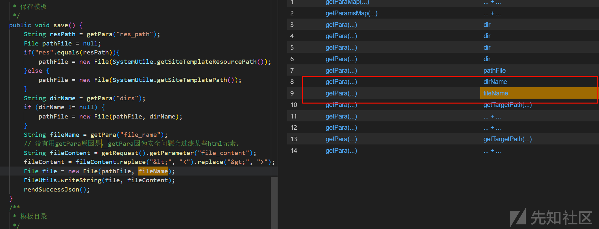

### sink 点分析

这里师傅的 sink 点有模板渲染的和文件的，这里我主要侧重点在文件，所以 render 就没有看了

```
class FileContruct extends ClassInstanceExpr{
    FileContruct(){
        this.getConstructor().getDeclaringType*().hasQualifiedName("java.io", "File")
    }
}
```

非常的简单粗暴，只要是 new File 都作为 sink 点

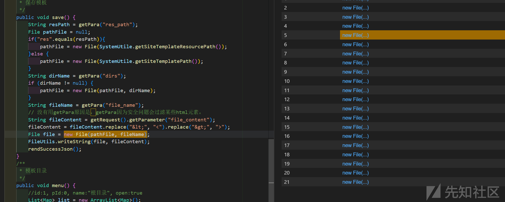

### Source 点分析

个人觉得师傅的 source 点分析逻辑是非常精彩的

首先对框架的 source 点就分得很清楚

首先是 ofcms 本身写的路由

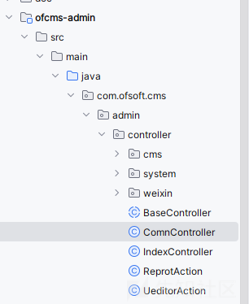

发现都是基于 BaseController.java 的  
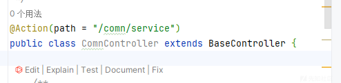

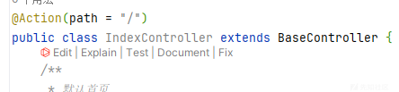

然后我们看看 BaseController 的参数

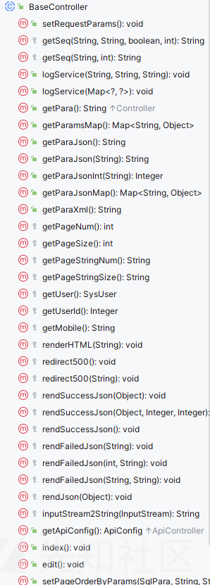

还是一样的 getter 方法

```
public String getParaJson(String name) {
    return (String) getParaJsonMap().get(name);
}
```

```
public String getPara() {
    return HttpKit.readData(getRequest());
}
```

```
public Map<String, Object> getParamsMap() {
    Map<String, String[]> params = getParaMap();
    Map<String, Object> result = new ConcurrentHashMap<String, Object>();
    for (String value : params.keySet()) {
        result.put(value, params.get(value)[0]);
    }
    return result;
}
```

codeql 代码

```
(this.getMethod().getDeclaringType*().hasQualifiedName("com.ofsoft.cms.admin.controller", "BaseController") and
(this.getMethod().getName().substring(0, 3) = "get"))
```

然后就是继承了 jfinal 的 controller

比如我们上面的那个点

codeql 代码

```
(this.getMethod().getDeclaringType*().hasQualifiedName("com.jfinal.core", "Controller") and
(this.getMethod().getName().substring(0, 3) = "get"))
```

然后就是 API 的调用 Servlet

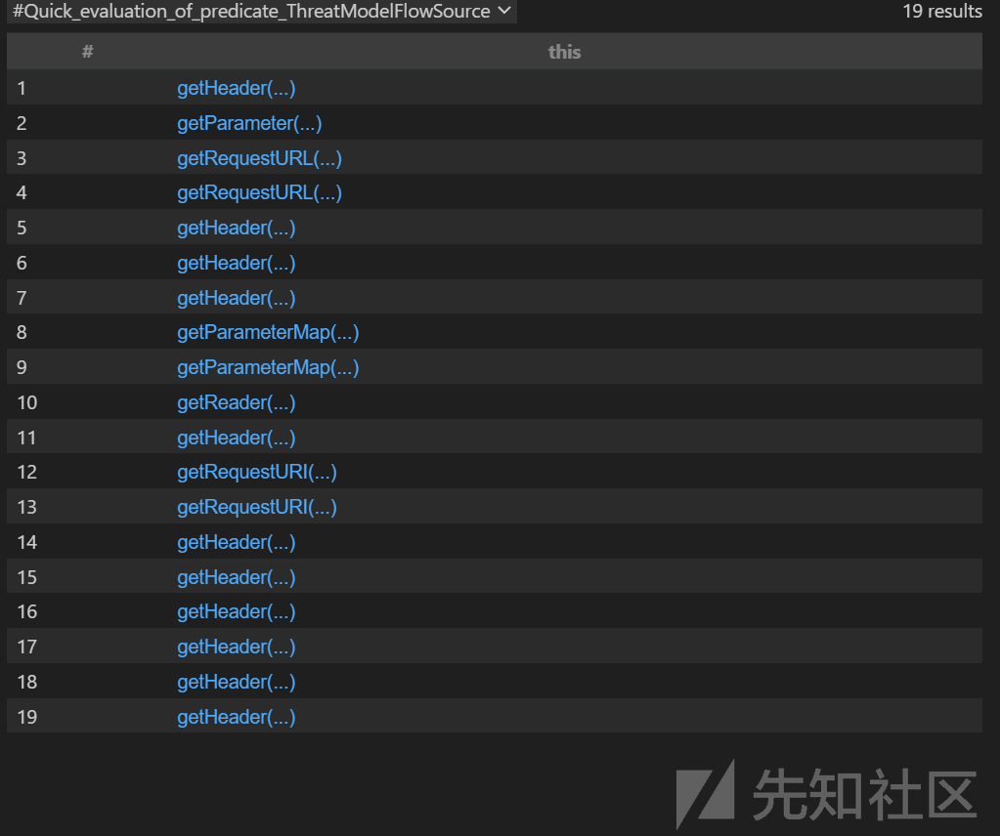

这些都是

```
(this.getMethod().getDeclaringType*().hasQualifiedName("javax.servlet.http", "HttpServletRequest") and (this.getMethod().getName().substring(0, 3) = "get"))

```

然后就是本身的 API

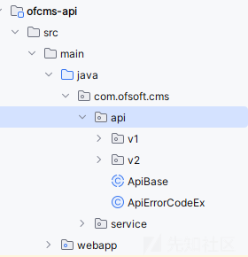

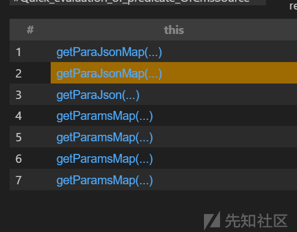

总代码

```
class OfCmsSource extends MethodAccess{
    OfCmsSource(){
        (this.getMethod().getDeclaringType*().hasQualifiedName("com.ofsoft.cms.admin.controller", "BaseController") and
        (this.getMethod().getName().substring(0, 3) = "get"))
        or 
        (this.getMethod().getDeclaringType*().hasQualifiedName("com.jfinal.core", "Controller") and
        (this.getMethod().getName().substring(0, 3) = "get"))
        or 
        (this.getMethod().getDeclaringType*().hasQualifiedName("javax.servlet.http", "HttpServletRequest") and (this.getMethod().getName().substring(0, 3) = "get"))
        or
        (this.getMethod().getDeclaringType*().hasQualifiedName("com.ofsoft.cms.api", "ApiBase") and
        (this.getMethod().getName().substring(0, 3) = "get"))
    }
}
```
