# Patchwork APT最新攻击样本与威胁情报分析-先知社区

> **来源**: https://xz.aliyun.com/news/16843  
> **文章ID**: 16843

---

# 前言概述

Patchwork APT组织是一支疑似南亚某政府背景的黑客组织，最早于2009年左右被发现，主要攻击中国、巴基斯坦、孟加拉国等国家军工、外交、教育，科研机构等，窃密重要数据，该组织主要使用鱼叉式钓鱼攻击手法，附带伪造为PDF文件的LNK恶意文件，通过PS脚本从黑客远程C2服务器下载恶意软件，攻击中使用了多种不同的恶意软件家族，包含：BADNEWS木马、Spyder后门、Remcos RAT、Havoc C2、NorthStarC2、GRAT等。

笔者近期在威胁情报平台追踪到Patchwork APT组织的最新的攻击样本和威胁情报，如下所示：

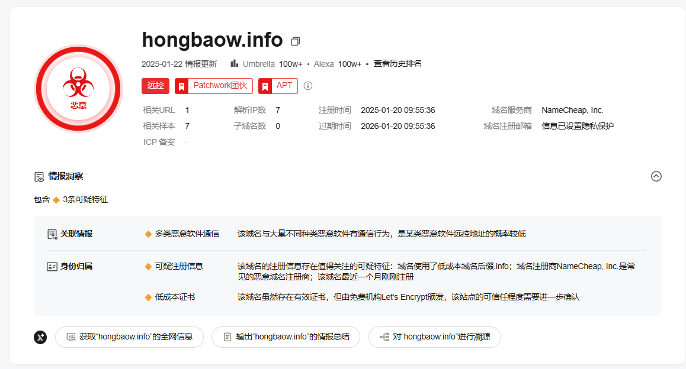

对该最新的攻击样本和威胁情报进行了详细分析，分享出来供大家参考学习一下。

​

# 样本分析

1.通过威胁情报平台，关联到相关的样本，如下所示：

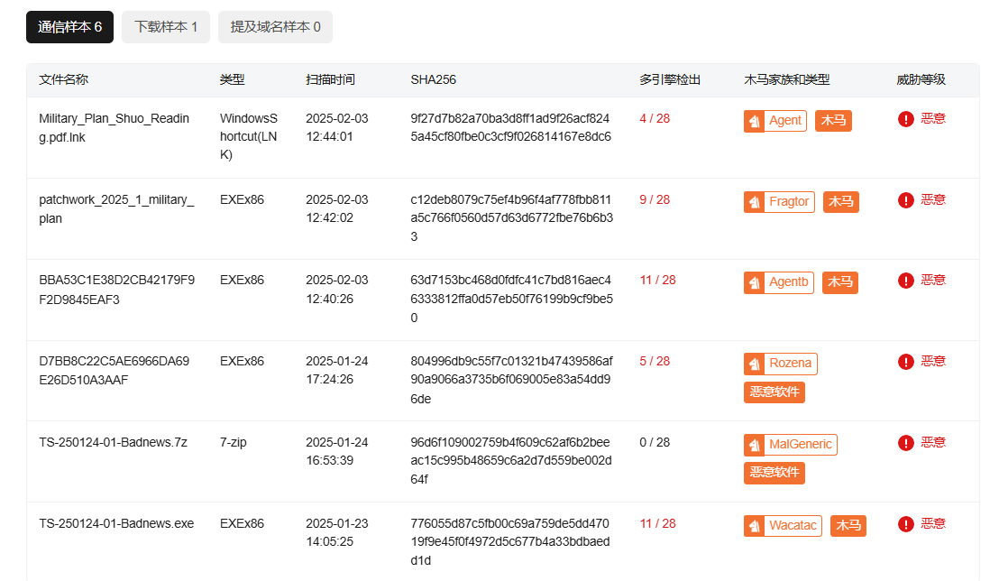

2.解析LNK恶意软件样本，如下所示：

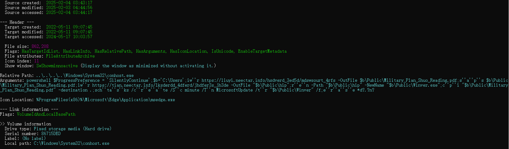

3.从远程服务器上下载恶意软件，下载的恶意软件编译时间为2025年1月20日，如下所示：

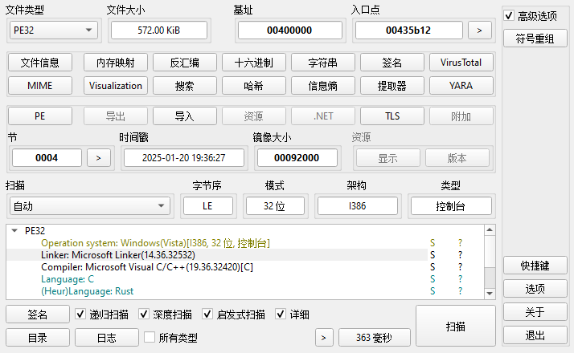

4.解密数据，如下所示：

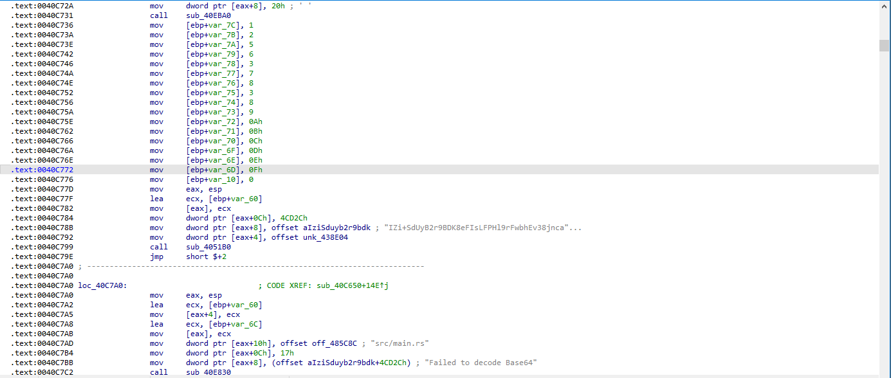

5.将解密的数据注入进程，然后通过APC启动执行ShellCode，如下所示：

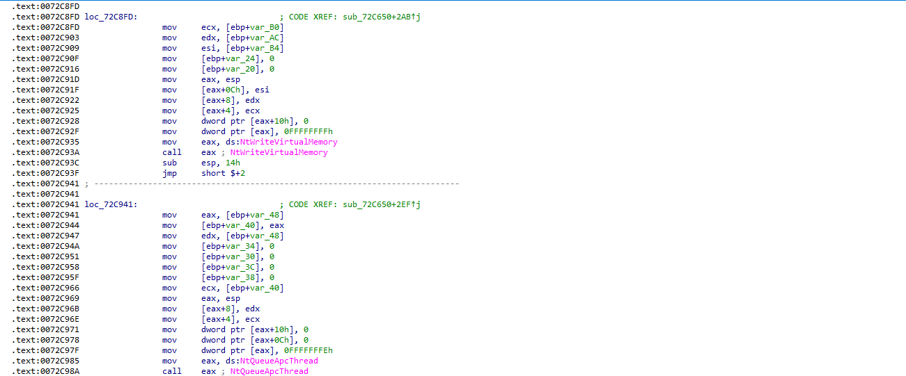

6.ShellCode代码，如下所示：

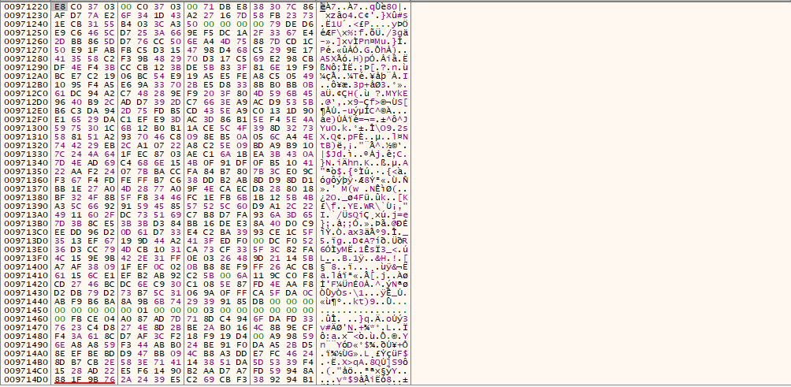

7.执行ShellCode代码，如下所示：

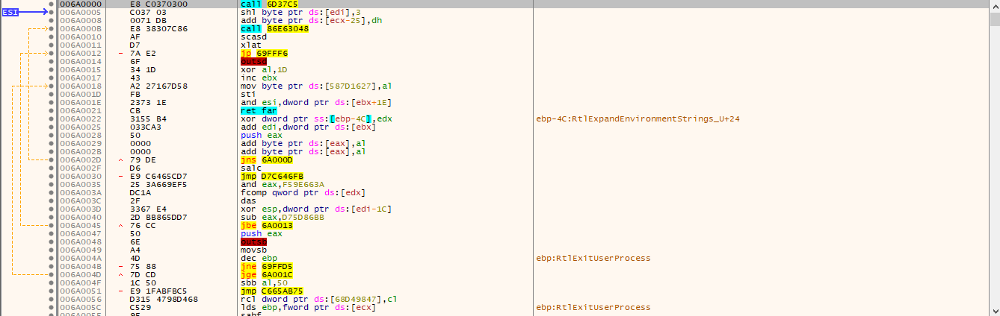

8.解密ShellCode中的加密数据，如下所示：

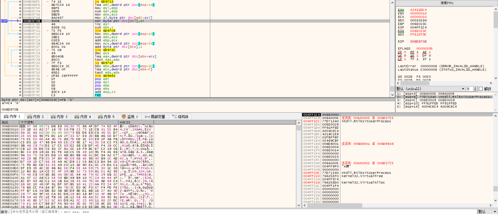

9.解密之后，如下所示：

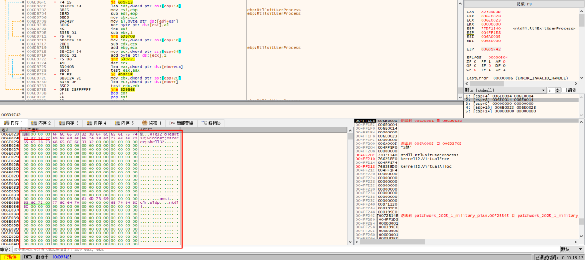

10.从内存中加载执行解密数据中的PayLoad，PayLoad代码，如下所示：

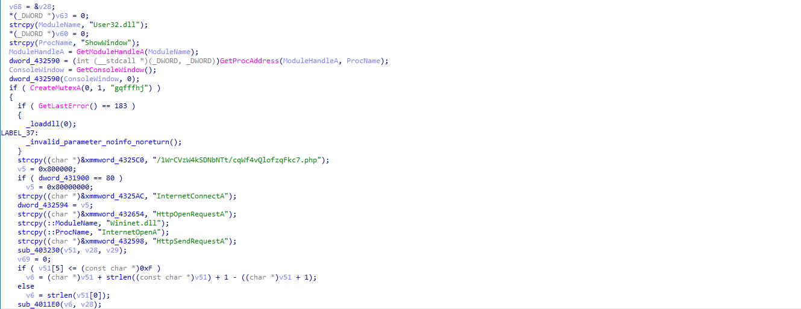

与此前分析过的Pathwork APT变种样本代码结构基本一致，可以判定为Patchwork APT组织的攻击样本。

11.PayLoad上传受害者信息和数据到远程服务器hongbaow.info，如下所示：

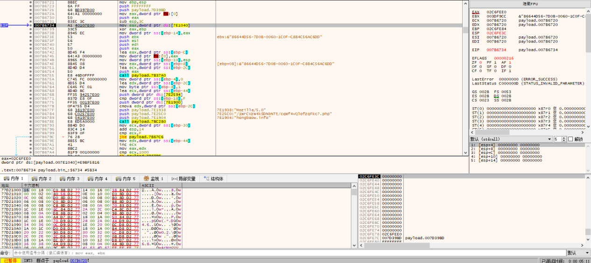

12.将上面下载恶意软件的远程服务器C2域名在威胁情报平台上进行查询，如下所示：

到此Pathwork APT最新的攻击样本和威胁情报就分析完了，有兴趣的可以自己下载相关的样本进行分析与研究。

​

# 威胁情报

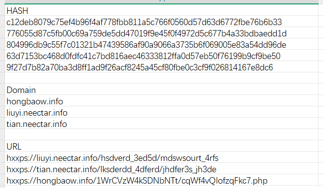

# 总结结尾

APT是全球企业面临的最大的安全威胁之一，需要安全厂商密切关注，未来APT组织还会持续不断的发起网络攻击活动，同时也会持续更新自己的攻击武器，开发新的恶意软件变种，研究各种新的攻击技术，使用新的攻击手法，进行更复杂的攻击活动，这将会不断增加安全威胁分析和情报人员分析溯源与应急响应的难度，安全研究人员需要不断提升自己的安全分析能力，更好的应对未来各种威胁挑战，安全对抗会持续升级，这是一个长期的过程。
