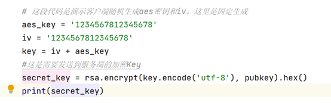
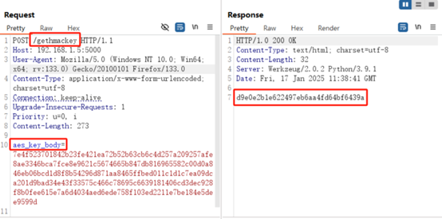
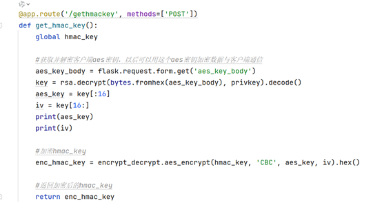
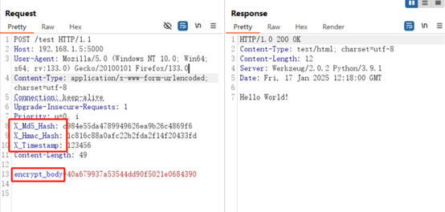
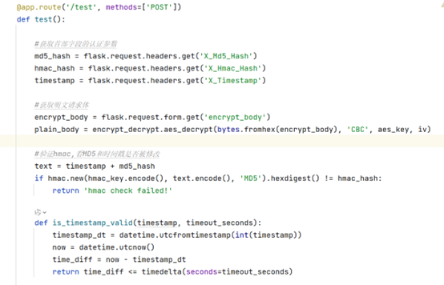
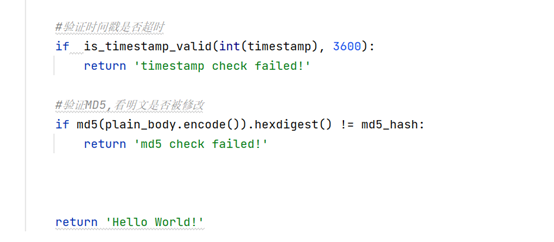
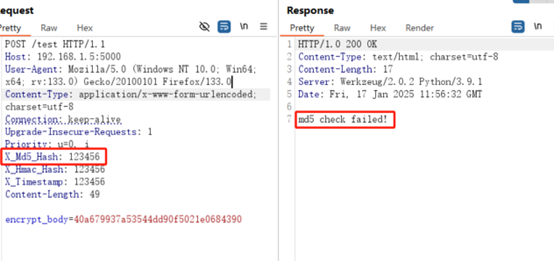
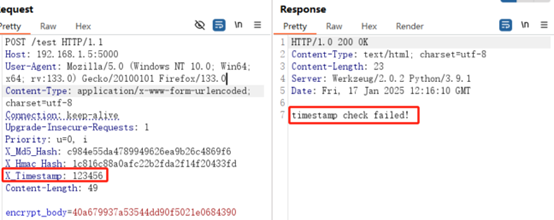
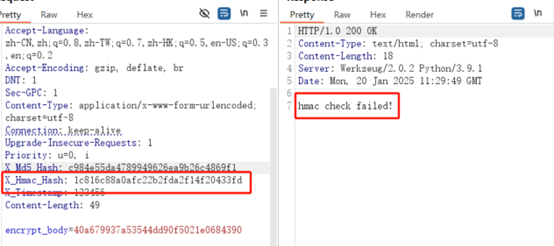

# 应用通信安全防护方案-先知社区

> **来源**: https://xz.aliyun.com/news/16857  
> **文章ID**: 16857

---

# 应用通信安全防护方案

## 引言

本文旨在介绍一种应用通信的安全防护方案，通过综合运用多种安全技术和策略，确保应用通信的机密性、完整性和可用性，提高攻击者的攻击门槛。

## 攻防手段

安全工作者对应用进行安全测试或者攻击者对应用进行攻击，主要的手段就是通过抓取数据包，修改数据包，发送构造的payload到应用服务器并观察应用服务器的响应来发现安全性缺陷。  
相对应的，对应用的安全防护除了核心是避免或修复安全性缺陷，也可以通过增加安全控制措施破坏攻击者的攻击手段，提高攻击者的攻击门槛，让攻击者抓不了数据包，让攻击者修改不了数据包，可以通过代理检测，数据包加密加签等方式实现。

## 安全技术介绍

MD5算法  
MD5是一种广泛使用的哈希算法，用于将任意长度的输入数据映射为固定长度的128位（16字节）散列值。它的主要目的是确保信息传输的完整性和一致性。应该是我们在安全测试工作中最常遇到的一种哈希算法。

HMAC算法  
HMAC（基于哈希的消息认证码）是一种使用密码散列函数和密钥生成消息认证码（MAC）的算法。它主要用于确保数据的完整性和验证消息的身份。HMAC算法结合了哈希函数和密钥，通过特定的计算方式生成消息认证码。相比于普通的哈希算法，其增加了一组密钥来提高哈希破解的难度。

AES算法  
高级加密标准（AES），是一种对称加密算法，即加密和解密使用相同的密钥，同时，AES的加密方式为分组加密，也就是把明文分成一组一组的，每组长度相等，每次加密一组数据，直到加密完整个明文，如果最后一组长度不够，则要选择相应的填充模式，经常遇到的填充模式就是pkcs5、pkcs7，还有就是AES加解密需要选择工作模式，包括ECB，CBC等，在实际工作中一般就是CBC模式。  
我们在分析AES加密算法时，需要关注AES密钥，使用的填充模式以及工作模式，得到这些参数信息才能进行解密操作。

RSA算法  
RSA算法是一种非对称加密技术，广泛应用于数字签名、安全通信等领域，它使用两个密钥：一个公钥和一个私钥。公钥用于加密数据，而私钥用于解密。RSA算法的安全性基于大数分解的困难性，即两个大质数的乘积很容易计算，但要将其分解回原来的质数却极其困难。同时RSA算法的安全性也取决于密钥的长度，目前推荐的密钥长度至少为2048位。

时间戳机制  
时间戳是指从格林威治时间1970年1月1日00时00分00秒（北京时间1970年1月1日08时00分00秒）起至当前时间的总秒数。它也被称为Unix时间戳（Unix Timestamp）。时间戳是一种能够表示数据在特定时间点已经存在的完整的、可验证的数据。  
时间戳在实际应用中具有广泛的用途，尤其在电子商务和金融活动中。它可以用于证明某些数据在特定时间点已经存在，并且未被篡改，而且还可以通过规定的时间阈值进行超时验证。

防重放机制  
防重放机制的核心思想是为每个请求生成一个唯一的标识符，并确保这个标识符只能使用一次。 这样，即使攻击者截获了一个有效的请求并尝试再次发送，服务器也可以识别出这个请求已经被处理过，从而拒绝重复的请求。防重放机制是保护 API 接口免受重放攻击的重要手段，可以提高 API 接口的安全性和稳定性，保护用户的隐私和数据安全。

## 安全防护方案

应用通信防护整个方案分为密钥交换阶段和业务通信阶段。

密钥交换阶段。  
1.客户端随机生成AES密钥；  
客户端随机生成密钥的方案会把密钥的管理权交给客户端，使得每个客户端的加密密钥都不同，避免固定密钥的风险。  
2.将AES密钥使用RSA加密后发送给服务端，服务端解密获取；  
RSA是公钥加密算法，一方面避免AES明文传输到服务端，一方面确保只有拥有RSA私钥的服务器才能够解密拿到AES密钥。  
3.服务端使用AES加密将HMAC密钥发送给客户端。  
从这个步骤开始通信加密开始使用AES算法，可以提升通信性能，发送HMAC的目的是下文讲述的双重验签机制，HMAC密钥是服务端管理，不由客户端自主生成。

业务通信阶段。  
1.客户端计算业务数据MD5哈希并将哈希值放在请求首部字段；  
使用MD5算法计算哈希值可以验证业务数据是否被篡改，这是第一层验签，因为攻击者可以在篡改业务数据后重新计算MD5值，所以存在一定风险。  
2.请求首部字段增加时间戳和随机值；  
时间戳可以验证数据包是否超时发送，服务端通过合理的时间阈值验证数据包是正常发送还是由攻击者自主发送，同时增加随机值，防止数据包重放，当然这两个字段值可以篡改，所以由下面的步骤进行完整性校验。  
3.使用HMAC计算MD5，时间戳和随机值三个首部字段的哈希；  
HMAC算法相比MD5不同的地方在于HMAC计算哈希是需要密钥的，而此密钥是有服务端加密发送给客户端的，存储在客户端内存之中，攻击者很难获取，通过HMAC算法计算MD5，时间戳和随机值的哈希后，攻击者就没办法修改这三个字段的值，从而使得下面步骤中服务端可以对数据报文进行超时，重放，篡改等方面的验证。  
4.将数据报文使用AES整体加密后发送到服务端；  
5.服务端接收数据报文后进行解密，随后进行数据包超时，重放，篡改等验证。

以上为整个防护加密流程。

## 实践过程

下面使用flask搭建一个简易web应用演示此过程。

密钥交换阶段。  
这段代码模拟客户端要发送的AES密钥，通过RSA加密：

通过下面接口发送：

接口返回的是加密后的HMAC密钥，通过下面代码返回：

​

业务通信阶段。  
如下面的请求：

服务端处理逻辑如下：

下面是验证错误得到的响应，如下：  
验证业务数据是否被篡改。

验证数据包是否超时传送。

验证数据包安全字段是否被篡改。

## 结论

到这里就基本讲述完整个防护方案，方案一定程度确实维护了数据的机密性，完整性，可用性，不过也有相应的缺点，就是很依赖与客户端的安全性，如果客户端逆向很容易，得到了密钥和算法，也是很容易就仿造通信过程，所以需要与客户端的安全防护方案结合使用，一定程度提高攻击者的攻击门槛。
