# 0~1深入解析PE文件结构+做实验-先知社区

> **来源**: https://xz.aliyun.com/news/16859  
> **文章ID**: 16859

---

# 0. 概述

深入解析PE文件结构学习笔记，文中不乏笔者自己的理解，如有错误，欢迎指正。**Orz**

# 1. 啥是PE？

PE文件，即Portable Executable File Format，是Windows下可执行程序的一个统称，Windows下的所有可执行文件都是PE文件格式，比如.exe，.dll，.sys等。

PE文件是指 32 位可执行文件，也称为PE32。64位的可执行文件称为 **PE+** 或 **PE32+**，是PE(PE32)的一种扩展形式(请**注意不是PE64**)。

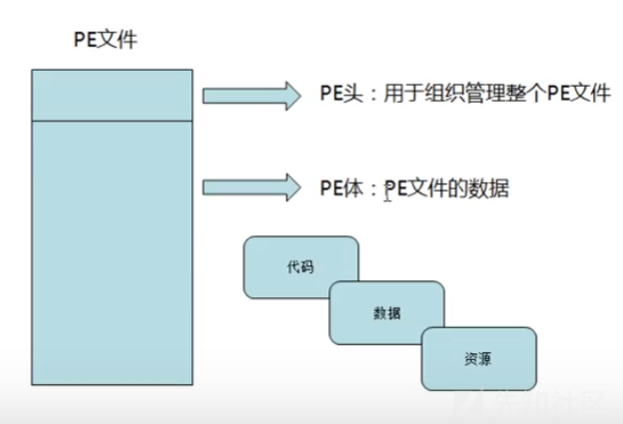

PE文件由PE头和PE体组成，而非只有头部。

PE结构不是一个单纯的结构，一个PE文件由若干个结构集合所构成，不同的结构有不同的用处。

PE文件格式是一种对文件组织管理的方式。

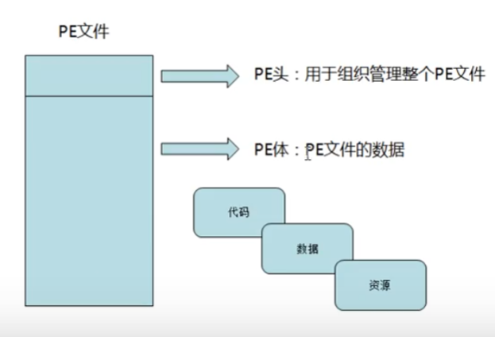

来张图助助兴，如下图所示=。=

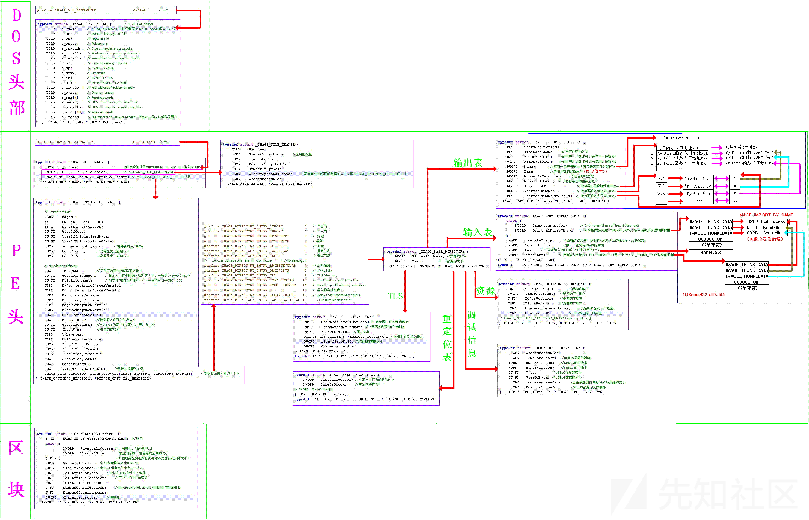

# 2.PE文件结构概述

## 2.1 PE文件结构

一般分为4个部分：

* **DOS头**：DOS头是PE文件结构的第一个头，用来保持对DOS系统的兼容，并且用于定位真正的PE头。我们关注的主要是两个属性：e\_magic （MZ标识）和 e\_lfanew（定位真正的PE头）。
* **NT头**：包括PE文件标识、PE文件头和可选头。包含 windows PE 文件的主要信息，其中包括一个 ‘PE’ 字样的签名，PE文件头(IMAGE\_FILE\_HEADER)和 PE可选头(IMAGE\_OPTIONAL\_HEADER32)。
* **节表**：是PE文件后续节的描述，windows根据节表的描述加载每个节。
* **节**：每个节实际上是一个容器，可以包含 代码、数据 等等，每个节可以有独立的内存权限，比如代码节默认有读/执行权限，节的名字和数量可以自己定义。

## 2.2 编写示例程序

```
.386  //用到的汇编指令的指令集是.386
.model flat, stdcall //flat表示使用的是内存的平坦模式，stdcall是函数调用的一种方式
option casemap:none //casemap:none就是不区分大小写

//调用头文件和链接库
include windows.inc //一些常量
include kernel32.inc //kernel32.dll中的一些系统函数
include user32.inc //user32.dll的一些函数
includelib kernel32.lib
includelib user32.lib

//定义字符串
    .data
szCaption   db  'hello', 0 //db是字节的意思，定义hello字符串，汇编中win32用,'\0'进行结尾
szText	    db 	'hello world!', 0

//代码部分
    .code
start: //代码从标号开始执行，下面的end start也就是说标号是start
    push 0
    lea eax, szCaption
    push eax
    lea eax, szText
    push eax
    push 0
    call MessageBox //一段简单的弹窗代码，弹出文本szCaption和szText
    push 0
    call ExitProcess
    end start
```

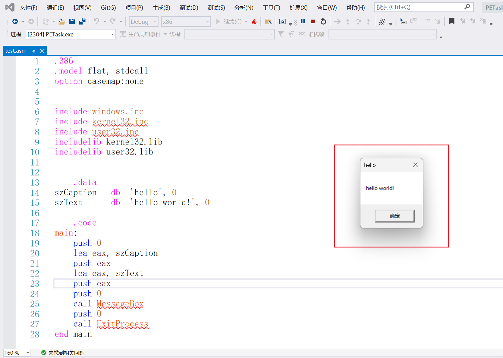

下面的一系列操作以及对PE文件结构的学习均以此程序为例。

## 2.3 VA(虚拟地址)与 RVA(相对虚拟地址)

当一个PE文件被加载到内存中以后，我们称之为"映象 "(image)，一般来说，PE文件在硬盘上和在内存里是不完全一样的，被加载到内存以后其占用的虚拟地址空间要比在硬盘上占用的空间大一些，这是因为各个节在硬盘上是连续的，而在内存中是**按页对齐**的，所以加载到内存以后节之间会出现一些“空洞”。  
因为存在这种对齐，所以在PE结构内部，表示某个位置的地址采用了两种方式：

* 针对在硬盘上存储文件中的地址，称为原始存储地址或物理地址，表示**距离文件头的偏移**。
* 针对加载到内存以后映象中的地址，称为 相对虚拟地址(RVA)，表示**相对内存映象头的偏移**。

然而CPU 的某些指令是需要使用**绝对地址**的，比如取全局变量的地址，传递函数的地址，以及编译后的汇编指令中肯定需要用到绝对地址而不是相对映象头的偏移，因此PE文件会建议操作系统将其加载到某个内存地址(这个叫**基地址**。段地址其实就是一种基地址，但基地址并不等于就是段地址)。编译器便根据这个地址求出代码中一些 全局变量和函数的地址，并将这些地址用到对应的指令中。  
因此可以得出`VA = RVA + IMAGEBASE`。(**虚拟地址VA = 相对虚拟地址RVA + 装载地址**)

# 3. DOS头

## 3.1 DOS头

DOS头是PE文件结构的第一个头，用来保持对DOS系统的兼容，并且用于**定位真正的PE头**。

因为DOS操作系统已经不存在了，DOS头现在的作用也就是保持一个兼容给出一个提示，没什么太大作用。

DOS头在winnt.h头文件中的定义如下（该文件头大小为40h，64d）

> TIPS:WORD是双字节，LONG是4字节

```
typedef struct _IMAGE_DOS_HEADER {		
    WORD	e_magic;						 //00h EXE标志MZ，MZ是一个人名的缩写
    WORD	e_cblp;							 //02h 最后（部分)页中的字节数
    WORD	e_cp;							 //04h 文件中的全部和部分页数
    WORD	e_crlc;							 //06h 重定位表中的指针数
    WORD	e_cparhdr;						 //08h 头部尺寸，以段落为单位
    WORD	e_minalloc;						 //0Ah 所需的最小附加段
    WORD	e_maxalloc;						 //0Ch 所需的最大附加段
    WORD	e_ss;							 //0Eh 初始的SS值(相对偏移量)
    WORD	e_sp;							 //10h 初始的SP值
    WORD	e_csum;							 //12h 校验和
    WORD	e_ip;							 //14h 初始的IP值
    WORD	e_cs;							 //16h 初始的CS值
    WORD	e_lfarlc;						 //18h 重定位表的字节偏移量
    WORD	e_ovno;							 //1Ah 覆盖号
    WORD	e_res[4];						 //1Ch 保留字
    WORD	e_oemid;						 //24h EM标识符（相对e_oeminfo )
    WORD	e_oeminfo;						 //26h OEM信息; e_oemid specific
    WORD	e_res2[10];						 //28h 保留字
    LONG	e_lfanew;						 //3Ch PE头相对于文件的偏移地址
} IMAGE_DOS_HEADER, *PIMAGE_DOS_HEADER;
#define IMAGE_DOS_SIGNATURE 0x4D5A //MZ
```

**我们关注的主要是两个属性：e\_magic 和 e\_lfanew**

* e\_magic用来标志这是一个PE文件
* e\_lfanew用来标志NT头的偏移。

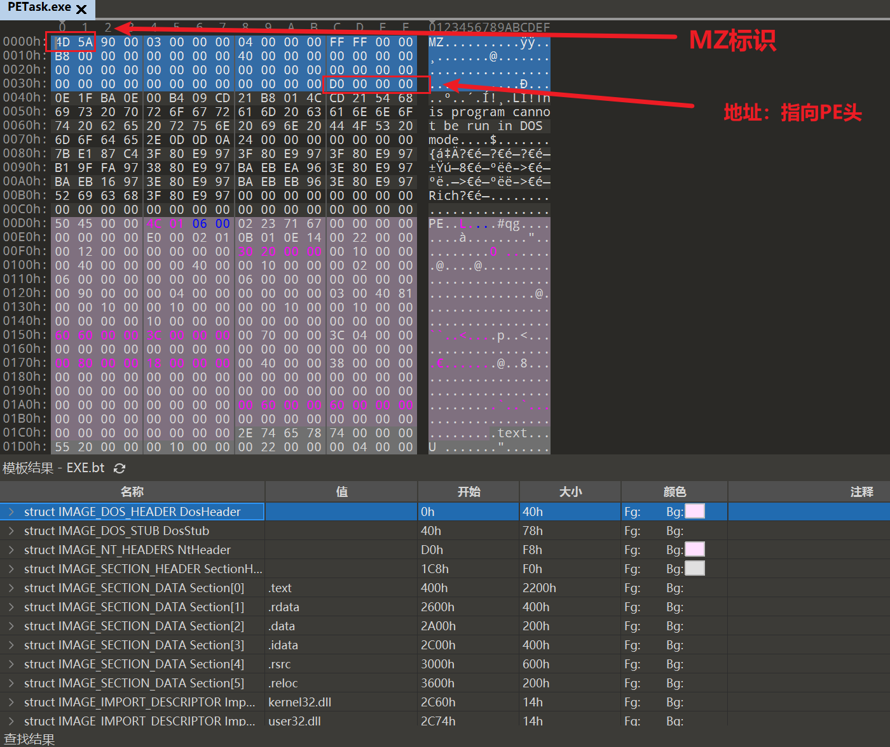

一般来说DOS头的大小为0x40 byte，即64个字节

65开始为PE头

## 3.2 DOS存根

那么，其他属性的作用是什么呢？

我们把00000000到000000B0之间的数据拷贝下来粘贴进一个新文件，保存为dos.bin

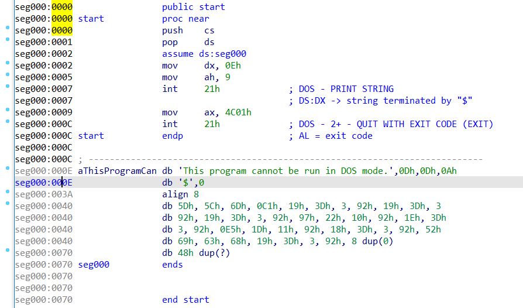

这一块代码实际上是在编译-连接的时候自动添加进来的一个程序，被称为**DOS存根**

读一下汇编，它的作用就是输出”This program cannot be run in DOS mode.”这个字符串，然后功能吗是4C01，即退出程序。

## 3.3 小实验：只有e\_magic和e\_lfanew这两个属性有用

为了证明DOS头只有前2个字节（MZ标识）和后4个字节（指向PE头地址）有用，即只有e\_magic和e\_lfanew这两个属性有用，其他属性都是没用的。我们测试一下。

我们把除了这两个属性之外的属性全部填充为00，再次尝试运行程序。

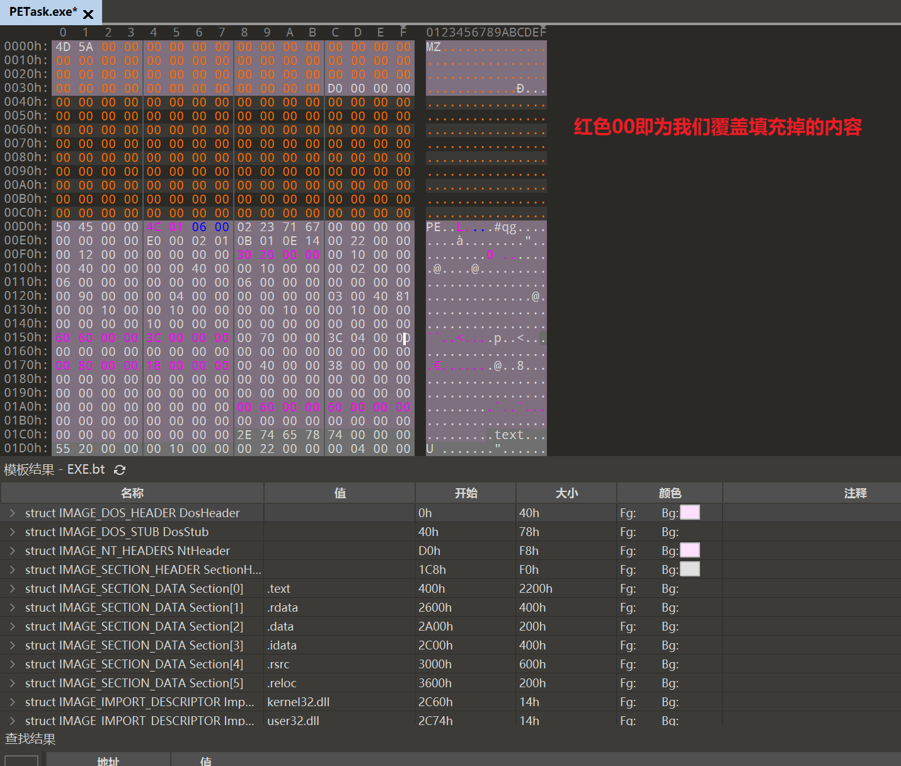

程序成功运行

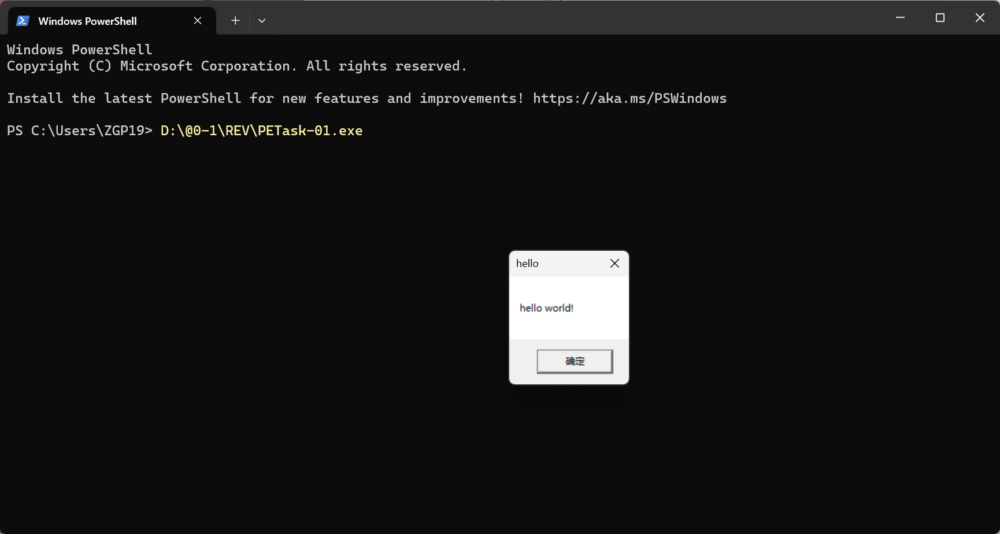

# 4. NT头

NT头结构体主要有3个属性

```
  DWORD                   Signature;
  IMAGE_FILE_HEADER       FileHeader;
  IMAGE_OPTIONAL_HEADER64 OptionalHeader;
```

* PE标识
* 文件头
* 可选头

通过前面介绍的DOS头（IMAGE\_DOS\_HEADER）中的e\_lfanew属性，我们可以找到真正的PE头（IMAGE\_NT\_HEADERS），IMAGE\_NT\_HEADERS的定义如下

```
#ifdef _WIN64
typedef IMAGE_NT_HEADERS64          IMAGE_NT_HEADERS;
typedef PIMAGE_NT_HEADERS64         PIMAGE_NT_HEADERS;
#else
typedef IMAGE_NT_HEADERS32          IMAGE_NT_HEADERS;
typedef PIMAGE_NT_HEADERS32         PIMAGE_NT_HEADERS;
#endif
```

我们发现这个HEADER加了个S，说明他不是单个头组成的，是由多个头组成的。

```
typedef struct _IMAGE_NT_HEADERS64 {    // 64位版本
  DWORD                   Signature;
  IMAGE_FILE_HEADER       FileHeader;
  IMAGE_OPTIONAL_HEADER64 OptionalHeader;
} IMAGE_NT_HEADERS64, *PIMAGE_NT_HEADERS64;

typedef struct _IMAGE_NT_HEADERS {     // 32位版本
  DWORD                   Signature;
  IMAGE_FILE_HEADER       FileHeader;
  IMAGE_OPTIONAL_HEADER32 OptionalHeader;
} IMAGE_NT_HEADERS32, *PIMAGE_NT_HEADERS32;
```

我们重点介绍32位的（64位的只有属性宽度等不同）。 --- **见下面4.2部分**

## 4.1 PE标识

固定的**PE**，两个字节的字符.

## 4.2 PE文件头

文件头结构体是用来**判断程序是exe还是dll**，定义如下：

```
// 该结构体可以用于判断文件是exe文件还是dll文件 
// 14h 20d
struct _IMAGE_FILE_HEADER {
   WORD Machine; 							// 0x04 运行平台
   WORD NumberOfSections; 					 // 0x06 PE中节的数量，最大96个节 
   DWORD TimeDateStamp; 					 // 0x08 文件创建日期和时间，编译器创建此文件时的时间戳 
   DWORD PointerToSymbolTable;				 // 0x0C 指向符号表（用于调试）
   DWORD NumberOfSymbols; 					 // 0x10 符号表中符号个数（用于调试）
   WORD SizeOfOptionalHeader; 				 // 0x14 可选头IMAGE_OPTIONAL_HEADER结构体的长度 32位是E0 64位是F0
   WORD Characteristics; 					// 0x16 文件的属性 exe是010f dll是210e
}IMAGE_FILE_HEADER, *PIMAGE_FILE_HEADER;

#define IMAGE_SIZEOF_FILE_HEADER 20
```

重点关注`Machine，NumberOfSections，SizeOfOptionalHeader和Characteristics`。

\_IMAGE\_FILE\_HEADER.Machine的常用取值如下：

```
#define lMAGE_FILE_MACHINE_1386         0x014c // Intel 386
#define lMAGE_FILE_MACHINE_IA64         0x0200 // Intel 64
```

\_IMAGE\_FILE\_HEADER.Characteristics常用属性如下：

```
#define IMAGE_FILE_RELOCS_STRIPPED			0x0001 // Relocation info stripped from file.没有重定位
#define IMAGE_FILE_EXECUTABLE_IMAGE 		0x0002 // File is executable (i.e. no unresolved externel references).表示是可执行的
#define IMAGE_FILE_LINE_NUMS_STRIPPED 		0x0004 // Line nunbers stripped from file.跳过行号
#define IMAGE_FILE_LOCAL_SYMS_STRIPPED 		0x0008 // Local symbols stripped from file跳过符号
#define IMAGE_FILE_32BIT_MACHINE			0x0100 // 32 bit word machine是32位机器
#define IMAGE_FILE_SYSTEM 					0x1000 // System File.是系统文件
#define IMAGE_FILE_DLL 						0x2000 // File is a DLL.是DLL文件
```

### 4.2.1 文件解析-实验

```
#include <stdio.h>
#include <windows.h>
using namespace std;

#define FILENAME L"C:\Users\Misranduil\Desktop\demo.exe"
//解析DOS头
void PrintDosHdr(PIMAGE_DOS_HEADER pImgDosHdr)
{
    printf("IMAGE_DOS_HEADER:\r
");
    /*
        typedef struct _IMAGE_DOS_HEADER {
      WORD e_magic;
      WORD e_cblp;
      WORD e_cp;
      WORD e_crlc;
      WORD e_cparhdr;
      WORD e_minalloc;
      WORD e_maxalloc;
      WORD e_ss;
      WORD e_sp;
      WORD e_csum;
      WORD e_ip;
      WORD e_cs;
      WORD e_lfarlc;
      WORD e_ovno;
      WORD e_res[4];
      WORD e_oemid;
      WORD e_oeminfo;
      WORD e_res2[10];
      LONG e_lfanew;
    } IMAGE_DOS_HEADER,*PIMAGE_DOS_HEADER;
    */
    //逐个解析就好了，这里只解析e_magic 和 e_lfanew
    printf("e_magic:%04X(%c%c)\r
", pImgDosHdr -> e_magic, *(char*)pImgDosHdr, *((char*)pImgDosHdr + 1));
    printf("e_res[4]:");
    for (int i = 0; i < 4; ++i)
    {
        printf("%02X ", pImgDosHdr -> e_res[i]);
    }
    printf("\r
");
    printf("e_lfanew:%08X\r
", pImgDosHdr -> e_lfanew);
}
//解析NT头
void PrintNtHdr(PIMAGE_NT_HEADERS pImgNtHdrs)
{
    printf("IMAGE_NT_HEADERS:\r
");
    printf("Signature:%08X(%s)\r
", pImgNtHdrs -> Signature, pImgNtHdrs);
}
int main()
{
    // 打开文件 
    HANDLE hFile = CreateFile(FILENAME, GENERIC_READ, FILE_SHARE_READ, NULL, OPEN_EXISTING, FILE_ATTRIBUTE_NORMAL, NULL);
    // 创建文件内核映射对象 
    HANDLE hMap = CreateFileMapping(hFile, NULL, PAGE_READONLY, 0, 0, NULL);
    // 将文件映射入内存 
    LPVOID lpBase = MapViewOfFile(hMap, FILE_MAP_READ, 0, 0, 0);
    PIMAGE_DOS_HEADER pImgDosHdr = (PIMAGE_DOS_HEADER) lpBase;
    PIMAGE_NT_HEADERS32 pImgNtHdr = (PIMAGE_NT_HEADERS) ((DWORD)lpBase + (DWORD)pImgDosHdr -> e_lfanew); 
    PrintDosHdr(pImgDosHdr);
    PrintNtHdr(pImgNtHdr);
    
    // 释放文件映射 
    UnmapViewOfFile(lpBase);
    // 光比文件内核映射对象 
    CloseHandle(hMap); 
    // 关闭文件 
    CloseHandle(hFile);
    return 0;
}
```

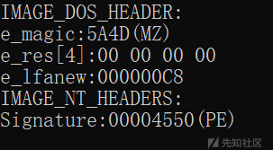

## 4.3 可选头

可选头是IMAGE\_OPTIONAL\_HEADER，它是PE头部中重要的头部，虽然被称为可选头，但是并不是它说的可有可无，而是指**该结构体中的部分数据在不同的文件中是不同的**。

定义如下：

```
// 32位头的大小是e0h, 224d

typedef struct _IMAGE_OPTIONAL_HEADER {
    //
    // Standard fields. 标准字段 
    //

    WORD    Magic; // 0x18 魔术字 107h = ROM Image 10Bh = EXE(32位) Image 20Bh = PE32+(64位) 
    BYTE    MajorLinkerVersion; // 0x1A 连接器主版本号(对执行没有任何影响)
    BYTE    MinorLinkerVersion; // 0x1B 连接器次版本号(对执行没有任何影响)
    DWORD   SizeOfCode; // 0x1C 所有含代码的节的大小（按照文件对齐，判断某节是否含代码，使用节属性是否包含TNA
    // (GE_scu_cwr_coE属性判断，而不是通过IMAGE_sCN_CNT_EXECUTE)
    DWORD   SizeOfInitializedData; // 0x20 所有含有初始化数据的节的大小
    DWORD   SizeOfUninitializedData; // 0x24 所有含未初始化数据的节的大小(被定义为未初始化，不占用文件空间，加载入内存后为其分配空间)
    DWORD   AddressOfEntryPoint; // 0x28 程序执行入口RVA(距离PE加载后地址的距离，对于病毒和加密程序，都会修改该值，从而获得程序的控制权，对于DLL如果没有入口函数，那么是0，对于驱动该值是初始化的函数的地址)
    DWORD   BaseOfCode; // 0x2C 代码的节的起始RVA(一般情况下跟在PE头部的后面)
    DWORD   BaseOfData; // 0x30 数据的节的起始RVA 

    //
    // NT additional fields. NT系统增加的字段 
    //
    DWORD   ImageBase; // 0x34 程序的建议装载地址 （如果被占用了就不能装载在这个地方了）
    DWORD   SectionAlignment; // 0x38 内存中的节的对齐值 32位0x1000 64位0x2000
    DWORD   FileAlignment; // 0x3C 文件中的节的对齐值 0x1000或者0x200
    WORD    MajorOperatingSystemVersion; // 0x40 操作系统主版本号
    WORD    MinorOperatingSystemVersion; // 0x42 操作系统次版本号
    WORD    MajorImageVersion; // 0x44 该PE的主版本号
    WORD    MinorImageVersion; // 0x46 该PE的次版本号
    WORD    MajorSubsystemVersion; // 0x48 所需子系统的主版本号
    WORD    MinorSubsystemVersion; // 0x4A 所需子系统的次版本号
    DWORD   Win32VersionValue; //0x4C 未使用,必须为0
    DWORD   SizeOfImage; // 0x50 内存中的整个PE文件映像大小(按照内存对齐)
    DWORD   SizeOfHeaders; // 0x54 所有头+节表的大小
    DWORD   CheckSum; // 0x58 校验和(一般exe文件为0，而dll和sys文件则必须是正确的值)
    WORD    Subsystem; // 0x5C 文件子系统
    WORD    DllCharacteristics; // 0x5E DLL文件特性
    DWORD   SizeOfStackReserve; // 0x60 初始化时保留的栈大小(默认1M）
    DWORD   SizeOfStackCommit; // 0x64 初始化时实际提交的栈大小(默认4k)
    DWORD   SizeOfHeapReserve; // 0x68 初始化时保留的堆大小(默认1M）
    DWORD   SizeOfHeapCommit; // 0x6C 初始化时实际提交的堆大小(默认4K)
    DWORD   LoaderFlags; // 0x70 加载标志一般为0
    DWORD   NumberOfRvaAndSizes; // 0x74 数据目录的数效量（就是下面那个数组的大小）
    IMAGE_DATA_DIRECTORY DataDirectory[IMAGE_NUMBEROF_DIRECTORY_ENTRIES]; // 0x78 数据目录数组
} IMAGE_OPTIONAL_HEADER32, *PIMAGE_OPTIONAL_HEADER32;
```

* 对齐：32位默认对齐值4K=4096=0x1000，64位默认8K。是内存分页的一个对齐值，大概意思就是比如：A班有50人，坐在一间教师里，B班只有两个人，但是也要坐在相同大的教室里。

### 4.3.1 示例程序查看可选头

由于之前的知识，我们知道**00D0开始是PE头，长度为20字节**，于是我们可以知道可选头即为红线外选中部分。

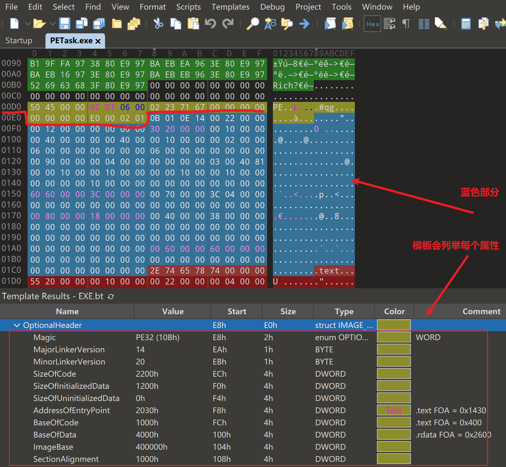

* Magic是0x010B，表示exe文件
* 要求最低的主版本号0x0e，辅版本号0x14
* 代码大小是0x00002200
* 包含的初始化数据大小是0x00001200
* 包含的未初始化数据大小是0
* 程序入口地址是0x00002030
* 代码起始地址是0x00001000
* 数据的起始地址是00001000
* 建议装载地址是00004000......

# 5. 数据目录表

## 5.0 省流复习

可选头（拓展PE头）最后一个成员的  
**第一个 结构体是 导出表** 40+字节大小（多了三个子表-名称表、地址表、序号表），导出表只有一张  
**第二个 结构体是 导入表** 20字节大小（）导入表有很多张  
导入表**第一个成员是INT、第4个成员是模块名字（DLL名字）、第五个成员是IAT**

INT和IAT，PE文件加载前内容相同，加载后IAT发生变化，其中直接存储了函数地址

注：那么为什么不只留一张表呢？ IAT会变化  
 这是因为IAT的函数地址很有可能会被修改掉，导致地址不正确，如果你只有一张表，就没有一个正确的参照物了。

**第六个 结构体是 重定位表**

> 小知识：通过结构体的大小来判断结构/表的结束，例如导入表20字节大小，一个成员后面接着20个\x00，代表导入表结束

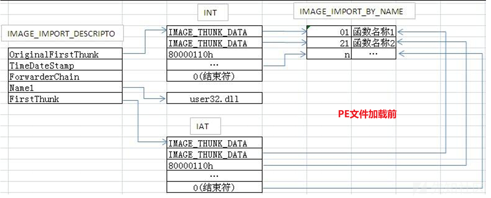

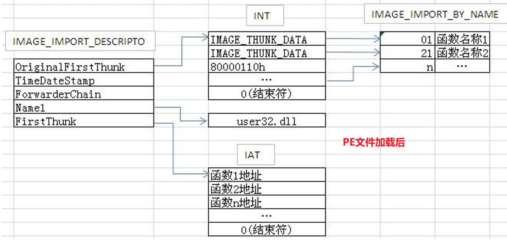

同样包含一大坨，**导入表、导出表**和**重定位表**较为重要。

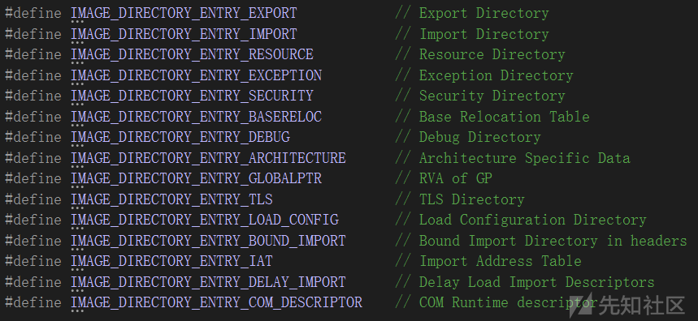

## 5.1 导出表

导出表是用来描述模块(.dll)中的导出函数的结构，如果一个模块导出了函数，那么这个函数会被记录在导出表中，这样通过GetProcAddress()函数就能动态获取到函数的地址。  
函数导出的方式有两种：

* 一种是按名字导出，
* 一种是按序号导出。

这两种导出方式在导出表中的描述方式也不相同。

## 5.2 导入表

导入表在PE文件加载时，会根据这个表里的内容加载依赖的模块(.dll)，并填充所需函数的地址。

## 5.3 重定位表

为了解决像call这样的使用VA的代码，在模块基址发生变化时还能准确定位而产生的表。步骤如下：

1. 编译的时候由编译器识别出哪些项使用了模块内的直接VA，比如push、一个全局变量、函数地址，这些指令的操作数在模块加载的时候就需要被重定位。
2. 链接器生成PE文件的时候将编译器识别的重定位的项纪录在一张表里，这张表就是重定位表，保存在 DataDirectory中，序号是IMAGE\_DIRECTORY\_ENTRY\_BASERELOC。
3. PE文件加载时，PE加载器分析重定位表，将其中每一项按照现在的模块基址进行重定位。

# 6. 节表解析与地址转换

在PE文件中经常会用到三种地址，分别是

* VA (Virtual Address): 虚拟地址
* RVA (Relatvie Virtual Address)∶ 相对虚拟地址
* FOA (File Offset Address): 文件偏移地址

节表结构体如下：

```
//Section header format.

//此处偏移是按照每个IMAGE_SECTION_HEADER开始的(大小为28h,40d)

#define IMAGE_SIZEOF_SHORT_NAME 8       //（节的长度最长为8）

typedef struct_IMAGE_SECTION_HEADER
{
    BYTE Name[IMAGE_SIZEOF_SHORT_NAME]; // 000h节名称
    union
    {
        DWORD PhysicalAddress;
        DWORD VirtualSize;               // 0008h 节区的尺寸 
    }Misc;
    DWORD VirtualAddress;               // 000ch 节区的起始RVA地址
    DWORD SizeOfRawData;                // 0x10 在文件中对齐后的尺寸 
    DWORD PointerToRawData;             // 0x14 该节在文件中的起始偏移
    DWORD PointerToRelocations;         // 0x18 在OBJ文件中使用 
    DWORD PointerToLinenumbers;         // 0x1C 行号表的位置(调试用)
    WORD NumberOfRelocations;           // 0x20 在OBJ文件中使用 
    WORD NumberOfLinenumbers;           // 0x24 行号表中行号的数量 
    DWORD Characteristics;              // 0x28 节的属性 
}IMAGE_SECTION_HEADER,*PIMAGE_SECTION_HEADER; 
#define IMAGE_SIZEOF_SECTION_HEADER 
```

## 6.1 用LordPE解析节表

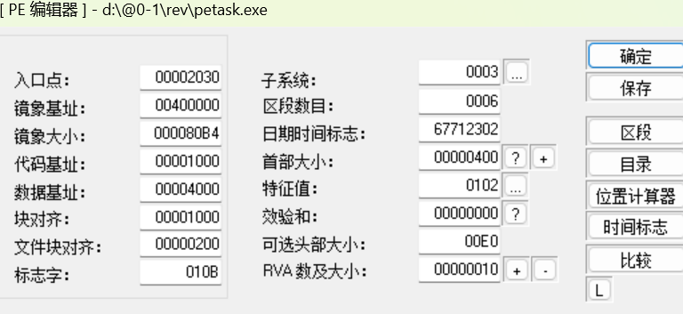

## 6.2 解析节表-代码编写

节表解析整体思路是：

* (1)、先得到节数量 NumberOfSections
* (2)、循环次数=节数量
* (3)、依据节的结构体来解析每个节的数据
* (4)、输出相应的数据显示到控制台中

```
vector<IMAGE_SECTION_HEADER_2> vsection_header;
//解析节表
for (size_t i = 0; i < IMAGE_NT_HREADERS_2.FileHeader.NumberOfSections; i++)
{
    IMAGE_SECTION_HEADER_2 aa;
    fread(&aa, sizeof(aa), 1, fp);
    vsection_header.push_back(aa);
}
//打印节中的数据
printf("---------------节表数据----------------
");
cout << "节数量:" << IMAGE_NT_HREADERS_2.FileHeader.NumberOfSections << endl;
for (size_t i = 0; i < IMAGE_NT_HREADERS_2.FileHeader.NumberOfSections; i++)
{
    printf("--> %s段信息 <--
", vsection_header[i].Name);
    SetConsoleTextAttribute(handle, FOREGROUND_INTENSITY | FOREGROUND_RED);
    printf("*[内存中段大小]:0x%x
", vsection_header[i].Misc.VirtualSize);
    SetConsoleTextAttribute(handle, FOREGROUND_INTENSITY | FOREGROUND_BLUE);
    printf("*[内存中偏移]:0x%x
", vsection_header[i].VirtualAddress);
    SetConsoleTextAttribute(handle, FOREGROUND_INTENSITY | FOREGROUND_RED);
    printf("*[文件中段大小]:0x%x
", vsection_header[i].SizeOfRawData);
    SetConsoleTextAttribute(handle, FOREGROUND_INTENSITY | FOREGROUND_BLUE);
    printf("*[文件中偏移]:0x%x
", vsection_header[i].PointerToRawData);
    SetConsoleTextAttribute(handle, 0x07);
    printf("[OBJ重定位偏移]:0x%x
", vsection_header[i].PointerToRelocations);
    printf("[OBJ重定位项数目]:0x%x
", vsection_header[i].NumberOfRelocations);
    printf("[行号表偏移]:0x%x
", vsection_header[i].PointerToLinenumbers);
    printf("[行号表中的数目]:0x%x
", vsection_header[i].NumberOfLinenumbers);
    SetConsoleTextAttribute(handle, FOREGROUND_INTENSITY | FOREGROUND_RED);
    printf("*[标志|属性]:0x%x ", vsection_header[i].Characteristics);
    //区段的属性
    DWORD l_Charctieristics = (BYTE)((DWORD)(vsection_header[i].Characteristics) & 0xFF);
    DWORD h_Charctieristics = (BYTE)(((DWORD)(vsection_header[i].Characteristics) >> 24) & 0xFF);

    vector<byte> l_flag;
    vector<byte> h_flag;
    //低位
    l_flag.push_back((l_Charctieristics >> 7) ? 3 : 0);
    l_flag.push_back((l_Charctieristics >> 6) & 1 ? 2 : 0);
    l_flag.push_back((l_Charctieristics >> 5) & 1 ? 1 : 0);
    //高位
    h_flag.push_back((h_Charctieristics >> 7) ? 7 : 0);
    h_flag.push_back((h_Charctieristics >> 6) & 1 ? 6 : 0);
    h_flag.push_back((h_Charctieristics >> 5) & 1 ? 5 : 0);
    h_flag.push_back((h_Charctieristics >> 4) & 1 ? 4 : 0);

    //包含数据情况
    SetConsoleTextAttribute(handle, FOREGROUND_INTENSITY | FOREGROUND_GREEN);
    for (vector<byte>::iterator iter = l_flag.begin(); iter != l_flag.end(); iter++)
    {
        switch (*iter)
        {
            case 1:
                cout << "(包含可执行代码),";
                break;
            case 2:
                cout << "(包含已初始化数据),";
                break;
            case 3:
                cout << "(包含未初始化数据),";
                break;
            default:
                break;
        }
    }
    //可读写执行情况
    for (vector<byte>::iterator iter = h_flag.begin(); iter != h_flag.end(); iter++)
    {
        switch (*iter)
        {
            case 4:
                cout << "(共享),";
                break;
            case 5:
                cout << "(可执行),";
                break;
            case 6:
                cout << "(可读),";
                break;
            case 7:
                cout << "(可写),";
                break;
            default:
                break;
        }
    }
    cout << endl << endl;;

    SetConsoleTextAttribute(handle, 0x07);
}
SetConsoleTextAttribute(handle, FOREGROUND_INTENSITY | FOREGROUND_GREEN);
printf("--> 标志(属性块) 常用特征值对照表：<--
");
printf("[值:00000020h](*包含可执行代码)
");//IMAGE_SCN_CNT_CODE
printf("[值:00000040h](*该块包含已初始化的数据)
");//IMAGE_SCN_CNT_INITIALIZED_DATA
printf("[值:00000080h](*该块包含未初始化的数据)
");//IMAGE_SCN_CNT_UNINITIALIZED_DATA
printf("[值:00000200h][Section contains comments or some other type of information.]
");//IMAGE_SCN_LNK_INFO
printf("[值:00000800h][Section contents will not become part of image.]
");//IMAGE_SCN_LNK_REMOVE
printf("[值:00001000h][Section contents comdat.]
");//IMAGE_SCN_LNK_COMDAT
printf("[值:00004000h][Reset speculative exceptions handling bits in the TLB entries for this section.]
");//IMAGE_SCN_NO_DEFER_SPEC_EXC
printf("[值:00008000h][Section content can be accessed relative to GP.]
");// IMAGE_SCN_GPREL
printf("[值:00500000h][Default alignment if no others are specified.]
");//IMAGE_SCN_ALIGN_16BYTES  
printf("[值:01000000h][Section contains extended relocations.]
");//IMAGE_SCN_LNK_NRELOC_OVFL
printf("[值:02000000h][Section can be discarded.]
");//IMAGE_SCN_MEM_DISCARDABLE
printf("[值:04000000h][Section is not cachable.]
");//IMAGE_SCN_MEM_NOT_CACHED
printf("[值:08000000h][Section is not pageable.]
");//IMAGE_SCN_MEM_NOT_PAGED
printf("[值:10000000h](*该块为共享块).
");//IMAGE_SCN_MEM_SHARED
printf("[值:20000000h](*该块可执行)
");//IMAGE_SCN_MEM_EXECUTE
printf("[值:40000000h](*该块可读)
");//IMAGE_SCN_MEM_READ
printf("[值:80000000h](*该块可写)

");// IMAGE_SCN_MEM_WRITE
SetConsoleTextAttribute(handle, 0x07);//IMAGE_SCN_MEM_WRITE
```

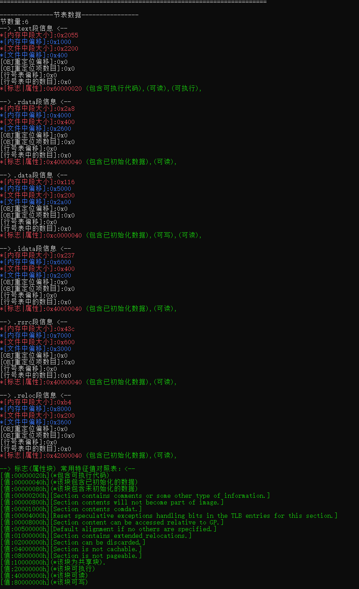

## 6.3 计算地址-地址转换

比如我们要找字符串`Hello World!`在文件中的偏移地址FOA

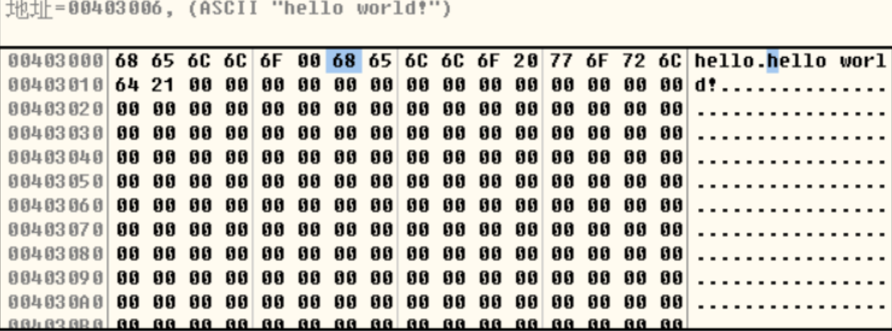

我们发现该字符串的虚拟地址VA为0x00403006

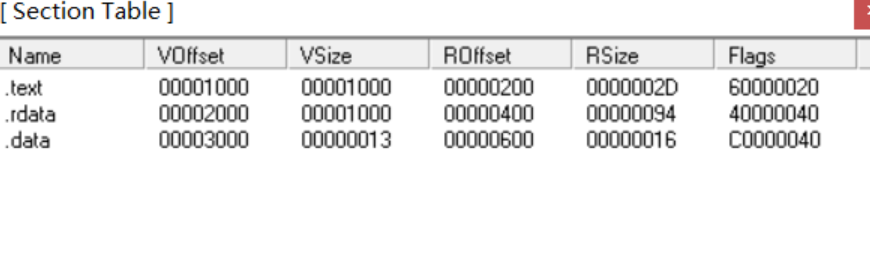

同时我们也知道每个节的VA，RVA，FOA。那么由此计算该字符串的FOA的方法如下：

1. **计算**内存中的相对起始地址**RVA** =虚拟地址VA - 装载地址 ，即0x00403006 - 0x00400000 = 0x00003006
2. 找到RVA对应的**节**，由于.data的RVA为0x00003000，长度为0x00001000，所以该字符串对应的节为.data
3. 计算.data的**RVA和FOA的差值**，即0x00003000 - 0x00000600 = 0x00002800(注意是16进制计算)
4. 用该字符串的**RVA减去该差值**得到其FOA，即0x00003006 - 0x00002800 = 0x00000806。

# 7. 节操作

## 7.1 添加节-省流

添加节可以是一种软件保护措施，比如把可执行代码写入一个甚至两个节中打到保护的目的。

添加节的一般步骤

1. 增加节表项 - 找到节位置，在最后一个节后面添加40字节
2. 修正文件的映像长度 - 可选头的SizeOfImage + 0x1000
3. 修正一个节的数量 - PE头的NumberOfSections **+1**
4. 增加文件的节数据 - 文件末尾 添加数据  
   即：IMAGE\_OPTIONAL\_HEADER.SizeOfImage;  
   IMAGE\_FILE\_HEADER.NumberOfSections;

## 7.2 节操作的几种（循序渐进）

1. PE文件空白区添加代码（shellcode-战损）

如果空白区不够用，怎么办？

2. 扩大节（弊端-最后一个节属性被修改,插入代码与原节数据混在一块）
3. 新增节 (**节表后至少有40字节空白区**)
4. 合并节

# 8. 参考

* 逆向工程核心原理
* 滴水逆向
