# 某rdm系统代码审计upload&download-先知社区

> **来源**: https://xz.aliyun.com/news/16861  
> **文章ID**: 16861

---

# 前言

通过最常见的审计手法，无任何花里胡哨的工具以及繁琐的步骤审计upload&download

# 文件上传

java代码审计方式很多种，不过第一步都是通过web.xml文件进行入手，查看web.xml文件，发现存在两个比较可以的接口，分别为upload和download，这种一般就是有情况

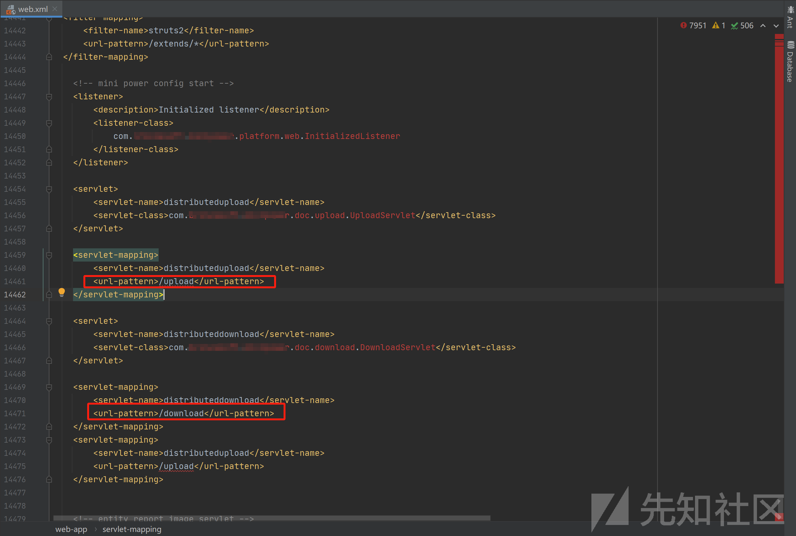

我们直接根据接口映射关系找到处理文件上传的接口，其中存在一个getFilepath函数，一共四个参数其中dir以及name参数分别为目录路径以及文件名，随后进行验证这两个参数是否为空，还有两个参数为start和size，这两个参数是分段处理文件上传的，然后也是对该两个参数验证是否为有效的长整形数字，验证失败则返回null，到后面我们需要对传入的参数进行base64编码处理

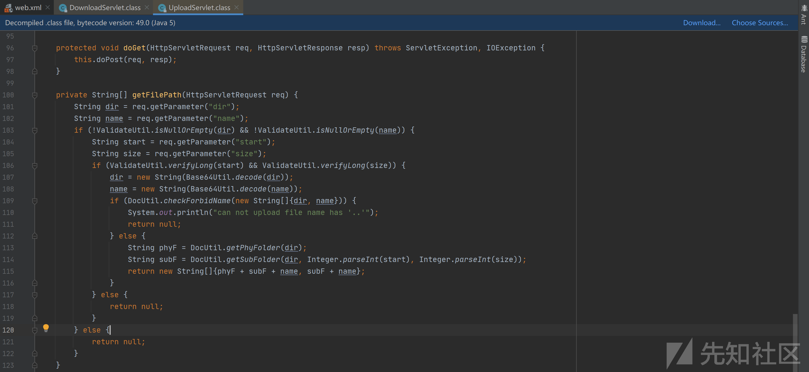

然后我们发现存在一个checkForbidName函数，对路径进行校验，遍历传入的数组，并判断是否存在`..`，如果存在..则直接返回true然后打印`can not upload file name has '..'`

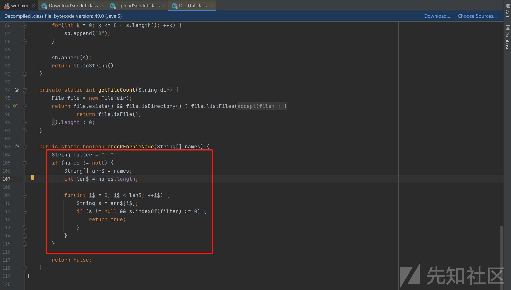

最后面还会存在两个函数`getPhyFolder，getSubFolder`，该两个函数分别获取物理目录路径和，根据分页参数构造子目录路径，最终返回一个包含完整物理路径和相对路径的字符串数组。

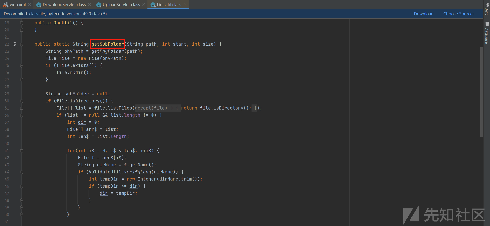

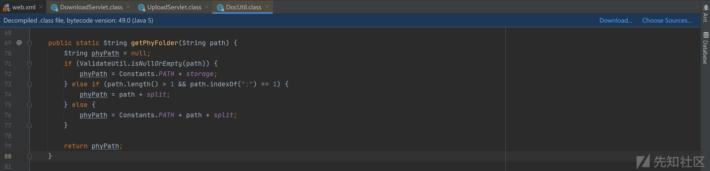

## 漏洞复现

我们构造请求包，可以发现dir以及name参数均进行了base64编码，上传成功后返回路径

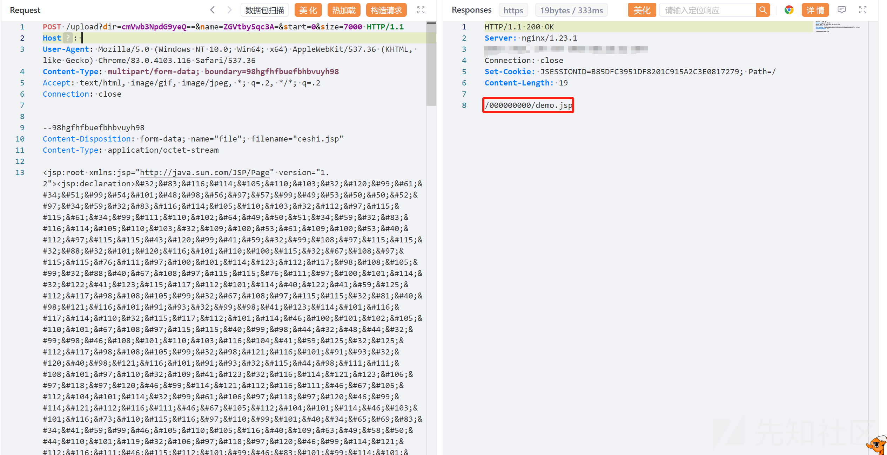

然后我们对dir参数的相对路径加上返回包中的路径进行拼接访问发现成功执行

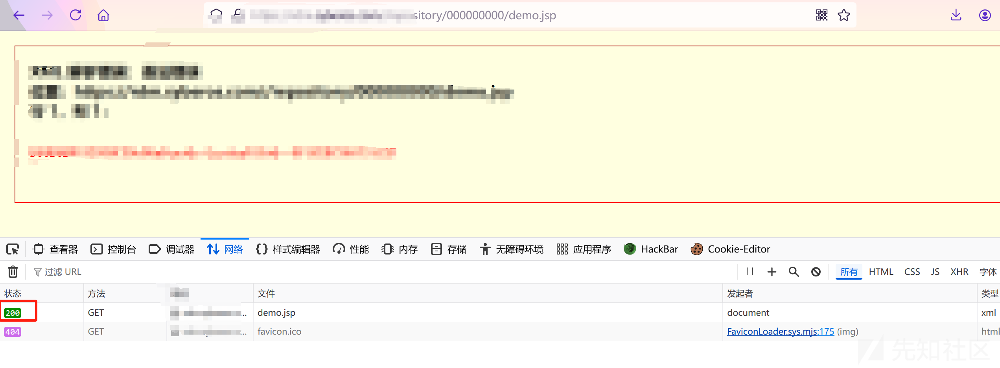

使用哥斯拉连接shell，连接成功。

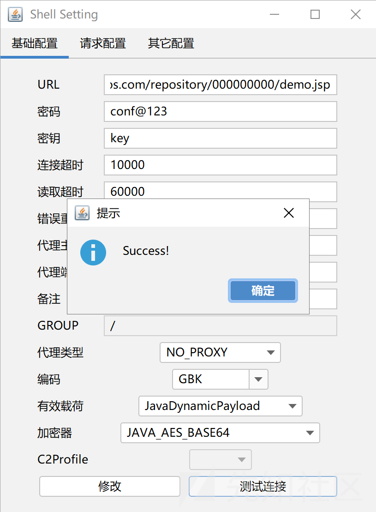

# 文件下载

我们通过web.xml文件除了发现上述的upload还存在一个download接口，我们继续查看download接口，发现情况和上述文件上传类似。

首先我们分析一下下图代码中的关键点，

* 代码中对 `dir`、`address` 和 `fileName` 使用了 `Base64Util.decode` 方法。因此，需要将这些参数进行 Base64 编码。
* `DocUtil.checkForbidName` 方法会检查路径中是否包含非法字符，这个和文件上传是同一个方法，就不展开说了
* `DocUtil.getPhyFolder` 方法会根据输入的 `dir` 构造物理路径，因此需要保证路径正确。

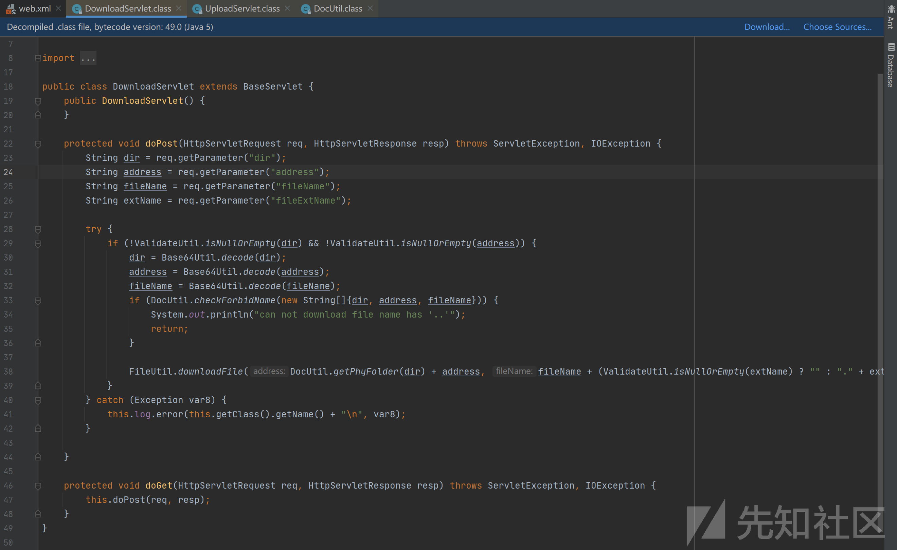

最后通过downloadFile函数进行文件下载，如果能够执行到38行进去else语句中，那么返回头里面就会存在`resp.setHeader("Content-disposition", "attachment;filename=\"" + encodeFileName(fileName) + "\"");`字段，因此我们可以通过此特征判断是否可进行文件下载

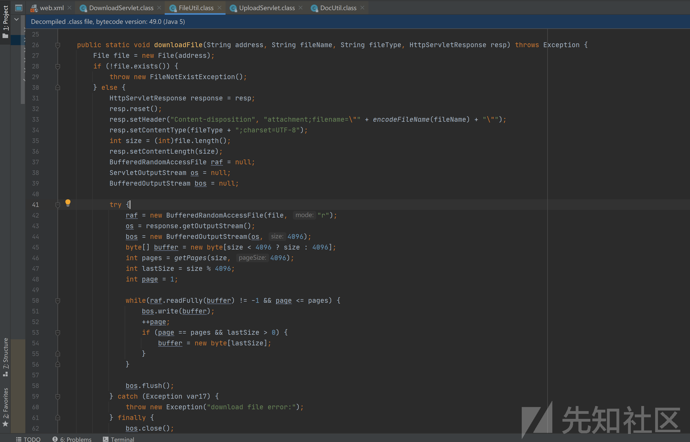

使用yakit发包，发现响应头存在该字段

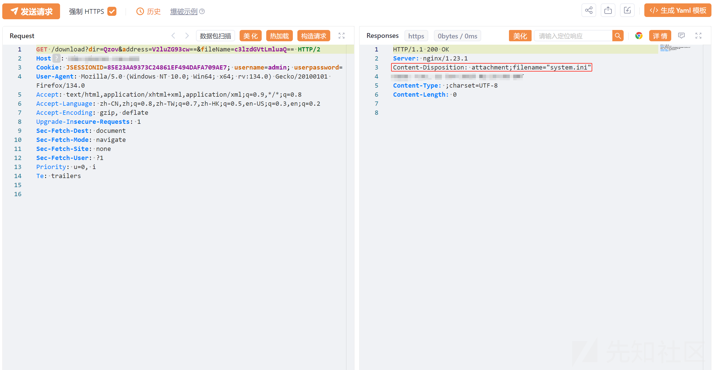

使用浏览器访问该连接即可下载

