# 文件操作路由接口代码分析至getshell-先知社区

> **来源**: https://xz.aliyun.com/news/16862  
> **文章ID**: 16862

---

# 前言

年底闲来无事，一直在学习白盒审计，php代码审计相对于java而言比较轻松，但是遇到路由问题也是比较头痛，所以再次简单记录下，自己也学习一下。

# 任意文件上传

当获取到源码时，可以从两个方向进行审计，第一个方向就是直接全局搜索关键字，比如如下，搜索upload、donwload、exec或者其它的一些关键字来定位代码位置从而进行分析

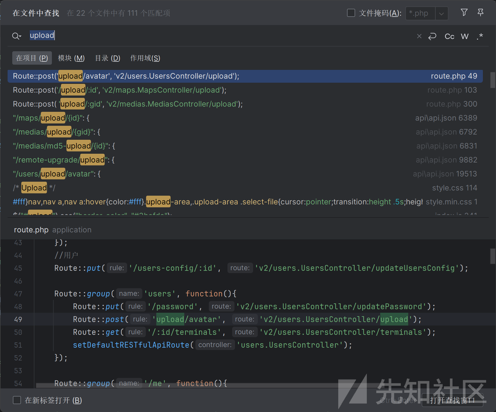

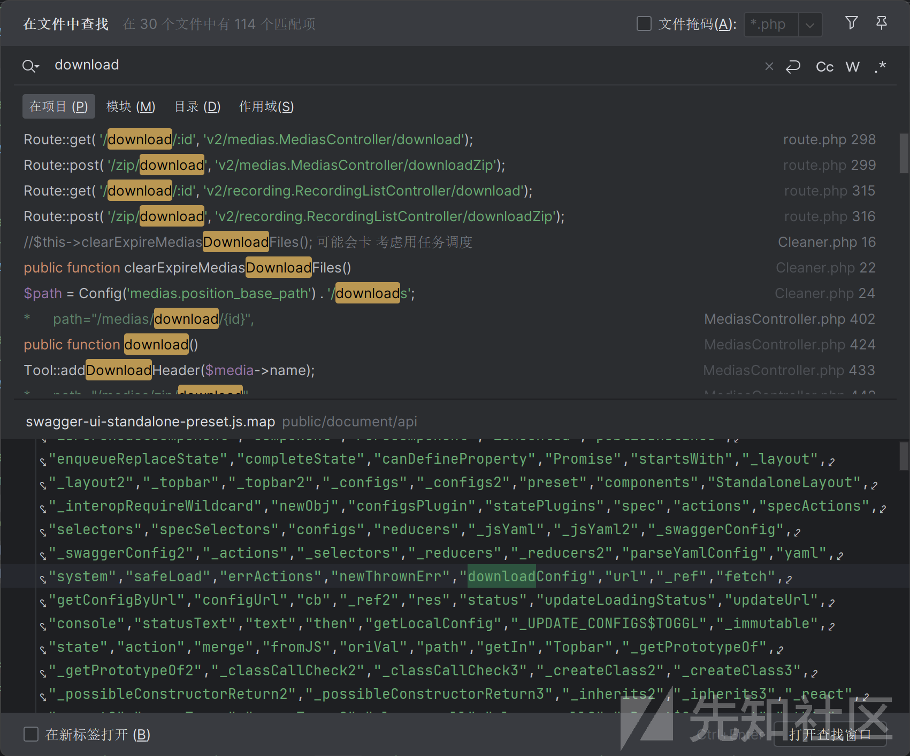

还有一种方向就是直接通过路由为入口进行分析，这套源码刚好是thinkphp框架，因此存在路由，所以可以从路由来分析，，一般thinkphp路由的位置在`application/route.php`下面，因此可以查看router.php文件去作为入口寻找突破点

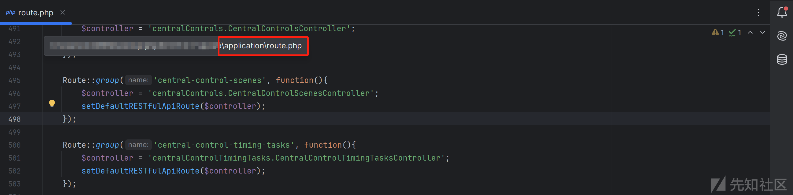

发现在510行有一个remote-upgrade路由，简单概述一下，主要存在该路由下存在四个处理接口，其中第一个接口为post请求的upload接口，还有get请求的all接口，还有两个delete请求的接口，此remote-upgrade路由均通过`$controller = 'remoteUpgrade.RemoteUpgradeController';`类中的接口进行处理。

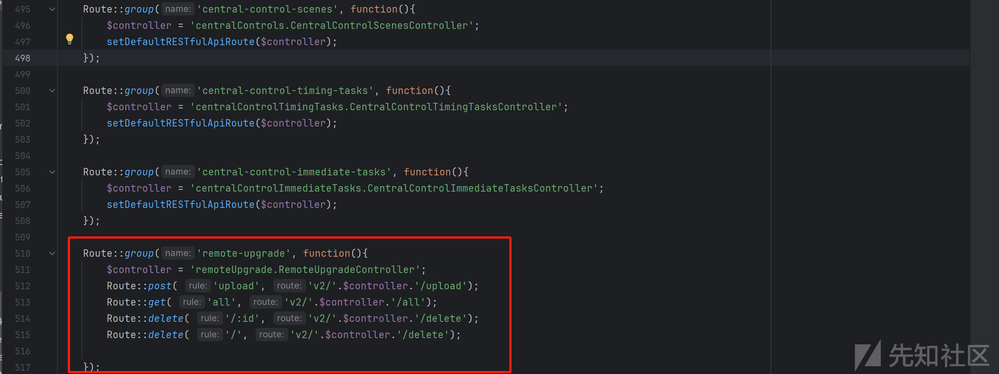

先查看upload接口，查看是否可以进行文件上传，根据路由可以定位到函数在`v2/controller/remoteUpgrade/RemoteUpgradeController.php`中，进入其中，其中发现存在upload函数，该函数主要功能为获取POST请求上传的文件，如果请求为POST但是没有文件上传则抛出IpwebException异常，如果存在则验证文件名并解析文件后缀，还进行文件长度验证是否在1到250之间，不满足则抛出异常，然后计算文件hash值验证文件唯一性，从配置文件中获取文件保存路径，并且把上传的filename重新命名，随后还要验证上传的文件大小是否符合，最后构建响应数据，返回文件上传相关信息。

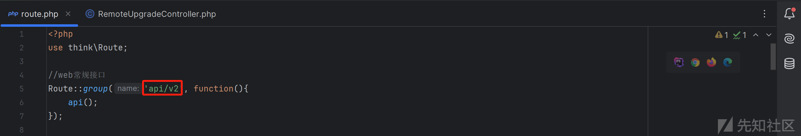

因此我们可以直接访问文件上传接口，查看是否能够文件上传成功，通过上图可以发现文件上传接口为/api/v2/remote-upgrade/upload

直接构造数据包进行文件上传，上传成功且返回文件路径链接

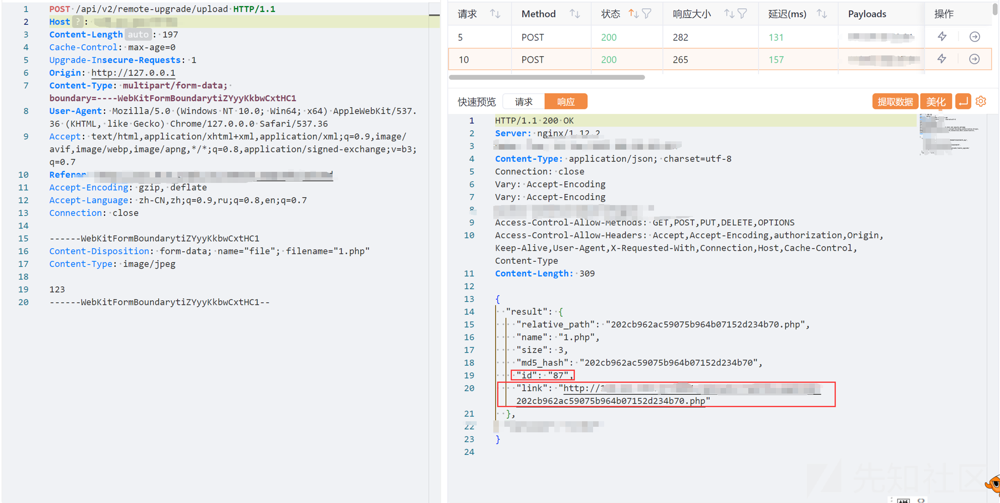

访问路径链接成功上传

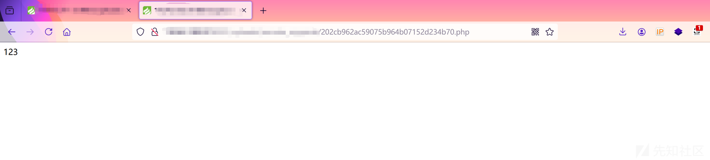

# 任意文件删除

接下来查看任意文件删除，通过router.php一样可以发现和上述任意文件上传类似

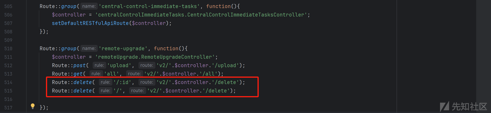

我们直接查看delete函数，该函数删除代码逻辑主要是从`Tool::mergeIdAndIds(input())` 方法从请求中提取ID值，如果id值为空表示没有需要删除的内容，反之则使用该`$files = (Array) $this->r->whereIn('id', $ids)->select();`语句查询数据库获取id值，然后计算hash值的方式最后遍历文件从而找到需要删除的文件最后删除文件并以json格式响应数据

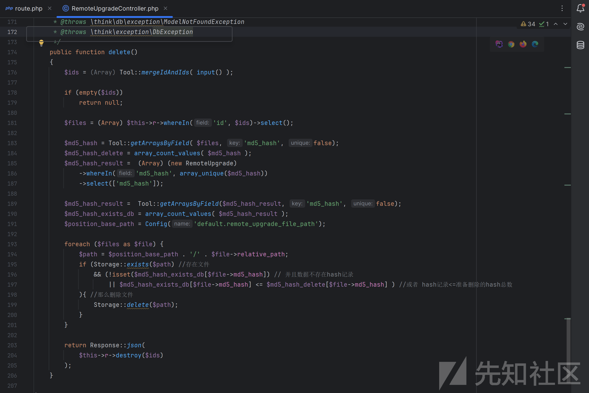

先进行文件上传，发现id字段为167

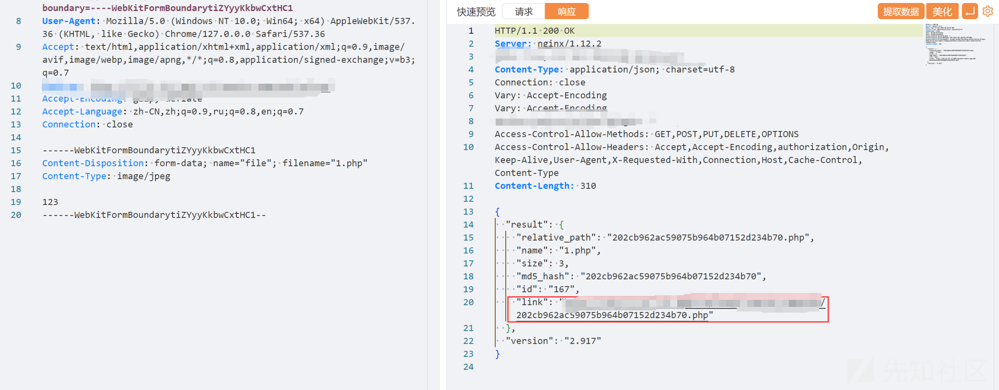

浏览器访问，上传文件成功

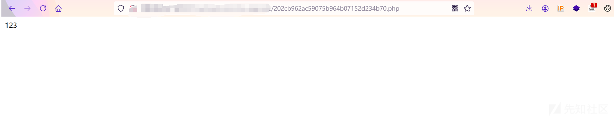

使用DELETE请求进行删除文件，当result为1时，删除成功

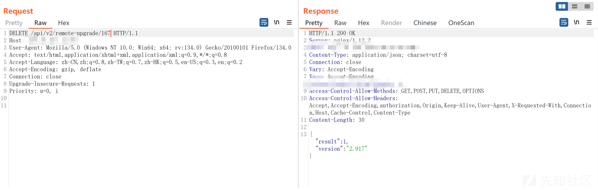

反之如下，result为0，意味着文件不存在，因此我们即使在不知道文件的情况下也可以对文件进行任意删除操作

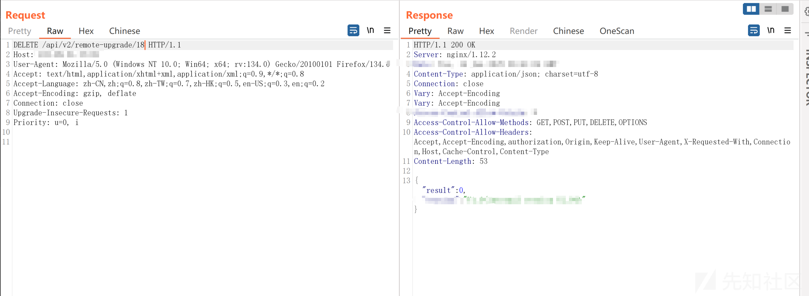

# 文件浏览

我们发现remote-upgrade路由还存在一个all接口

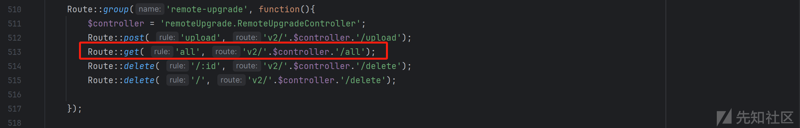

这个接口一看名字就知道什么意思，猜测是对所有文件进行浏览，我们进行`v2/controller/remoteUpgrade/RemoteUpgradeController.php`查看all函数处理逻辑，很简单的一段函数，其主要功能是获取所有文件记录，并为每条记录生成一个访问链接以及相关的文件信息，同时检查文件是否实际存在于存储路径中

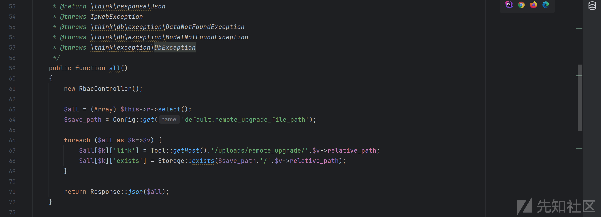

但是此接口需要进行登录才能使用，所以无法未授权访问，如下图：

