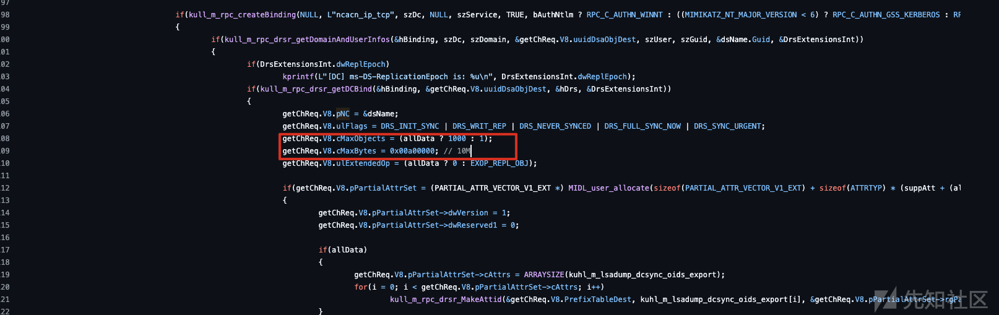
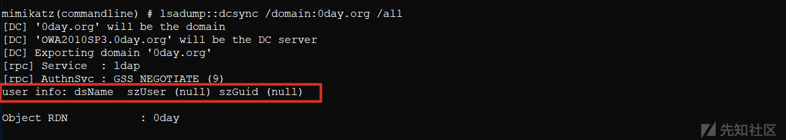
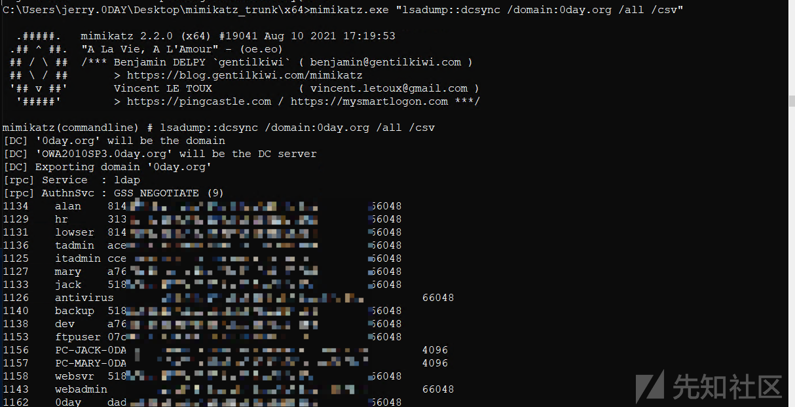
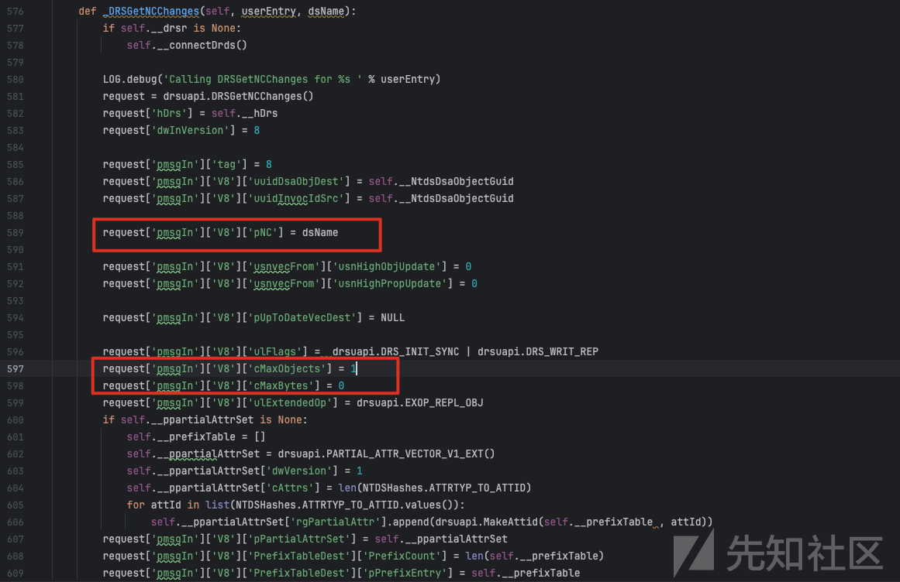
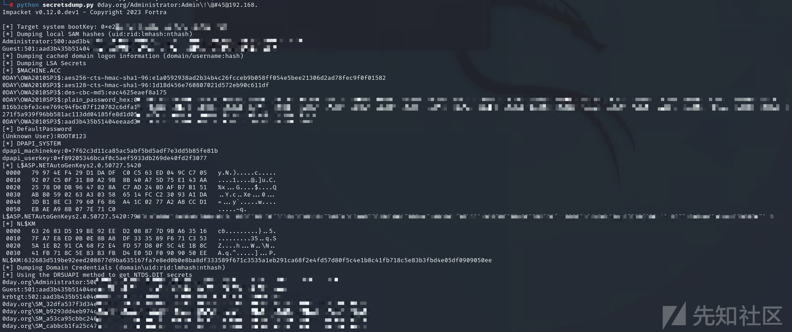
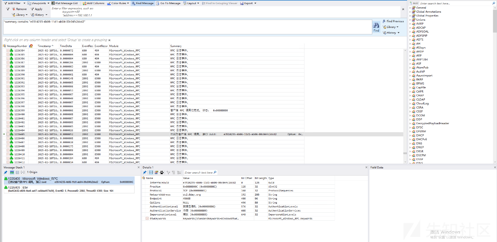
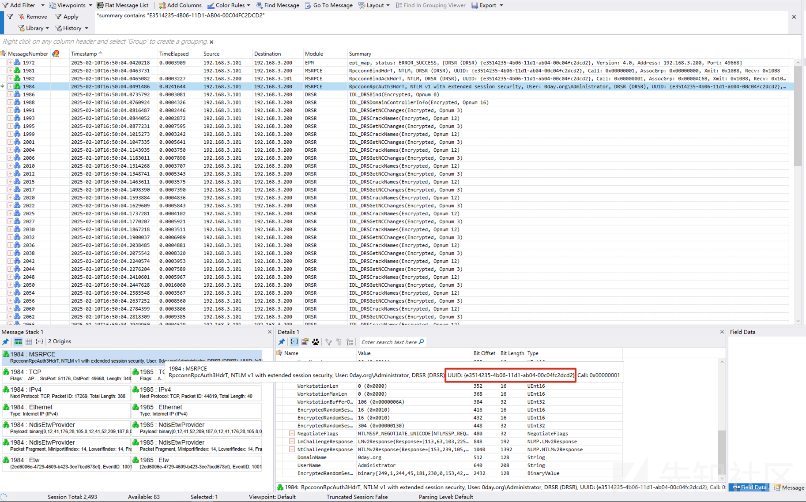
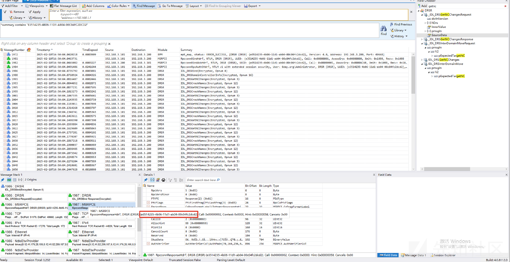
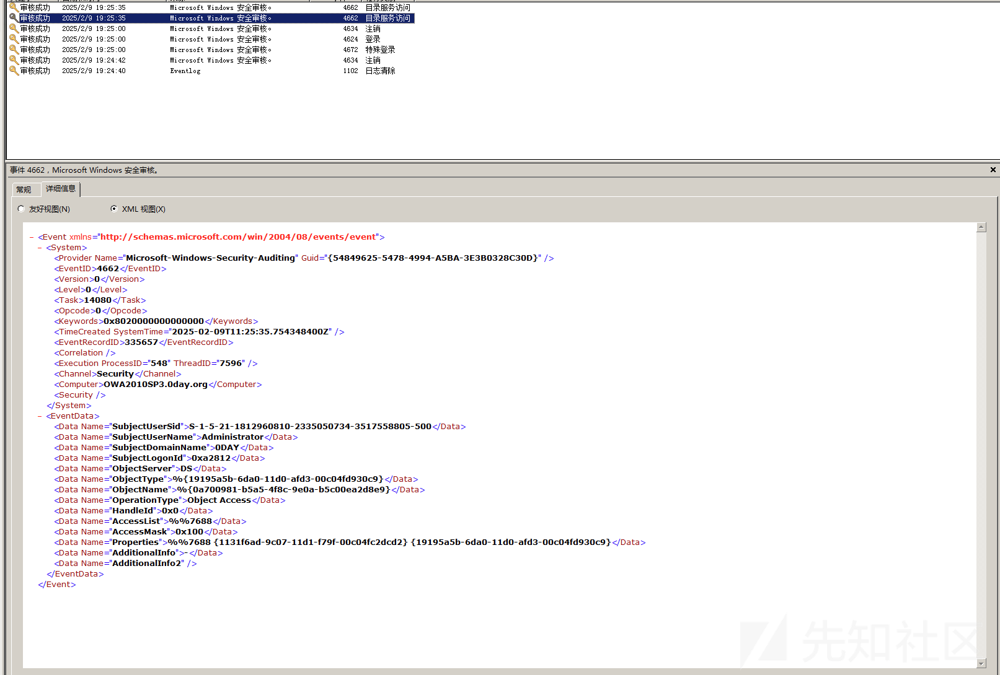
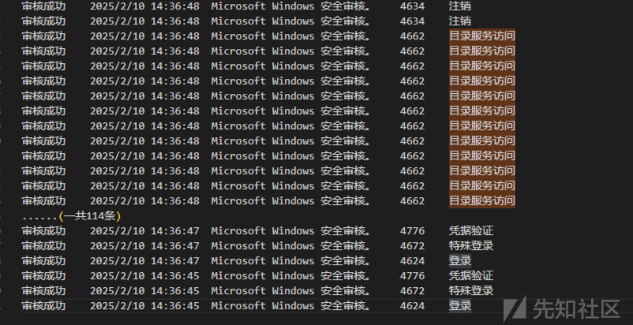

# 还看！dump你的域hash来了！-  域安全-先知社区

> **来源**: https://xz.aliyun.com/news/16864  
> **文章ID**: 16864

---

# 一、前言

很多企业都会部署windows域，而且一些身份验证都都跟域相关，所以无论蓝军还是防守方都会跟windows域接触比较多，上次深入分析了打印机漏洞：

[域安全-PrintNightmare打域控漏洞的一次艰难利用](<https://mp.weixin.qq.com/s/zwilhOk_9Ape4CksEKC__Q?token=1948604512>)

​

这次聊的是dcsync（打域的常规的操作）攻击以及防御，通过深入分析获得如下结论：

**对于蓝军来说，使用impacket的secretdump.py dcsync会增加暴露的可能，mimikatz实现dcsync隐蔽性会比稍好些。**

**对防守方来说，****需要重新思考一下****落地并且准确检测攻击者进行****dcsync的方案（目前公开的方案并不是很好）。**

​

​

# 二、如何利用？

什么是DCSynC？DCSync 是一种在 AD 域渗透中常用的凭据窃取技术。默认情况下，域内的不同域控制器（DC）会每隔 一段时间进行一次数据同步。当一个域控制器从另一个域控制器同步数据时，发起请求的域控制器会通过目录复制协议（MS-DRSR）来复制目标域控制器中的用户密码信息。DCSync 正是利用了这一机制，通过“模拟”一个域控制器向真实域控制器发送同步请求，从而获取用户凭据数据。由于这种攻击利用了 Windows RPC 协议，无需登录域控制器或在域控制器上执行文件操作。

​

目前用的比较多的是两款工具，mimikatz的dcsync dump hash，还有一个是impacket的secretdump.py dcsync，经过测试以及分析源码，发现两款工具实现也有一些区别。

​

**首先说结论：****impacket的secretdump.py dcsync会增加暴露的可能，mimikatz实现dcsync隐蔽性会比稍好些。**

​

​

为什么会有这个区别呢？两款工具的原理都是调用IDL\_DRSGetNCChanges，但是里面指定的参数不同（DRS\_MSG\_GETCHGREQ\* pmsgIn）。

​

IDL\_DRSGetNCChanges：<https://learn.microsoft.com/en-us/openspecs/windows_protocols/ms-drsr/b63730ac-614c-431c-9501-28d6aca91894>

​

## mimikatz实现dcsync

IDL\_DRSGetNCChanges关键参数DRS\_MSG\_GETCHGREQ\* pmsgIn有多个版本：<https://learn.microsoft.com/en-us/openspecs/windows_protocols/ms-drsr/96affbe1-7d93-453e-ac75-9f41c0c94b3b>

​

​

mimikatz用的是DRS\_MSG\_GETCHGREQ\_V8 pmsgIn：<https://learn.microsoft.com/en-us/openspecs/windows_protocols/ms-drsr/4304bb4a-e9b5-4c8a-8731-df4d6f9ab567>

​

具体定义如下：

```
typedef struct {
   UUID uuidDsaObjDest;
   UUID uuidInvocIdSrc;
   [ref] DSNAME* pNC;
   USN_VECTOR usnvecFrom;
   [unique] UPTODATE_VECTOR_V1_EXT* pUpToDateVecDest;
   ULONG ulFlags;
   ULONG cMaxObjects;
   ULONG cMaxBytes;
   ULONG ulExtendedOp;
   ULARGE_INTEGER liFsmoInfo;
   [unique] PARTIAL_ATTR_VECTOR_V1_EXT* pPartialAttrSet;
   [unique] PARTIAL_ATTR_VECTOR_V1_EXT* pPartialAttrSetEx;
   SCHEMA_PREFIX_TABLE PrefixTableDest;
 } DRS_MSG_GETCHGREQ_V8;
```

pNC: NC root of the replica to replicate or the FSMO role object for an extended operation. 可以用来指定对应的账户，但是mimikatz设置的pNC 为{0}为空，并且设置了最大的最大的返回对象数量（就是dump了）。

<https://github.com/gentilkiwi/mimikatz/blob/b401761f30d6f714340cc6fb7f6aefe5c690d8a5/mimikatz/modules/lsadump/kuhl_m_lsadump_dc.c#L106-L110>

```
getChReq.V8.pNC = &dsName;
getChReq.V8.ulFlags = DRS_INIT_SYNC | DRS_WRIT_REP | DRS_NEVER_SYNCED | DRS_FULL_SYNC_NOW | DRS_SYNC_URGENT;
getChReq.V8.cMaxObjects = (allData ? 1000 : 1);
getChReq.V8.cMaxBytes = 0x00a00000; // 10M
getChReq.V8.ulExtendedOp = (allData ? 0 : EXOP_REPL_OBJ);
```

​

​

最后在这里发起IDL\_DRSGetNCChanges请求

<https://github.com/gentilkiwi/mimikatz/blob/b401761f30d6f714340cc6fb7f6aefe5c690d8a5/mimikatz/modules/lsadump/kuhl_m_lsadump_dc.c#L141>

drsStatus = IDL\_DRSGetNCChanges(hDrs, 8, &getChReq, &dwOutVersion, &getChRep);

​

并且重新编译mimikatz，打印对应的dsName szUser szGuid，也均为null或者空。





​

​



​

​

## impacket的secretdump.py dcsync

为什么说impacket的secretdump.py dcsync会增加暴露的风险呢？

​

<https://github.com/fortra/impacket/blob/0fd9f288cd2f551573850175c12593c6ac34b689/impacket/examples/secretsdump.py#L589-L599>



​

```
request['pmsgIn']['V8']['pNC'] = dsName


request['pmsgIn']['V8']['usnvecFrom']['usnHighObjUpdate'] = 0
request['pmsgIn']['V8']['usnvecFrom']['usnHighPropUpdate'] = 0


request['pmsgIn']['V8']['pUpToDateVecDest'] = NULL


request['pmsgIn']['V8']['ulFlags'] =  drsuapi.DRS_INIT_SYNC | drsuapi.DRS_WRIT_REP
request['pmsgIn']['V8']['cMaxObjects'] = 1
request['pmsgIn']['V8']['cMaxBytes'] = 0
```

​

每次指定一个用户进行dump，而非批量dump，导致有多少个用户就请求多少次。

​



​

# 三、如何检测？

那我们如何检测呢？大体有3种方法：

1、RPC监控

2、网络流量监控

3、windows日志监控

​

从实践角度来说，上面三种方法都有缺陷，并没有完美的检测方案。

​

## RPC ETW

通过ETW记录RCP请求记录

```
logman create trace "DRSMonitor" -p "Microsoft-Windows-RPC" -o C:\DRSMonitor.etl -ets
logman stop "DRSMonitor" -ets
```

​

​

发起dcshync的的guid是e3514235-4b06-11d1-ab04-00c04fc2dcd2

​

参考：<https://learn.microsoft.com/en-us/openspecs/windows_protocols/ms-drsr/debb73a4-1e51-49f3-ac62-ae49ce35d13f>

<DRS interface GUID> is the fixed DRS RPC interface GUID, which has the well-known value of "E3514235-4B06-11D1-AB04-00C04FC2DCD2".

​

​

直接进行过滤抓包

\*summary contains "e3514235-4b06-11d1-ab04-00c04fc2dcd2"

​



​

只能记录到哪台域控机器在dump，但是无法记录到谁发起的请求。这里可以结合一下域里面高权限用户，谁进行了身份进行综合判断。

​

这个方案从理论上看，效果不是很好，继续看看其他方案。

​

## 网络流量监控

进行网络流量监控，我们可以监控DRSUAPI的流量，找到DsGetNCChanges请求，并且获取到哪个ip发起了dcsync请求，如果是非域控机器发起的请求，一般算认为可疑。

​


​

​

​

​

也可以通过MessageAnalyzer进行监控同样也是可以。



​

​



​

这个方案理论上不错，但是实际落地IT一般都不会接受，因为域控的流量巨大，进行监控会损失性能，而且需要额外安装一些安全软件或者流量监控软件。

​

​

## windows日志

最后就是windows日志了，默认会记录此行为，不需要额外安装软件，性能上也不会有太大的影响。但是dcsync操作windows域本身机制也有（日志id是4662，每次对 Active Directory 对象执行操作时都会生成此事件），也就是意味着不仅仅攻击者的行为会产生这个日志，正常的行为也会产生此类日志。

​



​

通过mimikatz dumphash，会产生两条4662日志，并且分别带1131f6aa-9c07-11d1-f79f-00c04fc2dcd2（DS-复制-获取-更改）、1131f6ad-9c07-11d1-f79f-00c04fc2dcd2（DS-复制-获取-更改-全部）两个属性。

​

根据网上方案，通过这个两个属性过滤，依旧还是会有很多正常的4662日志，我们可以根据用户名、日志时间进行一步过滤（比较考验应急人员的经验），效率低而且累。

​

**其实从上面的dump hash过程中，我们发现登录和dump hash动作基本都是一起的，先登录再dump，****可以根据这个特征再进行筛选。**

​

即使这样总觉得还是不够准确优雅，所以还需要另辟蹊径，笔者找到一个在实验环境表现不错的第二个新方法，等实践不错后再分享出来。

​

至于impacket的secretdump.py dcsync，检测起来就比较简单，短时间内触发几十条4662日志就为可疑了（推荐蓝军使用mimikatz dump hash）。



​

# 四、总结

文章中使用了mimikatz和impacket的secretdump.py的dcsync进行dump hash，分析源码对比两款工具的区别以及优劣势，并且从RPC、网络、日志层面给出检测手段。其中日志层面的检测落地性高，只需要根据实际的日志情况重新思考一下检测算法，准确率也是蛮可以的。

​

回顾起来，一开始以为检测这种攻击是简单的事情，越尝试发现越发现方案不靠谱，逐渐深入分析，花了一些时间。纸上得来终觉浅，绝知此事要躬行
