# 初识ADS-先知社区

> **来源**: https://xz.aliyun.com/news/16881  
> **文章ID**: 16881

---

# 初识ADS

ADS (Alternate Data Streams) 是NTFS磁盘格式的一个特性

在NTFS文件系统下，所有文件都是一个数据流 默认都是未命名的流 但是NTFS也允许我们创建额外的数据流(命名的)

那么如何使用这个命名的数据流呢?

首先我们先来了解一下文件的完整名称

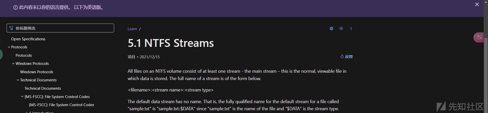

<filename>:<stream name>:<stream type>

文件名 流名称 类型

所以test.txt实际上是test.txt::#DATA

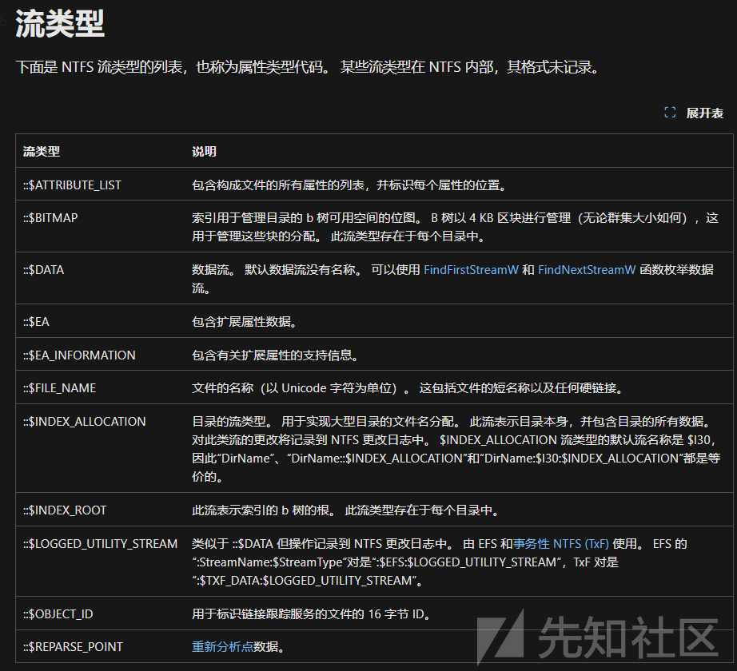

可以通过重定向的方式 直接写到命名的流中

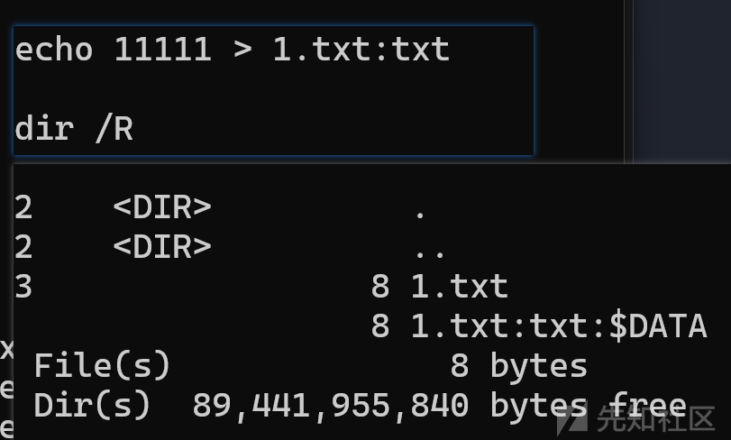

通过DIR /R 可以查看ADS

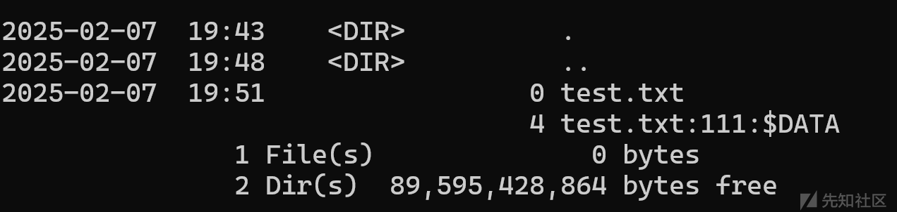

可以通过powershell的Remove-Item 删除指定流

powershell -Command "Remove-Item -Path test.txt -Stream test"

该特性适用于文件夹

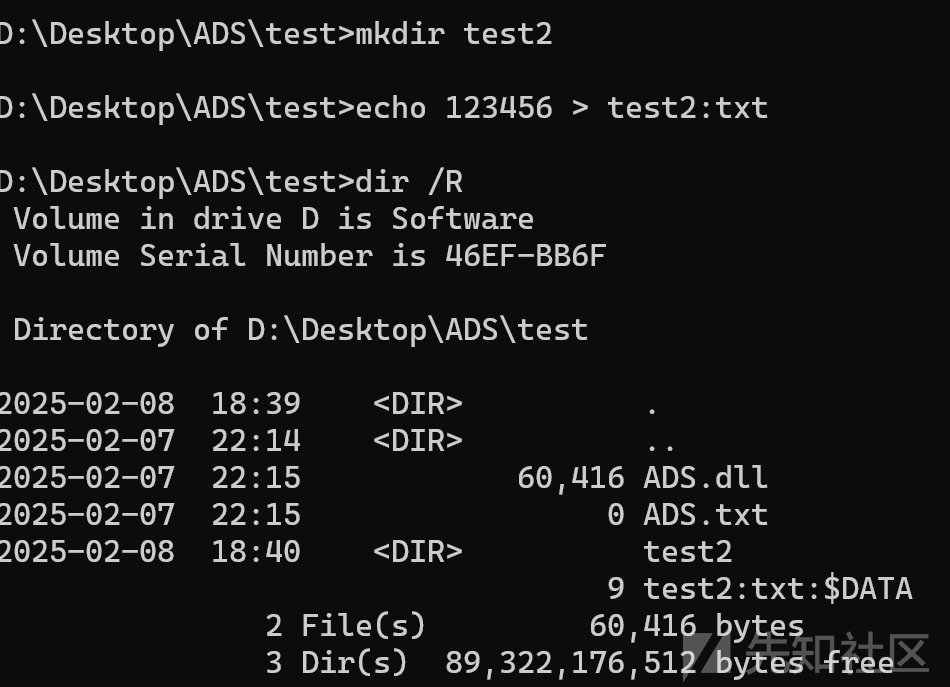

# windows API操作ADS

```
#include <iostream>
 #include <Windows.h>
 
 int main(){
     
     HANDLE hFile = NULL;
     DWORD dwBytesWritten = NULL;
     char buf[] = "114514";
     hFile = CreateFileW(L"D:\Desktop\ADS\test\test.txt:test:$DATA", GENERIC_READ | GENERIC_WRITE, FILE_SHARE_READ, NULL, OPEN_ALWAYS, FILE_ATTRIBUTE_NORMAL, NULL);
     if (hFile != INVALID_HANDLE_VALUE) {
         WriteFile(hFile,buf,sizeof(buf),&dwBytesWritten,NULL);
     }
 }
```

CreateFile 支持ADS 所以直接操作就行

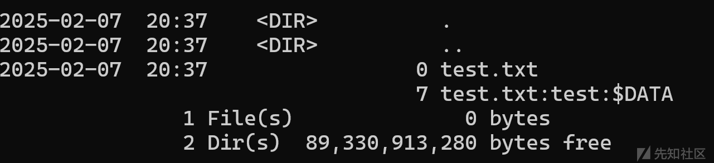

可以通过重定向来查看其内容 more < xxxxxx

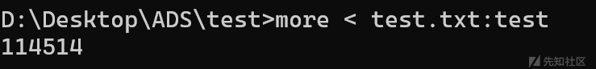

读也是一样


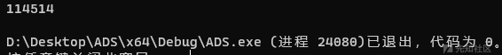

可以通过findFirstStreamWFindNextStreamW 来枚举$DATA类型的流

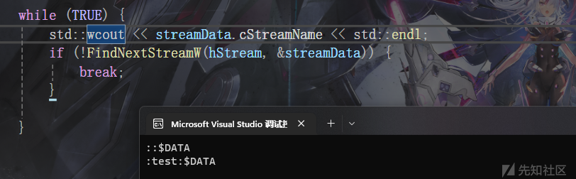

# 执行PE程序

## wmic

可以通过wmic 来执行ADS中的PE程序

wmic process call create D:\Desktop\ADS est\calc.exe:test

值得注意的是 这里必须是绝对路径

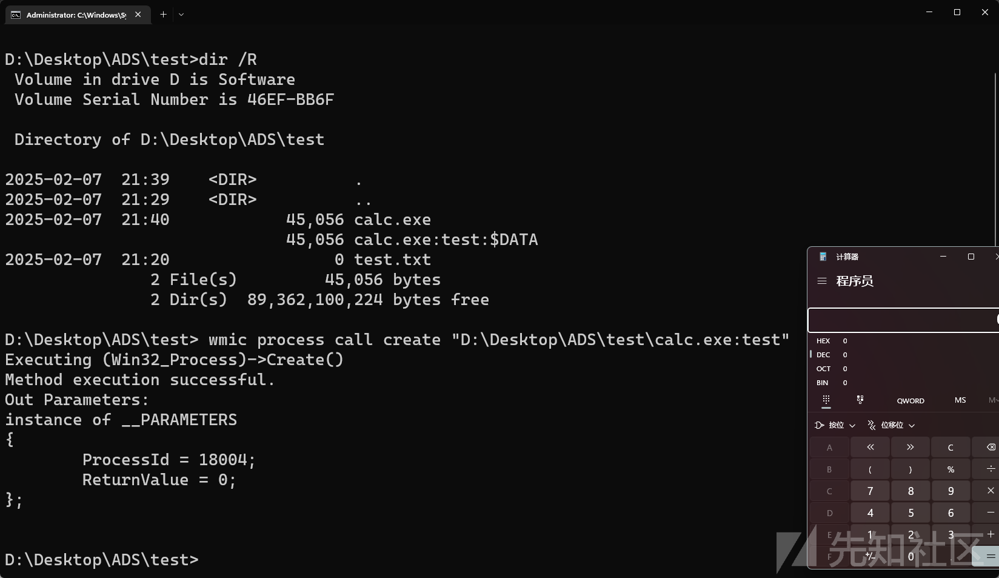

## Control

可以利用control来执行dll 不需要绝对路径

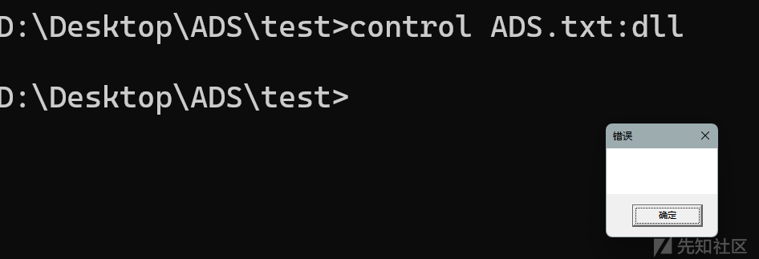

## rundll32

rundll32也支持ADS 不需要绝对路径

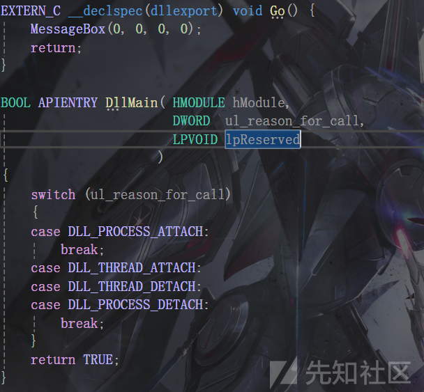

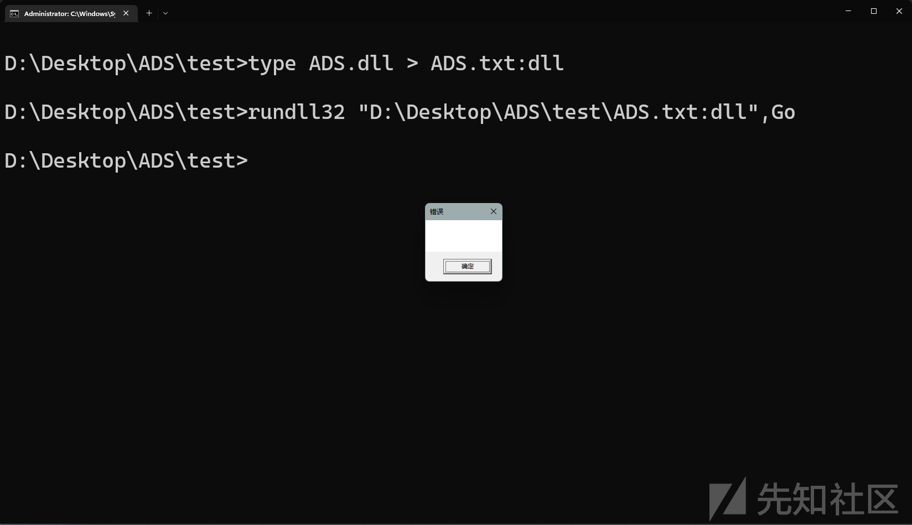

## Forfiles

可以通过Forfiles命令的/C参数对所有遍历到的文件运行指定的命令 比如遍历读取

forfiles /C "cmd /c type @file"

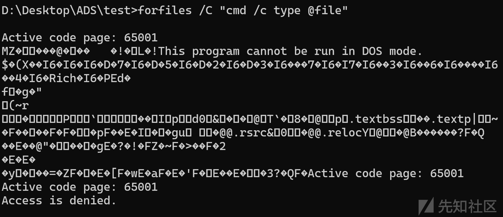

/M 参数指定一个搜索掩码 防止多次执行

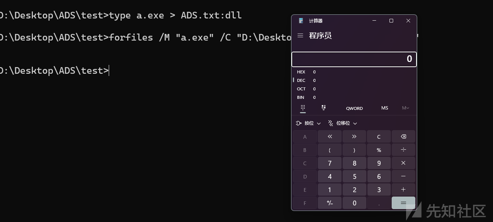

## AppVLP

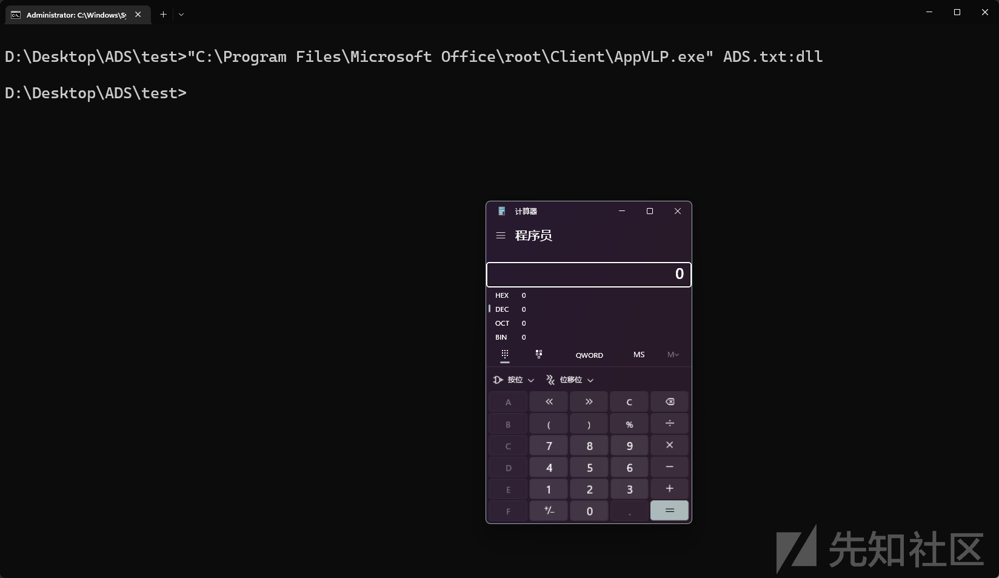

# 参考

<https://lolbas-project.github.io/>
