# 针对Green VPN及加密文件的逆向实战分析-先知社区

> **来源**: https://xz.aliyun.com/news/16884  
> **文章ID**: 16884

---

## 引言

针对某目标软件Green VPN，有不法分子利用此软件翻墙从事违法行为，影响恶劣，现对其进行打击。其对存储连接服务器地址和更新源、访问站点的文件做了加密，要求解密这些文件，得到其连接的服务器地址等加密内容，以对其进行针对性打击

## 针对Green VPN软件分析

软件运行时必须是明文形式才可以正确操作，以更新软件和访问服务器。由此，软件中一定有解密这些数据的代码。所以，要对其进行逆向分析，找到其解密数据的代码段，解密样本文件夹中被加密的module.ini，system.ini等文件，从而定位Green VPN的服务器，对犯罪嫌疑人实施抓捕或追踪，对非法服务器进行摧毁。

考虑Green.exe执行时的需求：将配置文件解密成明文，从而连接到其中的服务器。因而.exe的汇编中必然有调用创建文件、读取文件等API。可以利用读取文件API——Readfile初步定为解密部分的大概位置。

## 主要过程

（1）用ollydbg分析green.exe，考虑该应用本身需要解密文件，因此执行的操作中必然有创建、读取文件等。

（2）查找readfile api，从功能上分析，该段读取了system.ini文件密文到内存段（buffer），找到这段内存，跟踪其硬件访问过程（右键加断点，硬件访问），继续单步调试执行到硬件访问时，就找到了解密的汇编代码段，执行完后这段内存中的密文就解密成了明文。

（3）同样的方法，可以解密出所有需要的文件的明文。

（4）最终任务是分析解密算法，写成c语言，并能够成功解密其余内容为密文的配置文件。

## 逆向Green.exe，找到解密部分汇编并且还原出解密算法

### 初步定位解密部分位置

考虑Green.exe执行时的需求：将配置文件解密成明文，从而连接到其中的服务器。因而.exe的汇编中必然有调用创建文件、读取文件等API。可以利用读取文件API——Readfile初步定为解密部分的大概位置。

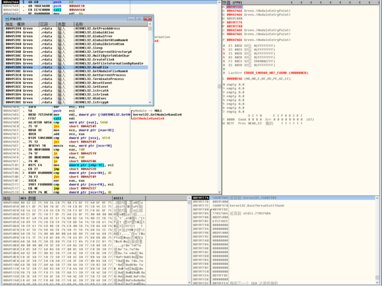

接下来对所有的Readfile API打上断点，运行Green.exe单步执行进行调试，便找到了读取其中一个被加密文件system.ini的过程：  
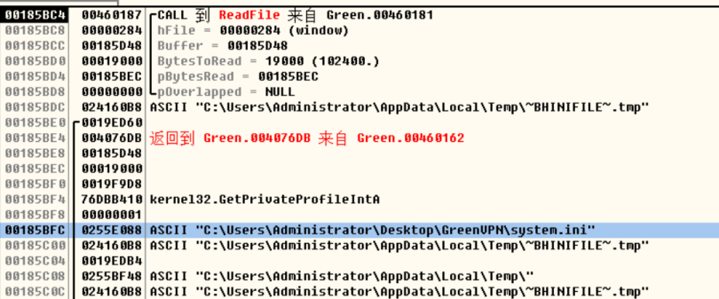

该段读取了system.ini文件密文到内存段（buffer），找到这段内存（00185D48），跟踪其硬件访问过程。

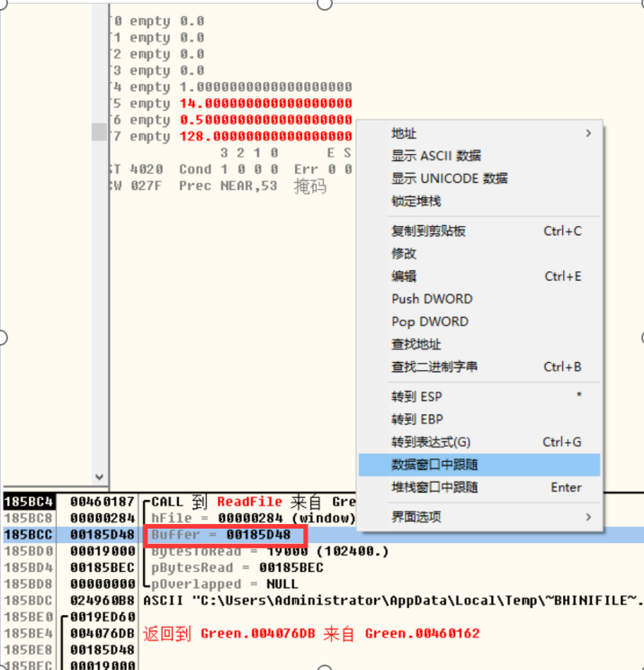

### 跟踪对上述找到内存的访问过程，定位具体的解密代码段

跟踪buffer的硬件访问过程（在OllyICE中右键加断点，硬件访问），继续单步调试执行到硬件访问时，就找到了解密的汇编代码段附近。调试过程中发现执行文件读取前buffer中没有内容，读取后就有一段乱码进入了其中，猜测就是system.ini的密文进入了buffer中，等待被解密。该段代码执行完后buffer中的密文就解密成了明文。

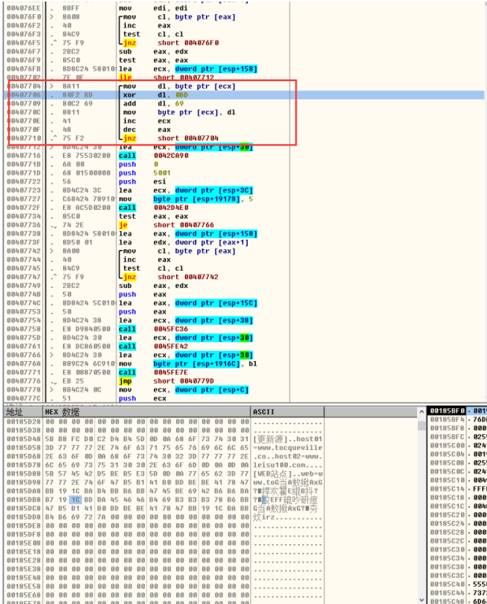

其中红圈标出的就是功能为解密一个字节的汇编代码，多次循环后将所有字节解密。具体分析如下：

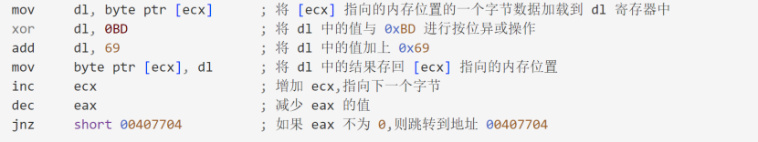

因此这段代码实现了一个简单的字节流处理循环，对一系列字节数据进行加密或解密操作。具体地说，每个字节数据通过按位异或 0xBD 和加上 0x69 来进行转换。该操作会一直进行，直到 eax 寄存器变为 0，指示所有字节处理完成。

## 用C语言重写解密算法

根据上一部分分析出的解密算法，用C语言重写这一算法，解密文件夹下的system.ini，module\_en.ini，module.ini三个文件。

代码如下：

（1）主函数，读取要解密的文件并调用解密算法，最后将明文结果创建并写入新文件。

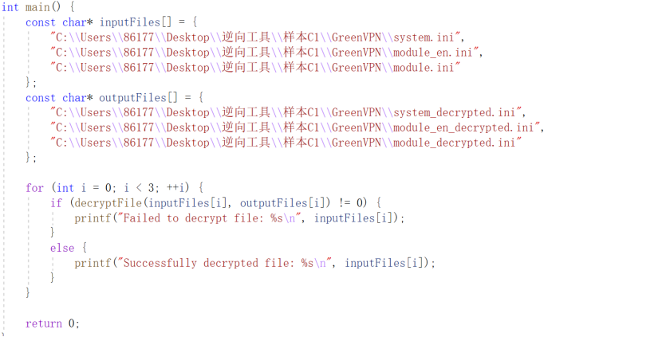

（2）解密文件算法主体，首先调用自定义的readfile函数读取一个文件并得到文件长度，再调用逆向还原的解密算法，最终调用自定义的writefile函数将解密结果写入新创建的文件中。

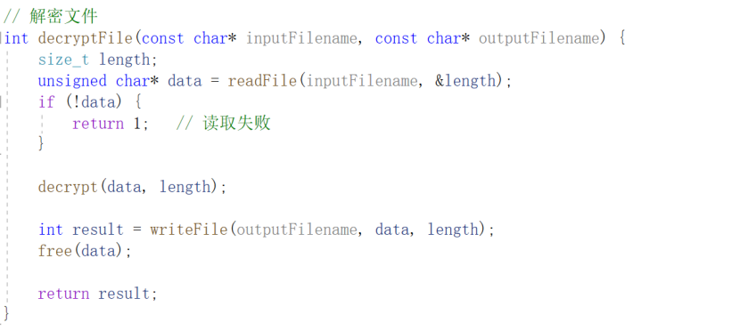

（3）解密算法decrypt()，按照逆向所得的解密过程逐步构造。

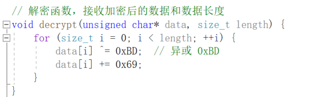

（4）readfile()读取文件函数

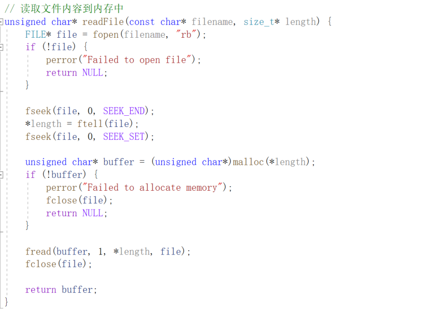  
（5） writefile()写入结果函数

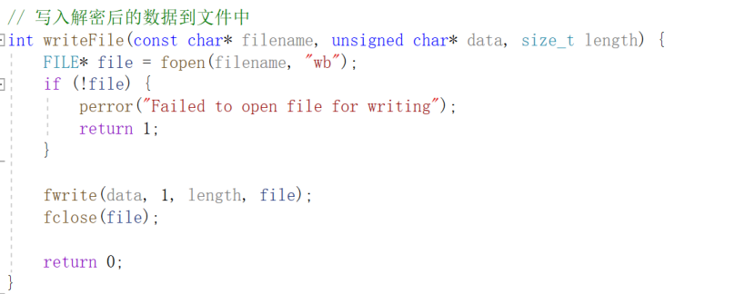

完整解密程序如下

```
// 解密程序.cpp : 此文件包含 "main" 函数。程序执行将在此处开始并结束。
//

#define _CRT_SECURE_NO_WARNINGS
#include <stdio.h>
#include <stdlib.h>

void process_and_write_to_file(const char* input_filename, const char* output_filename) {
    FILE* input_file = fopen(input_filename, "rb");
    if (input_file == NULL) {
        perror("Failed to open input file");
        exit(EXIT_FAILURE);
    }

    FILE* output_file = fopen(output_filename, "wb");
    if (output_file == NULL) {
        perror("Failed to open output file");
        fclose(input_file);
        exit(EXIT_FAILURE);
    }

    int byte;
    while ((byte = fgetc(input_file)) != EOF) {
        // Perform XOR with 0xBD
        byte ^= 0xBD;
        // Perform addition with 0x69
        byte = (byte + 0x69) & 0xFF; // Ensure the result is within 0-255

        // Convert to GBK encoded character and write to output file
        // Assuming the processed byte can be directly written as a character
        fputc(byte, output_file);
    }

    fclose(input_file);
    fclose(output_file);
}

int main() {
    const char* input_filename = "D:\DECODE_HERE\module_en.ini";
    const char* output_filename = "D:\DECODE_HERE\decoded_module_en.txt";

    process_and_write_to_file(input_filename, output_filename);

    printf("Processing completed. Output written to %s
", output_filename);
    return 0;
}

// 运行程序: Ctrl + F5 或调试 >“开始执行(不调试)”菜单
// 调试程序: F5 或调试 >“开始调试”菜单

// 入门使用技巧: 
//   1. 使用解决方案资源管理器窗口添加/管理文件
//   2. 使用团队资源管理器窗口连接到源代码管理
//   3. 使用输出窗口查看生成输出和其他消息
//   4. 使用错误列表窗口查看错误
//   5. 转到“项目”>“添加新项”以创建新的代码文件，或转到“项目”>“添加现有项”以将现有代码文件添加到项目
//   6. 将来，若要再次打开此项目，请转到“文件”>“打开”>“项目”并选择 .sln 文件
```

## 用解密算法解密配置文件

解密结果如下：

（1）控制台输出解密成功语句

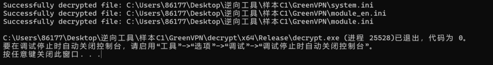

（2）文件夹下出现解密后的明文文件

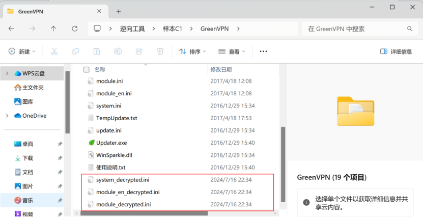  
成功解密内容如下：  
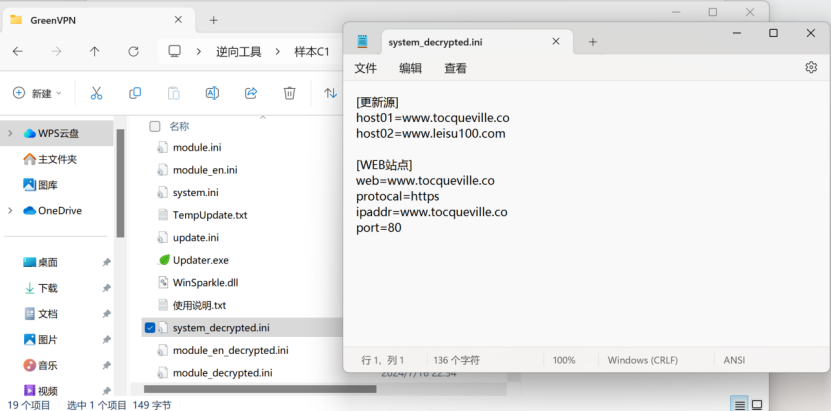

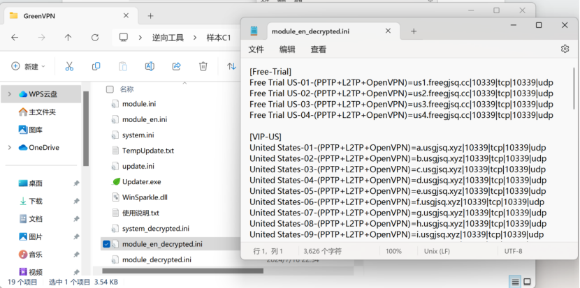

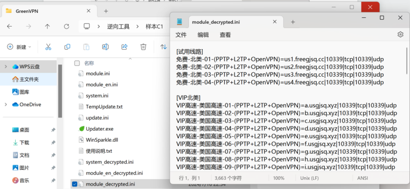

## 总结

通过使用Ollydbg对Green VPN的可执行文件进行调试，我们需要精确地找到文件解密部分的汇编代码。逆向分析需要对汇编语言有深入的理解，并且具备细致的观察能力。我们通过设置断点、单步调试以及硬件访问跟踪，逐步剖析了程序的运行逻辑，最终成功定位了解密算法。
