# 深度探索：直击服务器权限获取之旅-先知社区

> **来源**: https://xz.aliyun.com/news/16885  
> **文章ID**: 16885

---

# 声明

任何网络安全相关测试均需取得授权，本文章中所有内容仅供学习交流，严禁用于商业用途和非法用途，否则由此产生的一切后果均与文章作者无关！

# 前言

在网络安全的神秘棋局中，每一个系统都是一座布满机关的城堡。一次深度的系统渗透恰似一场精密的探秘之旅，从系统目录的文件路径出发，经由云存储桶路径的巧妙关联，最终借助文件上传漏洞，叩开了服务器权限的大门。

# 探寻之路

首先拿到网站，登录口存在两个通道，一个为用户登录，一个为公众登录，登录进去的时候什么东西都没有，里面只能进行查看，功能点也不多，无法进行进一步利用。

索性用祖传字典爆破一下路径，发现一个getbucketlist接口文件，通过查看发现大量文件路径，有zip的，exe的，txt的，sql的，但是通过拼接至网站后缀啥东西都没有。

索性就放弃了上面那个系统，去找了其他系统看看有没有东西，但是这里运气就比较好了，在用资产测绘网站进行搜索的时候我是直接搜的这个系统技术支持的公司，挨个点开一看发现有些系统不一样，虽然都是同一家公司，就如这个系统，也没啥渗透机会，虽然爆破了一下，但是只能输错密码三次，也不行。

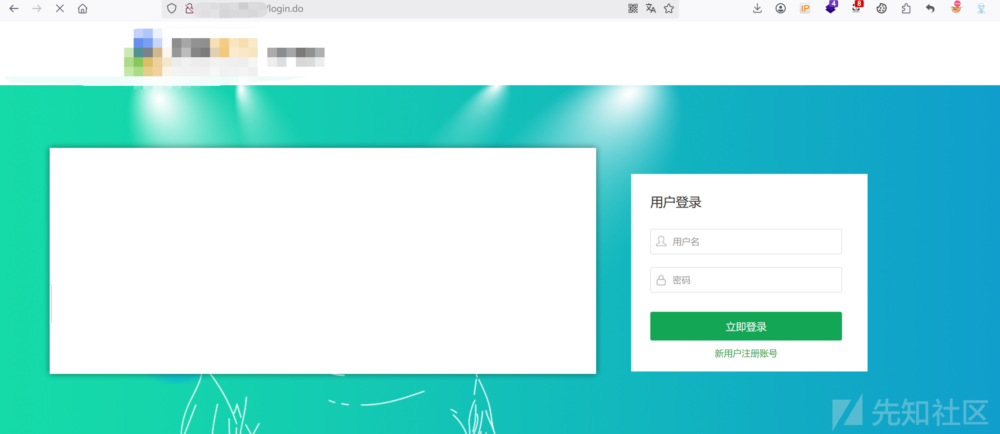

这里想着都是同一家公司，然后我就照常使用第一个系统扫出来的getbucketlist接口文件进行拼接，发现报错了500错误，哎嘿，一看存在aliyun存储桶地址

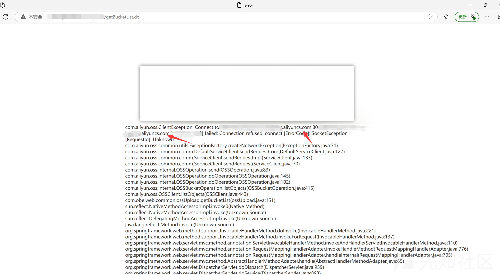

作为一个hacker的思路，那肯定就是用上面得到的文件路径拼接在这个云存储桶网站后面，看看有没有效果，哎嘿，这一看就有了哇，hhh

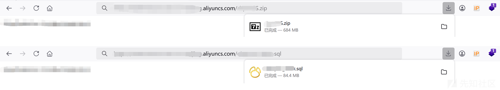

然后我先打开sql文件看看里面有啥东西，发现存在一些数据，但是都加密了，使用cmd5网站进行解也没有解开，我想这不就G了嘛，不过呢峰回路转之下看到里面提及了某和单位使用了这家公司的系统，与搜关键访问这家公司看看有啥好东西没

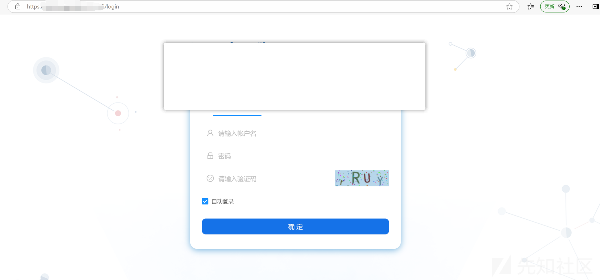

这一看就有一戏哇，这里直接搜索ossaccesskey关键词直接发现存在云存储桶的aksk，hhh

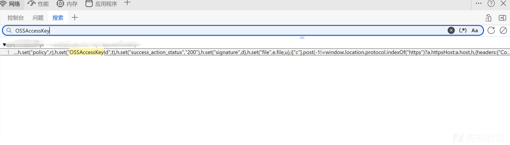

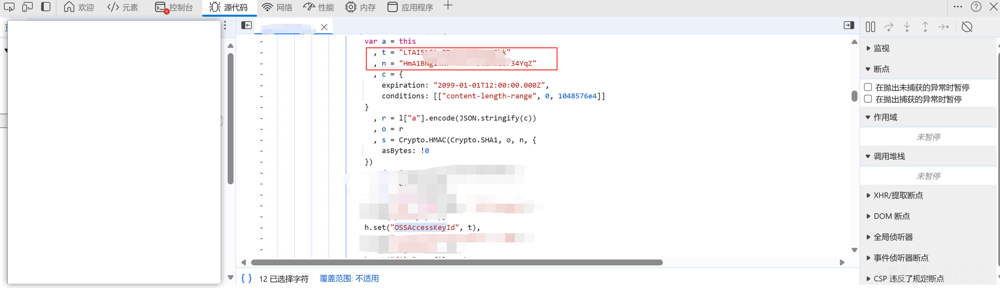

上述小插曲一过，继续看其他的文件，这里下载下来一个exe文件，看名字的时候是英文的，那时候我还以为是啥零信任，vpn或者需要访问网站的插件啥的，结果是exe的安装包，好家伙，直接双击安装

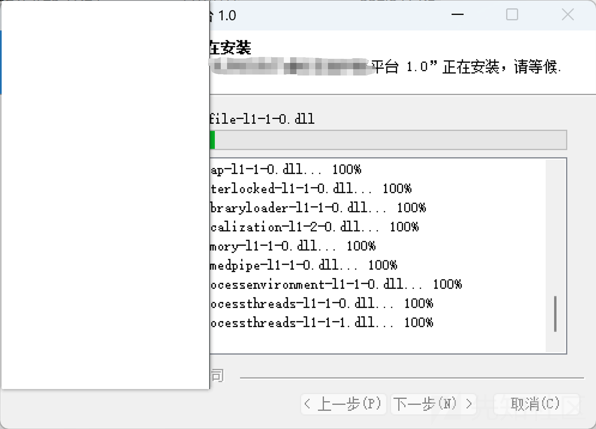

安装成功发现sql文件，点开看看，发现其中一个sql文件存在用户名密码，而且看密码加密的格式应该是md5，这里直接拿去cmd5网站进行解密，密码为123321，hhh我心想这不就有戏了嘛

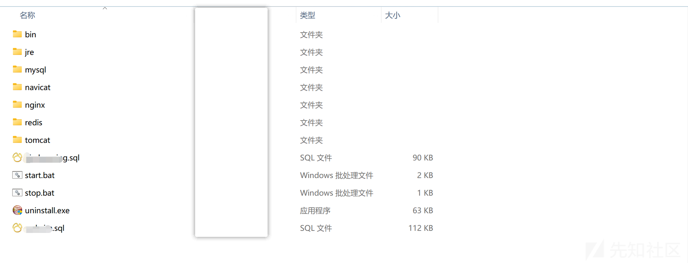

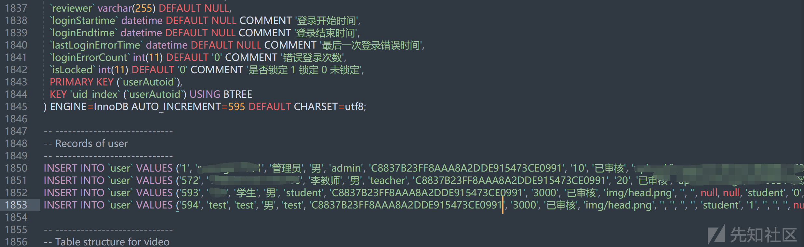

直接进行登录，发现只有student账号能够登录就比较可惜了

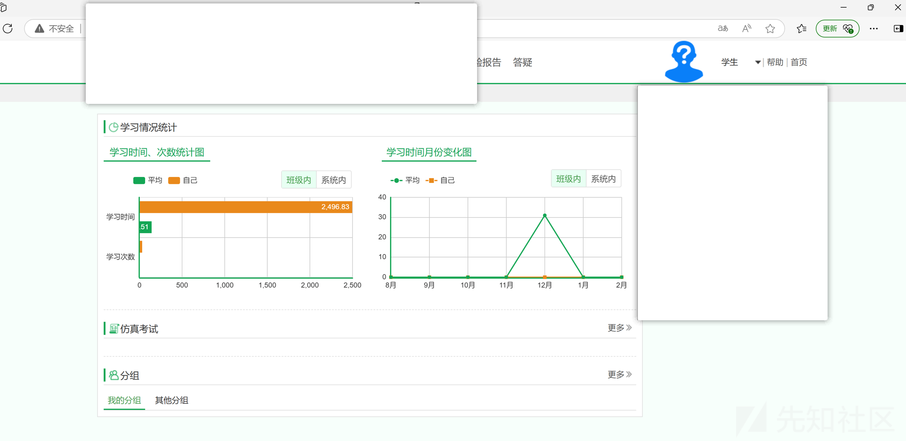

不过嘛，一看这系统就是通用型的嘛，试下其他的网站说不定就有了呢，这不直接找到一个可以直接使用admin账号登录成功

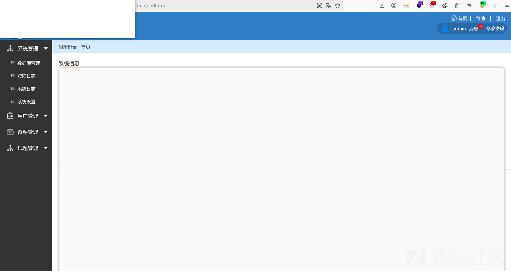

不过上述系统也没有什么测试的点，通过运行exe文件然后审计代码发现一个文件上传功能点但是代码写的不好，根本上传不了，真的抽象，然后再回到通过云存储桶中下载的zip文件，通过里面的源码进行审计发现一个文件上传的jsp文件

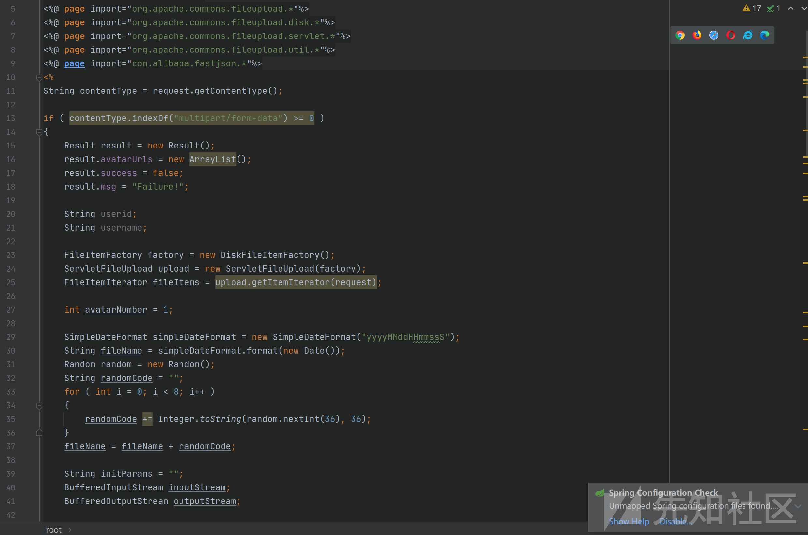

访问jsp文件，这里还有一个点是需要进行登录的，不过通过文章开头提及的，该系统存在一个公共登录口，可直接进行登录，无需密码啥的，这不直接登录进行构造一个文件上传的数据包直接上传成功返回路径接口

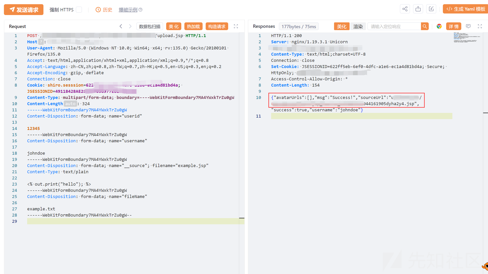

直接通过返回的路径接口拼接至网站根目录后面，可以访问上传成功

再上传一个jsp木马，直接使用gzl连接，哈哈哈成功拿下服务器。

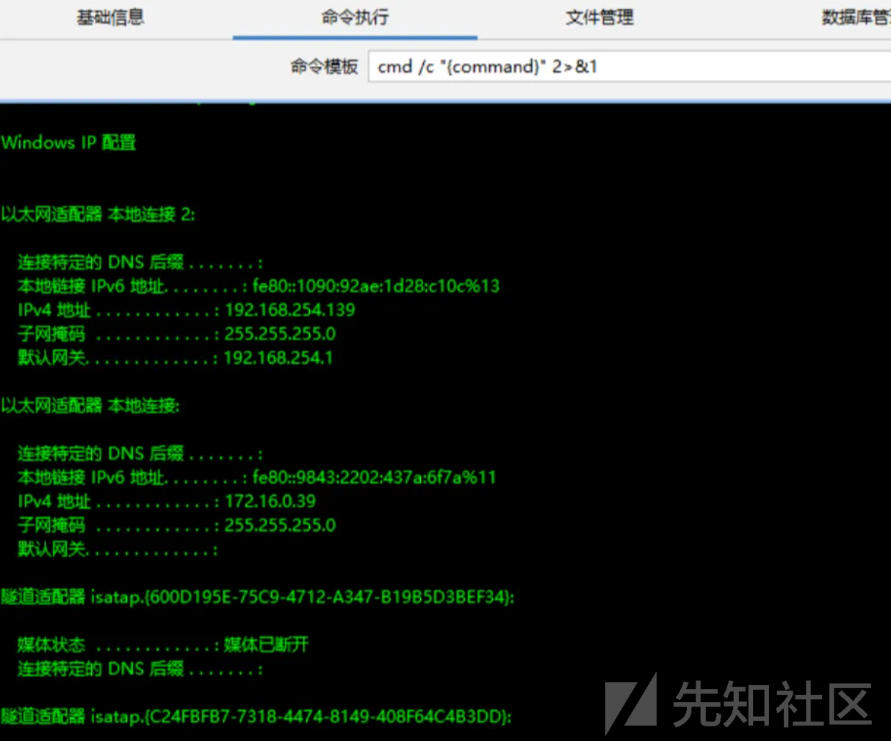
