# 徒手渗透测试的独特实践-先知社区

> **来源**: https://xz.aliyun.com/news/16886  
> **文章ID**: 16886

---

# 声明

本文章中所有内容仅供学习交流，严禁用于商业用途和非法用途，否则由此产生的一切后果均与文章作者无关！

# 前言

渗透工具是这场网络安全探险不可或缺的“飞船”与“武器”，然而，无需借助工具，直接对网站进行渗透还是比较有挑战性的，最近一个星期基本都是这样，拿手机渗透，或者打开电脑一个浏览器打遍天下。

# 手工测试

打开网站，发现图片直接右键新建连接

直接把png文件图片取消进行访问，目录浏览直接拿下

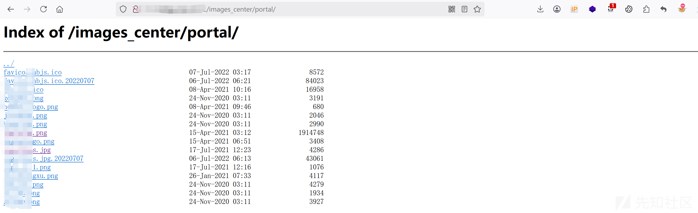

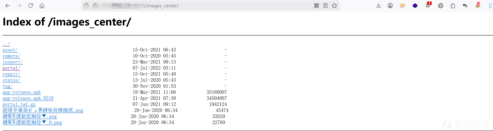

像上述这种存在目录浏览，一般情况下网站还有，这里直接通过搜索相关接口，直接发现另一个接口image\_data，直接访问发现同样进行目录浏览，就是这么容易

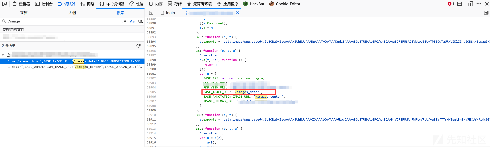

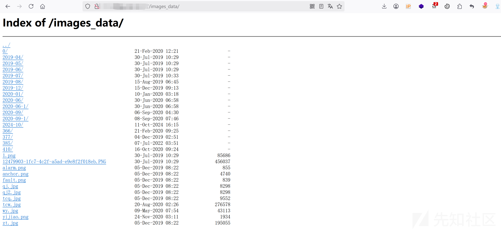

这里另一个网站，同样是如上述一样试了一下目录浏览，但是没有成功，那么这里直接就搜索相关接口如/api，/upload啥的，基本都可能存在漏洞，这里直接搜索/api，发现还是比较多接口的

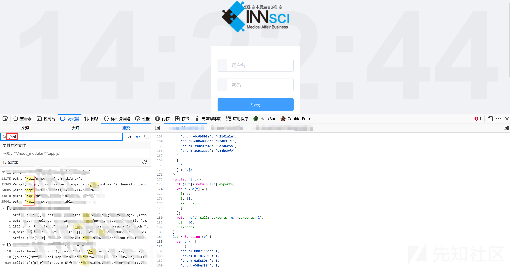

这里挨个进行查看，发现一个\_Get接口

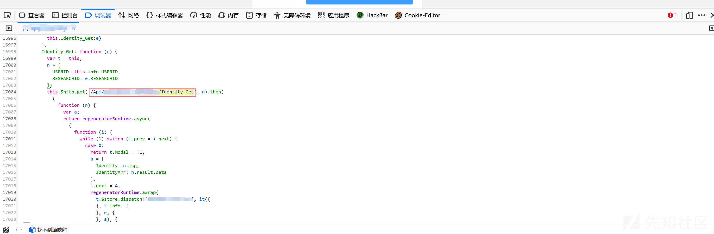

直接访问发现需要传入两个参数，像这种情况直接提示的你可以直接传参就可以了，如果没有传参的话你可以去找找js文件里面有没有相应的代码，再不济就借助工具爆破一下接口也行

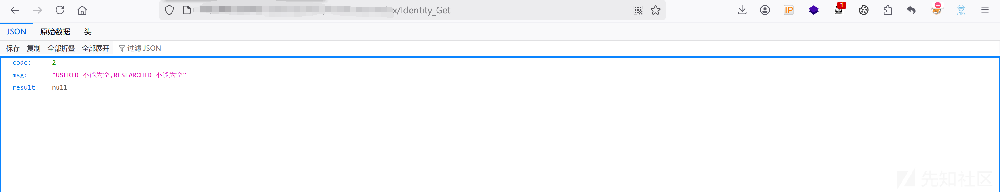

这里传入接口直接添加单引号发现保存了

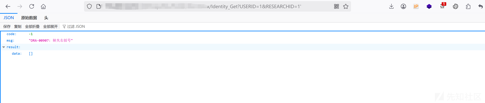

那再添加一个单引号，发现直接进行闭合，哈哈哈，注入不就来了

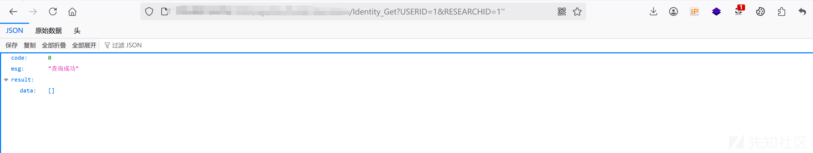

这里直接用sqlmap测试，也不管工不工具了，测试出漏洞才是真的，哎嘿。

直接验证成功，数据为Oracle

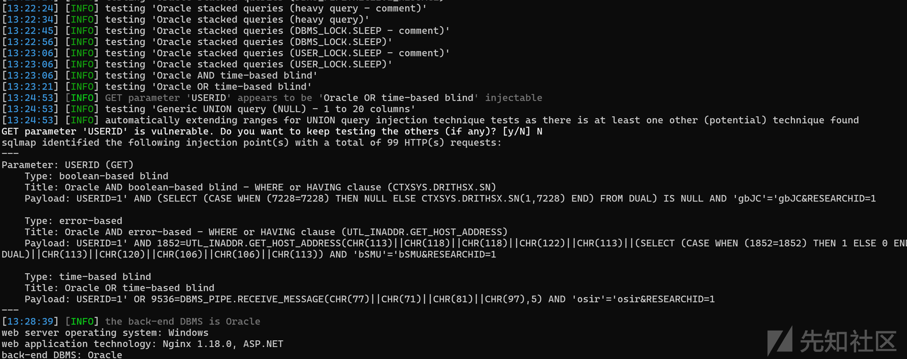

再跑下用户名也是没有问题的，这个完全就是没有防护嘛

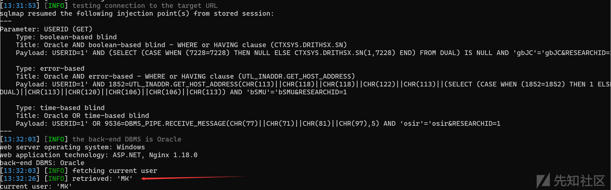

这里还有另外的接口同样存在Sql注入，就不一一测试了

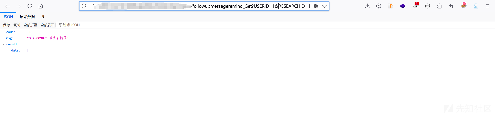

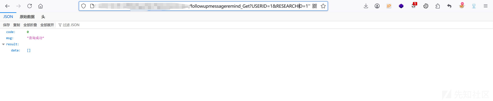

这个如果不借助工具的情况运气也得有，不然还真发现不了，我直接在网站后面任意拼接几个常用的参数，发现upload成功了，而且直接回显hhh

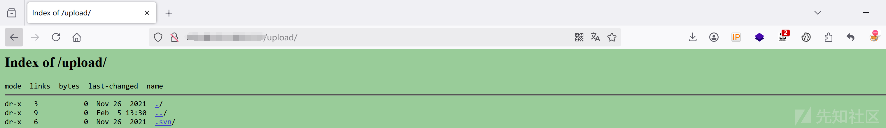

更神奇的是后面还有一个.svn文件泄露

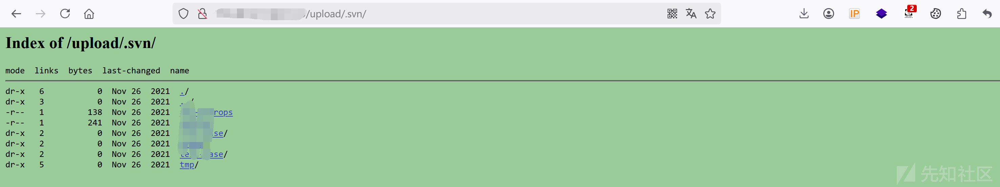

而且通过测试发现这个网站系统还是一个通用型漏洞，捡到了，hhh

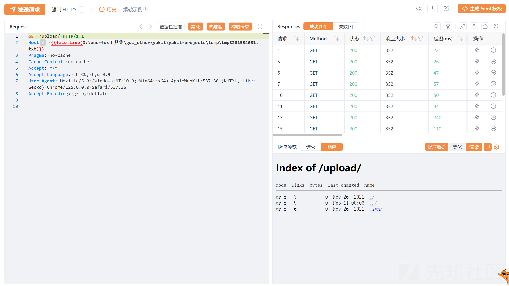

这个还是目录浏览并且也是通用型，不过需要登录进去才能发现那个网站，这里先登录进去后发现有一个可能点可以下载xls文件，而且鼠标悬浮上去发现是跳转至另一个网站进行下载。

直接复制xls连接，另外打开一个窗口进行访问，发现成功访问，又是目录浏览了

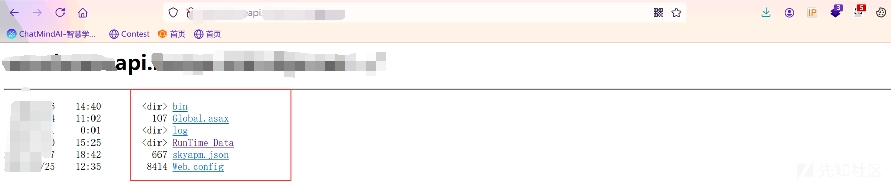

且xls连接文件也是直接下载

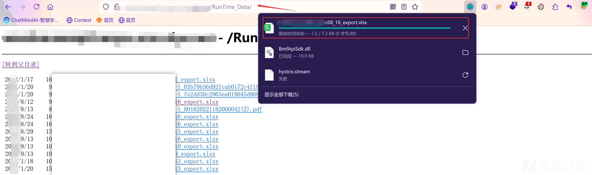

这个也是一个通用型漏洞，只要使用这个系统都有，直接打开网站源码查看即可发现存在key

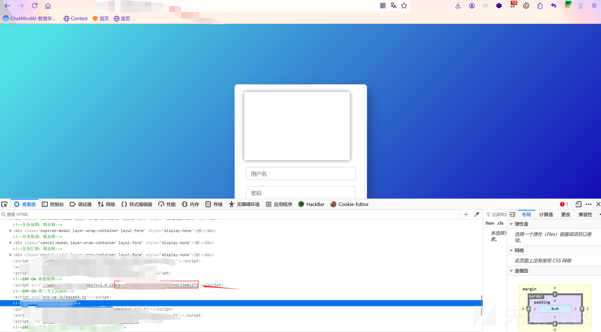

网上直接找payload，访问成功回显位置，说明key是正确的

[restapi.amap.com/v3/geocode/regeo?key=55208xxxxxxxxx1271&s=rsv3&location=116.434446,39.90816&callback=jsonp\_258885\_&platform=JS](https://restapi.amap.com/v3/geocode/regeo?key=552083b37cb5ce74180c4ddc23e81271&s=rsv3&location=116.434446,39.90816&callback=jsonp_258885_&platform=JS)

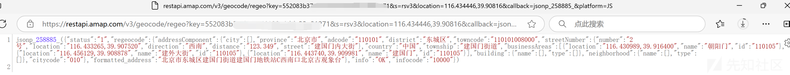
