# 自动化解密Burp插件开发-先知社区

> **来源**: https://xz.aliyun.com/news/16892  
> **文章ID**: 16892

---

# 前言

大家好，我是r0leG3n7。本文将介绍如何通过调用BurpSuite(下面简称Burp)的API进行解密插件的开发。随着各行业网络安全意识的增强，保证数据保密性的加密技术和保证数据完整性的签名算法已经应用到了各种系统中，不像之前随便抓个包就可以篡改数据并重放，我现在遇到的稍微正常一点的系统都会做数据包加密和签名，学习制作一个自动化解密的抓包插件可以大幅提高我们的测试效率。

如有任何错误和不足欢迎各位师傅指正，转载请注明文章出处。

​

# 创建Burp插件开发工程

这篇文章我不会讲太多原理，全是"宝宝辅食"级别的实操过程，大家跟着我的步骤操作也能实现最后那张图的效果。

​

## 开发语言选择

Yakit的插件只能通过Yaklang语言开发，而Burp插件开发支持三种语言，分别是Java、Python和Ruby。

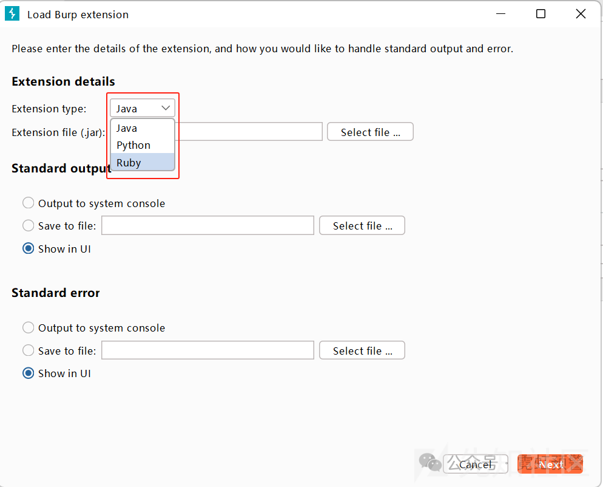

我选择Java语言开发Burp插件，理由如下:

1、兼容性强。因为Burp是Java语言开发的，用Java开发Burp插件能减少很多不必要的错误，比如导入的库函数兼容性等。

2、可调试性。Python和Ruby我暂时没有找到合适的调试工具，而Java能够直接利用远程JVM对Burp插件进行断点调试，对于比较复杂的插件能更容易监控数据和排查问题。

​

## 环境配置

本次用到的工具有:Maven、BurpSuite社区版、JDK8和一款IDE(Eclipse或Jetbrain的IntelliJ都行，有能力的可以直接用记事本写)，以上提到的工具建议在虚拟机内重新安装。

1、到官网：

https://www.oracle.com/java/technologies/downloads/archive/

下载JDK8，然后默认傻瓜式安装，将java的bin目录添加到系统环境变量；

2、到官网:

https://portswigger.net/burp/releases

下载BurpSuite社区版,然后默认傻瓜式安装；

3、手动安装完maven还要修改一些配置文件和创建目录之类的繁琐操作，所以我选择直接在IntelliJ开启科学上网代理，在我创建Maven项目的时候就自动帮我下载并安装Maven，无需配置。

创建项目以后用组合键"CTRL+ALT+S"打开设置，左上角搜索proxy，设置好代理和端口。

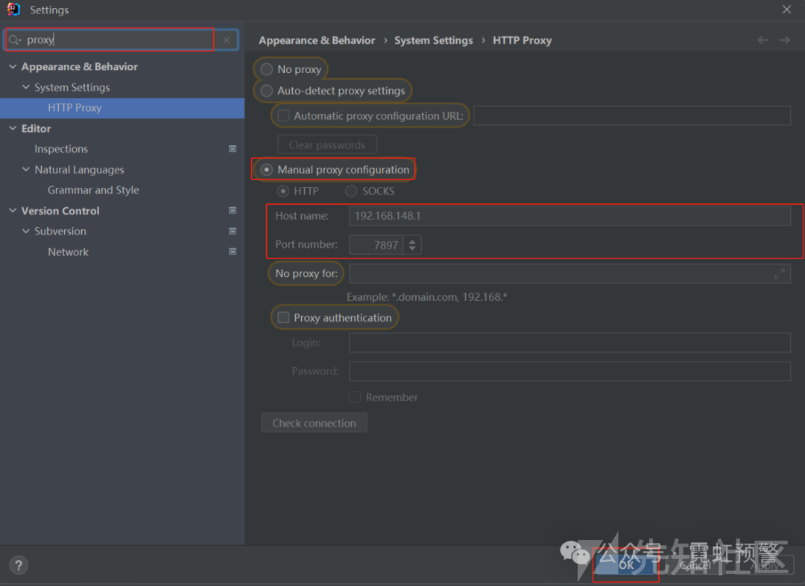

Maven官方下载地址:

https://maven.apache.org/download.cgi

​

## 创建工程

1、IntelliJ创建一个新的工程，选择Java和Maven。

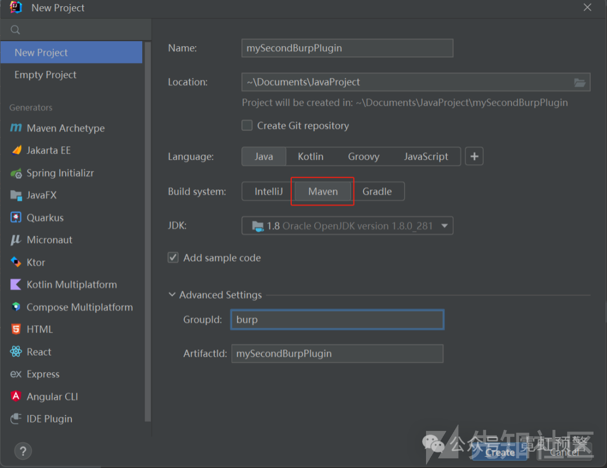

2、修改项目的pom.xml添加Burp API依赖。

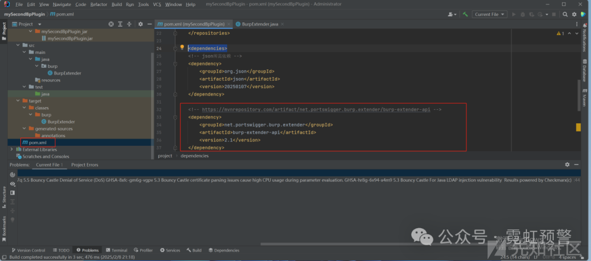

```
<dependencies>

             <!-- Burp API ，必须添加 -->

        <dependency>

            <groupId>net.portswigger.burp.extender</groupId>

            <artifactId>burp-extender-api</artifactId>

            <version>2.1</version>

        </dependency>

</dependencies>
```

然后点击"循环"图标重新加载Maven源。

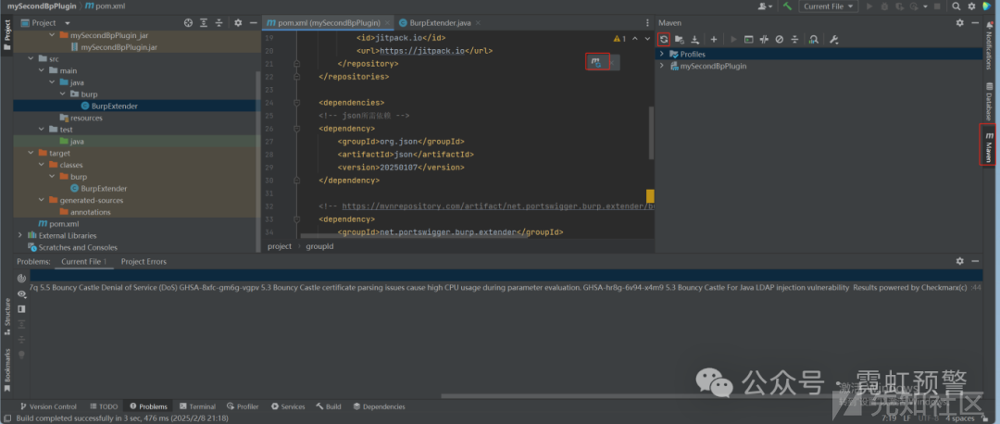

以后需要其他的第三方库，可以去如下地址:

https://mvnrepository.com/

查询依赖的版本,比如我要用解析json的库，将下图搜索到的红框的代码黏贴到pom.xml的<dependencies>标签内。

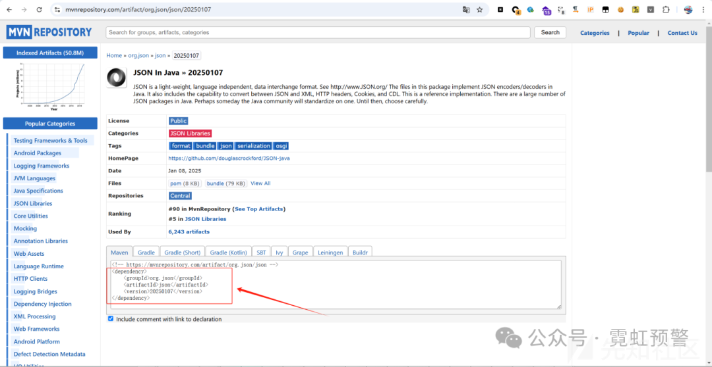

3、创建一个名为"burp"的包名，在该包名下创建一个名为"BurpExtender"的主类(不可以是其他类名)，BurpExtender类必须实现IBurpExtender接口，可以到如下地址下载官方示例代码:

https://github.com/PortSwigger/example-hello-world/blob/master/java/BurpExtender.java

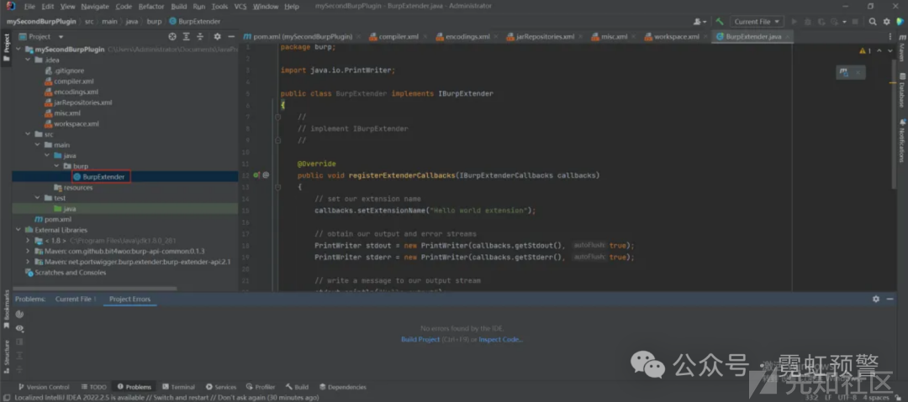

```
package burp;

import java.io.PrintWriter;
import java.util.List;
import org.json.JSONObject;
import javax.crypto.Cipher;
import javax.crypto.spec.SecretKeySpec;
import java.nio.charset.StandardCharsets;
import org.bouncycastle.jce.provider.BouncyCastleProvider;
import java.security.Security;

public class BurpExtender implements IBurpExtender, IHttpListener {

    private IBurpExtenderCallbacks callbacks;

    private IExtensionHelpers helpers;

    private PrintWriter stdout;
    private PrintWriter stderr;

    String decryptRequestBody = "";

    @Override
    public void registerExtenderCallbacks(IBurpExtenderCallbacks callbacks)
    {

    }

    @Override
    public void processHttpMessage(int toolFlag,boolean messageIsRequest,IHttpRequestResponse messageInfo)
    {

    }

}
```

4、组合键"CTRL+ALT+SHIFT+S"打开项目结构，在项目结构中设置每次自动创建生成Jar包;

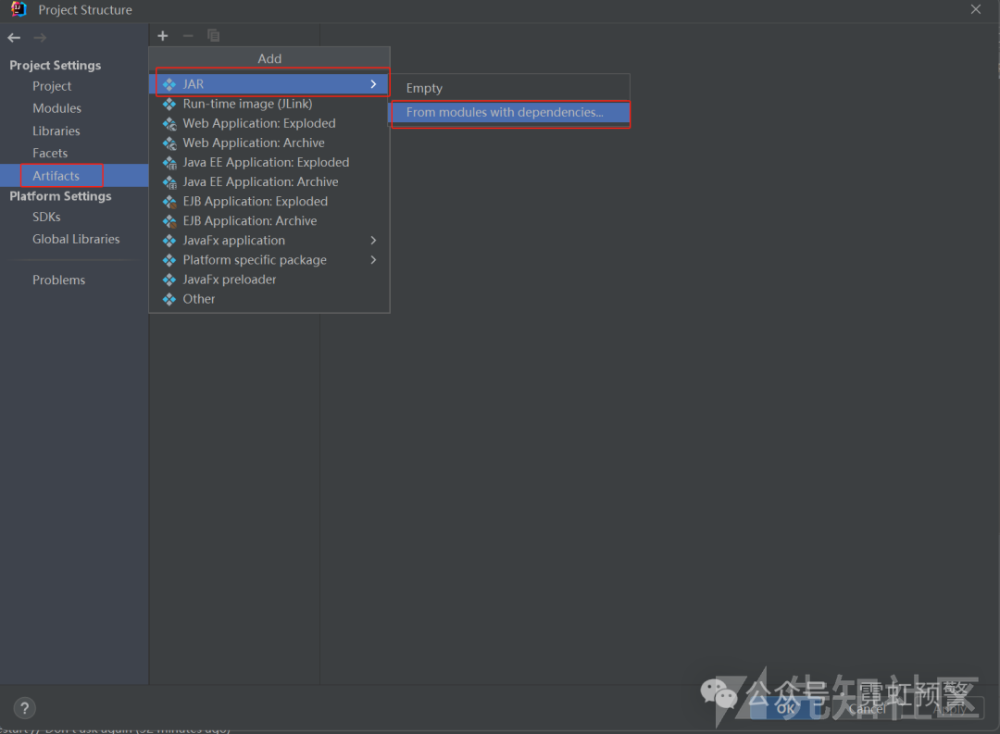

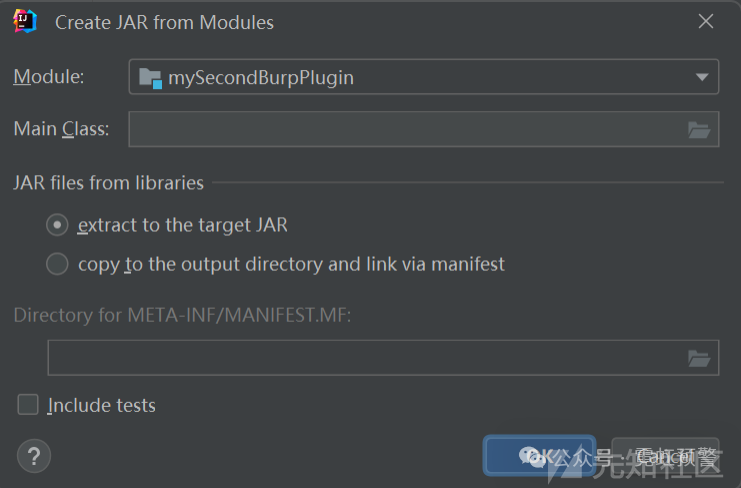

并勾选"Include in project build"。

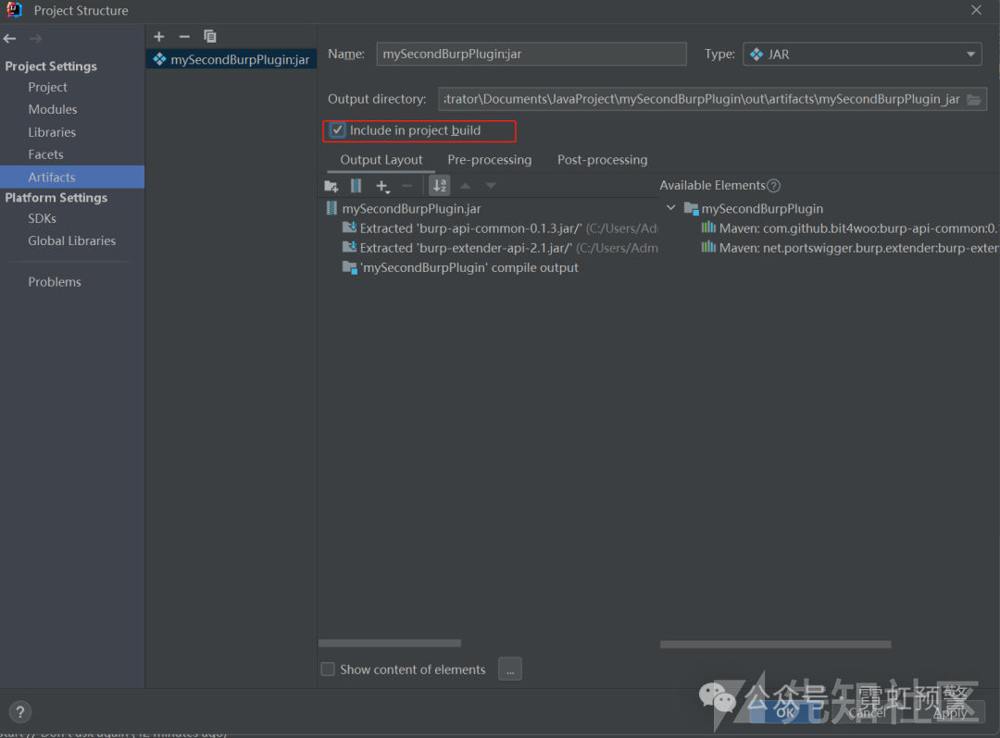

5、这样一个简单的burp插件工程就创建成功了，可以使用组合键"Ctrl + F9"编译工程，编译成功以后会在项目的out目录输出编译好的jar包，这个jar是可以直接被burp的Extension直接加载的。

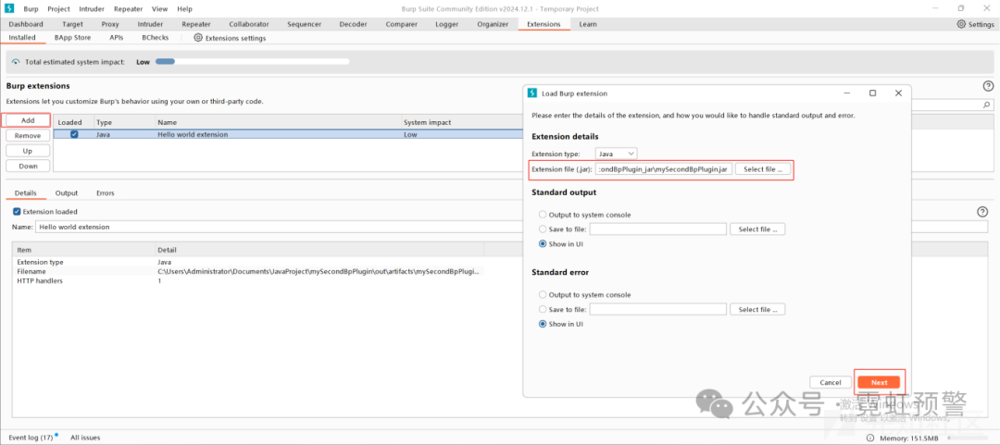

​

如果需要调试Burp插件代码，在IntelliJ设置Debug配置:

1、添加远程JVM调试

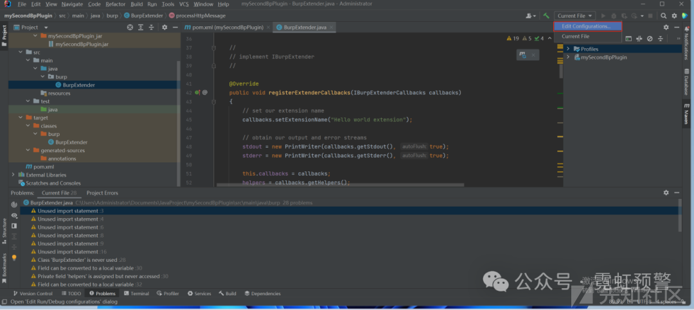

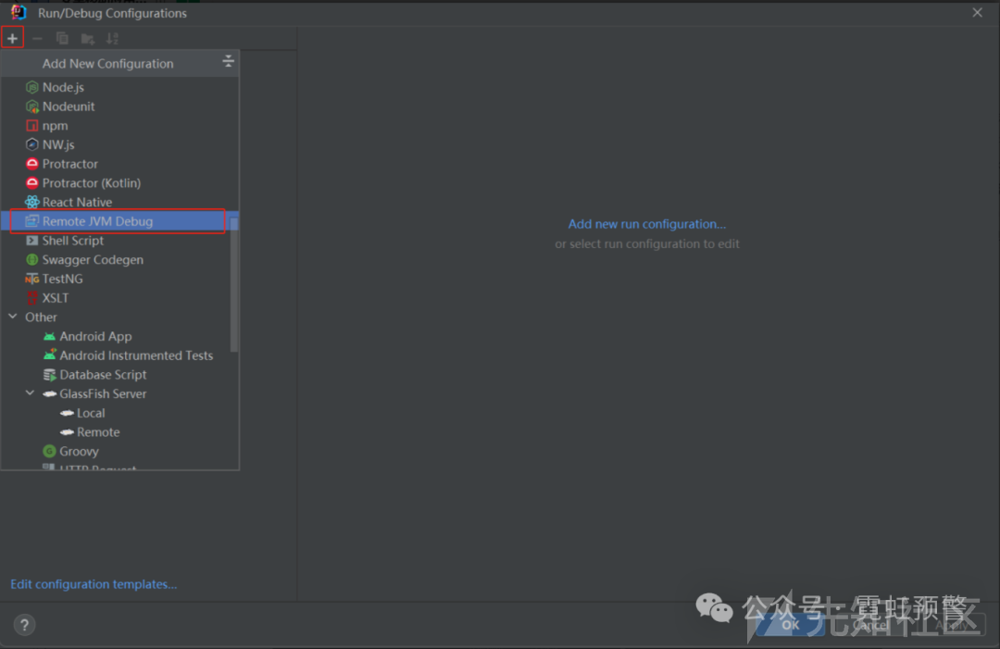

2、红框内的是JVM调试命令，默认监听本地5005端口

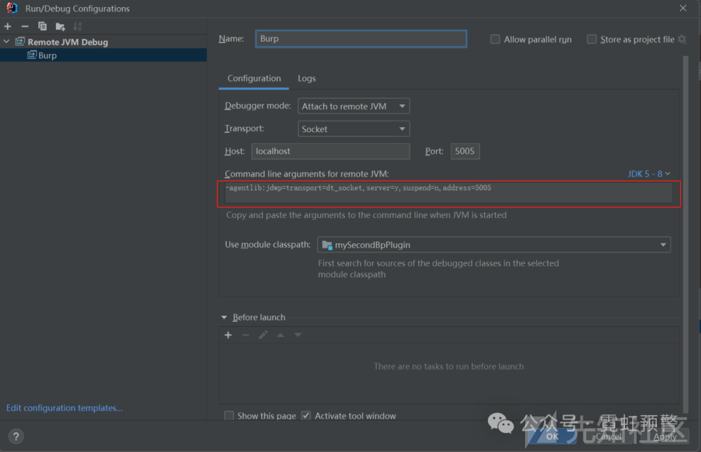

3、（默认安装路径）Burp以如下命令启动:

```
"C:\Program Files\BurpSuiteCommunity\jre\bin\java.exe" -agentlib:jdwp=transport=dt_socket,server=y,suspend=n,address=5005 -jar burpsuite_community.jar
```

建议将其保存为.bat批处理脚本，以后方便启动

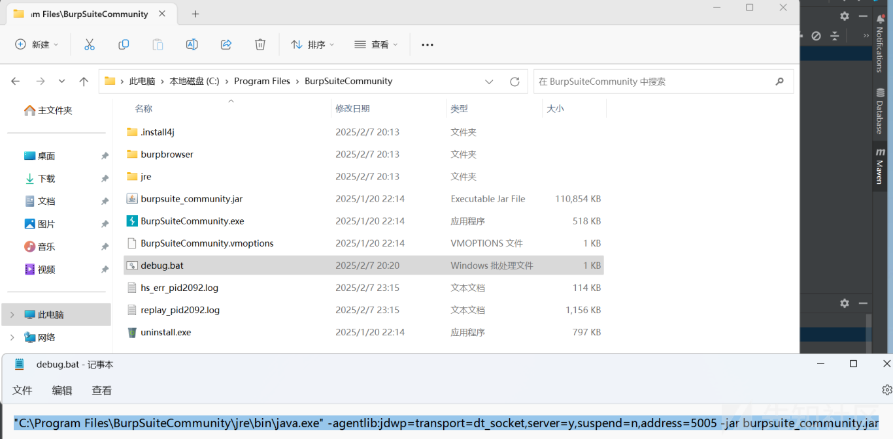

# 加密算法复现

我的目标是将加密的数据包解密然后将解密后的明文数据直接显示在原数据包上，这样方便我去分析系统的业务逻辑。加密算法复现是最核心也是最难的环节，它要求我们会动态分析H5网页前端的javascript代码、so库中的C代码和安卓的Smali代码等，并将这些代码语言实现的加解密函数用Java、Python等语言复现，burp插件开发仅是实现自动化的过程，没有加密算法复现，burp解密插件开发就是空谈。

​

## 加密算法分析

1、首先看下我要解密的数据包


2、数据包的请求和响应都被加密，加密数据传入到json的encryptData参数中。浏览器F12，组合键"CTRL+SHIFT+F"搜索encryptData关键词定位代码，下断点调试。

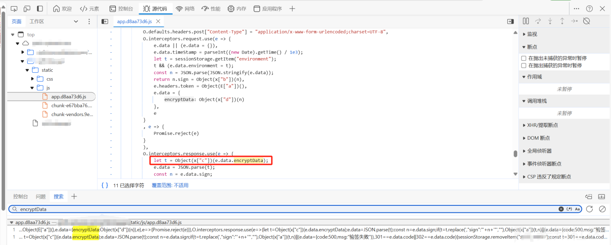

3、最后发现网站使用的是ECB模式的标准SM4加密算法并且密码是硬编码的。

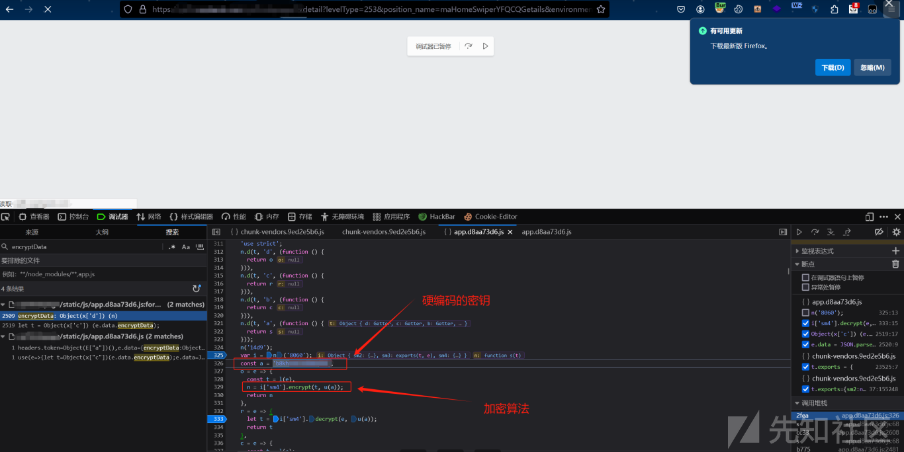

4、编写python脚本进行验证，解密成功。(不会写python脚本可以百度在线的解密算法网页进行验证)

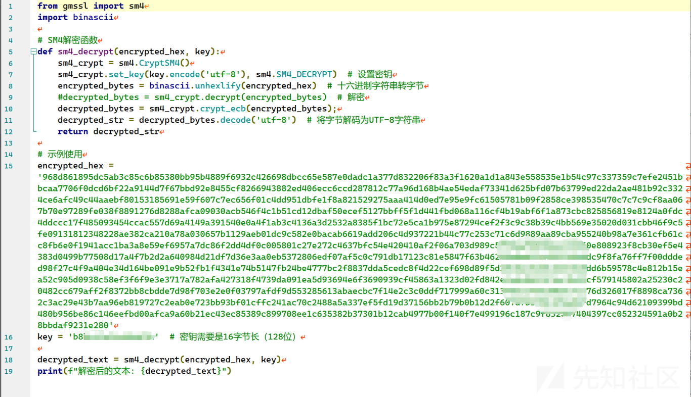

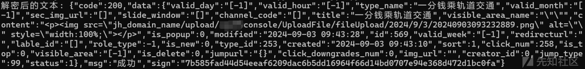

​

这次找了一个比较简单的例子作为示例，正常来说是不会给你这么轻易通过搜索关键字和简单的调试定位到加密函数和密钥的，多数情况下密钥是随机生成的，代码是混淆，并且还会有无限Debugger之类的反调试技术加大你调试的难度。这里推荐几个js逆向比较好用的项目:

https://github.com/Cha111Ng1/Tampermonkey\_cha11

​

https://github.com/cilame/v\_jstools

​

## JAVA算法复现

1、这个例子使用的是标准SM4加密算法，用BouncyCastle库可以轻松复现，建议新建一个测试项目测试解密数据是否正确，在pom.xml添加如下依赖。

```
<dependencies>
    <!-- json所需依赖 -->
    <dependency>
        <groupId>org.json</groupId>
        <artifactId>json</artifactId>
        <version>20250107</version>
    </dependency>
   <!-- 加密算法库 -->
   <dependency>
      <groupId>org.bouncycastle</groupId>
      <artifactId>bcprov-jdk15on</artifactId>
       <version>1.70</version>
   </dependency>
</dependencies>
```

2、解密测试示例代码

```
package org.example;

import org.bouncycastle.jce.provider.BouncyCastleProvider;
import org.json.JSONObject;
import javax.crypto.Cipher;
import javax.crypto.spec.SecretKeySpec;
import java.nio.charset.StandardCharsets;
import java.security.Security;
public class SM4 {

    public static void main(String[] args) {

        String key = "1111abcdefghijkl";     //128位密钥,16个字节
        String originalData = "{"encryptData":"968d861895dc5ab3c85c6b8"}";   //加密原始数据字符串数
        JSONObject jsonResponse = new JSONObject(originalData);    //将原视数据字符串转化为JSONObject对象
        String enD = jsonResponse.getString("encryptData");
        String result ="";                                                   //保存解密数据

	//SM4解密
        try{

            byte[] decryptData=SM4decrypt(key, hexStringToByteArray(enD));

            result = new String(decryptData);

        }catch (Exception e)

        {

            result = "{"result":"解密失败"}";

        }

        System.out.println(jsonResponse.toString());

        System.out.println(enD.length());

        System.out.println(result);

    }

    static {

        // 添加 BouncyCastle 提供者
        Security.addProvider(new BouncyCastleProvider());

    }

    public static byte[] SM4decrypt(String key, byte[] encryptedData) throws Exception {

        SecretKeySpec secretKeySpec = new SecretKeySpec(key.getBytes(StandardCharsets.UTF_8), "SM4");

        Cipher cipher = Cipher.getInstance( "SM4/ECB/PKCS5Padding");

        cipher.init(Cipher.DECRYPT_MODE, secretKeySpec);

        byte[] result=cipher.doFinal(encryptedData);

        return result;

    }

    public static byte[] hexStringToByteArray(String hexString) {

        int len = hexString.length();

        byte[] byteArray = new byte[len / 2];

        for (int i = 0; i < len; i += 2) {

            byteArray[i / 2] = (byte) ((Character.digit(hexString.charAt(i), 16) << 4)

                    + Character.digit(hexString.charAt(i+1), 16));

        }

        return byteArray;

    }

}
```

​

# 自动化解密插件开发

下面的Burp插件代码不涉及UI设计，代码部分主要是实现IBurpExtender接口和IHttpListener接口并重写registerExtenderCallbacks和processHttpMessage。

​

## registerExtenderCallbacks

上面提到BurpExtender主类是必须实现IBurpExtender接口，registerExtenderCallbacks是IBurpExtender接口必须实现的方法。

registerExtenderCallbacks方法会在Burp插件注册时被调用，就是我们在Extensions添加Burp插件的瞬间会被调用。


registerExtenderCallbacks的主要是作用是设置插件的名称、打印一些作者信息和Debug信息以及注册ContextMenuFactory、HttpListener监听器等。

registerExtenderCallbacks会传入一个IBurpExtenderCallbacks类型名为callbacks参数，该参数的作用是注册回调函数、参与Burp的其他组件交互(比如Burp的主动扫描和被动扫描)、更新UI组件等。

示例代码:

```
public void registerExtenderCallbacks(IBurpExtenderCallbacks callbacks)

    {

        // 设置插件名

        callbacks.setExtensionName("Hello world extension");

        
        stdout = new PrintWriter(callbacks.getStdout(), true);

        stderr = new PrintWriter(callbacks.getStderr(), true);


        this.callbacks = callbacks;

	//获取 IExtensionHelpers 对象，用于辅助处理 HTTP 请求和响应。

        helpers = callbacks.getHelpers();

        // 在Output面板输出信息

        stdout.println("Hello output");

        // 在Erros面板输出信息

        stderr.println("Hello errors");

        // 抛出错误，在Erros面板输出错误信息

        throw new RuntimeException("Hello exceptions");

        //如果没有注册，下面的processHttpMessage方法是不会生效的。处理请求和响应包的插件，这段代码是必要的

        callbacks.registerHttpListener(this);

    }
```

### IExtensionHelpers

* ‌**获取当前请求和响应信息**‌：通过该接口可以获取当前正在处理的HTTP请求和响应信息，方便开发者进行调试和分析。
* ‌**设置和获取插件状态**‌：可以设置插件的状态，并在需要时获取这些状态信息，以便进行相应的操作。
* ‌**注册菜单项**‌：通过该接口可以注册菜单项，使得插件可以在Burp Suite的菜单中添加自定义的操作选项。

## processHttpMessage

burp的核心对象就是数据包，对HTTP数据包的所有操作都是通过processHttpMessage方法完成的。如果我们想在数据包流经Proxy、Repeater等模块对数据包进行解密等操作，我们写的BurpExtender主类就必须实现IHttpListener的processHttpMessage方法，并且在registerExtenderCallbacks方法内注册HttpListener监听器，不然Burp主类不知道监听器的存在，也就不会调用processHttpMessage方法。注册监听器代码如下:

```
callbacks.registerHttpListener(this);
```

processHttpMessage有三个传入参数，分别为int类型的toolFlag、boolean类型的messageIsRequest和IHttpRequestResponse类型的messageInfo。

toolFlag参数指定数据包来源，有助于我们判断数据包是来自Proxy模块还是Repeater模块亦或是其他模块。

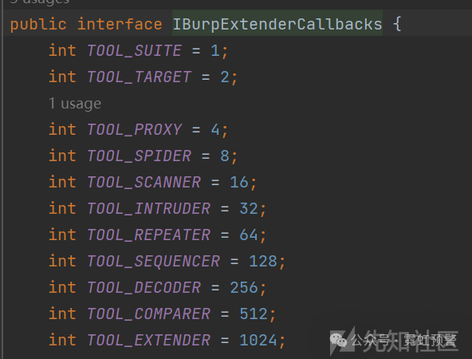

messageIsRequest参数用于判断是数据包的请求还是响应，messageIsRequest值为true时是请求，值为false时是响应。

messageInfo参数是HTTP数据包请求或响应的全部信息，包含HTTP的Header、Body等信息。

附上详细注释的示例代码阉割版:

```
    public void processHttpMessage(int toolFlag, boolean messageIsRequest, IHttpRequestResponse messageInfo) {

        //当数据经过Proxy

        if (toolFlag == IBurpExtenderCallbacks.TOOL_PROXY) {

            //解析数据包请求

            IRequestInfo requestInfo = this.callbacks.getHelpers().analyzeRequest(messageInfo);

            //获取数据包中的URL

            String requestUrl = requestInfo.getUrl().toString();

            //通过URL中的关键字判断是哪个接口

            if (requestUrl.contains("getJSSDKConfig")) {

                //messageIsRequest值为true时是请求，值为false是响应

                //处理请求

                if (messageIsRequest) {

                    byte[] request = messageInfo.getRequest();

                    //获取请求体的Body

                    String requetBody = new String(request, requestInfo.getBodyOffset(), request.length - requestInfo.getBodyOffset());

                    //解密请求体Body的数据

                    decryptRequestBody = decryptRequestJson(requetBody);

                }//处理响应

                else {

                    //获取响应的字节数组

                    byte[] response = messageInfo.getResponse();

                    IResponseInfo responseInfo = this.callbacks.getHelpers().analyzeResponse(response);

                    //获取原始响应的body

                    String body = new String(response, responseInfo.getBodyOffset(), response.length - responseInfo.getBodyOffset());

                    //修改原始响应的body，modifyResponseJson是我自己实现的一个方法，主要作用就是解密响应体中的密文

                    String modifiedBody = modifyResponseJson(body, decryptRequestBody);

                    //获取响应头

                    List<String> headers = responseInfo.getHeaders();

                    //根据获取的响应头和修改后的body重构响应体

                    byte[] newResponse = this.callbacks.getHelpers().buildHttpMessage(headers, modifiedBody.getBytes());

                    messageInfo.setResponse(newResponse);

                }

            }

        }

    }
```

​

插件实现的效果就是将请求体和响应体中的密文解密，并将解密后的明文输出到响应体中。

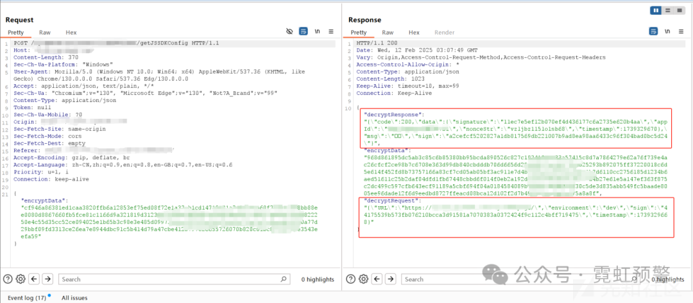

​

最后我有个问题想请教大家:我原本是想在请求体中输出HTTP原始请求解密后的明文而不是在响应体中输出HTTP原始请求解密后的明文，这样方便我在Proxy截获数据包的时候就可以直接修改HTTP请求。使用messageInfo.setRequest方法可以将请求体直接设置为解密后的明文，但问题是对方的服务器只接受加密后的数据请求而不接受解密后的明文数据请求，我想知道除了在Repeater实现解密后篡改再加密重放以外，在Proxy实现直接篡改解密后的明文数据并加密重放有没有更好的解决方案？欢迎师傅们在评论区讨论！

​

# 总结

其实编写Burp插件并不是很难，难的是调试加密算法，难的是将原始的javascript语言实现的代码转换为java语言实现的代码。本次给到的解密示例已经算是比较简单的了，它使用的标准的SM4算法并且密钥是硬编码的，如果不是标准的对称加密算法或者使用的是非对称加密算法，还要进行寻找公私钥对、RPC调用等复杂操作。
