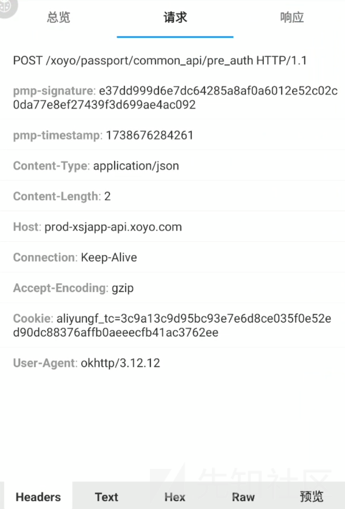
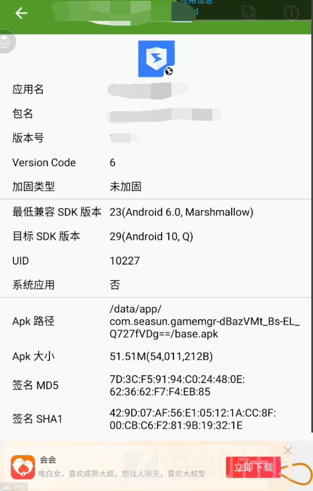
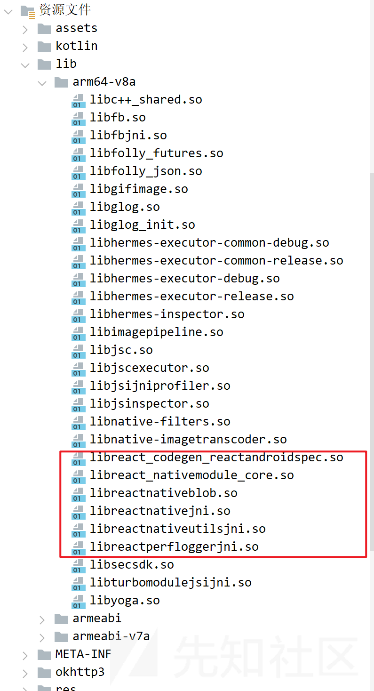
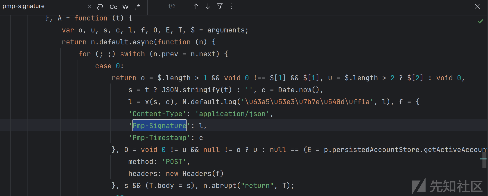
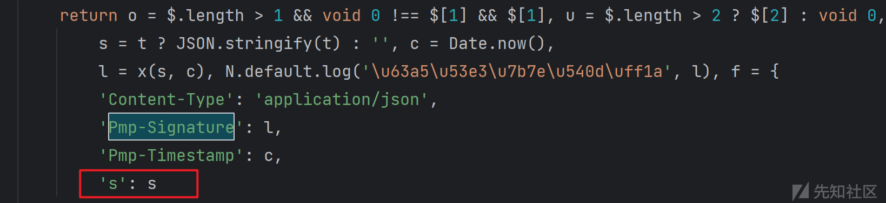
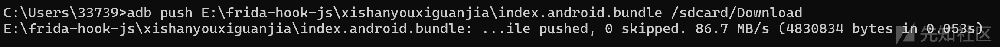
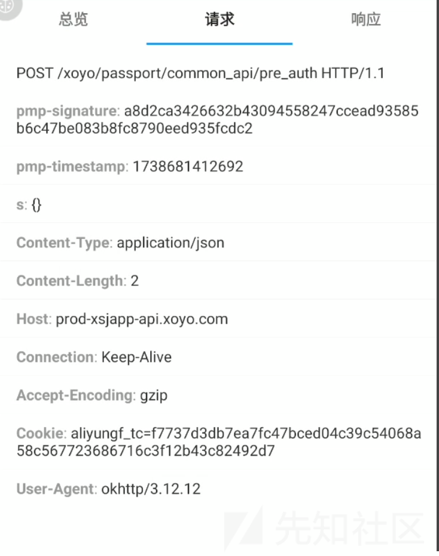
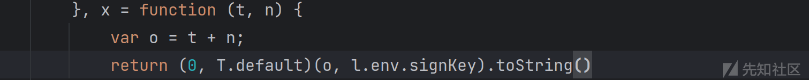
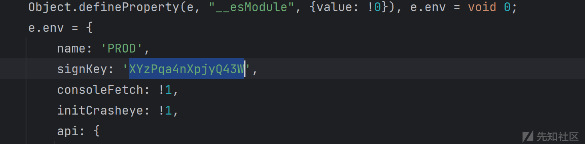
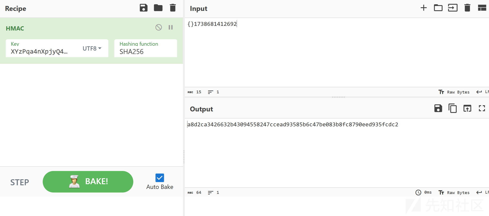

# 某游戏管家 signature逆向-先知社区

> **来源**: https://xz.aliyun.com/news/16908  
> **文章ID**: 16908

---

### 前言

环境： pixel2 android10

app： 6KW/5bGx5bGF{beihai\_delete}5ri45oiP566h5a6{beihai\_delete}2YXBrIDEuMS4w

### 正文

抓包，发现pmp-signature

看了一下开发者助手，发现没加固

jadx反编译，搜索关键字pmp-signature，发现毛都没有

再搜了一下signature，大致看了一下感觉都不匹配

那就有可能是构造请求包的代码不在java层，看看lib中的库，发现了native react的特征

打开assets文件夹查看发现了index.android.bundle。这个app采用了React Native 进行开发

React Native是使用JavaScript来编写Android和[IOS](https://so.csdn.net/so/search?q=IOS&spm=1001.2101.3001.7020)的应用，其最大的优点是跨平台运行。它能将JavaScript语言与原生的代码结合起来，同时开发使用。

React Native应用解压后在asset文件夹中会存在一个bundle文件，该文件就是编译后的json文件，所有react native代码编译后都会在该文件中

只需要分析index.android.bundle中的代码就行了，很幸运的是这个里面的js没有进行混淆

复制到pycharm ，ctrl+alt+L调整格式，再搜索关键字pmp-signature发现成功定位到相关代码

pmp-signature是x(s, c)

c就是时间戳pmp-timestamp，s是由json类型变量t转换成的字符串，但是t找不到了

于是可以是尝试让app发包时多加一个字段s，来观察s究竟是什么

将修改的bundle文件上传

将bundle替换为修改后的，再重打包签名和安装

运行修改后的app，抓包

发现是空的

​

查看一下函数x，（0，T.default）应该是一个算法，参数分别是s和timestamp的拼接结果和一个key

查看一下这个key，值为"XYzPqa4nXpjyQ43W"

综合考虑一下，signature的长度为64，且算法需要key，尝试一下很常见的sha256

将结果和pmp-signature对比一下发现确实是sha256

总结一下，这个app使用了react native开发。index.android.bundle并没有被加密，所以逆向起来还是比较轻松的

### 参考资料

<https://www.bilibili.com/video/BV1tgrTYyEso/>
