# 某某新闻 app sign逆向-先知社区

> **来源**: https://xz.aliyun.com/news/16910  
> **文章ID**: 16910

---

本文仅用于技术交流

## 前言

app：6L6+5bed{beihai\_delete}6KeC5a+fIDEuMg==  
环境：pixel2 android10

## 正文

### 抓包脱壳

抓一下登录的包，使用postern结合抓包工具  
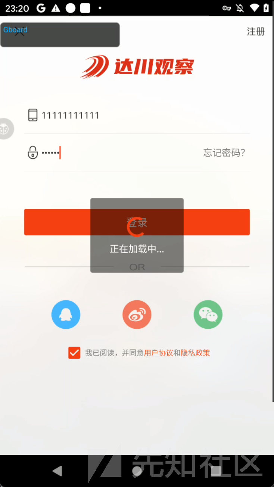

发现存在sign值  
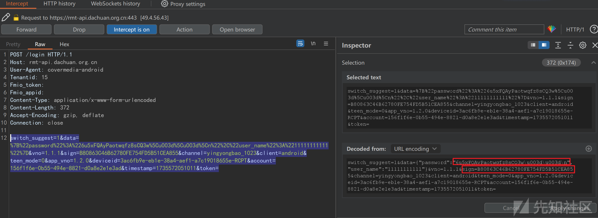

下面来分析这sign的生成过程

先分析sign  
直接反编译apk，发现加了数字壳

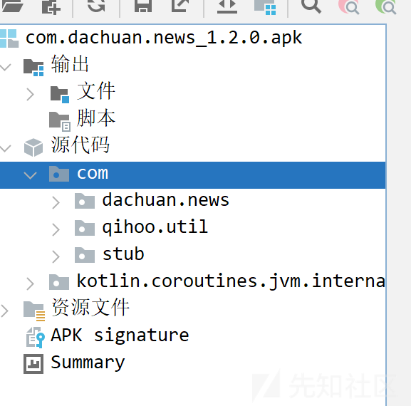

尝试使用fundex脱壳  
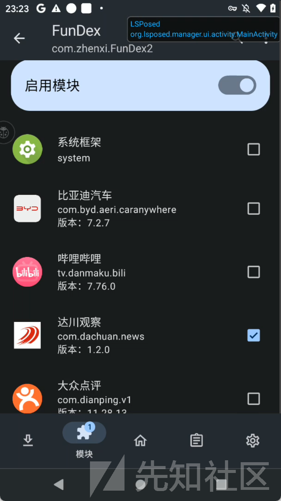


脱出的dex文件在/data/data/com.dachaun.news下  
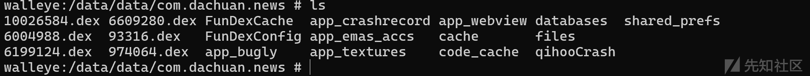  
把这几个dex拉下来再全部拖到jadx中反编译

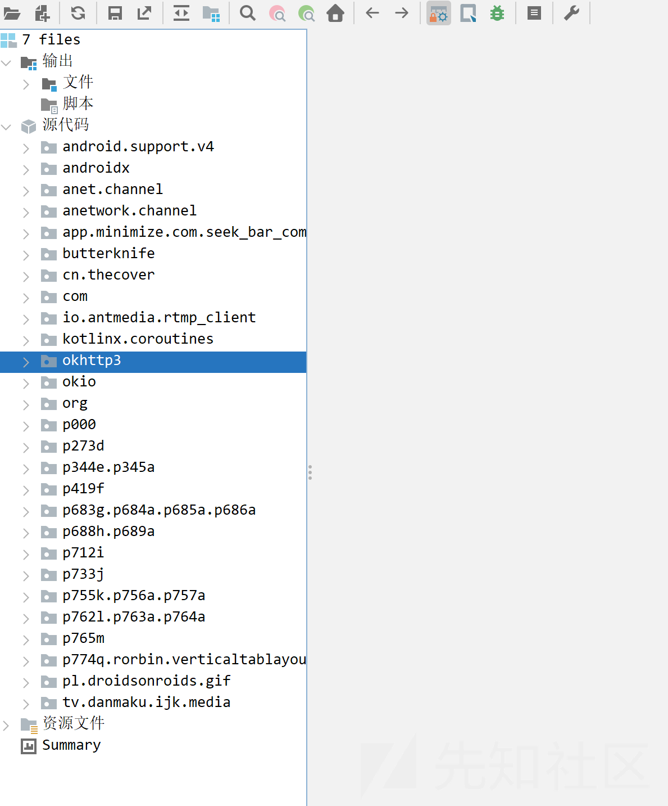

### java层

搜索了一下字符串sign，没有发现有什么结果，搜索"sign"。好在搜出的结果不多  
排除了明显的sdk包，像是什么阿里巴巴，腾讯，魅族的，在剩下的里面看了一下，就找到可疑的位置  


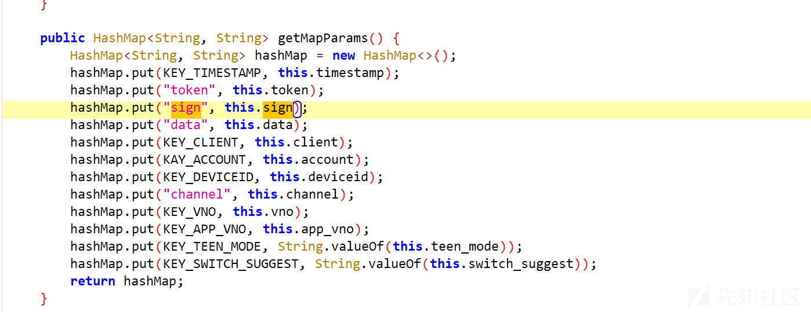

顺着this.sign往上看，发现了getSign

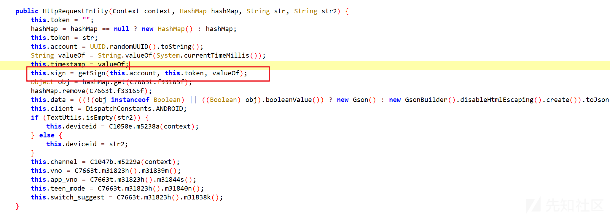  
进入getSign

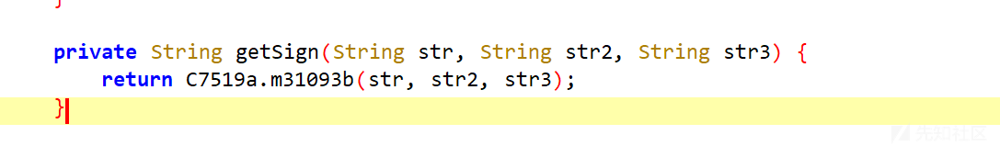  
继续跟进

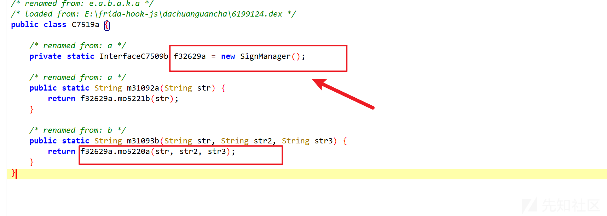  
进入SignManager,发现就已经追到了jni函数了

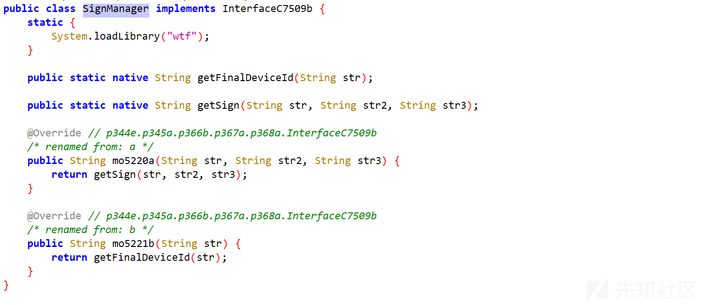

hook一下  
代码如下：

```
function hook_getSign() {
    Java.perform(
        function () {
            var SignManager = Java.use("cn.thecover.lib.common.manager.SignManager");
            SignManager.getSign.overload('java.lang.String','java.lang.String','java.lang.String').implementation = function (a,b,c) {
                console.log("a========>", a);
                console.log("b========>", b);
                console.log("c========>", c);
                var ret = this.getSign(a,b,c);
                console.log("ret========>", ret);
                return ret;
            }
        }
    )
}
```

可以发现这个位置是正确的，第一个参数是account,第二个是空，第三个是时间戳  
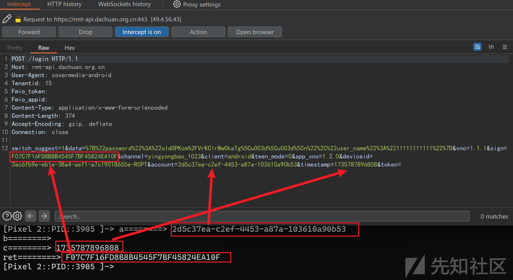

貌似这个account每次都会变

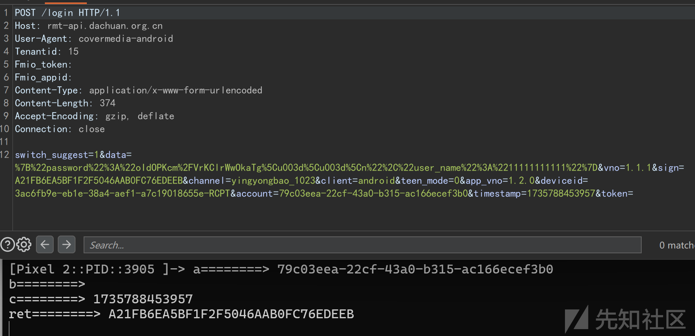

回头查看很容易就找到了account和时间戳的生成位置，同时也可看到第二个参数是token，因为上面没有登录所以是空的

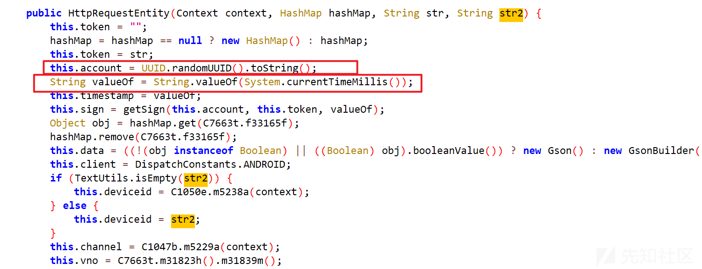  
`UUID.randomUUID().toString()`  
生成一个新的 UUID（通用唯一标识符）字符串。UUID 是一种 128 位的标识符，用于确保唯一性。  
`String.valueOf(System.currentTimeMillis())`  
用来获取当前的时间戳并将其转换为字符串

### native层

​

参数都ok了，下面来看看getSign里面具体是怎么进行处理的  
用ida反编译wtf库  
搜索一手getSign,直接就找到了

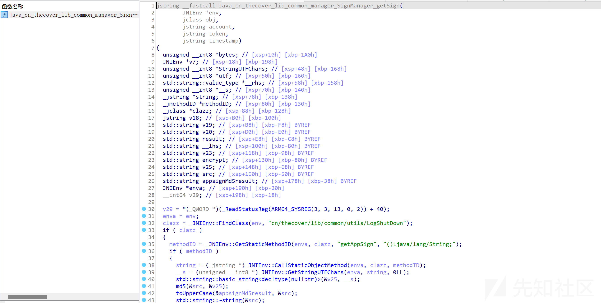

源码逻辑并不复杂，大致步骤是

首先查找LogShutDown类。然后尝试获取getAppSign静态方法的ID，如果成功，则调用该方法，获取应用的签名字符串。最后将返回的Java字符串转换为C++中的UTF字符串，存储在\_\_s中  
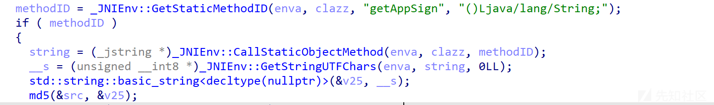

获取到的字符串通过MD5加密，生成src。然后，将src转换为大写，生成appsignMd5result

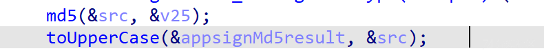

接着是拼接字符串，顺序是appsignMd5result+account+token+timestamp

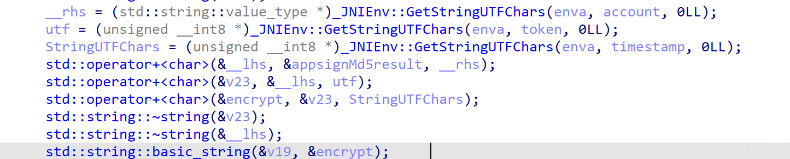

对拼接后的字符串再次进行MD5加密，得到最终的签名result。然后将结果转换为大写。


这个结果将转为jstring最后返回出来

可以通过hook update的参数和返回值来佐证分析  
进行md5::update函数，通过点击视图->打开子视图->详细地址来查看md5::update的偏移

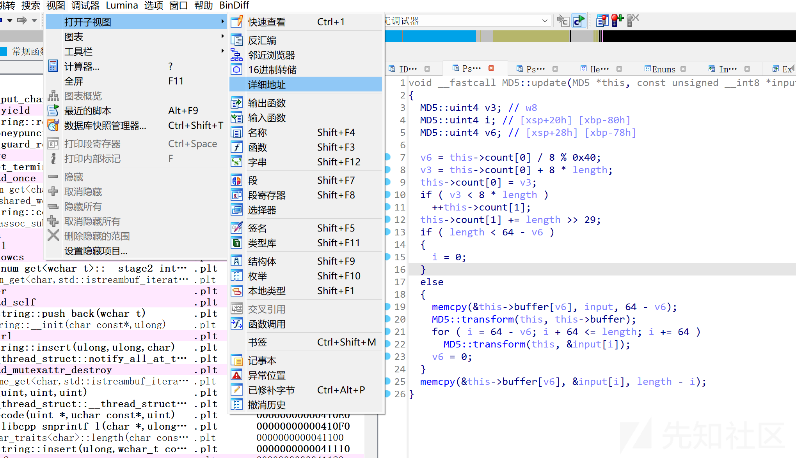

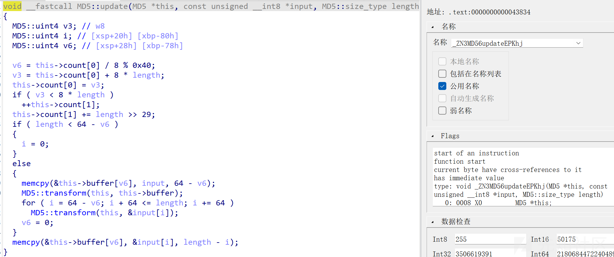  
找到偏移之后就可以写hook代码了,打印第二个参数input就行了，使用frida api中的readCString读取C风格的字符串（以\0结尾的字符序列）

```
function hook_md5_update(){
    let soBaseAddr = Module.findBaseAddress("libwtf.so")
    let md5_ptr = soBaseAddr.add(0x43834)
    Interceptor.attach(md5_ptr, {
        onEnter: function (args) {
            console.log("args========>", args[1].readCString());
        },
        onLeave: function (retval) {
        }
    })
}
```

通过结果可以看出，确实是像前面分析的一样进行了拼接  
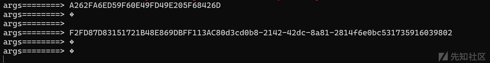

逻辑清楚了，接着来看看getAppSign函数  
cn.thecover.lib.common.utils.LogShutDown.getAppSign

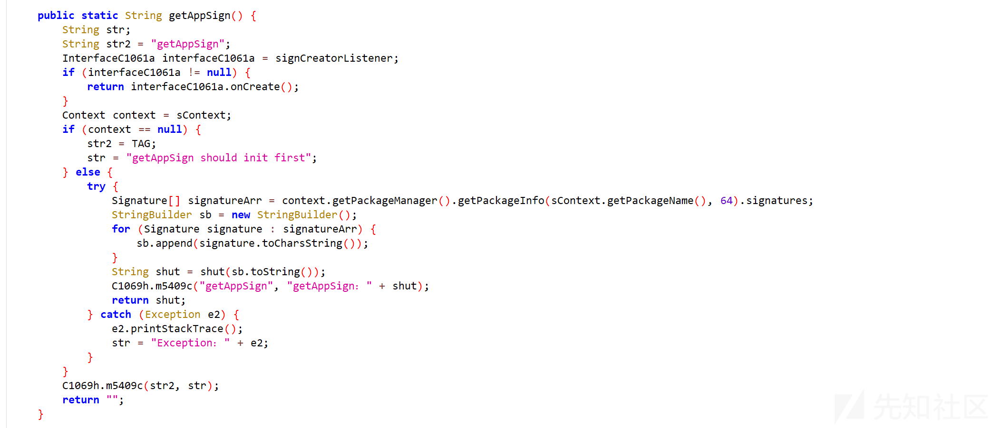

编写hook代码打印返回值

```
function hook_getAppSign(){
    Java.perform(
        function () {
            var SignManager = Java.use("cn.thecover.lib.common.utils.LogShutDown");
            SignManager.getAppSign.implementation = function () {
                var ret = this.getAppSign();
                console.log("ret========>", ret);
                return ret;
            }
        }
    )
}
```

观察结果发现好像是固定的  
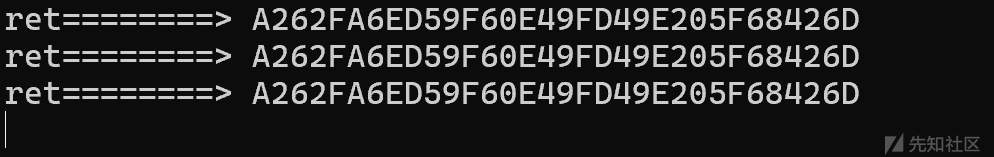

下面尝试手动复现处理逻辑  
以前面的为例，getAppSign返回的是A262FA6ED59F60E49FD49E205F68426D，account为2d5c37ea-c2ef-4453-a87a-103610a90b53，token为空，timestamp为1735787896808

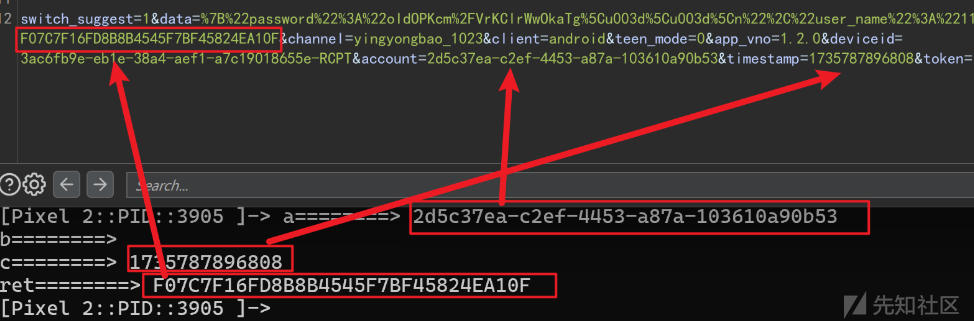

先将A262FA6ED59F60E49FD49E205F68426D进行md5加密得到32位大写结果F2FD87D83151721B48E869DBFF113AC8，再将结果和其他字符串拼接进行第二次加密并取大写  
最终结果和sign比对发现一致，说明前面的分析正确

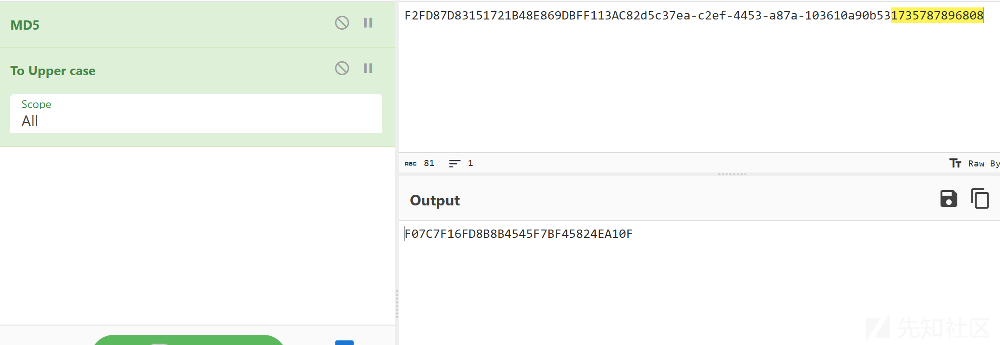

于是，sign生成的分析到此就完成了
