# Codeql全新版本从0到1-先知社区

> **来源**: https://xz.aliyun.com/news/16918  
> **文章ID**: 16918

---

网络上大部分的入门文章都是旧版本的，并且关于开源项目的数据库也迁移到了github api中，所以特地分享一下自己的学习成果，避免后人走太多弯路。

​

### 安装

codeql二进制文件下载 <https://github.com/github/codeql-cli-binaries/releases>

ql规则库下载 <https://github.com/github/codeql>

​

Codeql Cli 文档<https://githubdocs.cn/en/code-security/codeql-cli/getting-started-with-the-codeql-cli/about-the-codeql-cli>

codeql 文档 <https://codeql.githubdocs.cn/docs/contents/>

​

解压codeqlCli 设置进环境变量

vscode安装插件,并设置**二进制文件**路径

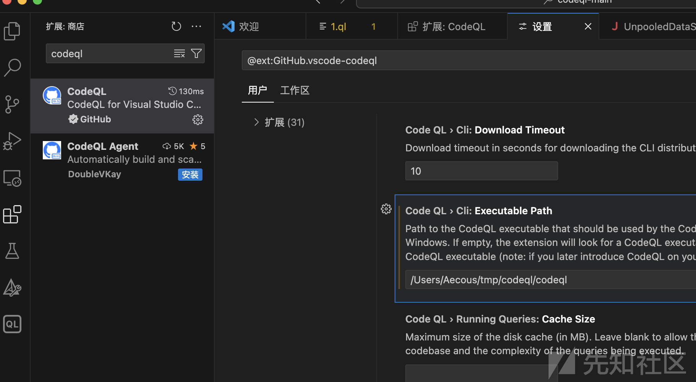

### 获取库

#### 创建

测试靶场

<https://github.com/l4yn3/micro_service_seclab/>

```
codeql database create db_name --language="java" --command="mvn clean install --file pom.xml" --source-root=~/micro-service-seclab/
```

踩坑：这靶场用了lombok，编译的时候会犯病，给lombok去掉，手动改全model就行了

​

常见CTF环境 or 漏洞挖掘环境

有些时候需要去挖依赖中的链子，需要将依赖一起打包生成库来进行规则查找

使用jadx将jar反编译保存成resources和sources

在codeql中可以不构建代码的情况下生成数据库，这也是我们所需要的（其实我之前各种尝试编译都失败了

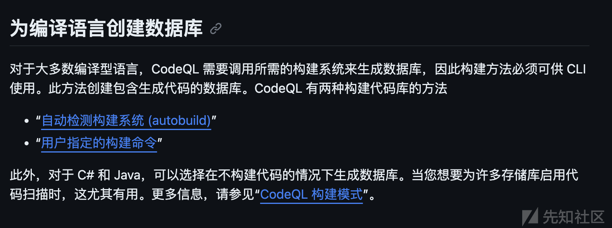

```
codeql database create db-name --language=java --source-root=./sources --build-mode=none
```

代价是很慢，一个项目我跑了14分钟

//单独依赖也可以用这种方式来建库，将依赖丢进jadx保存source后步骤同上

​

#### 直接获下载已经创建好的库

通过翻阅文档知，可以通过接口去列出公共项目不同语言的codeql库并下载

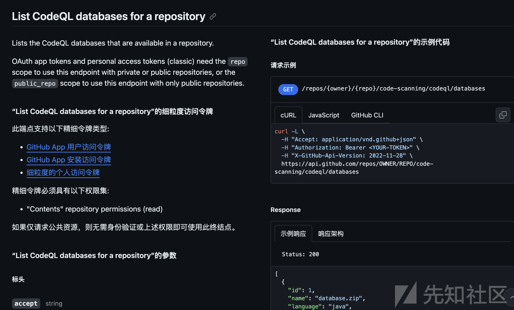

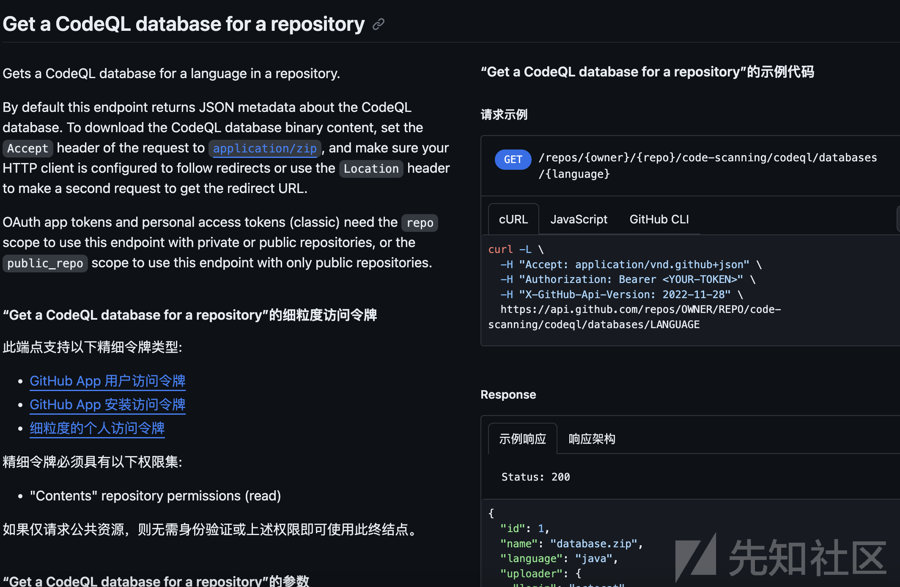

```
列出项目有哪些语言的库
curl -L \
  -H "Accept: application/vnd.github+json" \
  -H "Authorization: Bearer token" \
  https://api.github.com/repos/apache/kylin/code-scanning/codeql/databases


下载
curl -L \
  -H "Accept: application/zip" \
  -H "Authorization: Bearer token" \
  https://api.github.com/repos/apache/kylin/code-scanning/codeql/databases/java
  --output ./xxx.zip
```

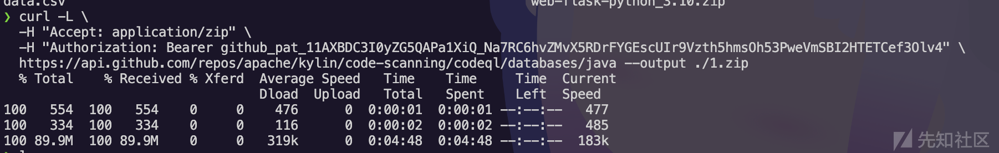

例如这里就是下载了apache kylin的codeql库，然后就可以进行代码扫描了，不过有一点可惜的是没办法指定过往版本

​

### 示例

#### SUCTF-ezsolon

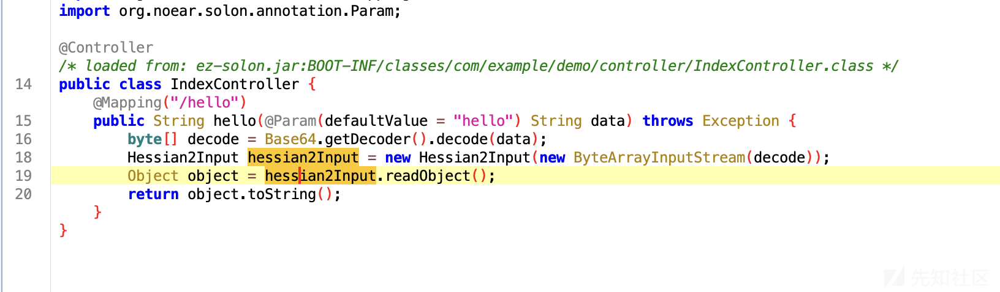

hessian2反序列化，会调用类的toString方法，依赖中存在fastjson

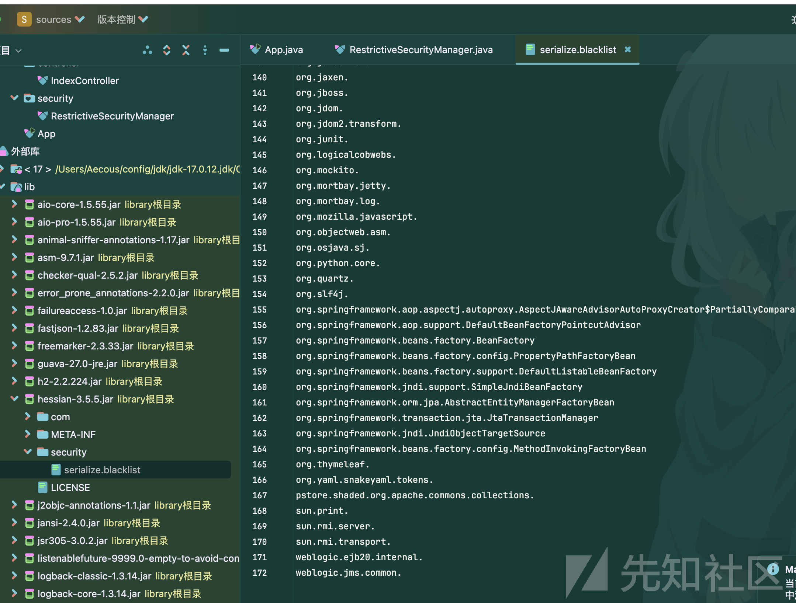

hessian版本巨高，黑名单一堆，基本上现有的直接死了

存在一个h2

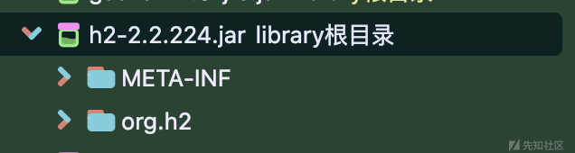

大概就是要去打jdbc，但是jdbc的getter被ban了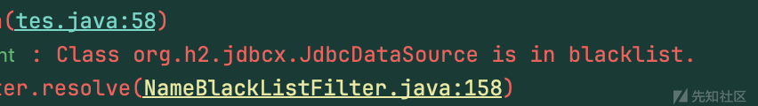需要挖一条新的getter or setter

创建codql库，跑了14分钟

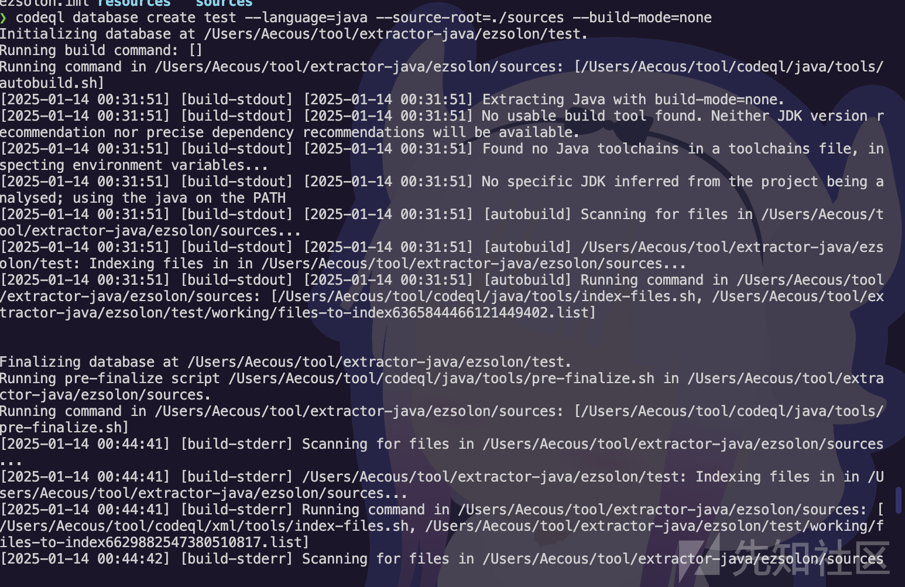

编写规则

```
import java


class GetMethod extends Method{
  GetMethod(){
      this.getName().indexOf("get") = 0 or this.getName().indexOf("set") = 0 and
      this.getName().length() > 3 and
      this.isPublic() and
      this.fromSource() and
      this.hasNoParameters() 
  }
}

from GetMethod getMethod, MethodAccess ma, Method method
where  ma.getEnclosingStmt() = getMethod.getBody().getAChild*() and method = ma.getMethod() 
    and method.hasName("getConnection") and getMethod.hasNoParameters()
select method,getMethod,getMethod.getDeclaringType()
```

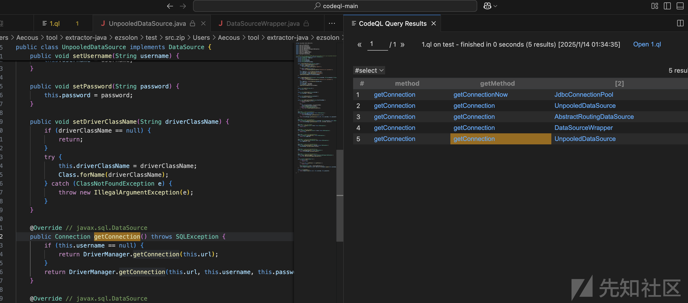

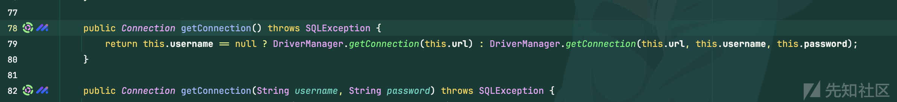

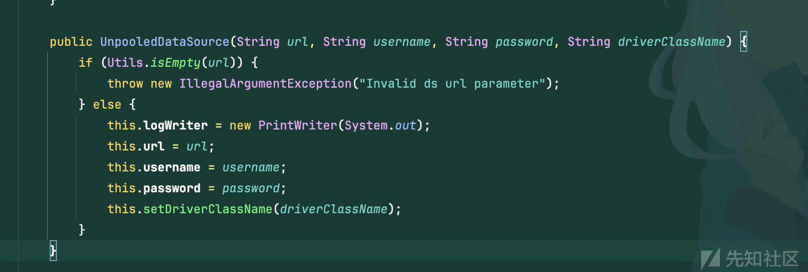

此处的getter可以去触发jdbc

​

#### oracle jdbc getter

面向答案解题

jdbc会触发jndi注入，所以找lookup

```
/**
@kind path-problem
*/

import java
import semmle.code.java.dataflow.FlowSources


class GetMethod extends Method {
GetMethod(){
    this.getName().indexOf("get") = 0 and
    this.hasNoParameters() and
    this.getName().length() > 3 and
    this.isPublic() 
}
}


class LookupMethod extends Method {

    LookupMethod() {
        exists(MethodCall a| 
            a.getCallee().hasName("lookup") and
            this = a.getCaller()
            )
    }  
}  


query predicate edges(Method a, Method b) { 
    a.polyCalls(b) 
    and
    a.getDeclaringType().getAField().getDeclaringType().hasName(b.getDeclaringType().getName())
}

from GetMethod source, LookupMethod sink
where edges+(source, sink)
select source, source, sink, "$@ $@ to $@ $@" ,
source.getDeclaringType(),source.getDeclaringType().getName(),
source,source.getName(),
sink.getDeclaringType(),sink.getDeclaringType().getName(),
sink,sink.getName() 	 	
```

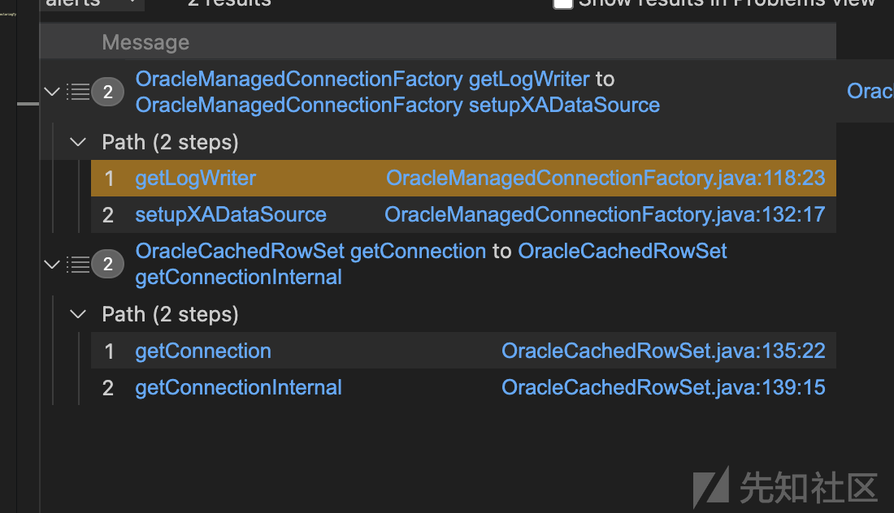

找到两条，下面这条就是我们正常使用的那条

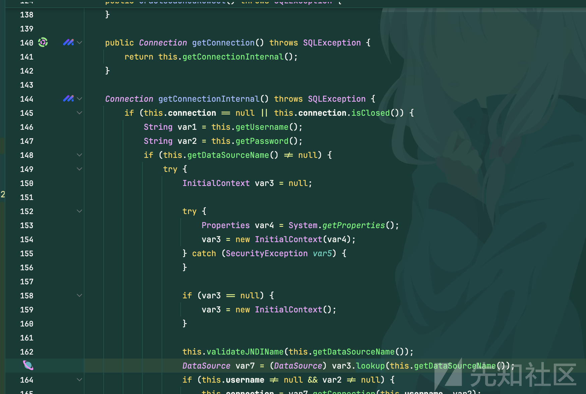

上面其实也是理论可以使用的，但是存在着一个问题

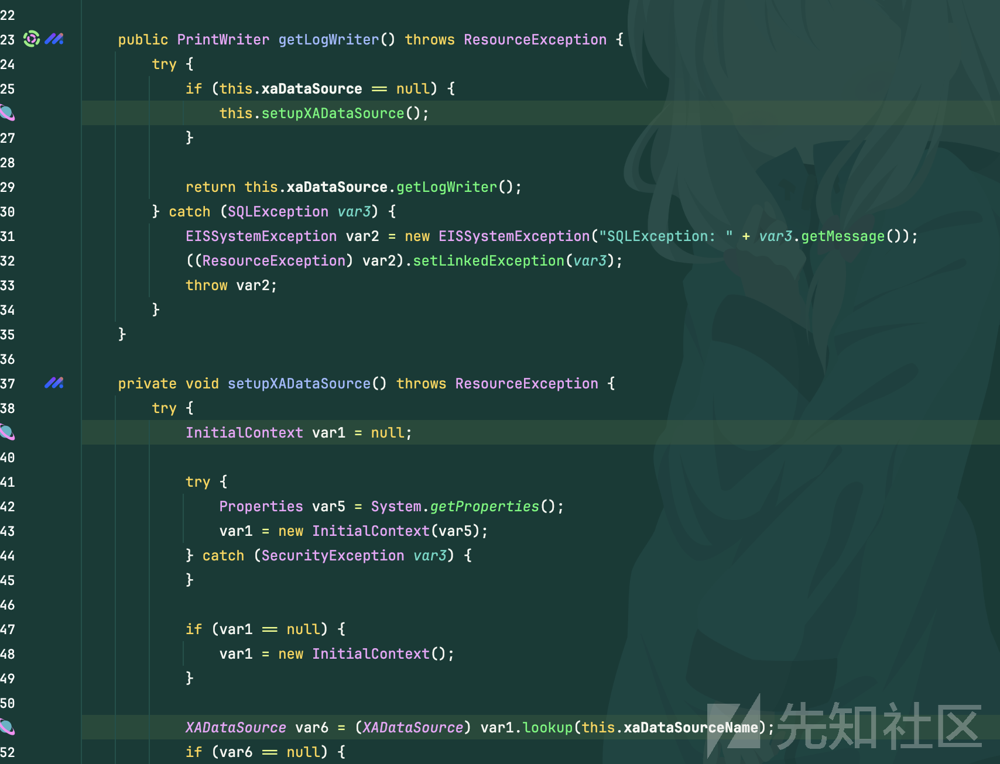

该类调用了一个JavaEE的东西，需要存在相关的依赖才能够正常使用

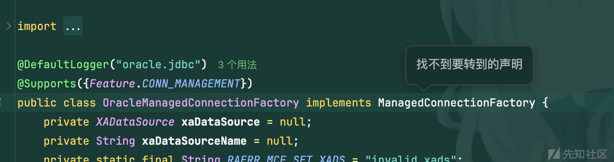

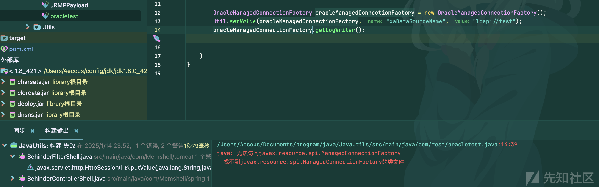

如果遇见了相关的题目或许可以派上用场

```
OracleManagedConnectionFactory oracleManagedConnectionFactory = new OracleManagedConnectionFactory();
Util.setValue(oracleManagedConnectionFactory, "xaDataSourceName", "ldap://test");
oracleManagedConnectionFactory.getLogWriter();
```

#### aliyunctf chain17

根据不同的jdk版本依赖情况进行修改

例如jdk8高版本则可以注释lookup，无jdbc依赖就注释getConnection等

这里就留个lookup和newInstance

```
/**
@kind path-problem
*/

import java
import semmle.code.java.dataflow.FlowSources

class Serializable extends Method{
    Serializable(){
        this.getDeclaringType().getASupertype*() instanceof TypeSerializable
    }
}


class GetSource extends Serializable {
    GetSource(){
    (this.getName().indexOf("get") = 0 or this.getName().indexOf("set") = 0) and
    this.hasNoParameters() and
    this.getName().length() > 3 and
    this.isPublic() 
}
}


class GetSink extends Serializable {

    GetSink() {
        exists(MethodCall a| 
            (
            (a.getCallee().hasName("lookup") and a.getCallee().getDeclaringType().getASupertype*().hasQualifiedName("javax.naming", "Context"))
        // or   a.getCallee().hasName("getConnection")
        // or   a.getCallee().hasName("readObject")
        or   (a.getCallee().hasName("newInstance") and a.getCallee().getNumberOfParameters() = 1 )
            )
        and  this = a.getCaller()
            ) 
    }  
}  


query predicate edges(Method a, Method b) { 
    a.polyCalls(b)
    or a = b 
}

from GetSource source, GetSink sink
where edges+(source, sink)
select source, source, sink, "$@ $@ to $@ $@" ,
source.getDeclaringType(),source.getDeclaringType().getName(),
source,source.getName(),
sink.getDeclaringType(),sink.getDeclaringType().getName(),
sink,sink.getName() 	 	
```

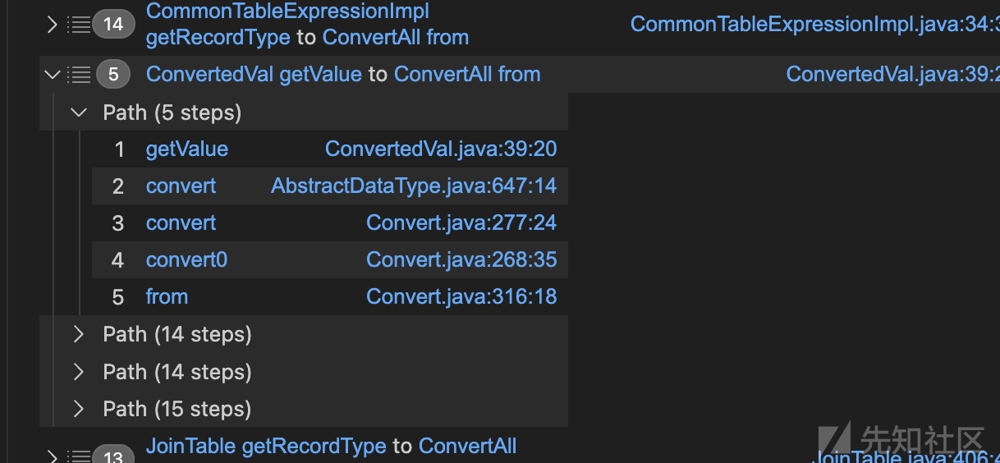

也可以找到

​
