# Windows剪切板取证解析：定位加密数据与解密ActivitiesCache.db实战指南-先知社区

> **来源**: https://xz.aliyun.com/news/16927  
> **文章ID**: 16927

---

# 剪切板位置

剪切板是计算机操作系统提供的一个临时存储区域，用于在不同应用程序之间复制和粘贴文本、图像和其他数据。剪切板通常位于操作系统的内存中，而非直接可见

但是windows剪切板的内容都被加密存储在这个文件夹下

```
C:\Users\[your user name]\AppData\Local\Microsoft\Windows\Clipboard\Pinned\
```

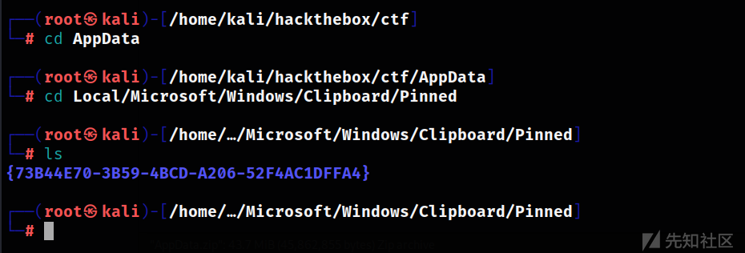

在这个文件夹下有一个GUID名的文件夹，GUID 是一个由数字和字母组成的标识符，用于唯一标识对象、组件或资源。在 Windows 中，GUID 通常用于标识注册表项、文件夹、设备驱动程序等。每个 GUID 都是唯一的，几乎不可能发生重复

进入这个文件夹，可以看到还有一个GUID名的文件夹和一个json文件，打开这个json文件

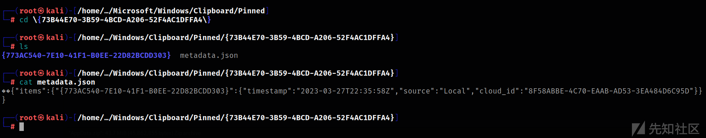

```
{
  "items": {
    "{773AC540-7E10-41F1-B0EE-22D82BCDD303}": {
      "timestamp": "2023-03-27T22:35:58Z",
      "source": "Local",
      "cloud_id": "8F58ABBE-4C70-EAAB-AD53-3EA484D6C95D"
    }
  }
}
```

上述 JSON 数据表示一个包含 "items" 键的对象，该键对应的值是另一个对象。内部对象具有一个键 "{773AC540-7E10-41F1-B0EE-22D82BCDD303}"，该键对应的值是一个包含 "timestamp"、"source" 和 "cloud\_id" 键的子对象。

子对象中的 "timestamp" 键对应的值是 "2023-03-27T22:35:58Z"，表示时间戳。"source" 键对应的值是 "Local"，表示来源信息。"cloud\_id" 键对应的值是 "8F58ABBE-4C70-EAAB-AD53-3EA484D6C95D"，表示云标识符

进入文件夹，可以看到三个文件

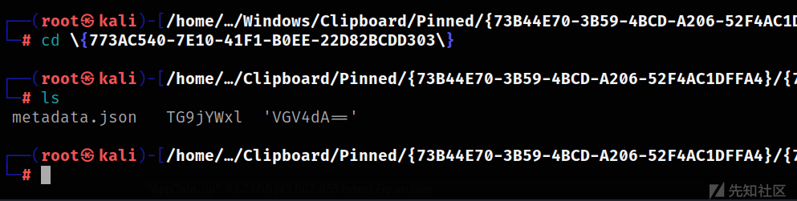

一个是json文件，另外两个文件名都是经过base64加密过的

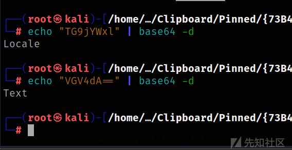

但是这些文件内的内容都被加密混淆了，不知道key就无法复原


# 剪切板取证

自 Windows 10 版本 1803 以来，ActivitiesCache.db 已开始记录剪贴板活动，ActivitiesCache.db的位置在

```
%AppData%\Local\ConnectedDevicesPlatform\[user]\
```

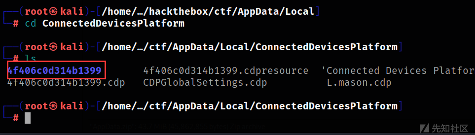

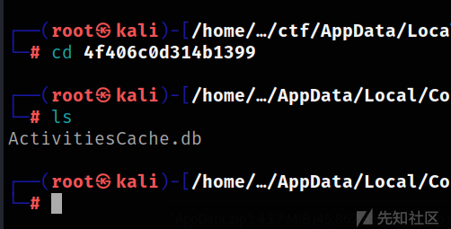

在这个数据库里，存储着剪切板里的内容，我们需要安装sqlitebrowser工具才能查看数据库

```
apt install sqlitebrowser
```

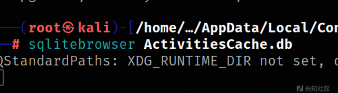

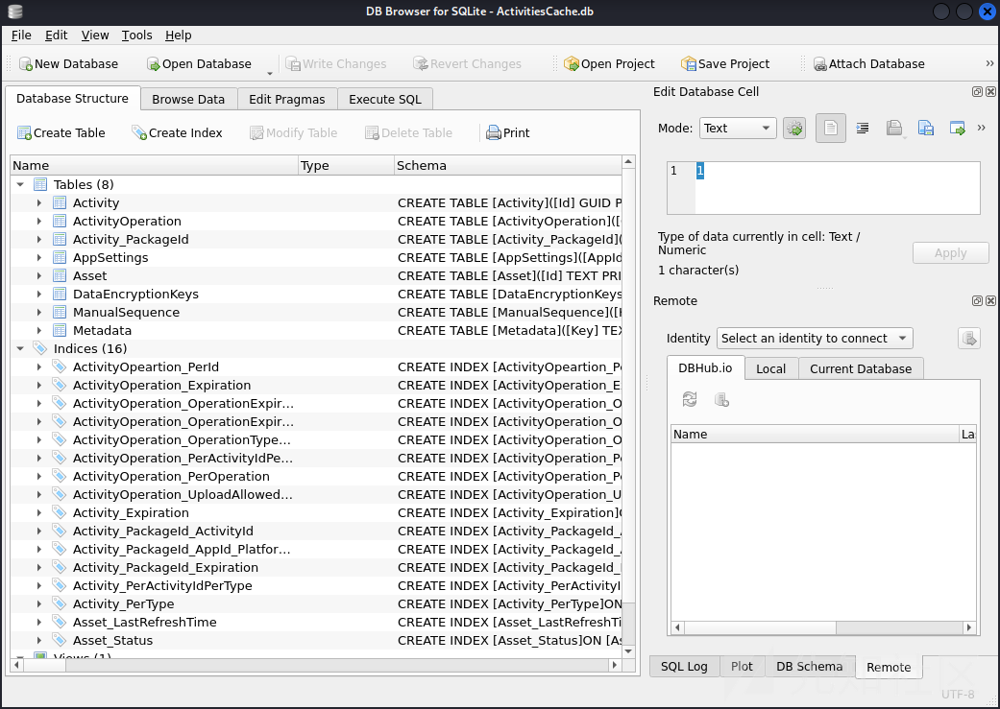

点击browse data，选择activityoperation表

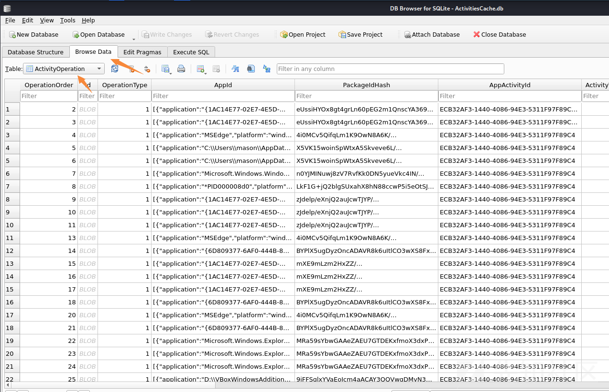

点击cipboardpayload列进行排序

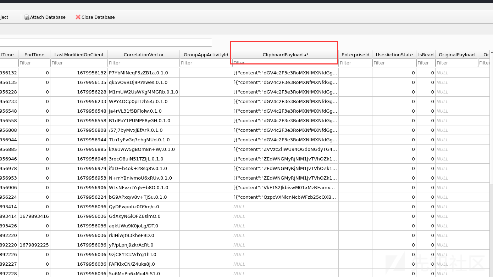

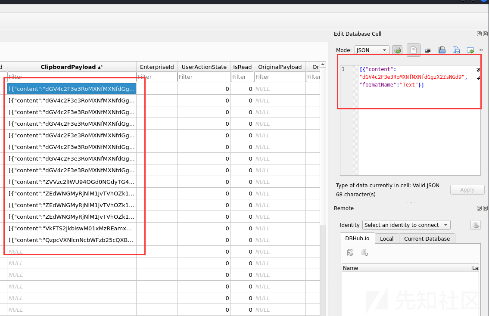

这些数据就是剪切板里的内容，数据经过了base64加密，我们解密即可

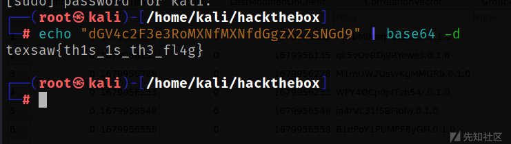

# 其他

生成ActivitiesCache.db文件需要启用剪贴板历史记录

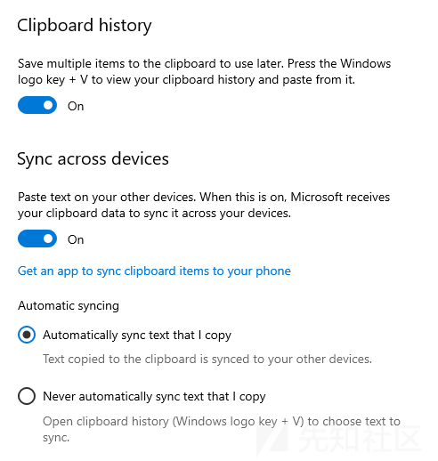

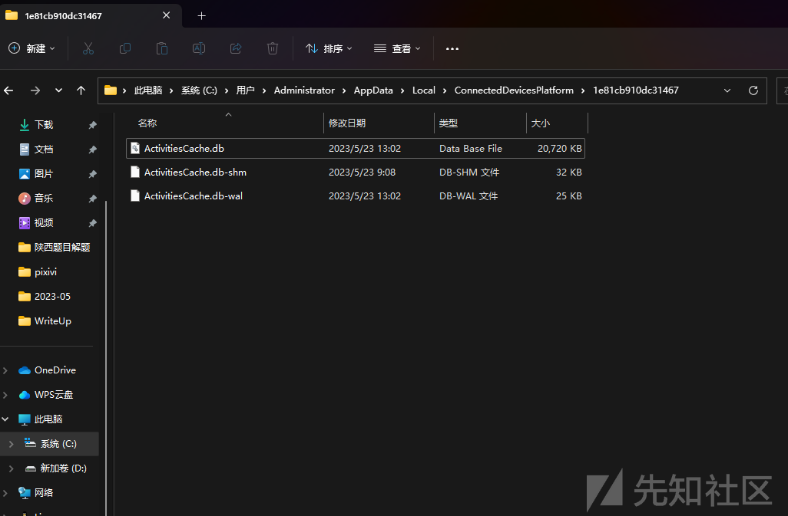
