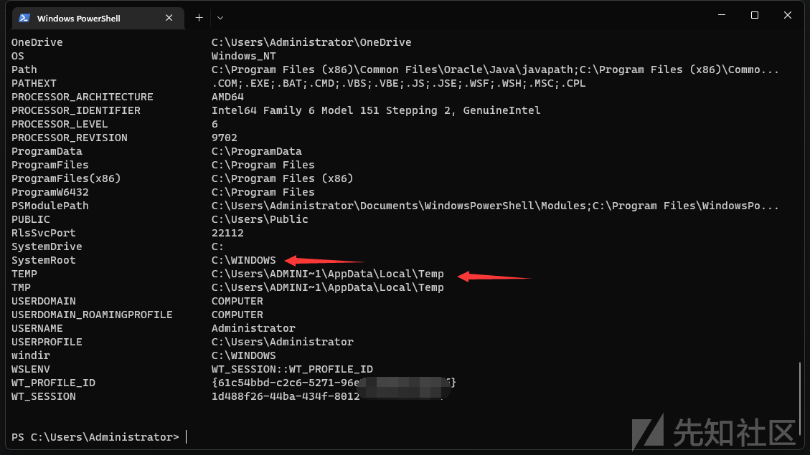
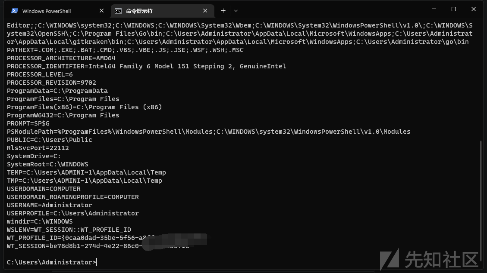
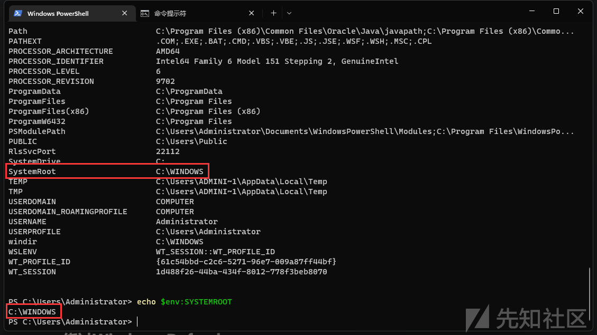
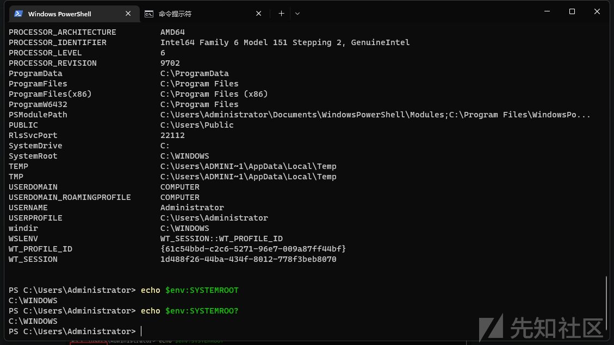
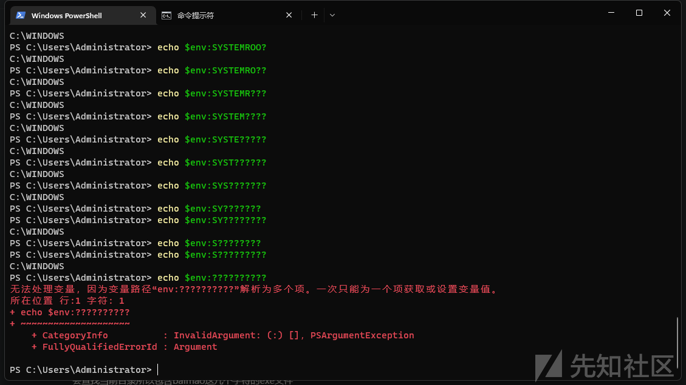
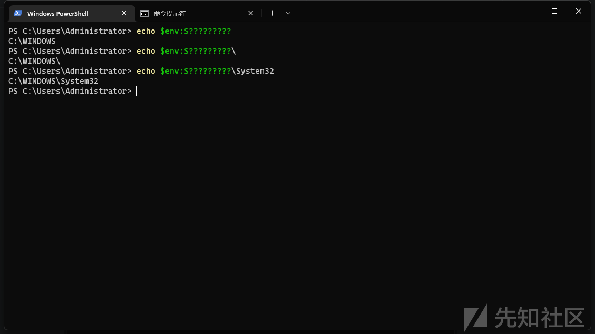
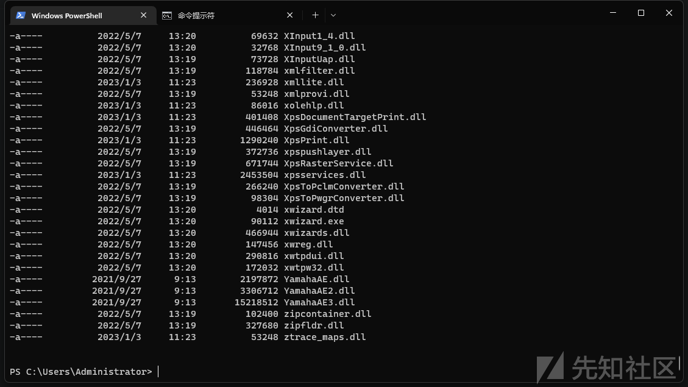
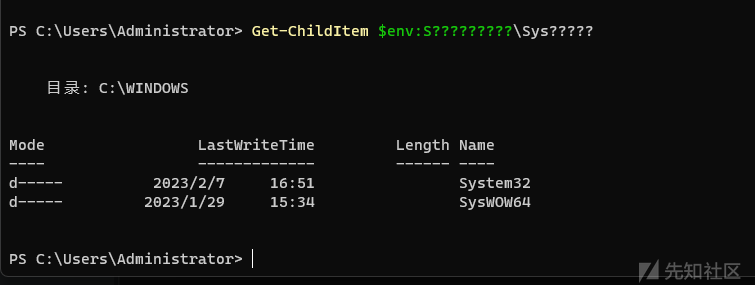
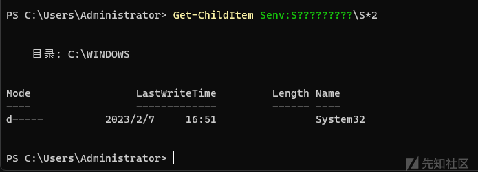
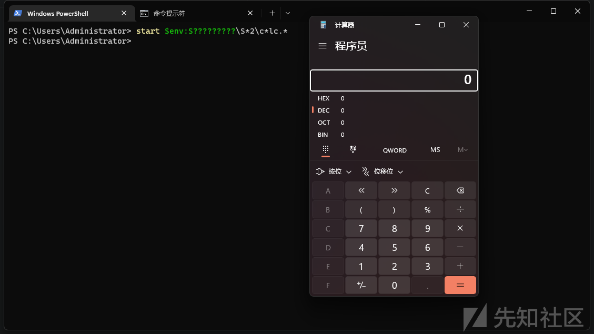

# 环境变量与通配符混淆实战解析-先知社区

> **来源**: https://xz.aliyun.com/news/16928  
> **文章ID**: 16928

---

# 什么是环境变量

环境变量是操作系统中一类存储配置信息的变量，它们包含一些影响程序行为的信息，通常包括系统的配置信息、执行路径、用户数据等。环境变量可以影响程序的执行方式，例如指示某个程序需要使用哪些文件目录、库文件、或其他重要信息

## env

env是英文单词environment的缩写，其功能是用于显示和定义环境变量，我们可以通过查看env来获取本机全部的环境变量配置

```
ls env:\
```



在这里可以看到很多的环境变量配置，如果是cmd那就执行以下命令查看全部的环境变量

```
set
```



# 隐藏混淆行为

我们还可以通过env来查看指定的环境变量

```
echo $env:SYSTEMROOT
```



然后我将T更换为?



还是能正常显示环境变量，因为env会根据这个环境变量表来查找，类似于find -name "baimao\*.exe"，这个命令会查找当前目录所以包含baimao这几个字符的exe文件

我们还可以进一步来用?替代字符



再多就会因为解析多个环境变量而报错

```
echo $env:S?????????
```

在后面加上其他的文件夹名，输出的内容也会改变



我们还可以使用dir或者ls或者Get-ChildItem来查看这个文件夹

```
Get-ChildItem $env:S?????????\System32
ls $env:S?????????\System32
dir $env:S?????????\System32
```



在后面指定的文件夹，也可以用?来代替

```
Get-ChildItem $env:S?????????\Sys?????
```



为了缩小范围，我们最好使用\_来代替字符，关于\_的用法，上面已经介绍过了

```
Get-ChildItem $env:S?????????\S*2
```



现在我们要弹出计算器，可以使用以下命令

```
start $env:S?????????\S*2\c*lc.*
```



如果我们要调用schtasks.exe，可以用以下命令

```
start $env:???t??r???\*2\??h???k?*
```

此方法在apt恶意软件分析中出现过

```
https://www.securonix.com/blog/detecting-steepmaverick-new-covert-attack-campaign-targeting-military-contractors/
```

攻击者通过这种方法来隐藏混淆行为和绕过 Windows Defender
