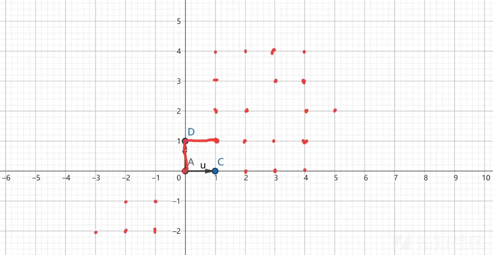

# 子集和问题的两种解决方式-先知社区

> **来源**: https://xz.aliyun.com/news/16929  
> **文章ID**: 16929

---

# 背包密码和多维子集和问题(**Multidimensional Subset Sum Problem**。)

* 知识:LLL算法，以及BKZ解决方法，还有MITM(中间相遇算法)算法解决。

## 简单介绍一些这里所称的背包问题，以子集和问题(Subset Sum Problem)

* 背包问题

> W表示背包的承重，x只能位0或1(这里是0/1背包，完全背包感兴趣可以了解这里仅详细阐述0-1背包)，用来表示选中或不选中。
>
> 这种0-1背包问题也叫做子集和问题，给定一个集合，
>
> 它的部分元素的的和等于W，所以叫做子集和。如果不采取任何取巧的方式暴力破解这个问题，实践复杂度位$o(2^n)$,如果n较大这是十分困难的

## Merkle–Hellman公钥加密算法（这种加密算法以及不再安全)

* 原理:虽然单纯的背包破解十分复杂，但是如果是超递增背包就能极大降低难度，我们设定初始背包为超递增背包，再利用模数m和乘数w对其进行加密

### 超递增背包

> 超递增背包的性质:设定集合:
>
> ,生成一个超递增背包并解逆推出用bag加密后的数，因为超递增背包的特性，这是很容易的
>
> 接下来进行公钥加密:
>
> w做乘数，m取模，并且gcd(w,m)=1;
>
> 利用加密后得到,得到另一个背包
>
> B就是公钥，我们利用公钥B对信息进行加密

```
from Crypto.Random.random import randint
from Crypto.Util.number import getPrime, long_to_bytes, bytes_to_long

bag=[]
a=getPrime(10)
while True:
    a=randint(2,5)*a
    bag.append(a)
    if len(bag)==24:
        break
print(bag)
flag=getPrime(24)
print(flag)
a=0
for i in bag:
    f=flag%2
    a=a+i*f
    flag=flag>>1
print(a)
def reverse_flag(a, bag):
    flag = 0
    for i in range(len(bag)):
        if a >= bag[24-i-1]:
            a -= bag[24-i-1]
            flag |= (1 << (24-i-1))
    return flag
F=reverse_flag(a,bag)
print(F)
```

```
def reverse_flag(a, bag):
    flag = 0
    for i in range(len(bag)):
        if a >= bag[24-i-1]:
            a -= bag[24-i-1]
            flag |= (1 << (24-i-1))
    return flag
m=663037888222452170426631697
w=17854050521669203729
B=[]
for a in bag:
    b=(w*a)%m
    B.append(b)
print(f'B={B}')
c=en_f(flag,B)
print(f'c={c}')
#B就表示公钥，用B对消息进行加密
```

我们如果n很大我们就需要通过对B的每一个数和c乘w\_1，然后模m，最后利用上述相同的方法便能恢复flag下面是完整代码

```
from Crypto.Random.random import randint
from Crypto.Util.number import getPrime, long_to_bytes, bytes_to_long, inverse

bag=[]
a=getPrime(10)
while True:
    a=randint(2,5)*a
    bag.append(a)
    if len(bag)==24:
        break
print(bag)
flag=getPrime(24)
print(flag)

def en_f(flag,bag):
    a = 0
    for i in bag:
        f = flag % 2
        a = a + i * f
        flag = flag >> 1
    return a
def reverse_flag(a, bag):
    flag = 0
    for i in range(len(bag)):
        if a >= bag[24-i-1]:
            a -= bag[24-i-1]
            flag |= (1 << (24-i-1))
    return flag
m=663037888222452170426631697
w=17854050521669203729
B=[]
for a in bag:
    b=(w*a)%m
    B.append(b)
print(f'B={B}')
c=en_f(flag,B)
print(f'c={c}')
w_1=inverse(w,m)
BAG=[]
for b in B:
    a=b*w_1%m
    BAG.append(a)
c=c*w_1%m
F=reverse_flag(c,BAG)
print(f'F={F}')
print(f'BAG={BAG}')
```

* 这种加密方式实际上已经不安全了，LLL算法能很轻易的破解背包密码，接下来我们便讲解LLL算法与背包密码

## LLL和LLL-BKZ与子集和问题

* 这里所指的0-1背包更多的也被叫做子集和问题，

### LLL算法

下面我们做一些格的简单介绍以及这里需要用到的应用

* 什么是格

我们定义一组基向量basis,由这组基向量和整数系所构成的所有点就是格。

例如(1,0)和(0,1)这一组向量就能构建这样的格



这样就构建了一个普通的格，当然我们遇到的大多数格基当然不会像这么简单。我们在子集和中需要应用到的是找格里面最短向量的办法

* hermite 定理

> 对应任意n维的格L，都有一个非零向量v属于L，并且

​

假设向量v是格L的其中一个向量满足这个定理，并且v和大小相差不算多，我们可以判定v是最短非零向量。我们在计算LLL相关题目时，如果不满足这个定理，则需要构造。当然这里并不需要

我们现在可以举例个背包加密的例子

给出最短向量的上限。

2024极客大挑战

```
from Crypto.Util.number import *

flag = b'******'
m = bytes_to_long(flag)

assert m.bit_length() == 327
p = getPrime(1024)
a = getPrime(1024)
c = getPrime(400)

b = (a*m + c) % p

print(f'a = {a}')
print(f'b = {b}')
print(f'p = {p}')

'''
a = 16979084980432354094619720470840276286258619760418310258927074185970855030192034811294130599976409219799692929847459006262555680679361326852776377401377268595469956168424494543
b = 87985708831523238980948938165414984318379459926002798504435964538203443877988599888615810231215118828138306895572062833107988965151522391460216837691927960249874511818878134399
p = 13172449451206565880103976654678882171806396314446781873576804063136706915381625485522965544955909918869440326004499036629202691608534025007719873521577414908702557726376984665
'''
```

已知a,b,p。

接下来构造函数

> b=am+c-kp
>
> c=b+kp-am
>
> m=0+m+0
>
> 1=[1,0,0]
>
> [1,m,k]\*[1,0,b//0,1,-a//0,0,p]=[1,m,c]
>
> 如果m和c远远小于a,b,p则[1,m,c]可视为最短向量,通过求出最短向量即可求出m和c。但是这里[1,0,b]不能确定是否一定比[1,m,c]大很多，所以我们可以先尝试构造

这里构造出来，  
  
  
补个  
|V|<=|p|\*1/3，并且大小接近，但是加了ZZ之后早格的范围变大了一些。

当然这只是简单的举例，知识为了更方便的理解背包密码。

```
from Crypto.Util.number import *

a = 16979084980432354094619720470840276286258619760418310258927074185970855030192034811294130599976409219799692929847459006262555680679361326852776377401377268595469956168424494543
b = 87985708831523238980948938165414984318379459926002798504435964538203443877988599888615810231215118828138306895572062833107988965151522391460216837691927960249874511818878134399
p = 13172449451206565880103976654678882171806396314446781873576804063136706915381625485522965544955909918869440326004499036629202691608534025007719873521577414908702557726376984665


M = matrix([[2^377,0, b], [0,1, -a],[0,0,p]])
L = M.LLL()[0]

print(long_to_bytes(L[1]))

#b'SYC{1e989433efffd767589e989ad0f091075c06}'
```

接下来我们讲述LLL算法在子集和问题的应用，以及怎么破解刚刚的Merkle–Hellman公钥加密算法

> 这是一个典型的子集和问题，现在我们来构造矩阵。
>
> 来构造一个格,是一个(n+1)(n+1)的矩阵。
>
> 在一定条件下，我们可以利用这个格解除B然后找出x。这里N按理说是大于的数，不过我这里试过直接N=1也无所谓

一定的条件，满足格密码的定理，这里我们要求的B就是最短非零向量

* 背包的密度

一般来说d<0.9408如果d过大则无法完成计算,当然这里所以ai肯定不能用同时乘以某个数的方式来扩大ai

```
import random
import copy
from Crypto.Util.number import getPrime
from paramiko.util import bit_length

L=[]
list = []
bag = []
p=getPrime(16)
for i in range(1):
    t = p
    a=[getPrime(20) for _ in range(16)]
    b=0
    for j in a:
        temp=t%2
        b+=temp*j
        t=t>>1
    A=copy.deepcopy(a)
    list.append(a)
    L.append(A)
    L[i].append(b)

    bag.append(b)
print(bin(p))
print(p)
print(f'list={list}')
print(f'S={bag}')
print(f'L={L}')
print(bin(p))
# 这里是我用来生成（多维）子集和的python代码
```

但是用普通的LLL算法无法做到小于0.9所以后面我们可以用BKZ算法来精确。

我们先暂时用LLL算法,待会再引申到BKZ

```

list=[[657617, 583853, 1042693, 750203, 870173, 796337, 575711, 686359, 549503, 596027, 532981, 694483, 527447, 954991, 1021303, 728369]]
S=[7753890]
n = len(list[0])  # 确定列数
N=len(S)
L = matrix(QQ, n + 1, n + N)  

for i, a in enumerate(list):
    for row, x in enumerate(a):
        L[row, row] = 2  
        L[row, -(i + 1)] = 5 * x  

L[-1, :] = 1
for i in range(N):
    L[-1, -i-1] = 5 * S[i]

print("原始矩阵:")
print(L)


res = L.LLL()

print("LLL 规约后的矩阵:")
print(res)
l=res[0]
print(l)
a=0
p=0
for  i in l:
    print(i)
    if i==-1:
       p=(1<<a)+p
    if i==1:
        p=p+0
    a=a+1
print(p)

```

这里的 小于0.9这样可以解出p

* 之前 讲的都是单维的子集和，现在讲一讲多维的

### 多维子集和

其实跟单维度区别不大但是计算背包密度d的时候，k表示维度。也就是有几个方程

​

构造多维子集和的矩阵

例如有这样几多维矩阵


我们可以构造如下矩阵  
  
是一个(n+1)(n+m)的矩阵

在多维运算时，普通的LLL算法即使在满足背包d的条件下也可能无法计算出x所以这里我们需要用到BKZ算法让它更精确，这里先用sagemath的库直接用，原理或许以后有空写一写

* 依然举个例子

用上面哪那个代码生成一组新的多维子集和

```
p= 14144071626274053077
list=[[3733096223, 4016122661, 2604791743, 3803752969, 2811015913, 2424854837, 2699276627, 3166905239, 4019323999, 2343359177, 3992862143, 3785767001, 2586924229, 3070457717, 2310412309, 2592357127, 2366334797, 2962683019, 2805750461, 3539027497, 2625450769, 3336823673, 3642010859, 2889382921, 3049931387, 2602304807, 3568999013, 3896273113, 3525202201, 2911945987, 3053645753, 3516097829, 3325059901, 3973524911, 3228036937, 3902446631, 2519797219, 2554082147, 3545600809, 2970361349, 3746719201, 3902275159, 2826114469, 3210912233, 3456385657, 2818943899, 2768933641, 3729610429, 3468484559, 2822792989, 3173397109, 2476550641, 3205047343, 3556526131, 4186055693, 3610056343, 2793960107, 3004053329, 4291698713, 3258552733, 2510177729, 3530096797, 3269456219, 2600147623], [3587860039, 3244673137, 4081135321, 3530424101, 3123822853, 4215837937, 2935180159, 3477346757, 3880682317, 3596126549, 3442632797, 2328804859, 3357519169, 3456684767, 2373991303, 3774163111, 2808888127, 2384282179, 3360642323, 2890006079, 3498280733, 4159921411, 2968219733, 2201454251, 2563597627, 2925599561, 3511920007, 3455169373, 4244464129, 2267534219, 3802834417, 3249221947, 3788296273, 3211757309, 3459173929, 2167189499, 4259795633, 3173827273, 3798038071, 2881017599, 2491861231, 3698075663, 2442704783, 2464350851, 2577280613, 3793908917, 3390031453, 2983114619, 3646066681, 3158874871, 4184514839, 3301620067, 2516698291, 2473620133, 2187913543, 2861276653, 3335457143, 4076976949, 4077911921, 2762541787, 2973463733, 2198753783, 3496416383, 2424059459], [3061838191, 3887444321, 2835006259, 2308551199, 2177389033, 3986307341, 2414267861, 2952804007, 3200321087, 2191758329, 2456777549, 3408679943, 3387498193, 2252571389, 2203638343, 4150893269, 4090387747, 2678251061, 2458844237, 2656259999, 3509519891, 3149747201, 3239724491, 2669248759, 3373027501, 4059007219, 2176826131, 3976102891, 3519556919, 2860631489, 3840588329, 2785908253, 2837499491, 2531399681, 2564265103, 2155431539, 3558134303, 3155722357, 2730822779, 3714250021, 2706880243, 2151311731, 3265319041, 3933743987, 3428310059, 3400800863, 3254316203, 2215699271, 2533362239, 3652131817, 3234801131, 2316545713, 3872326961, 2278496027, 2752640987, 4080627461, 2156282111, 2251944407, 3373404887, 2567296219, 2694349121, 2313219967, 2745218381, 4211643661]]
S=[103031517597, 104870298939, 97387282977]
n = len(list[0])  # 确定列数
N=len(S)
L = matrix(QQ, n + 1, n + N)  

for i, a in enumerate(list):
    for row, x in enumerate(a):
        L[row, row] = 2  
        L[row, -(i + 1)] = x  

L[-1, :] = 1
for i in range(N):
    L[-1, -i-1] =  S[i]

print("原始矩阵:")
print(L)


res = L.BKZ(block_size=20)

print("LLL 规约后的矩阵:")
print(res)
l=res[0]
print(l)
a=0
p=0
for  i in l:
    print(i)
    if i==-1:
       p=(1<<a)+p
    if i==1:
        p=p+0
    a=a+1
print(p)

```

很明显可以发现得到的p是最大的。

### MITM(中间相遇算法)

* 这个算法效率不算高，这个算法的时间复杂度约为$o(2^{n/2})$，不过这里可以当作了解，并且MITM算法在d超过1左右时也会失效。

这个算法也不难，就是把有n个元素的子集和问题分成两部分计算，python示例如下，把要求的P分成两部分掩码

```
import sympy
import copy
from itertools import product


def getPrime(bits):
    return sympy.randprime(2 ** (bits - 1), 2 ** bits)


def generate_p_and_b():
    L = []
    list = []
    bag = []

    p = getPrime(32)
    for i in range(1):
        t = p
        a = [getPrime(32) for _ in range(32)]
        b = 0
        for j in a:
            temp = t % 2
            b += temp * j
            t = t >> 1
        A = copy.deepcopy(a)
        list.append(a)
        L.append(A)
        L[i].append(b)
        bag.append(b)

    return p, a, b


def MITM(a, b):
    n = len(a)
    half = n // 2


    left_sums = {}
    for bits in product([0, 1], repeat=half):
        s = sum(bits[i] * a[i] for i in range(half))# s子集和累加过程
        left_sums[s] = bits# 构建字典键值对对应

    for bits in product([0, 1], repeat=n - half):
        s = sum(bits[i] * a[i + half] for i in range(n - half))
        if b - s in left_sums:#判断b-s是否唯一上述字典中
            left_bits = left_sums[b - s]
            full_bits = left_bits + bits
            p_bits = sum(full_bits[i] << i for i in range(n))
            return p_bits

    return None


p, a, b = generate_p_and_b()
print(a)
print(b)
p1 =MITM(a, b)

print(f"原始 p: {p}")
print(f"重建的 p: {p1}")

```

这里知识演示的一维的，如果是多维的，自行添加约束即可。不过这个算法比较慢，仅作参考
