# Windows与Linux环境下的路径劫持与安全防御-先知社区

> **来源**: https://xz.aliyun.com/news/16930  
> **文章ID**: 16930

---

# 简介

在编写程序时，有很多人调用第三方程序使用的是相对路径，而不是绝对路径，如下：

```
#!/bin/python3

import os

os.system("whoami") #调用whoami程序，查看当前用户名
```

```
#!/bin/bash

find / -name "helloworld.c"  #调用find程序，搜索根目录里名为helloworld.c的文件
```

```
#include <stdio.h>
#include <stdlib.h>

int main(void){
        system("ping -c 1 127.0.0.1");  #ping一次127.0.0.1地址
}
```

……

```
tpmtool.exe drivertracing stop
```

这个工具是windows自带的一个工具，它的官方解释是：

受信任的平台模块 (TPM) 技术旨在提供基于硬件的安全相关功能。 TPM芯片是一种安全的加密处理器，旨在执行加密操作。 该芯片包含多个物理安全机制以使其防篡改，并且恶意软件无法篡改TPM的安全功能

这条命令的意思是停止收集TPM驱动的程序日志

这条命令是没什么问题，但是运行这个程序时，程序本身启动了一个新的cmd进程，然后调用了另一个程序，这就造成了一些问题，下面讲实例的时候会详细说

# 关于什么是绝对路径和相对路径

我举一个例子，这是绝对路径

```
/usr/bin/whoami
C:\Windows\System32\calc.exe
```

而这是相对路径

```
whoami
calc.exe
```

一个是指定路径下的，一个是根据当前环境变量调用的，那么，环境变量是什么

# 什么是环境变量

任何计算机编程语言的两个基本组成部分，变量和常量。就像数学方程式中的自变量一样。变量和常量都代表唯一的内存位置，其中包含程序在其计算中使用的数据。两者的区别在于，变量在执行过程中可能会发生变化，而常量不能重新赋值

这里只举几个常见的环境变量

# $PATH

包含了一些目录列表，作用是终端会在这些目录中搜索要执行的程序查看$PATH环境变量

```
echo $PATH
```


假如我要执行whoami程序，那么终端会在这个环境变量里搜索名为whoami程序

搜索的目录如下

```
/usr/local/sbin
/usr/local/bin
/usr/sbin
/usr/bin
/sbin
/bin
/usr/local/games
/usr/games
```


而whoami程序在/usr/bin目录下，终端会执行这个目录下的whoami程序

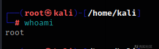

而windows的PATH环境变量在这可以看到

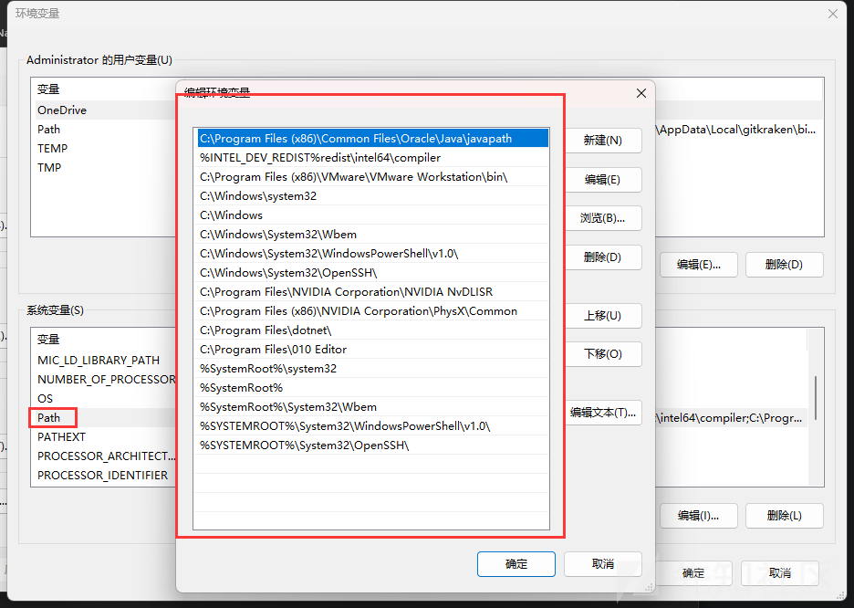

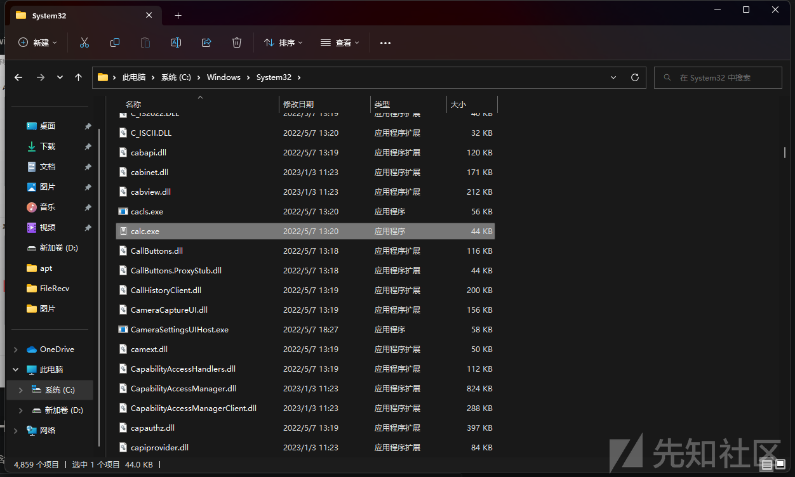

# $HOME

包含了当前用户的主目录

```
echo $HOME
```


# $PWD

包含了当前用户目前所在的目录位置

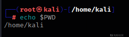

关于环境变量的更多信息：

```
https://en.wikipedia.org/wiki/Environment_variable
```

# 编写程序时调用第三方程序时使用的是相对路径而不是绝对路径会造成什么严重后果

## Windows

在介绍了什么是绝对路径和相对路径，以及什么是环境变量后，现在开始进入主题了，我用上面介绍的windows自带的工具tpmtool.exe来演示

```
tpmtool.exe drivertracing stop
```

上面说过，这条命令的作用是停止收集TPM驱动的程序日志的，我们在cmd里运行这条命令

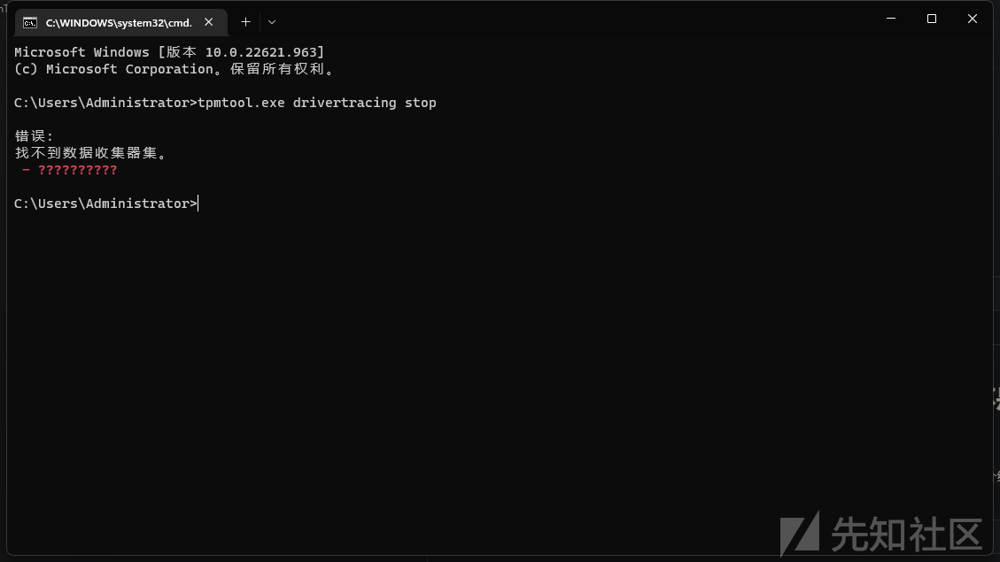

工具弹出错误了，不过并不重要，我们只是拿这个工具做演示，能运行即可接下来我们要用Procmon工具来监视tpmtool.exe这个工具，Procmon工具下载地址：

```
https://learn.microsoft.com/en-us/sysinternals/downloads/procmon
```

双击启动这个工具，点击筛选

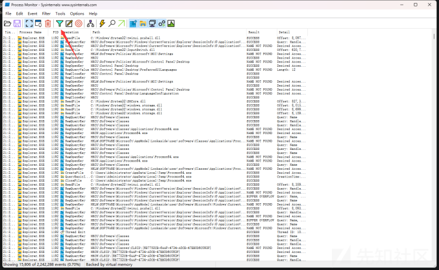

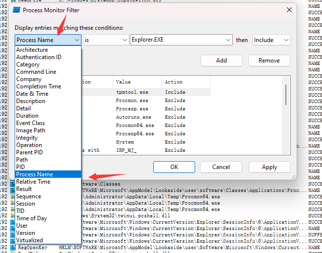

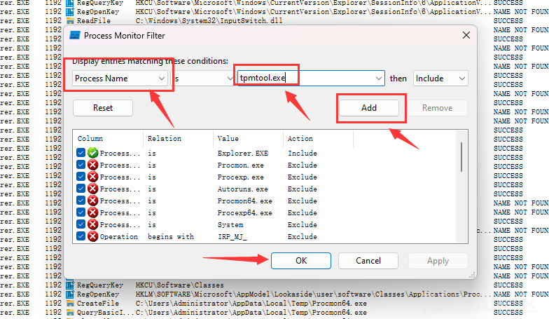

设置完成之后，删除当前监听的内容

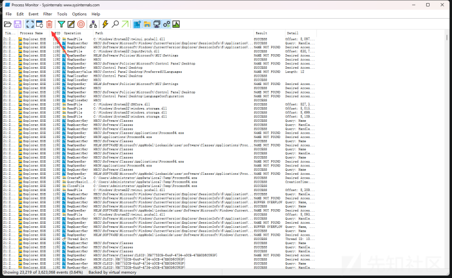

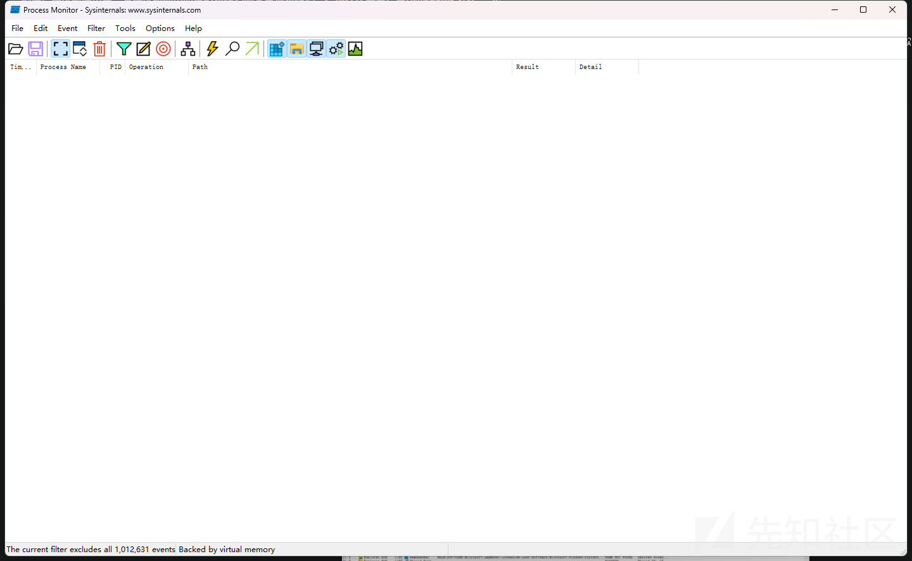

然后回到cmd，重新运行命令

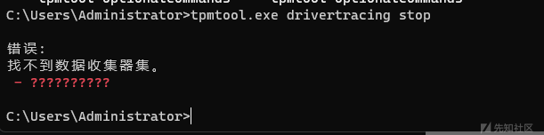

然后返回Procmon，在下面可以看到tpmtool工具的一些奇怪的调用

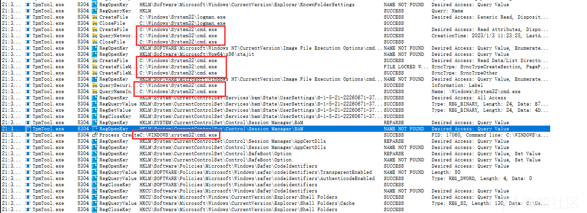

这个工具创建了一个子进程，调用了cmd程序，为了清楚它做了什么，我们将cmd也加入过滤

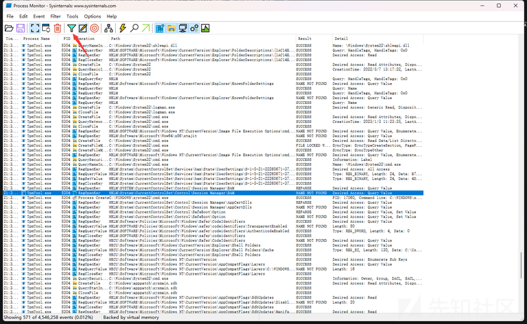

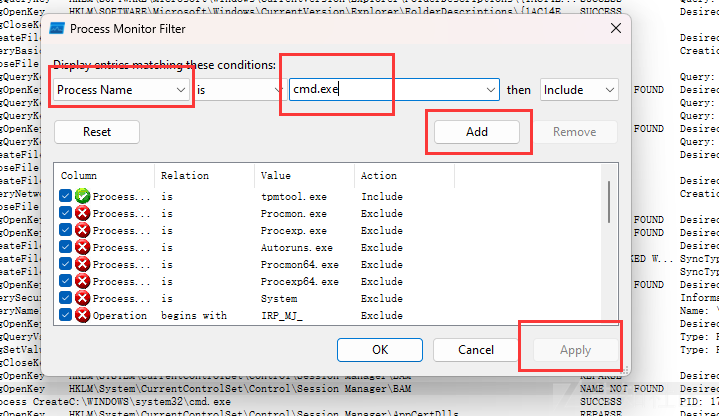

添加完之后在下面可以看到调用

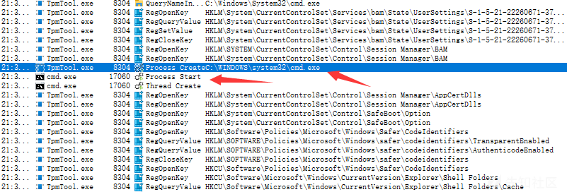

tpmtool创建了一个子进程cmd，然后这个cmd执行了一些命令，但是并没有路径显示，我们双击查看详细信息

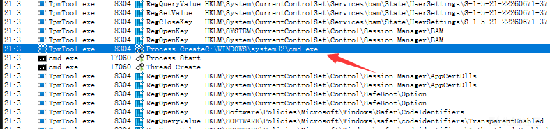

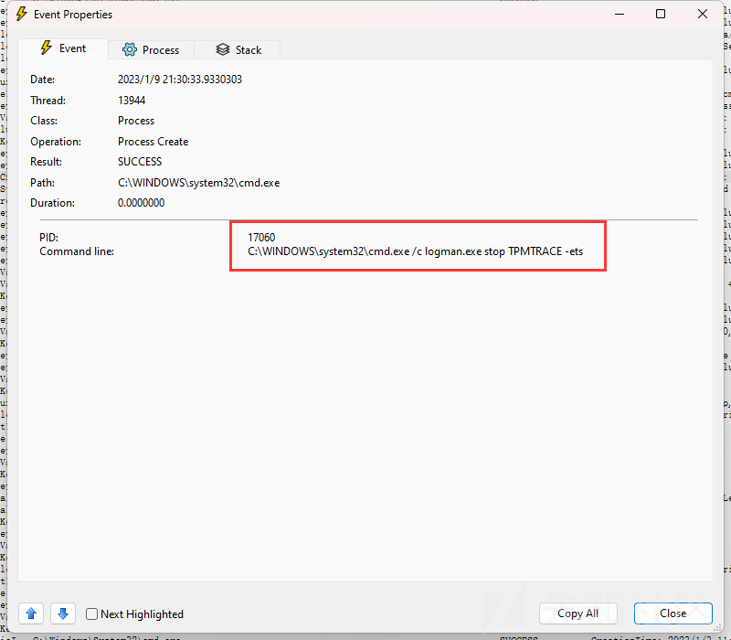

tpmtool工具创建了一个子进程调用cmd，并执行了logman.exe stop TPMTRACE -ets这条命令但是，问题就出在这里，它执行这条命令时并没有指定logman.exe的绝对目录，只是声明了logman.exe

假如我有一个名叫ogman.exe的恶意软件会怎么样

这里我将计算器来当作恶意软件做演示，现在将计算器移动到当前文件夹下

```
copy C:\Windows\System32\calc.exe .
```

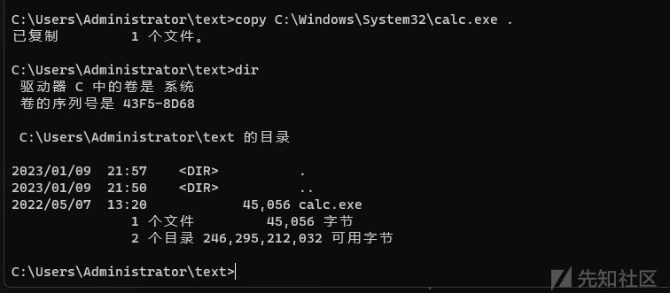

然后将计算器更名为logman.exe，这里我们并不需要改变当前的环境变量，只需要保证logman.exe程序在当前运行目录下即可

```
move calc.exe logman.exe
```

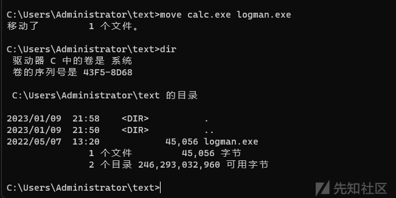

然后运行一开始的命令

```
tpmtool.exe drivertracing stop
```

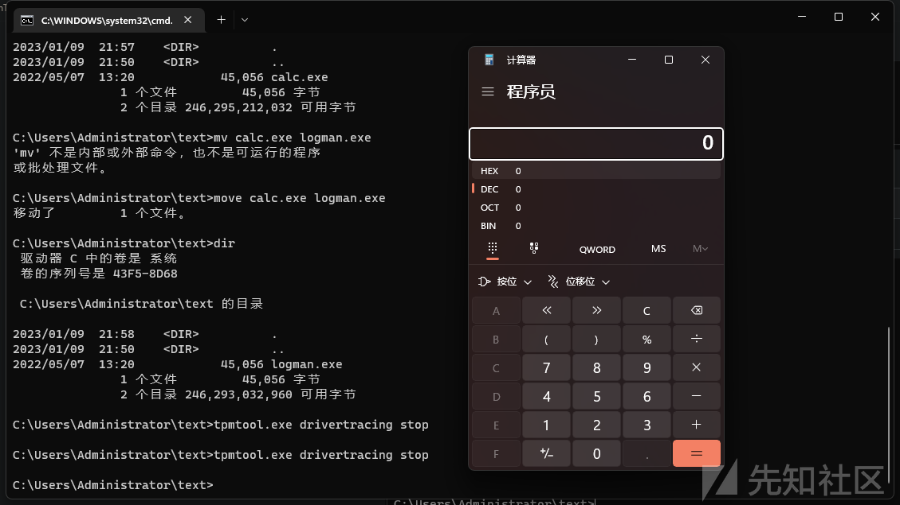

可以看到，成功的弹出了计算器程序

## Linux

在这个目录下有一个c语言的程序

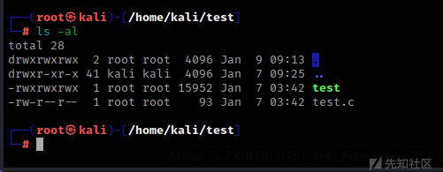

查看源码

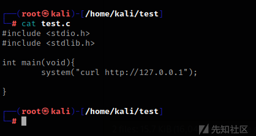

这个程序只是执行了一个系统命令curl，这个工具的作用是获取指定网站的信息

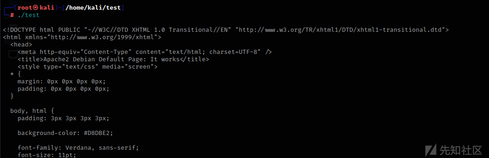

但是和上面windows分析的那个程序一样，没有指定工具的绝对路径

我们在当前文件夹里创建一个名为curl的文件

```
echo "pwd" > curl
chmod +x curl
```

然后改变当前终端的环境变量

```
PATH=$PWD:$PATH
```

$PATH环境变量=当前文件夹

然后执行程序

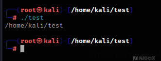

成功执行了pwd程序
