# 实战分析某租房App实现一键解锁个人蓝牙门锁-先知社区

> **来源**: https://xz.aliyun.com/news/16933  
> **文章ID**: 16933

---

# 测试环境

设备：Pixel 3

Android版本：12

面具版本：Magisk Delta 26.4-kitsune(26400)

​

# 一、获取安装包

提取App的安装包

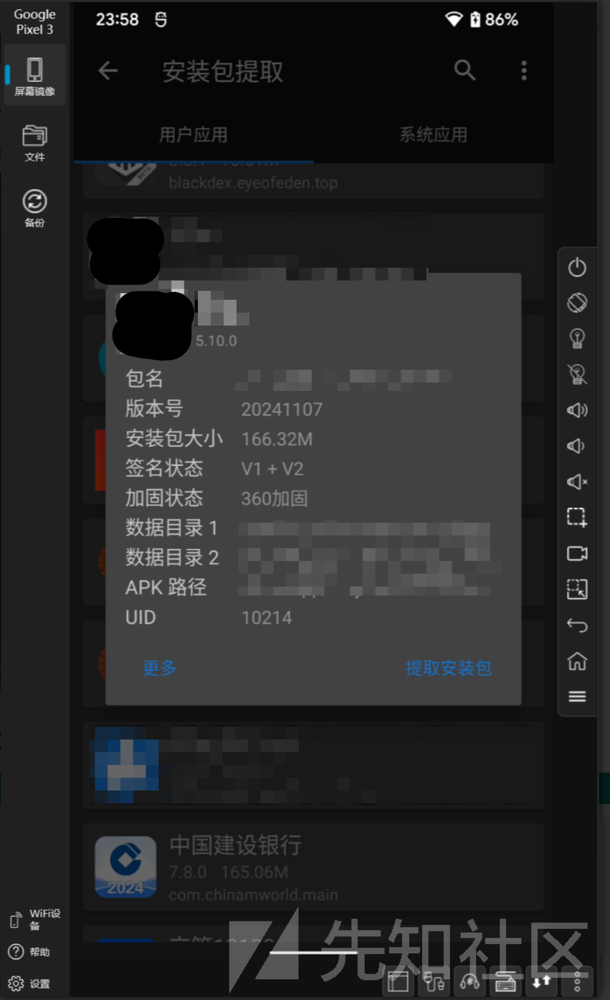

# 二、使用在线网站获取DEX

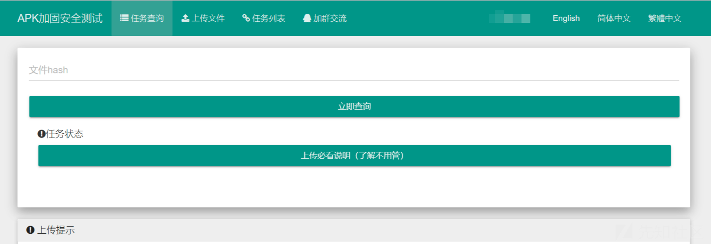

# 三、Jadx-gui分析源码

首先确定好App本身的包位置：

com.xxxx.xxxxxxxxxxxx.application.MyApplication

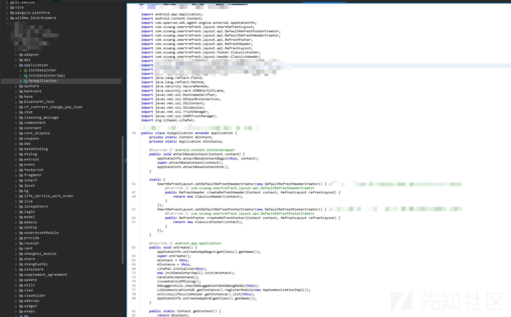

开始分析蓝牙模块：

先看一下手机app蓝牙开锁时的提示词：正在为您开锁，请稍等 | 开锁成功

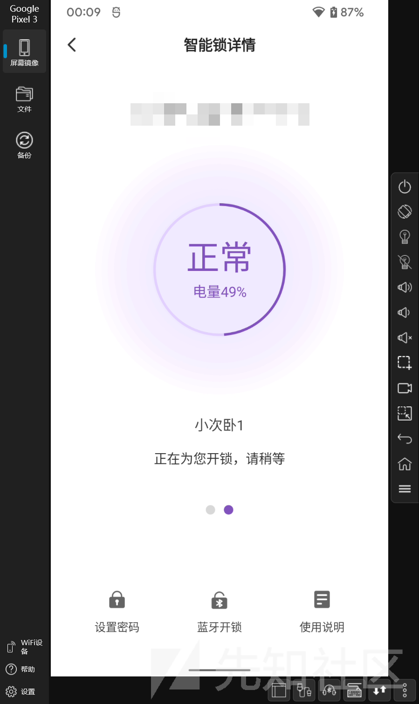

全局搜索 "开锁成功"，选择一条进入（不仅要看右侧代码，也要看左侧代码所属的包，有的是第三方SDK）

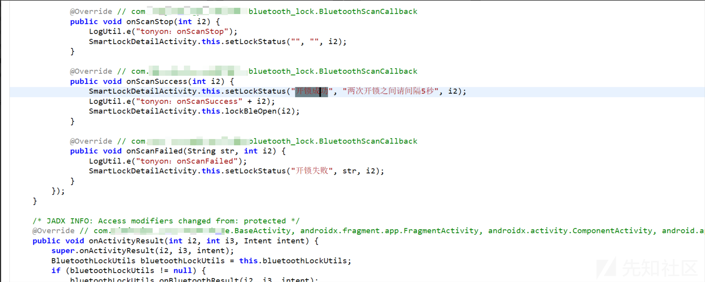

右键查看onScanSuccess的查找用例

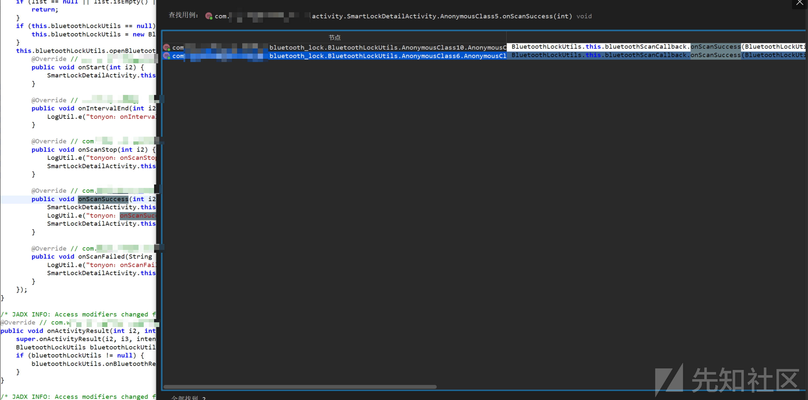

分别查看这两个用例，经过判断可分析的代码为第二个

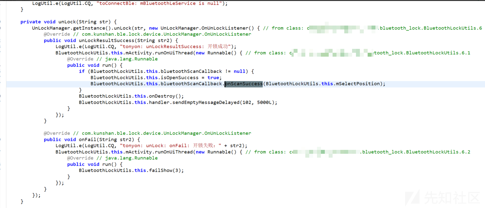

对此代码的unLockResultSuccess函数使用Frida进行hook，点击App上的蓝牙解锁，发现Frida成功Hook到了数据

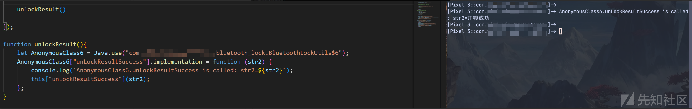

查看此函数的查找用例并进入（不查找用例也可以看此函数代码的重写@Override // com.kunshan.ble.lock.device.UnLockManager.OnUnLockListener）

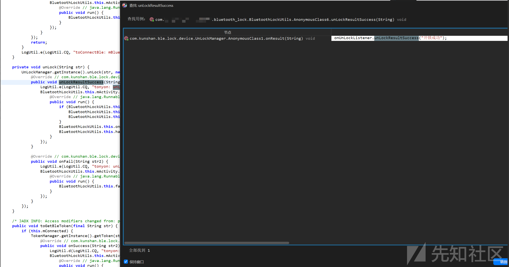

进入用力后可以看到名为unLockResultSuccess的接口，并在此页下面75行找到了此函数的调用

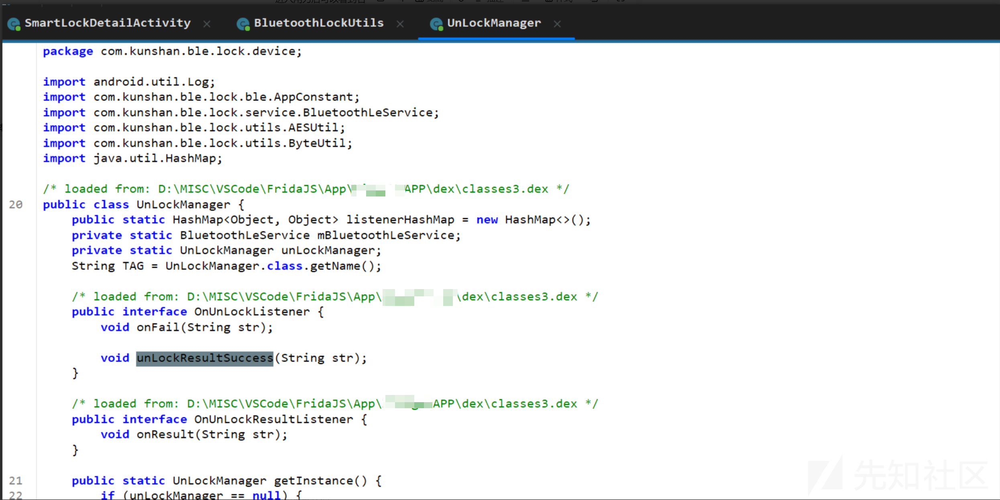

调用处：

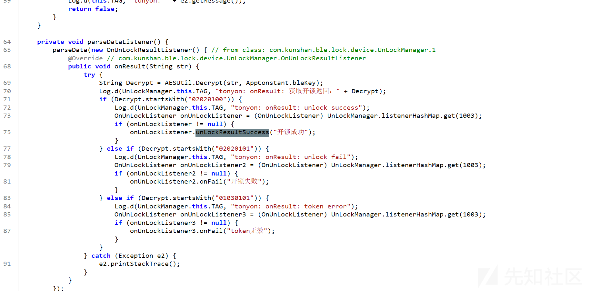

分析此处代码

```
    private void parseDataListener() {
        parseData(new OnUnLockResultListener() { // from class: com.kunshan.ble.lock.device.UnLockManager.1
            @Override // com.kunshan.ble.lock.device.UnLockManager.OnUnLockResultListener
            public void onResult(String str) {
                try {
                    String Decrypt = AESUtil.Decrypt(str, AppConstant.bleKey);
                    Log.d(UnLockManager.this.TAG, "tonyon: onResult: 获取开锁返回：" + Decrypt);
                    if (Decrypt.startsWith("02020100")) {
                        Log.d(UnLockManager.this.TAG, "tonyon: onResult: unlock success");
                        OnUnLockListener onUnLockListener = (OnUnLockListener) UnLockManager.listenerHashMap.get(1003);
                        if (onUnLockListener != null) {
                            onUnLockListener.unLockResultSuccess("开锁成功");
                        }
                    } else if (Decrypt.startsWith("02020101")) {
                        Log.d(UnLockManager.this.TAG, "tonyon: onResult: unlock fail");
                        OnUnLockListener onUnLockListener2 = (OnUnLockListener) UnLockManager.listenerHashMap.get(1003);
                        if (onUnLockListener2 != null) {
                            onUnLockListener2.onFail("开锁失败");
                        }
                    } else if (Decrypt.startsWith("01030101")) {
                        Log.d(UnLockManager.this.TAG, "tonyon: onResult: token error");
                        OnUnLockListener onUnLockListener3 = (OnUnLockListener) UnLockManager.listenerHashMap.get(1003);
                        if (onUnLockListener3 != null) {
                            onUnLockListener3.onFail("token无效");
                        }
                    }
                } catch (Exception e2) {
                    e2.printStackTrace();
                }
            }
        });
    }

```

就可以发现已经找到了此App调用蓝牙解锁门锁的重要地方

下图为使用frida来hook函数onResult的调用，发现是可以Hook到的

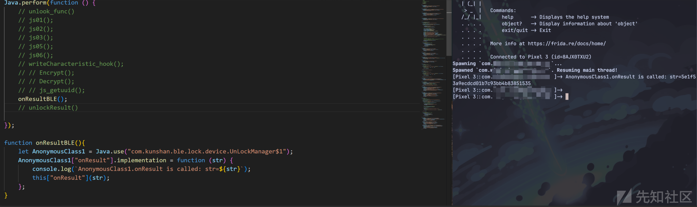

现在我们要找到蓝牙门锁的密钥

上述的代码中有一段关于AES解密的代码：

```
String Decrypt = AESUtil.Decrypt(str, AppConstant.bleKey);
```

我们可以直接hook函数AESUtil.Decrypt，然后打印函数的参数即可：

```
function Decrypt(){
    let AESUtil = Java.use("com.kunshan.ble.lock.utils.AESUtil");
    AESUtil["Decrypt"].implementation = function (str, str2) {
        console.log(`AESUtil.Decrypt is called: str=${str}, str2=${str2}`);
        let result = this["Decrypt"](str, str2);
        console.log(`AESUtil.Decrypt result=${result}`);
        return result;
    };
}

```

可以看到str2参数，也就是门锁的蓝牙密钥已经被打印出来了

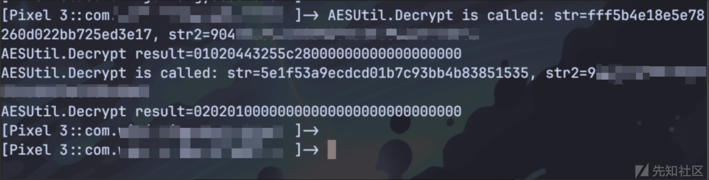

现在我们有了蓝牙密钥，然后开始要分析蓝牙门锁的解锁过程

首先确认App向蓝牙门锁发送了什么数据，从上文代码分析看来，发送的数据包应该是经过AES加密后的数据，参数Key就是我们上文找到的蓝牙密钥，经过这样分析，我们可以从AESUtil.Encrypt()函数入手，使用frida对AESUtil.Encrypt()函数进行hook：

```
function Encrypt(){
    let AESUtil = Java.use("com.kunshan.ble.lock.utils.AESUtil");
    AESUtil["Encrypt"].implementation = function (str, str2) {
        console.log(`AESUtil.Encrypt is called: str=${str}, str2=${str2}`);
        let result = this["Encrypt"](str, str2);
        console.log(`AESUtil.Encrypt result=${result}`);
        return result;
    };
}
```

frida的hook结果如下：

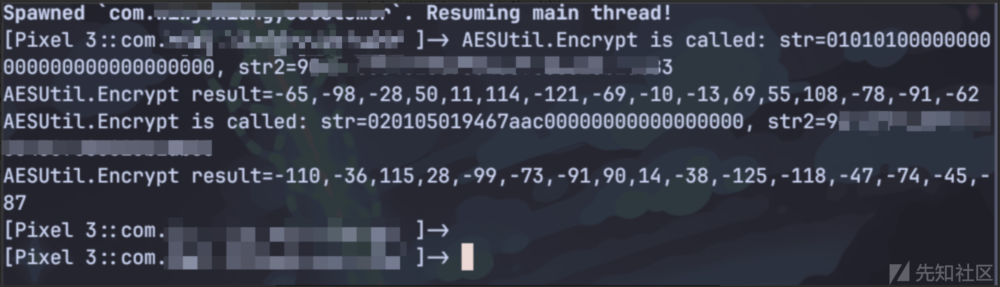

​

这里两次调用了蓝牙密钥，推测应该是App向蓝牙门锁发送了两次数据：

**App向蓝牙门锁发送了两次数据，App有一个初始字符串，使用蓝牙密钥进行AES加密后发送给门锁，门锁接收到数据后返回App一个加密后的数据，App收到加密数据后进行AES解密，再对解密后的数据进行操作，再进行AES加密后发送给蓝牙门锁，蓝牙门锁接收到数据后成功开锁**

​

既然知道了大概流程，然后我们就尝试使用frida将AESUtil.Decrypt与AESUtil.Encrypt一起进行hook得到以下数据：

```
AESUtil.Encrypt is called: str=01010100000000000000000000000000, str2=9xxxxxxxxxxxxxxxxxxxxxxxxxxxxxxx
AESUtil.Encrypt result=-65,-98,-28,50,11,114,-121,-69,-10,-13,69,55,108,-78,-91,-62
AESUtil.Decrypt is called: str=51e4ca8750e5fd0e52138deac4a0537c, str2=9xxxxxxxxxxxxxxxxxxxxxxxxxxxxxxx
AESUtil.Decrypt result=01020469b0bff7000000000000000000
AESUtil.Encrypt is called: str=0201050169b0bff70000000000000000, str2=9xxxxxxxxxxxxxxxxxxxxxxxxxxxxxxx
AESUtil.Encrypt result=-98,-30,103,-21,-35,-69,-57,-108,82,100,6,-78,-59,28,31,107
AESUtil.Decrypt is called: str=5e1f53a9ecdcd01b7c93bb4b83851535, str2=9xxxxxxxxxxxxxxxxxxxxxxxxxxxxxxx
AESUtil.Decrypt result=02020100000000000000000000000000
```

这里的result数据进行bytesToHexString一下：

```
function bytesToHexString(bytes) {
    return Array.from(bytes, byte => 
        byte.toString(16).padStart(2, '0')
    ).join('');
}

const bytes = new Uint8Array([-65,-98,-28,50,11,114,-121,-69,-10,-13,69,55,108,-78,-91,-62]);
const hexString = bytesToHexString(bytes);
console.log(hexString); 
```

```
AESUtil.Encrypt is called: str=01010100000000000000000000000000, str2=9xxxxxxxxxxxxxxxxxxxxxxxxxxxxxxx
AESUtil.Encrypt result=bf9ee4320b7287bbf6f345376cb2a5c2
AESUtil.Decrypt is called: str=51e4ca8750e5fd0e52138deac4a0537c, str2=90xxxxxxxxxxxxxxxxxxxxxxxxxxxxxxx
AESUtil.Decrypt result=01020469b0bff7000000000000000000
AESUtil.Encrypt is called: str=0201050169b0bff70000000000000000, str2=9xxxxxxxxxxxxxxxxxxxxxxxxxxxxxxx
AESUtil.Encrypt result=9ee267ebddbbc794526406b2c51c1f6b
AESUtil.Decrypt is called: str=5e1f53a9ecdcd01b7c93bb4b83851535, str2=9xxxxxxxxxxxxxxxxxxxxxxxxxxxxxxx
AESUtil.Decrypt result=02020100000000000000000000000000
```

经过分析得到：

**App的初始字符串为"01010100000000000000000000000000"，经过AES加密将数据发送给蓝牙门锁，蓝牙门锁收到后返回一个加密数据，App对加密数据进行解密，然后截取解密后字符串的第7位至14位共8位，然后将这8位数据进行填充，02010501+8位数据+0000000000000000，将此数据进行AES加密后发送给蓝牙门锁，成功解锁**

根据hook到的数据，可以验证我们上文的推理即：

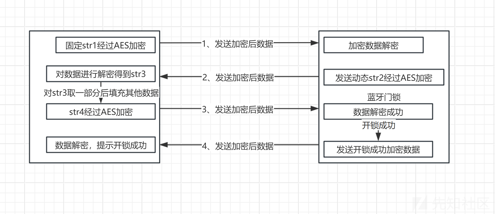

# 四、蓝牙调试

根据上文分析，App发送给蓝牙门锁的第一个加密数据是固定的，那么我们可以使用蓝牙调试助手进行发送数据，看看蓝牙门锁是否能返回数据：

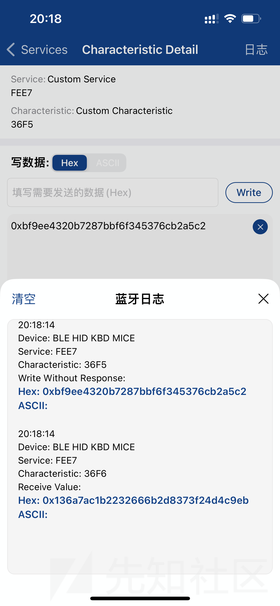

成功接收到了蓝牙门锁返回的数据，证明上述分析方向是对的

现在已经有了蓝牙密钥，蓝牙门锁开锁的通信过程，那么我们可以写一个脚本来调用本地的蓝牙模块，然后执行我们写好的脚本即可

但是我们如何调用手机的蓝牙模块呢，我选择的是AutoJS这个应用，地址为<https://github.com/SuperMonster003/AutoJs6>

但是AutoJS应用本身的Androidmanifest.xml是没有申请手机蓝牙权限的，所以我们想要用这个软件调用蓝牙模块就要重新编译AutoJS应用，在Androidmanifest.xml里假如以下代码：

```
    <!-- 与蓝牙设备配对 -->
    <uses-permission android:name="android.permission.BLUETOOTH" />
    <!-- 访问蓝牙设置 -->
    <uses-permission android:name="android.permission.BLUETOOTH_ADMIN" />
    <!-- 向附近的蓝牙设备广播 -->
    <uses-permission android:name="android.permission.BLUETOOTH_ADVERTISE" />
    <!-- 连接到已配对的蓝牙设备 -->
    <uses-permission android:name="android.permission.BLUETOOTH_CONNECT" />
    <!-- 发现附近的蓝牙设备并与其配对 -->
    <uses-permission android:name="android.permission.BLUETOOTH_SCAN" />
```

（补充一下：蓝牙发送的数据涉及AES加密解密，想看源码可以直接在jadx里查看，使用AI将App里实现的AES加解密用JS代码写出来）

在AutoJS里编写脚本：

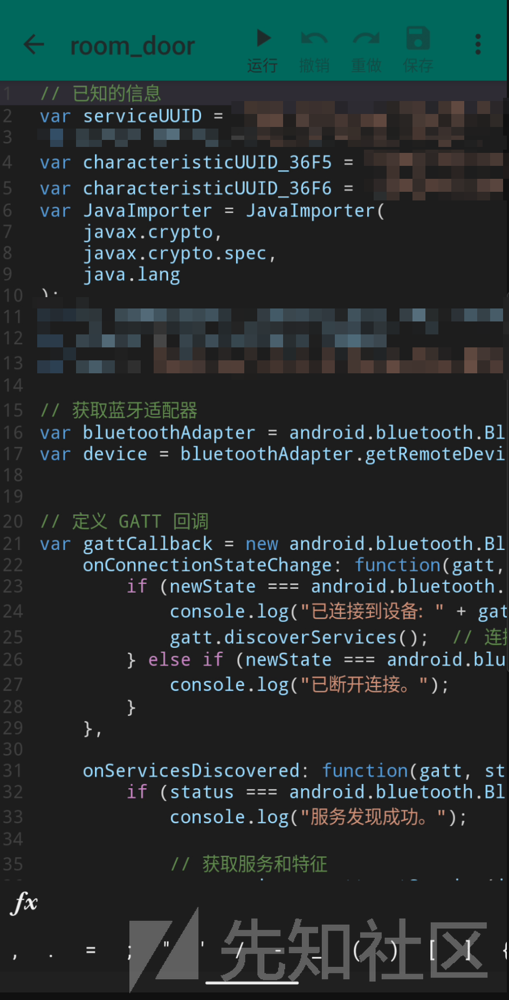

代码如下：

（代码中提供了蓝牙通信必需的一些代码，部分内容需要自己填写）

1、获取蓝牙适配器

2、定义 GATT 回调

3、接收到特征数据变化时调用的回调

4、创建 Java 字节数组、将字节数组转换为十六进制字符串、将十六进制字符串转换为字节数组

5、向设备的特征写入数据

```
// 已知的信息
var serviceUUID = "0000FEE7-xxxxxxxxxxxxxxxxxxxxxxxxxxx";
var deviceAddress = "门锁deviceAddres";
var characteristicUUID_36F5 = "000036F5-xxxxxxxxxxxxxxxxxxxxxxxxxxx";  // 写特征
var characteristicUUID_36F6 = "000036F6-xxxxxxxxxxxxxxxxxxxxxxxxxxx";  // 读特征
var JavaImporter = JavaImporter(
    javax.crypto,
    javax.crypto.spec,
    java.lang
);
var SecretKeySpec = javax.crypto.spec.SecretKeySpec;
var Cipher = javax.crypto.Cipher;
var key = ""; // 替换为实际的密钥

// 获取蓝牙适配器
var bluetoothAdapter = android.bluetooth.BluetoothAdapter.getDefaultAdapter();
var device = bluetoothAdapter.getRemoteDevice(deviceAddress);


// 定义 GATT 回调
var gattCallback = new android.bluetooth.BluetoothGattCallback({
    onConnectionStateChange: function(gatt, status, newState) {
        if (newState === android.bluetooth.BluetoothProfile.STATE_CONNECTED) {
            console.log("已连接到设备: " + gatt.getDevice().getAddress());
            gatt.discoverServices();  // 连接成功后开始发现服务
        } else if (newState === android.bluetooth.BluetoothProfile.STATE_DISCONNECTED) {
            console.log("已断开连接。");
        }
    },

    onServicesDiscovered: function(gatt, status) {
        if (status === android.bluetooth.BluetoothGatt.GATT_SUCCESS) {
            console.log("服务发现成功。");

            // 获取服务和特征
            var service = gatt.getService(java.util.UUID.fromString(serviceUUID));
            if (service) {
                console.log("发现服务: " + serviceUUID);

                // 获取特征
                var characteristicRead = service.getCharacteristic(java.util.UUID.fromString(characteristicUUID_36F6));

                // 获取接收特征并启用通知
                var readCharacteristic = characteristicRead;
                if (!readCharacteristic) {
                    console.log("没有找到接收特征！");
                    return;
                }

                // 启用通知
                if (gatt.setCharacteristicNotification(readCharacteristic, true)) {
                    console.log("已启用通知。");

                    // 获取 CLIENT_CHARACTERISTIC_CONFIGURATION 描述符
                    var descriptor = readCharacteristic.getDescriptor(java.util.UUID.fromString("00002902-xxxxxxxxxxxxxxxxxxxxxxxxxx"));
                    if (descriptor) {
                        console.log("描述符已找到: " + descriptor.getUuid().toString());

                        // 配置描述符以启用通知
                        descriptor.setValue(android.bluetooth.BluetoothGattDescriptor.ENABLE_NOTIFICATION_VALUE);
                        gatt.writeDescriptor(descriptor);
                        console.log("已配置描述符以启用通知。");
                    } else {
                        console.log("特征 " + readCharacteristic.getUuid().toString() + " 不包含 CLIENT_CHARACTERISTIC_CONFIGURATION 描述符。");
                    }
                } else {
                    console.log("无法启用通知。");
                }
            } else {
                console.log("未找到服务: " + serviceUUID);
            } 
        } else {
            console.log("服务发现失败，状态: " + status);
        }
    },
    // 接收到特征数据变化时调用的回调
    onCharacteristicChanged: function(gatt, characteristic) {
        console.log("触发 onCharacteristicChanged: " + characteristic.getUuid().toString() );
        console.log("Value: " + characteristic.getValue())
        console.log("接收到数据：" + byteArrayToHexString(characteristic.getValue()));
        var decrypt_data = decrypt(byteArrayToHexString(characteristic.getValue()), key)
        console.log(decrypt_data);
        var subStr = decrypt_data.substring(6, 14);
        var encrypt_plaintext = "02010501" + subStr + "0000000000000000"
        var encrypt_data = encrypt(encrypt_plaintext, key);
        console.log(encrypt_data);
        var service = gatt.getService(java.util.UUID.fromString(serviceUUID));
        var characteristicWrite = service.getCharacteristic(java.util.UUID.fromString(characteristicUUID_36F5));
        if (encrypt_data != null){
            if (characteristicWrite) {
                console.log("发现写特征: " + characteristicUUID_36F5);
                // 向设备写入数据
                var data = hexStringToByteArray_t(encrypt_data);
                writeData(gatt, characteristicWrite, data);
            }
        }
    },
    onDescriptorWrite: function(gatt, descriptor, status) {
        if (status == android.bluetooth.BluetoothGatt.GATT_SUCCESS) {
            console.log("描述符写入成功: " + descriptor.getUuid().toString());
            var service = gatt.getService(java.util.UUID.fromString(serviceUUID));
            var characteristicWrite = service.getCharacteristic(java.util.UUID.fromString(characteristicUUID_36F5));
            if (characteristicWrite) {
                console.log("发现写特征: " + characteristicUUID_36F5);
                // 向设备写入数据
                var data = "你的第一次加密后的数据bytes格式";
                writeData(gatt, characteristicWrite, data);
            }
        } else {
            console.log("描述符写入失败，状态: " + status);
        }
    }
});

// 创建 Java 字节数组
function createJavaByteArray(jsArray) {
    var byteArray = java.lang.reflect.Array.newInstance(java.lang.Byte.TYPE, jsArray.length);
    for (var i = 0; i < jsArray.length; i++) {
        byteArray[i] = jsArray[i];
    }
    return byteArray;
}

// 向设备的特征写入数据
function writeData(gatt, characteristic, data) {
    // 创建 ByteBuffer 并写入数据
    var buffer = java.nio.ByteBuffer.allocate(data.length);
    for (var i = 0; i < data.length; i++) {
        var value = data[i];
        if (value > 127) {
            value = value - 256; // 转换为 Java byte 的有符号表示
        }
        buffer.put(value);
    }
    var javaByteArray = buffer.array();
    console.log(javaByteArray)
    characteristic.setValue(javaByteArray);
    if (gatt.writeCharacteristic(characteristic)) {
        console.log("数据已写入设备");
    } else {
        console.log("写入数据失败");
    }
}

// 将字节数组转换为16进制字符串
function byteArrayToHexString(byteArray) {
    var hexString = "";
    for (var i = 0; i < byteArray.length; i++) {
        var hex = ((byteArray[i] & 0xFF) >>> 0).toString(16);
        hexString += (hex.length === 1 ? '0' : '') + hex;
    }
    return hexString.toUpperCase();
}

// 辅助函数：将十六进制字符串转换为字节数组
function hexStringToByteArray(hexString) {
    var bytes = new java.lang.reflect.Array.newInstance(java.lang.Byte.TYPE, hexString.length / 2);
    for (var i = 0; i < hexString.length; i += 2) {
        var byteValue = parseInt(hexString.substr(i, 2), 16);
        if (byteValue > 127) {
            byteValue -= 256; // 转换为Java字节的有符号表示
        }
        bytes[i / 2] = byteValue;
    }
    return bytes;
}

function hexStringToByteArray_t(hexString) {
    var byteArray = [];
    for (var i = 0; i < hexString.length; i += 2) {
        var byte = parseInt(hexString.substr(i, 2), 16);
        byteArray.push(byte);
    }
    return byteArray;
}

// 辅助函数：将字节数组转换为十六进制字符串
function bytesToHexString(byteArray) {
    var hexString = '';
    for (var i = 0; i < byteArray.length; i++) {
        var hex = (byteArray[i] & 0xFF).toString(16);
        if (hex.length == 1) {
            hex = '0' + hex;
        }
        hexString += hex;
    }
    return hexString;
}

// 解密函数
function decrypt(encryptedHex, keyHex) {
    //将代码中的AES解密代码转换为JS代码
}

// 加密函数
function encrypt(plaintextHexString, keyHexString) {
    //将代码中的AES加密代码转换为JS代码
}

var gatt = device.connectGatt(context, false, gattCallback);

// 保持程序运行
var isRunning = true;
setTimeout(function() {
    isRunning = false;
}, 10000); // 10秒后停止程序

while (isRunning) {
    sleep(1000);  // 每秒检查一次
}
```

使用脚本成功打开门锁，脚本可以在桌面创捷快捷图标，点击即可解锁蓝牙门锁

​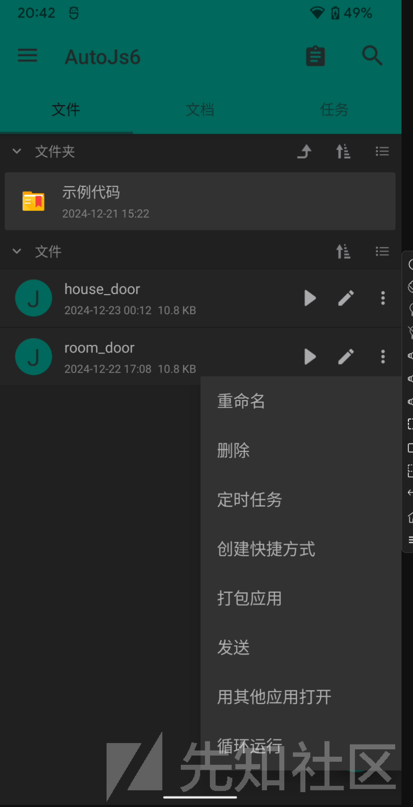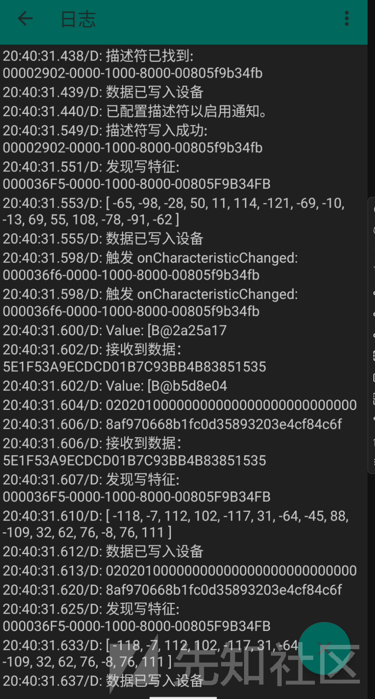

声明：**请勿利用文章内的相关技术从事非法测试，由于传播、利用此文所提供的信息而造成的任何直接或者间接的后果及损失，均由使用者本人负责，文章作者不为此承担任何责任。合法测试，本文章内容纯属虚构，如遇巧合，纯属意外**
