# VxWorks设备分析与漏洞挖掘-先知社区

> **来源**: https://xz.aliyun.com/news/16936  
> **文章ID**: 16936

---

## 1.前言

笔者最近研究作为实时操作系统Vxworks，Vxworks不仅搭载在一些工控系统上，也搭载在路由器上的，所以就以路由器的挖掘描述Vxworks在怎么样去分析挖掘，本文以TPLink。

## 2.固件获取

通过TPlink官网获取固件  
`https://resource.tp-link.com.cn/`  
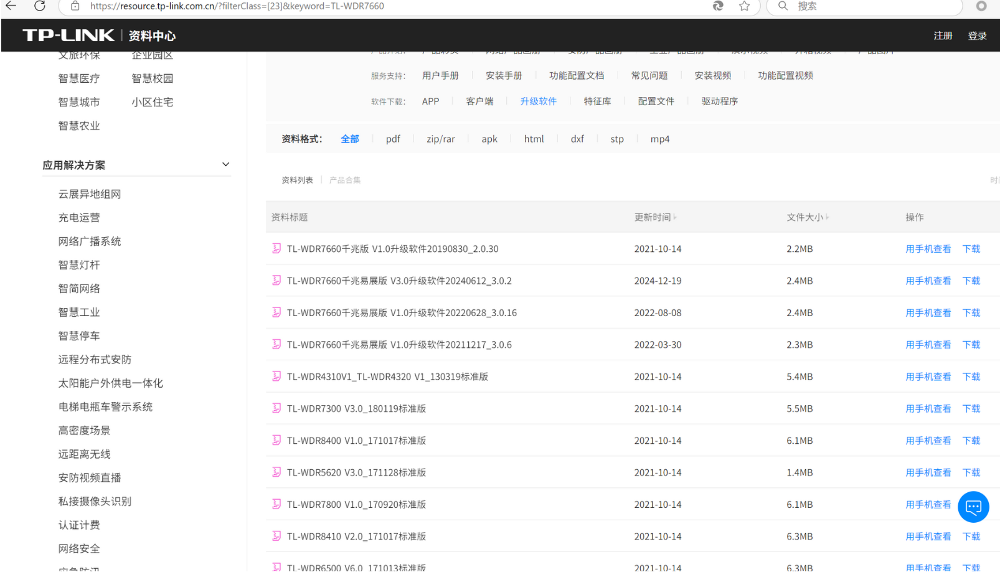

以TL-WDR7660路由器2.0.30版本固件进行分析,从官网获取相关固件

`https://service.tp-link.com.cn/download/20207/TL-WDR7660%E5%8D%83%E5%85%86%E7%89%88%20V1.0%E5%8D%87%E7%BA%A7%E8%BD%AF%E4%BB%B620190830_2.0.30.zip?forcedownload=TL-  
WDR7660%E5%8D%83%E5%85%86%E7%89%88%20V1.0%E5%8D%87%E7%BA%A7%E8%BD%AF%E4%BB%B620190830_2.0.30.zip`  
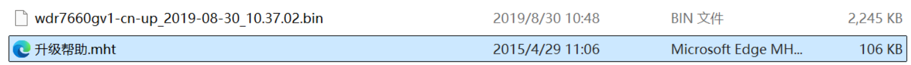

## 3.固件分析

直接使用binwalk解包发现，没用看到完整的文件系统，这也是VxWorks路由器与大部分路由器的区别，分析Vxworks固件关键在于Vxworks系统映像

### 3.1 VxWork固件特征

对未解压的原始固件进行搜索可以看到其文件系统相关标识 `MINIFS`  
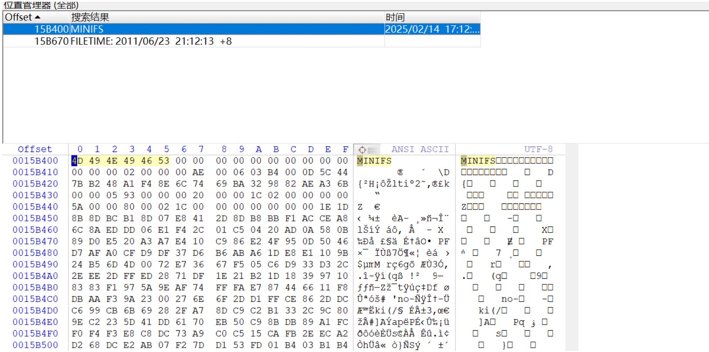

### 3.2 VxWorks系统映像概述及引导启动过程

#### 3.2.1 VxWork系统映像分类

VxWorks系统映像根据功能与存储方式可分为两大类别：  
1.BootRom类型  
功能：作为最小化引导程序，类似PC的BIOS，负责硬件初始化及VxWorks主系统加载  
子类型  
**BootRom\_res**：仅数据段拷贝至RAM，代码段驻留ROM运行  
**BootRom\_uncmp**：非压缩映像，代码段与数据段均拷贝至RAM运行  
**BootRom**：压缩格式映像，需在RAM中解压后执行

#### 3.2.2 VxWorks主系统类型

主系统映像是最终运行的完整操作系统，根据存储与执行方式分为：  
**可加载映像**：需通过BootRom从网络/存储设备加载至RAM运行（如RAM\_LOW\_ADRS地址），开发调试阶段常用  
**ROM驻留映像**：代码段固化在ROM中运行，仅数据段加载至RAM，节省内存但牺牲执行效率  
**ROM压缩映像**：压缩后存储于ROM，启动时解压至RAM运行，兼顾存储空间与执行性能

#### 3.2.3 引导启动过程

VxWorks启动流程分为硬件初始化、代码迁移、内核激活三个阶段，具体过程如下：  
**1. Bootstrap硬件初始化阶段**  
**上电复位**：CPU从固定地址（如ARM的0x00000000或MIPS的0xBFC00000）执行指令，关闭中断、看门狗和Cache，初始化存储控制器  
执行romInit()：汇编代码完成处理器寄存器初始化，设置堆栈指针，区分冷/热启动参数。  
**2. 代码迁移阶段**  
调用romStart()：根据映像类型执行不同操作：  
**非压缩映像**：将代码段和数据段从ROM/Flash拷贝至RAM（如RAM\_HIGH\_ADRS）。  
**压缩映像**：解压代码至RAM后跳转执行。  
**内存初始化**：冷启动时清零BSS段及用户保留内存区域]。  
**3. 内核激活阶段**  
**执行sysInit()**：汇编代码关闭硬件设备，创建单任务环境，跳转至首个C函数usrInit()。  
**调用usrInit()**：初始化内核数据结构，激活多任务环境，启动根任务usrRoot()。  
**usrRoot()任务**：完成核心初始化：  
硬件驱动初始化（如网络、存储设备）  
文件系统挂载（如TFFS）  
创建系统任务（如网络服务、FTP守护进程）

#### 3.2.3 VxWorks标准引导流程

Bootstrap硬件初始化 → BootRom加载内核 → VxWorks内核启动，其中Bootloader（BootRom）承担核心的硬件准备与内核加载职责。若需结合U-Boot等外部引导程序，需针对硬件平台定制适配。

### 3.3 文件系统提取

以TPLink的路由器为例子，我们先通过binwalk识别架构为ARM，识别uImmage和LZMA压缩数据，前面为uboot，在uImage header中，有一个表示引导加载程序（uBoot）的入口地址字段，即Entry Point，我们可以根据这个入口地址提取出uBoot程序，后面可能为文件系统  
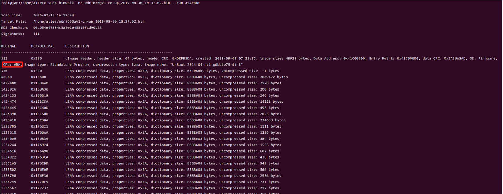  
如上图，Uboot程序长度一般为uImage header的长度加后面的LZMA数据长度，从中看到开始为512，紧接着为66560,那么Uboot程序就为 uImage header的起始位置 = 66560-512 = 66048  
`dd if=wdr7660gv1-cn-up_2019-08-30_10.37.02.bin of=uboot.raw bs=1 skip=512 count=66048`  
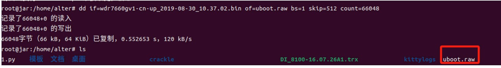  
一般来说Uboot下面LZMA最大就为主程序位置，所以还是用dd提取  
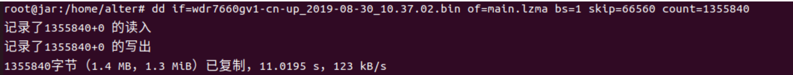  
接下来使用lzma解压该程序包  
`lzma -d main.lzma`   


#### 3.3.1 加载地址确定

第一个方法是**通过MyFirmware指纹找加载地址**，部分flash存在该字符，定位该字符往前找上段末尾，一般上个段末尾会使用0xFF或0x00补齐。当前段开头偏移0x18处的两个4字节就是VxWorks系统映像的加载地址0x40205000  
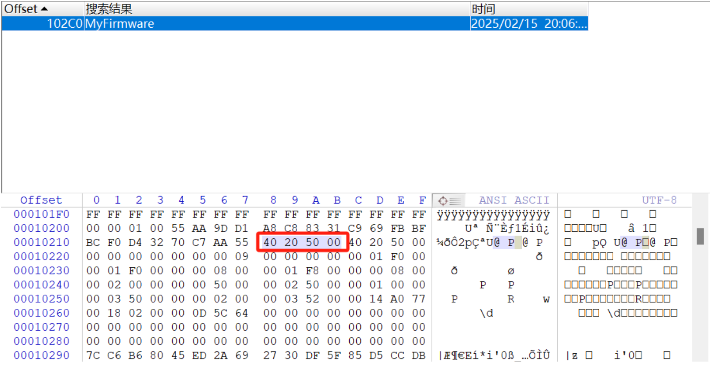  
第二个方法是**分析固件头部初始化代码，寻找加载地址特征**  
由前面知道为ARM架构，现在查看到该固件为小端拉入IDA选择进行分析  
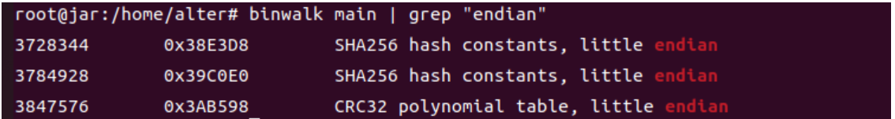  
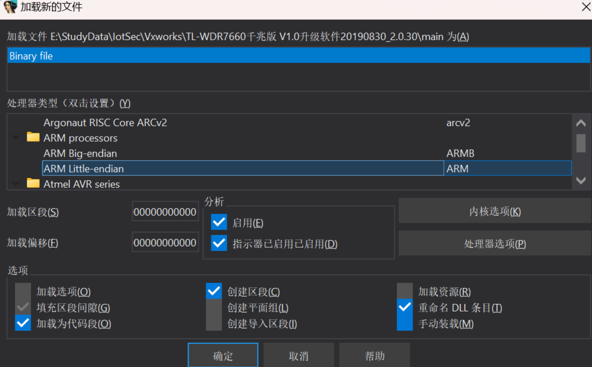  
默认进入IDA开头查看代码  
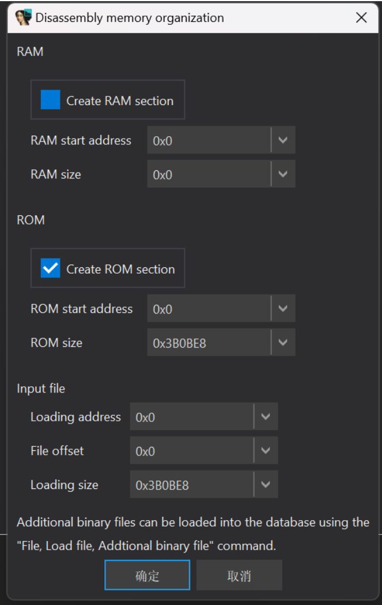  
接下来看下开头代码，由上述Vxworks的引导启动过程可知道R0加载的值为Vxworks程序启动流程  
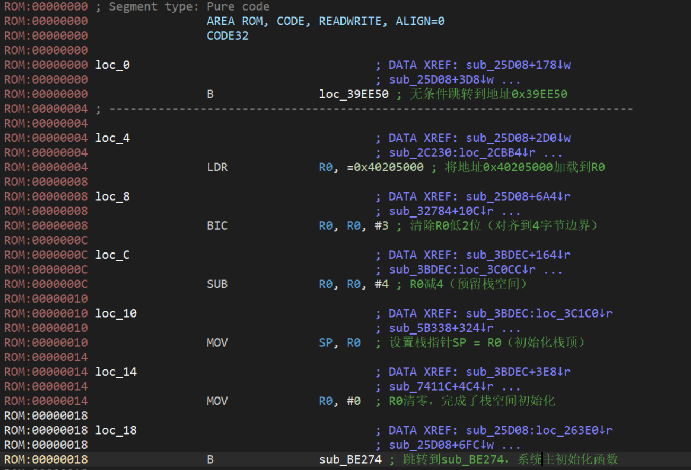  
为什么R0加载地址为启动地址，对照Vxworks的官方文档以及上下图得知综合栈初始化、跳转指令特征及VxWorks启动流程，sub\_BE274极大概率对应usrInit()函数入口，符合sysInit() → usrInit()的标准启动序列，  
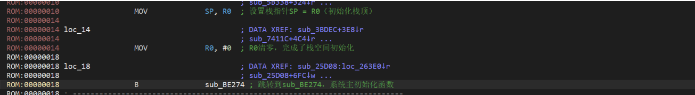

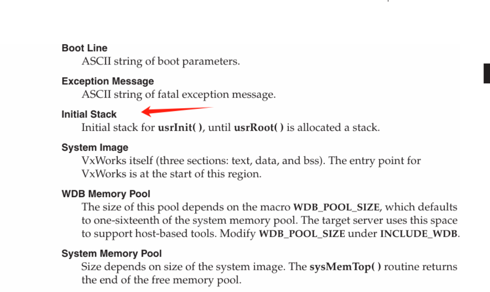

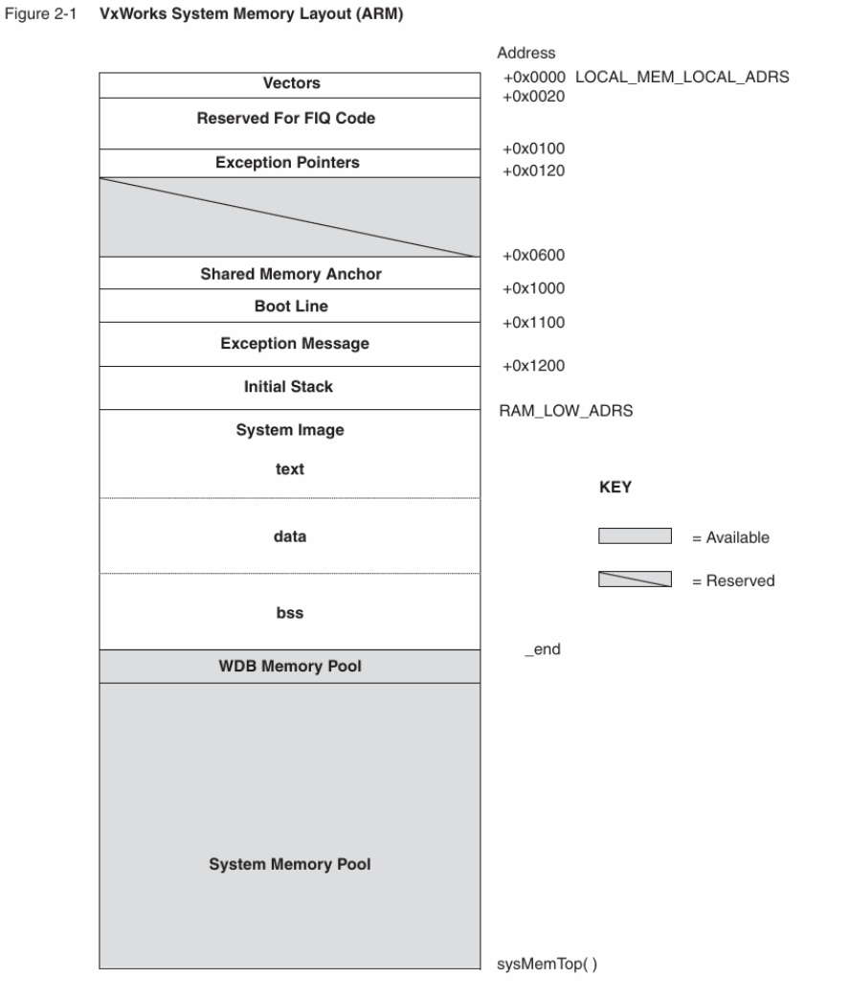  
找到地址后重新导入  
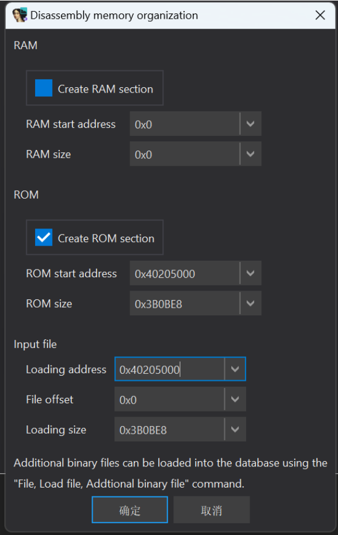

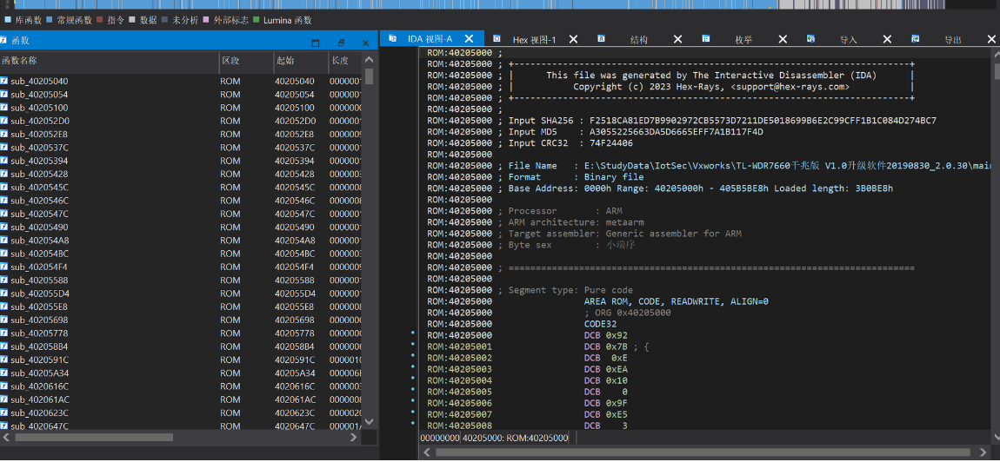

### 3.4 字符表修复

为了能识别函数和调用关系，我们需要利用符号表中的内容来修复IDA中显示的函数名  
这里推荐一个大佬的项目vxhunter

```
https://github.com/PAGalaxyLab/vxhunter
https://github.com/0xba1100n/VxhunterIDAForkForPython3HighVersion
```

首先我们要从binwalk解压文件中寻找符号文件，bzero函数会对bss区的数据进行启动过程清零，我们可以利用该函数查找符号表文件  
 `grep -r bzero .`  
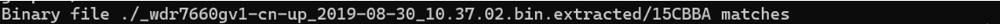  
使用vxhunter将其导入文件系统  
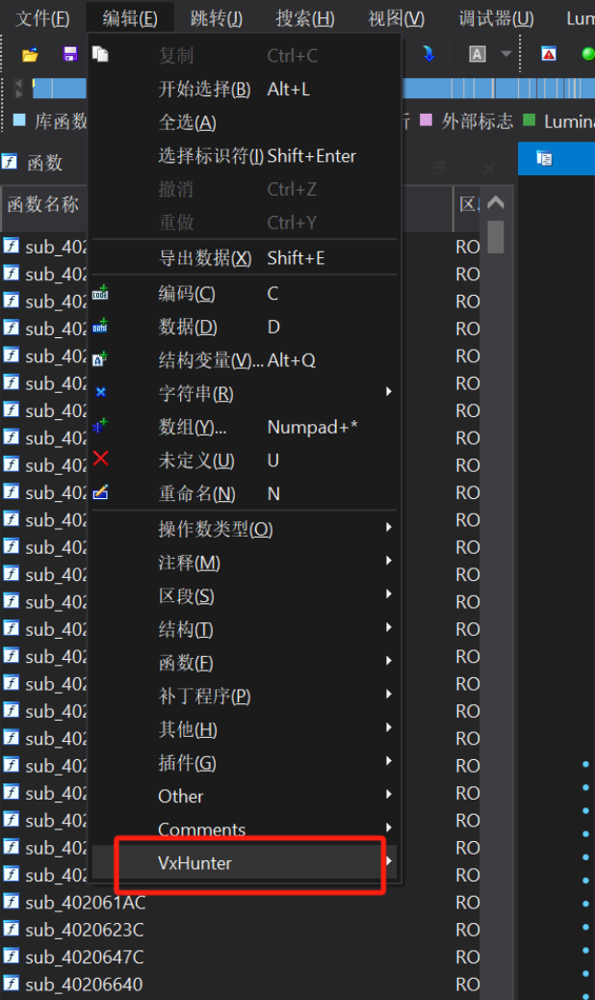  
第二种，我们可以直接分析符号表的结构来来修复，可以看到开头为文件大小00051B29，后面000034E4为数量，以8比特排列  
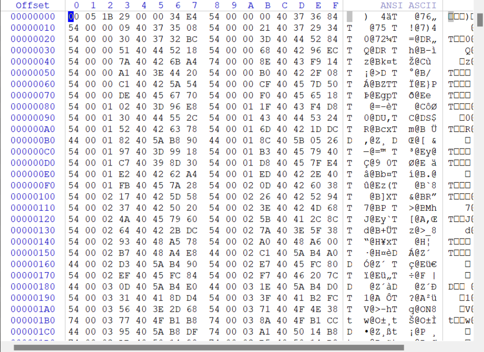  
所以开头+8 \* 13540（0x34E4）= 108328（0x1a728）  
所以写接下来对这些字符进行修复，网上大多为python2脚本，笔者为python3环境较多就写了个python3脚本

```
import binascii
import idautils
import idc
import idaapi

symfile_path = 'E:\StudyData\IotSec\Vxworks\15CBBA'    
symbols_table_start = 8
strings_table_start = 0x1a728

with open(symfile_path, 'rb') as f:
    symfile_contents = f.read()

symbols_table = symfile_contents[symbols_table_start:strings_table_start]
strings_table = symfile_contents[strings_table_start:]

def get_string_by_offset(offset):
    index = 0
    while True:
        if strings_table[offset+index] != b'\x00'[0]:  # 直接比较字节值
            index += 1
        else:
            break
    return strings_table[offset:offset+index].decode('utf-8', 'ignore')  # 添加解码

def get_symbols_metadata():
    symbols = []
    for offset in range(0, len(symbols_table), 8):  # xrange->range
        symbol_item = symbols_table[offset:offset+8]
        flag = symbol_item[0]  # 直接获取整数值
        
        # 使用binascii处理字节转十六进制
        string_offset = int(binascii.b2a_hex(symbol_item[1:4]).decode(), 16)
        string_name = get_string_by_offset(string_offset)
        
        target_address = int(binascii.b2a_hex(symbol_item[-4:]).decode(), 16)
        symbols.append((flag, string_name, target_address))
    return symbols

def add_symbols(symbols_meta_data):
    for flag, string_name, target_address in symbols_meta_data:
        idc.set_name(target_address, string_name) 
        if flag == 0x54:  
            idc.create_insn(target_address)  
            idc.add_func(target_address)     

if __name__ == "__main__":
    symbols_metadata = get_symbols_metadata()
    add_symbols(symbols_metadata)
```

修复后为  
  
之后就可以进行漏洞挖掘

## 4.例子

我们可以看到相关函数已经解开了，所以以固件的CVE作为例子  
参考原来固件的CVE-2022-26987，可以看到 tWlanTask函数在recvfrom注入数据经过 MmtAtePrase 解析  
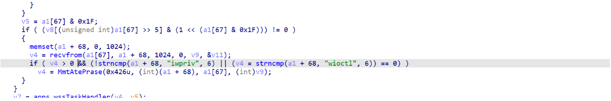  
但往下看MmtAtePrase 未严格校验输入，依旧导致了数据未正确截断导致溢出  
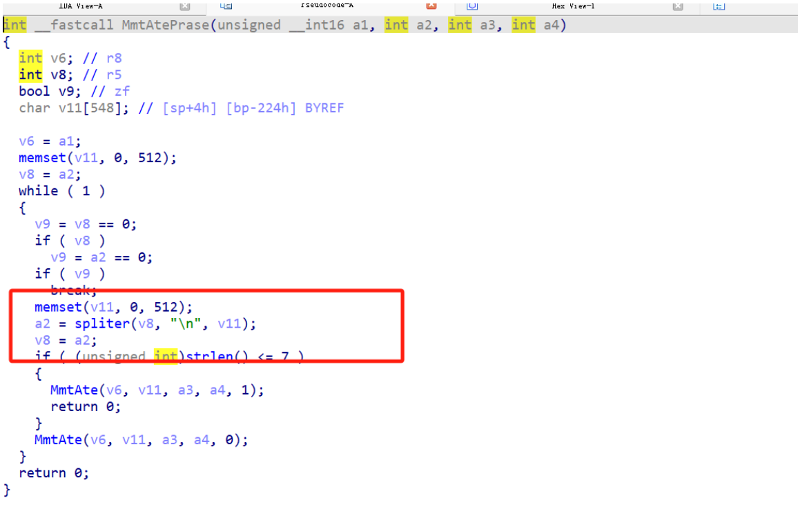

## 5.参考

[基于 VxWorks 的嵌入式设备固件分析方法介绍](https://paper.seebug.org/771/)   
[Vxworks官方手册](https://www.uio.no/studier/emner/matnat/fys/FYS4220/h11/undervisningsmateriale/laboppgaver-rt/vxworks_architecture_supplement_6.2.pdf)
